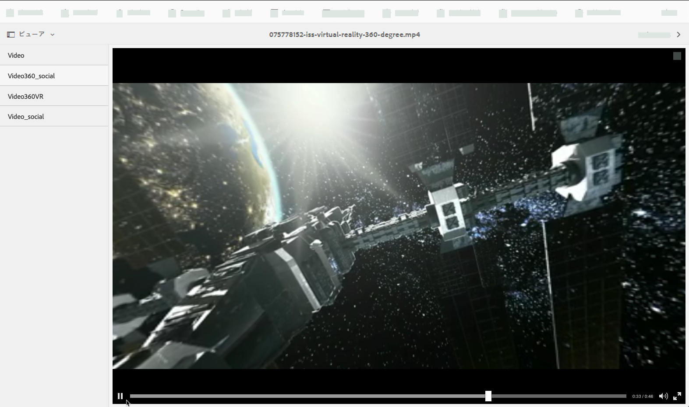
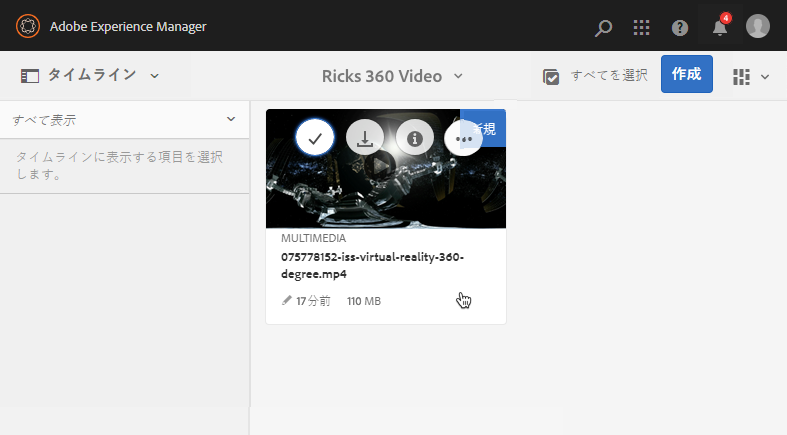
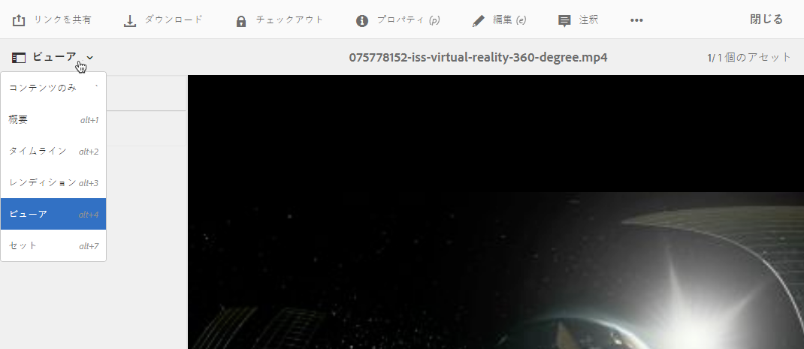
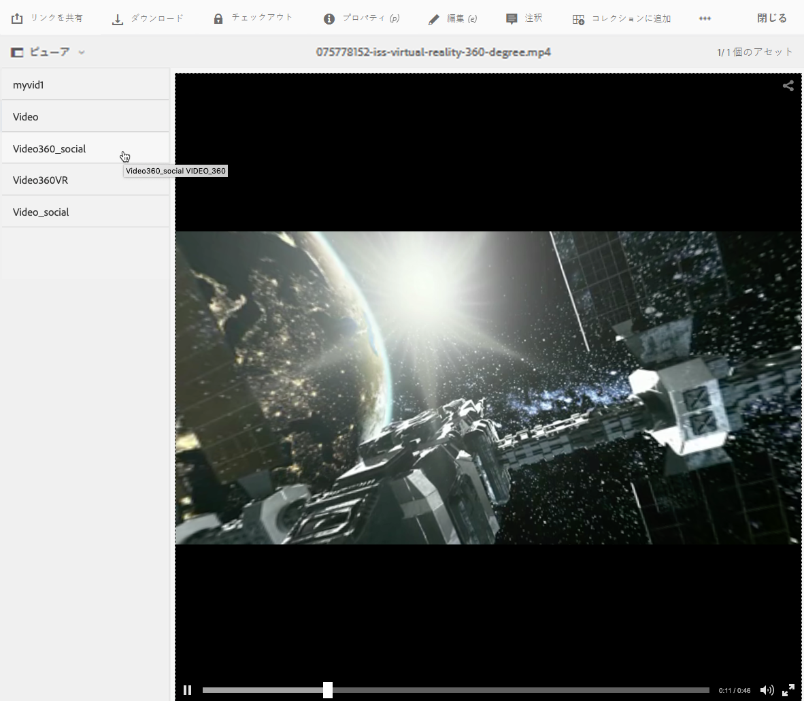
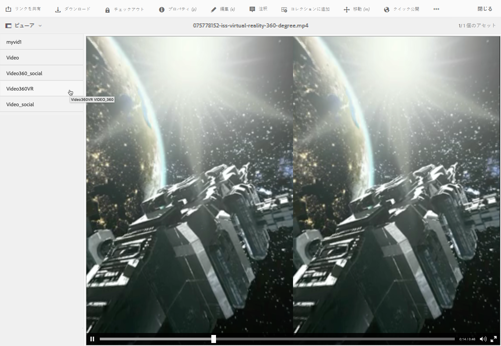

# 360/VR ビデオ {#vr-video}

360 度ビデオでは、すべての方向のビューが同時に記録されます。このタイプのビデオは、全方位カメラやカメラのコレクションを使用して撮影されます。フラットディスプレイでの再生時には、ユーザーは視野角を制御できます。また、モバイルデバイスでの再生では通常、デバイス組み込みのジャイロスコープ制御を利用します。

Dynamic Media - Scene7 モードには、360 ビデオアセット配信のネイティブサポートが含まれています。デフォルトでは、表示または再生するための追加設定は不要です。360 ビデオは、.mp4、.mkv、.mov といった標準のビデオ拡張子を使用して配信されます。最も一般的なコーデックは H.264 です。

この節では、360/VR ビデオビューアを操作して、部屋、物件、場所、風景、医療処置などの没入感のある視聴体験のために、エクイレクタングラー形式のビデオをレンダリングする方法について説明します。

空間オーディオは現在サポートされていません。オーディオをステレオにミックスした場合、お客様がカメラの表示角度を変更してもバランス（L/R）は変化しません。

[ビューアプリセットの管理](/help/assets/managing-viewer-presets.md)も参照してください。

## 360 ビデオの視聴 {#video-in-action}

「[Space Station 360](http://mobiletest.scene7.com/s7viewers/html5/Video360Viewer.html?asset=Viewers/space_station_360-AVS)」をタップして、ブラウザーウィンドウを開き、360 度ビデオを視聴します。ビデオ再生中にマウスポインターを新しい位置にドラッグすると、表示角度が変更されます。

*Space Station 360（国際宇宙ステーションの 360 度ビデオ）のビデオフレーム*

## 360/VR ビデオと Adobe Premiere Pro {#vr-video-and-adobe-premiere-pro}

Adobe Premier Pro を使用すれば、360/VR シーンを表示および編集できます。例えば、シーン内にロゴやテキストを適切に配置したり、エクイレクタングラー形式のメディアに特化して設計されたエフェクトやトランジションを適用したりできます。

[360/VR ビデオの編集](https://helpx.adobe.com/jp/premiere-pro/how-to/edit-360-vr-video.html)を参照してください。

## 360 ビデオビューアで使用するアセットのアップロード {#uploading-assets-for-use-with-the-video-viewer}

AEM にアップロードされた 360 ビデオアセットには、通常のビデオアセットの場合と同じく、アセットページで「**マルチメディア**」というラベルが付けられます。

*アップロードされた 360 ビデオアセット（カード表示）。アセットには「マルチメディア」というラベルが付けられます。*

**360 ビデオビューアで使用するアセットをアップロードするには：**

1. 360 ビデオアセット専用のフォルダーを作成します。
1. [アダプティブビデオプロファイルをフォルダーに適用します。](/help/assets/video-profiles.md#applying-a-video-profile-to-folders)

   360 ビデオコンテンツをレンダリングする場合、ソースビデオの解像度とレンディションのエンコード解像度に関する要件が、標準の非 360 ビデオコンテンツの場合よりも高くなります。

   Dynamic Media に付属している、既製のアダプティブビデオプロファイルを使用してもかまいません。ただしその場合、同じ設定でエンコードされた非 360 ビデオを非 360 ビデオビューアでレンダリングする場合と比べ、360 ビデオの品質のほうが低く感じられることに注意してください。したがって、高品質の 360 ビデオが必要な場合は、以下の操作をおこなってください。

   * できれば、元の 360 ビデオコンテンツの解像度は次のいずれかにしてください。

      * 1080p - 1920 x 1080：フル HD または FHD 解像度と呼ばれます。
      * 2160p - 3840 x 2160：4K、UHD または Ultra HD 解像度と呼ばれます。この非常に大きなディスプレイ解像度は、ハイエンドのテレビセットやコンピューターモニターでよく見られます。2160p 解像度がよく「4K」と呼ばれるのは、その幅が 4000 ピクセルに近いからです。つまり、そのピクセル数は 1080p の 4 倍になります。
   * [より高品質のレンディションを含むカスタムアダプティブビデオプロファイル](/help/assets/video-profiles.md#creating-a-video-encoding-profile-for-adaptive-streaming)を作成します。例えば、次の 3 つの設定を含むアダプティブビデオプロファイルを作成します。

      * width=auto; height=720; bitrate=2500 kbps
      * width=auto; height=1080; bitrate=5000 kbps
      * width=auto; height=1440; bitrate=6600 kbps
   * 360 ビデオアセット専用のフォルダー内の 360 ビデオコンテンツを処理します。

   このアプローチを使用する場合、エンドユーザーのネットワークや CPU の要件も高くなることに注意してください。

1. [フォルダーにビデオをアップロードします](/help/assets/managing-video-assets.md#upload-and-preview-video-assets)。

## 360 ビデオのデフォルト縦横比のオーバーライド  {#overriding-the-default-aspect-ratio-of-videos}

アップロードしたアセットを、360 ビデオビューアで使用する 360 ビデオにするには、アセットの縦横比が 2 である必要があります。

AEM ではデフォルトで、縦横比（幅 / 高さ）が 2.0 のビデオを「」として検出します。管理者であれば、CRXDE Lite で次の場所にあるオプションの `s7video360AR`360 プロパティを設定して、縦横比のデフォルト設定である「2」をオーバーライドすることができます。

* `/conf/global/settings/cloudconfigs/dmscene7/jcr:content`

   * **プロパティタイプ**：Double
   * **値**：縦横比を表す浮動小数点、デフォルト 2.0。

このプロパティの設定が完了すると、既存のビデオと新しくアップロードされたビデオの両方で、すぐに設定が有効になります。

この縦横比は、アセットの詳細ページや[ビデオ 360 メディア WCM コンポーネント](/help/assets/adding-dynamic-media-assets-to-pages.md#dynamic-media-components)向けの 360 ビデオアセットに適用されます。

まず、360 ビデオをアップロードします。

## 360 ビデオのプレビュー {#previewing-video}

プレビューを使用すれば、360 ビデオがお客様にどのように表示されるかを確認し、ビデオが期待どおりに動作していることを確認できます。

[ビューアプリセットの編集](/help/assets/managing-viewer-presets.md#editing-viewer-presets)も参照してください。

360 ビデオの設定が完了したら、このビデオを公開できます。

[Web ページへのビデオビューアまたは画像ビューアの埋め込みを参照してください。](https://helpx.adobe.com/experience-manager/6-5/help/assets/embed-code.html)[Web アプリケーションへの URL のリンク](https://helpx.adobe.com/experience-manager/6-5/help/assets/linking-urls-to-yourwebapplication.html)を参照してください。インタラクティブコンテンツに相対 URL のリンク（特に AEM Sites ページへのリンク）がある場合、URL ベースのリンク方法は使用できません。[ページへの Dynamic Media アセットの追加](https://helpx.adobe.com/experience-manager/6-5/help/assets/adding-dynamic-media-assets-to-pages.html)を参照してください。

**360 ビデオをプレビューするには**

1. **[!UICONTROL Assets]** で、作成した既存の 360 ビデオに移動します。360 ビデオアセットをタップしてプレビューモードで開きます。

   

   360 ビデオアセットをタップしてビデオをプレビューします。

1. On the preview page, near the upper-left corner of the page, tap the drop-down list, then select **[!UICONTROL Viewers.]**

   

   「ビューア」リストから **[!UICONTROL Video360_social]** をタップした後、次のいずれかの操作をおこないます。

   * ビデオの上でマウスポインターをドラッグして、静的なシーンの表示角度を変更します。
   * ビデオの&#x200B;**[!UICONTROL 再生]**&#x200B;ボタンをタップして再生を開始します。ビデオの再生中にビデオの上でマウスポインターをドラッグして、表示角度を変更します。

   *360 ビデオのスクリーンショット*

   * From the Viewers list, tap **[!UICONTROL Video360VR.]**

      バーチャルリアリティ（VR）ビデオは、バーチャルリアリティヘッドセットを通じてアクセスする、没入感のあるビデオコンテンツです。通常のビデオと同様に、360 度ビデオカメラを使用してビデオを録画またはキャプチャする際、最初に VR ビデオを作成します。
   
   *360 VR ビデオのスクリーンショット。*

1. Near the upper-right of the preview page, tap **[!UICONTROL Close.]**

## 360 ビデオの公開 {#publishing-video}

360 ビデオを使用するには公開する必要があります。360 ビデオを公開すると、URL と埋め込みコードがアクティベートされます。また、スケーラブルで効率の良い配信のために CDN と統合された Dynamic Media クラウドにも、360 ビデオが公開されます。

360 ビデオの公開方法について詳しくは、[Dynamic Media アセットの公開](/help/assets/publishing-dynamicmedia-assets.md)を参照してください。[Web ページへのビデオビューアまたは画像ビューアの埋め込み](https://helpx.adobe.com/experience-manager/6-5/help/assets/embed-code.html)も参照してください。[Web アプリケーションへの URL のリンク](https://helpx.adobe.com/experience-manager/6-5/help/assets/linking-urls-to-yourwebapplication.html)も参照してください。インタラクティブコンテンツに相対 URL のリンク（特に AEM Sites ページへのリンク）がある場合、URL ベースのリンク方法は使用できません。[ページへの Dynamic Media アセットの追加](https://helpx.adobe.com/experience-manager/6-5/help/assets/adding-dynamic-media-assets-to-pages.html)も参照してください。
