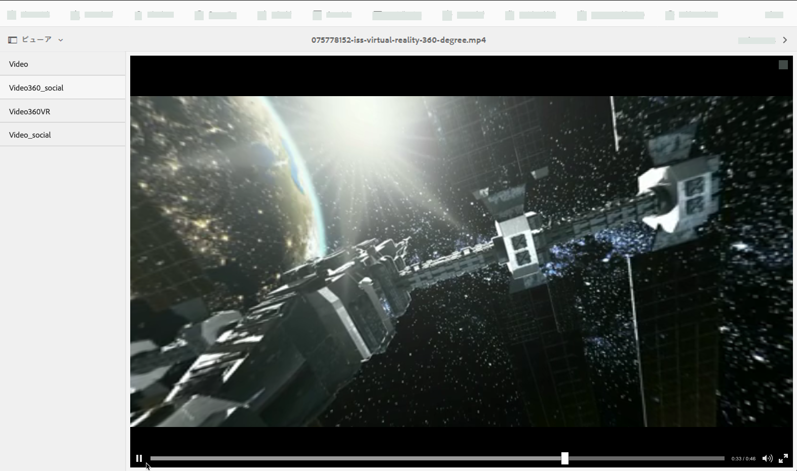
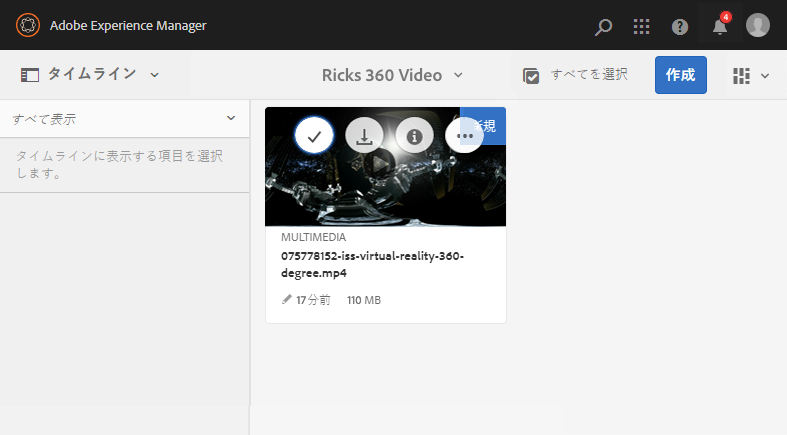
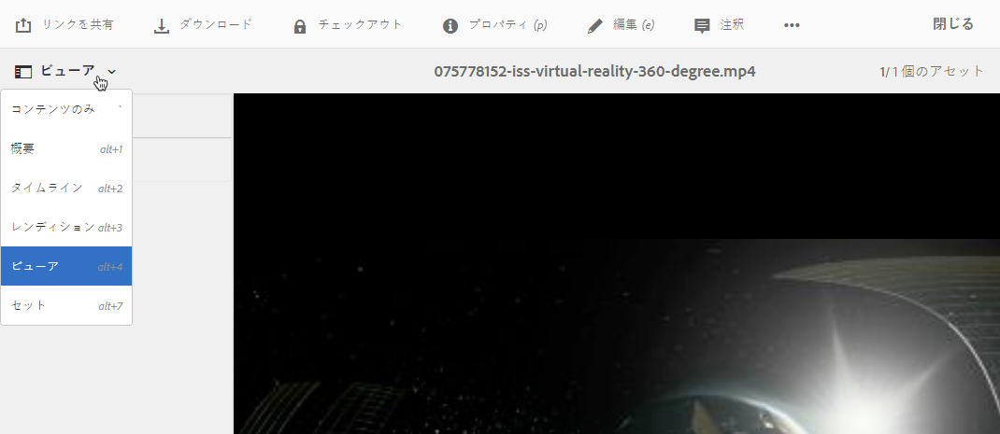
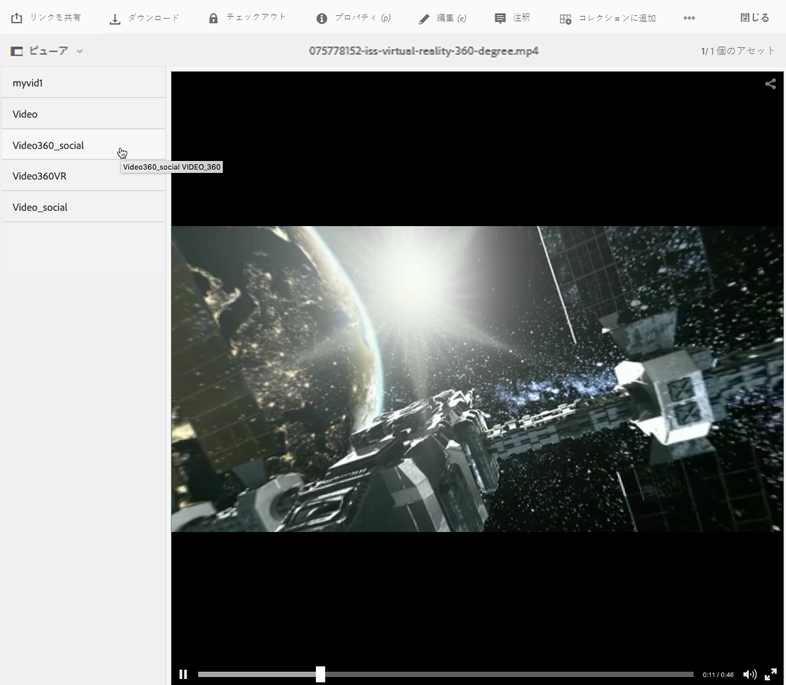
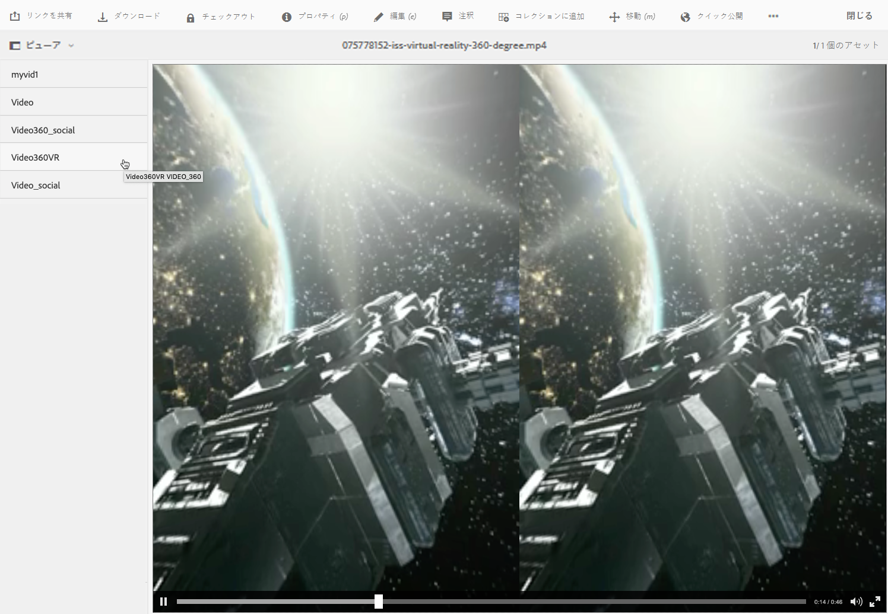

# 360/VR ビデオ {#vr-video}

360 度ビデオでは、すべての方向のビューが同時に記録されます。 このタイプのビデオは、全方位カメラやカメラのコレクションを使用して撮影されます。 フラットディスプレイでの再生時には、ユーザーは視野角を制御できます。また、モバイルデバイスでの再生では通常、デバイスビルトインのジャイロスコープ制御を使用します。

Dynamic Media - Scene7 モードには、360 度ビデオアセット配信のネイティブサポートが含まれています。 デフォルトでは、表示や再生のために追加の設定は必要ありません。 360 ビデオは、.mp4、.mkv、.mov などの標準のビデオ拡張子を使用して配信します。 最も一般的なコーデックは H.264 です。

この節では、360/VR ビデオビューアを操作して、部屋、物件、場所、風景、医療処置などの没入感のある視聴体験のために、エクイレクタングラー形式のビデオをレンダリングする方法について説明します。

空間オーディオは現在サポートされていません。オーディオをステレオにミックスした場合、お客様がカメラの表示角度を変更してもバランス（L/R）は変化しません。

詳しくは、[ビューアプリセットの管理](/help/assets/managing-viewer-presets.md)を参照してください。

## 360 ビデオの再生 {#video-in-action}

「[Space Station 360](https://s7d1.scene7.com/s7viewers/html5/Video360Viewer.html?asset=Viewers/space_station_360-AVS)」を選択して、ブラウザーウィンドウを開き、360 度ビデオを視聴します。 ビデオ再生中にマウスポインターを新しい位置にドラッグすると、表示角度が変更されます。

*宇宙ステーション 360*&#x200B;からのビデオフレーム

## 360/VR ビデオと Adobe Premiere Pro {#vr-video-and-adobe-premiere-pro}

Adobe Premier Pro を使用して、360/VR フッテージを表示および編集できます。 例えば、シーン内にロゴやテキストを適切に配置したり、エクイレクタングラー形式のメディアに特化して設計されたエフェクトやトランジションを適用したりできます。

[360/VR ビデオの編集](https://helpx.adobe.com/jp/premiere-pro/how-to/edit-360-vr-video.html)を参照してください。

## 360 ビデオビューアで使用するアセットのアップロード {#uploading-assets-for-use-with-the-video-viewer}

Adobe Experience Manager にアップロードされた 360 ビデオアセットには、通常のビデオアセットの場合と同じく、アセットページで&#x200B;**マルチメディア**&#x200B;というラベルが付けられます。

*アップロードされた360度ビデオアセットがカード表示に表示されます。 アセットには「マルチメディア」というラベルが付けられます。*

**360 ビデオビューアで使用するアセットをアップロードするには：**

1. 360 ビデオアセット専用のフォルダーを作成します。
1. [フォルダーにアダプティブビデオプロファイルを適用します](/help/assets/video-profiles.md#applying-a-video-profile-to-folders)。

   360 ビデオコンテンツをレンダリングする場合、ソースビデオの解像度とレンディションのエンコード解像度に関する要件が、標準の非 360 ビデオコンテンツの場合よりも高くなります。

   Dynamic Media に付属している、既製のアダプティブビデオプロファイルを使用してもかまいません。 ただしその場合は、同じ設定でエンコードされた非 360 ビデオを非 360 ビデオビューアでレンダリングする場合と比べ、360 ビデオの品質のほうが低く感じられるようになります。 したがって、高品質の 360 ビデオが必要な場合は、以下の操作を行ってください。

   * できれば、元の 360 ビデオコンテンツの解像度は次のいずれかにしてください。

      * 1080p - 1920 x 1080：フル HD または FHD 解像度と呼ばれます。
      * 2160p - 3840 x 2160：4K、UHD または Ultra HD 解像度と呼ばれます。 この大きなディスプレイ解像度は、ハイエンドのテレビやコンピューターモニターでよく見られます。 2160p 解像度がよく「4K」と呼ばれるのは、その幅が 4000 ピクセルに近いからです。 つまり、そのピクセル数は 1080p の 4 倍になります。

   * より高品質のレンディションを含む[カスタムアダプティブビデオプロファイルを作成](/help/assets/video-profiles.md#creating-a-video-encoding-profile-for-adaptive-streaming)します。 例えば、次の 3 つの設定を含むアダプティブビデオプロファイルを作成します。

      * width=auto; height=720; bitrate=2500 kbps
      * width=auto; height=1080; bitrate=5000 kbps
      * width=auto; height=1440; bitrate=6600 kbps

   * 360 ビデオアセット専用のフォルダー内の 360 ビデオコンテンツを処理します。

   このアプローチを使用する場合は、エンドユーザーのネットワークや CPU の要件も高くなります。

1. [フォルダーにビデオをアップロードします](/help/assets/managing-video-assets.md#upload-and-preview-video-assets)。

## 360 ビデオのデフォルト縦横比のオーバーライド  {#overriding-the-default-aspect-ratio-of-videos}

アップロードしたアセットを、360 ビデオビューアで使用する 360 ビデオにするには、アセットの縦横比が 2 である必要があります。

デフォルトでは、Experience Managerは、縦横比（幅/高さ）が2.0の場合、ビデオを「360」として検出します。 管理者の場合は、CRXDE Liteのオプションの`s7video360AR` プロパティを次の場所に設定することで、デフォルトの縦横比の設定である2を上書きできます。

* `/conf/global/settings/cloudconfigs/dmscene7/jcr:content`

   * **プロパティタイプ**：Double
   * **値**：縦横比を表す浮動小数点（デフォルトは 2.0）。

このプロパティの設定が完了すると、既存のビデオと新しくアップロードされたビデオの両方で、すぐに設定が有効になります。

この縦横比は、アセットの詳細ページや[ビデオ 360 メディア WCM コンポーネント](/help/assets/adding-dynamic-media-assets-to-pages.md#dynamic-media-components)向けの 360 ビデオアセットに適用されます。

まず、360 ビデオをアップロードします。

## 360 ビデオのプレビュー {#previewing-video}

プレビューを使用すれば、360 ビデオがお客様にどのように表示されるかを確認し、ビデオが期待どおりに動作していることを確認できます。

[ビューアプリセットの編集](/help/assets/managing-viewer-presets.md#editing-viewer-presets)も参照してください。

360 ビデオの設定が完了したら、このビデオを公開できます。

「[Web ページへのビデオビューアまたは画像ビューアの埋め込み](/help/assets/embed-code.md)」を参照してください。
「[Web アプリケーションへのURLのリンク &#x200B;](/help/assets/linking-urls-to-yourwebapplication.md)」を参照してください。インタラクティブコンテンツに相対URL （特にExperience Manager Sites ページへのリンク）を含むリンクがある場合、URL ベースのリンクは使用できません。
[&#x200B; ページへのDynamic Media Assetsの追加](/help/assets/adding-dynamic-media-assets-to-pages.md)を参照してください。

**360 ビデオをプレビューするには：**

1. **[!UICONTROL Assets]** で、作成した既存の 360 ビデオに移動します。 360 ビデオアセットを選択すると、プレビューモードで開くことができます。

   

   360 ビデオアセットを選択すると、ビデオをプレビューできます。

1. プレビューページで、ページの左上隅付近にあるドロップダウンリストを選択し、「**[!UICONTROL ビューア]**」を選択します。

   

   「ビューア」リストから **[!UICONTROL Video360_social]** を選択した後、次のいずれかの操作を行います。

   * 静的なシーンの視野角を変更するには、ビデオの上でマウスポインターをドラッグします。
   * 再生を開始するには、ビデオの「**[!UICONTROL 再生]**」ボタンを選択します。 ビデオの再生中にビデオ上でマウスポインターをドラッグすると、視野角を変更できます。

   *360 ビデオのスクリーンショット*

   * 「ビューア」リストから **[!UICONTROL Video360VR]** を選択します。

     バーチャルリアリティ（VR）ビデオは、バーチャルリアリティヘッドセットで視聴する、没入感のあるビデオコンテンツです。 通常のビデオと同様に、360 度ビデオカメラを使用してビデオを録画またはキャプチャする際、最初に VR ビデオを作成します。

   
   *360 VR ビデオのスクリーンショット。*

1. プレビューページの右上隅付近にある「**[!UICONTROL 閉じる]**」を選択します。

## 360 ビデオの公開 {#publishing-video}

360 ビデオを公開して使用できるようにします。 360 ビデオを公開すると、URL と埋め込みコードがアクティベートされます。 また、スケーラブルで効率の良い配信のために CDN と統合された Dynamic Media クラウドにも、360 ビデオが公開されます。

360 ビデオの公開方法について詳しくは、[Dynamic Media アセットの公開](/help/assets/publishing-dynamicmedia-assets.md)を参照してください。
「[Web ページへのビデオビューアまたは画像ビューアの埋め込み](/help/assets/embed-code.md)」も参照してください。
[Web アプリケーションへのURLのリンク &#x200B;](/help/assets/linking-urls-to-yourwebapplication.md)も参照してください。インタラクティブコンテンツに相対URL （特にExperience Manager Sites ページへのリンク）を含むリンクがある場合、URL ベースのリンクは使用できません。
[&#x200B; ページへのDynamic Media アセットの追加](/help/assets/adding-dynamic-media-assets-to-pages.md)も参照してください。
