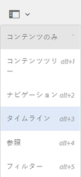
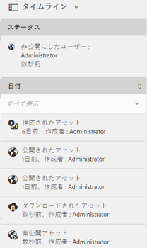

# タイムラインのアクティビティストリーム {#activity-stream-in-timeline}

この機能は、タイムラインにアセットのアクティビティログを表示します。Adobe Experience Managerアセットで以下のアセット関連の操作を実行すると、アクティビティストリーム機能によってタイムラインが更新され、アクティビティが反映されます。

アクティビティストリームでログに記録される操作は次のとおりです。

* 作成
* 削除
* ダウンロード（レンディションを含む）
* 公開
* 非公開
* 承認
* 拒否
* 移動

タイムラインに表示されるアクティビティログは、ログファイルが格納されている CRX の `/var/audit/com.day.cq.dam/content/dam` から取得されます。In addition, timeline activity is logged when new assets are uploaded or existing asses are modified and checked into Experience Manager via [Adobe Asset Link](https://helpx.adobe.com/jp/enterprise/using/manage-assets-using-adobe-asset-link.html) or [Experience Manager desktop app](https://docs.adobe.com/content/help/en/experience-manager-desktop-app/using/release-notes.html).

>[!NOTE]
>
>一時的なワークフローは、履歴情報が保存されないので、タイムラインに表示されません。

アクティビティストリームを表示するには、アセットに対して 1 つ以上の操作を実行して、アセットを選択してから、グローバルナビゲーションリストから&#x200B;**[!UICONTROL タイムライン]**&#x200B;を選択します。

タイムラインに、アセットに対して実行した操作のアクティビティストリームが表示されます。

>[!NOTE]
>
>**[!UICONTROL 公開]**&#x200B;タスクと&#x200B;**[!UICONTROL 非公開]**&#x200B;タスクのデフォルトのログ保管先は `/var/audit/com.day.cq.replication/content` です。**[!UICONTROL 移動]**&#x200B;タスクの場合は、デフォルトの保管先は `/var/audit/com.day.cq.wcm.core.page` になります。
