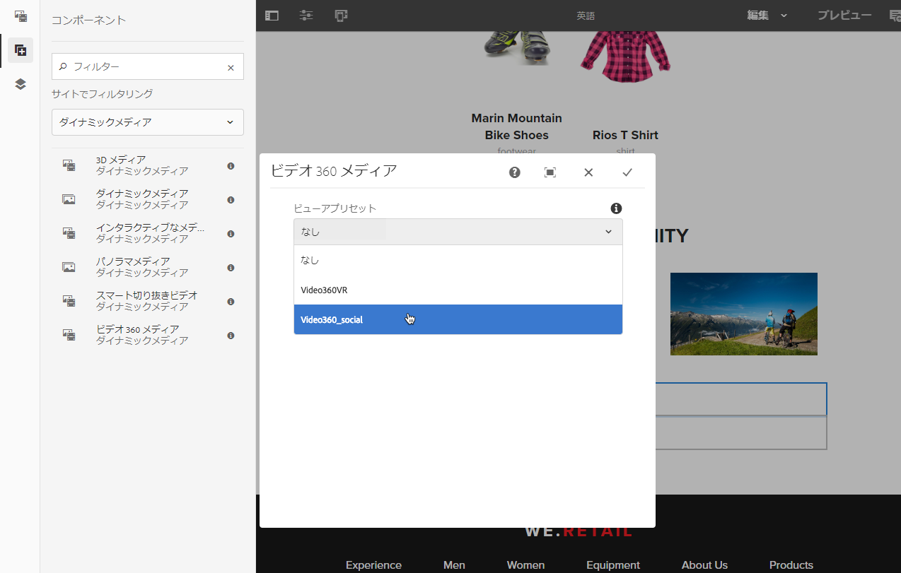
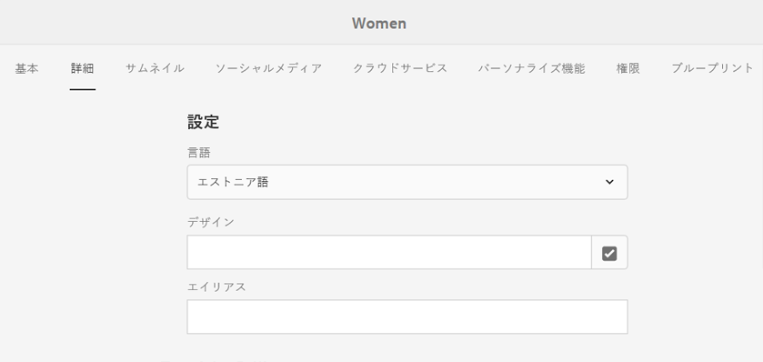
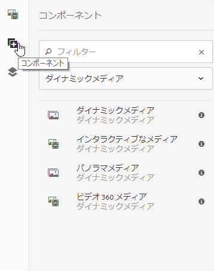
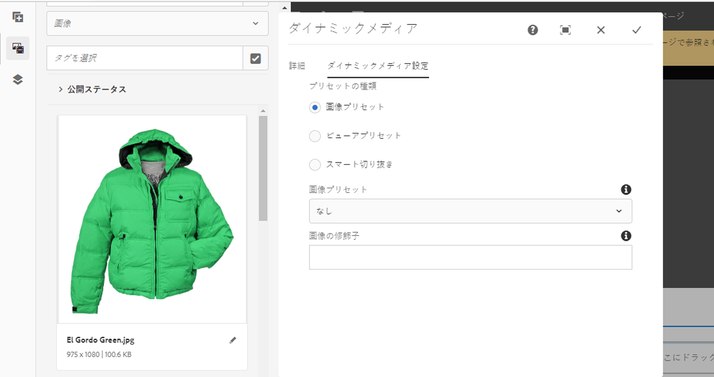
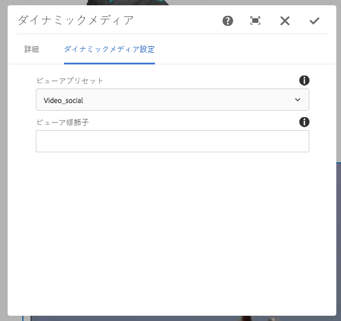
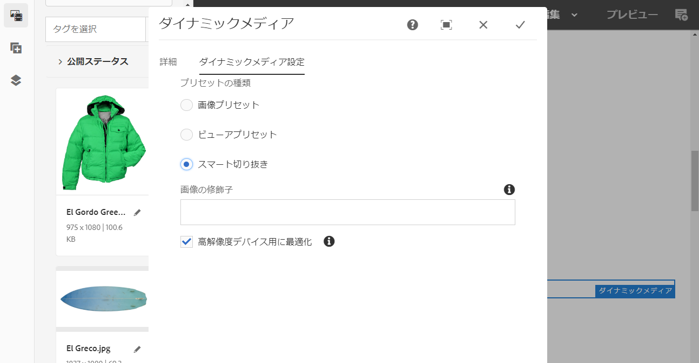
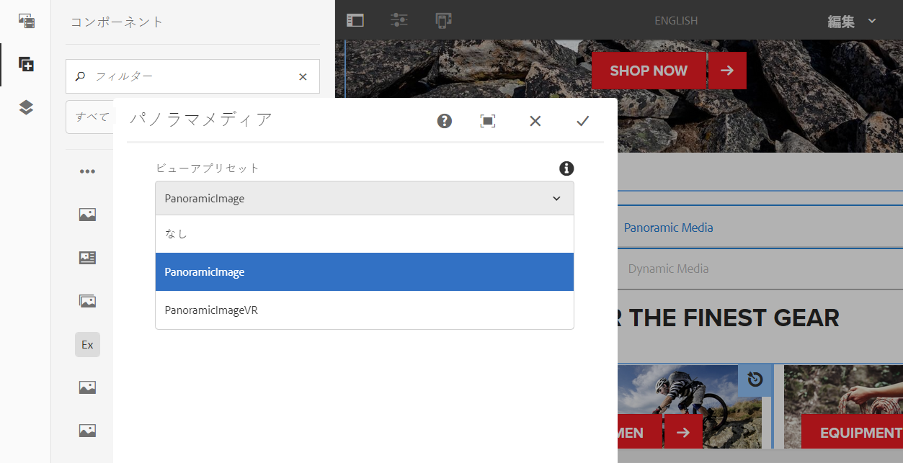
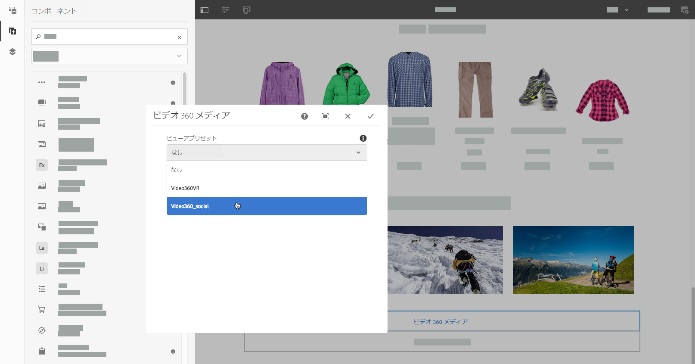

# ページへの Dynamic Media アセットの追加 {#adding-dynamic-media-assets-to-pages}

Web サイトで使用するアセットに Dynamic Media 機能を追加するには、**Dynamic Media**、**インタラクティブメディア**、**パノラマメディア**、**ビデオ 360 メディア**&#x200B;のいずれかのコンポーネントをページに直接追加します。コンポーネントを追加するには、レイアウトモードに入り、Dynamic Mediaコンポーネントを有効にします。 次に、これらのコンポーネントをページに追加し、そのコンポーネントにアセットを追加できます。Dynamic Media コンポーネントはスマートです。追加しようとしているアセットが画像、ビデオのどちらなのかが検出され、それに応じて利用可能なオプションが変わります。

Adobe Experience ManagerをWCMとして使用している場合は、Dynamic Mediaアセットを直接ページに追加します。 サードパーティの製品を WCM として使用している場合は、アセットの[リンク](/help/assets/linking-urls-to-yourwebapplication.md)または[埋め込み](/help/assets/embed-code.md)を行います。サードパーティのレスポンシブ Web サイトの場合は、[レスポンシブサイトへの最適化された画像の配信](/help/assets/responsive-site.md)を参照してください。

>[!NOTE]
>
>アセットをページに追加する前に、必ずアセットをExperience Managerに公開してください。 [Dynamic Media アセットの公開](/help/assets/publishing-dynamicmedia-assets.md)を参照してください。

## ページへの Dynamic Media コンポーネントの追加 {#adding-a-dynamic-media-component-to-a-page}

3D メディア、Dynamic Media、インタラクティブメディア、パノラマメディア、スマート切り抜きビデオ、ビデオ 360 メディアのいずれかのコンポーネントを 1 つのページに追加することは、コンポーネントを任意のページに追加することと同じです。Dynamic Media コンポーネントについては、後の節で説明します。

1. Dynamic Media コンポーネントを追加するページを Experience Manager で開きます。
1. ページの左側にあるパネルで（必要に応じて、サイドパネルの表示を切り替えます）、**[!UICONTROL コンポーネント]**&#x200B;アイコンをクリックします。
1. 「**[!UICONTROL コンポーネント]**」見出しの下にあるドロップダウンリストで、「**[!UICONTROL Dynamic Media]**」を選択します。

   使用可能なDynamic Mediaコンポーネントのリストがない場合は、使用するDynamic Mediaコンポーネントを有効にする必要があります。 詳しくは、[Dynamic Media コンポーネントの有効化](#enabling-dynamic-media-components)を参照してください。

   

1. 使用する&#x200B;**[!UICONTROL Dynamic Media]**&#x200B;コンポーネントをドラッグし、ページ上の目的の場所にドロップします。

1. コンポーネントの上に直接マウスポインターを置きます。コンポーネントが青色のボックスで囲まれた時点で 1 回タップすると、コンポーネントのツールバーが表示されます。**[!UICONTROL 設定（レンチ）]** アイコンをタップします。

   

1. ページにドロップした Dynamic Media コンポーネントに対応する設定ダイアログボックスが開きます。必要に応じて、[コンポーネントのオプションを設定します](/help/assets/adding-dynamic-media-assets-to-pages.md#dynamic-media-components)。

   以下の例では、Dynamic Media **[!UICONTROL ビデオ 360 メディア]**&#x200B;コンポーネントのダイアログボックスと、「ビューアプリセット」ドロップダウンリストで利用可能なオプションが表示されています。

   

   Dynamic Media ビデオ 360 メディアコンポーネント。

1. 完了したら、ダイアログボックスの右上隅にあるチェックマークをタップして、変更を保存します。

### Dynamic Media コンポーネントの有効化 {#enabling-dynamic-media-components}

ページに追加できるDynamic Mediaコンポーネントがない場合は、使用するコンポーネントをまず有効にする必要がある可能性があります。

1. Dynamic Media コンポーネントを追加するページを Experience Manager で開きます。
1. ページ上部付近のツールバーの左側にあるページ情報アイコンをタップした後、ドロップダウンリストから「**[!UICONTROL テンプレートを編集]**」をタップします。

   

1. ページ上部付近のツールバーの右側で、ドロップダウンリストから「**[!UICONTROL 構造]**」をタップします。

   

1. ページ下部付近の「**[!UICONTROL レイアウトコンテナ]**」をタップしてツールバーを開き、ポリシーアイコンをタップします。
1. **[!UICONTROL レイアウトコンテナ]**&#x200B;ページの「**[!UICONTROL プロパティ]**」見出しの下で、「**[!UICONTROL 許可されたコンポーネント]**」タブが選択されていることを確認します。

   

1. **[!UICONTROL Dynamic Media.]**&#x200B;が表示されるまでスクロールします。
1. **[!UICONTROL Dynamic Media]**&#x200B;の左側にある「>」アイコンをタップしてリストを展開し、有効にするDynamic Mediaコンポーネントを選択します。

   

1. **[!UICONTROL レイアウトコンテナ]**&#x200B;ページの右上隅付近にある「完了」（チェックマーク）アイコンをタップします。

1. ページ上部付近のツールバーの右側で、ドロップダウンリストから「**[!UICONTROL 初期コンテンツ]**」をタップした後、通常どおりに[ページに Dynamic Media コンポーネントを追加](#adding-a-dynamic-media-component-to-a-page)します。

## Dynamic Media コンポーネントのローカライズ {#localizing-dynamic-media-components}

Dynamic Media コンポーネントのローカライズの方法は 2 つあります。

* Sites の Web ページ内で、**[!UICONTROL プロパティ]**&#x200B;を開き、「**[!UICONTROL 詳細]**」タブを選択します。ローカライズに使用したい言語を選択します。

   

* サイトセレクターからページあるいはページグループを選択します。「**[!UICONTROL プロパティ]**」をタップし、「**[!UICONTROL 詳細]**」タブを選択します。ローカライズに使用したい言語を選択します。

   >[!NOTE]
   >
   >現在&#x200B;**[!UICONTROL 言語]**&#x200B;メニューに表示される言語すべてにトークンが割り当てられているわけではないことに注意してください。

## Dynamic Media コンポーネント {#dynamic-media-components}

Dynamic Mediaコンポーネントは、**[!UICONTROL コンポーネント]**&#x200B;アイコンをタップし、**[!UICONTROL Dynamic Mediaでフィルターすると使用できます。]**

利用可能な Dynamic Media コンポーネントは次のとおりです。

* **[!UICONTROL ダイナミックメディア]** - 画像、ビデオ、eCatalog、スピンセットなどのアセットに使用します。
* **[!UICONTROL インタラクティブメディア]** - すべてのインタラクティブアセット（インタラクティブビデオ、インタラクティブ画像、カルーセルセットなど）に使用します。
* **[!UICONTROL パノラマメディア -]** パノラマ画像またはパノラマ VR 画像アセットに使用します。
* **[!UICONTROL ビデオ 360 メディア]** - 360 ビデオおよび 360 VR ビデオアセットに使用します。

>[!NOTE]
>
>これらのコンポーネントは、デフォルトでは使用できません。これらを使用する前に、テンプレートエディターを通じて使用可能にする必要があります。 [テンプレートエディターで](/help/sites-authoring/templates.md#editing-templates-template-authors)使用可能にした後は、他のExperience Managerコンポーネントと同様に、ページに追加できます。

### Dynamic Media コンポーネント {#dynamic-media-component}

Dynamic Media コンポーネントはスマートであり、追加しているアセットが画像であるかビデオであるかに応じて、様々なオプションを使用できます。このコンポーネントは画像プリセット、画像ベースのビューア（画像セット、スピンセット、混在メディアセットなど）およびビデオをサポートします。また、レスポンシブなビューアなので、画面のサイズは画面のサイズに基づいて自動的に変更されます。 すべてのビューアは HTML5 ビューアです。

>[!NOTE]
>
>Web ページに次のものが含まれている場合：
>
>* 同じページで使用されている Dynamic Media コンポーネントの複数のインスタンス。
>* 各インスタンスが同じアセットタイプを使用している。

>
>
そのページの各 Dynamic Media コンポーネントにそれぞれ異なるビューアプリセットを割り当てることは、サポートされていません。
>
>一方、ページ内で、同じタイプのアセットを使用するすべての Dynamic Media コンポーネントで同じビューアプリセットを使用することは可能です。

Dynamic Media コンポーネントを追加したときに、「**[!UICONTROL ダイナミックメディア設定]**」が空であるかアセットを適切に追加できない場合は、次の点を確認してください。

* [Dynamic Media を有効にしている](/help/assets/config-dynamic.md)こと。Dynamic Media はデフォルトで無効になっています。
* 画像が PTIFF（Pyramid TIFF）ファイルであること。Dynamic Mediaを有効にする前に読み込んだ画像には、PTIFF(Pyramid TIFF)ファイルはありません。

#### 画像を操作する場合 {#when-working-with-images}

Dynamic Media コンポーネントでは、画像セット、スピンセット、混在メディアセットなどの動的イメージを追加できます。ズームイン、ズームアウト、スピンセット内での画像の回転（該当する場合）または別のタイプのセットからの画像の選択を行うことができます。

また、ビューアプリセット、画像プリセット、画像形式をコンポーネント内で直接設定することもできます。画像をレスポンシブにするために、ブレークポイントの設定かレスポンシブ画像プリセットの適用のいずれかを実行できます。

コンポーネント内の&#x200B;**[!UICONTROL 編集]**&#x200B;アイコンをタップし、次に&#x200B;**[!UICONTROL Dynamic Media設定]**&#x200B;をタップして、次のDynamic Media設定を編集します。

>[!NOTE]
>
>デフォルトでは、Dynamic Media画像コンポーネントはアダプティブです。画像コンポーネントを固定サイズにする場合は、「**[!UICONTROL 詳細]**」タブのコンポーネントで、「**[!UICONTROL 幅]**」と「**[!UICONTROL 高さ]**」を使用してサイズを設定します。

* **[!UICONTROL ビューアプリセット]**  — ドロップダウンメニューから既存のビューアプリセットを選択します。探しているビューアプリセットが表示されない場合は、表示できるように設定する必要があります。詳しくは、[ビューアプリセットの管理](/help/assets/managing-viewer-presets.md)を参照してください。画像プリセットを使用している場合は、ビューアプリセットを選択できません。逆の場合も同様です。

   画像セット、スピンセットまたは混在メディアセットを表示している場合は、このオプションのみ使用できます。表示されるビューアプリセットはスマートで、関連するビューアプリセットのみが表示されます。

* **[!UICONTROL ビューア修飾子]**  — ビューア修飾子は、name=valueの形式で、&amp;を区切り文字として使用し、ビューアリファレンスガイドで概要を説明しているようにビューアを変更できます。`posterimage=img.jpg&caption=text.vtt,1` はビューア修飾子の一例で、これはビデオのサムネールに異なる画像を設定し、ビデオにクローズキャプションや字幕ファイルを関連付けます。

* **[!UICONTROL 画像プリセット]**  — ドロップダウンメニューから既存の画像プリセットを選択します。探している画像プリセットが表示されない場合は、表示できるように設定する必要があります。「画像プリセットの管理」を参照してください。画像プリセットを使用している場合は、ビューアプリセットを選択できません。逆の場合も同様です。

   このオプションは、画像セット、スピンセットまたは混在メディアセットを表示している場合には使用できません。

* **[!UICONTROL 画像の修飾子]**  — 追加の画像コマンドを指定して、画像エフェクトを適用できます。これらの効果については、画像プリセットおよび画像サービングコマンドリファレンスで説明しています。

   このオプションは、画像セット、スピンセットまたは混在メディアセットを表示している場合には使用できません。

* **[!UICONTROL ブレークポイント]**  — レスポンシブサイトでこのアセットを使用する場合は、画像のブレークポイントを追加する必要があります。画像のブレークポイントはコンマ(,)で区切ります。 このオプションを使用できるのは、画像プリセットで高さまたは幅が定義されていないときです。

   このオプションは、画像セット、スピンセットまたは混在メディアセットを表示している場合には使用できません。

   コンポーネントの「**[!UICONTROL 編集]**」をタップして、次の詳細設定を編集できます。

* **[!UICONTROL 高解像度デバイス向けに最適化]**  - DPR（デバイスピクセル比）の最適化を許可する場合は、このチェックボックスをオン（デフォルト）にします。

   **[!UICONTROL 高解像度デバイス向けの最適化]**&#x200B;オプションは、次の条件が満たされる場合にのみ表示されます。

   * 「プリセットの種類」で、「**[!UICONTROL 画像プリセット]**」を選択し、「**[!UICONTROL 画像プリセット]**」ドロップダウンリストから「**[!UICONTROL RESS_IP]**」を選択します。

   

<!--   See also [About device pixel ratio optimization](/help/assets/imaging-faq.md#dpr). Note that any Adobe Experience Manager Dynamic Media Smart Imaging DPR values are ignored. -->

* **[!UICONTROL タイトル]**  — 画像のタイトルを変更します。

* **[!UICONTROL 代替テキスト]**  — グラフィックの表示をオフにしているユーザー向けのタイトルを画像に追加します。

   このオプションは、画像セット、スピンセットまたは混在メディアセットを表示している場合には使用できません。

* **[!UICONTROL URL、次のウィンドウで開く]**  — リンクを開くようにアセットを設定できます。「URL」と「次のウィンドウで開く」で、同じウィンドウで開くか新しいウィンドウで開くかを指定します。

   このオプションは、画像セット、スピンセットまたは混在メディアセットを表示している場合には使用できません。

* **[!UICONTROL 幅]**  — 画像を固定サイズで表示する場合は、値をピクセル単位で入力します。この値を空にすると、アダプティブなアセットになります。

* **[!UICONTROL 高さ]**  — 画像を固定サイズで表示する場合は、値をピクセル単位で入力します。この値を空にすると、アダプティブなアセットになります。

#### ビデオを操作する場合 {#when-working-with-video}

Dynamic Media コンポーネントを使用して、ダイナミックビデオを Web ページに追加します。コンポーネントの編集時に、ページ上でビデオを再生するための事前定義済みのビデオビューアプリセットを使用するように選択できます。

コンポーネントの「**[!UICONTROL 編集]**」をクリックして、次のDynamic Media設定を編集します。

>[!NOTE]
>
>デフォルトでは、Dynamic Media ビデオコンポーネントはアダプティブです。ビデオコンポーネントを固定サイズにする場合は、そのコンポーネントで、「**[!UICONTROL 詳細]**」タブの「**[!UICONTROL 幅]**」と「**[!UICONTROL 高さ]**」を使用してサイズを設定します。

* **[!UICONTROL ビューアプリセット]**  — ドロップダウンメニューから既存のビデオビューアプリセットを選択します。探しているビューアプリセットが表示されない場合は、表示できるように設定する必要があります。詳しくは、[ビューアプリセットの管理](/help/assets/managing-viewer-presets.md)を参照してください。

* **[!UICONTROL ビューア修飾子]**  — ビューア修飾子は、name=valueの形式で&amp;を区切り文字として使用し、『Adobeビューアリファレンスガイド』で概要を説明しているようにビューアを変更できます。`posterimage=img.jpg&caption=text.vtt,1` はビューア修飾子の一例です。

   ビューア修飾子を使用して、例えば次の操作を実行できます。

   * ビデオにキャプションファイルを関連付ける：[caption][https://experienceleague.adobe.com/docs/dynamic-media-developer-resources/library/viewers-aem-assets-dmc/video/command-reference-url-video/r-html5-video-viewer-url-caption.html](https://experienceleague.adobe.com/docs/dynamic-media-developer-resources/library/viewers-aem-assets-dmc/video/command-reference-url-video/r-html5-video-viewer-url-caption.html)
   * ナビゲーションファイルとビデオの関連付け：[navigation][https://experienceleague.adobe.com/docs/dynamic-media-developer-resources/library/viewers-aem-assets-dmc/video/command-reference-url-video/r-html5-video-viewer-url-navigation.html](https://experienceleague.adobe.com/docs/dynamic-media-developer-resources/library/viewers-aem-assets-dmc/video/command-reference-url-video/r-html5-video-viewer-url-navigation.html)

      コンポーネントの「**[!UICONTROL 編集]**」をクリックして、次の詳細設定を編集できます。

* **[!UICONTROL タイトル]**  — ビデオのタイトルを変更します。

* **[!UICONTROL 幅]**  — 画像を固定サイズで表示する場合は、値をピクセル単位で入力します。この値を空にすると、アダプティブなアセットになります。

* **[!UICONTROL 高さ]**  — 画像を固定サイズで表示する場合は、値をピクセル単位で入力します。この値を空にすると、アダプティブなアセットになります。

#### スマート切り抜きを操作する場合 {#when-working-with-smart-crop}

Dynamic Media コンポーネントを使用して、スマート切り抜き画像アセットを Web ページに追加します。コンポーネントの編集時に、ページ上でビデオを再生するための事前定義済みのビデオビューアプリセットを使用するように選択できます。

[イメージプロファイル](/help/assets/image-profiles.md)も参照してください。

コンポーネントの「**[!UICONTROL 編集]**」をクリックして、次のDynamic Media設定を編集します。

>[!NOTE]
>
>デフォルトでは、Dynamic Media画像コンポーネントはアダプティブです。画像コンポーネントを固定サイズにする場合は、「**[!UICONTROL 詳細]**」タブのコンポーネントで、「**[!UICONTROL 幅]**」と「**[!UICONTROL 高さ]**」を使用してサイズを設定します。

* **[!UICONTROL 画像の修飾子]**  — 追加の画像コマンドを指定して、画像エフェクトを適用できます。これらの効果については、画像プリセットおよび画像サービングコマンドリファレンスで説明しています。

   このオプションは、画像セット、スピンセットまたは混在メディアセットを表示している場合には使用できません。

   コンポーネントの「**[!UICONTROL 編集]**」をクリックして、次の詳細設定を編集できます。

* **[!UICONTROL 縦横比の一致を有効にする]**  — 元の画像の縦横比に最も適した縦横比のスマート切り抜きレンディションをDynamic Mediaで選択できるようにするには、このオプションを選択します。

* **[!UICONTROL 高解像度デバイス向けに最適化]**  - DPR（デバイスピクセル比）の最適化を許可する場合は、このチェックボックスをオン（デフォルト）にします。

   **[!UICONTROL 高解像度デバイス向けの最適化]**&#x200B;オプションは、次の条件が満たされる場合にのみ表示されます。

   * 「プリセットの種類」で、「**[!UICONTROL スマート切り抜き]**」オプションが選択されます。

   

<!-- CQDOC-17915 HIDDEN FOR NOW AS OF MAY 28 2021 See also [About device pixel ratio optimization](/help/assets/imaging-faq.md#dpr). Note that any Adobe Experience Manager Dynamic Media Smart Imaging DPR values are ignored. -->

* **[!UICONTROL タイトル]**  — スマート切り抜き画像のタイトルを変更します。

* **[!UICONTROL 代替テキスト]**  — グラフィックの表示をオフにしているユーザー向けのタイトルをスマート切り抜き画像に追加します。

   このオプションは、画像セット、スピンセットまたは混在メディアセットを表示している場合には使用できません。

* **[!UICONTROL URL、次のウィンドウで開く]**  — リンクを開くようにアセットを設定できます。「URL」と「次のウィンドウで開く」で、同じウィンドウで開くか新しいウィンドウで開くかを指定します。

   このオプションは、画像セット、スピンセットまたは混在メディアセットを表示している場合には使用できません。

* **[!UICONTROL 幅]**  — 画像を固定サイズで表示する場合は、値をピクセル単位で入力します。この値を空にすると、アダプティブなアセットになります。

* **[!UICONTROL 高さ]**  — 画像を固定サイズで表示する場合は、値をピクセル単位で入力します。この値を空にすると、アダプティブなアセットになります。

### インタラクティブメディアコンポーネント {#interactive-media-component}

インタラクティブメディアコンポーネントは、インタラクティビティ（ホットスポットまたは画像マップ）を含むアセット用です。インタラクティブ画像、インタラクティブビデオまたはカルーセルバナーがある場合は、**[!UICONTROL インタラクティブメディア]**&#x200B;コンポーネントを使用します。

インタラクティブメディアコンポーネントはスマートです。画像を追加するかビデオを追加するかに関わらず、様々なオプションがあります。 また、レスポンシブなビューアなので、画面のサイズは画面のサイズに基づいて自動的に変更されます。 すべてのビューアは HTML5 ビューアです。

>[!NOTE]
>
>Web ページに次のものが含まれている場合：
>
>* 同じページで使用されているインタラクティブメディアコンポーネントの複数のインスタンス。
>* 各インスタンスが同じアセットタイプを使用している。

>
>
そのページの各インタラクティブメディアコンポーネントにそれぞれ異なるビューアプリセットを割り当てることは、サポートされていません。
>
>一方、ページ内で、同じタイプのアセットを使用するすべてのインタラクティブメディアコンポーネントで同じビューアプリセットを使用することは可能です。

コンポーネントの「**[!UICONTROL 編集]**」をタップして、次の&#x200B;**[!UICONTROL 一般]**&#x200B;設定を編集できます。

* **[!UICONTROL ビューアプリセット]**  — ドロップダウンメニューから既存のビューアプリセットを選択します。探しているビューアプリセットが表示されない場合は、表示できるように設定する必要があります。ビューアプリセットを使用するには、あらかじめ公開する必要があります。詳しくは、ビューアプリセットの管理を参照してください。

* **[!UICONTROL タイトル]**  — ビデオのタイトルを変更します。

* **[!UICONTROL 幅]**  — 画像を固定サイズで表示する場合は、値をピクセル単位で入力します。この値を空にすると、アダプティブなアセットになります。

* **[!UICONTROL 高さ]**  — 画像を固定サイズで表示する場合は、値をピクセル単位で入力します。この値を空にすると、アダプティブなアセットになります。

   コンポーネントの「**[!UICONTROL 編集]**」をクリックして、次の&#x200B;**[!UICONTROL 買い物かごに追加]**&#x200B;設定を編集できます。

* **[!UICONTROL 製品アセットを表示]**  — デフォルトでは、この値が選択されています。製品アセットには、コマースモジュールで定義された製品の画像が表示されます。製品アセットを表示しない場合はチェックマークをオフにします。

* **[!UICONTROL 製品価格を表示]**  — デフォルトでは、この値が選択されています。製品価格には、コマースモジュールで定義されたアイテムの価格が表示されます。製品価格を表示しない場合はチェックマークをオフにします。

* **[!UICONTROL 製品フォームを表示]**  — デフォルトでは、この値は選択されていません。製品フォームには、サイズや色など製品のバリエーションが含まれます。製品のバリエーションを表示しない場合はチェックマークをオフにします。

### パノラマメディアコンポーネント {#panoramic-media-component}

パノラマメディアコンポーネントは、球パノラマ画像のアセット用です。このような画像では、室内、物件、場所、風景などをあらゆる角度から見ることができます。画像が球パノラマとして適格となるには、以下の一方または両方の条件を満たしている必要があります。

* 縦横比が 2:1 である必要があります。
* キーワード `equirectangular` または（`spherical` + `panorama`）または（`spherical` + `panoramic`）でタグ付けされている必要があります。[タグの使用](/help/sites-authoring/tags.md)を参照してください。

縦横比とキーワードの両方の条件が、アセットの詳細ページと「**[!UICONTROL パノラマメディア]**」WCM コンポーネントのパノラマアセットに適用されます。

>[!NOTE]
>
>Web ページに次のものが含まれている場合：
>
>* 同じページで使用されている&#x200B;**[!UICONTROL パノラマメディア]**&#x200B;コンポーネントの複数のインスタンス。
>* 各インスタンスが同じアセットタイプを使用している。

>
>
そのページの各&#x200B;**[!UICONTROL パノラマメディア]**&#x200B;コンポーネントにそれぞれ異なるビューアプリセットを割り当てることは、サポートされていません。
>
>一方、ページ内で、同じタイプのアセットを使用するすべてのパノラマメディアコンポーネントで同じビューアプリセットを使用することは可能です。

コンポーネントの「**[!UICONTROL 設定]**」をタップして、次の設定を編集できます。

* **[!UICONTROL ビューアプリセット]**  - 「ビューアプリセット」ドロップダウンメニューから既存のビューアを選択します。

探しているビューアプリセットが表示されない場合は、そのビューアプリセットが公開されていることを確認してください。ビューアプリセットは、公開してから使用してください。詳しくは、[ビューアプリセットの管理](/help/assets/managing-viewer-presets.md)を参照してください。

### ビデオ 360 メディアコンポーネント {#video-media-component}

Web ページ上でエクイレクタングラー形式のビデオをレンダリングして部屋、物件、場所、風景、医療処置などの没入感のある視聴体験が得られるようにするには、**[!UICONTROL ビデオ 360 メディア]**&#x200B;コンポーネントを使用します。

フラットディスプレイでの再生時には、ユーザーは視野角を制御できます。また、モバイルデバイスでの再生では通常、デバイス組み込みのジャイロスコープ制御を使用します。

ビューアでは、360 ビデオアセットの配信をネイティブサポートしています。デフォルトでは、表示または再生するための追加設定は不要です。360 ビデオは、.mp4、.mkv、.mov といった標準のビデオ拡張子を使用して配信されます。最も一般的なコーデックは H.264 です。

コンポーネントの「**[!UICONTROL 設定]**」をタップして、次の設定を編集できます。

* **[!UICONTROL ビューアプリセット]**  - 「ビューアプリセット」ドロップダウンメニューから既存のビューアを選択します。バーチャルリアリティグラスを使用するエンドユーザーには、Video360VR を使用します。基本的なビデオ再生コントロールとソーシャルメディア機能を含んでいます。基本的なビデオ再生コントロールを含む Video360_social を使用します。ビデオのレンダリングはステレオモードで行われます。視点の手動制御はオフになり、ジャイロスコープ制御がオンになります。ソーシャルメディア機能はありません。

探しているビューアプリセットが表示されない場合は、そのビューアプリセットが公開されていることを確認してください。ビューアプリセットを使用する前に必ず公開してください。 詳しくは、[ビューアプリセットの管理](/help/assets/managing-viewer-presets.md)を参照してください。

### HTTP/2 を使用した Dynamic Media アセットの配信 {#using-http-to-delivery-dynamic-media-assets}

HTTP/2 は、ブラウザーとサーバーの交信を強化する、新しく更新された Web プロトコルです。このプロトコルを使用すれば、情報の伝送を高速化し、必要な処理能力を抑えることができます。HTTP/2 上で Dynamic Media アセットの配信が可能になり、応答時間と読み込み時間が短縮されました。

Dynamic Media アカウントでの HTTP/2 の使用方法について詳しくは、[コンテンツの HTTP/2 配信](/help/assets/http2.md)を参照してください。

>[!MORELIKETHIS]
>
>* [Experience Manager Dynamic Media でのビデオプレーヤーの使用](https://experienceleague.adobe.com/docs/experience-manager-learn/assets/dynamic-media/dynamic-media-video-player-feature-video-use.html)
>* [Experience Manager Dynamic Media でのインタラクティブビデオの使用](https://experienceleague.adobe.com/docs/experience-manager-learn/assets/dynamic-media/dynamic-media-interactive-video-feature-video-use.html)
>* [Experience Manager Dynamic Media でのアセットビューアについて](https://experienceleague.adobe.com/docs/experience-manager-learn/assets/dynamic-media/dynamic-media-viewer-feature-video-understand.html)
>* [Experience Manager Dynamic Media でのカスタムビデオサムネールの使用](https://experienceleague.adobe.com/docs/experience-manager-learn/assets/dynamic-media/dynamic-media-video-thumbnails-feature-video-use.html)
>* [Experience Manager Dynamic Media でのカラーマネジメントについて](https://experienceleague.adobe.com/docs/experience-manager-learn/assets/dynamic-media/dynamic-media-color-management-technical-video-setup.html)
>* [Experience Manager Dynamic Media での画像シャープ処理の使用](https://experienceleague.adobe.com/docs/experience-manager-learn/assets/dynamic-media/dynamic-media-image-sharpening-feature-video-use.html)

