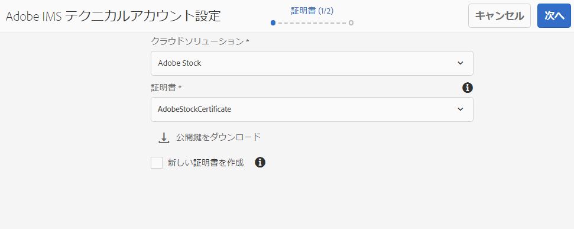
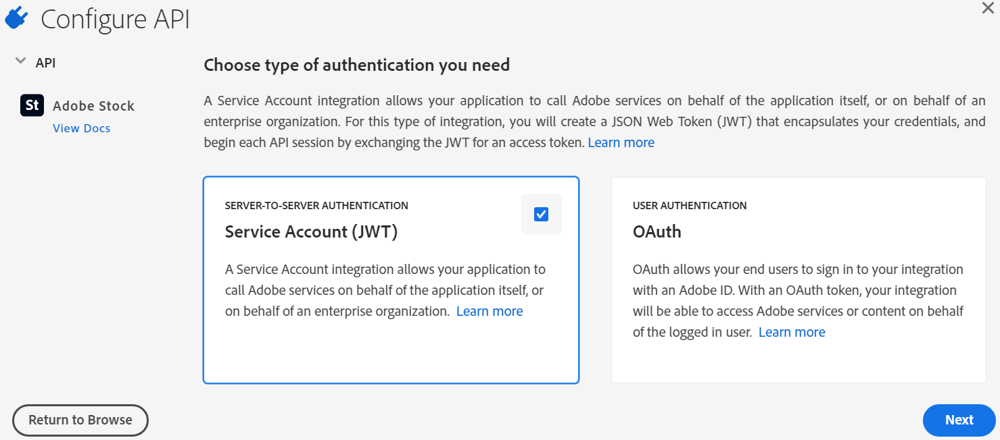
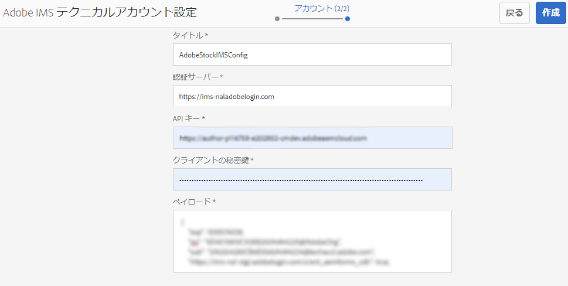
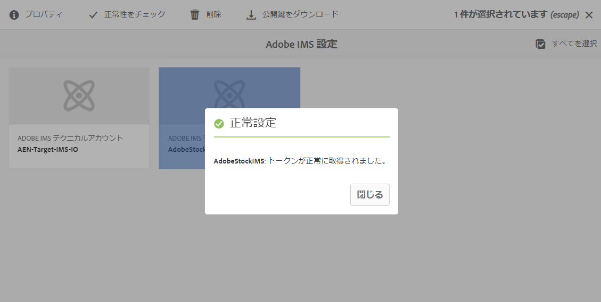
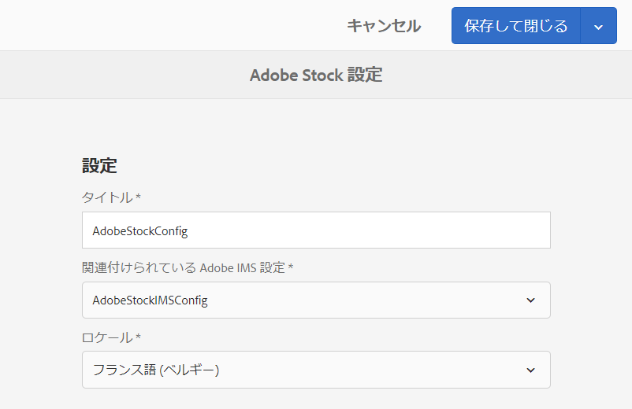
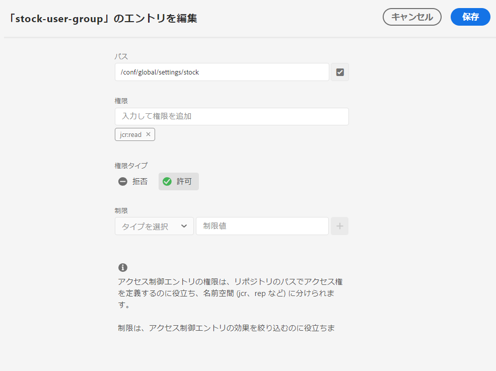
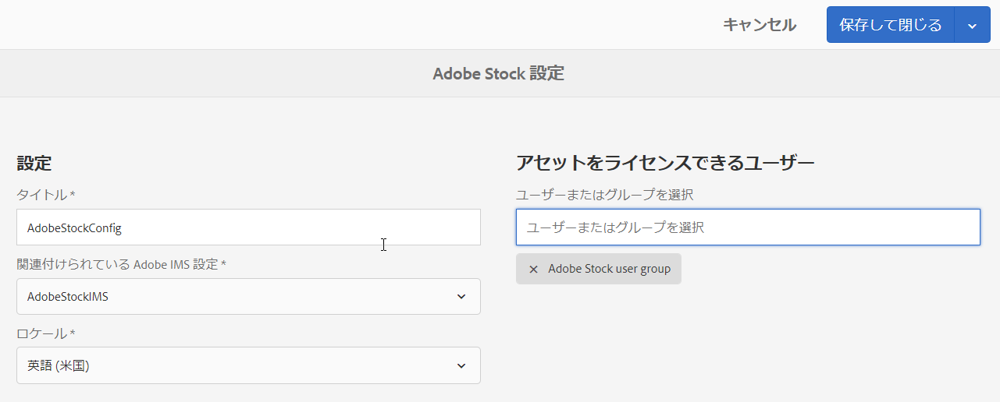
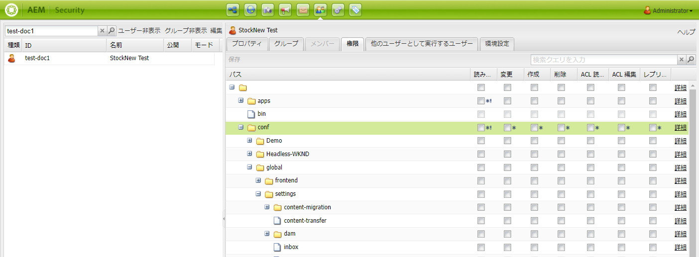
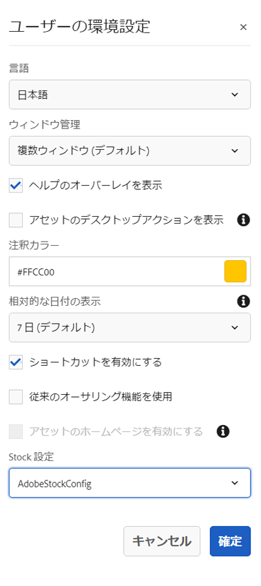

# [!DNL Adobe Stock] での [!DNL Adobe Experience Manager Assets] アセットの使用  {#use-adobe-stock-assets-in-aem-assets}

<!-- old content

[!DNL Experience Manager Assets] provides users the ability to search, preview, save, and license [!DNL Adobe Stock] assets directly from [!DNL Experience Manager]. 

Organizations can integrate their [!DNL Adobe Stock] enterprise plan with [!DNL Experience Manager Assets] to ensure that licensed assets are broadly available for their creative and marketing projects, with the powerful asset management capabilities of [!DNL Experience Manager].

[!DNL Adobe Stock] service provides designers and businesses with access to millions of high-quality, curated, royalty-free photos, vectors, illustrations, videos, templates, and 3D assets for all their creative projects. [!DNL Experience Manager] users are able to quickly find, preview, and license [!DNL Adobe Stock] assets that are saved in [!DNL Experience Manager], without leaving the [!DNL Experience Manager] interface.
-->

<!-- New overview content
-->

[!DNL Adobe Stock] サービスは、あらゆるクリエイティブプロジェクトに使用できる、適切にキュレーションされ、著作権使用料が不要で質の高い何百万点もの写真、ベクター、イラスト、ビデオ、テンプレートおよび 3D アセットを提供します。

[!DNL Adobe Stock] エンタープライズオファーの場合は、デフォルトで、組織全体での共有権限が含まれます。アセットが組織のユーザーによってライセンスされると、組織の他のユーザーは、再びライセンスを取得することなく、このアセットを識別、ダウンロード、使用できます。 アセットが組織でライセンスされると、そのアセットを使用する権利は永続的になります。

企業の[!DNL Adobe Stock]プランを[!DNL Experience Manager Assets]と統合し、[!DNL Experience Manager]の強力なアセット管理機能を使用して、ライセンスが必要なアセットをクリエイティブプロジェクトやマーケティングプロジェクトに幅広く活用できます。 [!DNL Experience Manager] に保存されているAdobe Stockアセットの検索、プレビューおよびライセンスの取得を、ユーザー [!DNL Experience Manager]のインターフェイスからすばやく実 [!DNL Experience Manager] 行できます。

<!-- Old content
## Prerequisites {#prerequisites}

The integration requires an [enterprise [!DNL Adobe Stock] plan](https://stockenterprise.adobe.com/).
-->

## [!DNL Experience Manager] と [!DNL Adobe Stock] の統合  {#integrate-aem-and-adobe-stock}

[!DNL Experience Manager Assets] では、から直接アセットの検索、プレビュー、保存、ライセンス取得を [!DNL Adobe Stock] おこなえま [!DNL Experience Manager]す。

**前提条件**

統合には次の要件が必要です。
* [エンタープライズ [!DNL Adobe Stock] プラン](https://stockenterprise.adobe.com/)
* デフォルトのStock製品プロファイルにAdmin Consoleする権限を持つユーザー
* Adobe開発者コンソールで統合を作成するための開発者アクセスプロファイルに対する権限を持つユーザー

企業の[!DNL Adobe Stock]計画
* [!DNL Adobe Stock](Experience Managerに接続された在庫)の製品権限を提供
* [!DNL Adobe Admin Console]に購入したクレジット（株式資格）
* 在庫資格に対して[!DNL Adobe Developer Console]内のサービスアカウント(JWT)認証を有効にします
* [!DNL Adobe Admin Console]内からクレジットとライセンスをグローバルに管理できます。

エンタイトルメント内では、[!DNL Adobe Stock]のデフォルトの製品プロファイルが[!DNL Admin Console]に存在します。 複数のプロファイルを作成でき、これらのプロファイルによってStockアセットのライセンスを取得できるユーザーが決まります。 製品プロファイルに直接アクセスできるユーザーは、 [https://stock.adobe.com/](https://stock.adobe.com/)にアクセスし、Stockアセットのライセンスを取得できます。 一方、開発者アクセスを使用して統合(API)を作成し、[!DNL Experience Manager]と[!DNL Adobe Stock]間の通信を認証する方法もあります。

>[!NOTE]
>
>Stockサービスアカウント(JWT)認証には、Enterprise Stockの権限が付与されます。
>
>この統合では、Enterprise StockエンタイトルメントのOAuth認証はサポートされていません。

<!-- old content
To allow communication between [!DNL Experience Manager] and [!DNL Adobe Stock], create an IMS configuration and an [!DNL Adobe Stock] configuration in [!DNL Experience Manager].

>[!NOTE]
>
>Only [!DNL Experience Manager] administrators and [!DNL Admin Console] administrators for an organization can perform the integration as it requires administrator privileges.
-->

## [!DNL Experience Manager]と[!DNL Adobe Stock]の統合手順 {#integration-steps}

[!DNL Experience Manager]と[!DNL Adobe Stock]を統合するには、次の手順をリストに示す順序で実行します。

1. [公開証明書の取得](#public-certificate)

   [!DNL Experience Manager]で、IMSアカウントを作成し、公開証明書（公開鍵）を生成します。

1. [サービスアカウント（JWT）接続の作成](#createnewintegration)

   [!DNL Adobe Developer Console]で、[!DNL Adobe Stock]組織のプロジェクトを作成します。 そのプロジェクトで、公開鍵で API を設定して、サービスアカウント（JWT）接続を作成します。サービスアカウント資格情報と JWT ペイロード情報を取得します。

1. [IMS アカウントの設定](#create-ims-account-configuration)

   [!DNL Experience Manager]で、サービスアカウント資格情報とJWTペイロードを使用してIMSアカウントを設定します。

1. [Cloud Service の設定](#configure-the-cloud-service)

   [!DNL Experience Manager]で、IMSアカウントを使用して[!DNL Adobe Stock]クラウドサービスを設定します。

### IMS 設定の作成 {#create-an-ims-configuration}

IMS設定は、[!DNL Adobe Stock]権限を持つ[!DNL Experience Manager Assets]オーサーインスタンスを認証します。

IMS 設定には、次の 2 つの手順が含まれます。

* [公開証明書の取得](#public-certificate)
* [IMS アカウントの設定](#create-ims-account-configuration)

### 公開証明書の取得 {#public-certificate}

公開鍵（証明書）は、製品開発者コンソールでAdobeプロファイルを認証します。

1. [!DNL Experience Manager Assets]オーサーインスタンスにログインします。 デフォルトの URL は `http://localhost:4502/aem/start.html` です。

1. **[!UICONTROL ツール]**&#x200B;パネルで、**[!UICONTROL セキュリティ]**／**[!UICONTROL Adobe IMS 設定]**&#x200B;に移動します。

1. Adobe IMS 設定ページで、「**[!UICONTROL 作成]**」をクリックします。**[!UICONTROL Adobe IMSテクニカルアカウント設定]**&#x200B;ページが開きます。

1. 「**[!UICONTROL 証明書]**」タブで、「**[!UICONTROL クラウドソリューション]**」ドロップダウンリストから「**[!UICONTROL Adobe Stock]**」を選択します。

1. 証明書を作成するか、既存の証明書を設定に再利用できます。

   証明書を作成するには、「**[!UICONTROL 新しい証明書を作成]**」チェックボックスをオンにして、公開鍵の&#x200B;**エイリアス**&#x200B;を指定します。 ここで入力したエイリアスが、公開鍵になります。

1. 「**[!UICONTROL 証明書を作成]**」をクリックします。「**[!UICONTROL OK]**」をクリックして公開証明書を生成します。

1. **[!UICONTROL 公開鍵をダウンロード]**&#x200B;アイコンをクリックして、公開鍵（.crt）ファイルをローカルマシンに保存します。この公開鍵を後で使用して、Brand Portal テナントの API を設定し、Adobe 開発者コンソールでサービスアカウント資格情報を生成が次の値である。

   「**[!UICONTROL 次へ]**」をクリックします。

   

1. 「**アカウント**」タブで、サービスアカウントの資格情報が必要なAdobe IMSアカウントが作成されます。

   新しいタブを開き、Adobe開発者コンソール](#createnewintegration)でサービスアカウント(JWT)接続を作成します。[

### サービスアカウント（JWT）接続の作成 {#createnewintegration}

Adobe開発者コンソールで、プロジェクトとAPIを組織レベルで設定します。 API を設定すると、サービスアカウント（JWT）接続が作成されます。API を設定するには、キーペア（秘密鍵と公開鍵）を生成する方法と、公開鍵をアップロードする方法の 2 とおりがあります。この例では、サービスアカウント資格情報は公開鍵をアップロードして生成されます。

サービスアカウント資格情報とJWTペイロードを生成するには：

1. システム管理者権限でAdobe開発者コンソールにログインします。 デフォルトの URL は [https://www.adobe.com/go/devs_console_ui](https://www.adobe.com/go/devs_console_ui) です。

   ドロップダウン（組織）リストから正しいIMS組織（在庫資格）が選択されていることを確認します。

1. 「**[!UICONTROL 新規プロジェクトを作成]**」をクリックします。システムで生成された名前を持つ空のプロジェクトが組織に対して作成されます。

   「**[!UICONTROL プロジェクトを編集]**」をクリックします。 **[!UICONTROL プロジェクトタイトル]**&#x200B;と&#x200B;**[!UICONTROL 説明]**&#x200B;を更新し、「**[!UICONTROL 保存]**」をクリックします。

1. 「**[!UICONTROL プロジェクトの概要]**」タブで、「**[!UICONTROL API を追加]**」をクリックします。

1. **[!UICONTROL APIウィンドウを追加]**&#x200B;で、「**[!UICONTROL Adobe Stock]**」を選択します。 「**[!UICONTROL 次へ]**」をクリックします。

1. **[!UICONTROL APIを設定]**&#x200B;ウィンドウで、「**[!UICONTROL サービスアカウント(JWT)]**」認証を選択します。 「**[!UICONTROL 次へ]**」をクリックします。

   

1. 「**[!UICONTROL 公開鍵]**&#x200B;をアップロード」をクリックします。 「**[!UICONTROL ファイル]**」をクリックし、「[公開証明書の取得](#public-certificate)」セクションでダウンロードした公開鍵（.crtファイル）をアップロードします。 「**[!UICONTROL 次へ]**」をクリックします。

1. 公開鍵を確認し、「**[!UICONTROL 次へ]**」をクリックします。

1. デフォルトの&#x200B;**[!UICONTROL Adobe Stock]**&#x200B;製品プロファイルを選択し、「**[!UICONTROL 設定済みAPIを保存]**」をクリックします。

1. API が設定されると、API の概要ページにリダイレクトされます。左側のナビゲーションツリーで「**[!UICONTROL 資格情報]**」の下の「**[!UICONTROL サービスアカウント（JWT）]**」オプションをクリックします。ここで、資格情報を表示し、JWTトークンの生成、資格情報の詳細のコピー、クライアントの秘密鍵の取得などのアクションを実行できます。

1. 「**[!UICONTROL クライアント資格情報]**」タブから、**[!UICONTROL クライアント ID]** をコピーします。

   「**[!UICONTROL クライアント秘密鍵を取得]**」をクリックし、**[!UICONTROL クライアントの秘密鍵]**&#x200B;をコピーします。

   

1. 「**[!UICONTROL JWT を生成]**」タブに移動し、**[!UICONTROL JWT ペイロード]**&#x200B;情報をコピーします。

これで、クライアントID（APIキー）、クライアントの秘密鍵、JWTペイロードを使用して、[!DNL Experience Manager Assets]で[IMSアカウント](#create-ims-account-configuration)を設定できるようになりました。

### IMS アカウントの設定 {#create-ims-account-configuration}

IMSアカウントを設定するには、[証明書](#public-certificate)と[サービスアカウント(JWT)の資格情報](#createnewintegration)が必要です。

IMSアカウントを設定するには：

1. IMS 設定を開き、「**[!UICONTROL アカウント]**」タブに移動します。[公開証明書の取得](#public-certificate)中も、ページは開いたままになっています。

1. IMS アカウントの&#x200B;**[!UICONTROL タイトル]**&#x200B;を指定します。

   「**[!UICONTROL Authorization Server]**」フィールドに、URLを入力します。[https://ims-na1.adobelogin.com/](https://ims-na1.adobelogin.com/).

   [サービスアカウント(JWT)接続](#createnewintegration)の作成時にコピーした&#x200B;**[!UICONTROL APIキー]**、**[!UICONTROL クライアントの秘密鍵]**、**[!UICONTROL ペイロード]**（JWTペイロード）にクライアントIDを入力します。

1. 「**[!UICONTROL 作成]**」をクリックします。IMSアカウント設定が作成されます。

   

1. その IMS アカウント設定を選択し、「**[!UICONTROL 正常性をチェック]**」をクリックします。

   ダイアログボックスの「**[!UICONTROL チェック]**」をクリックします。正常に設定されると、*トークンが正常に取得されました*&#x200B;というメッセージが表示されます。

   

### Cloud Service の設定 {#configure-the-cloud-service}

[!DNL Adobe Stock]クラウドサービスを設定するには：

1. [!DNL Experience Manager]ユーザーインターフェイスで、**[!UICONTROL ツール]** / **[!UICONTROL Cloud Services]** / **[!UICONTROL Adobe Stock]**&#x200B;に移動します。

1. [!DNL Adobe Stock Configurations]ページで、「**[!UICONTROL 作成]**」をクリックします。

1. クラウド設定の&#x200B;**[!UICONTROL タイトル]**&#x200B;を指定します。

   [IMS アカウントの設定](#create-ims-account-configuration)時に作成した IMS 設定を選択します。

   ドロップダウンリストからロケールを選択します。

   

1. 「**[!UICONTROL 保存して閉じる]**」をクリックします。

   これで、[!DNL Experience Manager Assets]オーサーインスタンスが[!DNL Adobe Stock]と統合されました。 複数の[!DNL Adobe Stock]設定を作成できます（例えば、ロケールベースの設定）。 [!DNL Experience Manager]ユーザーインターフェイス内から[!DNL Adobe Stock]アセットのアクセス、検索、ライセンス取得ができるようになりました。

   

   >[!NOTE]
   >
   >統合のこの段階では、管理者のみが[!DNL Adobe Stock]アセットにアクセスし、（オムニサーチを使用して）Stockアセットを検索し、[!DNL Adobe Stock]アセットのライセンスを取得できます。
   >
   >管理者は、さらに[!DNL Adobe Stock]クラウドサービスにユーザーまたはグループを追加し、[!DNL Experience Manager]の管理者以外のユーザーにStock設定へのアクセス権を付与できます。

1. ユーザーまたはグループを追加するには、[!DNL Adobe Stock]クラウド設定を選択し、「**[!UICONTROL プロパティ]**」をクリックします。

1. Adobe Stock設定へのアクセス権を割り当てたユーザーまたはグループを検索して追加します。 [ユーザーグループへの権限の割り当て](#assign-permissions-to-group)を参照してください。

## ユーザーグループへの権限の割り当て {#assign-permissions-to-group}

管理者は、ユーザーグループを作成し、[!DNL Adobe Stock]クラウドサービスにアクセスするための権限を特定のユーザーまたはグループに付与することができます。

Adobe Stockアセットの検索とライセンス取得に必要な権限は次のとおりです。

* パスの設定：`/conf/global/settings/stock`
* 権限: `jcr:read`
* 権限タイプ: `Allow`

ユーザーグループを作成するか、既存のユーザーグループに権限を割り当てることができます。 権限は、[!DNL Experience Manager Assets]インターフェイスまたは[!DNL User Admin]コンソールから割り当てることができます。

**次の場所からユーザーグループにアクセス権を付与するには、次の手順に従い [!DNL Experience Manager]ます。**

1. [!DNL Experience Manager]ユーザーインターフェイスで、**[!UICONTROL ツール]** / **[!UICONTROL セキュリティ]** / **[!UICONTROL グループ]**&#x200B;に移動します。 [!DNL Adobe Stock]のユーザーグループを作成します。

1. **[!UICONTROL ツール]** > **[!UICONTROL セキュリティ]** > **[!UICONTROL 権限]**&#x200B;に移動します。

1. 左側のパネルでユーザーグループを検索し、Adobe Stockの新しい&#x200B;**[!UICONTROL Access Control Entry (ACE)]**&#x200B;を追加します。

   * パスの設定：`/conf/global/settings/stock`
   * 権限: `jcr:read`
   * 権限タイプ: `Allow`

   「**[!UICONTROL 追加]**」をクリックします。

   

1. **[!UICONTROL ツール]** > **[!UICONTROL Cloud Services]** > **[!UICONTROL Adobe Stock]**&#x200B;に移動します。 [!DNL Adobe Stock]クラウド設定を選択し、「**[!UICONTROL プロパティ]**」をクリックします。

1. 新しく作成したユーザーグループを[!DNL Adobe Stock]設定に追加します。 「**[!UICONTROL 保存して閉じる]**」をクリックします。

   

**からユーザーにアクセスを提供するには、次の手順に従い [!DNL User Admin Console]ます。**

1. [!DNL Experience Manager]ユーザーAdmin Consoleを開きます。 デフォルトの URL は `http://localhost:4502/userdamin` です。

1. 左側のパネルで、`user_id`または`name`を入力して、ユーザーを検索します。 ダブルクリックして、ユーザープロパティを開きます。

1. 「**[!UICONTROL 権限]**」タブに移動し、[!DNL Adobe Stock]クラウド設定に対する`read`権限を許可します。`/conf/global/settings/stock`と入力します。

   >[!CAUTION]
   >
   >クラウド設定が許可されていない場合、ユーザーは[!DNL Experience Manager]インターフェイスで&#x200B;**[!UICONTROL Assets]**&#x200B;にのみアクセスできます。
   >
   >[!UICONTROL Assets]および[!DNL Adobe Stock]アセットへのアクセスを許可するには、ユーザーに対してクラウド設定が許可されていることを確認します。

1. 「**[!UICONTROL 保存]**」をクリックして、権限を更新します。

   

1. ユーザーまたはグループを[!DNL Adobe Stock]クラウド設定に追加します。

## Adobe Stock Assetsへのアクセス {#access-stock-assets}

[!DNL Adobe Stock]クラウド設定に対する権限を持つ管理者以外のユーザーは、 [!DNL Experience Manager]インターフェイスから[!DNL Adobe Stock]アセットを検索し、ライセンスを取得できます。

ユーザーは、[!DNL Adobe Stock]アセットにアクセスする前に、[!DNL Adobe Stock]クラウド設定をアクティブ化する追加の手順を実行する必要があります。 これは1回限りのアクティビティです。 ユーザーに複数の[!DNL Adobe Stock]クラウド設定に対する権限が割り当てられている場合は、**[!UICONTROL ユーザーの環境設定]**&#x200B;から目的の設定を選択できます。

[!DNL Adobe Stock]クラウド設定をアクティブにするには：

1. [!DNL Experience Manager] にログインします。

1. 右上隅のユーザーアイコンをクリックし、「**[!UICONTROL My Preferences]**」をクリックします。 **[!UICONTROL ユーザーの環境設定]**&#x200B;ウィンドウが開きます。

1. 目的の「**[!UICONTROL Stock設定]**」をドロップダウンリストから選択し、「**[!UICONTROL 確定]**」をクリックして設定を有効にします。

   

1. **[!UICONTROL Assets]** > **[!UICONTROL Adobe Stock]**&#x200B;に移動します。 [!DNL Adobe Stock]アセットの表示、検索、ライセンス取得が可能になりました。

次の表で、[!DNL Adobe Stock]アセットにアクセスする際のユーザー権限の仕組みを説明します。

| User | グループ | 権限 | ユーザーの環境設定で在庫設定を受け入れる | アセットへのアクセス | Access Adobe Stock |
| --- | --- | --- | --- | --- | --- |
| admin | 該当なし | すべて | 該当なし | はい | はい |
| test-doc1 | DAM ユーザー | `/conf/global/settings/stock/cloud-config` | はい | 可 | はい |
| test-doc1 | DAM ユーザー | `/conf/global/settings/stock/cloud-config` | 不可 | エラー：データを読み込めませんでした | 不可 |
| test-doc1 | DAM ユーザー | 許可：`/conf/global/settings/stock`拒否：`/cloud-config` | 在庫構成が表示されません | 可 | 不可 |

## [!DNL Adobe Stock] での [!DNL Experience Manager] アセットの使用と管理  {#usemanage}

この機能を使用すると、[!DNL Experience Manager Assets] で [!DNL Adobe Stock] アセットを操作できます。[!DNL Experience Manager] のユーザーインターフェイス内から [!DNL Adobe Stock] アセットを検索し、必要なアセットのライセンスを取得できます。

[!DNL Experience Manager] 内で [!DNL Adobe Stock] アセットのライセンスを取得すると、そのアセットを通常のアセットと同様に使用および管理できます。ユーザーは [!DNL Experience Manager] 内でアセットの検索およびプレビュー、アセットのコピーおよび公開、[!DNL Brand Portal] でのアセットの共有、[!DNL Experience Manager] デスクトップアプリケーション経由でのアセットのアクセスおよび使用を行うことができます。

![ワークスペー [!DNL Adobe Stock] スからのアセットの検索と結果のフィルタ [!DNL Adobe Experience Manager] リング](assets/adobe-stock-search-results-workspace.png)

**A.**[!DNL Adobe Stock] 指定された ID のアセットと類似しているアセットを検索します。**B.** 選択した形状や向きと一致するアセットを検索します。**C.** サポートされているアセットタイプのいずれかを検索します。**D.** フィルターウィンドウを開く／折りたたみます。**E.** 選択したアセットのライセンスを取得して に保存します。[!DNL Experience Manager]**F.**[!DNL Experience Manager] アセットを透かし付きで に保存します。**G.**[!DNL Adobe Stock] 選択したアセットと類似したアセットを Web サイトで調べます。**H.**[!DNL Adobe Stock] 選択したアセットを Web サイトに表示します。**I.** 検索結果から選択したアセットの数。**J.** カード表示とリスト表示を切り替えます。

### アセットの検索 {#find-assets}

[!DNL Experience Manager] ユーザーは、[!DNL Experience Manager] と [!DNL Adobe Stock] の両方でアセットを検索できます。検索場所を [!DNL Adobe Stock] に限定しない場合は、[!DNL Experience Manager] と [!DNL Adobe Stock] からの検索結果が表示されます。

* [!DNL Adobe Stock] アセットを検索するには、**[!UICONTROL ナビゲーション]**／**[!UICONTROL アセット]**／**[!UICONTROL Adobe Stock を検索]**&#x200B;をクリックします。

* [!DNL Adobe Stock] と [!DNL Experience Manager Assets] にまたがるアセットを検索するには、「」をクリックします。

また、アセットを選択するには、検索バーに「`Location: Adobe Stock`」と入力します。[!DNL Adobe Stock][!DNL Experience Manager] は、検索されたアセットに対する高度なフィルタリング機能を備えており、サポートされているアセットのタイプや画像の向き、ライセンスの状態などのフィルターを使用して、必要なアセットをすばやく見つけることができます。

>[!NOTE]
>
>[!DNL Adobe Stock]から検索されたアセットは、[!DNL Experience Manager]に表示されます。 [アセットを保存](/help/assets/aem-assets-adobe-stock.md#saveassets)するか、[アセットにライセンスを付与して保存](/help/assets/aem-assets-adobe-stock.md#licenseassets)した後でないと、[!DNL Adobe Stock] アセットを取得して [!DNL Experience Manager] リポジトリーに保存することはできません。既に [!DNL Experience Manager] に保存されているアセットが表示され、参照やアクセスが簡単にできるようにハイライトされます。また、[!DNL Stock] アセットは、ソースが [!DNL Stock] であることを示すいくつかの追加メタデータとともに保存されます。

![の検索フィルターと、検索結 [!DNL Experience Manager] 果内でハイラ [!DNL Adobe Stock] イトされているアセット](assets/aem-search-filters2.jpg)

### 必要なアセットの保存と表示 {#saveassets}

[!DNL Experience Manager] に保存するアセットを選択します。上部ツールバーの「[!UICONTROL 保存]」をクリックし、アセットの名前と保存場所を指定します。ライセンスが不要なアセットはローカルに透かし付きで保存されます。

アセットの検索を次回実行すると、保存済みのアセットは、[!DNL Experience Manager Assets] で使用可能であることを示すバッジ付きでハイライトされます。

>[!NOTE]
>
>最近追加されたアセットには、ライセンスが許諾されていることを示すバッジではなく、新しいアセットであることを示すバッジが表示されます。

### アセットのライセンス取得 {#licenseassets}

[!DNL Adobe Stock] エンタープライズプランの割り当てを使用することで、[!DNL Adobe Stock] アセットのライセンスを取得できます。ライセンスを許諾されたアセットは透かしなしで保存され、[!DNL Experience Manager Assets] で検索することも使用することも可能になります。

![でアセットのライセンスを取得して保存す [!DNL Adobe Stock] るためのダイアログ  [!DNL Experience Manager Assets]](assets/aem-stock_licenseandsave.jpg)

### メタデータおよびアセットプロパティへのアクセス {#access-metadata-and-asset-properties}

メタデータ（[!DNL Experience Manager] に保存されているアセットの [!DNL Adobe Stock] メタデータプロパティを含む）にアクセスしてプレビューし、アセットの&#x200B;**[!UICONTROL ライセンス参照]**&#x200B;を追加できます。ただし、ライセンス参照の更新は [!DNL Experience Manager] と [!DNL Adobe Stock] Web サイトの間で同期されません。

ユーザーは、ライセンスを許諾されたアセットとライセンスを許諾されていないアセットの両方を表示できます。

## 既知の制限事項 {#known-limitations}

* **Service Pack 6.5.7.0以 [!DNL Experience Manager] 降との統合に関する問題**: [!DNL Experience Manager] 6.5.7.0以降との統合中に予期しない問題が見つかりました。この問題はテスト中で、[!DNL Experience Manager] 6.5.11.0で利用できると予想されています。即時のホットフィックスについては、[!DNL Customer Support]にお問い合わせください。

* **ユーザーのライセンスを制限する機能が正しく動作しない**:在庫設定に対する権 `read` 限を持つすべてのユーザーが、アセットの検索とライセンス取得を許可 [!DNL Adobe Stock] されます。

* **管理者以外のユーザーは、クラウド設定を手動でアクティブ化する [!DNL Adobe Stock] 必要があります**。ユーザーの環 **[!UICONTROL 境設]** 定ウィンドウ **[!UICONTROL で、Stock設]** 定に有効としてのクラウド設定が表示されます [!DNL Adobe Stock] が、管理者以外のユーザーでは機能しません。ユーザーは、「**[!UICONTROL Accept]**」ボタンをクリックしてStock設定を有効にする必要があります。 この手順がない場合、システムは&#x200B;**[!UICONTROL Assets]**&#x200B;へのアクセスにエラーメッセージを反映します。

* **編集画像の警告が表示されない**：画像のライセンスを取得する場合、ユーザーは画像が「編集のみ使用」かどうか確認できません。管理者は誤用を防ぐために、Admin Console から編集用アセットへのアクセスをオフにできます。

* **間違ったライセンスの種類が表示される**：[!DNL Experience Manager] で、アセットに対して正しくないライセンスタイプが表示される可能性があります。[!DNL Adobe Stock] Web サイトにログインすると、ライセンスタイプを確認できます。

* **参照フィールドとメタデータが同期されない**：ユーザーがライセンス参照フィールドを更新すると、そのライセンス参照情報は [!DNL Experience Manager] で更新されますが、[!DNL Adobe Stock] Web サイト上では更新されません。同様に、[!DNL Adobe Stock] Web サイトで参照フィールドを更新すると、更新情報が [!DNL Experience Manager] には反映されません。

>[!MORELIKETHIS]
>
>* [でのアセットの使用に関するビ [!DNL Adobe Stock] デオチュートリアル [!DNL Experience Manager Assets]](https://experienceleague.adobe.com/docs/experience-manager-learn/assets/creative-workflows/adobe-stock.html?lang=ja)
>* [[!DNL Adobe Stock] エンタープライズプランのヘルプ](https://helpx.adobe.com/jp/enterprise/using/adobe-stock-enterprise.html)
>* [[!DNL Adobe Stock] FAQ](https://helpx.adobe.com/jp/stock/faq.html)

<!--old content

### Create an IMS configuration {#create-an-ims-configuration}

1. In the [!DNL Experience Manager] user interface, navigate to **[!UICONTROL Tools]** > **[!UICONTROL Security]** > **[!UICONTROL Adobe IMS Configurations]**. Click **[!UICONTROL Create]** and select **[!UICONTROL Cloud Solution]** > **[!UICONTROL Adobe Stock]**.
1. Either reuse an existing certificate or select **[!UICONTROL Create new certificate]**.
1. Click **[!UICONTROL Create certificate]**. Once created, download the public key. Click **[!UICONTROL Next]**. Leave the [!UICONTROL Adobe IMS Technical Account Configuration] screen open to provide the required values shortly.
1. Access [Adobe Developer Console](https://console.adobe.io). Ensure that your account has administrator permissions for the organization for which the integration is required.
1. Click **[!UICONTROL Create new project]** and click **[!UICONTROL Add API]**. Select **[!UICONTROL Adobe Stock]** from the list of APIs that are available to you. Select [!UICONTROL OAUTH 2.0 Web].
1. Provide **[!UICONTROL Default redirect URI]** and **[!UICONTROL Redirect URI pattern]** values. Click **[!UICONTROL Save configured API]**. Copy the generated ID and secret.
1. In [!UICONTROL Adobe IMS Technical Account Configuration] screen, provide the values in the boxes titled **[!UICONTROL Title]**, **[!UICONTROL Authorization Server]**, **[!UICONTROL API Key]**, **[!UICONTROL Client Secret]**, and **[!UICONTROL Payload]**. For detailed information about these values, see [JWT authentication quick start](https://www.adobe.io/authentication/auth-methods.html#!AdobeDocs/adobeio-auth/master/JWT/JWT.md).

-->

<!-- TBD: Update the URL to update the terminology when AIO team updates their documentation URL. Logged issue github.com/AdobeDocs/adobeio-auth/issues/63.
-->

<!--
### Create [!DNL Adobe Stock] configuration in [!DNL Experience Manager] {#create-adobe-stock-configuration-in-aem}

1. In the [!DNL Experience Manager], navigate to **[!UICONTROL Tools]** > **[!UICONTROL Cloud Services]** > **[!UICONTROL Adobe Stock]**.
1. Click **[!UICONTROL Create]** to create a configuration and associate it with your existing IMS Configuration. Select `PROD` as the environment parameter.
1. In **[!UICONTROL Licensed Assets Path]** field, leave a location as is. Do not change the location where you want to store the [!DNL Adobe Stock] assets.
1. Complete creation by adding all the required properties. Click **[!UICONTROL Save & Close]**.
1. Add [!DNL Experience Manager] users or groups, who can license the assets.

>[!NOTE]
>
>If there are multiple [!DNL Adobe Stock] configurations, select the desired configuration in [!UICONTROL User Preferences] panel. To access the panel from [!DNL Experience Manager] home page, click the user icon and then click **[!UICONTROL User Preferences]** > **[!UICONTROL Stock Configuration]**.

-->