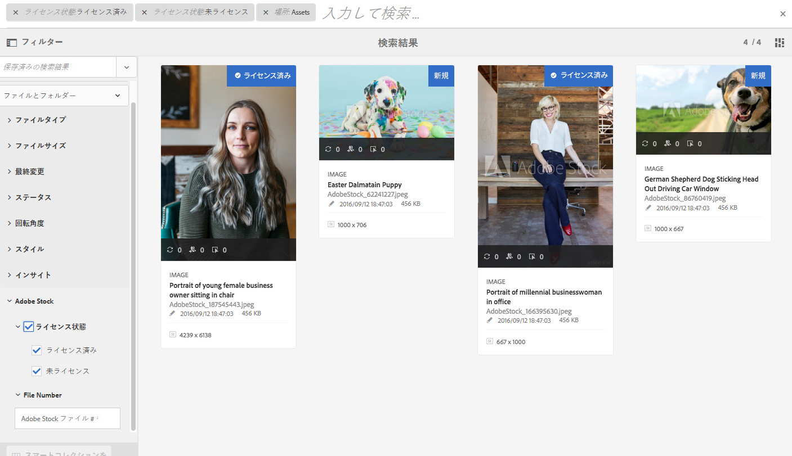
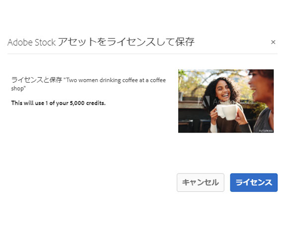

# 次でのア [!DNL Adobe Stock] セットの [!DNL Adobe Experience Manager Assets] 使用 {#use-adobe-stock-assets-in-aem-assets}

Organizations can integrate their [!DNL Adobe Stock] enterprise plan with [!DNL Experience Manager Assets] to ensure that licensed assets are broadly available for their creative and marketing projects, with the powerful asset management capabilities of [!DNL Experience Manager].

[!DNL Adobe Stock] サービスは、あらゆるクリエイティブプロジェクトに使用できる、適切にキュレーションされ、著作権使用料が不要で質の高い何百万点もの写真、ベクター、イラスト、ビデオ、テンプレートおよび 3D アセットを提供します。[!DNL Experience Manager] ユーザーは、インターフェイスを離れることなく、で保存され [!DNL Adobe Stock] たアセットをすばやく検索、プレビュー、 [!DNL Experience Manager]ライセンス認証することがで [!DNL Experience Manager] きます。

## 前提条件 {#prerequisites}

統合には、[Adobe Stock エンタープライズ版プラン](https://stockenterprise.adobe.com/)と 6.5 以降が必要です。[!DNL Experience Manager]For [!DNL Experience Manager] 6.5 service pack details, see these [release notes](/help/release-notes/sp-release-notes.md).

## 統合お [!DNL Experience Manager] よび [!DNL Adobe Stock]{#integrate-aem-and-adobe-stock}

To allow communication between [!DNL Experience Manager] and [!DNL Adobe Stock], create an IMS configuration and an [!DNL Adobe Stock] configuration in [!DNL Experience Manager].

>[!NOTE]
>
>Only [!DNL Experience Manager] administrators and [!DNL Admin Console] administrators for an organization can perform the integration as it requires administrator privileges.

### IMS 設定の作成 {#create-an-ims-configuration}

1. Click on [!DNL Experience Manager] logo. **[!UICONTROL ツール]**／**[!UICONTROL セキュリティ]**／**[!UICONTROL Adobe IMS 設定]**&#x200B;に移動します。「**[!UICONTROL 作成]**」をクリックし、**[!UICONTROL クラウドソリューション]**／**[!UICONTROL Adobe Stock]** を選択します。
1. 既存の証明書を再使用するか、「**[!UICONTROL 新しい証明書を作成]**」を選択します。
1. 「**[!UICONTROL 証明書を作成]**」をクリックします。証明書を作成したら、公開鍵をダウンロードします。「**[!UICONTROL 次へ]**」をクリックします。
1. 「**[!UICONTROL タイトル]**」、「**[!UICONTROL 認証サーバー]**」、「**[!UICONTROL API キー]**」、「**[!UICONTROL クライアントの秘密鍵]**」および「**[!UICONTROL ペイロード]**」の各フィールドに適切な値を指定します。See [JWT authentication quick start](https://www.adobe.io/authentication/auth-methods.html#!AdobeDocs/adobeio-auth/master/JWT/JWT.md), for detailed information to fetch these values from [!DNL Adobe I/O].
1. Add the downloaded public key to your [!DNL Adobe I/O] service account.

### 設定 [!DNL Adobe Stock] の作 [!DNL Experience Manager] 成 {#create-adobe-stock-configuration-in-aem}

1. In the [!DNL Experience Manager] user interface, navigate to **[!UICONTROL Tools]** > **[!UICONTROL Cloud Services]** > **[!UICONTROL Adobe Stock]**.
1. 「**[!UICONTROL 作成]**」をクリックして設定を作成し、その設定を既存の IMS 設定に関連付けます。環境パラメーターとして「`PROD`」を選択します。
1. 「**[!UICONTROL ライセンスが必要なアセットのパス]**」フィールドの場所をそのまま残します。Do not change the location where you want to store the [!DNL Adobe Stock] assets.
1. すべての必須プロパティを追加して作成を完了します。「**[!UICONTROL 保存して閉じる]**」をクリックします。
1. Add [!DNL Experience Manager] users or groups, who can license the assets.

>[!NOTE]
>
>If there are multiple [!DNL Adobe Stock] configurations, select the desired configuration in [!UICONTROL User Preferences] panel by clicking the *User* logo in the upper-right corner of the [!DNL Experience Manager] user interface.

## Use and manage [!DNL Adobe Stock] assets in [!DNL Experience Manager] {#usemanage}

Using this capability, organizations can allow its users to work using [!DNL Adobe Stock] assets in [!DNL Experience Manager Assets]. From within the [!DNL Experience Manager] user interface, users can search [!DNL Adobe Stock] assets and license the required assets.

Once an [!DNL Adobe Stock] asset is licensed in [!DNL Experience Manager], it can be used and managed like a typical asset. In [!DNL Experience Manager], the users can search and preview the assets; copy and publish the assets; share the assets on [!DNL Brand Portal]; access and use the assets via [!DNL Experience Manager] desktop app; and so on.

*図：インターフェイス[!DNL Adobe Stock]からアセットを検索し、結果をフィルタリ[!DNL Experience Manager]ングします。*

**A.**[!DNL Adobe Stock] 指定された ID のアセットと類似しているアセットを検索します。**B.** 選択した形状や向きと一致するアセットを検索します。**C.** サポートされているアセットタイプのいずれかを検索します。**D.** フィルターウィンドウを開く／折りたたみます。**E.** 選択したアセットのライセンスを取得して に保存します。[!DNL Experience Manager]**F.**[!DNL Experience Manager] アセットを透かし付きで に保存します。**G.**[!DNL Adobe Stock] 選択したアセットと類似したアセットを Web サイトで調べます。**H.**[!DNL Adobe Stock] 選択したアセットを Web サイトに表示します。**I.** 検索結果から選択したアセットの数。**J.** カード表示とリスト表示を切り替えます。

### アセットの検索 {#find-assets}

Your [!DNL Experience Manager] users, can search for assets in both, [!DNL Experience Manager] and [!DNL Adobe Stock]. When the search location is not limited to [!DNL Adobe Stock], the search results from [!DNL Experience Manager] and [!DNL Adobe Stock] are displayed.

* To search for [!DNL Adobe Stock] assets, click **[!UICONTROL Navigation]** > **[!UICONTROL Assets]** > **[!UICONTROL Search Adobe Stock]**.

* To search for assets across [!DNL Adobe Stock] and [!DNL Experience Manager Assets], click the search icon .

また、 アセットを選択するには、検索バーに「`Location: Adobe Stock`」と入力します。[!DNL Adobe Stock][!DNL Experience Manager] は、検索されたアセットに対する高度なフィルタリング機能を備えており、サポートされているアセットのタイプや画像の向き、ライセンスの状態などのフィルターを使用して、必要なアセットをすばやく見つけることができます。

>[!NOTE]
>
>Assets searched from [!DNL Adobe Stock] are just displayed in [!DNL Experience Manager]. [!DNL Adobe Stock] アセットは、ユーザーがアセットまたはライ [!DNL Experience Manager] センスを保存し、アセットを保 [存した後](/help/assets/aem-assets-adobe-stock.md#saveassets) 、リポジト [リに取得および保存されます](/help/assets/aem-assets-adobe-stock.md#licenseassets)。 Assets that are already stored in [!DNL Experience Manager] are displayed and highlighted for ease of reference and access. Also, the [!DNL Stock] assets are saved with some additional metadata to indicate the source as [!DNL Stock].

*図：検索フィルターを検索結[!DNL Experience Manager]果内で検索し、ハ[!DNL Adobe Stock]イライト表示されたアセットを検索します。*

### 必要なアセットの保存と表示 {#saveassets}

Select an asset that you want to save in [!DNL Experience Manager]. Click [!UICONTROL Save] in the toolbar at the top and provide the name and location of the asset. ライセンスが不要なアセットはローカルに透かし付きで保存されます。

Next time when you search for assets, the saved assets are highlighted with a badge, to indicate that such assets are available in [!DNL Experience Manager Assets].

>[!NOTE]
>
>最近追加されたアセットには、ライセンスが許諾されていることを示すバッジではなく、新しいアセットであることを示すバッジが表示されます。

### アセットのライセンス取得 {#licenseassets}

Users can license [!DNL Adobe Stock] assets by using the quota of their [!DNL Adobe Stock] enterprise plan. When you license an asset, it is saved without a watermark and is available for searching and using in [!DNL Experience Manager Assets].

*図：アセットのライセンスを取得して保存するダ[!DNL Adobe Stock]イアログが表示され[!DNL Experience Manager Assets]ます。*

### メタデータおよびアセットプロパティへのアクセス {#access-metadata-and-asset-properties}

Users can access and preview the metadata, including the [!DNL Adobe Stock] metadata properties for the assets saved in [!DNL Experience Manager], and add **[!UICONTROL License References]** for an asset. However, the updates to license reference are not synced between [!DNL Experience Manager] and [!DNL Adobe Stock] website.

ユーザーは、ライセンスを許諾されたアセットとライセンスを許諾されていないアセットの両方を表示できます。

*図：表示を実行し、保存されたアセットのメタデータおよびライセンス参照にアクセスします。*

## 既知の制限事項 {#known-limitations}

* **編集画像の警告が表示されない**:画像のライセンスを取得する際、ユーザは画像が「編集上のみ使用」かどうかを確認できません。 管理者は誤用を防ぐために、Admin Console から編集用アセットへのアクセスをオフにできます。

* **間違ったライセンスタイプが表示される**:アセットに対して、に正しくないライセンスタイプが表示される [!DNL Experience Manager] 可能性があります。 Users can log into the [!DNL Adobe Stock] website to see the license type.

* **参照フィールドとメタデータは同期されません**:ユーザがライセンス参照フィールドを更新すると、Webサイト上ではなく、Webサイト内でライセ [!DNL Experience Manager] ンス参照情報が更新さ [!DNL Adobe Stock] れます。 Similarly, if the user updates the reference fields on the [!DNL Adobe Stock] website, the updates are not synchronized in [!DNL Experience Manager].

>[!MORELIKETHIS]
>
>* [Experience Manager AssetsでのAdobe Stockアセットの使用に関するビデオチュートリアル](https://helpx.adobe.com/jp/experience-manager/kt/assets/using/stock-assets-feature-video-use.html)
>* [Adobe Stock エンタープライズプランのヘルプ](https://helpx.adobe.com/jp/enterprise/using/adobe-stock-enterprise.html)
>* [Adobe Stock の FAQ](https://helpx.adobe.com/jp/stock/faq.html)

