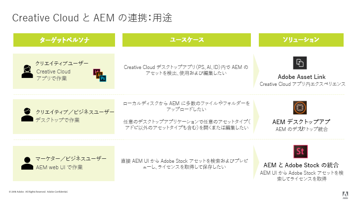

# [!DNL Adobe Experience Manager] および [!DNL Creative Cloud] 統合のベストプラクティス {#aem-and-creative-cloud-integration-best-practices}

[!DNL Adobe Experience Manager Assets] は、DAMとの統合により、DAMユーザーがクリエイティブチームと連携し、コンテンツ作成プロセスでのコラボレーション [!DNL Adobe Creative Cloud] を効率化できるデジタルアセット管理(DAM)ソリューションです。

[!DNL Adobe Creative Cloud] は、デジタルアセットの作成を支援するソリューションとサービスのエコシステムをクリエイティブチームに提供します。It includes desktop and mobile applications, cloud services like storage with desktop sync or web experience, as well as marketplaces such as [!DNL Adobe Stock].

使用例に基づいてデスクトップとエンタープライズクラスの DAM の間で選択すべき統合や、つながるワークフローに関連するベストプラクティスについては、このドキュメントで説明します。

>[!NOTE]
>
>[!DNL Experience Manager] を [!DNL Creative Cloud] フォルダー共有に変更することは推奨されなくなりました。 クリエイティブユーザーにで管理されるアセットへのアクセスを提供するために、 [Adobeアセットリンク](https://helpx.adobe.com/jp/enterprise/using/adobe-asset-link.html) ( [Adobe Asset Link](https://docs.adobe.com/content/help/ja-JP/experience-manager-desktop-app/using/introduction.html) )や [!DNL Experience Manager]Experience Managerデスクトップアプリケーションなど、新しい機能を使用することをお勧めします。

## Collaboration needs of creatives, marketers, and DAM users {#collaboration-needs-of-creatives-marketers-and-dam-users}

| 要件 | 使用例 | 関係するサーフェス |
|---|---|---|
| デスクトップ上でクリエイティブプロフェッショナル向けのエクスペリエンスを簡素化する | Streamline access to asset from a DAM ([!DNL Experience Manager Assets]) for creative professionals, or more broadly, users on desktop working in native asset creation applications. They need an easy and straightforward way to discover, use (open), edit and save changes to [!DNL Experience Manager], as well as upload new files. | Win or Mac desktop; [!DNL Creative Cloud] apps |
| Provide high-quality, ready-to-use assets from [!DNL Adobe Stock] | マーケティング担当者は、アセットの調達と検出を支援することでコンテンツ作成プロセスの促進に貢献します。クリエイティブプロフェッショナルは、承認されたアセットをクリエイティブツール内から直接使用します。 | [!DNL Experience Manager Assets]; [!DNL Adobe Stock] marketplace; メタデータフィールド |
| 組織でアセットを配布および共有する | 社内部門／支店および外部のパートナー、ディストリビューター、代理店は、親組織で共有されている承認済みアセットを使用します。組織では、作成したアセットを安全かつシームレスに共有して幅広く再利用したいと考えています。 | Brand Portal、Asset Share Commons |

## コラボレーションニーズをサポートするアドビ製品／サービス {#adobe-offerings-to-support-the-collaboration-need}

| 関係するユーザーに対する価値提案 | アドビ製品／サービス | 関係するサーフェス |
|---|---|---|
| Creative users discover assets from [!DNL Experience Manager], open and use them, edit and upload changes to [!DNL Experience Manager], as well as upload new files into [!DNL Experience Manager], without leaving [!DNL Creative Cloud] apps. | [Adobe Asset Link](https://helpx.adobe.com/jp/enterprise/using/adobe-asset-link.html) | [!DNL Adobe Photoshop], [!DNL Adobe Illustrator], および [!DNL Adobe InDesign]. |
| Business users simplify opening and using assets, editing and uploading changes to [!DNL Experience Manager], and uploading new files into [!DNL Experience Manager] from the desktop environment. 汎用の統合を使用して、アドビ以外のアセットも含め、あらゆるアセットタイプをネイティブデスクトップアプリケーションで開きます。 | [Experience Managerデスクトップアプリ](https://docs.adobe.com/content/help/ja-JP/experience-manager-desktop-app/using/using.html) | [!DNL Experience Manager]Windows および Mac デスクトップ上の デスクトップアプリケーション |
| Marketers and business users discover, preview, license and save, and manage the [!DNL Adobe Stock] assets from within [!DNL Experience Manager]. Licensed and saved assets provide select [!DNL Adobe Stock] metadata for better governance. | [Adobe Experience Manager と Adobe Stock との連携](aem-assets-adobe-stock.md) | [!DNL Experience Manager] ウェブインターフェース |

ここでは、主に、コラボレーションニーズの最初の 2 つの側面に焦点を当てます。アセットの大規模な配布と調達については、使用例として簡単に説明します。そのようなニーズに対するソリューションとしては、Adobe Brand Portal または Asset Share Commons を検討してください。[Brand Portalなどの別のソリューション](https://helpx.adobe.com/jp/experience-manager/brand-portal/user-guide.html)、 [Asset Share Commonsコンポーネントに基づいて構築できるソリューション、](https://adobe-marketing-cloud.github.io/asset-share-commons/) Link Share [、Using](/help/assets/link-sharing.md) Experience ManagerAssetsを使用するソリューションは、特定の要件に基づいて検討する必要があります。

### 使用例とアドビソリューションの対応関係 {#mapping-of-use-cases-and-adobe-solutions}

<!-- TBD: Add some info about XD integration and possibly info about DA v2.0.
-->

| 使用例 | [!DNL Adobe Asset Link] | [!DNL Experience Manager] デスクトップアプリ | 備考／その他のソリューション |
|---|---|---|---|
| Discover - DAMフォルダーを参照 | 可 | [!DNL Experience Manager] Webインターフェイスとデスクトップアクション |  |
| Discover - DAMコレクションにアクセス | 可 | [!DNL Experience Manager] Webインターフェイスとデスクトップアクション |  |
| Discover - DAMからのアセットの検索 | 可 | [!DNL Experience Manager] Webインターフェイスとデスクトップアクション |  |
| 使用 - アセットを開く | はい | はい | 「[Web インターフェイスから開く](managing-assets-touch-ui.md#previewing-assets)」またはファインダーから開く |
| 使用 — DAMからドキュメントにアセットを配置 | 対応 - 埋め込み | 対応 - リンクまたは埋め込み | [!DNL Experience Manager] デスクトップアプリケーションでは、ローカルファイルシステム上のファイルとしてアセットにアクセスできます。ネイティブアプリでは、これらのリンクはローカルパスで表されます。 |
| 編集 - 編集用に開く | 対応 - チェックアウトアクション | 対応 - 「開く」アクション（ネットワーク共有内） | 「[AAL でチェックアウト](https://helpx.adobe.com/jp/enterprise/using/manage-assets-using-adobe-asset-link.html)」の場合は、デフォルトでは、アセットをユーザーの Creative Cloud ストレージアカウント（Creative Cloud アプリで同期）に保存します。 |
| 編集 — DAM外で作業を進めています | 対応 - デスクトップに同期しているユーザーの Creative Cloud ストレージアカウントでアセットが入手可能です。 | 対応 |  |
| 編集 - 変更をアップロードする | 対応 - [チェックインアクション](https://helpx.adobe.com/jp/enterprise/using/manage-assets-using-adobe-asset-link.html)（オプションコメント付き） | 対応 |  |
| アップロード - 単一ファイル | 対応 - 現在のアクティブなドキュメントをアップロードします | 対応 | [Web インターフェイスを使用してアップロード](managing-assets-touch-ui.md#uploading-assets) |
| アップロード - 複数ファイル／階層フォルダー構造 | 非対応 | 可 | [Web インターフェイスを使用してアップロード](managing-assets-touch-ui.md#uploading-assets) またはカスタムスクリプティングやツールを使用します。 |
| その他 - ユーザーとログイン | Creative Cloud デスクトップアプリケーションにログインした Creative Cloud ユーザーが認識されます（SSO） | [!DNL Experience Manager] ユーザーと資格情報 | Users of both solutions count towards the [!DNL Experience Manager] user quota. |
| その他 - ネットワークとアクセス | Requires access from user&#39;s desktop to [!DNL Experience Manager] deployment over network | Requires access from user&#39;s desktop to [!DNL Experience Manager] deployment over network | [!DNL Adobe Asset Link] ネットワークプロキシ環境を共有しません。 |
| その他 - 多数のアセットを移行する | 不可 | 不可 | [アセット移行ガイド](assets-migration-guide.md) |

アセット配布使用例をサポートするには、他のソリューションを考慮に入れる必要があります。

* [Brand Portal](https://helpx.adobe.com/jp/experience-manager/brand-portal/user-guide.html) （設定可能なSaaSアドオン）を使用してアセット [!DNL Experience Manager Assets] を公開できます。
* カスタムソリューションは [Asset Share Commons](https://adobe-marketing-cloud.github.io/asset-share-commons/) のコードベースに基づいて作成される。
* [!DNL Experience Manager][ リンク共有](/help/assets/link-sharing.md)：リンクを使用してアドホックでアセットを共有する。
* [Experience ManagerアセットWebインターフェイス](/help/assets/managing-assets-touch-ui.md) 。 [!DNL Experience Manager] アクセス制御の設定と必要なIT/ネットワーク構成の調整によって保護された外部のユーザー向けの領域を備えており、これらの外部ユーザーに対するアクセスを提供 [!DNL Experience Manager]します。

## 主な概念と使用例 {#key-concepts-and-use-cases}

### よく使用される用語 {#glossary-of-common-terms}

* **作業中（WIP）またはクリエイティブ WIP：**&#x200B;アセットライフサイクルのフェーズ。アセットに対してまだ複数の変更がおこなわれている最中であり、通常は、より広範なチームと共有するための準備がまだできていない状態。
* **クリエイティブなアセット：** [!DNL Assets] 広告を様々なチームと共有する準備ができているか、クリエイティブチームがマーケティングチームやLOBチームと共有するために選択または承認している。
* **アセット承認：** 既に DAM にアップロードされているアセットに対して実行される承認プロセス。通常、ブランド承認および法的承認などが含まれます。
* **最終アセット：**&#x200B;すべての      承認／メタデータタグ付けが完了し、より広範なチームに使用される準備ができているアセット。このようなアセットは DAM に保存され、すべてのユーザー（またはすべての関係者）が使用できるようになっています。マーケティングチャネルで使用したり、クリエイティブチームがデザインの作成に使用したりできます。
* **アセットの小規模な更新／変更：**&#x200B;デジタルアセットに対する迅速で小規模な変更。多くの場合、リタッチ作業や小規模な編集の要求、アセットレビューまたは承認に対応するためにおこなわれます（例えば、再配置、テキストサイズの変更、彩度／明るさ、色などの調整）。
* **アセットの大規模な更新／変更：**&#x200B;デジタルアセットに加えられる、大規模な作業が必要な変更。その変更作業は比較的長期にわたる場合もあります。通常は複数の変更が含まれます。アセットは、更新中、複数回保存する必要があります。アセットの大規模な更新により、ほとんどの場合、アセットのステージは WIP になります。
* **DAM：**&#x200B;デジタルアセット管理。In this document, it is synonymous with [!DNL Experience Manager Assets], unless specifically mentioned otherwise.
* **クリエイティブユーザー：** Creative Cloud のアプリケーションとサービスを使用してデジタルアセットを作成するクリエイティブプロフェッショナル。クリエイティブチームに所属し、Creative Cloud を使用するが、デジタルアセットの作成はおこなわないメンバー（クリエイティブディレクターやクリエイティブチームマネージャーなど）を含む場合もあります。
* **DAM ユーザー：** DAM システムの一般的な利用者。組織によっては、マーケティング分野のユーザーもマーケティング以外の分野のユーザーも含まれます（例えば、事業部門（LOB）ユーザー、ライブラリアン、販売担当者など）。

### Considerations when using [!DNL Experience Manager] and [!DNL Creative Cloud] integration {#considerations-when-using-aem-and-creative-cloud-integration}

* See [desktop app best practices](https://docs.adobe.com/content/help/en/experience-manager-desktop-app/using/troubleshoot.html#best-practices-to-prevent-troubles)
* 詳しくは、 [Adobe Stockの統合を参照してください](aem-assets-adobe-stock.md)
* See [Adobe Asset Link](https://helpx.adobe.com/jp/enterprise/using/adobe-asset-link.html)

This is a brief summary of best practices for [!DNL Experience Manager] and [!DNL Creative Cloud] integration. 以下のそれぞれの項目の詳細は、このドキュメントで後述されています。

* **Photoshop、InDesignまたはIllustratorで作業するクリエイティブユーザー向け：** Adobe Asset Linkは、チェックアウトしたアセットに対する作業中の作業のクリーン処理など、最適なユーザーエクスペリエンスを提供 [!DNL Experience Manager]します。
* **任意の汎用ファイル形式やアプリケーションで、デスクトップからのアセットへのアクセスを簡略化するには、次の手順を実行します。** デスクトップ [!DNL Experience Manager] アプリを使用します。
* **DAMにアセットを保存する理由とタイミングを理解する：** 更新を組織内の様々なチームが利用できるようにします。
* **共有するアセットの量に注意を払う：**&#x200B;アセットを配布する場合、ガバナンスとセキュリティが最も重要な要素になる可能性があります。Brand Portal のように、大規模なアセット配布を想定したツールの使用を検討してください。
* **アセットのライフサイクルを理解する：**&#x200B;組織内のそれぞれのチームでアセットがどのように処理されるかを理解します。
* **アセットへの頻繁な保存を慎重に処理する：** Adobe Asset Link では、PS、AI、ID を使用して自動的に処理します。他のアプリケーションの場合は、すべての変更が DAM で必要な場合を除き、マップされたフォルダーや共有フォルダーでは WIP 状態のタスクを実行しないでください。

### ア [!DNL Adobe Stock] セットへのアクセス [!DNL Assets] {#access-to-adobe-stock-assets-from-aem-assets}

[Experience ManagerとAdobe Stockの統合](/help/assets/aem-assets-adobe-stock.md) により [!DNL Experience Manager] 、からにアセットを検索、プレビュー、ライセンス、保存でき [!DNL Adobe Stock] ま [!DNL Experience Manager]す。 Licensed and saved [!DNL Stock] assets have selected [!DNL Stock] metadata, which can be used to search for them with extra filters.

この統合に関するいくつかの重要な点を以下に示します。

* When assets from Adobe stock are saved to [!DNL Experience Manager], they become a regular [!DNL Assets], with binary saved to the [!DNL Experience Manager] repository. Some metadata related to [!DNL Adobe Stock] are saved for the asset in [!DNL Experience Manager], otherwise the ingestion process looks the same as for any other file. 例えば、スマートタグがアクティブな場合、保存時にこれらのアセットにタグが追加されます。
* The asset saved to [!DNL Experience Manager] is a copy, not a link back into [!DNL Adobe Stock].

**からに保存されたアセット[!DNL Adobe Stock]の操作」を参照[!DNL Experience Manager]してくだ[!DNL Creative Cloud]**さい。 This integration is independent of[!DNL Adobe Asset Link], but[!DNL Adobe Asset Link]recognizes these assets saved from[!DNL Stock]that way, and displays additional metadata and a[!DNL Adobe Stock]logo on these assets in[!DNL Adobe Asset Link]extension UI in[!DNL Photoshop],[!DNL Illustrator], or[!DNL InDesign]. The files are available for browsing, opening, and so on - because they are regular assets when saved to[!DNL Experience Manager].
Creative users working in[!DNL Creative Cloud]apps with[!DNL Adobe Asset Link]extension present, in addition to having access to already-licensed assets from[!DNL Adobe Stock]into[!DNL Experience Manager], can also use[!DNL Creative Cloud]Libraries panel to search, preview, and license[!DNL Adobe Stock]assets.[!DNL Assets]に[!DNL Adobe Stock]ライセンスされ、に保存さ[!DNL Experience Manager]れたアセットは、デプロイにアクセスする様々なチームが利用できるようになります。一方、[!DNL Experience Manager Assets]ライブラリパネル[!DNL Adobe Stock]を使用したクリエイティブのライセンスアセットは、ア[!DNL Creative Cloud][!DNL Creative Cloud]カウント内でのみ自分で利用できます。

<!-- 
TBD: A condensed version of the below content is better placed in the Adobe DAM introduction article.
-->

## DAM へのアセットの保存について {#about-storing-assets-in-a-dam}

クリエイティブチームとマーケティング／事業部門（LOB）チームの間の効率的なワークフローをデザインし、最適なサポート機能を選択するには、アセットを DAM に保存するタイミングと理由を理解することが重要です。

### アセットを DAM に保存する理由 {#why-assets-are-stored-in-dam}

アセットを DAM に保存すると、アクセスおよび検索がしやすくなります。これにより、組織またはエコシステムの多数のユーザー（パートナー、顧客などを含む）が、アセットを活用できるようになります。

Most organizations choose to only store assets that are relevant to the downstream marketing/LOB processes (publishing to channels like web channel via [!DNL Experience Manager Sites] or other channels served by Adobe Experience Cloud - Marketing Cloud, Advertising Cloud, and measured by Analytics Cloud, providing to users/partners, and so on). また、レビュー／承認プロセスを受ける可能性のあるアセットも DAM に保存します。このように、DAM に保存されるアセットのほとんどは活用される可能性の高いアセットであり、活用の予定がないアセットの保存が防止されます。

また、アセットを保存する場合、技術上およびリソース使用上でも考慮すべき点があります。DAM では、保存されたアセット関連の追加サービスが用意されています（メタデータの抽出、バージョン管理、プレビュー／トランスコーディングの生成、参照の管理およびアクセス制御情報の追加など）。これらのサービスを使用すると、追加の時間リソースおよびインフラストラクチャリソースが消費されます。

多くの場合、アセットおよび更新をすべて保存することは推奨されません。例えば、特定のアセットの更新の質が低く、大量のリソースを消費するような場合、そのアセットは DAM に保存しないようにします。

#### アセットを DAM に保存するタイミング {#when-assets-are-stored-in-dam}

クリエイティブチーム（および組織）は、通常、アセットのライフサイクルのステージごとにアセットを保存しようとは考えません。例えば、以下のような場合、アセットは保存されません。

* アセットがまだ最終決定されていない、またはテストが予定されている場合。
* アセットがクリエイティブ／内部チームのレビューサイクルで不合格になった場合.
* 問題のアセットに比べ、外部チームへの作業の説明に、より適したアセットがある場合.

通常、以下のクラスのアセットが DAM に保存されます。

* 一定の成熟度に到達し、共有する準備ができたと判断されたアセット。
* クリエイティブチームが事前に選択したアセット.
* 特定の契約または契約に応じて、マーケティングで使用または要求される特定のアセット形式（例えば、RAWファイルから変換されたJPGファイル、TIFF/画像、PSDオリジナルのファイル）。

#### アセットの更新を DAM に保存するタイミング {#when-updates-to-assets-are-stored-in-dam}

原則として、より広範な DAM ユーザーに関連するアセットの更新のみを DAM に保存するようにしてください。それにより、（マーケティングおよび類似の部門の）ユーザーの DAM アセットのタイムラインには、関連するバージョンのみが表示されます。

代表的な例としては、アセットのライフサイクルで主要なマイルストーンに関連する変更があります。例えば、最初のマーケティング用アセットや、クリエイティブチームからの要求／レビューに基づいた公式の更新などは、DAM に保存してバージョン管理する必要があります。

DAM の既存アセットに対する変更要求が出された後、マーケティングチームのレビューのためにクリエイティブチームがおこなった更新も、関連する更新の一例です。この更新は、今後の参考にしたり、以前のバージョンに戻したりするために、DAM に保存してバージョン管理する必要があります。

以下は、通常、関係がないと見なされる更新の例です。

* マーケティングレビューの準備が完了する前に、アセットの最終版以外のバージョンがアップロードされた場合
* アセットの準備ができたとクリエイティブチームおよびマーケティングチームが判断する前に、WIP フェーズのアセットにクリエイティブの変更が頻繁に加えられた場合

### DAM へのユーザーアクセス権 {#user-access-to-dam}

[!DNL Assets] では、2種類のユーザーを [!DNL Assets] 展開へのアクセスに基づいてサポートしています。 通常、エンタープライズネットワーク（ファイアウォール）の内側にいるユーザーは、DAM に直接アクセスできます。エンタープライズネットワークの外側にいるその他のユーザーは、直接アクセスすることはできません。このユーザータイプにより、技術的観点から、どの統合を使用できるかが決定されます。

#### DAM への直接アクセス権を持つクリエイティブユーザー {#creative-users-with-direct-access-to-dam}

Typically, in-house creative teams or agencies/creative professionals onboarded to the internal network have access to the DAM deployment, including [!DNL Experience Manager] login. [!DNL Experience Manager] また、ネットワークインフラストラクチャは、外部パーティ（通常はクライアントで働く機関などの信頼できる組織）への直接アクセスを、VPNやIP許可リストなどを介してネットワーク経由でアクセスできるように設定できます。 [!DNL Experience Manager]

In such cases, Adobe Asset Link or [!DNL Experience Manager] desktop app helps provide easy access to final/approved assets and lets you save creative-ready assets to DAM.

#### DAM へのアクセス権を持たないクリエイティブユーザー {#creative-users-without-access-to-dam}

DAMデプロイメントに直接アクセスできない外部のエージェンシーやフリーランサーは、承認されたアセットへのアクセス権が必要な場合や、DAMに新しいデザインを追加する必要がある場合があります。

以下の戦略で最終／承認済みアセットへのアクセスを提供します。

* Asset Link が機能しない場合は、デスクトップアプリケーションを使用します。
* Use [Experience Manager Assets Brand Portal](https://helpx.adobe.com/jp/experience-manager/brand-portal/user-guide.html) for distributing assets securely to external partners
* [Asset Share Commons](https://adobe-marketing-cloud.github.io/asset-share-commons/) に基づいた、配布および調達用ポータルのカスタム実装を使用します。
* Use Access Control set up in [!DNL Experience Manager] and necessary network infrastructure (for example, VPN and IP allowed list) to give external parties access to a dedicated area of content in your DAM. They can use [!DNL Experience Manager] Web UI to get assets and upload new content into your DAM.

####  内のアセットの更新 [!DNL Experience Manager]{#work-in-progress-on-assets-from-aem}

As discussed in this document, it is recommended to carry out major updates on assets, sometimes called work in progress, without having all the edits saved to the local file also uploaded to [!DNL Experience Manager] as changes. これにより、デスクトップユーザーの作業がはかどり、使用されるネットワーク帯域幅が制限され、アセットのタイムラインが適切な状態に保たれ、管理された大規模な更新に集中するようになります。

Adobe Asset Link は、この使用例を適切にサポートしています。

* When users in [!DNL Photoshop], [!DNL InDesign], or [!DNL Illustrator] intent to edit a file, they execute a Check-out operation on the given asset
* The asset is downloaded in background, put into users Creative Cloud account synchronized to disk by Creative Cloud desktop app, and the check-out flag is toggled in [!DNL Experience Manager] on the asset to minimize editing conflicts
* それ以降、ユーザーは、同期した場所にローカルに保存されているファイルで作業をおこない、必要な変更を必要な頻度で継続的に作業し保存することができます。
* さらに、アセットは Creative Cloud アカウントにあるので、ユーザーが所有している他のデバイスでも使用でき（例えば、専用の Creative Cloud モバイルアプリで開いたり編集したりできます）、コラボレーション目的で他の Creative Cloud ユーザーと共有することもできます。
* クリエイティブユーザーが変更を完了すると、使用中の Creative Cloud アプリケーションで、そのファイルに対してチェックイン操作を実行できます。その際に、オプションでコメントを付けることもできます。The corresponding asset in [!DNL Experience Manager] are versioned and updated to with the new binary. [!DNL Experience Manager]マーケティング担当者や LOB ユーザーなどの ユーザーは、 Assets のタイムライン UI を介して、アセットの大幅な変更やマイルストーンにアクセスできます。[!DNL Experience Manager]

[!DNL Experience Manager] デスクトップアプリケーションは、ネイティブアプリで開かれたアセットのネットワーク共有を提供します。By default, all the changes done locally are uploaded to [!DNL Experience Manager] automatically after a brief while. With such a configuration, frequent saves during the work-in-progress phase would all be uploaded into [!DNL Experience Manager] and versioned, creating a lot of network traffic and potential scalability challenges - not to mention unnecessary versions in [!DNL Experience Manager].

The recommended approach here is to use an option in [!DNL Experience Manager] desktop app to turn off automated updates, and upload changes to assets to [!DNL Experience Manager] manually, leveraging the upload changes action in the app&#39;s Asset Status UI.

#### DAM への一括アップロード {#bulk-upload-to-dam}

同時に大量のファイルを DAM にアップロードする必要が生じることもあります。例えば、以下のような場合です。

* 撮影した大量の写真や 写真や大きなプロジェクト
* クリエイティブエージェンシーから提供されたアセットのアップロード
* 大規模なアセットセットから選択したアセットのアップロード（選択が DAM の外部でおこなわれた場合）

説明は、デスクトップユーザーのワークフローの通常の部分として、操作上（毎週、写真撮影時など）にファイルをアップロードすることを指します。 大規模なアセット移行については、ここでは説明しません。

次のアップロード機能を利用できます。

* To upload large/hierarchical folders in bulk, use [!DNL Experience Manager] desktop app that provides [folder upload](https://helpx.adobe.com/jp/experience-manager/desktop-app/aem-desktop-app.html#bulkupload) functionality. フォルダーの階層構造もアップロードできます。[!DNL Assets] がバックグラウンドでアップロードされるので、webブラウザーセッションに関連付けられません
* To upload a few files from a single folder, drag the files directly to the web interface or use the Create option in the [!DNL Assets] web interface.
* ビジネス要件によっては、カスタムアップローダーを使用することもできます。

#### Manage digital assets directly from desktop {#managing-digital-assets-directly-from-desktop}

If you use Network File Shares to manage digital assets, just using the network share mapped by [!DNL Experience Manager] desktop app could be seen as a convenient substitute. When transitioning from network file shares, [!DNL Experience Manager] web interface provides a rich set of Digital Asset Management capabilities that go well beyond what is possible on a network share (search, collections, metadata, collaboration, previews, and so on), and [!DNL Experience Manager] desktop app provides a handy link to connect the server-side DAM repository with the work on desktop.

Avoid using [!DNL Experience Manager] desktop app to manage assets directly in the network share of [!DNL Assets]. For example, avoid using [!DNL Experience Manager] desktop app to move/copy multiple files. Instead, use the [!DNL Assets] interface to drag folders from Finder/Explorer to the network share or use the [!DNL Assets] Folder Upload feature.

#### アセットの移行 {#asset-migration}

既存のシステムから新しいシステムへのアセットの移行や、サーバーに格納されている大量のアセットの移行を計画し実行するには、[移行ガイド](/help/assets/assets-migration-guide.md)を参照してください。[!DNL Experience Manager] デスクトップアプリケ [!DNL Experience Manager] ーションと [!DNL Creative Cloud] 統合では、このような移行はサポートされません。 大量のアセットを取り込む必要があり、メタデータのマッピング、変換および取り込みに関する様々な要件が多数あることから、移行には別のツールとアプローチを採用することをお勧めします。

>[!MORELIKETHIS]
>
>* [Adobe Asset Link](https://helpx.adobe.com/in/enterprise/using/adobe-asset-link.html)
>* [Experience Managerデスクトップアプリのベストプラクティス](https://docs.adobe.com/content/help/en/experience-manager-desktop-app/using/archive/best-practices-for-v1.html)
>* [Experience Managerブランドポータル](https://docs.adobe.com/content/help/en/experience-manager-brand-portal/using/introduction/brand-portal.html)
>* [Adobe Experience Manager と Adobe Stock との連携](aem-assets-adobe-stock.md)

