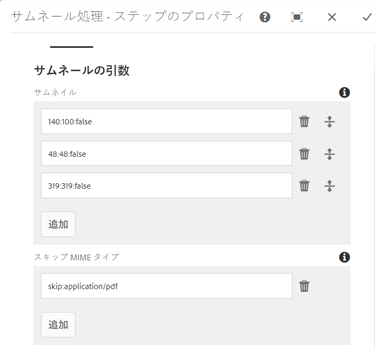
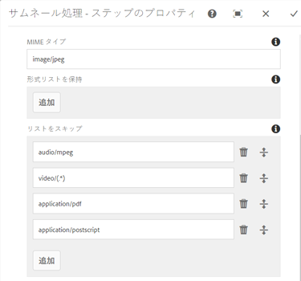
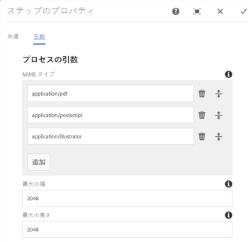
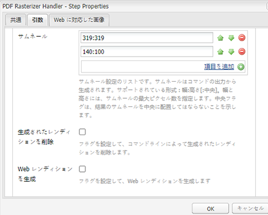
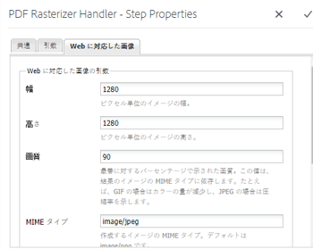
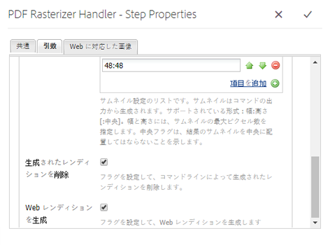
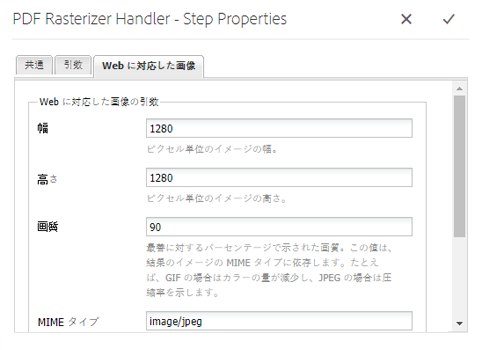

# PDFラスタライザを使用 {#using-pdf-rasterizer}

に大きく、コンテンツを大量に消費するPDFまたはAIファイルをアップロードする場合 [!DNL Adobe Experience Manager Assets]、デフォルトの変換では正確な出力が生成されない場合があります。 AdobeのPDFラスタライザライブラリでは、初期設定のライブラリの出力と比較して、より信頼性の高い正確な出力を生成できます。 Adobeでは、次の場合にPDF Rasterizerライブラリを使用することをお勧めします。

* 大量のコンテンツが必要なAIファイルまたはPDFファイル。
* デフォルトでは生成されないサムネール付きのAIファイルおよびPDFファイル。
* Pantone Matching System（PMS）カラーを使用した AI ファイル.

PDF Rasterizer を使用して生成されたサムネールおよびプレビューは、何もしなくてもすぐに使用できる出力に比べて高品質です。そのため、デバイス全体で一貫した表示エクスペリエンスを得ることができます。Adobe PDF Rasterizer ライブラリはカラースペース変換をサポートしません。ソースファイルのカラースペースに関わらず、RGB として出力されます。

1. PDF Rasterizerパッケージを、 [!DNL Adobe Experience Manager] Software Distribution （ソフトウェア配布）からデプロイメントにインストールします。

   >[!NOTE]
   >
   >PDF Rasterizer ライブラリは、Windows と Linux のみで使用できます。

1. で [!DNL Assets] ワークフローコンソールにアクセスし `https://[aem_server]:[port]/workflow`ます。 Open [!UICONTROL DAM Update Asset] workflow.

1. デフォルトの方法でPDFファイルおよびAIファイルのサムネールとWebレンディションが生成されないようにするには、次の手順に従います。

   * Open the **[!UICONTROL Process Thumbnails]** step, and add `application/pdf` or `application/postscript` in the **[!UICONTROL Skip Mime Types]** field under the **[!UICONTROL Thumbnails]** tab as necessary.

   

   * In the **[!UICONTROL Web Enabled Image]** tab, add `application/pdf` or `application/postscript` under **[!UICONTROL Skip List]** depending upon your requirements.

   

1. Open the **[!UICONTROL Rasterize PDF/AI Image Preview Rendition]** step, and remove the MIME type for which you want to skip the default generation of preview image renditions. For example, remove the MIME type `application/pdf`, `application/postscript`, or `application/illustrator` from the **[!UICONTROL MIME Types]** list.

   

1. 「**[!UICONTROL PDF Rasterizer Handler]**」ステップをサイドパネルから「**[!UICONTROL サムネールを処理]**」ステップの下にドラッグします。
1. Configure the following arguments for the **[!UICONTROL PDF Rasterizer Handler]** step:

   * MIME types: `application/pdf` または `application/postscript`
   * コマンド: `PDFRasterizer -d -p 1 -s 1280 -t PNG -i ${file}`
   * 追加するサムネールのサイズ：319:319、140:100、48:48。必要に応じて、サムネールのカスタム設定を追加します。

   `PDFRasterizer` コマンドのコマンドライン引数には、以下のものがあります。

   * `-d`:テキスト、ベクトルアートワークおよび画像のスムーズなレンダリングを有効にするフラグ。 高い画質の画像が作成されます。ただし、このパラメーターを指定すると、コマンドの実行速度が遅くなり、画像サイズも増大します。

   * `-p`:ページ番号。 デフォルト値は、すべてのページです。すべてのページを示す場合は、を使用し `*`ます。

   * `-s`:画像の最大寸法（高さまたは幅） これは各ページで DPI に変換されます。異なるサイズのページが混在している場合、ページごとに異なる比率で拡大縮小される場合があります。デフォルトは実際のページサイズです。

   * `-t`:出力画像の種類。 有効なタイプは JPEG、PNG、GIF および BMP です。デフォルト値は JPEG です。

   * `-i`:入力PDFのパス。 必須パラメーターです。

   * `-h`: ヘルプ

1. 中間レンディションを削除するには、「**[!UICONTROL 生成されたレンディションを削除]**」を選択します。

1. To let PDF Rasterizer generate web renditions, select **[!UICONTROL Generate Web Rendition]**.

   

1. Specify the settings in the **[!UICONTROL Web Enabled Image]** tab.

   

1. ワークフローを保存します。

1. To enable PDF Rasterizer to process PDF pages with PDF libraries, open the **[!UICONTROL DAM Process Subasset]** model from the [!UICONTROL Workflow] console.

1. From the side panel, drag the PDF Rasterizer Handler step under the **[!UICONTROL Create Web-Enabled Image Rendition]** step.

1. Configure the following arguments for the **[!UICONTROL PDF Rasterizer Handler]** step:

   * MIME types: `application/pdf` または `application/postscript`

   * コマンド: `PDFRasterizer -d -p 1 -s 1280 -t PNG -i ${file}`
   * Add thumbnail sizes: `319:319`, `140:100`, `48:48`. 必要に応じて、追加カスタムサムネールの設定を指定します。

   `PDFRasterizer` コマンドのコマンドライン引数には、以下のものがあります。

   * `-d`:テキスト、ベクトルアートワークおよび画像のスムーズなレンダリングを有効にするフラグ。 高い画質の画像が作成されます。ただし、このパラメーターを指定すると、コマンドの実行速度が遅くなり、画像サイズも増大します。

   * `-p`:ページ番号。 デフォルト値は、すべてのページです。`*` はすべてのページを表します。

   * `-s`:画像の最大寸法（高さまたは幅） これは各ページで DPI に変換されます。異なるサイズのページが混在している場合、ページごとに異なる比率で拡大縮小される場合があります。デフォルトは実際のページサイズです。

   * `-t`:出力画像の種類。 有効なタイプは JPEG、PNG、GIF および BMP です。デフォルト値は JPEG です。

   * `-i`:入力PDFのパス。 必須パラメーターです。

   * `-h`: ヘルプ

1. 中間レンディションを削除するには、「**[!UICONTROL 生成されたレンディションを削除]**」を選択します。
1. To let PDF Rasterizer generate web renditions, select **[!UICONTROL Generate Web Rendition]**.

   

1. Specify the settings in the **[!UICONTROL Web Enabled Image]** tab.

   

1. ワークフローを保存します。
1. Upload a PDF or an AI file to [!DNL Experience Manager Assets]. PDF Rasterizer により、ファイルのサムネールと Web レンディションが生成されます。
