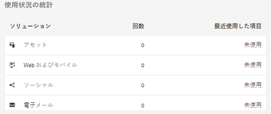

# アセットインサイト {#asset-insights}

アセットインサイト機能を使用すると、サードパーティの web サイト、マーケティングキャンペーン、アドビのクリエイティブソリューションで使用される画像のユーザーのレーティングと使用状況統計を追跡できます。画像のパフォーマンスと人気に関するインサイトを導き出せます。

[!DNL Assets]インサイトでは、画像の評価回数、クリック数、インプレッション数（画像が web サイトに読み込まれた回数）など、ユーザーのアクティビティの詳細を取得します。これらの統計情報に基づいて画像にスコアを割り当てます。スコアとパフォーマンス統計を使用して、人気が高い画像を選び、カタログやマーケティングキャンペーンなどに含めることができます。このような統計に基づいて、アーカイブやライセンス更新のポリシーを策定することもできます。

[!DNL Assets] インサイトが画像の使用状況統計を web サイトから取得するためには、画像の埋め込みコードを web サイトのコードに組み込む必要があります。

アセットインサイトでアセットの使用状況統計を表示するには、最初に Adobe Analytics からのレポートデータを取得するように機能を設定します。詳しくは、[アセットインサイトの設定](/help/assets/configure-asset-insights.md)を参照してください。オンプレミスのインストールでこの機能を使用するには、別途 [!DNL Adobe Analytics] ライセンスを購入します。[!DNL Managed Services] のユーザーには、[!DNL Experience Manager] に [!DNL Analytics] ライセンスがバンドルされています。詳しくは、[Managed Services 製品説明](https://helpx.adobe.com/jp/legal/product-descriptions/adobe-experience-manager-managed-services.html)を参照してください。

>[!NOTE]
>
>インサイトのサポートおよび提供が行われるのは、画像に対してのみです。

## 画像の統計情報の表示 {#viewing-statistics-for-an-image}

メタデータページでアセットインサイトのスコアを確認できます。

1. [!DNL Assets] ユーザーインターフェイス（UI）から画像を選択し、ツールバーから「**[!UICONTROL プロパティ]**」をクリックします。
1. プロパティページで、「**[!UICONTROL インサイト]**」タブをクリックします。
1. 「**[!UICONTROL インサイト]**」タブで、アセットの使用状況の詳細を確認します。「**[!UICONTROL スコア]**」セクションには、アセットの全体的な使用状況とパフォーマンスのスコアが表示されます。

   使用状況のスコアは、アセットが様々なソリューションで使用された回数です。

   「**[!UICONTROL インプレッション数]**」のスコアは、アセットが Web サイトに読み込まれた回数です。「**[!UICONTROL クリック数]**」の下に表示される数値は、アセットがクリックされた回数です。

1. 「**[!UICONTROL 使用状況の統計]**」セクションを見て、アセットが含まれているエンティティや最近使用されたクリエイティブソリューションを確認します。使用率が高いほど、ユーザーの間で人気のあるアセットであることを意味します。使用状況データは、次の見出しの下に表示されます。

   * **アセット**：アセットが、コレクションまたは複合アセットに含まれた回数
   * **Web およびモバイル**：アセットが Web サイトまたはアプリに含まれた回数
   * **ソーシャル**：アセットが Adobe Social や Adobe Campaign などのソリューションで使用された回数
   * **電子メール**：アセットがメールキャンペーンで使用された回数

   

   >[!NOTE]
   >
   >アセットインサイト機能は、通常 Adobe Analytics のソリューションデータを定期的に取得するので、「ソリューション」セクションには最新データが表示されていない場合があります。表示されるデータが対応する期間は、アセットインサイトが Analytics のデータを取得するために実行するフェッチ操作のスケジュールによって決まります。

1. 特定の期間のアセットのパフォーマンス統計をグラフィカルに表示するには、「**[!UICONTROL パフォーマンス統計]**」セクションで期間を選択します。クリック数やインプレッション数などの詳細がグラフの傾向線として表示されます。

   

   >[!NOTE]
   >
   >「ソリューション」セクションのデータとは異なり、「パフォーマンス統計」セクションには最新データが表示されます。

1. パフォーマンスデータを得るために web サイトに組み込んだアセットの埋め込みコードを取得するには、アセットのサムネールの下の「**[!UICONTROL 埋め込みコードの取得]**」をクリックします。サードパーティの web サイトに埋め込みコードを組み込む方法について詳しくは、[Web ページでのページトラッカーと埋め込みコードの使用](/help/assets/use-page-tracker.md)を参照してください。

   

## 画像の総統計の表示 {#viewing-aggregate-statistics-for-images}

**[!UICONTROL インサイト表示]**&#x200B;を使用すると、フォルダー内のすべてのアセットのスコアを同時に表示できます。

1. [!DNL Assets] ユーザーインターフェイスで、インサイトを表示するアセットを含むフォルダーに移動します。
1. ツールバーから「レイアウト」をクリックして、「**[!UICONTROL インサイト表示]**」を選択します。
1. このページには、アセットの使用状況スコアが表示されます。様々なアセットのレーティングを比較して、洞察を導きます。

## バックグラウンドジョブのスケジュール設定 {#scheduling-background-job}

アセットインサイトは、Adobe Analytics レポートスイートから定期的にアセットの使用状況データを取得します。デフォルトでは、アセットインサイトはデータを取得するためのバックグラウンドジョブを 24 時間おきに午前 2 時に実行します。この間隔と時刻は、**[!UICONTROL Adobe CQ DAM Asset Performance Report Sync Job]** サービスを Web コンソールで設定して変更できます。

1. [!DNL Experience Manager] のロゴをクリックし、**[!UICONTROL ツール]**／**[!UICONTROL 運営]**／**[!UICONTROL Web コンソール]**&#x200B;に移動します。
1. **[!UICONTROL Adobe CQ DAM Asset Performance Report Sync Job]** サービス設定を開きます。

   

1. プロパティスケジューラーの式にスケジューラーの目的の頻度とジョブの開始時間を指定します。変更内容を保存します。
