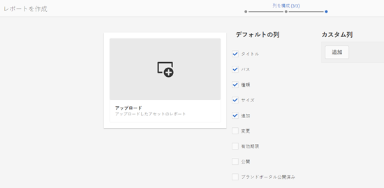

# アセットレポート {#asset-reports}

アセットレポートは、Adobe Experience Manager（AEM）Assets デプロイメントのユーティリティを評価するための重要なツールです。AEM Assetsを使用すると、デジタルアセットに関する様々なレポートを生成できます。 レポートでは、システムの使用状況、ユーザーによるアセットの操作方法、ダウンロードされたアセットや共有されているアセットなどに関する有用な情報が提供されます。

レポートの情報を使用して重要な成功指標を導き出し、企業やお客様における AEM Assets の採用状況を測定することができます。

AEM Assetsレポートフレームワークは、Slingジョブを使用して、順序に従ってレポート要求を非同期で処理します。 このフレームワークは大規模なリポジトリに合わせて拡張することができます。レポートの非同期処理により、レポートを生成する際の効率性とスピードが向上します。

直観的なレポート管理インターフェイスに備わっているきめ細かなオプションやコントロールを使用すれば、アーカイブされたレポートにアクセスしたり、レポートの実行ステータス（成功、失敗および待機中）を表示したりすることができます。

レポートが生成されると、電子メール（オプション）とインボックスで通知を受け取ります。それまでに生成されたすべてのレポートが示されるレポートリストページで、レポートの表示、ダウンロードまたは削除をおこなうことができます。

## レポートの生成 {#generate-reports}

AEM Assets では、次の標準レポートが生成されます。

* アップロード
* ダウンロード
* 有効期限
* 変更
* 公開
* Brand Portal 公開
* ディスク使用量
* ファイル
* リンク共有

AEM 管理者は、これらのレポートを手軽に生成し、実装に合わせて容易にカスタマイズできます。レポートを生成するには、以下の手順に従います。

1. Experience Managerインターフェイスで、 **[!UICONTROL ツール]** / **[!UICONTROL アセット]** / **[!UICONTROL レポートをクリックします]**。
   

1. On the [!UICONTROL Asset Reports] page, click **[!UICONTROL Create]** from the toolbar.
1. From the **[!UICONTROL Create Report]** page, choose the report you want to create and click **[!UICONTROL Next]**.

   

   >[!NOTE]
   >
   >「**[!UICONTROL ダウンロードされたアセット]**」レポートを生成する前に、Asset Download サービスが有効になっていることを確認してください。Web コンソール（`https://[aem_server]:[port]/system/console/configMgr`）で、「**[!UICONTROL Day CQ DAM Event Recorder]**」設定を開き、「イベントタイプ」で「**[!UICONTROL ダウンロードされたアセット（ダウンロード済み）]**」オプションを選択します（まだ選択されていない場合）。

   >[!NOTE]
   >
   >デフォルトで、「ダウンロードされたアセット」レポートにはコンテンツフラグメントとリンク共有が含まれています。適切なオプションを選択して、リンク共有のレポートを作成するか、ダウンロードレポートからコンテンツフラグメントを除外します。

1. タイトル、説明、サムネール、CRX リポジトリ内のフォルダーパス（レポートの保存場所）など、レポートの詳細を設定します。By default, the folder path is `/content/dam`. 別のパスを指定することもできます。

   

   レポートの日付範囲を選択します。

   レポートを今すぐ生成するか、将来の日時に生成するかを選択できます。

   >[!NOTE]
   >
   >レポートを後でスケジュールする場合は、「日付と時間」フィールドで日時を必ず指定してください。 値を指定しなかった場合、レポートエンジンはそのレポートをすぐに生成するものとして取り扱います。

   設定フィールドは、作成するレポートのタイプによって異なることがあります。例えば、「**[!UICONTROL ディスク使用量]**」レポートには、アセットが使用しているディスク領域を計算する際にアセットレンディションを含めるオプションが用意されています。ディスク使用量を計算するために、サブフォルダー内のアセットを含めるか、除外するかを選択できます。

   >[!NOTE]
   >
   >「**[!UICONTROL ディスク使用量]**」レポートには、現在のディスク領域使用量のみが示されます。そのため、日付範囲のフィールドはありません。

   

   When you create the **[!UICONTROL Files]** report, you can include/exclude sub-folders. ただし、このレポートの場合、アセットレンディションを含めることはできません。

   

   「**[!UICONTROL リンク共有]**」レポートには、AEM Assets 内から外部ユーザーと共有されているアセットへの URL が表示されます。アセットを共有したユーザーの電子メール ID、アセットを共有しているユーザーの電子メール ID、共有の日付、リンクの有効期限なども表示されます。列をカスタマイズすることはできません。

   The **[!UICONTROL Link Share]** report, does not include options for sub-folders and renditions because it merely publishes the shared URLs that appear under `/var/dam/share`.

   

1. Click **[!UICONTROL Next]** from the toolbar.

1. **[!UICONTROL 列を構成]**&#x200B;ページでは、いくつかの列がデフォルトでレポートに表示されるように選択されています。さらに列を選択できます。 選択されている列の選択を解除すると、その列はレポートから除外されます。

   

   カスタムの列名やプロパティパスを表示するには、CRX の jcr:content ノード下のアセットバイナリのプロパティを設定します。または、プロパティパスピッカーを使用してパスを追加します。

   

1. Click **[!UICONTROL Create]** from the toolbar. レポートの生成が開始されたことを通知するメッセージが表示されます。
1. アセットレポートページのレポート生成ステータスは、レポートジョブの現在の状態（「成功」、「失敗」、「待機中」、「スケジュール済み」など）に基づきます。通知インボックスにも同じステータスが表示されます。レポートページを表示するには、レポートのリンクをクリックします。 Alternatively, select the report, and click **[!UICONTROL View]** from the toolbar.

   

   Click **[!UICONTROL Download]** from the toolbar to download the report in CSV format.

## カスタム列の追加 {#add-custom-columns}

次のレポートにカスタム列を追加し、独自の要件に応じてさらに多くのデータを表示することができます。

* アップロード
* ダウンロード
* 有効期限
* 変更
* 公開
* Brand Portal 公開
* ファイル

これらのレポートにカスタム列を追加するには、次の手順に従います。

1. Experience Managerインターフェイスで、 **[!UICONTROL ツール]** / **[!UICONTROL アセット]** / **[!UICONTROL レポートをクリックします]**。
1. On the [!UICONTROL Asset Reports] page, click **[!UICONTROL Create]** from the toolbar.

1. From the **[!UICONTROL Create Report]** page, choose the report you want to create and click **[!UICONTROL Next]**.
1. 必要に応じて、タイトル、説明、サムネール、フォルダーパス、日付範囲などのレポートの詳細を設定します。

1. カスタム列を表示するには、「**[!UICONTROL カスタム列]**」で列の名前を指定します。

   

1. プロパティパスピッカーを使用して、CRXDE の `jcr:content` ノード下にプロパティパスを追加します。または、プロパティパスフィールドにパスを入力します。

   

   To add more custom columns, click **[!UICONTROL Add]** and repeat steps 5 and 6.

1. Click **[!UICONTROL Create]** from the toolbar. レポートの生成が開始されたことを通知するメッセージが表示されます。

## パージサービスの設定 {#configure-purging-service}

不要になったレポートを削除するには、数量や経過日数に基づいて既存のレポートをパージするように、Web コンソールで DAM レポートパージサービスを設定します。

1. `https://[aem_server]:[port]/system/console/configMgr` で Web コンソール（設定マネージャー）にアクセスします。
1. 「**[!UICONTROL DAM Report Purge Service]**」設定を開きます。
1. `scheduler.expression.name` フィールドでパージサービスの頻度（時間間隔）を指定します。レポートの経過日数および数量のしきい値を設定することもできます。
1. 変更内容を保存します。
