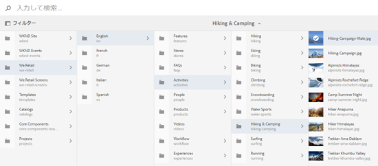
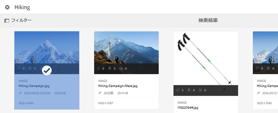
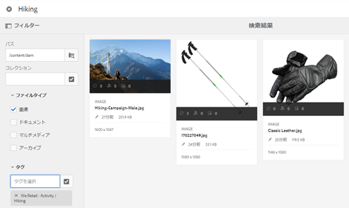

# アセットセレクター {#asset-selector}

>[!NOTE]
>
>アセットセレクターの名前は、 [アセットピッカー](https://helpx.adobe.com/jp/experience-manager/6-2/assets/using/asset-picker.html) 以前のバージョンの [!DNL Experience Manager].

アセットセレクターを使用すると、 [!DNL Adobe Experience Manager] アセット。 また、アセットセレクターを使用して選択したアセットのメタデータを取得することもできます。 アセットセレクターインターフェイスをカスタマイズするには、サポートされているリクエストパラメーターを使用して開始します。 これらのパラメーターは、特定のシナリオのアセットセレクターのコンテキストを設定します。

現在、リクエストパラメーターを渡すことができます `assettype` (*画像/ビデオ/テキスト*) および選択 `mode` (*単一/複数*) をアセットセレクターのコンテキスト情報として表示します。この情報は、選択操作の間、変わりません。

アセットセレクターは、HTML5 **Window.postMessage** 選択したアセットのデータを受信者に送信するメッセージ。

アセットセレクターは、Granite の基盤ピッカーのボキャブラリに基づいています。デフォルトでは、アセットセレクターは参照モードで動作します。 ただし、オムニサーチエクスペリエンスを使用してフィルターを適用し、特定のアセットの検索を絞り込むことができます。

任意の Web ページを（CQ コンテナに含まれているかどうかに関係なく）アセットセレクター (`https://[AEM_server]:[port]/aem/assetpicker.html`) をクリックします。

## コンテキストパラメーター {#contextual-parameters}

次のリクエストパラメーターを URL で渡して、特定のコンテキストでアセットセレクターを起動できます。

| 名前 | 値 | 例 | 目的 |
|---|---|---|---|
| リソースサフィックス (B) | URL のリソースサフィックスとしてのフォルダーパス：`http://localhost:4502/aem/` `assetpicker.html/<folder_path>` | 特定のフォルダーが選択された状態でアセットセレクターを起動するには、例えばフォルダーが `/content/dam/we-retail/en/activities` の場合、URL は `http://localhost:4502/aem/assetpicker.html` `/content/dam/we-retail/en/activities?assettype=images` のような形式になります | アセットセレクターの起動時に特定のフォルダーを選択する必要がある場合、そのフォルダーをリソースサフィックスとして渡します。 |
| mode | single、multiple | `http://localhost:4502/aem/assetpicker.html` `?mode=multiple`   `http://localhost:4502/aem/assetpicker.html` `?mode=single` | 複数モードでは、アセットセレクターを使用して、いくつかのアセットを同時に選択できます。 |
| dialog | true、false | `http://localhost:4502/aem/assetpicker.html` `?dialog=true` | アセットセレクターを Granite ダイアログとして開くには、これらのパラメーターを使用します。このオプションは、Granite パスフィールドを使用してアセットセレクターを起動し、pickerSrc URL として設定する場合にのみ適用できます。 |
| root | `<folder_path>` | `http://localhost:4502/aem/` `assetpicker.html?assettype=images` `&root=/content/dam/we-retail/en/activities` | アセットセレクターのルートフォルダーを指定するには、このオプションを使用します。 この場合、アセットセレクターを使用して、ルートフォルダーの下の子アセット（直接/間接）のみを選択できます。 |
| viewmode | 検索を |  | アセットタイプおよび MIME タイプパラメーターを使用して、アセットセレクターを検索モードで起動するには |
| assettype (S) | 画像，ドキュメント，マルチメディア，アーカイブ | <ul><li>`http://localhost:4502/aem/assetpicker.html?viewmode=search&assettype=images`</li> <li>`http://localhost:4502/aem/assetpicker.html?viewmode=search&assettype=documents`</li> <li>`http://localhost:4502/aem/assetpicker.html?viewmode=search&assettype=multimedia`</li> <li>`http://localhost:4502/aem/assetpicker.html?viewmode=search&assettype=archives`</li> | 渡された値に基づいてアセットタイプをフィルタリングするには、このオプションを使用します。 |
| mimetype | アセットの MIME タイプ（`/jcr:content/metadata/dc:format`）（ワイルドカードもサポートされています） | <ul><li>`http://localhost:4502/aem/assetpicker.html?viewmode=search&mimetype=image/png`</li>  <li>`http://localhost:4502/aem/assetpicker.html?viewmode=search&?mimetype=*png`</li>  <li>`http://localhost:4502/aem/assetpicker.html?viewmode=search&mimetype=*presentation`</li>  <li>`http://localhost:4502/aem/assetpicker?viewmode=search&mimetype=*presentation&mimetype=*png`</li></ul> | MIME タイプに基づいてアセットをフィルタリングする場合に使用します |

## アセットセレクターの使用 {#using-the-asset-selector}

1. アセットセレクターインターフェイスにアクセスするには、`https://[AEM_server]:[port]/aem/assetpicker` に移動します。
1. 目的のフォルダーに移動して、1 つまたは複数のアセットを選択します。

   

   または、オムニサーチボックスから目的のアセットを検索して選択することもできます。

   

   オムニサーチボックスを使用してアセットを検索する場合、 **[!UICONTROL フィルター]** ウィンドウを使用して検索を絞り込みます。

   

1. タップまたはクリック **[!UICONTROL 選択]** をクリックします。
