# Asset templates {#asset-templates}

アセットテンプレートは、デジタルメディアや印刷メディア用に視覚的に豊富なコンテンツをすばやく再利用できる特別なアセットクラスです。 アセットテンプレートには、固定メッセージセクションと編集可能セクションの 2 つの部分があります。

固定メッセージセクションには、編集できないブランドロゴおよび著作権情報など、独自のコンテンツを含めることができます。編集可能なセクションには、フィールド内の視覚的な内容やテキスト的な内容を含めることができます。この内容は、メッセージをカスタマイズするために編集できます。

グローバルな署名を保護しながら、編集を制限する柔軟性が高まると、アセットテンプレートは様々な機能のコンテンツアーティファクトとして、コンテンツの迅速な適合と配信を実現する理想的な構成要素になります。 コンテンツを再利用することで、印刷やデジタルチャネルの管理に要するコストを削減し、これらのチャネル全体で一貫性のある全体的なエクスペリエンスを提供できます。

As a marketer, you can store and manage templates within [!DNL Experience Manager Assets] and use a single base template to create multiple personalized print experiences with ease. 顧客にマーケティングメッセージを明確に伝えるために、パンフレット、チラシ、はがき、名刺など、様々なタイプのマーケティング資料を作成できます。 また、既存の、または新しいプリント出力から複数ページのプリント出力をアセンブルできます。特に、デジタルおよびプリントエクスペリエンスを簡単に同時配信して、一貫性のある統合されたエクスペリエンスをユーザーに提供できます。

While asset templates are mostly [!DNL Adobe InDesign] files, proficiency in [!DNL Adobe InDesign] is not a barrier to creating stellar artifacts. You need not map the fields of your [!DNL Adobe InDesign] template with your product fields that you otherwise require to when creating catalogs. テンプレートは、Webインターフェイス上でWYSIWYGモードで直接編集できます。 However, for [!DNL Adobe InDesign] to process your editing changes, you must first configure [!DNL Experience Manager Assets] to integrate with [!DNL Adobe InDesign Server].

The ability to edit [!DNL Adobe InDesign] templates from the web interface helps foster greater collaboration between Creative and Marketing personnel, while reducing the time to market for local promotion initiatives.

アセットテンプレートを使用すると、次のことができます。

* Web インターフェイスから編集可能テンプレートフィールドを変更する
* フォントサイズ、スタイル、タイプなど、タグレベルでテキストの基本スタイルを制御する
* コンテンツピッカーを使用してテンプレート内の画像を変更する
* テンプレートの編集をプレビューする
* 複数のテンプレートファイルを統合して複数ページの成果物を作成する

When you choose a template for your collateral, [!DNL Experience Manager Assets] creates a copy of the template that you can edit. 元のテンプレートは保持されるので、全体的な表記の元の状態を保つことができ、再利用してブランドの一貫性を強制できます。

親フォルダー内の更新されたファイルを次の形式で書き出すことができます。

* INDD
* PDF
* JPG

また、これらの形式でローカルシステムに出力をダウンロードできます。

## 資料の作成 {#creating-a-collateral}

今後のキャンペーンのために、パンフレット、チラシおよび広告など、デジタルの印刷可能な販促物を作成し、世界中のアウトレットストアで共有するシナリオについて考えてみます。テンプレートに基づいた販促物の作成は、チャネルをまたいで統合されたカスタマーエクスペリエンスを実現するのに役立ちます。Designers can create the campaign templates (single-page or multi-page) using a creative solution, such as [!DNL InDesign] and upload the templates to [!DNL Experience Manager Assets] for you. コラテラルを作成する前に、1つ以上のINDDテンプレートをにアップロードし、事前に使用できるよ [!DNL Experience Manager] うにします。

1. インターフェ [!DNL Experience Manager] イスで「アセット」 [!UICONTROL をクリックしま]す。

1. オプションから、「**[!UICONTROL テンプレート]**」を選択します。

   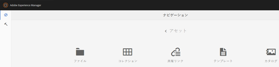

1. Click **[!UICONTROL Create]**, and then choose the collateral you want to create from the menu. For example, choose **[!UICONTROL Brochure]**.

   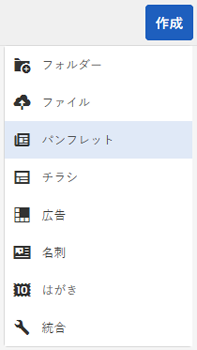

1. 1つ以上のINDDテンプレートをにアップロードし、事前に使用できるよ [!DNL Experience Manager] うにします。 Choose a template for your brochure, and click **[!UICONTROL Next]**.

   

1. パンフレットの名前と、オプションで説明を指定します。

   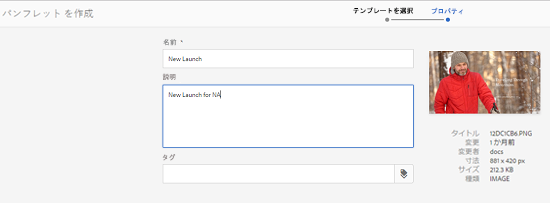

1. （オプション）「タグ **** 」をクリックし、パンフレットの1つ以上のタグを選択します。 Click **[!UICONTROL Confirm]** to confirm your selection.

   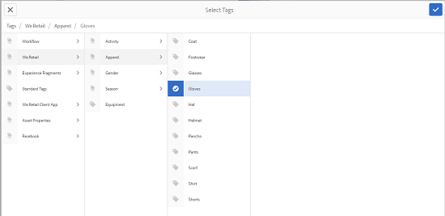

1. 「**[!UICONTROL 作成]**」をクリックします。新しいパンフレットが作成されたことを確認するダイアログが表示されます。Click **[!UICONTROL Open]** to open the brochure in edit mode.

   <!-- -->

   または、ダイアログを閉じて、開始したテンプレートページのフォルダーに移動し、作成したパンフレットを表示します。販促物のタイプがカード表示のサムネールに表示されます。例えば、この場合、サムネールにパンフレットと表示されます。

   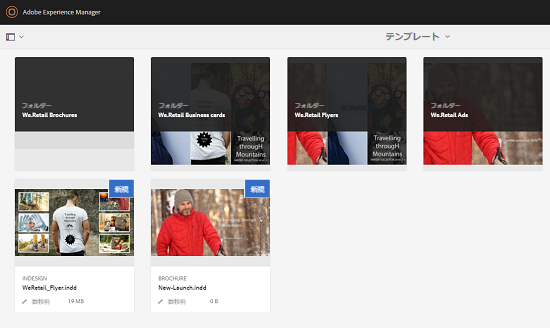

## コラテラルの編集 {#editing-a-collateral}

販促物を作成したら、すぐに編集できます。または、テンプレートページやアセットページから開きます。

1. 販促物を編集するために開くには、次のいずれかの操作をおこないます。

   * Open the collateral (brochure in this case) you created in step 7 of [Create a collateral](/help/assets/asset-templates.md#creating-a-collateral).
   * From the Templates page, navigate to a folder where you created the collateral, and click the [!UICONTROL Edit] quick action on the thumbnail of a collateral.
   * In the asset page for the collateral, click **[!UICONTROL Edit]** from the toolbar.
   * Select the collateral and click **[!UICONTROL Edit]** from the toolbar.
   <!-- -->

   アセットファインダーおよびテキストエディターがページの左側に表示されます。デフォルトで、テキストエディターが開きます。

   テキストエディターを使用して、テキストフィールドに表示させるテキストを変更します。タグレベルで、フォントサイズ、スタイル、カラーおよびタイプを変更できます。

   Using the asset finder, you can browse or search for images within [!DNL Experience Manager Assets] and replace the editable images in the template with images of your choice.

   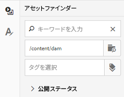

   編集可能であることは右側に表示されます。For a field to be editable in [!DNL Experience Manager Assets], corresponding field in the template must be tagged in [!DNL InDesign]. In other words, they should be marked as editable in [!DNL InDesign].

   

   >[!NOTE]
   >
   >Ensure that your [!DNL Experience Manager] instance is integrated with an [!DNL InDesign Server] to enable [!DNL Experience Manager Assets] to extract data from the InDesign template and make it available for editing. For details, see [Integrating Experience Manager Assets with InDesign Server](/help/assets/indesign.md).

1. 編集可能なフィールド内のテキストを変更するには、編集可能なフィールドのリストからテキストフィールドをクリックし、フィールド内のテキストを編集します。

   

   提供されるオプションを使用して、テキストプロパティ（例えば、フォントスタイル、カラー、サイズなど）を編集できます。

1. 「 **[!UICONTROL プレビュー]** 」をクリックし、テキストの変更をプレビューします。

   

1. To swap an image, click the **[!UICONTROL Asset Finder]**.

   

1. 編集可能なフィールドのリストから画像フィールドを選択して、アセットピッカーから編集可能なフィールドに目的の画像をドラッグします。

   

   また、キーワード、タグおよび公開ステータスに基づいて画像を検索できます。You can browse through the [!DNL Experience Manager Assets] repository and navigate to the location of the desired image.

   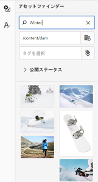

1. 「 **[!UICONTROL プレビュー]** 」をクリックし、画像をプレビューします。

   

1. 複数ページのコラテラル内の特定のページを編集するには、下部のページナビゲーターを使用します。

   

1. Click **[!UICONTROL Preview]**  on the toolbar to preview all the changes. Click **[!UICONTROL Done]** to save the editing changes to the collateral.

   >[!NOTE]
   >
   >「プレビュー」および「完了」アイコンは、販促物内の編集可能な画像フィールドに見つからないアイコンがない場合にのみ有効になります。If there are missing icons in your collateral, it is because [!DNL Experience Manager] is unable to resolve the images in the [!DNL InDesign] template. Usually, [!DNL Experience Manager] is unable to resolve images in the following cases:
   >
   >    * Images are not embedded in the underlying [!DNL InDesign] template.
   >    * 画像がローカルファイルシステムからリンクされている.
   >
   >To enable [!DNL Experience Manager] to resolve images, do the following:
   >
   >    * Embed images while creating [!DNL InDesign] templates (See [About links and embedded graphics](https://helpx.adobe.com/jp/indesign/using/graphics-links.html)).
   >    * Mount [!DNL Experience Manager] to your local file system, and then map missing icons with existing assets in [!DNL Experience Manager].
   >
   >For more information around working with [!DNL InDesign] documents, see [Best Practices for Working with InDesign Documents in Experience Manager](https://helpx.adobe.com/jp/experience-manager/kb/best-practices-idd-docs-aem.html).

1. パンフレットの PDF レンディションを生成するには、ダイアログで Acrobat オプションを選択し、「**[!UICONTROL 続行]**」をクリックします。
1. 開始したフォルダーに販促物が作成されます。レンディションを表示するには、販促物を開いて、グローバルナビゲーションリストから「**[!UICONTROL レンディション]**」を選択します。

   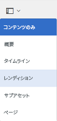

1. レンディションのリストでPDFレンディションをクリックし、PDFファイルをダウンロードします。 PDF ファイルを開いて、販促物を確認します。

   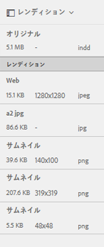

## Merge collateral {#merge-collateral}

1. インターフェイス [!DNL Experience Manager] で、ナビゲー [!UICONTROL ションページの] 「アセット」をクリックします。

1. オプションから、「**[!UICONTROL テンプレート]**」を選択します。

1. Click **[!UICONTROL Create]** and the choose **[!UICONTROL Merge]** from the menu.

   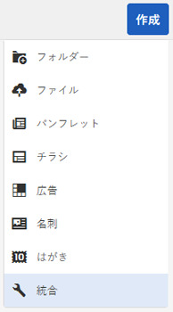

1. テンプレート [!UICONTROL の結合ページで] 、「結合」をクリッ **[!UICONTROL クします]**。

   

1. マージする販促物の場所にナビゲートし、マージする販促物のサムネールをクリックして選択します。

   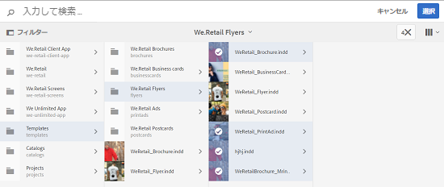

   また、「Omnisearch」ボックスからテンプレートを検索することもできます。

   

   You can browse through the [!DNL Experience Manager Assets] repository or collections, and navigate to the location of the desired templates and then select them to merge.

   

   様々なフィルターを適用して、目的のテンプレートを検索できます。例えば、ファイルタイプやタグに基づいてテンプレートを検索できます。

   

1. Click **[!UICONTROL Next]** from the toolbar.
1. In the **[!UICONTROL Preview &amp; Reorder]** screen, rearrange the templates if required and preview the selection of templates to merge. Then, click **[!UICONTROL Next]** from the toolbar.

   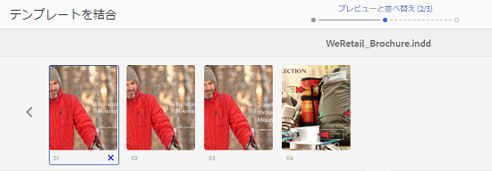

1. In the [!UICONTROL Configure Template] screen, specify a name for the collateral. オプションで、適切なタグを指定します。If you want to export the output in PDF format, select **[!UICONTROL Acrobat (.PDF)]**. By default, the collateral is exported in JPG and [!DNL InDesign] format. To change the display thumbnail for the multi-page collateral, click **[!UICONTROL Change Thumbnail]**.

   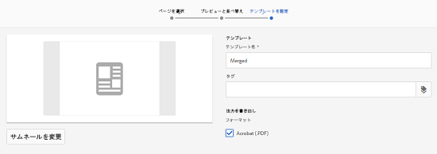

1. Click **[!UICONTROL Save]** and then click **[!UICONTROL OK]** in the dialog to close the dialog. 複数ページのコラテラルが、最初に作成したフォルダに作成されます。

   >[!NOTE]
   >
   >統合された販促物を後で編集したり、他の販促物を作成するために使用したりすることはできません。
