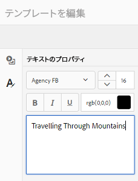

# アセットテンプレート {#asset-templates}

アセットテンプレートは、デジタルメディアや印刷メディア用に視覚的にリッチなコンテンツをすばやく再利用できる、アセットの特殊なクラスです。 アセットテンプレートには、固定メッセージセクションと編集可能セクションの 2 つの部分があります。固定メッセージセクションには、編集できないブランドロゴや著作権情報など、独自のコンテンツを含めることができます。編集可能セクションには、編集可能なフィールドに視覚的コンテンツやテキストコンテンツを含めて、メッセージをカスタマイズできます。

全体的な表記を保護しながら制限付きの編集をおこなう柔軟なアセットテンプレートは、様々な機能に対してすばやくコンテンツを適応させ、コンテンツのアーティファクトとして配布するための理想的な構築ブロックです。コンテンツを転用することで、印刷チャネルとデジタルチャネルの管理コストを削減し、それらのチャネルをまたいで総合的で一貫性のあるエクスペリエンスを提供できます。

マーケターの場合、[!DNL Experience Manager Assets] 内にテンプレートを保存して管理し、1 つの基本テンプレートを使用して複数のパーソナライズされたプリントエクスペリエンスを簡単に作成できます。パンフレット、チラシ、はがき、名刺など、様々なタイプのマーケティング資料を作成して、顧客にマーケティングメッセージを明確に伝えることができます。 また、既存の、または新しいプリント出力から複数ページのプリント出力をアセンブルできます。特に、デジタルおよびプリントエクスペリエンスを簡単に同時配信して、一貫性のある統合されたエクスペリエンスをユーザーに提供できます。

アセットテンプレートはほとんど [!DNL Adobe InDesign] ファイルですが、[!DNL Adobe InDesign] に習熟していても、優れたアーティファクトを作成する上での障害にはなりません。次の項目に対してフィールドをマッピングする必要はありません。 [!DNL Adobe InDesign] テンプレートと製品フィールドを組み合わせ、カタログの作成時に必要となるものを指定します。 Web インターフェイス上で直接、WYSIWYG モードでテンプレートを編集できます。ただし、[!DNL Adobe InDesign] で編集の変更を処理する場合、最初に [!DNL Adobe InDesign Server] と統合するように [!DNL Experience Manager Assets] を設定する必要があります。

Web インターフェイスから [!DNL Adobe InDesign] テンプレートを編集する機能は、クリエイティブ担当者とマーケティング担当者との共同作業を促進するのに役立ちます。コンテンツの速度が上がると、マーケティング販促物の市場投入までの時間を短縮できます。

アセットテンプレートを使用すると、次のことができます。

* Web インターフェイスから編集可能テンプレートフィールドを変更する。
* フォントサイズ、スタイル、タイプなど、タグレベルでテキストの基本スタイルを制御します。
* コンテンツピッカーを使用してテンプレート内の画像を変更する。
* テンプレートの編集をプレビューする。
* 複数のテンプレートファイルを結合して、複数ページのアーティファクトを作成できます。

販促物のテンプレートを選択すると、[!DNL Experience Manager Assets] は編集可能なテンプレートのコピーを作成します。元のテンプレートは保持されるので、全体的な表記はそのままの状態で残り、再利用してブランドの一貫性を確保できます。

親フォルダー内にある更新されたファイルを INDD、PDF、JPG のいずれかの形式で書き出すことができます。また、これらの形式でローカルファイルシステムに出力をダウンロードできます。

## 販促物の作成 {#creating-a-collateral}

今後のキャンペーンのために、パンフレット、チラシおよび広告など、デジタルの印刷可能な販促物を作成し、世界中のアウトレットストアで共有するシナリオについて考えてみます。テンプレートに基づいた販促物の作成は、チャネルをまたいで統合されたカスタマーエクスペリエンスを実現するのに役立ちます。デザイナーは、[!DNL InDesign] などのクリエイティブソリューションを使用してキャンペーンテンプレート（単一ページまたは複数ページ）を作成し、テンプレートを [!DNL Experience Manager Assets] にアップロードできます。販促物を作成する前に、1 つ以上の INDD テンプレートをにアップロードし、で使用できるようにします。 [!DNL Experience Manager] 事前に

1. Adobe Analytics の [!DNL Experience Manager] インタフェース、選択 [!UICONTROL Assets].

1. オプションから、「**[!UICONTROL テンプレート]**」を選択します。

   

1. 選択 **[!UICONTROL 作成]**&#x200B;をクリックし、メニューから作成する販促物を選択します。 例えば、「**[!UICONTROL パンフレット]**」を選択します。

   

1. 1 つ以上の INDD テンプレートを事前に [!DNL Experience Manager] にアップロードして利用できるようにします。パンフレット用のテンプレートを選択して、「**[!UICONTROL 次へ]**」をクリックします。
1. パンフレットの名前と、オプションで説明を指定します。

   

1. （オプション）「**[!UICONTROL タグ]**」をクリックして、パンフレットの 1 つ以上のタグを選択します。「**[!UICONTROL 確認]**」をクリックして選択を確定します。
1. 「**[!UICONTROL 作成]**」をクリックします。新しいパンフレットが作成されたことを確認するダイアログが表示されます。「**[!UICONTROL 開く]**」をクリックして、パンフレットを編集モードで開きます。

   <!-- -->

   または、ダイアログを閉じて、開始したテンプレートページのフォルダーに移動し、作成したパンフレットを表示します。販促物のタイプがカード表示のサムネールに表示されます。例えば、この場合、サムネールに「[!UICONTROL パンフレット]」という文字が表示されます。

   

## 販促物の編集 {#editing-a-collateral}

販促物は、作成後すぐに編集できます。 または、[!UICONTROL テンプレート]ページやアセットページから開きます。

1. 販促物を編集するために開くには、次のいずれかの操作をおこないます。

   * の手順 7 で作成した販促物（この場合はパンフレット）を開きます。 [販促物の作成](/help/assets/asset-templates.md#creating-a-collateral).
   * テンプレートページで、販促物を作成したフォルダーに移動し、 [!UICONTROL 編集] 副作品のサムネイルに対するクイックアクション。
   * 販促物のアセットページで、ツールバーの「**[!UICONTROL 編集]**」をクリックします。
   * 販促物を選択し、ツールバーの「**[!UICONTROL 編集]**」をクリックします。

   <!-- -->

   アセットファインダーとテキストエディターがページの左側に表示されます。 デフォルトで、テキストエディターが開きます。

   テキストエディターを使用して、テキストフィールドに表示するテキストを変更します。 タグレベルで、フォントサイズ、スタイル、カラーおよびタイプを変更できます。

   アセットファインダーを使用するには、 [!DNL Experience Manager Assets] テンプレート内の編集可能な画像を選択した画像に置き換えます。

   

   編集可能な画像が右側に表示されます。 [!DNL Experience Manager Assets]で編集可能なフィールドは、テンプレート内の対応するフィールドが[!DNL InDesign]でタグ付けされている必要があります。つまり、 [!DNL InDesign]で編集可能としてマークされる必要があります。

   >[!NOTE]
   >
   >[!DNL Experience Manager Assets] で [!DNL InDesign] テンプレートからデータを抽出し、編集できるようにするために、[!DNL Experience Manager] 配置が [!DNL InDesign Server] と統合されていることを確認します。詳しくは、 [Experience Manager AssetsとInDesign Serverの統合](/help/assets/indesign.md).

1. 編集可能なフィールドのテキストを変更するには、編集可能なフィールドのリストからテキストフィールドをクリックまたはタップして、フィールドのテキストを編集します。

   

   提供されるオプションを使用して、テキストプロパティ（例えば、フォントスタイル、カラー、サイズなど）を編集できます。

1. 選択 **[!UICONTROL プレビュー]** テキストの変化をプレビューできます。

1. 画像をスワップするには、 **[!UICONTROL アセットファインダー]** .

1. 編集可能なフィールドのリストから画像フィールドを選択して、アセットピッカーから編集可能なフィールドに目的の画像をドラッグします。

   

   また、キーワード、タグ、公開ステータスに基づいて画像を検索できます。[!DNL Experience Manager Assets]リポジトリを参照して、目的の画像の場所に移動できます。

   

1. 選択 **[!UICONTROL プレビュー]** 画像をプレビューできます。
1. 複数ページの販促物の特定のページを編集するには、下部にあるページナビゲーターを使用します。

1. 選択 **[!UICONTROL プレビュー]** をタップして、すべての変更をプレビューできるようにします。 選択 **[!UICONTROL 完了]** をクリックして、販促物に対する編集の変更を保存します。

   >[!NOTE]
   >
   >「プレビュー」と「完了」のオプションは、販促物内の編集可能な画像フィールドに見つからないアイコンがない場合にのみ有効になります。アイコンが表示されない場合は、[!DNL Experience Manager]が[!DNL InDesign]テンプレート内の画像を解決できないためです。通常、 [!DNL Experience Manager] は次の場合に画像を解決できません。
   >
   >* 画像は、基礎となる [!DNL InDesign] テンプレートには埋め込まれません。
   >* 画像がローカルファイルシステムからリンクされています。
   >
   >[!DNL Experience Manager] で画像分解できるようにするには、次のようにします。
   >
   >* [!DNL InDesign] テンプレート作成時に画像を埋め込む（[リンクと埋め込み画像について](https://helpx.adobe.com/jp/indesign/using/graphics-links.html)を参照）。
   >* [!DNL Experience Manager] をローカルファイルシステムにマウントし、足りないアイコンを [!DNL Experience Manager] の既存アセットとマッピングします。
   >
   >[!DNL InDesign] ドキュメントでの作業の詳細については、「[ Experience ManagerでInDesignドキュメントを使用するためのベストプラクティス](https://helpx.adobe.com/jp/experience-manager/kb/best-practices-idd-docs-aem.html)」を参照してください。

1. パンフレットの PDF レンディションを生成するには、ダイアログで Acrobat オプションを選択し、「**[!UICONTROL 続行]**」をクリックします。
1. 販促物は、最初に作成したフォルダーに作成されます。 レンディションを表示するには、販促物を開いて、グローバルナビゲーションリストから「**[!UICONTROL レンディション]**」を選択します。

   

1. レンディションのリストからPDFレンディションを選択し、PDFファイルをダウンロードできます。 PDF ファイルを開いて、販促物を確認します。

   

## 販促物の統合 {#merge-collateral}

1. Adobe Analytics の [!DNL Experience Manager] インタフェース、選択 [!UICONTROL Assets] をクリックします。

1. オプションから、「 」を選択します。 **[!UICONTROL テンプレート]**.

1. 選択 **[!UICONTROL 作成]**&#x200B;を選択し、メニューから「 **[!UICONTROL 結合]**.

   

1. 次から： [!UICONTROL テンプレートの結合] ページ、選択 **[!UICONTROL 結合]** .

1. マージする販促物の場所に移動し、マージする販促物のサムネールを選択して選択します。

   

   オムニサーチボックスからテンプレートを検索することもできます。

   [!DNL Experience Manager Assets] リポジトリーまたはコレクションを参照して、目的のテンプレートの場所に移動してから、統合するテンプレートを選択できます。

   様々なフィルターを適用して、目的のテンプレートを検索できます。例えば、ファイルタイプやタグに基づいてテンプレートを検索できます。

1. 選択 **[!UICONTROL 次へ]** をクリックします。
1. **[!UICONTROL プレビューと並べ替え]**&#x200B;画面で、必要に応じてテンプレートを再配置し、統合するために選択したテンプレートをプレビューします。ツールバーで、「 」を選択します。 **[!UICONTROL 次へ]**.

   

1. [!UICONTROL テンプレートの設定]画面で、販促物の名前を指定します。オプションで、適切なタグを指定します。PDF 形式で出力を書き出す場合は、「**[!UICONTROL Acrobat (.PDF)]**」を選択します。デフォルトでは、販促物は JPG および [!DNL InDesign] 形式で書き出されます。複数ページの販促物の表示サムネールを変更するには、「**[!UICONTROL サムネールを変更]**」をクリックします。

   

1. 選択 **[!UICONTROL 保存]**&#x200B;をクリックしてから、 **[!UICONTROL OK]**. 複数ページの販促物が、最初に使用したフォルダーに作成されます。

   >[!NOTE]
   >
   >マージされた販促物を後で編集したり、他の販促物を作成するために使用したりすることはできません。

## ベストプラクティスと制限事項 {#best-practices-limitations-tips}

* [!DNL Experience Manager] の [!DNL InDesign] エディターはタグレベルで動作し、単一のタグの下のテキストはすべて単一のエンティティと見なされます。編集時にテキストの書式とスタイルを維持するために、各段落（またはテキスト）を異なるスタイル設定で個別にタグ付けします。
