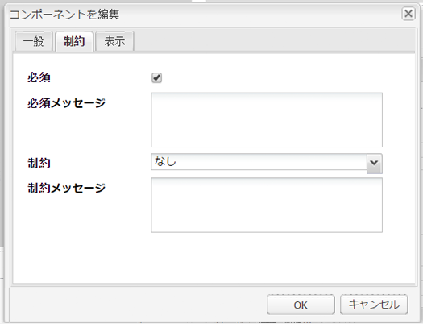

# Create and configure Asset Editor pages {#creating-and-configuring-asset-editor-pages}

このドキュメントは次の内容について説明します。

* カスタマイズされたアセットエディターページを作成する理由。
* アセットエディターページ（メタデータの表示と編集、およびアセットに対するアクションの実行に使用する WCM ページ）の作成とカスタマイズの方法
* 複数のアセットを同時に編集する方法

<!-- TBD: Add UICONTROL tags. Need PM review. Flatten the structure a bit. Re-write to remove Geometrixx mentions and to adhere to 6.5 OOTB samples. -->

>[!NOTE]
>
>アセット共有は、オープンソースの参照実装として使用できます。[Asset Share Commons](https://adobe-marketing-cloud.github.io/asset-share-commons/) を参照してください。アセット共有は正式にはサポートされていません。

## Why create and configure Asset Editor pages? {#why-create-and-configure-asset-editor-pages}

デジタルアセット管理は、ますます広く使用されるようになっています。専門的な教育を受けたユーザー（写真家や分類学者など）による小規模なユーザーグループ向けの小規模なソリューションから、大規模で多様なユーザーグループ（ビジネスユーザー、WCM 作成者、ジャーナリストなど）に移行する場合、専門的なユーザー向けの Adobe Experience Manager（AEM）Assets の強力なユーザーインターフェイスでは、利用できる情報が多すぎて不便が生じることがあります。この場合、関係者にとって必要なデジタルアセットにアクセスするための目的に特化したユーザーインターフェイスやアプリケーションが求められるようになります。

そのようなアセット中心型アプリケーションの例として、従業員が展示会に参加した際の写真をアップロードできるイントラネット内のシンプルな写真ギャラリーや、公開 Web サイトでのプレスセンター（Geometrixx で提供されたサンプルなど）があります。アセット中心型アプリケーションは、ショッピングカート、チェックアウト、検証プロセスを含む完全なソリューションに拡張することもできます。

アセット中心型アプリケーションの作成の大部分は、コーディングを必要としない設定プロセスとなります。ここでは、ユーザーグループとそのニーズ、使用されるメタデータに関する知識のみが必要となります。AEM Assets で作成されたアセット中心型アプリケーションは拡張可能です。適度なコーディング作業によって、アセットの検索、表示、変更のための再利用可能なコンポーネントを作成できます。

AEM のアセット中心型アプリケーションは、特定アセットの詳細を表示するのに利用できるアセットエディターページで構成されます。アセットエディターページでは、アセットにアクセスするユーザーが必要な権限を持っていれば、メタデータの編集も可能です。

## アセット共有ページの作成と設定 {#creating-and-configuring-an-asset-share-page}

DAM Finder 機能をカスタマイズし、必要なすべての機能を持つページを作成します。これらのページがアセット共有ページと呼ばれます。新しいアセット共有ページを作成するには、Geometrixx アセット共有テンプレートを使用してページを追加し、次にそのページに対してユーザーが実行できるアクションをカスタマイズします。さらに、アセットの表示方法と、ユーザーによるクエリの作成方法を決定します。

カスタマイズされたアセット共有ページを作成する用途としては次のような例が考えられます。

* ジャーナリスト向けのプレスセンター
* 社内ビジネスユーザー向けの画像検索エンジン
* Web サイトユーザー向けの画像データベース
* メタデータエディター向けのメディアタグ作成インターフェイス

### アセット共有ページの作成 {#creating-an-asset-share-page}

新しいアセット共有ページを作成する方法として、Web サイトでの作業中に作成するか、Digital Asset Manager から作成することができます。

>[!NOTE]
>
>デフォルトでは、Digital Asset Manager の「**新規**」からアセット共有ページを作成すると、アセットビューアおよびアセットエディターが自動的に作成されます。

**Web サイト**&#x200B;コンソールで新しいアセット共有ページを作成するには：

1. 「**Web サイト**」タブで、アセット共有ページを作成する場所に移動し、「**新規**」をクリックします。

1. Select the **Asset Share** page and click **Create**. The new page is created and the asset share page is listed in the **Websites** tab.

Geometrixx DAM アセット共有テンプレートを使用して作成した基本ページは次のイメージのようになります。

To customize your Asset Share page, you use elements from the sidekick and you also edit query builder properties. The page **Geometrixx Press Center** is a customized version of a page based on this template:

Digital Asset Manager を使用して新しいアセット共有ページを作成するには：

1. Digital Asset Manager の「**新規**」で、「**新しいアセット共有**」を選択します。
1. 「**タイトル**」にアセット共有ページの名前を入力します。必要に応じて、URL の名前を入力します。

   

1. アセット共有ページをダブルクリックして開き、ページの設定をおこないます。

   

   デフォルトでは、「**新規**」からアセット共有ページを作成すると、アセットビューアおよびアセットエディターが自動的に作成されます。

#### アクションのカスタマイズ {#customizing-actions}

定義済みの一連のアクションから、選択したデジタルアセットに対してユーザーが実行できるアクションを決定できます。

アセット共有ページにアクションを追加するには：

1. カスタマイズするアセット共有ページで、サイドキックの「**アクション**」をクリックします。

次のアクションが使用可能です。

| アクション | 説明 |
|---|---|
| [!UICONTROL アクションを削除] | ユーザーが選択したアセットを削除できます。 |
| [!UICONTROL アクションをダウンロード] | ユーザーが選択したアセットをコンピューターにダウンロードできるようにします。 |
| [!UICONTROL Lightbox アクション] | アセットを「Lightbox」に保存します。Lightbox では、保存されたアセットに対して他のアクションを実行できます。これは、複数のページにまたがるアセットを操作する場合に便利です。Lightbox は、アセットの買い物かごとしても使用できます。 |
| [!UICONTROL アクションを移動] | ユーザーがアセットを別の場所に移動できます。 |
| [!UICONTROL タグアクション] | ユーザーが選択したアセットにタグを追加できるようにします。 |
| [!UICONTROL アセットアクションを表示] | ユーザーが変更できるように、アセットをアセットエディターで開きます。 |

1. Drag the appropriate action to the **Actions** area on the page. これによって、そのアクションを実行するボタンが作成されます。

#### Determine how search results are presented {#determining-how-search-results-are-presented}

事前定義済みのレンズリストで、結果の表示方法を指定します。

検索結果の表示方法を変更するには：

1. カスタマイズするアセット共有ページで、「検索」をクリックします。

1. 適切なレンズをページの上中央にドラッグします。 Press Center では、レンズは既に使用可能な状態です。ユーザーは適切なレンズアイコンをクリックして、求めるとおりの検索結果を表示します。

次のレンズが使用可能です。

| レンズ | 説明 |
|---|---|
| **[!UICONTROL リストレンズ]** | 詳細情報を含むリスト形式でアセットを表示します。 |
| **[!UICONTROL モザイクレンズ]** | モザイク形式でアセットを表示します。 |

#### モザイクレンズ {#mosaic-lens}

#### リストレンズ {#list-lens}

#### Customize the Query Builder {#customizing-the-query-builder}

クエリビルダーでは、検索語句を入力し、アセット共有ページのコンテンツを作成できます。クエリビルダーの編集時に、1 ページに表示する検索結果数、アセットのダブルクリック時に開くアセットエディターおよびクエリ検索パスを指定し、ノード型をカスタマイズします。

クエリビルダーをカスタマイズするには：

1. カスタマイズするアセット共有ページで、QueryBuilder の「**編集**」をクリックします。デフォルトでは、「**一般**」タブが開きます。
1. ページあたりの結果数、アセットエディターのパス（カスタマイズしたアセットエディターがある場合）、およびアクションタイトルを選択します。

1. Click the **Paths** tab. 検索対象とする 1 つまたは複数のパスを入力します。ユーザーがパスの述語を使用すると、これらのパスは上書きされます。

1. 必要に応じて、別のノードタイプを入力します。

1. In the **Query Builder URL** field, you can override or wrap the query builder and enter the new servlet URLs with the existing query builder component. 「**フィード URL**」フィールドで、フィード URL を上書きすることもできます。

1. In the **Text** field, enter the text you want to appear for results and page numbers of results. 変更作業が完了したら、「**OK**」をクリックします。

#### 述語の追加 {#adding-predicates}

AEM Assets には、アセット共有ページに追加できる多数の述語が用意されています。述語を使用すると、ユーザーが検索をさらに絞り込むことができます。一部のケースでは、指定した述語がクエリビルダーのパラメーター（「パス」パラメーターなど）よりも優先されます。

述語を追加するには：

1. カスタマイズするアセット共有ページで、「**検索**」をクリックします。

1. 適切な述部を、クエリービルダーの下のアセット共有ページにドラッグします。 これによって、適切なフィールドが作成されます。

次の述語が使用可能です。

| 述語 | 説明 |
|---|---|
| **[!UICONTROL 日付の述語]** | ユーザーが特定の日付の前後に変更されたアセットを検索できるようにします。 |
| **[!UICONTROL オプションの述語]** | サイト所有者が検索用のプロパティを指定できます（プロパティの述語などで、例えば cq:tags と指定）。また、オプションを設定するためのコンテンツツリー（タグツリーなど）を指定できます。この操作によってオプションのリストが生成され、ユーザーはこのリストから、選択されたプロパティ（タグプロパティ）に含まれる値（タグ）を選択できます。この述語を使用すれば、タグのリスト、ファイルタイプのリスト、画像の向きのリストなどのリストコントロールを作成できます。この述語は、固定数のオプションに適しています。 |
| **[!UICONTROL パスの述語]** | ユーザーがパス（および必要に応じてサブフォルダー）を定義できるようにします。 |
| **[!UICONTROL プロパティの述語]** | サイト所有者が検索対象のプロパティ（例：tiff:ImageLength）を指定すると、ユーザーが値（例：800）を入力できます。この例では、高さが 800 ピクセルのすべての画像が返されます。プロパティに任意の値を設定できる場合に有効な述語です。 |

For more information, see the [predicate Javadocs](https://helpx.adobe.com/experience-manager/6-5/sites/developing/using/reference-materials/javadoc/com/day/cq/search/eval/package-summary.html).

1. 述語をさらに構成するには、述語をダブルクリックします。 例えば、「パスの述語」を開いたら、ルートパスを指定する必要があります。

## アセットエディタページの作成と設定 {#creating-and-configuring-an-asset-editor-page}

アセットエディターをカスタマイズして、ユーザーによるデジタルアセットの表示および編集方法を指定します。これをおこなうには、新規のアセットエディターページを作成してから、ユーザーがページに対して実行できる表示とアクションをカスタマイズします。

>[!NOTE]
>
>If you want to add custom fields to the DAM asset editor, add new cq:Widget nodes to `/apps/dam/content/asseteditors.`

### Create an Asset Editor page {#creating-the-asset-editor-page}

アセットエディターページを作成する場合に、アセット共有ページのすぐ下にページを作成することをお勧めします。

アセットエディターページを作成するには：

1. 「**Web サイト**」タブで、アセットエディターページを作成する場所に移動し、「**新規**」をクリックします。
1. 「**Geometrixx アセットエディター**」を選択し、「**作成**」をクリックします。新しいページが作成され、ページが「**Web サイト**」タブに表示されます。

Geometrixx アセットエディターテンプレートを使用して作成された基本ページは次のイメージのようになります。

To customize your Asset Editor page, use elements from the sidekick. The Asset Editor page that is accessed from the **Geometrixx Press Center** is a customized version of a page based on this template:

#### アセット共有ページから開くようにアセットエディターを設定する {#setting-which-asset-editor-opens-from-an-asset-share-page}

カスタムのアセットエディターページを作成したら、アセット（作成したカスタムのアセット共有）をダブルクリックすると、カスタマイムのエディターページでアセットが開くことを確認する必要があります。

アセットエディターページを設定するには：

1. アセット共有ページで、QueryBuilder の隣にある「**編集**」をクリックします。

1. Click the **General** tab if it is not already selected.

1. In the **Path of Asset Editor** field, enter the path to the asset editor you want the Asset Share page to open assets in and click **OK**.

#### Add Asset Editor components {#adding-asset-editor-components}

アセットエディターに含める機能を指定するには、ページにコンポーネントを追加します。

アセットエディターコンポーネントを追加するには：

1. カスタマイズするアセットエディターページで、サイドキックの「**アセットエディター**」を選択します。使用可能なすべてのアセットエディターコンポーネントが表示されます。

>[!NOTE]
>
>何をカスタマイズできるかは、使用可能なコンポーネントによって異なります。コンポーネントを有効にするには、デザインモードに移動し、有効にする必要のあるコンポーネントを選択します。

1. コンポーネントをサイドキックからアセットエディタにドラッグし、コンポーネントダイアログで変更を行います。 コンポーネントについて、次の表およびその下の詳細説明で説明します。

>[!NOTE]
>
>アセットエディターページのデザイン時に、読み取り専用、編集可能のいずれかのコンポーネントを作成します。ユーザーは、そのコンポーネント内に鉛筆の画像が表示されればフィールドが編集可能であるとわかります。デフォルトでは、ほとんどのコンポーネントは読み取り専用として設定されます。

| コンポーネント | 説明 |
|---|---|
| **[!UICONTROL Metadata Form]and[!UICONTROL Metadata Text Field]** | アセットにメタデータを追加し、そのアセットに対して送信などのアクションを実行できるようにします。 |
| **[!UICONTROL サブアセット]** | サブアセットをカスタマイズできるようにします。 |
| **タグ** | ユーザーがタグを選択してアセットに追加できるようにします。 |
| **[!UICONTROL サムネール]** | アセットのサムネールとファイル名を表示し、代替テキストを追加できるようにします。ここでは、アセットエディターのアクションを追加することもできます。 |
| **[!UICONTROL タイトル]** | アセットのタイトルを表示します。このタイトルはカスタマイズ可能です。 |

#### メタデータフォームとテキストフィールド - メタデータの表示コンポーネントの設定 {#metadata-form-and-text-field-configuring-the-view-metadata-component}

メタデータフォームは、開始アクションと終了アクションを含むフォームです。その間には、**テキスト**&#x200B;フィールドを入力します。フォームの操作について詳しくは、[フォーム](/help/sites-authoring/default-components-foundation.md#form-component)を参照してください。

1. Create a start action by clicking **Edit** in the Start area of the form. 必要に応じて、「ボックスタイトル」にボックスタイトルを入力できます。デフォルトでは、ボックスタイトルは「**メタデータ**」です。生成された Java スクリプトクライアントコードを検証する場合は、「クライアントの検証」チェックボックスをオンにします。

1. Create an End action by clicking **Edit** in the End area of the form. 例えば、ユーザーがメタデータの変更内容を送信できる「**送信**」ボタンを作成できます。また、オプションとして、メタデータを元の状態にリセットする「**リセット**」ボタンを追加できます。

1. In between the **Form Start** and the **Form End**, drag Metadata Text Fields to the form. ユーザーはこれらのテキストフィールドにメタデータを入力し、このメタデータを送信するか、他のアクションを実行することができます。

1. Double-click the field name, for example, **Title** to open the metadata field and make changes. **コンポーネントを編集**&#x200B;ウィンドウの「**一般**」タブで、名前空間、フィールドラベル、型（`dc:title` など）を定義します。

See [Customizing and Extending AEM Assets](/help/assets/extending-assets.md) for information on modifying the namespaces available in the metadata form.

1. Click the **Constraints** tab. ここで、フィールドを必須にするかどうかを選択し、必要に応じて制約を追加できます。

1. Click the **Display** tab. ここで、メタデータフィールドの列の新しい幅と列数を入力できます。「**フィールドは読み取り専用です**」チェックボックスをオフにすると、ユーザーがメタデータを編集できるようになります。

次に、様々なフィールドを持つメタデータフォームの例を示します。

アセットエディターページでは、ユーザーはこの後メタデータフィールドに値を入力し（フィールドが編集可能な場合）、終了アクション（変更内容の送信など）を実行することができます。

#### サブアセット {#sub-assets}

サブアセットコンポーネントでは、サブアセットの表示と選択をおこなうことができます。[メインアセット](/help/assets/assets.md#what-are-digital-assets)とサブアセットの下に表示される名前を指定できます。

サブアセットコンポーネントをダブルクリックし、サブアセットダイアログを開きます。このダイアログで、メインアセットや任意のサブアセットのタイトルを変更できます。デフォルト値は、対応するフィールドの下に表示されます。

次に、設定済みのサブアセットコンポーネントの例を示します。

例えば、あるサブアセットを選択すると、コンポーネントに適切なページが表示され、ボックスタイトルがサブアセットから兄弟アセットに変更されます。

#### タグ {#tags}

タグコンポーネントは、ユーザーがアセットに既存のタグを割り当てることのできるコンポーネントです。タグは後で構成や取得に役に立ちます。ユーザーがタグを追加できず、参照のみできるように、このコンポーネントを読み取り専用にできます。

タグコンポーネントをダブルクリックしてタグダイアログを開きます。このダイアログで、必要に応じてタグのタイトルを変更し、割り当て済みの名前空間を選択することができます。To make this field editable, clear the **[!UICONTROL Hide Edit]** check box. デフォルトでは、タグは編集可能です。

ユーザーがタグを編集できる場合は、鉛筆アイコンをクリックし、「Tags」ドロップダウンメニューからタグを選択して、タグを追加できます。

次に、設定済みのタグコンポーネントを示します。

#### サムネール {#thumbnail}

サムネールコンポーネントでは、選択したサムネールがアセットで表示されます（多くの形式でサムネールは自動的に抽出されます）。さらに、コンポーネントではファイル名と、[変更可能なアクション](/help/assets/assets-finder-editor.md#adding-asset-editor-actions)が表示されます。

サムネールコンポーネントをダブルクリックすると、サムネールダイアログが開きます。このダイアログで、代替テキストを変更できます。デフォルトでは、サムネールの代替テキストは、「**Click to download asset**」です。

次に、設定済みのサムネールコンポーネントの例を示します。

#### タイトル {#title}

タイトルコンポーネントでは、アセットのタイトルと説明が表示されます。

デフォルトでは、タイトルは読み取り専用であり、ユーザーは編集できません。編集可能にするには、コンポーネントをダブルクリックし、「**編集ボタンを非表示にする**」チェックボックスをオフにします。さらに、複数のアセットのタイトルを入力します。

タイトルが編集可能な場合、鉛筆アイコンをクリックして&#x200B;**アセットのプロパティ**&#x200B;ウィンドウを開いて、タイトルと説明を追加できます。さらに、日時を選択してアセットのオンとオフを切り替えることができます。

ユーザーが鉛筆アイコンをクリックしてタイトルを編集する場合、「**タイトル**」と「**説明**」を変更し、アセットをオンまたはオフにする「**オンタイム**」と「**オフタイム**」を入力することができます。

次に、設定済みのタイトルコンポーネントの例を示します。

#### アセットエディタの追加アクション {#adding-asset-editor-actions}

定義済みの一連のアクションから、選択したデジタルアセットに対してユーザーが実行できるアクションを決定できます。

アセットエディターページにアクションを追加するには：

1. In the Asset Editor page that you want to customize, click **Asset Editor** in the sidekick.

次のアクションが使用可能です。

| アクション | 説明 |
|---|---|
| [!UICONTROL ダウンロード] | ユーザーが選択したアセットをコンピューターにダウンロードできるようにします。 |
| [!UICONTROL エディター] | ユーザーが画像を編集できるようにします（インタラクティブ編集）。 |
| [!UICONTROL Lightbox] | アセットを「Lightbox」に保存します。Lightbox では、保存されたアセットに対して他のアクションを実行できます。これは、複数のページにまたがるアセットを操作する場合に便利です。 |
| [!UICONTROL ロック] | ユーザーがアセットをロックできるようにします。この機能はデフォルトでは有効ではなく、コンポーネントのリスト内で有効にする必要があります。 |
| [!UICONTROL 参照] | クリックすると、アセットで現在使用されているページが表示されます。 |
| [!UICONTROL バージョン管理] | アセットのバージョンの作成と復元が可能です。 |

1. Drag the appropriate action to the **Actions** area on the page. これによって、そのアクションを実行するボタンが作成されます。

## Multi-edit assets with the Asset Editor page {#multi-editing-assets-with-the-asset-editor-page}

AEM Assets では複数のアセットを同時に変更できます。アセットを選択した後、それらのアセットの次の情報を同時に変更できます。

* タグ
* メタデータ

アセットエディターページを使用してアセットをマルチ編集するには：

1. Geometrixx **Press Center** ページを開きます。
   `https://localhost:4502/content/geometrixx/en/company/press.html`

1. アセットを選択します。

   * Windowsの場合：各アセ `Ctrl + click` ット。
   * Macの場合：各アセ `Cmd + click` ット。
   To select a range of assets: click the first asset then `Shift + click` the last asset.

1. 「**Actions**」フィールド（ページの左側）の「**Edit Metadata**」をクリックします。
1. Geometrixx **Press Center Asset Editor** ページが新しいタブで開きます。アセットのメタデータが以下のように表示されます。

   * すべてのアセットではなく一部のアセットにのみ適用されるタグは、斜体で表示されます。
   * すべてのアセットに適用されるタグは、通常のフォントで表示されます。
   * タグ以外のメタデータ：フィールドの値は、選択されたすべてのアセットで同じ場合にのみ表示されます。

1. 「**Download**」をクリックして、アセットの元のレンダリングを含む zip ファイルをダウンロードします。
1. 「**Tags**」フィールドの横にある鉛筆アイコンをクリックして、タグを編集します。

   * すべてのアセットではなく一部のアセットにのみ適用されるタグは、グレーの背景になります。
   * すべてのアセットに適用されるタグは白の背景になります。
   以下の操作を実行できます。

   * 「**x**」アイコンをクリックして、すべてのアセットのタグを削除します。
   * 「**+**」アイコンをクリックして、すべてのアセットにタグを追加します。
   * **矢印**&#x200B;をクリックしてタグを選択し、すべてのアセットに新しいタグを追加します。
   「**OK**」をクリックして、変更内容をフォームに書き込みます。「**Tags**」フィールドの横にあるチェックボックスが自動的にオンになります。

1. 「説明」フィールドを編集します。例えば、次のように設定します。

   `This is a common description`

   フィールドを編集すると、フォームの送信時に、選択したアセットの既存の値が編集した値によって上書きされます。

   注意：フィールドを編集すると、フィールドの横にあるチェックボックスが自動的にオンになります。

1. 「**Update Metadata**」をクリックしてフォームを送信し、すべてのアセットの変更内容を保存します。

   注意：チェック済みのメタデータのみが変更されます。
