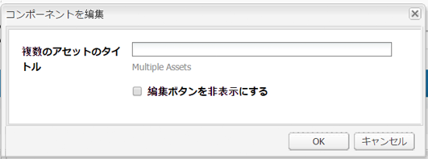

# Create and configure Asset Editor pages {#creating-and-configuring-asset-editor-pages}

このドキュメントは次の内容について説明します。

* カスタマイズされたアセットエディターページを作成する理由。
* アセットエディターページ（メタデータの表示と編集、およびアセットに対するアクションの実行に使用する WCM ページ）の作成とカスタマイズの方法
* 複数のアセットを同時に編集する方法

<!-- TBD: Add UICONTROL tags. Need PM review. Flatten the structure a bit. Re-write to remove Geometrixx mentions and to adhere to 6.5 default samples. -->

>[!NOTE]
>
>アセット共有は、オープンソースの参照実装として使用できます。[Asset Share Commons](https://adobe-marketing-cloud.github.io/asset-share-commons/) を参照してください。アセット共有は正式にはサポートされていません。

## Why create and configure Asset Editor pages? {#why-create-and-configure-asset-editor-pages}

デジタルアセット管理は、ますます広く使用されるようになっています。When moving from a small-scale solution for a small user group of professionally trained users - for example photographers or taxonomists - to larger and more diverse user groups - for example business users, WCM authors, journalists, and so on - the powerful user interface of [!DNL Adobe Experience Manager Assets] for professional users can provide too much information and stakeholders start to request specific user interfaces or applications to access the digital assets that are of relevance to them.

アセット中心のアプリケーションは、社員が展示会の訪問や公共のWebサイトの報道機関から写真をアップロードできる、イントラネット内の単純なフォトギャラリーです。アセット中心のアプリケーションは、買い物かご、チェックアウト、検証プロセスなどの完全なソリューションにも拡張できます。

アセット中心型アプリケーションの作成の大部分は、コーディングを必要としない設定プロセスとなります。ここでは、ユーザーグループとそのニーズ、使用されるメタデータに関する知識のみが必要となります。Asset-centric applications created with [!DNL Assets] are extensible: with moderate coding effort reusable components for searching, viewing, and modifying assets can be created.

An asset-centric application in [!DNL Experience Manager] consists of an Asset Editor page, which can be used to get a detailed view of a specific asset. アセットエディターページでは、アセットにアクセスするユーザーが必要な権限を持っていれば、メタデータの編集も可能です。

<!--
## Create and configure an Asset Share page {#creating-and-configuring-an-asset-share-page}

You customize the DAM Finder functionality and create pages that have all the functionality you require, which are called Asset Share pages. To create a new Asset Share page, you add the page using the Geometrixx Asset Share template and then you customize the actions users can perform on that page, determine how viewers see the assets, and decide how users can build their queries.

Here are some use cases for creating a customized Asset Share page:

* Press Center for Journalists.
* Image Search Engine for internal business users.
* Image Database for website users.
* Media Tagging Interface for metadata editors.

### Create an Asset Share page {#creating-an-asset-share-page}

To create a new Asset Share page, you can either create it when you are working on web sites or from the digital asset manager.

>[!NOTE]
>
>By default, when you create an Asset Share page from **New** in the digital asset manager, an Asset viewer and Asset editor are automatically created for you.

To create an new Asset Share page in the **Websites** console:

1. In the **Websites** tab, navigate to the place where you want to create an asset share page and click **New**.

1. Select the **Asset Share** page and click **Create**. The new page is created and the asset share page is listed in the **Websites** tab.

The basic page created using the Geometrixx DAM Asset Share template looks as follows:

To customize your Asset Share page, you use elements from the sidekick and you also edit query builder properties. The page **Geometrixx Press Center** is a customized version of a page based on this template:

To create a new asset share page via the digital asset manager:

1. In the digital asset manager, in **New**, select **New Asset Share**.
1. In the **Title**, enter the name of the asset share page. If desired, enter a name for the URL.

   

1. Double-click the asset share page to open it and configure the page.

   

   By default, when you create an Asset Share page from **New**, an Asset viewer and Asset editor are automatically created for you.

#### Customize actions {#customizing-actions}

You can determine what actions users can perform on selected digital assets from a selection of predefined actions.

To add actions to the Asset Share page:

1. In the Asset Share page that you want to customize, click **Actions** in the sidekick.

The following actions are available:

 | Action | Description |
 |---|---|
 | [!UICONTROL Delete Action] | Users can delete the selected assets. |
 | [!UICONTROL Download Action] | Lets users download selected assets to their computers. |
 | [!UICONTROL Lightbox Action] | Saves assets to a "lightbox"   where you can perform other actions on them. This comes in handy when working   with assets across multiple pages. The lightbox can also be used as a   shopping cart for assets. |
 | [!UICONTROL Move Action] | Users can move the asset to another   location |
 | [!UICONTROL Tags Action] | Lets users add tags to selected assets |
 | [!UICONTROL View Asset Action] | Opens the asset in the Asset editor for   user manipulation. |

1. Drag the appropriate action to the **Actions** area on the page. Doing so creates a button that is used to execute that action.

#### Determine how search results are presented {#determining-how-search-results-are-presented}

You determine how results are displayed from a predefined list of lenses.

To change how search results are viewed:

1. In the Asset Share page that you want to customize, click Search.

1. Drag the appropriate lens to the top center of the page. In the Press Center, the lenses are already available. Users press the appropriate lens icon to display search results as desired.

The following lenses are available:

| Lens | Description |
|---|---|
| **[!UICONTROL List Lens]** |Presents the assets in a list fashion with details. |
| **[!UICONTROL Mosaic Lens]** |Presents assets in a mosaic fashion. |

#### Mosaic Lens {#mosaic-lens}

#### List Lens {#list-lens}

#### Customize the Query Builder {#customizing-the-query-builder}

The query builder lets you enter search terms and create content for the Asset Share page. When you edit the query builder, you also get to determine how many search results are displayed per page, which asset editor opens when you double-click an asset, the path the query searches, and customizes nodetypes.

To customize the query builder:

1. In the Asset Share page that you want to customize, click **Edit** in the Query Builder. By default, the **General** tab opens.
1. Select the number of results per page, the path of the asset editor (if you have a customized asset editor) and the Actions title.

1. Click the **Paths** tab. Enter a path or multiple paths that the search will run. These paths are overwritten if the user uses the Paths predicate.

1. Enter another node type, if desired.

1. In the **Query Builder URL** field, you can override or wrap the query builder and enter the new servlet URLs with the existing query builder component. In the **Feed URL** field, you can override the Feed URL as well.

1. In the **Text** field, enter the text you want to appear for results and page numbers of results. Click **OK** when finished making changes.

#### Add predicates {#adding-predicates}

Experience Manager Assets includes a number of predicates that you can add to the Asset Share page. These let your users further narrow searches. In some cases, they may override a query builder parameter (for example, the Path parameter).

To add predicates:

1. In the Asset Share page that you want to customize, click **Search**.

1. Drag the appropriate predicates to the Asset Share page underneath the query builder. Doing so creates the appropriate fields.

The following predicates are available:

| Predicate | Description |
|---|---|
| **[!UICONTROL Date Predicate]** |Lets users search for assets that were modified before and after certain dates. |
| **[!UICONTROL Options Predicate]** |The site owner can specify a property to search for (as in the property predicate, for example cq:tags) and a content tree to populate the options from (for example the tag tree). Doing so generates a list of options where the users can select the values (tags) that the selected property (tag property) should have. This predicate lets you build list controls like the list of tags, file types, image orientations, and so on. It is great for a fixed set of options. |
| **[!UICONTROL Path Predicate]** |Lets users define the path and subfolders, if desired. |
| **[!UICONTROL Property Predicate]** |The site owner specifies a property to search for, e.g. tiff:ImageLength and the user can then enter a value, e.g. 800. This returns all images that are 800 pixels high. Useful predicate if your property can have arbitrary values. |

For more information, see the [predicate Javadocs](https://helpx.adobe.com/experience-manager/6-5/sites/developing/using/reference-materials/javadoc/com/day/cq/search/eval/package-summary.html).

1. To configure the predicate further, double-click it. For example, when you open the Path Predicate, you need to assign the root path.

-->

## アセットエディタページの作成と設定 {#creating-and-configuring-an-asset-editor-page}

アセットエディターをカスタマイズして、ユーザーによるデジタルアセットの表示および編集方法を指定します。これをおこなうには、新規のアセットエディターページを作成してから、ユーザーがページに対して実行できる表示とアクションをカスタマイズします。

>[!NOTE]
>
>If you want to add custom fields to the DAM asset editor, add new `cq:Widget` nodes to `/apps/dam/content/asseteditors.`

### Create an Asset Editor page {#creating-the-asset-editor-page}

アセットエディターページを作成する場合に、アセット共有ページのすぐ下にページを作成することをお勧めします。

アセットエディターページを作成するには：

1. 「**[!UICONTROL Web サイト]**」タブで、アセットエディターページを作成する場所に移動し、「**新規**」をクリックします。
1. 「**Geometrixx アセットエディター**」を選択し、「**作成**」をクリックします。新しいページが作成され、ページが「**Web サイト**」タブに表示されます。

Geometrixx アセットエディターテンプレートを使用して作成された基本ページは次のイメージのようになります。

To customize your Asset Editor page, use elements from the sidekick. The Asset Editor page that is accessed from the **Geometrixx Press Center** is a customized version of a page based on this template:

#### アセットエディタを設定して、アセット共有ページから開く {#setting-which-asset-editor-opens-from-an-asset-share-page}

カスタムのアセットエディターページを作成したら、アセット（作成したカスタムのアセット共有）をダブルクリックすると、カスタマイムのエディターページでアセットが開くことを確認する必要があります。

アセットエディターページを設定するには：

1. アセット共有ページで、QueryBuilder の隣にある「**編集**」をクリックします。

1. Click the **General** tab if it is not already selected.

1. In the **Path of Asset Editor** field, enter the path to the asset editor you want the Asset Share page to open assets in and click **OK**.

#### Add Asset Editor components {#adding-asset-editor-components}

アセットエディターに含める機能を指定するには、ページにコンポーネントを追加します。

アセットエディターコンポーネントを追加するには：

1. カスタマイズするアセットエディターページで、サイドキックの「**アセットエディター**」を選択します。使用可能なすべてのアセットエディターコンポーネントが表示されます。

>[!NOTE]
>
>何をカスタマイズできるかは、使用可能なコンポーネントによって異なります。コンポーネントを有効にするには、デザインモードに移動し、有効にする必要のあるコンポーネントを選択します。

1. コンポーネントをサイドキックからアセットエディタにドラッグし、コンポーネントダイアログで変更を行います。 コンポーネントについて、次の表およびその下の詳細説明で説明します。

>[!NOTE]
>
>アセットエディターページのデザイン時に、読み取り専用、編集可能のいずれかのコンポーネントを作成します。ユーザーは、そのコンポーネント内に鉛筆の画像が表示されればフィールドが編集可能であるとわかります。デフォルトでは、ほとんどのコンポーネントは読み取り専用として設定されます。

| コンポーネント | 説明 |
|---|---|
| **[!UICONTROL メタデータフォーム] と [!UICONTROL メタデータテキストフィールド]** | アセットにメタデータを追加し、そのアセットに対して送信などのアクションを実行できるようにします。 |
| **[!UICONTROL サブアセット]** | サブアセットをカスタマイズできるようにします。 |
| **タグ** | ユーザーがタグを選択してアセットに追加できるようにします。 |
| **[!UICONTROL サムネール]** | アセットのサムネールとファイル名を表示し、代替テキストを追加できるようにします。ここでは、アセットエディターのアクションを追加することもできます。 |
| **[!UICONTROL タイトル]** | アセットのタイトルを表示します。このタイトルはカスタマイズ可能です。 |

#### メタデータフォームとテキストフィールド - メタデータの表示コンポーネントの設定 {#metadata-form-and-text-field-configuring-the-view-metadata-component}

メタデータフォームは、開始アクションと終了アクションを含むフォームです。その間には、**テキスト**&#x200B;フィールドを入力します。フォームの操作について詳しくは、[フォーム](/help/sites-authoring/default-components-foundation.md#form-component)を参照してください。

1. Create a start action by clicking **Edit** in the Start area of the form. 必要に応じて、「ボックスタイトル」にボックスタイトルを入力できます。デフォルトでは、ボックスタイトルは「**メタデータ**」です。生成された Java スクリプトクライアントコードを検証する場合は、「クライアントの検証」チェックボックスをオンにします。

1. Create an End action by clicking **Edit** in the End area of the form. 例えば、ユーザーがメタデータの変更内容を送信できる「**送信**」ボタンを作成できます。また、オプションとして、メタデータを元の状態にリセットする「**リセット**」ボタンを追加できます。

1. In between the **Form Start** and the **Form End**, drag Metadata Text Fields to the form. ユーザーはこれらのテキストフィールドにメタデータを入力し、このメタデータを送信するか、他のアクションを実行することができます。

1. Double-click the field name, for example, **Title** to open the metadata field and make changes. **コンポーネントを編集**&#x200B;ウィンドウの「**一般**」タブで、名前空間、フィールドラベル、型（`dc:title` など）を定義します。

See [Customizing and Extending Assets](/help/assets/extending-assets.md) for information on modifying the namespaces available in the metadata form.

1. Click the **Constraints** tab. ここで、フィールドを必須にするかどうかを選択し、必要に応じて制約を追加できます。

1. Click the **Display** tab. ここで、メタデータフィールドの列の新しい幅と列数を入力できます。「**フィールドは読み取り専用です**」チェックボックスをオフにすると、ユーザーがメタデータを編集できるようになります。

次に、様々なフィールドを持つメタデータフォームの例を示します。

アセットエディターページでは、ユーザーはこの後メタデータフィールドに値を入力し（フィールドが編集可能な場合）、終了アクション（変更内容の送信など）を実行することができます。

#### サブアセット {#sub-assets}

サブアセットコンポーネントでは、サブアセットの表示と選択をおこなうことができます。[メインアセット](/help/assets/assets.md#what-are-digital-assets)とサブアセットの下に表示される名前を指定できます。

サブアセットコンポーネントをダブルクリックし、サブアセットダイアログを開きます。このダイアログで、メインアセットや任意のサブアセットのタイトルを変更できます。デフォルト値は、対応するフィールドの下に表示されます。

次に、設定済みのサブアセットコンポーネントの例を示します。

例えば、あるサブアセットを選択すると、コンポーネントに適切なページが表示され、ボックスタイトルがサブアセットから兄弟アセットに変更されます。

#### タグ {#tags}

タグコンポーネントは、ユーザーがアセットに既存のタグを割り当てることのできるコンポーネントです。タグは後で構成や取得に役に立ちます。ユーザーがタグを追加できず、参照のみできるように、このコンポーネントを読み取り専用にできます。

タグコンポーネントをダブルクリックしてタグダイアログを開きます。このダイアログで、必要に応じてタグのタイトルを変更し、割り当て済みの名前空間を選択することができます。To make this field editable, clear the **[!UICONTROL Hide Edit]** check box. デフォルトでは、タグは編集可能です。

ユーザーがタグを編集できる場合は、鉛筆アイコンをクリックし、「Tags」ドロップダウンメニューからタグを選択して、タグを追加できます。

次に、設定済みのタグコンポーネントを示します。

#### サムネール {#thumbnail}

サムネールコンポーネントでは、選択したサムネールがアセットで表示されます（多くの形式でサムネールは自動的に抽出されます）。さらに、コンポーネントではファイル名と、[変更可能なアクション](/help/assets/assets-finder-editor.md#adding-asset-editor-actions)が表示されます。

サムネールコンポーネントをダブルクリックすると、サムネールダイアログが開きます。このダイアログで、代替テキストを変更できます。デフォルトでは、サムネールの代替テキストは、「**Click to download asset**」です。

次に、設定済みのサムネールコンポーネントの例を示します。

#### タイトル {#title}

タイトルコンポーネントでは、アセットのタイトルと説明が表示されます。

デフォルトでは、タイトルは読み取り専用であり、ユーザーは編集できません。編集可能にするには、コンポーネントをダブルクリックし、「**編集ボタンを非表示にする**」チェックボックスをオフにします。さらに、複数のアセットのタイトルを入力します。

タイトルが編集可能な場合、鉛筆アイコンをクリックして&#x200B;**アセットのプロパティ**&#x200B;ウィンドウを開いて、タイトルと説明を追加できます。さらに、日時を選択してアセットのオンとオフを切り替えることができます。

Titleを編集する場合、ユーザーは「 [!UICONTROL Title]**」、「Description**」 **、「On」、「On」、「********** Off Times」の順に入力して、アセットをonおよびoffにすることができます。

次に、設定済みのタイトルコンポーネントの例を示します。

#### ア追加セットエディタのアクション {#adding-asset-editor-actions}

定義済みの一部のアクションから、選択したデジタルアセットに対してユーザーが実行できるアクションを決定できます。

アセットエディターページにアクションを追加するには：

1. In the Asset Editor page that you want to customize, click **Asset Editor** in the sidekick.

次のアクションが使用可能です。

| アクション | 説明 |
|---|---|
| [!UICONTROL ダウンロード] | ユーザーが選択したアセットをコンピューターにダウンロードできるようにします。 |
| [!UICONTROL エディター] | ユーザーが画像を編集できるようにします（インタラクティブ編集）。 |
| [!UICONTROL Lightbox] | アセットを「Lightbox」に保存します。Lightbox では、保存されたアセットに対して他のアクションを実行できます。これは、複数のページにまたがるアセットを操作する場合に便利です。 |
| [!UICONTROL ロック] | ユーザーがアセットをロックできるようにします。この機能はデフォルトでは有効ではなく、コンポーネントのリスト内で有効にする必要があります。 |
| [!UICONTROL 参照] | クリックすると、アセットで現在使用されているページが表示されます。 |
| [!UICONTROL バージョン管理] | アセットのバージョンの作成と復元が可能です。 |

1. Drag the appropriate action to the **Actions** area on the page. これによって、そのアクションを実行するボタンが作成されます。

## Multi-edit assets with the Asset Editor page {#multi-editing-assets-with-the-asset-editor-page}

With [!DNL Experience Manager Assets] you can make changes to several assets at once. アセットを選択した後、それらのアセットの次の情報を同時に変更できます。

* タグ
* メタデータ

アセットエディターページを使用してアセットをマルチ編集するには：

1. Geometrixx **Press Center** ページを開きます。
   `https://localhost:4502/content/geometrixx/en/company/press.html`

1. アセットを選択します。

   * Windowsの場合： `Ctrl + click` 各アセット。
   * Macの場合： `Cmd + click` 各アセット。

   To select a range of assets: click the first asset then `Shift + click` the last asset.

1. 「**Actions**」フィールド（ページの左側）の「**Edit Metadata**」をクリックします。
1. Geometrixx **Press Center Asset Editor** ページが新しいタブで開きます。アセットのメタデータが以下のように表示されます。

   * すべてのアセットではなく一部のアセットにのみ適用されるタグは、斜体で表示されます。
   * すべてのアセットに適用されるタグは、通常のフォントで表示されます。
   * タグ以外のメタデータ：フィールドの値は、選択されたすべてのアセットで同じ場合にのみ表示されます。

1. Click **Download** to download a ZIP file containing the assets original renditions.
1. 「 **タグ** 」フィールドの横にある「タグ」オプションをクリックします。

   * すべてのアセットではなく一部のアセットにのみ適用されるタグは、グレーの背景になります。
   * すべてのアセットに適用されるタグは白の背景になります。

   以下の操作を実行できます。

   * Click `x` to remove the tag for all the assets.
   * Click `+` to add the tag to all the assets.
   * **矢印**&#x200B;をクリックしてタグを選択し、すべてのアセットに新しいタグを追加します。

   「**OK**」をクリックして、変更内容をフォームに書き込みます。「**Tags**」フィールドの横にあるチェックボックスが自動的にオンになります。

1. 「説明」フィールドを編集します。例えば、次の値に設定します。

   `This is a common description`

   フィールドを編集すると、フォームの送信時に、選択したアセットの既存の値が編集した値によって上書きされます。

   注意：フィールドを編集すると、フィールドの横にあるチェックボックスが自動的にオンになります。

1. 「**Update Metadata**」をクリックしてフォームを送信し、すべてのアセットの変更内容を保存します。

   注意：チェック済みのメタデータのみが変更されます。
