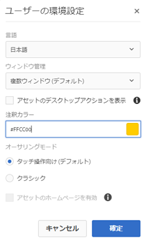
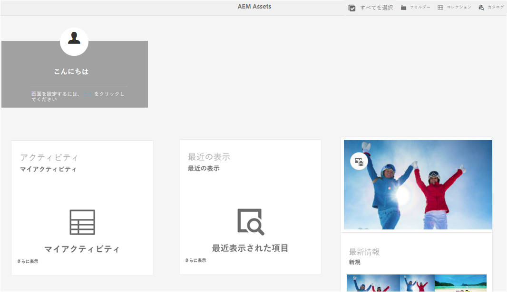

# Adobe Experience Managerアセットのホームページエクスペリエンス {#aem-assets-home-page-experience}

Adobe Experience Managerアセットホームページをパーソナライズして、豊富なスタートアップスクリーンエクスペリエンスを実現します。アセットに関する最近のアクティビティのスナップショットも含まれます。

アセットホームページは、最近表示またはアップロードされたアセットなど、最近のアクティビティのスナップショットを含む、パーソナライズされた豊富なスタートアップスクリーンエクスペリエンスを提供します。

アセットホームページは、デフォルトで無効になっています。 ホームページを有効にするには、次の手順を実行します。

1. Experience Manager構成マネージャーを開き `https://[aem_server]:[port]/system/console/configMgr`ます。
1. Open the **[!UICONTROL Day CQ DAM Event Recorder]** service.
1. Select the **[!UICONTROL Enable this service]** to enable activity recording.

   

1. From the **[!UICONTROL Event Types]** list, select the events to be recorded and save the changes.

   >[!CAUTION]
   >
   >「Asset viewed」、「Projects viewed」、「Collections viewed」の各オプションを有効にすると、記録対象のイベント数が大幅に増加します。

1. Open the **[!UICONTROL DAM Asset Home Page Feature Flag]** service from Configuration Manager `https://[aem_server]:[port]/system/console/configMgr`.
1. Select the `isEnabled.name` option to enable the Assets Home page feature. 変更内容を保存します。

   

1. **[!UICONTROL ユーザ環境設定ダイアログを開き]** 、「アセットホームページを **[!UICONTROL 有効にする」を選択し]**&#x200B;ます。 変更内容を保存します。

   

After enabling the Assets Home page, navigate to the Assets user interface either from the Navigation page or access it directly from the URL `https://[aem_server]:[port]/aem/assetshome.html/content/dam`.

Click the **[!UICONTROL Click here to configure your experience link]** to add your username, background image, and profile image.

Assets のホームページには次のセクションが含まれます。

* 「ようこそ」セクション
* 「ウィジェット」セクション

**「ようこそ」セクション**

ユーザーのプロファイルが存在する場合、「ようこそ」セクションには、そのユーザー向けのようこそメッセージが表示されます。さらに、プロファイルの画像と、（既に設定されている場合は）ようこその画像が表示されます。

ユーザーのプロファイル設定が完了していない場合、「ようこそ」セクションには、一般的なようこそメッセージとプロファイル写真用のプレースホルダーが表示されます。

**「ウィジェット」セクション**

このセクションは「ようこそ」セクションの下にあり、既製ウィジェットが次のセクションに表示されます。

* アクティビティ
* 最近の表示
* 最新情報

**アクティビティ**: このセクションの下では、 **[!UICONTROL マイアクティビティ]** Widgetには、アセットのアップロード、ダウンロード、アセットの作成、編集、コメント、注釈、共有など、アセット（レンディションのないアセットを含む）と共にログインしたユーザーが実行した最新のアクティビティが表示されます。

**最新**: このセクションの **[!UICONTROL 最近表示した]** Widgetには、フォルダー、コレクション、プロジェクトなど、ログインユーザーが最近アクセスしたエンティティが表示されます。

**Discover**: このセクションの **[!UICONTROL 新しいウィジェットには]** 、アセットデプロイメントに最近アップロードされたアセットとレンディションが表示されます。

To enable purging of user activity data, enable the **[!UICONTROL DAM Event Purge Service]** from Configuration Manager. このサービスを有効にすると、ログインユーザーのアクティビティのうち指定した数を超えたものがシステムによって削除されます。

ようこそ画面には、フォルダー、コレクション、カタログにアクセスするためのツールバー上のアイコンなど、簡単に操作するための機能が含まれています。

>[!NOTE]
>
>[!UICONTROL Day CQ DAMイベントレコーダー] および  DAMイベント削除サービスを有効にすると、JCRおよび検索インデックスへの書き込み操作が増え、Experience Managerサーバーの負荷が大幅に増加します。 Experience Managerサーバーに追加の負荷がかかると、そのパフォーマンスに影響を与える可能性があります。

>[!CAUTION]
>
>アセットホームページに必要なユーザーアクティビティのキャプチャ、フィルタリングおよび削除は、パフォーマンスにオーバーヘッドを与えます。 そのため、管理者はターゲットユーザーのためにホームページを効果的に設定する必要があります。
>
>一括操作を実行する管理者およびユーザーは、ユーザーアクティビティが増えるのを避けるため、Asset のホームページ機能を使用しないことをお勧めします。In addition, administrators can exclude recording activities for specific users by configuring [!UICONTROL Day CQ DAM Event Recorder] from [!UICONTROL Configuration Manager].
>
>この機能を使用する場合は、サーバー負荷を考慮してパージの頻度を計画することをお勧めします。
