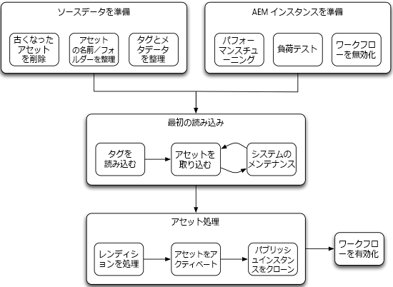

# アセットを一括で移行する方法{#assets-migration-guide}

アセットを[!DNL Adobe Experience Manager]に移行する際には、考慮する必要のある手順がいくつかあります。 実装間で大きく異なるので、現在のホームからアセットとメタデータを抽出する方法は、このドキュメントの範囲外です。このドキュメントでは、これらのアセットを[!DNL Experience Manager]に取り込み、メタデータを適用し、レンディションを生成して、インスタンスをアクティブ化する方法について説明します。

## 前提条件 {#prerequisites}

この方法論の手順を実際に実行する前に、[アセットのパフォーマンス調整のヒント](performance-tuning-guidelines.md)のガイダンスを確認し、実装してください。 ここで紹介する手順の多くは、同時に実行可能なジョブの最大数の設定など、負荷時のサーバーの安定性とパフォーマンスを大幅に改善します。システムにアセットが読み込まれた後だと、その他の手順（ファイルデータストアの設定など）を実行するのがより困難になります。

>[!NOTE]
>
>次のアセット移行ツールは[!DNL Experience Manager]に含まれておらず、Adobeではサポートされていません。
>
>* ACS AEM ツールの Tag Maker
>* ACS AEM ツールの CSV Asset Importer
>* ACS Commons の Bulk Workflow Manager
>* ACS Commons の Fast Action Manager
>* 合成ワークフロー

>
>
このソフトウェアはオープンソースで、[Apache v2 License](https://adobe-consulting-services.github.io/pages/license.html) が適用されます。質問や問題を報告するには、それぞれ [ACS AEM ツール](https://github.com/Adobe-Consulting-Services/acs-aem-commons/issues)と [ACS AEM Commons に関する GitHub の問題](https://github.com/Adobe-Consulting-Services/acs-aem-tools/issues)を利用してください。

## [!DNL Experience Manager] {#migrating-to-aem}に移行

[!DNL Experience Manager]へのアセットの移行にはいくつかの手順が必要で、段階的なプロセスとして表示する必要があります。 移行のフェーズは次のとおりです。

1. ワークフローを無効化する。
1. タグを読み込む。
1. アセットを取り込む。
1. レンディションを処理する。
1. アセットをアクティベートする。
1. ワークフローを有効化する。

### ワークフローを無効にする{#disabling-workflows}

移行を開始する前に、[!UICONTROL DAM Update Asset]ワークフローのランチャーを無効にしてください。 すべてのアセットを取り込んでからワークフローをバッチで実行する方法が最適です。移行が実行されるときに既にライブである場合は、これらのアクティビティを営業時間外に実行するようにスケジュールを設定できます。

### タグの読み込み{#loading-tags}

画像に適用するタグ分類は既に用意されていることがあります。CSVアセットインポーターや[!DNL Experience Manager]のメタデータプロファイルのサポートなどのツールはアセットにタグを適用するプロセスを自動化できますが、タグをシステムに読み込む必要があります。 [ACS AEM ツールの Tag Maker](https://adobe-consulting-services.github.io/acs-aem-tools/features/tag-maker/index.html) 機能を使用すると、システムに読み込まれた Microsoft Excel のスプレッドシートを使用してタグを入力できます。

### アセットの取り込み{#ingesting-assets}

アセットをシステムに取り込む際に重要なのは、パフォーマンスと安定性です。システムに大量のデータを読み込むので、特に既に実稼動環境にあるシステムでは、システムがパフォーマンスを可能な限り発揮できるようにする一方で、処理に必要な時間を短縮し、システムのオーバーロードによりシステムがクラッシュしないように注意する必要があります。

システムにアセットを読み込むには、HTTP を使用したプッシュベースのアプローチと JCR の API を使用したプルベースのアプローチがあります。

#### HTTP経由で送信{#pushing-through-http}

アドビの Managed Services チームは Glutton というツールを使用してお客様の環境にデータを読み込みます。Gluttonは、[!DNL Experience Manager]デプロイメント上の1つのディレクトリのすべてのアセットを別のディレクトリに読み込む、小さなJavaアプリケーションです。 Glutton の代わりに、Perl スクリプトなどのツールを使用してアセットをリポジトリに投稿することもできます。

HTTPS を通じたプッシュのアプローチには、主に次の 2 つの欠点があります。

1. アセットは HTTP を介してサーバーに送信する必要がある。これには大量のオーバーヘッドが発生し、時間もかかるので、移行に要する時間が長くなります。
1. アセットに適用する必要があるタグやカスタムメタデータがある場合、このアプローチでは、アセットを取り込んだ後にこのメタデータを適用するという、2 段階のカスタムプロセスを実行する必要がある。

アセットを取り込むもう一方のアプローチでは、ローカルファイルシステムからアセットを引っ張ってきます。ただし、プルベースのアプローチを実行する外部ドライブやネットワーク共有がサーバーにマウントされていない場合は、HTTP を通じたアセットの投稿が最適なオプションです。

#### ローカルファイルシステムからフェッチ{#pulling-from-the-local-filesystem}

[ACS AEM ツールの CSV Asset Importer](https://adobe-consulting-services.github.io/acs-aem-tools/features/csv-asset-importer/index.html) は、アセットをファイルシステムから、アセットメタデータをアセット読み込みの CSV ファイルから、それぞれ取り込みます。Experience ManagerAsset Manager APIは、アセットをシステムに読み込み、設定済みのメタデータプロパティを適用するために使用します。 アセットはネットワークファイルマウントまたは外部ドライブを介してサーバーにマウントされているのが理想です。

アセットをネットワーク上で送信する必要がないので、全体的なパフォーマンスが劇的に向上します。このため、一般的にはこの方法がアセットをリポジトリに読み込む最も効率的な方法と見なされています。さらに、ツールがメタデータの取り込みをサポートし、すべてのアセットとメタデータを 1 つの手順で取り込むことができるので、別のツールを使用してメタデータを適用する 2 つ目の手順が不要になります。

### レンディションの処理{#processing-renditions}

アセットをシステムに読み込んだ後、[!UICONTROL DAM Update Asset]ワークフローを使用してアセットを処理し、メタデータを抽出してレンディションを生成する必要があります。 この手順を実行する前に、重複を実行し、必要に応じて[!UICONTROL DAM Update Asset]ワークフローを変更する必要があります。 標準搭載のワークフローには、Scene7PTIFFの生成や[!DNL InDesign Server]統合など、ユーザーにとって必要でない多くの手順が含まれています。

ニーズに合わせてワークフローを設定したら、次の 2 つの方法のいずれかで実行できます。

1. 最も簡単なアプローチは、[ACS Commons の Bulk Workflow Manager](https://adobe-consulting-services.github.io/acs-aem-commons/features/bulk-workflow-manager.html) です。このツールを使用すると、クエリを実行し、クエリの結果をワークフローを通じて処理します。バッチサイズを設定するオプションも用意されています。
1. [ACS Commons の Fast Action Manager](https://adobe-consulting-services.github.io/acs-aem-commons/features/fast-action-manager.html) は[合成ワークフロー](https://adobe-consulting-services.github.io/acs-aem-commons/features/synthetic-workflow.html)と組み合わせて使用できます。このアプローチは非常に複雑ですが、[!DNL Experience Manager]ワークフローエンジンのオーバーヘッドを取り除きながら、サーバリソースの使用を最適化できます。 さらに、Fast Action Manager はサーバーリソースを動的に監視し、システムに配置された読み込みをスロットリングすることでパフォーマンスを大幅に向上します。サンプルスクリプトは ACS Commons の機能ページに記載されています。

### アセットのアクティベート{#activating-assets}

パブリッシュ層のあるデプロイメントでは、アセットをパブリッシュファームにアクティベートする必要があります。アドビは 1 つ以上のパブリッシュインスタンスを実行することを推奨していますが、すべてのアセットを 1 つのパブリッシュインスタンスにレプリケートして、そのインスタンスをクローンする方法が最も効率的です。多数のアセットをアクティベートするときは、ツリーのアクティベートを実行した後に、干渉する必要が生じる場合があります。理由は次のとおりです。アクティベーションの実行時に、アイテムがSlingジョブ/イベントキューに追加されます。 このキューのサイズがだいたい 40,000 項目を超えると、処理速度が劇的に低下します。このキューのサイズが 100,000 項目を超えると、システムの安定性に影響を及ぼします。

この問題を回避するには、[Fast Action Manager](https://adobe-consulting-services.github.io/acs-aem-commons/features/fast-action-manager.html) を使用してアセットのレプリケートを管理します。これは Sling キューを使用することなく動作し、オーバーヘッドを減らすほか、ワークロードをスロットルしてサーバーのオーバーロードを防ぎます。レプリケーションの管理に FAM を使用する例は、この機能のドキュメントページに記載しています。

アセットをパブリッシュファームに移行するその他のオプションは、[vlt-rcp](https://jackrabbit.apache.org/filevault/rcp.html) または [oak-run](https://github.com/apache/jackrabbit-oak/tree/trunk/oak-run) を使用する方法です。これらは Jackrabbit の一部のツールとして提供されます。もう1つの方法は、[Grabbit](https://github.com/TWCable/grabbit)と呼ばれる[!DNL Experience Manager]インフラストラクチャにオープンソースのツールを使うことです。これはvltよりも高いパフォーマンスを発揮すると主張しています。

これらのアプローチで注意すべき点は、オーサーインスタンス上でアセットがアクティベートされていると表示されないことです。アセットのアクティベート状態を正しくフラグ設定するには、アセットをアクティベート済みとマークする別のスクリプトも実行する必要があります。

>[!NOTE]
>
>アドビは Grabbit を管理およびサポートしません。

### 公開のコピー{#cloning-publish}

アセットがアクティベートされたら、パブリッシュインスタンスをクローンしてデプロイメントに必要なコピーを必要な分だけ作成できます。サーバーのクローンは比較的簡単ですが、いくつか重要な手順があります。パブリッシュをクローンするには：

1. ソースインスタンスとデータストアをバックアップします。
1. インスタンスとデータストアのバックアップを対象の場所に復元します。続く手順はすべてこの新しいインスタンスを参照します。
1. `crx-quickstart/launchpad/felix` でファイルシステムの検索を実行し、`sling.id` を探します。このファイルを削除します。
1. データストアのルートパスで、`repository-XXX` ファイルを探してすべて削除します。
1. `crx-quickstart/install/org.apache.jackrabbit.oak.plugins.blob.datastore.FileDataStore.config` と `crx-quickstart/launchpad/config/org/apache/jackrabbit/oak/plugins/blob/datastore/FileDataStore.config` を編集し、新しい環境のデータストアの場所を指すようにします。
1. 環境を開始します。
1. オーサー環境にあるすべてのレプリケーションエージェントが正しいパブリッシュインスタンスを指す、または新しいインスタンスの Dispatcher のフラッシュエージェントが新しい環境の正しい Dispatcher を参照するように設定を更新します。

### ワークフローを有効にする{#enabling-workflows}

移行が完了したら、[!UICONTROL DAM Update Asset]ワークフローのランチャーを再度有効にして、日々のシステム使用に合わせてレンディションの生成とメタデータの抽出をサポートする必要があります。

## [!DNL Experience Manager]導入間の移行{#migrating-between-aem-instances}

ほとんど一般的ではありませんが、場合によっては、[!DNL Experience Manager]の展開から別の&lt;a0/>の展開に大量のデータを移行する必要があります。例えば、[!DNL Experience Manager]アップグレードを実行する場合は、ハードウェアをアップグレードするか、AMS移行を使用する場合など、新しいデータセンターに移行します。

このケースでは、移行するアセットには既にメタデータが入力されており、レンディションは既に生成されています。インスタンス間の移動に集中することができます。[!DNL Experience Manager]デプロイメント間で移行する場合は、次の手順を実行します。

1. ワークフローを無効にする：レンディションをアセットと共に移行するので、[!UICONTROL DAM Update Asset]ワークフローのワークフローランチャーを無効にする必要があります。

1. タグの移行：ソース[!DNL Experience Manager]デプロイメントに既にタグが読み込まれているので、コンテンツパッケージを作成し、ターゲットインスタンスにパッケージをインストールできます。

1. アセットの移行：1つの[!DNL Experience Manager]デプロイメントから別の&lt;a0/>デプロイメントにアセットを移動する場合に推奨されるツールは2つあります。

   * **Vault Remote** Copyまたはvlt rcpを使用すると、ネットワークを介してvltを使用できます。移動元と移動先のディレクトリを指定すると、vit がすべてのリポジトリデータを一方のインスタンスからダウンロードし、もう一方に読み込みます。vt rcp については、[https://jackrabbit.apache.org/filevault/rcp.html](https://jackrabbit.apache.org/filevault/rcp.html) に記載されています。
   * **Grabbit**[!DNL Experience Manager]。Time Warner Cable が の実装のために開発した、オープンソースのコンテンツ同期ツールです。継続的なデータストリームを使用するので、vlt rcp と比較して待ち時間が少なく、vlt rcp の 2 倍から 10 倍高速であると言われています。また、Grabbit はデルタコンテンツのみの同期をサポートし、最初の移行パスが完了した後に加えられた変更を同期できます。

1. アセットのアクティブ化：[[!DNL Experience Manager]への初期移行に関してドキュメント化されている&lt;a0/>アセット](#activating-assets)のアクティベートの手順に従います。

1. 公開のコピー：新しい移行と同様に、1つの発行インスタンスを読み込んでコピーする方が、両方のノードでコンテンツをアクティブ化するよりも効率的です。 [パブリッシュインスタンスのクローン](#cloning-publish)を参照してください。

1. ワークフローを有効にする：移行が完了したら、[!UICONTROL DAM Update Asset]ワークフローのランチャーを再度有効にして、毎日のシステム使用に合わせてレンディションの生成とメタデータの抽出をサポートします。
