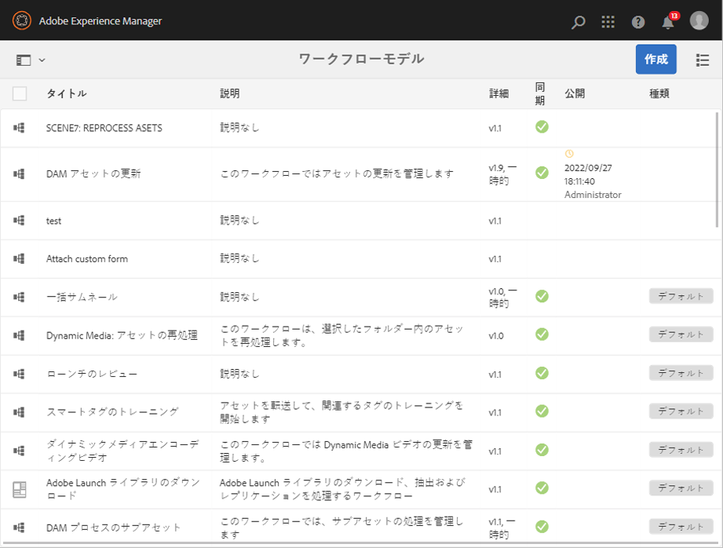
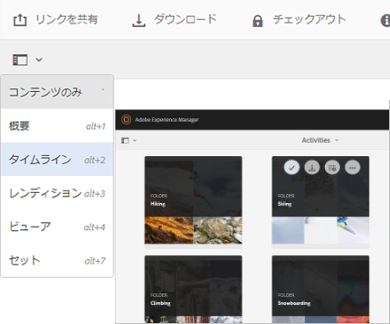
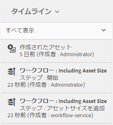
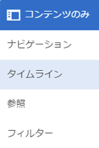

# デジタルアセットの処理 {#process-assets}

[!DNL Adobe Experience Manager Assets] を使用すると、デジタルアセットを様々な方法で操作し、堅牢なアセット処理を実現できます。 利用可能な処理方法を使用したり、方法を拡張して、デジタルアセットの使用、監査とコンプライアンス、検出と配布、基本的な健全性など、エンドツーエンドのビジネスプロセスを確実に完了させることができます。 これらの操作は、必要なスケールとカスタマイズを達成しながら実行できます。

## 理解ワークフロー {#understand-workflows}

アセットの処理には、ワークフローを使 [!DNL Experience Manager] 用します。 ワークフローは、ビジネスロジックやアクティビティの自動化に役立ちます。 特定の手順を実行するための詳細なタスクがデフォルトで提供され、開発者は独自のカスタム手順を作成できます。 これらの手順を論理的な順序で組み合わせて、ワークフローを作成 例えば、画像に埋め込まれたメタデータ、アップロード先のフォルダ、画像の解像度など、特定の条件に基づいて、アップロードされた画像に自動的に透かしを適用できます。 もう1つの例として、イメージにこのような透かしを付け、複数のアセット管理ニーズ（メタデータの追加、レンディションの作成、アセット検出用のインテリジェントタグの追加、データストアへの公開、ユーザアクセス権限の設定など）に同時に対処するように設定されたワークフローがあります。

## Experience Managerで使用できるデフォルトのワークフロー {#default-workflows}

デフォルトでは、アップロードされたすべてのアセットは [!UICONTROL DAM Update Assetワークフローを使用して処理されます] 。 ワークフローは、アップロードされた各アセットに対して実行され、レンディションの生成、メタデータの書き戻し、ページの抽出、メディアの抽出、トランスコードなどの基本的なアセット管理タスクを実行します。

デフォルトで使用可能な様々なワークフローモデルを確認するに [!UICONTROL は、のツール/ワークフロー] /モデルを参照しま [!DNL Experience Manager]す。

*図：のデフォルトのワークフローの一部[!DNL Experience Manager]*

## Apply workflows to process assets {#applying-workflows-to-assets}

ワークフローをデジタルアセットに適用する方法は、Web サイトページに適用する場合と同様です。For a complete guide on how to create and use workflows, see [start workflows](/help/sites-authoring/workflows-participating.md).

デジタルアセットでワークフローを使用して、アセットのアクティベートや透かしの作成などをおこないます。アセットのワークフローの多くは自動的にオンになります。例えば、画像の編集後にレンディションを自動的に作成するワークフローは、自動的にオンになります。

>[!NOTE]
>
>If a workflow available in Classic UI is not available in Touch enabled UI, like [!UICONTROL Request to Activate] and [!UICONTROL Request to Deactivate], see [make workflow models](/help/sites-developing/workflows-models.md#classic2touchui).

##  のアセットへのワークフローの適用 {#apply-a-workflow-to-an-asset}

ワークフローをアセットに適用するには、次の手順に従います。

1. ワークフローを開始するアセットの場所に移動し、アセットをクリックしてアセットページを開きます。 メニュー **[!UICONTROL から]** 「タイムライン」を選択して、タイムラインを表示します。

   

1. Click **[!UICONTROL Actions]** at the bottom to open the list of actions available for the asset.

   

1. Click **[!UICONTROL Start Workflow]** from the list.

   

1. **[!UICONTROL ワークフローを開始]**&#x200B;ダイアログで、リストからワークフローモデルを選択します。

   

1. （オプション）ワークフローのインスタンスを参照するために使用できるワークフローのタイトルを指定します。

   

1. Click **[!UICONTROL Start]** and then click **[!UICONTROL Proceed]**. ワークフローの各ステップは、タイムラインにイベントとして表示されます。

   

## 複数のアセットへのワークフローの適用 {#applying-a-workflow-to-multiple-assets}

1. アセットコンソールから、ワークフローを開始するアセットの場所へ移動して、アセットを選択します。メニュー **[!UICONTROL から]** 「タイムライン」を選択して、タイムラインを表示します。

   

1. 下部の「ア **[!UICONTROL クション]** 」をクリックします。

   

1. 「**[!UICONTROL ワークフローを開始]**」をクリックします。**[!UICONTROL ワークフローを開始]**&#x200B;ダイアログで、リストからワークフローモデルを選択します。

   

1. （オプション）ワークフローインスタンスを参照するために使用するワークフローのタイトルを指定します。
1. ダイアログで「**[!UICONTROL 開始]**」をクリックし、次に「**[!UICONTROL 確認]**」をクリックします。選択したすべてのアセットでワークフローが実行されます。

## 複数のフォルダーへのワークフローの適用 {#applying-a-workflow-to-multiple-folders}

ワークフローを複数のフォルダーに適用する手順は、複数のアセットに適用する手順と似ています。Select the folders in the Assets console, and perform steps 2-7 of the procedure [apply a workflow to multiple assets](/help/assets/assets-workflow.md#applying-a-workflow-to-multiple-assets).

## Apply a workflow to a collection {#applying-a-workflow-to-a-collection}

詳しくは、コ [レクションへのワークフローの適用を参照してくださ](/help/assets/managing-collections-touch-ui.md#running-a-workflow-on-a-collection)い。

## ワークフローの自動開始による、アセットの条件付き処理 {#auto-execute-workflow-on-some-assets}

管理者は、事前定義された条件に基づいてアセットを自動的に実行し、処理するワークフローを設定できます。 この機能は、特定のフォルダーに対してカスタムワークフローを作成するなど、基幹業務ユーザーやマーケターに役立ちます。 エージェンシーの写真からのすべてのアセットを透かし入れしたり、フリーランサーがアップロードしたすべてのアセットを処理して特定のレンディションを作成したりできるとします。

ワークフローモデルの場合、ユーザーは、ワークフローを起動するワークフローランチャーを作成できます。 管理者は、マーケターへのアクセスを提供して、ワークフローを作成し、ランチャーを設定できます。 ユーザーは、デフォルトの [!UICONTROL DAM Update Assetワークフローを変更し] 、特定のアセットの処理に必要な追加の手順を追加できます。 ワークフローは新しくアップロードされたすべてのアセットに対して実行されるので、次のいずれかの方法を使用して、特定のアセットに対する追加の手順の実行を制限します。

* 「 [!UICONTROL DAM Update Asset] 」ワークフローのコピーを作成し、特定のフォルダー階層で実行するように変更します。 この方法は、いくつかのフォルダで役立ちます。
* 追加の処理手順は、必要な数のフォルダーに条件に応じて [OR分割を使用し](/help/sites-developing/workflows-step-ref.md#or-split) 、追加することができます。

>[!MORELIKETHIS]
>
>* [申し込みとワークフロー](/help/sites-authoring/workflows.md)
>* [ワークフローモデルの作成とワークフロー機能の拡張](/help/sites-developing/workflows.md)
>* [ワークフローのベストプラクティス](/help/sites-developing/workflows-best-practices.md)
>* [ワークフローを使用したアセットの変更に関するコミュニティ記事](https://helpx.adobe.com/experience-manager/using/modify_asset_workflow.html)

