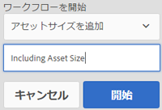

# デジタルアセットの処理 {#process-assets}

[!DNL Adobe Experience Manager Assets] 様々な方法でデジタルアセットを操作でき、堅牢なアセット処理が可能です。 デフォルトまたはカスタマイズされた処理方法を使用して、エンドツーエンドのビジネスプロセスの完了、監査とコンプライアンス、発見と配信、デジタルアセットの基本的な健全性を確保できます。 アセット管理のタスクを実行しながら、必要な拡大・縮小とカスタマイズを実現できます。

## ワークフローの理解 {#understand-workflows}

アセット処理の場合、はワークフローを [!DNL Experience Manager] 使用します。 ワークフローは、ビジネスロジックやアクティビティの自動化に役立ちます。 特定のタスクを達成するための詳細な手順はデフォルトで提供され、開発者は独自のカスタム手順を作成できます。 これらの手順を組み合わせて論理的な順序でワークフローを作成できます。 例えば、ワークフローは、アップロード先のフォルダー、画像の解像度など、特定の条件に基づいて、アップロードされた画像に透かしを適用できます。 もう1つの例として、透かしを設定し、メタデータの追加、レンディションの作成、インテリジェントタグの追加、データストアへの公開を同時に行うワークフローが挙げられます。

## デフォルトのワークフローは [!DNL Experience Manager] {#default-workflows}

デフォルトでは、アップロードされたすべてのアセットは、 [!UICONTROL DAM Update Asset] ワークフローを使用して処理されます。 ワークフローは、アップロードされた各アセットに対して実行され、レンディションの生成、メタデータの書き戻し、ページの抽出、メディアの抽出、トランスコードなど、基本的なアセット管理タスクを実行します。

デフォルトで使用可能な様々なワークフローモデルを確認するには、の **[!UICONTROL ツール/ワークフロー/モデル]** を参照してくだ [!DNL Experience Manager]さい。

*図： で使用できるデフォルトのワークフローの一部[!DNL Experience Manager]です。*

## Apply workflows to process assets {#applying-workflows-to-assets}

ワークフローをデジタルアセットに適用する方法は、Web サイトページに適用する場合と同様です。For a complete guide on how to create and use workflows, see [start workflows](/help/sites-authoring/workflows-participating.md).

デジタルアセットでワークフローを使用して、アセットのアクティベートや透かしの作成などをおこないます。アセットのワークフローの多くは自動的にオンになります。例えば、画像の編集後にレンディションを自動的に作成するワークフローは、自動的にオンになります。

>[!NOTE]
>
>If a workflow available in Classic UI is not available in Touch-enabled UI such as [!UICONTROL Request to Activate] and [!UICONTROL Request to Deactivate], see [make workflow models](/help/sites-developing/workflows-models.md#classic2touchui).

##  のアセットへのワークフローの適用 {#apply-a-workflow-to-an-asset}

<!-- 
TBD: Add animated GIF for these steps instead of all these screenshots.
-->
ワークフローをアセットに適用するには、次の手順に従います。

1. ワークフローを開始するアセットの場所に移動し、アセットをクリックしてアセットページを開きます。 メニューから「 **[!UICONTROL タイムライン]** 」を選択して、タイムラインを表示します。

   

1. Click **[!UICONTROL Actions]** at the bottom to open the list of actions available for the asset.

1. Click **[!UICONTROL Start Workflow]** from the list.

1. **[!UICONTROL ワークフローを開始]**&#x200B;ダイアログで、リストからワークフローモデルを選択します。

1. （オプション）ワークフローのインスタンスを参照するために使用できるワークフローのタイトルを指定します。

   

1. Click **[!UICONTROL Start]** and then click **[!UICONTROL Proceed]**. ワークフローの各ステップは、タイムラインにイベントとして表示されます。

   

## 複数のアセットへのワークフローの適用 {#applying-a-workflow-to-multiple-assets}

1. From the [!DNL Assets] console, navigate to the location of the assets for which you want to start a workflow, and select the assets. メニューから「 **[!UICONTROL タイムライン]** 」を選択して、タイムラインを表示します。

   

1. 下部にある **[!UICONTROL []** アクション ![]  山形]をクリックします。
1. 「**[!UICONTROL ワークフローを開始]**」をクリックします。**[!UICONTROL ワークフローを開始]**&#x200B;ダイアログで、リストからワークフローモデルを選択します。

   

1. （オプション）ワークフローインスタンスを参照するために使用するワークフローのタイトルを指定します。
1. ダイアログで「**[!UICONTROL 開始]**」をクリックし、次に「**[!UICONTROL 確認]**」をクリックします。選択したすべてのアセットでワークフローが実行されます。

## 複数のフォルダーへのワークフローの適用 {#applying-a-workflow-to-multiple-folders}

ワークフローを複数のフォルダーに適用する手順は、複数のアセットに適用する手順と似ています。Select the folders in the [!DNL Assets] interface, and perform steps 2-7 of the procedure [apply a workflow to multiple assets](/help/assets/assets-workflow.md#applying-a-workflow-to-multiple-assets).

## コレクションへのワークフローの適用 {#applying-a-workflow-to-a-collection}

コレクションへのワークフローの [適用を参照してください](/help/assets/managing-collections-touch-ui.md#running-a-workflow-on-a-collection)。

## ワークフローの自動開始によるアセットの条件付き処理 {#auto-execute-workflow-on-some-assets}

管理者は、定義済みの条件に基づいてアセットを自動的に実行および処理するようにワークフローを設定できます。 この機能は、特定のフォルダーにカスタムワークフローを作成する場合など、基幹業務ユーザーやマーケターに役立ちます。 エージェンシーの写真からのすべてのアセットに透かしを付けたり、フリーランスがアップロードしたすべてのアセットを処理して特定のレンディションを作成したりできます。

ワークフローモデルの場合、ユーザーはワークフローを実行するワークフローランチャーを作成できます。 ワークフローランチャーは、コンテンツリポジトリ内の変更を監視し、定義済みの条件が満たされた場合にワークフローを実行します。 管理者は、マーケターへのアクセスを提供して、ワークフローの作成とランチャーの設定を行うことができます。 ユーザーは、デフォルトの [!UICONTROL DAM Update Asset] Workflowを変更して、特定のアセットの処理に必要な追加の手順を追加できます。 ワークフローは、新しくアップロードされたすべてのアセットに対して実行されます。 次のいずれかの方法を使用して、特定のアセットに対する追加の手順の実行を制限します。

* 「 [!UICONTROL DAM Update Asset] 」ワークフローのコピーを作成し、特定のフォルダー階層で実行されるように変更します。 この方法は、いくつかのフォルダーで役立ちます。
* 追加の処理手順は、 [OR分割を使用して、必要な数のフォルダーに条件に応じて追加できます](/help/sites-developing/workflows-step-ref.md#or-split) 。

## ベストプラクティスと制限事項 {#best-practices-limitations-tips}

* ワークフローを設計する際には、あらゆる種類のレンディションに対するニーズを考慮します。レンディションが今後必要になることが予測されない場合は、ワークフローからレンディションの作成ステップを削除します。以後、レンディションは一括削除できません。[!DNL Experience Manager] を長時間使用した後、不要なレンディションで大量のストレージ領域が占有される場合があります。個々のアセットについては、ユーザーインターフェイスからレンディションを手動で削除できます。複数のアセットについては、特定のレンディションを削除するように [!DNL Experience Manager] をカスタマイズすることもできますし、アセットを削除して再びアップロードすることもできます。
* デフォルトでは、 [!UICONTROL DAM Update Asset] Workflowには、サムネールとWebレンディションを作成するいくつかの手順が含まれています。 ワークフローからデフォルトのレンディションが削除された場合、のユーザーインターフェイスは正しくレンダリングさ [!DNL Assets] れません。

>[!MORELIKETHIS]
>
>* [ワークフローへの申し込みと参加](/help/sites-authoring/workflows.md)
>* [ワークフローモデルの作成とワークフロー機能の拡張](/help/sites-developing/workflows.md)
>* [ワークフローを実行するメソッド](/help/sites-administering/workflows-starting.md)
>* [ワークフローのベストプラクティス](/help/sites-developing/workflows-best-practices.md)
>* [ワークフローを使用したアセットの変更に関するコミュニティ記事](https://helpx.adobe.com/experience-manager/using/modify_asset_workflow.html)

