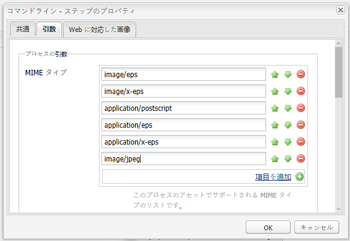
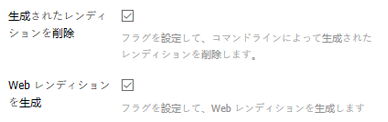
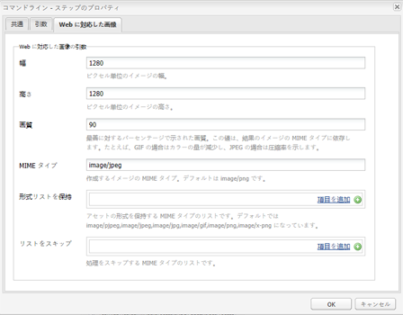
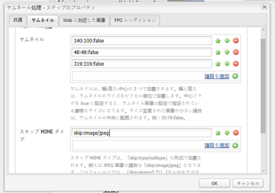
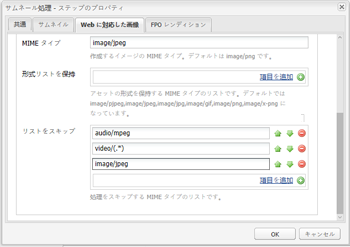

# Install and configure ImageMagick to work with [!DNL Experience Manager Assets] {#install-and-configure-imagemagick-to-work-with-aem-assets}

ImageMagickは、ビットマップ画像を作成、編集、構成または変換するためのソフトウェアプラグインです。 PNG、JPEG、JPEG-2000、GIF、TIFF、DPX、EXR、WebP、Postscript、PDF、SVGなど、様々な形式（200以上）で画像の読み取りと書き込みを行うことができます。 ImageMagick は、画像のサイズ変更、反転、ミラー、回転、変形、剪断および変換をおこなう場合に使用します。ImageMagick を使用して、画像の色を調整したり、各種特殊効果を適用したりすることもできます。また、テキスト、直線、多角形、楕円および曲線を描画することもできます。

Use the [!DNL Adobe Experience Manager] media handler from the command line to process images through ImageMagick. ImageMagick を使用して様々なファイル形式を取り扱うには、[Assets のファイル形式に関するベストプラクティス](/help/assets/assets-file-format-best-practices.md)を参照してください。すべてのサポートされるファイル形式については、[Assets でサポートされるファイル形式](/help/assets/assets-formats.md)を参照してください。

ImageMagick を使用して大きなファイルを処理する場合は、必要なメモリが通常より多くなること、IM ポリシーの変更が必要になる可能性があること、パフォーマンスへの全体的な影響を考慮してください。メモリ要件は、解像度、ビット深度、カラープロファイル、ファイル形式などの様々な要因によって異なります。If you intend to process very large files using ImageMagick, properly benchmark the [!DNL Experience Manager] server. いくつかの有用なリソースを最後に紹介します。

>[!NOTE]
>
>オン [!DNL Experience Manager][!DNL Adobe Managed Services] (AMS)を使用している場合は、高解像度のPSDまたはPSBファイルを多数処理する予定の場合は、Adobeカスタマーケアにお問い合わせください。 [!DNL Experience Manager] は、30000 x 23000ピクセルを超える高解像度PSBファイルを処理できない場合があります。

## ImageMagick のインストール {#installing-imagemagick}

各種オペレーティングシステム向けに、様々なバージョンの ImageMagick インストールファイルが用意されています。オペレーティングシステムに適したバージョンを使用してください。

1. Download the appropriate [ImageMagick installation files](https://www.imagemagick.org/script/download.php) for your operating system.
1. To install ImageMagick on the disk hosting the [!DNL Experience Manager] server, launch the installation file.

1. path 環境変数を ImageMagick のインストールディレクトリに設定します。
1. インストールが成功したかどうかを確認するには、`identify -version` コマンドを実行します。

## コマンドラインプロセスのステップの設定 {#set-up-the-command-line-process-step}

特定の使用例に応じてコマンドラインプロセスのステップを設定できます。Perform these steps to generate a flipped image and thumbnails (140x100, 48x48, 319x319, and 1280x1280) each time you add a JPEG image file to `/content/dam` on the [!DNL Experience Manager] server:

1. On the [!DNL Experience Manager] server, go to the Workflow console (`https://[aem_server]:[port]/workflow`) and open the **[!UICONTROL DAM Update Asset]** workflow model.
1. From the **[!UICONTROL DAM Update Asset]** workflow model, open the **[!UICONTROL EPS thumbnails (powered by ImageMagick)]** step.
1. In the **[!UICONTROL Arguments tab]**, add `image/jpeg` to the **[!UICONTROL Mime Types]** list.

   

1. 「**[!UICONTROL コマンド]**」ボックスに、次のコマンドを入力します。

   `convert ./${filename} -flip ./${basename}.flipped.jpg`

1. Select the **[!UICONTROL Delete Generated Rendition]** and **[!UICONTROL Generate Web Rendition]** flags.

   

1. 「**[!UICONTROL Web に対応した画像]**」タブで、1280 x 1280 ピクセルというサイズでレンディションの詳細を指定します。さらに、「Mimetype `image/jpeg` 」ボックスでを指定し **** ます。

   

1. 「**[!UICONTROL OK]**」をクリックして、変更を保存します。

   >[!NOTE]
   >
   >The `convert` command may not run with certain Windows versions (for example Windows SE), because it conflicts with the native `convert` utility that is part of Windows installation. このような場合は、ImageMagick ユーティリティの完全パスを指定します。例えば、以下のように指定します。
   >
   >
   >`"C:\Program Files\ImageMagick-6.8.9-Q16\convert.exe" -define jpeg:size=319x319 ./${filename} -thumbnail 319x319 cq5dam.thumbnail.319.319.png`

1. Open the **[!UICONTROL Process Thumbnails]** step, and add the MIME type `image/jpeg` under **[!UICONTROL Skip Mime Types]**.

   

1. In the **[!UICONTROL Web Enabled Image]** tab, add the MIME type `image/jpeg` under the **[!UICONTROL Skip List]**. 「**[!UICONTROL OK]**」をクリックして、変更を保存します。

   

1. ワークフローを保存します。

1. 適切な処理を検証するには、にJPG画像をアップロードし [!DNL Assets]ます。 処理が完了したら、反転した画像とレンディションが生成されるかどうかを確認します。

## セキュリティの脆弱性の緩和 {#mitigating-security-vulnerabilities}

ImageMagick を使用した画像の処理に関連して、セキュリティの脆弱性が複数存在します。例えば、ユーザーが送信した画像の処理は、リモートコード実行（RCE）のリスクを伴います。

さらに、PHP の imagick、Ruby の rmagick と paperclip、nodejs の imagemagick など様々な画像処理プラグインが、ImageMagick ライブラリに依存しています。

ImageMagick または影響を受けるライブラリを使用する場合は、以下のタスクのどちらか（できれば両方）を実行して、既知の脆弱性を緩和することをお勧めします。

1. Verify that all image files begin with the expected [&quot;magic bytes&quot;](https://en.wikipedia.org/wiki/List_of_file_signatures) corresponding to the image file types you support before sending them to ImageMagick for processing.
1. ポリシーファイルを使用して、脆弱なImageMagickコーダーを無効にします。 The global policy for ImageMagick is found at `/etc/ImageMagick`.
