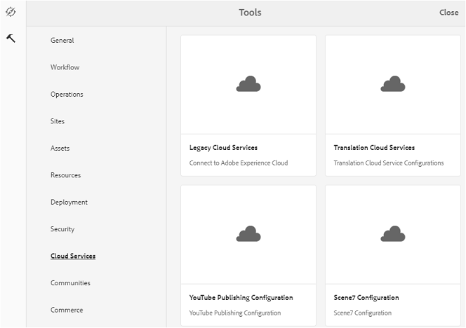
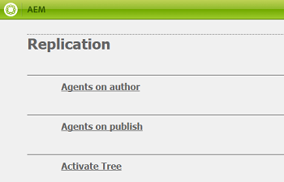

# AEM Assets と Brand Portal の統合の設定 {#configure-aem-assets-integration-with-brand-portal}

Adobe Experience Manager(AEM)Assets Brand portalのお客様は、AEM AssetsをBrand portalと統合して、Brand portalにアセットを公開できます。 この統合は、Adobe.io インターフェイスを使用して設定できます。

最初に、Marketing Cloud の公開ゲートウェイに、認証メカニズムを含むアプリケーションを作成します。次に、ゲートウェイから取得したアプリケーション ID を使用して、AEM Assets インスタンスにプロファイルを作成します。

この設定を使用して、AEM Assets から Brand Portal にアセットを公開します。バックエンドでは、AEM サーバーがゲートウェイを使用してプロファイルを認証し、AEM Assets と Brand Portal を統合します。

>[!NOTE]
>
>The User Interface for configuring oAuth integrations is hosted in [https://legacy-oauth.cloud.adobe.io/](https://legacy-oauth.cloud.adobe.io/), which was earlier hosted in [https://marketing.adobe.com/developer/](https://marketing.adobe.com/developer/).

## JWT アプリケーションの作成 {#create-jwt-application}

1. Login to [https://legacy-oauth.cloud.adobe.io/](https://legacy-oauth.cloud.adobe.io/) with your Adobe ID. **「JWT Applications** 」ページが開きます。

   >[!NOTE]
   >
   >組織のシステム管理者の場合にのみ、アプリケーション ID を作成できます。テナントは、Adobe Marketing Cloud に登録している会社を意味する用語です。

1. Select **[!UICONTROL Add Application]** to create an application.
1. アプリケーションの名前とオプションの説明を指定します。
1. 「**[!UICONTROL 組織]**」リストからアセットを同期する組織を選択します。
1. From the **[!UICONTROL Scope]** list, select **[!UICONTROL dam-read]**, **[!UICONTROL dam-sync]**, **[!UICONTROL dam-write]**, and **[!UICONTROL cc-share]**.
1. 「**[!UICONTROL 追加]**」をクリックします。JWT サービスアプリケーションが作成されます。アプリケーションを編集して保存することができます。
1. 新規アプリケーションに対して生成されたアプリケーション ID をコピーします。

   >[!NOTE]
   >
   >アプリケーション ID ではなくアプリケーションの秘密鍵を誤ってコピーしないようにしてください。

## 新しいクラウド設定の作成 {#create-a-new-cloud-configuration}

1. From the **[!UICONTROL Navigation]** page of your local AEM Assets instance, click **[!UICONTROL Tools]** icon on the left.

1. Navigate to **[!UICONTROL Cloud Services]>[!UICONTROL Legacy Cloud Services]**.

   

1. In **[!UICONTROL Cloud Services]**, locate the **[!UICONTROL Assets Brand Portal]** service under **[!UICONTROL Adobe Experience Cloud]**.

   

1. Click **[!UICONTROL Configure now]** link below the service to display the **[!UICONTROL Create Configuration]** dialog.
1. In **[!UICONTROL Create Configuration]** dialog, specify a title and name for the new configuration and click **[!UICONTROL Create]**.

   

1. In the **[!UICONTROL AEM Assets Brand Portal Replication]** dialog, specify the URL of your organization in the **[!UICONTROL Tenant URL]** field.
1. 「**[!UICONTROL クライアント ID]**」フィールドに、[アプリケーションの作成](/help/assets/brand-portal-configuring-integration.md#create-jwt-application)の手順の最後でコピーしたアプリケーション ID を貼り付けます。「**[!UICONTROL OK]**」を選択します。

   

1. To make the assets (published from AEM) publicly available to general users of Brand Portal, enable the **[!UICONTROL Public Folder Publish]** check box .

   >[!NOTE]
   >
   >「**[!UICONTROL 公開フォルダーの公開]**」を有効にするオプションは、AEM 6.3.2.1 以降で利用できます。

1. **[!UICONTROL Brand Portal 設定]**&#x200B;ページで、「**[!UICONTROL 公開鍵を表示]**」をクリックして、インスタンスに対して生成された公開鍵を表示します。

   

   Alternatively, click **[!UICONTROL Download Public Key for OAuth Gateway]** to download the file containing the public key. 次に、ファイルを開いて公開鍵を表示します。

## 統合の有効化 {#enable-integration}

1. Display the public key using one of the following methods mentioned in the last step of the procedure [Add a new configuration to Marketing Cloud](/help/assets/brand-portal-configuring-integration.md#create-a-new-cloud-configuration).

   * Click **[!UICONTROL Display Public Key]** button to display the key.
   * 鍵が含まれるダウンロードファイルを開きます。

1. Open the Marketing Cloud Developer Connection interface and click on the application you created in [Create an application](/help/assets/brand-portal-configuring-integration.md#create-jwt-application).
1. 設定インターフェイスの「**[!UICONTROL 公開鍵]**」フィールドに公開鍵を貼り付けます。
1. 「**[!UICONTROL 保存]**」をクリックします。アプリケーションが更新されたことを確認するメッセージが表示されます。

## 統合のテスト {#test-the-integration}

1. From the **[!UICONTROL Navigation]** page of your local AEM Assets instance, click **[!UICONTROL Tools]** icon on the left.

1. Navigate to **[!UICONTROL Deployment]** > **[!UICONTROL Replication]**.

   

1. In the **[!UICONTROL Replication]** page, click **[!UICONTROL Agents on author]**.

   

1. AEM オーサーと Brand Portal の間の接続を検証するには、4 つのレプリケーションエージェントのいずれかを開き、「**[!UICONTROL 接続をテスト]**」をクリックします。

   >[!NOTE]
   >
   >レプリケーションエージェントは並行して動作し、ジョブの分散を均等に共有するので、パブリッシング速度が元の速度の4倍に向上します。 クラウドサービスの設定後は、複数のアセットの並行公開を有効にするために、デフォルトでアクティブ化される複製エージェントを有効にするために、追加の設定は必要ありません。

   >[!NOTE]
   >
   >どのレプリケーションエージェントも無効にしないでください。一部のアセットのレプリケーションが失敗する可能性があります。

   

1. テスト結果の一番下を見て、レプリケーションが成功したことを確認します。

   

レプリケーションが正常に終了したら、アセット、フォルダー、コレクションを Brand Portal に公開することができます。詳しくは、次を参照してください。

* [アセットおよびフォルダーの Brand Portal への公開](/help/assets/brand-portal-publish-folder.md)
* [Brand Portal へのコレクションの公開](/help/assets/brand-portal-publish-collection.md)

## Brand Portal へのアセットの公開 {#publish-assets-to-brand-portal}

レプリケーションが正常に終了したら、アセット、フォルダー、コレクションを Brand Portal に公開することができます。アセットを Brand Portal に公開するには、次の手順を実行します。

>[!NOTE]
>
>AEM オーサーが過剰なリソースを占有しないように、できればピーク時を避け、時間をずらして公開することをお勧めします。

1. アセットコンソールから、公開するアセット/フォルダーを選択し、ツールバーの「クイック公開 **** 」オプションをクリックします。

   または、Brand Portal に公開するアセットを選択します。

   

1. アセットをBrand Portalに公開するには、次の2つのオプションを使用できます。
   * [アセットを直ちに発行](#publish-to-bp-now)
   * [アセットを後で公開](#publish-to-bp-now)

### アセットを今すぐ公開 {#publish-to-bp-now}

選択したアセットを Brand Portal に公開するには、次のいずれかを実行します。

* From the toolbar, select **[!UICONTROL Quick Publish]**. Then from the menu, select **[!UICONTROL Publish to Brand Portal]**.

* From the toolbar, select **[!UICONTROL Manage Publication]**.

   1. Then from the **[!UICONTROL Action]** select **[!UICONTROL Publish to Brand Portal]**, and from **[!UICONTROL Scheduling]** select **[!UICONTROL Now]**. 「**[!UICONTROL 次へ]**」をクリックします。

   2. Within **[!UICONTROL Scope]**, confirm your selection and click **[!UICONTROL Publish to Brand Portal]**.

アセットが Brand Portal への公開用のキューに入れられたことを示すメッセージが表示されます。ブランドポータルインターフェイスにログインして、公開済みアセットを表示します。

### アセットを後で公開 {#publish-to-bp-later}

アセットを Brand Portal に公開するスケジュールを未来の日時で設定するには、次のようにします。

1. Once you have selected assets/ folders to publish, select **[!UICONTROL Manage Publication]** from the tool bar at the top.

1. On **[!UICONTROL Manage Publication]** page, select **[!UICONTROL Publish to Brand Portal]** from **[!UICONTROL Action]** and select **[!UICONTROL Later]** from **[!UICONTROL Scheduling]**.

   

1. Select an **[!UICONTROL Activation date]** and specify time. 「**[!UICONTROL 次へ]**」をクリックします。

1. Select an **Activation date** and specify time. 「**次へ**」をクリックします。

1. Specify a **[!UICONTROL Workflow title]** in **[!UICONTROL Workflows]**. Click **[!UICONTROL Publish Later]**.

   

次に、Brand portalにログインして、公開されたアセットがBrand portalインターフェイスで使用できるかどうかを確認します。

