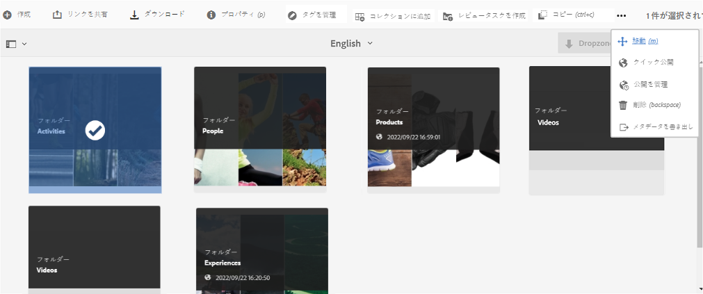
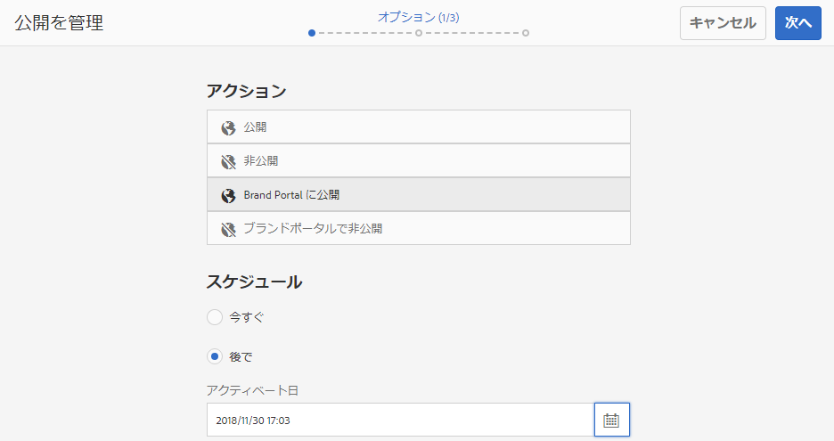
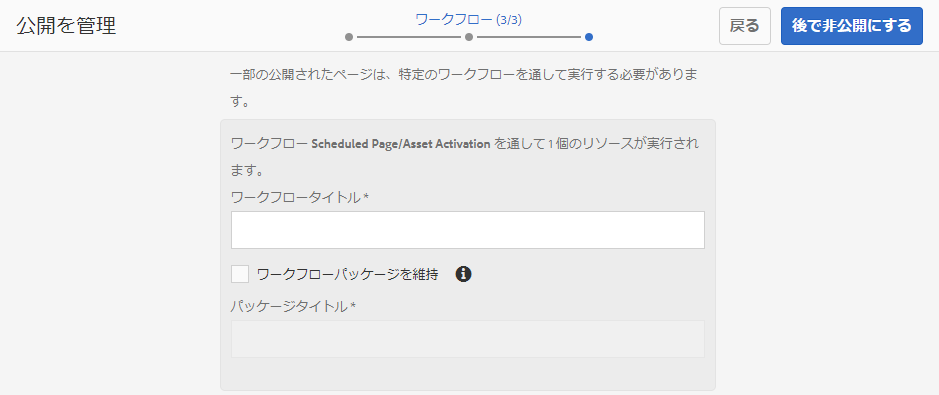
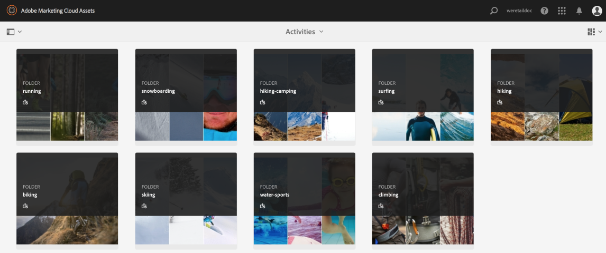

# Brand Portal へのアセットの公開 {#publish-assets-to-brand-portal}

Adobe Experience Manager（AEM）Assets の管理者は、アセットやフォルダーを組織の AEM Assets Brand Portal インスタンスに公開（または公開ワークフローを未来の日時で設定）できます。ただし、最初に AEM Assets を Brand Portal と連携するように設定する必要があります。詳しくは [AEM Assets と Brand Portal の連携の設定](/help/assets/configure-aem-assets-with-brand-portal.md)を参照してください。

レプリケーションが正常に終了したら、アセット、フォルダー、コレクションを Brand Portal に公開することができます。アセットを Brand Portal に公開するには、次の手順を実行します。

>[!NOTE]
>
>AEM オーサーが過剰なリソースを占有しないように、できればピーク時を避け、時間をずらして公開することをお勧めします。

1. From the Assets console, select the assets/folder that you want to publish and click **[!UICONTROL Quick Publish]** option from the toolbar.

   または、Brand Portal に公開するアセットを選択します。

   

1. アセットをBrand Portalに公開するには、次の2つのオプションを使用できます。
   * [アセットを直ちに公開](#publish-to-bp-now)
   * [アセットを後で公開](#publish-to-bp-now)

## アセットを今すぐ公開 {#publish-to-bp-now}

選択したアセットを Brand Portal に公開するには、次のいずれかを実行します。

* ツールバーで「**[!UICONTROL クイック公開]**」を選択します。Then from the menu, select **[!UICONTROL Publish to Brand Portal]**.

* ツールバーで「**[!UICONTROL 公開を管理]**」を選択します。

   1. Then from the **[!UICONTROL Action]** select **[!UICONTROL Publish to Brand Portal]**, and from **[!UICONTROL Scheduling]** select **[!UICONTROL Now]**. 「**[!UICONTROL 次へ]**」をクリックします。

   2. Within **[!UICONTROL Scope]**, confirm your selection and click **[!UICONTROL Publish to Brand Portal]**.

アセットが Brand Portal への公開用のキューに入れられたことを示すメッセージが表示されます。Brand Portal のインターフェイスにログインして、公開されたアセットを確認します。

## アセットを後で公開 {#publish-to-bp-later}

アセットを Brand Portal に公開するスケジュールを後の日時に設定するには、次の手順を実行します。

1. Once you have selected assets/ folders to publish, select **[!UICONTROL Manage Publication]** from the tool bar at the top.

1. On **[!UICONTROL Manage Publication]** page, select **[!UICONTROL Publish to Brand Portal]** from **[!UICONTROL Action]** and select **[!UICONTROL Later]** from **[!UICONTROL Scheduling]**.

   

1. 「**[!UICONTROL アクティベート日]**」を選択して時刻を指定します。「**[!UICONTROL 次へ]**」をクリックします。

1. 「**アクティベート日**」を選択して時刻を指定します。「**次へ**」をクリックします。

1. 「**[!UICONTROL ワークフロー]**」で&#x200B;**[!UICONTROL ワークフロータイトル]**&#x200B;を指定します。「**[!UICONTROL 後で公開する]**」をクリックします。

   

次に、Brand Portalにログインして、公開されたアセットがBrand Portalインターフェイスで使用できるかどうかを確認します。

