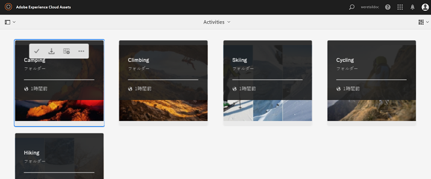

# Brand Portal へのアセットの公開 {#publish-assets-to-brand-portal}

Adobe Experience Manager（AEM）Assets の管理者は、アセットやフォルダーを組織の AEM Assets Brand Portal インスタンスに公開（または公開ワークフローを未来の日時で設定）できます。ただし、最初に AEM Assets を Brand Portal と連携するように設定する必要があります。詳しくは [AEM Assets と Brand Portal の連携の設定](/help/assets/configure-aem-assets-with-brand-portal.md)を参照してください。

レプリケーションが正常に終了したら、アセット、フォルダー、コレクションを Brand Portal に公開することができます。アセットを Brand Portal に公開するには、次の手順を実行します。

>[!NOTE]
>
>AEM オーサーが過剰なリソースを占有しないように、できればピーク時を避け、時間をずらして公開することをお勧めします。

1. アセットコンソールから、公開するアセットやフォルダーを選択し、ツールバーの「**[!UICONTROL クイック公開]**」オプションをクリックします。

   または、Brand Portal に公開するアセットを選択します。

   

1. アセットを Brand Portal に公開するには、次の 2 つのオプションを使用します。
   * [アセットを直ちに公開する](#publish-to-bp-now)
   * [アセットを後で公開](#publish-to-bp-now)

## アセットを今すぐ公開 {#publish-to-bp-now}

選択したアセットを Brand Portal に公開するには、次のいずれかを実行します。

* ツールバーで「**[!UICONTROL クイック公開]**」を選択します。次に、メニューで **[!UICONTROL Brand Portal に公開]**&#x200B;を選択します。

* ツールバーで「**[!UICONTROL 公開を管理]**」を選択します。

   1. 次に、**[!UICONTROL アクション]**&#x200B;から「**[!UICONTROL Brand Portal に公開]**」を選択し、**[!UICONTROL スケジュール]**&#x200B;から「**[!UICONTROL 今すぐ]**」を選択します。「**[!UICONTROL 次へ]**」をクリックします。

   2. **[!UICONTROL 範囲]**&#x200B;で選択内容を確認し、**[!UICONTROL Brand Portal に公開]**&#x200B;をクリックします。

アセットが Brand Portal への公開用のキューに入れられたことを示すメッセージが表示されます。Brand Portal のインターフェイスにログインして、公開されたアセットを確認します。

## アセットを後で公開 {#publish-to-bp-later}

アセットを Brand Portal に公開するスケジュールを後の日時に設定するには、次の手順を実行します。

1. 公開するアセットまたはフォルダーを選択したら、上部のツールバーから&#x200B;**[!UICONTROL 公開を管理]**&#x200B;を選択します。

1. **[!UICONTROL 公開を管理]**&#x200B;ページで、**[!UICONTROL アクション]**&#x200B;から「**[!UICONTROL Brand Portal に公開]**」を選択し、**[!UICONTROL スケジュール]**&#x200B;から「**[!UICONTROL 後で]**」を選択します。

   

1. 「**[!UICONTROL アクティベート日]**」を選択して時刻を指定します。「**[!UICONTROL 次へ]**」をクリックします。

1. 「**アクティベート日**」を選択して時刻を指定します。「**次へ**」をクリックします。

1. 「**[!UICONTROL ワークフロー]**」で&#x200B;**[!UICONTROL ワークフロータイトル]**&#x200B;を指定します。「**[!UICONTROL 後で公開する]**」をクリックします。

   

次に、Brand Portal にログインして、公開したアセットが Brand Portal インターフェイスで使用できるかどうかを確認します。

