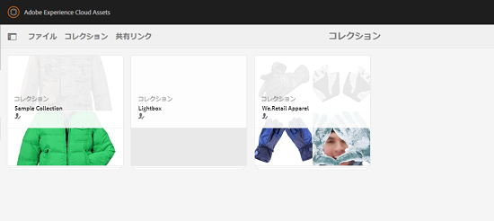
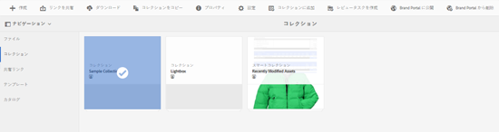

# Brand Portal へのコレクションの公開 {#publish-collections-to-brand-portal}

Adobe Experience Manager（AEM）Assets の管理者は、組織の AEM Assets Brand Portal のインスタンスにコレクションを公開できます。ただし、最初に AEM Assets を Brand Portal と統合する必要があります。For details, see [Configure AEM Assets with Brand Portal](/help/assets/configure-aem-assets-with-brand-portal.md).

AEM Assetsの元のコレクションに後で変更を加えた場合、そのコレクションを再度公開するまで、変更はBrand Portalに反映されません。 この特性により、作業中の変更がBrand Portalで使用できなくなります。 Brand Portalでは、管理者が発行した承認済みの変更のみを利用できます。

>[!NOTE]
>
>コンテンツフラグメントは Brand Portal に公開できません。Therefore, if you select content fragment(s) on AEM Author, then **Publish to Brand Portal** action is not available.
>
>コンテンツフラグメントを含むコレクションを AEM オーサーインスタンスから Brand Portal へ公開した場合は、そのフォルダー内のコンテンツフラグメントを除く全コンテンツが Brand Portal インターフェイスにレプリケートされます。

## Brand Portal へのコレクションの公開 {#publish-a-collection-to-brand-portal}

1. AEM Assets UIで、「AEM logo」をクリックします。
1. From **Navigation** page, go to **Assets > Collections**.
1. コレクションコンソールから、ブランドポータルに公開するコレクションを選択します。

   

1. From the toolbar, click **Publish to Brand Portal**.
1. In the confirmation dialog, click **Publish**.
1. 確認メッセージを閉じます。
1. 管理者として Brand Portal にログインします。公開したコレクションがコレクションインターフェイスで利用できます。

   

## コレクションを非公開にする {#unpublish-collections}

AEM AssetsからBrand Portalに公開するコレクションの公開を取り消すことができます。 元のコレクションの公開を取り消すと、そのコピーはBrand Portalユーザーは使用できなくなります。

1. AEM Assets インスタンスのコレクションコンソールから、非公開にしたいコレクションを選択します。

   

1. From the toolbar, click **Remove from Brand Portal** icon.
1. In the dialog, click **Unpublish**.
1. 確認メッセージを閉じます。コレクションがBrand Portalインターフェイスから削除されます。

