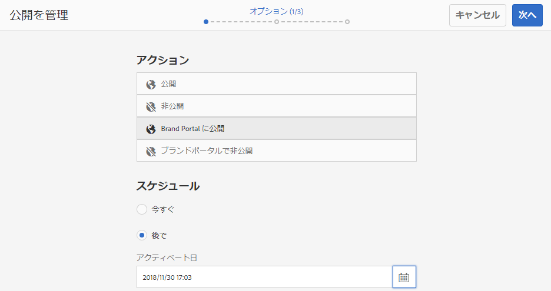
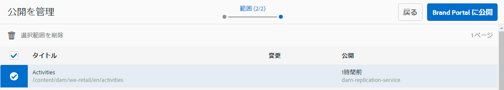
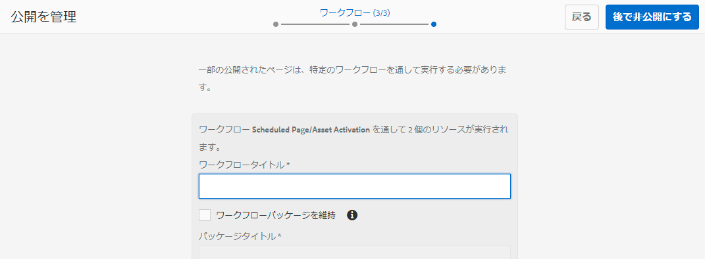

# Brand Portal へのフォルダーの公開{#publish-folders-to-brand-portal}

Adobe Experience Manager（AEM）Assets の管理者は、アセットやフォルダーを組織の AEM Assets Brand Portal インスタンスに公開（または公開ワークフローを未来の日時で設定）できます。ただし、最初に AEM Assets を Brand Portal と統合する必要があります。詳しくは [AEM Assets と Brand Portal の連携の設定](/help/assets/configure-aem-assets-with-brand-portal.md)を参照してください。

アセットまたはフォルダーを公開すると、ブランドポータルでそのアセットまたはフォルダーをユーザーが使用できるようになります。

AEM Assetsの元のアセットまたはフォルダーに後で変更を加えた場合、その変更は、アセットまたはフォルダーを再公開するまでBrand Portalに反映されません。 このため、作業中の変更が Brand Portal に提供されることがありません。管理者が公開した承認済みの変更のみが Brand Portal で提供されます。

## Brand Portal へのフォルダーの公開 {#publish-folders-to-brand-portal-1}

1. From the AEM Assets interface, hover over the desired folder and select **Publish** option from the quick actions.

   あるいは、目的のフォルダーを選択して後述の手順に従います。

   

1. **フォルダーを今すぐ公開**

   選択したフォルダーを Brand Portal に公開するには、次のいずれかを実行します。

   * ツールバーで「**クイック公開**」を選択します。Then from the menu, select **Publish to Brand Portal**.

   * ツールバーで「**公開を管理**」を選択します。
   1. 「 **アクション** 」から「ブランドポータルに **発行」を選択し**、 **「スケジューリング********」から「now now now」を選択し、「次へ」をクリックします。**
   1. 「**範囲**」の選択を確認し、「**Brand Portal に公開**」をクリックします。

   フォルダーが Brand Portal への公開用のキューに入れられたことを示すメッセージが表示されます。Brand Portal のインターフェイスにログインして、公開されたフォルダーを確認します。

   **フォルダーを後で公開**

   アセットフォルダーのBrand Portalへの投稿ワークフローを後の日時にスケジュールするには：

   1. Once you have selected assets/ folders to publish, select **Manage Publication** from the tool bar at the top.
   1. 「 **アクション** 」から「ブランドポータルに **公開**」を選択し、「スケジューリング **」から「******&#x200B;後で」を選択します。

      

   1. 「**アクティベート日**」を選択して時刻を指定します。「**次へ**」をクリックします。
   1. 「**範囲**」で選択内容を確認します。「**次へ**」をクリックします。
   1. 「**ワークフロー**」でワークフロータイトルを指定します。「**後で公開する**」をクリックします。

      

## Brand Portal へのフォルダーの非公開 {#unpublish-folders-from-brand-portal}

AEM オーサーインスタンスからアセットインスタンスの公開を取り消すことで、Brand Portal に公開されているアセットフォルダーを削除できます。元のフォルダーを非公開にすると、Brand Portal ユーザーはそのコピーを使用できなくなります。

Brand Portal へのフォルダーの公開をすぐに取り消すことも、取り消しのスケジュールを未来の日時で設定することもできます。Brand Portal へのアセットフォルダーを非公開にするには、次の手順を実行します。

1. AEM オーサーインスタンス内の AEM Assets インターフェイスで、公開を取り消すフォルダーを選択します。

   

1. From the toolbar, Click **Manage Publication**.

1. **Brand Portal への公開を今すぐ取り消し**

   Brand Portal へのフォルダーの公開をすぐに取り消すには、次のようにします。

   1. ツールバーで「**公開を管理**」を選択します。
   1. 「 **アクション** 」から「Brand Portalから **非公開」を選択し**、 **「Scheduling Scheduling」から「now now********now next」を選択します。**
   1. 「**範囲**」の選択を確認し、「**Brand Portal から非公開**」をクリックします。

   

   **後でBrand Portalから非公開にする**

   Brand Portal へのフォルダーの公開を停止するスケジュールを未来の日時で設定するには、次のようにします。

   1. ツールバーで「**公開を管理**」を選択します。
   1. From **Action** select **Unpublish from Brand Portal**, and from **Scheduling** select **Later**.
   1. 「**アクティベート日**」を選択して時刻を指定します。「**次へ**」をクリックします。
   1. 「**範囲**」で選択内容を確認し、「**次へ**」をクリックします。
   1. 「**ワークフロー**」で&#x200B;**ワークフロータイトル**&#x200B;を指定します。Click **Unpublish Later.**

      

>[!NOTE]
>
>Brand Portalに対してアセットを公開/非公開する手順は、フォルダーの対応する手順と似ています。

