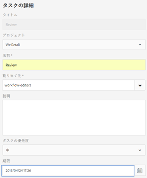
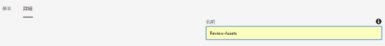
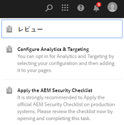
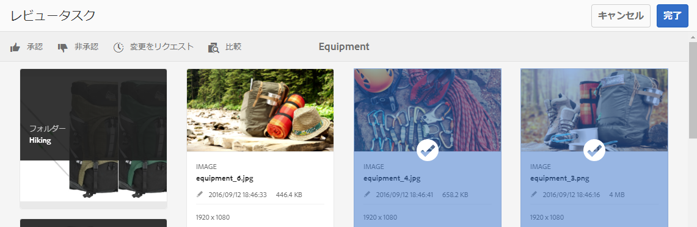
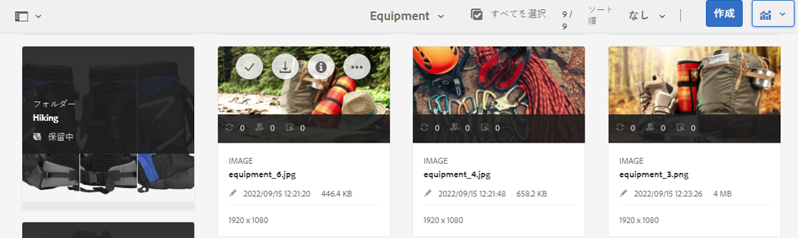
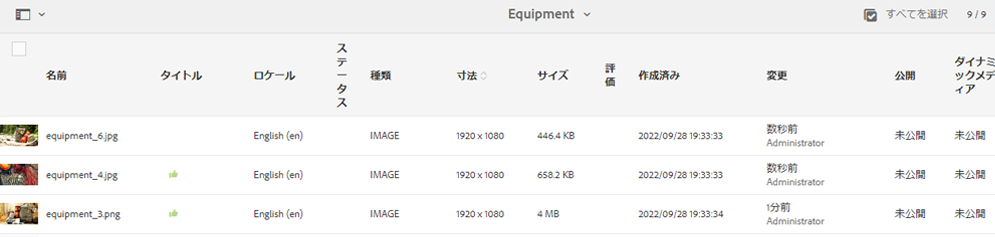
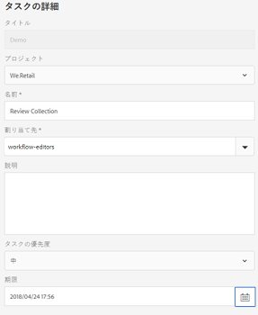
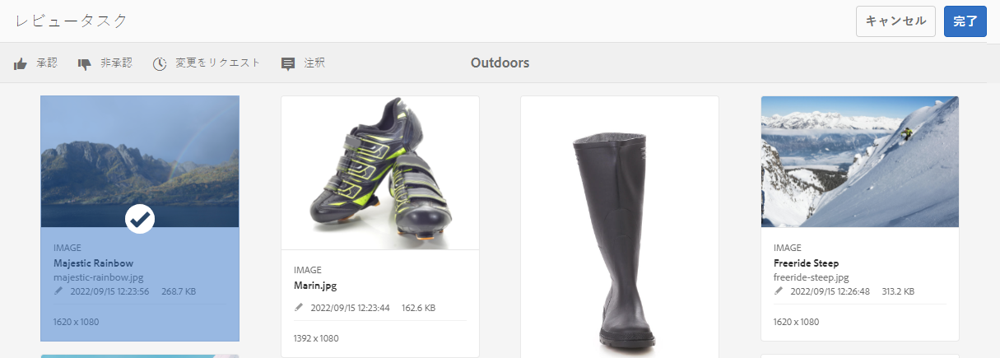
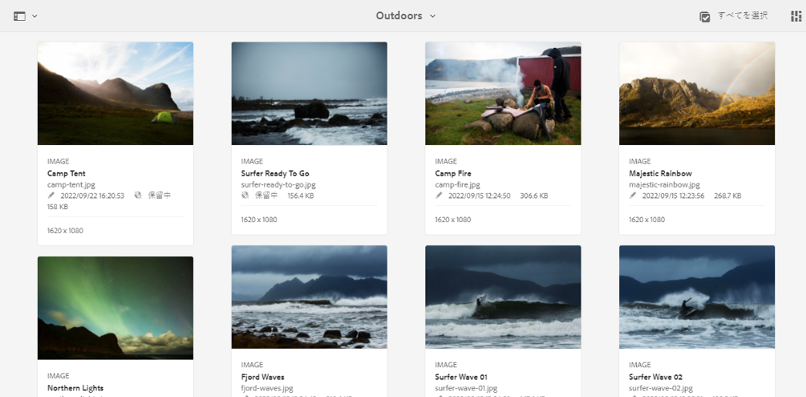
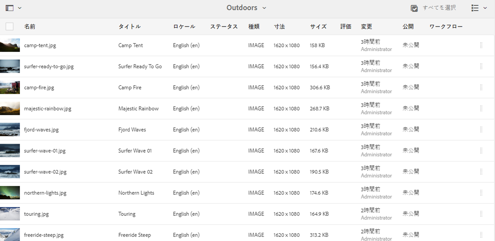

# フォルダーのアセットとコレクションのレビュー {#review-folder-assets-and-collections}

フォルダー内またはコレクション内のアセットに対してレビューワークフローを設定し、それをレビュー担当者またはクリエイティブパートナーと共有してフィードバックを得ることができます。

Adobe Experience Manager Assetsを使用すると、フォルダーまたはコレクション内のアセットに対して臨時のレビューワークフローを設定し、レビュー担当者やクリエイティブパートナーと共有して、フィードバックを求めることができます。

レビューワークフローをプロジェクトと関連付けることも、独立したレビュータスクを作成することもできます。

ユーザーがアセットを共有した後で、レビュー担当者がアセットを承認または拒否できます。ワークフローの様々なステージで、様々なタスクの完了に関する通知が対象の受信者に送られます。例えば、ユーザーがフォルダーまたはコレクションを共有すると、レビュー担当者は、フォルダーまたはコレクションがレビューのために共有されたという通知を受け取ります。

レビュー担当者がレビューを終了（アセットを承認または拒否）すると、ユーザーはレビューが完了したという通知を受け取ります。

## Create a review task for folders {#creating-a-review-task-for-folders}

1. Assets ユーザーインターフェイスで、レビュータスクを作成するフォルダーを選択します。
1. From the toolbar, click **[!UICONTROL Create Review Task]** to open the **[!UICONTROL Review Task]** page. If you cannot see the option in the toolbar, click **[!UICONTROL More]** and then select the option.

   

1. （オプション）「**[!UICONTROL プロジェクト]**」リストから、レビュータスクを関連付けるプロジェクトを選択します。デフォルトでは、「**[!UICONTROL なし]**」オプションが選択されています。レビュータスクにプロジェクトを関連付けない場合は、この選択状態のままにします。

   >[!NOTE]
   >
   >エディターレベルの権限（またはそれ以上）のあるプロジェクトのみが「**[!UICONTROL プロジェクト]**」リストに表示されます。

1. レビュータスクの名前を入力し、「**[!UICONTROL 割り当て先]**」リストから承認者を選択します。

   >[!NOTE]
   >
   >選択されたプロジェクトのメンバーまたはグループが、承認者として「**[!UICONTROL 割り当て先]**」リストに表示されます。

1. レビュータスクの説明、タスクの優先順位および期限を入力します。

   

1. 「詳細」タブで、URI の作成に使用されるラベルを入力します。

   

1. Click **[!UICONTROL Submit]**, and then click **[!UICONTROL Done]** to close the confirmation message. 新しいタスクに関する通知が承認者に送信されます。
1. 承認者として Assets にログインし、Assets UI に移動します。To approve assets, click **[!UICONTROL Notifications]** and then select the review task from the list.

   

1. In the **[!UICONTROL Review Task]** page, examine the details of the review task, and then click **[!UICONTROL Review]**.
1. In the **[!UICONTROL Review Task]** page, select assets, and click **[!UICONTROL Approve/Reject]** to approve or reject, as appropriate.

   

1. Click **[!UICONTROL Complete]** from the toolbar. In the dialog, enter a comment and click  **[!UICONTROL Complete]** to confirm.
1. アセットユーザーインターフェイスに移動し、フォルダーを開きます。 アセットの承認ステータスアイコンは、カードの表示とリストの表示に表示されます。

   **カード表示**

   

   **リスト表示**

   

## Create a review task for collections {#creating-a-review-task-for-collections}

1. コレクションページで、レビュータスクを作成するコレクションを選択します。
1. From the toolbar, click **[!UICONTROL Create Review Task]** to open the **[!UICONTROL Review Task]** page. If you cannot see the option on the toolbar, click **[!UICONTROL More]** and then select the option.

   

1. （オプション）「**[!UICONTROL プロジェクト]**」リストから、レビュータスクを関連付けるプロジェクトを選択します。デフォルトでは、「**[!UICONTROL なし]**」オプションが選択されています。レビュータスクにプロジェクトを関連付けない場合は、この選択状態のままにします。

   >[!NOTE]
   >
   >エディターレベルの権限（またはそれ以上）のあるプロジェクトのみが「**[!UICONTROL プロジェクト]**」リストに表示されます。

1. レビュータスクの名前を入力し、「**[!UICONTROL 割り当て先]**」リストから承認者を選択します。

   >[!NOTE]
   >
   >選択されたプロジェクトのメンバーまたはグループが、承認者として「**[!UICONTROL 割り当て先]**」リストに表示されます。

1. レビュータスクの説明、タスクの優先順位および期限を入力します。

   

1. Click **[!UICONTROL Submit]**, and then click **[!UICONTROL Done]** to close the confirmation message. 新しいタスクに関する通知が承認者に送信されます。
1. 承認者として Assets にログインし、アセットコンソールに移動します。To approve assets, click **[!UICONTROL Notifications]** and then select the review task from the list.
1. In the **[!UICONTROL Review Task]** page, examine the details of the review task, and then click **[!UICONTROL Review]**.
1. コレクションのすべてのアセットがレビューページに表示されます。Select the assets and click **[!UICONTROL Approve/Reject]** to approve or reject assets, as appropriate.

   

1. Click **[!UICONTROL Complete]** from the toolbar. In the dialog, enter a comment and click **[!UICONTROL Complete]** to confirm.
1. コレクションコンソールに移動して、コレクションを開きます。アセットの承認ステータスアイコンは、カード表示とリスト表示の両方に表示されます。

   

   *図： カードの表示。*

   

   *図： リスト表示。*
