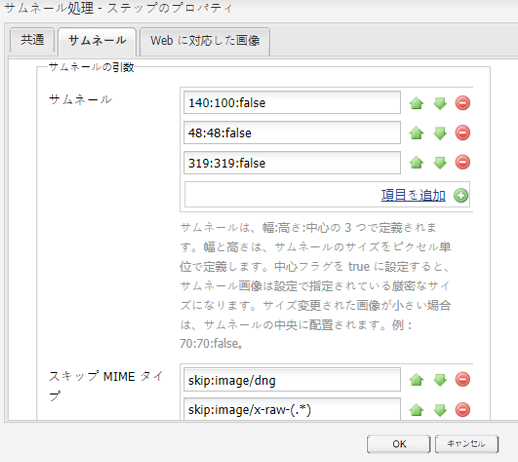
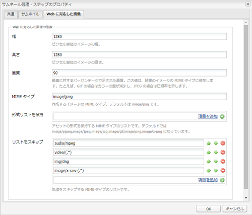
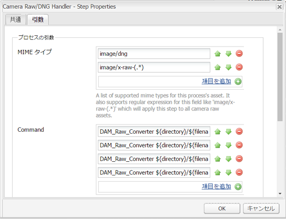
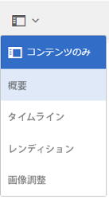
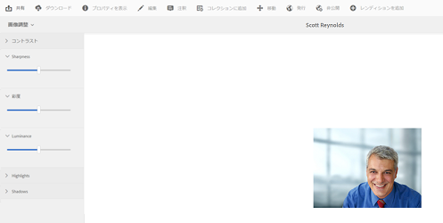

# Camera Rawを使用した画像の処理 {#camera-raw-support}

CR2、NEF、RAFなどの生のファイル形式の処理、JPEG形式での画像のレンダリングの [!DNL Adobe Camera Raw] サポートを有効にすることができます。 この機能は、Package Shareで使用可能な [!DNL Adobe Experience Manager Assets] Camera Rawパッケージ  (Camera Raw)の使用でサポートされます。

>[!NOTE]
>
>この機能は JPEG レンディションのみをサポートします。Windows 64ビット、Mac OS、およびRHEL 7.xでサポートされています。

での [!DNL Camera Raw] サポートを有効にするに [!DNL Experience Manager Assets]は、次の手順に従います。

1. Camera Rawパッケージは、Package Shareまたは [Software Distribution](https://www.adobeaemcloud.com/content/marketplace/marketplaceProxy.html?packagePath=/content/companies/public/adobe/packages/aem630/product/assets/aem-assets-cameraraw-pkg) ( [ソフトウェア配布)からダウンロードします](https://experience.adobe.com/#/downloads/content/software-distribution/en/aem.html?package=/content/software-distribution/en/details.html/content/dam/aem/public/adobe/packages/aem620/product/assets/aem-assets-cameraraw-pkg)。
1. `https://[aem_server]:[port]/workflow` にアクセスします。Open the **[!UICONTROL DAM Update Asset]** workflow.
1. Open the **[!UICONTROL Process Thumbnails]** step.
1. Provide the following configuration in the **[!UICONTROL Thumbnails]** tab:

   * **[!UICONTROL サムネール]**: `140:100:false, 48:48:false, 319:319:false`
   * **[!UICONTROL スキップ MIME タイプ]**: `skip:image/dng, skip:image/x-raw-(.*)`
   

1. 「 **[!UICONTROL Web対応のリスト]** 」タブの「画像を **[!UICONTROL スキップ]** 」フィールドで、を指定し `audio/mpeg, video/(.*), image/dng, image/x-raw-(.*)`ます。

   

1. From the side panel, add the **[!UICONTROL Camera Raw/DNG Handler]** step below the **[!UICONTROL Thumbnail creation]** step.
1. In the **[!UICONTROL Camera Raw/DNG Handler]** step, add the following configuration in the **[!UICONTROL Arguments]** tab:

   * **[!UICONTROL MIMEタイプ]**: `image/dng` と `image/x-raw-(.*)`
   * **[!UICONTROL コマンド]**:

      * `DAM_Raw_Converter ${directory}/${filename} ${directory} cq5dam.web.1280.1280.jpeg 1280 1280`
      * `DAM_Raw_Converter ${directory}/${filename} ${directory} cq5dam.thumbnail.319.319.jpeg 319 319`
      * `DAM_Raw_Converter ${directory}/${filename} ${directory} cq5dam.thumbnail.140.100.jpeg 140 100`
      * `DAM_Raw_Converter ${directory}/${filename} ${directory} cq5dam.thumbnail.48.48.jpeg 48 48`
   

1. 「**[!UICONTROL 保存]**」をクリックします。

>[!NOTE]
>
>上記の設定が **[!UICONTROL Camera RAW および DNG 処理ステップによるサンプルの DAM 更新アセット]**&#x200B;設定と同じであることを確認してください。

これで、Camera Raw ファイルを Assets に読み込むことができます。After you install the Camera RAW package and configure the required workflow, **[!UICONTROL Image Adjust]** option appears in the list of side panes.

*図： サイドペインのオプション。*

*図： このオプションを使用して、画像に対して軽量な編集を行います。*

After saving the edits to a [!DNL Camera Raw] image, a new rendition `AdjustedPreview.jpg` is generated for the image. For other image types except [!DNL Camera Raw], the changes are reflected in all the renditions.

## ベストプラクティス、既知の問題、および制限 {#best-practices}

この機能には次の制限があります。

* この機能は JPEG レンディションのみをサポートします。これは、Windows 64 ビット、Mac OS および RHEL 7.x でサポートされます。
* メタデータの書き戻しは、RAW および DNG 形式ではサポートされていません。
* The [!DNL Camera Raw] library has limitations around the total pixels it can process at a time. 現在、ファイルの長辺で最大65,000ピクセル、または最初に検出される条件に合わせて512 MPで処理できます。
