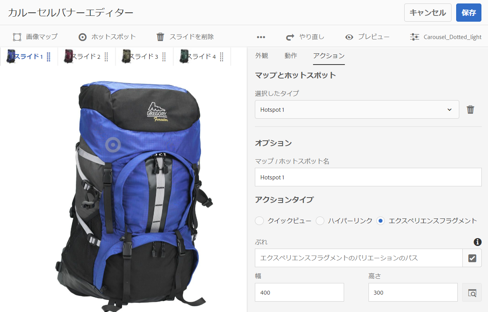

# カルーセルバナー{#carousel-banners}

カルーセルバナーを使用すると、回転するインタラクティブなプロモーションコンテンツをマーケティング担当者が簡単に作成して、任意の画面に配信できるようになり、コンバージョンを推進できます。

プロモーションバナーに表示するコンテンツの作成や変更には時間がかかるので、新しいコンテンツをすぐに公開したり、ターゲットを絞り込んだりする際に制約が生じます。カルーセルバナーを使用すると、回転するバナーをすばやく作成または変更できます。 製品の詳細や関連リソースにリンクするホットスポットなどのインタラクティビティを追加し、それらを任意の画面に配信できます。これにより、新しいプロモーションコンテンツをより迅速に市場に投入できます。

カルーセルバナーには、「**[!UICONTROL CAROUSELSET]**」と表示されます。

Web サイトではカルーセルバナーは次のように表示されます。

ここでは、数字をクリックして画像間を移動できます。 また、カスタマイズできる間隔に基づいて自動的にスライドを切り替えることもできます。カルーセルバナーに追加する画像は、ホットスポットと画像マップの両方をサポートし、ユーザーは、選択、ハイパーリンクへの移動、またはクイックビューウィンドウへのアクセスを行うことができます。

この例では、ユーザーは画像マップをタップまたはクリックして、手袋のクイックビューウィンドウにアクセスしました。

## カルーセルバナーの作成方法の視聴 {#watch-how-carousel-banners-are-created}

[カルーセルバナーの作成方法](https://s7d5.scene7.com/s7viewers/html5/VideoViewer.html?videoserverurl=https://s7d5.scene7.com/is/content/&amp;emailurl=https://s7d5.scene7.com/s7/emailFriend&amp;serverUrl=https://s7d5.scene7.com/is/image/&amp;config=Scene7SharedAssets/Universal_HTML5_Video_social&amp;contenturl=https://s7d5.scene7.com/skins/&amp;asset=S7tutorials/InteractiveCarouselBanner)（10分33秒）を説明します。 また、カルーセルバナーのプレビュー、編集、配信方法についても説明します。

>[!NOTE]
>
>管理者以外のユーザーは、カルーセルバナーを作成または編集できるように、**[!UICONTROL dam-users]** グループに追加される必要があります。作成や編集で問題が発生した場合、**[!UICONTROL dam-users]** グループにユーザーを追加できるシステム管理者に確認してください。

## クイックスタート：カルーセルバナー {#quick-start-carousel-banners}

カルーセルバナーを使用してすばやく作業を開始するには、次の手順を実行します。

1. [ホットスポットと画像マップの変数を識別します](#identifying-hotspot-and-image-map-variables)（ Experience Manager Assets と Dynamic Media の両方を使用するユーザーのみ）。

   まず、既存のクイックビュー実装で使用されている動的変数を識別します。これにより、Adobe Experience Manager Assetsでのカルーセルバナー作成プロセスで、ホットスポットと画像マップのデータを適切に入力できます。

   >[!NOTE]
   >
   >Experience ManagerサイトまたはEコマースのお客様は、組み込み機能を使用して製品ページに移動し、製品カタログ内の既存のSKU(Stock Keeping Unit)を参照できます。 ホットスポットまたは画像マップの変数を手動で入力する必要はありません。[eCommerce の設定](/help/commerce/cif-classic/administering/generic.md)に関する情報を参照してください。
   >
   >
   >Experience ManagerAssetsとDynamic Mediaのユーザーである場合は、ホットスポットと画像マップのデータを手動で入力し、公開済みURLまたは埋め込みコードをサードパーティのコンテンツ管理システムと統合します。

1. オプション：必要であれば、[カルーセルセットビューアプリセットを作成します](/help/assets/managing-viewer-presets.md)。

   管理者は、独自のカルーセルビューアプリセットを作成して、カルーセルの動作と外観をカスタマイズできます。主な利点は、複数のカルーセルに対してこのカスタムビューアプリセットを再利用できることです。ただし、ユーザーがカルーセルを作成するときに、カルーセルの動作や外観を直接カスタマイズすることもできます。この方法は、特定のカルーセルに特定のデザインを必要とする場合に推奨される方法です。

1. [画像バナーのアップロード](#uploading-image-banners)を参照してください。

   インタラクティブにする画像バナーをアップロードします。

1. [カルーセルセットの作成](#creating-carousel-sets)を参照してください。

   カルーセルセットで、ユーザーはバナー画像間を移動し、ホットスポットまたは画像マップを選択して、関連するコンテンツにアクセスします。

   Assetsでカルーセルセットを作成するには、「**[!UICONTROL 作成]**」を選択し、「**[!UICONTROL カルーセルセット]**」を選択します。 アセットをスライドに追加し、「**[!UICONTROL 保存]**」を選択します。 エディター内で、カルーセルの外観と動作を直接編集することもできます。

1. [画像バナーへのホットスポットまたは画像マップの追加](#adding-hotspots-or-image-maps-to-an-image-banner)を参照してください。

   1 つ以上のホットスポットまたは画像マップを画像バナーに追加し、それぞれにアクション（リンクやクイックビュー、エクスペリエンスフラグメントなど）を関連付けます。ホットスポットまたは画像マップを追加した後は、カルーセルセットを公開してタスクを終了します。公開によって埋め込みコードが生成されます。これは、コピーして Web サイトのランディングページに適用するために使用できます。

   [（オプション）カルーセルバナーのプレビュー](#optional-previewing-carousel-banners)（オプション）を参照してください。 必要に応じて、カルーセルセットの表示を確認して、インタラクティビティをテストすることができます。

1. [カルーセルバナーを公開します](#publishing-carousel-banners)。

   他のアセットと同じようにカルーセルセットを公開します。Assetsでカルーセルセットに移動し、選択して「**[!UICONTROL 公開]**」を選択します。 カルーセルセットを公開すると、URL と埋め込み文字列がアクティベートされます。

1. 次のいずれかの操作を行います。

   * [Web サイトへのカルーセルバナーの追加](#adding-a-carousel-banner-to-your-website-page)Web サイトページにカルーセルバナーの URL またはコピーした埋め込みコードを追加できます。

      * [カルーセルバナーと既存のクイックビューの統合](#integrating-the-carousel-banner-with-an-existing-quickview)。サードパーティのWebコンテンツ管理システムを使用する場合は、新しいカルーセルバナーをWebサイト上の既存のクイックビュー実装に統合する必要があります。
   * [Experience ManagerでWebサイトにカルーセルバナーを追加するExperience Managerサイトのお客様](/help/assets/adding-dynamic-media-assets-to-pages.md) は、インタラクティブメディアコンポーネントを使用して、Experience Manager内のページにカルーセルセットを直接追加できます。

カルーセルセットを編集するには、[カルーセルセットの編集](#editing-carousel-sets)を参照してください。 を参照してください。また、[カルーセルセットのプロパティ](manage-assets.md#editing-properties)を表示および編集することができます。

## ホットスポットと画像マップの変数の指定 {#identifying-hotspot-and-image-map-variables}

まず、既存のクイックビュー実装で使用されている動的変数を識別します。これにより、Experience Managerアセットでのカルーセルセット作成プロセス中に、ホットスポットまたは画像マップのデータを適切に入力できます。

Experience Managerアセットでホットスポットまたは画像マップをバナー画像に追加する場合は、各ホットスポットまたは画像マップにSKUとオプションの追加変数を割り当てます。 これらの変数は、後でホットスポットまたは画像マップをクイックビューコンテンツと照合するために使用されます。

>[!NOTE]
>
>Experience ManagerサイトやExperience Managereコマースのお客様の場合は、この手順をスキップしてください。 ホットスポットまたは画像マップの変数を手動で識別する必要はありません。eコマースとの統合を使用して、製品を統合できます。 [eCommerce の設定](/help/commerce/cif-classic/administering/generic.md)に関する情報を参照してください。また、インタラクティブコンポーネントを使用し、Web ページにインタラクティブコンポーネントを追加できます。
>
>Experience Managerアセットまたはメディアのユーザーである場合は、URLまたは埋め込みコードを公開してから、サードパーティのコンテンツ管理システムと統合し、ホットスポットと画像マップを手動で識別します。

重要なのは、ホットスポットまたは画像マップのデータに関連付けられる変数の数とタイプを正しく識別することです。バナー画像に追加するそれぞれのホットスポットまたは画像マップは、既存のバックエンドシステム内で製品を一意に識別するための十分な情報を保持する必要があります。同時に、各ホットスポットまたは画像マップに必要なデータ以上のデータを含めないでください。 必要以上のデータを含めると、データ入力プロセスが複雑になり、進行中のホットスポットまたは画像マップの管理でエラーが発生しやすくなるからです。

ホットスポットまたは画像マップのデータに使用する一連の変数を識別するには、様々な方法があります。

既存のクイックビューの実装を担当するIT担当者に相談するだけで十分な場合があります。 システム内のクイックビューを識別するために必要な最小限のデータセットは何かがわかる可能性が高くなります。 ただし、通常は、フロントエンドコードの既存の動作を簡単に分析することもできます。

ほとんどのクイックビュー実装では、次のパラダイムを使用します。

* ユーザーは Web サイト上の特定のユーザーインターフェイス要素をアクティベートします。例えば、**[!UICONTROL クイックビュー]**&#x200B;ボタンをタップします。
* Web サイトでは、必要に応じて、クイックビューのデータまたはコンテンツを読み込むための Ajax リクエストをバックエンドに送信します。
* クイックビューのデータは、Web ページでのレンダリングに備えて、コンテンツに変換されます。
* 最後に、フロントエンドコードによってそのコンテンツが画面上に視覚的にレンダリングされます。

次に、クイックビュー機能が実装されている既存のWebサイトの様々な領域にアクセスする方法を示します。クイックビューをトリガーし、クイックビューのデータまたはコンテンツを読み込むためにWebページから送信されるAjax URLを取り込みます。

通常、専門のデバッグツールを使用する必要はありません。最新の Web ブラウザーには、十分なタスクを実行できる Web インスペクターが備わっています。Web インスペクターが搭載されている Web ブラウザーの例を次に示します。

* Google Chromeで、送信されるすべてのHTTPリクエストを表示するには、F12キー(Windows)またはCommand + Option + Iキー(Mac)を押してデベロッパーツールパネルを開き、「Network」タブを選択します。
* Firefox では、F12 キー（Windows）または Command + Option + I キー（Mac）を押して Firebug プラグインを有効にして「Net」タブを使用するか、組み込みの Inspector ツールとその「Network」タブを使用します。

ブラウザーでネットワーク監視をオンにして、ページ上でクイックビューをトリガーします。

次に、ネットワークログ内でクイックビューの Ajax URL を見つけ、記録された URL を今後の分析のためにコピーします。通常、クイックビューをトリガーすると、サーバーに送信される多数のリクエストがあります。 クイックビューの Ajax URL は通常、そのリスト内の最初のほうにあります。この URL には複雑なクエリ文字列部分またはパスが含まれ、その応答の MIME タイプは `text/html`、`text/xml`、`text/javascript` のいずれかになります。

このプロセスの実行中は、製品カテゴリや製品タイプが異なる、Web サイトの様々な領域にアクセスすることが重要です。なぜなら、クイックビューURLには、特定のWebサイトカテゴリに共通するが、Webサイトの別の領域にアクセスした場合にのみ変化する部分が含まれるからです。

単純なケースでは、クイックビュー URL 内で変化する唯一の部分が製品 SKU となります。その場合、SKU の値が、ホットスポットまたは画像マップをバナー画像に追加するために必要になる唯一のデータです。

ただし、複雑なケースでは、クイックビューURLにSKU以外の様々な要素が含まれます（例：カテゴリID、カラーコード、サイズコード）。 その場合、各要素は、カルーセルバナー機能のホットスポットまたは画像マップのデータ定義内の個別の変数になります。

次のクイックビューURLの例と、その結果として生成されるホットスポットまたは画像マップの変数について考えてみましょう。

<table>
 <tbody>
  <tr>
   <td>単一の SKU（クエリ文字列内）</td>
   <td>
記録されたクイックビューの URL：

    <ul>
     <li>
<code>https://server/json?productId=866558&amp;source=100</code>
 </li>
     <li>
<code>https://server/json?productId=1196184&amp;source=100</code>
 </li>
     <li>
<code>https://server/json?productId=1081492&amp;source=100</code>
 </li>
     <li>
<code>https://server/json?productId=1898294&amp;source=100</code>
 </li>
    </ul> 
この URL で変化する唯一の部分は <code>productId=</code> というクエリ文字列パラメーターの値であり、これが SKU 値であることは明白です。したがって、ホットスポットや画像マップには、次のような値が設定された SKU フィールドのみが必要になります。 <code>866558,</code> <code>1196184,</code> <code>1081492,</code> <code>1898294.</code>
 </td>
  </tr>
  <tr>
   <td>単一の SKU（URL パス内）</td>
   <td>
記録されたクイックビューの URL：

    <ul>
     <li>
<code>https://server/product/6422350843</code>
 </li>
     <li>
<code>https://server/product/1607745002</code>
 </li>
     <li>
<code>https://server/product/0086724882</code>
 </li>
    </ul> 
変化する部分はパスの最後の部分にあり、ホットスポット／画像マップの SKU 値（<strong><code>6422350843</code>,<code>1607745002,</code></strong><code>0086724882.</code>）になります
 </td>
  </tr>
  <tr>
   <td>SKU とカテゴリ ID（クエリ文字列内）</td>
   <td>
記録されたクイックビューの URL：

    <ul>
     <li>
<code>https://server/quickView/product/?category=1100004&amp;prodId=305466</code>
 </li>
     <li>
<code>https://server/quickView/product/?category=1100004&amp;prodId=310181</code>
 </li>
     <li>
<code>https://server/quickView/product/?category=1740148&amp;prodId=308706</code>
 </li>
    </ul> 
この場合、URL には変化する部分が 2 つあります。SKU が <code>prodId</code> パラメーターに、カテゴリ ID が <code>category=</code> パラメーターに格納されています。
 
そのため、ホットスポット／画像マップ定義はペアになります。つまり、SKU 値と、<code>categoryId</code> という追加の変数です。結果のペアは次のようになります。

    <ul>
     <li>
SKU が <strong><code>305466</code></strong>、<code>categoryId</code> が <code>1100004</code>。
 </li>
     <li>
SKU が <strong><code>310181</code></strong>、<code>categoryId</code> が <strong><code>1100004</code></strong>。
 </li>
     <li>
SKU が <strong><code>308706</code></strong>、<code>categoryId</code> が <strong><code>1740148</code></strong>。
 </li>
    </ul> </td>
  </tr>
 </tbody>
</table>

## 画像バナーのアップロード {#uploading-image-banners}

使用する画像を既にアップロードしている場合は、次の手順（[カルーセルセットを作成](#creating-carousel-sets)）に進んでください。 カルーセルで使用される画像をアップロードする前に Dynamic Media を有効にしておく必要があることに注意してください。

画像バナーをアップロードするには、[アセットのアップロード](/help/assets/manage-assets.md)を参照してください。

## カルーセルセットの作成 {#creating-carousel-sets}

>[!NOTE]
>
>管理者以外のユーザーは、カルーセルバナーを作成または編集できるように、**[!UICONTROL dam-users]** グループに追加される必要があります。作成や編集で問題が発生した場合、**[!UICONTROL dam-users]** グループにユーザーを追加できるシステム管理者に確認してください。

**カルーセルセットを作成するには：**

1. Assetsで、カルーセルセットを作成するフォルダーに移動し、**[!UICONTROL 作成]** / **[!UICONTROL カルーセルセット]**&#x200B;に移動します。
1. カルーセルバナーエディターページで、「**[!UICONTROL タップしてアセットセレクター]**&#x200B;を開く」を選択し、最初のスライドの画像を選択します。

   カルーセルバナーエディターページで、次のいずれかの操作を行います。

   * ページの左上隅付近にある「**[!UICONTROL スライドを追加]**」アイコンを選択します。

   * ページの中央付近にある「**[!UICONTROL タップしてアセットセレクター]**」を選択します。
   カルーセルセットに含めるアセットを選択します。 選択済みのアセットにはチェックマークアイコンが付いています。作業が完了したら、ページの右上隅付近にある「****&#x200B;を選択」を選択します。

   アセットセレクターでは、キーワードを入力して **[!UICONTROL Enter]** キーをタップまたはクリックすることで、アセットを検索することができます。フィルターを適用して、検索結果を絞り込むこともできます。パス、コレクション、ファイルタイプおよびタグでフィルタリングできます。フィルターを選択し、ツールバーの&#x200B;**[!UICONTROL フィルター]**&#x200B;アイコンを選択します。 表示アイコンをタップし、**[!UICONTROL 列表示]**、**[!UICONTROL カード表示]**、**[!UICONTROL リスト表示]**&#x200B;のいずれかを選択してビューを変更します。

   詳しくは、[セレクターの操作](/help/assets/working-with-selectors.md)を参照してください。

1. カルーセルセット内で回転させたい画像をすべて追加してしまうまで、スライドを追加し続けます。
1. （オプション）次のいずれかの操作を行います。

   * 必要に応じてスライドをドラッグし、画像をセットのリスト内で並べ替えます。
   * 画像を削除するには、画像を選択し、ツールバーの「**[!UICONTROL スライドを削除]**」を選択します。

   * プリセットを適用するには、ページの右上隅付近にある「プリセット」ドロップダウンリストを選択し、セットに一度に適用するプリセットを選択します。
   スライドを削除するには、スライドを選択し、ツールバーで「**[!UICONTROL スライドを削除]**」を選択します。 スライドを移動するには、並べ替えアイコンを選択し、押したまま目的の位置に移動します。

1. スライドに画像を追加した後で、ホットスポットまたは画像マップ（または両方）を画像に追加できます。[画像バナーへのホットスポットまたは画像マップの追加](#adding-hotspots-or-image-maps-to-an-image-banner)を参照してください。
1. カルーセルセットの視覚的なデザインと動作を変更できます。「**[!UICONTROL 動作]**」タブと「**[!UICONTROL 外観]**」タブを選択し、カルーセルバナーの表示方法や特定のコンポーネントの動作を調整します。 ビューアエディターの使用方法について詳しくは、[ビューアプリセットの管理](/help/assets/viewer-presets.md)を参照してください。

   >[!NOTE]
   >
   >カルーセルバナーの場合は、次の項目を調整できます。
   >
   >    * 1 つの画像が表示される時間。デフォルトでは、各画像は 9 秒間表示されます。
   >    * アニメーション.デフォルトでは、各スライドのトランジションはフェードです。これをスライドのトランジションに変更できます。
   >    * ボタンのスタイル。ユーザーは点または番号をタップしてバナーの画像を切り替えることができます。セットインジケーターボタンの表示位置（とスタイルが番号か点か）と大きさを変更できます。
   >    * 画像マップまたはホットスポットに使用されるアイコンのハイライトスタイルを変更します。
   >    * ビューアプリセットを編集する前に、プリセットの基にするスタイルを選択します。 スタイルを選択しない場合、ビューアプリセットの編集を開始すると、別のプリセットに変更した場合は、変更内容がすべて失われます。

   >
   >ビューアエディターの詳しい手順と詳細については、[カルーセルバナーの特別な考慮事項](/help/assets/managing-viewer-presets.md#special-considerations-for-creating-a-carousel-banner-viewer-preset)を参照してください。

   カルーセルバナーの表示をプレビューすることもできます。 [（オプション）カルーセルバナーのプレビュー](#optional-previewing-carousel-banners)を参照してください。

1. 終了したら「**[!UICONTROL 保存]**」を選択します。

## 画像バナーへのホットスポットまたは画像マップの追加 {#adding-hotspots-or-image-maps-to-an-image-banner}

カルーセルセットエディターを使用して、ホットスポットまたは画像マップをバナーに追加できます。

ホットスポットまたは画像マップを追加する際に、クイックビューポップアップ表示、ハイパーリンクまたはエクスペリエンスフラグメントとして定義することができます。

[エクスペリエンスフラグメント](/help/sites-authoring/experience-fragments.md)を参照してください。

>[!NOTE]
>
>カルーセルバナーのソーシャルメディア共有ツールは、エクスペリエンスフラグメントにビューアを埋め込む場合はサポートされません。
>
>この問題を回避するには、ソーシャルメディアでの共有ツールを持たないビューアプリセットを使用または作成します。このようなビューアプリセットを使用すると、ビューアをエクスペリエンスフラグメントに正常に埋め込むことができます。

画像にホットスポットまたは画像マップを追加したら、忘れずに作業内容を保存してください。ページの右上隅にある「取り消し」および「やり直し」オプションは、現在の作成／編集セッションの間で有効です。

カルーセルバナーの作成が完了したら、プレビューを使用して、カルーセルバナーが顧客にどのように表示されるかを確認できます。

[（オプション）カルーセルバナーのプレビュー](#optional-previewing-carousel-banners)を参照してください。

>[!NOTE]
>
>[インタラクティブ画像](/help/assets/interactive-images.md)またはカルーセルバナーの画像にホットスポットを追加すると、そのホットスポット情報は同じメタデータの場所に保存されます。 その場所は、インタラクティブ画像かカルーセルバナーかに関係なく、画像の場所に対する相対位置です。 つまり、どちらのビューアでも、同じ画像を、定義済みのホットスポットデータとともに簡単に再使用することができます。
ただし、カルーセルバナーでは、画像上の画像マップ（ホットスポットも含む）がサポートされることに注意してください。インタラクティブ画像は作成されません。 同じ画像を使用するインタラクティブ画像またはカルーセルバナーを作成する場合は、このルールに注意してください。 同じ画像のコピーを別々に使用して、インタラクティブ画像とカルーセルバナーを作成することを検討してください。

>[!NOTE]
ホットスポットを含むインタラクティブ画像を編集しているときに、画像を切り取ると、ホットスポットは削除されます。

[画像マップの追加](/help/assets/image-maps.md)も参照してください。

**画像バナーにホットスポットまたは画像マップを追加するには：**

1. Assets ビューで、インタラクティブにするカルーセルセットに移動します。
1. カルーセルセットを選択し、「**[!UICONTROL 編集]**」を選択します。 カルーセルビューアエディターが開きます。
1. インタラクティブにするスライドを選択します。
1. ページの左上隅付近で、「**[!UICONTROL ホットスポット]**」または「**[!UICONTROL 画像マップ]**」を選択します。
1. 次のいずれかの操作を行います。

   * ホットスポットの場合：画像上で、ホットスポットを表示する場所を選択します。
   * 画像マップの場合：画像上で、「 」を選択し、左上から右下にドラッグして、画像マップ領域を作成します。 画像マップのサイズを調整するには、隅をドラッグします。

   必要に応じて、ホットスポットまたは画像マップを別の場所にドラッグします。必要に応じて、他のホットスポットまたは画像マップを追加します。

   ホットスポットまたは画像マップを削除するには、「**[!UICONTROL アクション]**」タブを選択します。 「**[!UICONTROL マップとホットスポット]**」見出しの下にある「**[!UICONTROL 選択したタイプ]**」ドロップダウンメニューから、削除するホットスポットまたは画像マップの名前を選択します。メニューの横にある&#x200B;**[!UICONTROL ごみ箱]**&#x200B;アイコンを選択し、「**[!UICONTROL 削除]**」を選択します。

1. 「名前」テキストフィールドにホットスポットまたは画像マップの名前を入力します。この名前は&#x200B;**[!UICONTROL マップとホットスポット]**&#x200B;ドロップダウンリストにも表示されます。名前を指定すると、後で変更を加える際に、ホットスポットまたは画像特定しやすくなります。
1. 「**[!UICONTROL アクション]**」タブで次のいずれかの操作を行います。

   * **[!UICONTROL クイックビュー]**&#x200B;を選択します。

      * SitesおよびEコマースのユーザーである場合は、Experience Managerピッカーアイコン（虫眼鏡）を選択して、製品を選択ページを開きます。 使用する製品を選択し、ページの右上隅にあるチェックマークを選択して、カルーセルバナーエディターに戻ります。
      * Adobe Experience Manager Sites または eCommerce のユーザーでない場合は、次のようにします。

         * これらの変数を定義する場合は、[ホットスポットの変数](#identifying-hotspot-and-image-map-variables)の識別を参照してください。
         * 次に、SKU 値を手動で入力します。「SKU 値」テキストフィールドに、製品の SKU（Stock Keeping Unit）を入力します。SKU は、提供している製品またはサービスごとの一意の識別子です。入力した SKU 値によってクイックビューテンプレートの変数部分が自動的に入力され、タップされたホットスポットが特定の SKU のクイックビューに関連付けられます。
         * （オプション）クイックビュー内で製品をさらに識別するために使用する必要がある他の変数がある場合は、「**[!UICONTROL 汎用変数を追加]**」を選択します。 テキストフィールドに追加の変数を指定します。例えば、追加の変数として category=Mens などと指定します。

         * 詳しくは、[セレクターの操作](/help/assets/working-with-selectors.md)を参照してください。
   * **[!UICONTROL ハイパーリンク]**&#x200B;を選択します。

      * Sitesのユーザーである場合は、Experience Managerセレクターアイコン（フォルダー）を選択してURLに移動します。
         >[!NOTE]
         インタラクティブコンテンツに相対 URL のリンク（特に Experience Manager Sites ページへのリンク）がある場合、URL ベースのリンク方法は使用できません。

      * スタンドアロンユーザーである場合は、「HREF」テキストフィールドに、リンクされる Web ページへの完全な URL パスを指定します。

   このリンクを新しいブラウザータブで開く（推奨のデフォルト）か同じタブで開くかを指定してください。

   詳しくは、[セレクターの操作](/help/assets/working-with-selectors.md)を参照してください。

   * 「**[!UICONTROL エクスペリエンスフラグメント]**」を選択します。

      * Sitesのユーザーである場合は、検索アイコン（虫眼鏡）を選択してExperience Managerフラグメントページを開きます。 使用するエクスペリエンスフラグメントを選択し、ページの右上隅にある「**[!UICONTROL 選択]**」を選択して、ホットスポット管理ページに戻ります。
[エクスペリエンスフラグメント](/help/sites-authoring/experience-fragments.md)を参照してください。

      * エクスペリエンスフラグメントがバナーに表示されるときの幅と高さを指定します。

         >[!NOTE]
         カルーセルバナーのソーシャルメディア共有ツールは、エクスペリエンスフラグメントにビューアを埋め込む場合はサポートされません。
         この問題を回避するには、ソーシャルメディア共有ツールを持たないビューアプリセットを作成します。 このようなビューアプリセットを使用すると、ビューアをエクスペリエンスフラグメントに正常に埋め込むことができます。
   

   カルーセルバナーの表示をプレビューすることもできます。 [（オプション）カルーセルバナーのプレビュー](#optional-previewing-carousel-banners)を参照してください。

1. 「**[!UICONTROL 保存]**」を選択します。
1. カルーセルセットを公開します。公開によって、Web サイトのページで使用できる、埋め込みコードまたは URL が生成されます。Sitesのユーザーである場合は、Experience ManagerセットをWebページに直接追加できます。

   [アセットの公開](/help/assets/publishing-dynamicmedia-assets.md)を参照してください。

   [Web サイトランディングページへのカルーセルセットの追加](#adding-a-carousel-banner-to-your-website-page)を参照してください。

## カルーセルセットを編集 {#editing-carousel-sets}

>[!NOTE]
管理者以外のユーザーは、カルーセルバナーを作成または編集できるように、**[!UICONTROL dam-users]** グループに追加される必要があります。作成や編集で問題が発生した場合、**[!UICONTROL dam-users]** グループにユーザーを追加できるシステム管理者に確認してください。

カルーセルセットには、次のような様々な編集タスクを実行できます。

* カルーセルセットにスライドを追加します。[セレクターの操作](/help/assets/working-with-selectors.md)も参照してください。
* カルーセルセット内のスライドを並べ替えます。
* カルーセルセットのアセットを削除します。
* ビューアプリセットを適用します。
* カルーセルセットを削除します。
* ホットスポットや画像マップを追加または編集します。[セレクターの操作](/help/assets/working-with-selectors.md)も参照してください。

**カルーセルセットを編集するには：**

1. 次のいずれかの操作をおこないます。

   * カルーセルセットアセットの上にマウスポインターを置き、**[!UICONTROL 編集]**（鉛筆アイコン）を選択します。
   * カルーセルセットアセットの上にマウスポインターを置き、**[!UICONTROL 選択]**（チェックマークアイコン）を選択して、ツールバーの「**[!UICONTROL 編集]**」を選択します。

   * カルーセルセットアセットを選択し、ページの左上隅にある「**[!UICONTROL 編集]**」（鉛筆アイコン）を選択します。

1. カルーセルセットを編集するには、次のいずれかの操作を行います。

   * スライドを追加するには、**[!UICONTROL スライドを追加]**&#x200B;アイコンを選択し、そのスライドに追加するアセットの場所に移動して、チェックマークを選択します。
   * スライドを並べ替えるには、スライドを新しい位置までドラッグします（並べ替えアイコンを選択して項目を移動します）。
   * ホットスポットまたは画像マップを追加するには、ホットスポットまたは画像マップのアイコンを選択し、[ホットスポットと画像マップの追加](#adding-hotspots-or-image-maps-to-an-image-banner)を参照してください。
   * カルーセルセットの外観や動作を編集するには、「**[!UICONTROL 外観]**」タブまたは「**[!UICONTROL 動作]**」タブを選択し、必要なオプションを設定します。
   * ホットスポットまたは画像マップを編集するには、該当するスライドで、ホットスポットまたは画像マップを選択し、必要に応じて「**[!UICONTROL アクション]**」タブで変更します。
   * スライドを削除するには、スライドを選択し、ツールバーの「**[!UICONTROL スライドを削除]**」を選択します。
   * プリセットを適用するには、ページの右上隅付近にある「**[!UICONTROL プリセット]**」ドロップダウンリストを選択し、ビューアプリセットを選択します。
   * カルーセルセット全体を削除するには、カルーセルセットの場所に移動して選択し、「**[!UICONTROL 削除]**」を選択します。

   >[!NOTE]
   ホットスポットを含むインタラクティブ画像を編集しているときに、画像を切り取ると、ホットスポットは削除されます。

## （オプション）カルーセルバナーのプレビュー {#optional-previewing-carousel-banners}

プレビューを使用して、カルーセルバナーが顧客にどのように表示されるかを確認し、カルーセルバナーのホットスポットと画像マップをテストして動作が期待どおりであることを確認できます。

カルーセルバナーの設定が完了したら、このカルーセルバナーを公開できます。[Web ページへのビデオビューアまたは画像ビューアの埋め込み](/help/assets/embed-code.md)を参照してください。[Web アプリケーションへの URL のリンク](/help/assets/linking-urls-to-yourwebapplication.md)を参照してください。インタラクティブコンテンツに相対 URL のリンク（特に Experience Manager Sites ページへのリンク）がある場合、URL ベースのリンク方法は使用できません。[ページへの Dynamic Media アセットの追加](/help/assets/adding-dynamic-media-assets-to-pages.md)を参照してください。

カルーセルバナーは、カルーセルエディター（推奨）または&#x200B;**[!UICONTROL ビューア]**&#x200B;リストでプレビューできます。

**カルーセルバナーをプレビューするには:**

1. **[!UICONTROL アセット]**&#x200B;で、作成した既存のカルーセルバナーに移動し、選択して開きます。
1. 「**[!UICONTROL 編集]**」を選択します。
1. ツールバーの右隅にあるビューアプリセットリストで、カルーセルバナーをプレビューするビューアを選択します。

   

1. **[!UICONTROL プレビュー]**&#x200B;を選択します。
1. 画像上のホットスポットまたは画像マップを選択して、関連するアクションをテストできます。

**ビューアリストでカルーセルバナーをプレビューするには:**

1. **[!UICONTROL アセット]**&#x200B;で、作成した既存のカルーセルバナーに移動し、選択して開きます。
1. プレビューページの左上隅付近にあるコンテンツアイコンを選択します。
1. ページの左側のパネルにある&#x200B;**[!UICONTROL ビューア]**&#x200B;リストで、使用するカルーセルバナービューアプリセットの名前を選択します。
1. 画像上のホットスポットまたは画像マップを選択して、関連するアクションをテストできます。

## カルーセルバナーの公開 {#publishing-carousel-banners}

カルーセルを公開して使用できるようにします。 カルーセルセットを公開すると、URL と埋め込みコードがアクティベートされます。これにより、スケーラブルで効率の良い配信を実現するため、CDN と統合された Dynamic Media クラウドにもカルーセルが公開されます。

>[!NOTE]
ホットスポットを含む既存のインタラクティブ画像をカルーセルバナー用として使用する場合は、カルーセルバナーを公開した後で、そのインタラクティブ画像を別に公開する必要があります。
また、カルーセルバナーで使用している公開済みインタラクティブ画像を変更する場合は、そのインタラクティブ画像を公開する必要があります。その後、変更がカルーセルバナーに反映されます。

カルーセルバナーの公開方法について詳しくは、[Dynamic Media Assetsの公開](/help/assets/publishing-dynamicmedia-assets.md)を参照してください。

## Web サイトへのカルーセルバナーの追加 {#adding-a-carousel-banner-to-your-website-page}

バナー画像をアップロードしてカルーセルを作成し、ホットスポットまたは画像マップ（あるいは両方）を画像に追加し、カルーセルセットを公開したら、次は既存の Web サイトページにカルーセルを追加できます。

>[!NOTE]
Sitesのユーザーである場合は、インタラクティブExperience Managerコンポーネントをページにドラッグすることで、カルーセルバナーを直接ページに追加できます。 [ページへのDynamic Mediaアセットの追加](/help/assets/adding-dynamic-media-assets-to-pages.md)を参照してください。

ただし、スタンドアロンのExperience Managerアセットのお客様の場合は、この節で説明するようにカルーセルバナーを手動でWebサイトのランディングページに追加できます。

1. 公開済みのカルーセルバナーの埋め込みコードをコピーします。[Webページへのビデオビューアまたは画像ビューアの埋め込み](/help/assets/embed-code.md)を参照してください。

1. Webページに、Assetsからコピーした埋め込みExperience Managerを追加します。
コピーされた埋め込みコードはレスポンシブなので、ページの埋め込み領域に自動的に適合する必要があります。

## カルーセルバナーと既存のクイックビューの統合 {#integrating-the-carousel-banner-with-an-existing-quickview}

>[!NOTE]
この手順は、スタンドアロンのExperience ManagerAssetsのユーザーの場合にのみ適用されます。

このプロセスの最後の手順は、カルーセルバナーをWebサイト上の既存のクイックビュー実装に統合することです。 クイックビューの実装はすべて固有で、フロントエンドIT担当者の支援を必要とする具体的なアプローチが必要です。

既存のクイックビュー実装は一般的に、Web ページ上で以下の順に発生する、相互に関連するアクションの連鎖となっています。

1. ユーザーは、Web サイトのユーザーインターフェイス内で、特定の要素を起動します。
1. フロントエンドコードは、手順 1 で起動されたユーザーインターフェイス要素に基づいてクイックビュー URL を取得します。
1. フロントエンドコードは、手順 2 で取得した URL を使用して Ajax リクエストを送信します。
1. バックエンドロジックは、対応するクイックビューのデータまたはコンテンツをフロントコードに送り返します。
1. フロントエンドコードは、そのクイックビューのデータまたはコンテンツを読み込みます。
1. （オプション）フロントエンドコードは、読み込んだクイックビューのデータを HTML 表現に変換します。
1. フロントエンドコードは、モーダルダイアログボックスまたはパネルを表示し、エンドユーザー向けに、画面上に HTML コンテンツをレンダリングします。

これらの呼び出しは、必ずしもそれぞれ独立した、Web ページのロジックから任意の手順で呼び出すことができるパブリックな API 呼び出しを表すわけではありません。むしろ、次の手順が前の手順の最後のフェーズ（コールバック）に隠されているような連鎖的な呼び出しになっています。

カルーセルバナーが手順1と手順2の一部を置き換えるのと同時に、ユーザーがカルーセルバナー内のホットスポットまたは画像マップをタップすると、そのような操作がビューアで処理されます。 ビューアは、以前に追加されたすべてのホットスポットまたは画像マップのデータを含む Web ページにイベントを返します。

そのようなイベントハンドラーでは、フロントエンドコードは次の処理を実行します。

* カルーセルバナーから送出されるイベントをリッスンします。
* ホットスポットまたは画像マップのデータに基づいてクイックビューURLを作成します。
* バックエンドからクイックビューを読み込み、画面上の表示用にレンダリングするプロセスを起動します。

Experience ManagerAssetsから返される埋め込みコードには、既にコメントアウトされた使用準備済みのイベントハンドラーが含まれています。

そのため、必要な処理は、このコードのコメントアウトを解除し、ダミーのハンドラー本体を、特定の Web ページ専用のコードに置き換えることだけです。

クイックビューURLを作成するプロセスは、前述のホットスポットと画像マップの変数を識別するプロセスとは反対です。

[ホットスポットと画像マップの変数の識別](#identifying-hotspot-and-image-map-variables)を参照してください。

クイックビュー URL をトリガーしてクイックビューパネルをアクティベートするための最後の手順では、おそらく IT 部門のフロントエンド IT 担当者の支援が必要になります。フロントエンド IT 担当者は、すぐに使用できるクイックビュー URL を含め、クイックビュー実装を適切な手順から正しくトリガーするための最適な方法について理解しています。

## クイックビューを使用したカスタムポップアップの作成 {#using-quickviews-to-create-custom-pop-ups}

[クイックビューを使用したカスタムポップアップの作成](/help/assets/custom-pop-ups.md)を参照してください。
