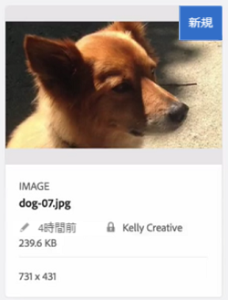
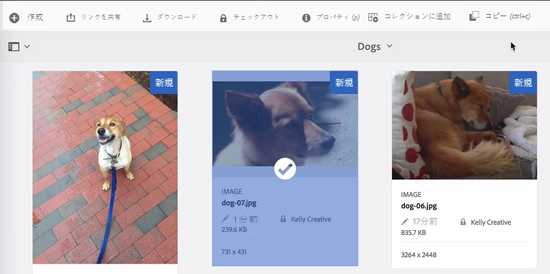
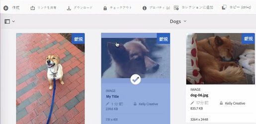

# AEM DAMのファイルのチェックインとチェックアウト {#check-in-and-check-out-files-in-assets}

Adobe Experience Manager (AEM) Assets では、編集のためにアセットをチェックアウトし、変更終了後にアセットをチェックインすることができます。アセットをチェックアウトした後は、その人だけがアセットを編集、注釈、公開、移動、削除できるようになります。アセットのチェックアウトでアセットにロックがかかることになります。他のユーザーは、アセットをAEM Assetsに再度チェックインするまで、アセットに対してこれらの操作を実行できません。 ただし、ロックされたアセットのメタデータは変更することができます。

アセットをチェックイン／チェックアウトするには、アセットへの書き込み権限が必要です。

この機能は、複数のユーザーが複数のチームにわたるワークフローの編集で共同作業をする際、ある作成者が変更した内容を他のユーザーが書き換えてしまう事態を防ぐのに役立ちます。

## アセットのチェックアウト {#checking-out-assets}

1. Assets の UI でチェックアウトしたいアセットを選択します。チェックアウトしたいアセットは複数選択することもできます。
1. ツールバーで、「チェックアウト」をクリ **[!UICONTROL ックしま]**す。
「チェッ **[!UICONTROL クアウト]** 」オプションが「チェッ **[!UICONTROL クイン]**」に切り替わります。
チェックアウトしたアセットを他のユーザーが編集できるかを確認するには、別のユーザーとしてログインします。チェックアウトしたアセットのサムネールにロック記号が表示されます。

   

   アセットを選択します。アセットを編集、注釈、公開または削除するためのオプションがツールバーに一切表示されないことを確認します。

   

   You can click **[!UICONTROL View Properties]** to edit the metadata for the locked asset.

1. 「編集」 **[!UICONTROL をクリックし]** 、アセットを編集モードで開きます。

   

1. アセットを編集して、変更内容を保存します。例えば、画像を切り抜いて保存します。

   

   アセットに注釈を付けたり公開したりすることもできます。

1. インターフェイスから編集したアセッ [!DNL Assets] トを選択し、ツールバーの「 **[!UICONTROL Checkin]** 」をクリックします。 変更されたアセットは AEM Assets にチェックインされ、他のユーザーが編集できるようになります。

## Forced check in {#forced-check-in}

管理者は他のユーザーがチェックアウトしたアセットをチェックインできます。

1. 管理者として AEM Assets にログインします。
1. Assets UI で他のユーザーにチェックアウトされているアセットを 1 つ以上選択します。

   

1. ツールバーで、「ロックを解除」を **[!UICONTROL クリックしま]**&#x200B;す。 アセットはチェックインされ、他のユーザーが編集できるようになります。

>[!MORELIKETHIS]
>
>* [AEMデスクトップアプリケーションのチェックインとチェックアウトについて理解する](https://docs.adobe.com/content/help/en/experience-manager-desktop-app/using/using.html#how-app-works2)
>* [AEM Assetsのチェックインとチェックアウトについて理解するためのビデオチュートリアル](https://docs.adobe.com/content/help/en/experience-manager-learn/assets/collaboration/checkin-checkout-technical-video-understand.html)

