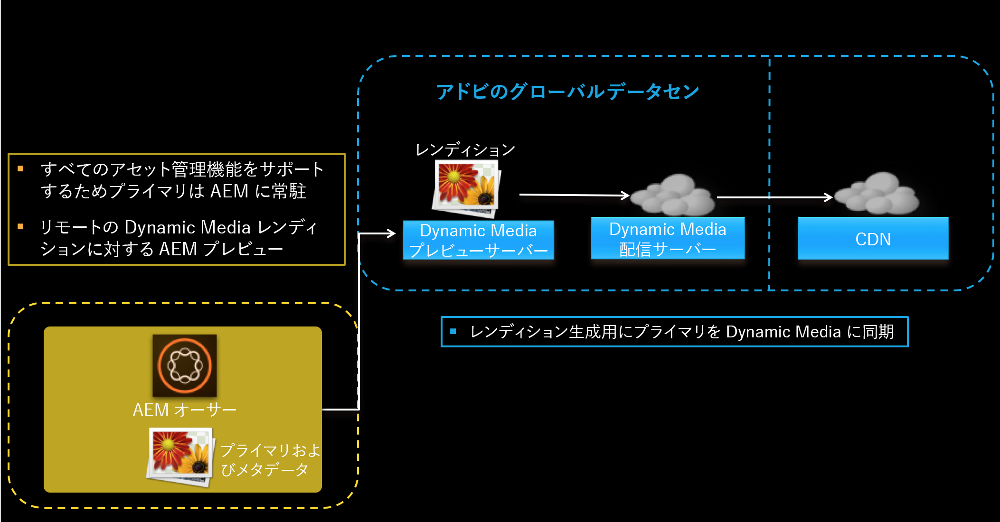
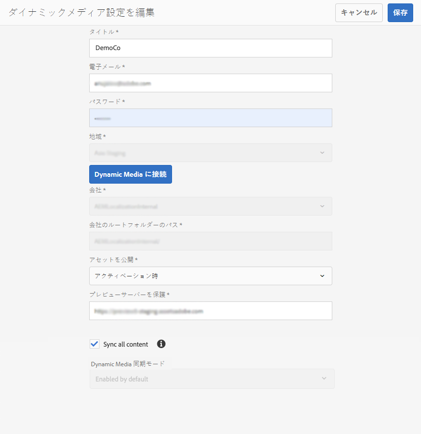
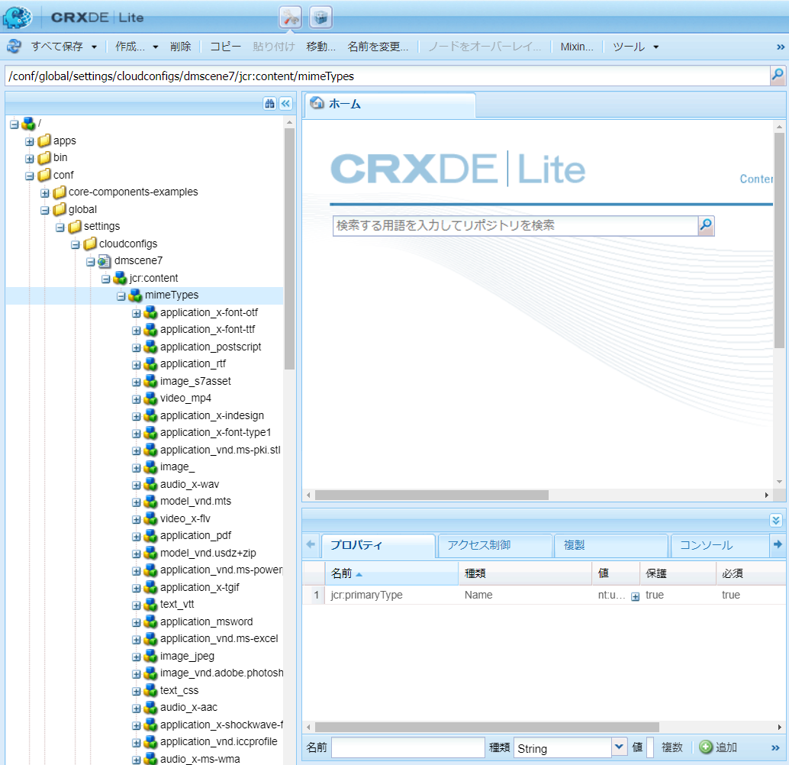
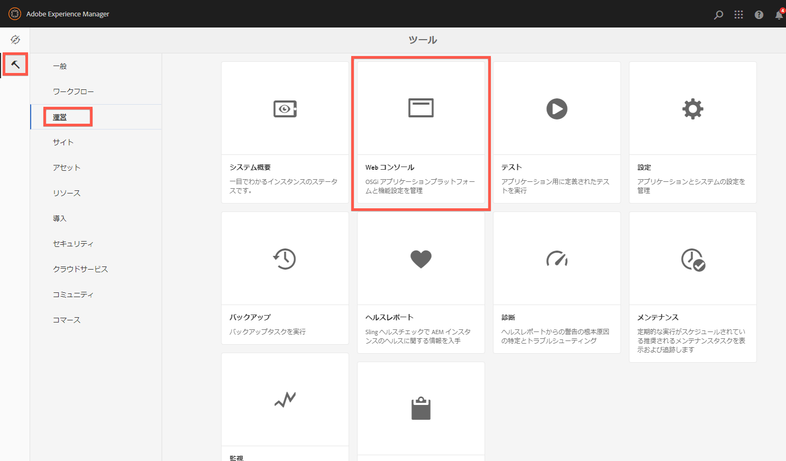
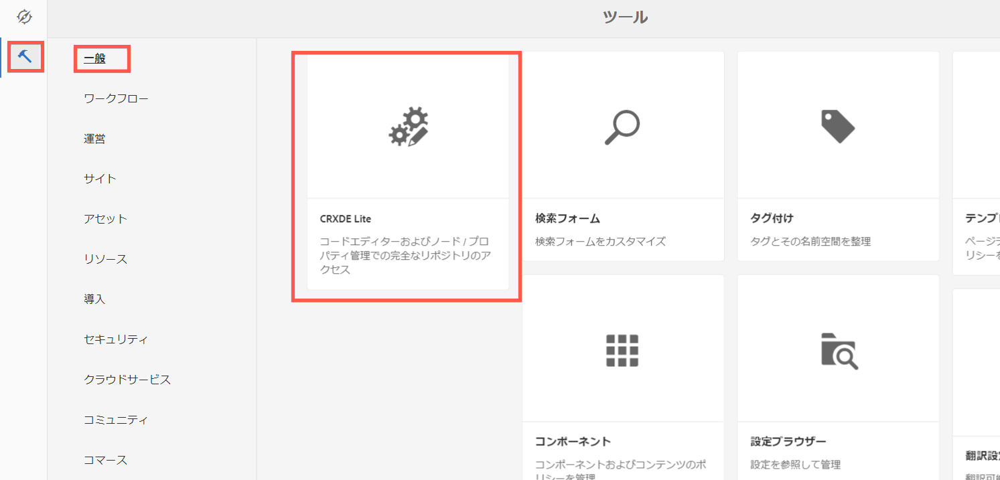
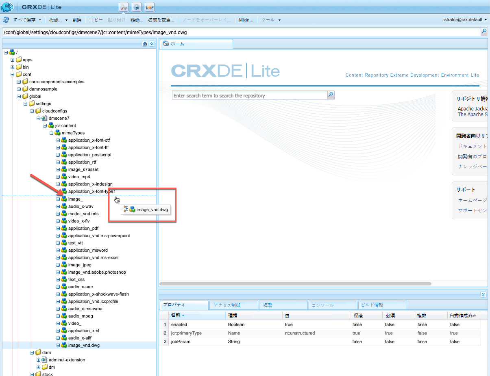
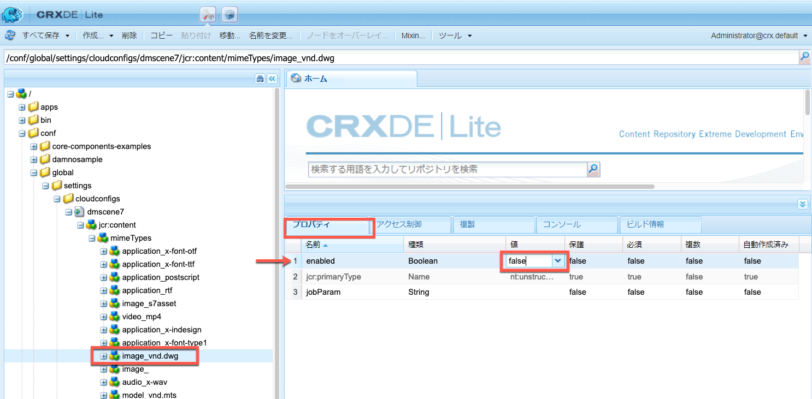
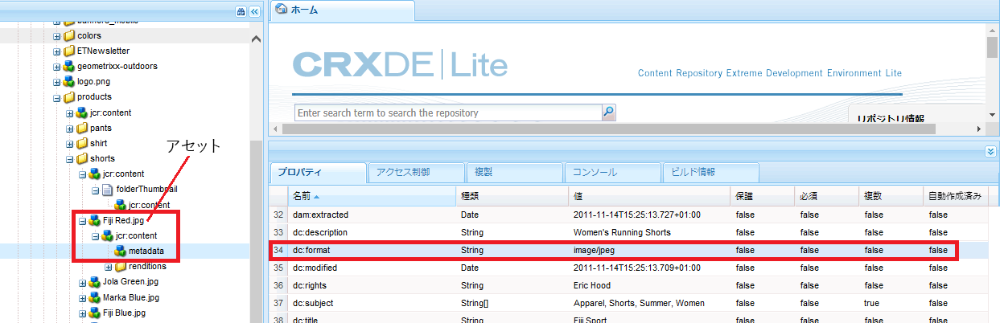

# Dynamic Media - Scene7 モードの設定{#configuring-dynamic-media-scene-mode}

開発用、ステージング用、実稼動用など、複数の異なる環境向けに Adobe Experience Manager をセットアップして使用する場合は、それぞれの環境向けに Dynamic Media Cloud Services を設定する必要があります。

## Dynamic Media - Scene7 モードのアーキテクチャ図 {#architecture-diagram-of-dynamic-media-scene-mode}

以下のアーキテクチャ図に Dynamic Media - Scene7 モードの仕組みを示します。

新しいアーキテクチャでは、AEM は、プライマリソースアセットを担当し、アセットの処理および公開のための Dynamic Media と同期します。

1. プライマリソースアセットが AEM にアップロードされると、Dynamic Media にレプリケートされます。その時点で、Dynamic Media は、ビデオエンコーディングおよび画像の動的バリアントなど、すべてのアセットの処理とレンディションの生成を扱います。  <!-- (In Dynamic Media - Scene7 mode, be aware that you can only upload assets whose file sizes are 2 GB or less.) Jira ticket CQ-4286561 fixed this issue. DM-S7 NOW SUPPORTS THE UPLOAD OF ASSETS LARGER THAN 2 GB. -->
1. レンディションが生成されると、AEM は、リモートの Dynamic Media レンディションに安全にアクセスおよびプレビューできます（バイナリは AEM インスタンスに送り返されません）。
1. コンテンツを公開および承認する準備ができると、Dynamic Media サービスがトリガーされ、コンテンツが配信サーバーにプッシュされて、CDN にコンテンツがキャッシュされます。



## Scene7 モードの Dynamic Media の有効化 {#enabling-dynamic-media-in-scene-mode}

[Dynamic Media ](https://www.adobe.com/solutions/web-experience-management/dynamic-media.html)はデフォルトで無効になっています。Dynamic Media の機能を活用するには、Dynamic Media を有効にする必要があります。

>[!NOTE]
>
>Dynamic Media-Scene7モードは、AEM作成者インスタンス専用です。 そのため、AEM発行インスタンス&#x200B;*ではなく、AEM作成者インスタンス*&#x200B;に対して`runmode=dynamicmedia_scene7`を設定する必要があります。

Dynamic Media を有効にするには、ターミナルウィンドウで次を入力することで、コマンドラインから `dynamicmedia_scene7` 実行モードを使用して AEM を開始する必要があります（例で使用しているポートは 4502）。

```shell
java -Xms4096m -Xmx4096m -Doak.queryLimitInMemory=500000 -Doak.queryLimitReads=500000 -jar cq-quickstart-6.5.0.jar -gui -r author,dynamicmedia_scene7 -p 4502
```

## （オプション）Dynamic Media のプリセットおよび設定を 6.3 から 6.5 にダウンタイムなしで移行{#optional-migrating-dynamic-media-presets-and-configurations-from-to-zero-downtime}

AEMDynamic Mediaを6.3から6.4または6.5にアップグレードする場合（ダウンタイムをゼロにする機能が含まれます）、次のcurlコマンドを実行して、CRXDE Lite内の`/etc`から`/conf`にすべてのプリセットと設定を移行する必要があります。

>[!NOTE]
>
>互換モードでAEMインスタンスを実行する場合（つまり、互換性パッケージがインストールされている場合）は、これらのコマンドを実行する必要はありません。

互換パッケージの有無を問わず、すべてのアップグレードについて、次の Linux curl コマンドを実行することにより、Dynamic Media に付属しているデフォルトの標準提供ビューアプリセットをコピーできます。

`curl -u admin:admin -X POST https://<server_address>:<server_port>/libs/settings/dam/dm/presets/viewer.pushviewerpresets.json`

`/etc`から`/conf`に作成したカスタムビューアプリセットと設定を移行するには、次のLinuxのcurlコマンドを実行します。

`curl -u admin:admin -X POST https://<server_address>:<server_port>/libs/settings/dam/dm/presets.migratedmcontent.json`

## 一括アセット移行用の機能パック18912をインストールしています{#installing-feature-pack-for-bulk-asset-migration}

機能パック18912のインストールは&#x200B;*オプション*&#x200B;です。

機能パック18912では、FTPを使用してアセットを一括インジェストするか、AEMでDynamic Media — ハイブリッドモードまたはDynamic MediaクラシックからDynamic Media-Scene7モードにアセットを移行できます。 [Adobe Professional Services](https://www.adobe.com/jp/experience-cloud/consulting-services.html)から入手できます。

詳しくは、[一括アセット移行の機能パック18912のインストール](/help/assets/bulk-ingest-migrate.md)を参照してください。

## Cloud ServicesでのDynamic Media構成の作成{#configuring-dynamic-media-cloud-services}

**Dynamic Mediaの設定を行う前に** -Dynamic Mediaの資格情報を含むプロビジョニング電子メールを受け取ったら、Dynamic Mediaクラシックに [ログ](https://www.adobe.com/jp/marketing/experience-manager/scene7-login.html) インしてパスワードを変更する必要があります。プロビジョニング電子メールで提供されたパスワードは、システムが生成したもので、一時的なパスワードです。Dynamic Media Cloud Service が正しい資格情報で設定されるように、パスワードを更新することが重要です。



**Cloud ServicesでDynamic Media設定を作成するには**

1. AEMで、AEMロゴをタップしてグローバルナビゲーションコンソールにアクセスし、ツールアイコンをタップします。次に&#x200B;**[!UICONTROL Cloud Services/Dynamic Media設定をタップします。]**
1. Dynamic Media構成ブラウザーページの左ペインで、**[!UICONTROL グローバル]**&#x200B;をタップし（**[!UICONTROL グローバル]**&#x200B;の左にあるフォルダーアイコンをタップまたは選択しない）、**[!UICONTROL 作成をタップします。]**
1. **[!UICONTROL Dynamic Media 設定を作成]**&#x200B;ページで、タイトル、Dynamic Media アカウントの電子メールアドレス、パスワードを入力し、地域を選択します。これらは、プロビジョニング電子メールでアドビから提供されます。この電子メールを受信していない場合は、サポートにお問い合わせください。

   「**[!UICONTROL Dynamic Mediaに接続]**」をクリックします。

   >[!NOTE]
   >
   >Dynamic Media の資格情報を含むプロビジョニング電子メールを受信したら、Dynamic Media Classic に[ログイン](https://www.adobe.com/marketing-cloud/experience-manager/scene7-login.html)して、パスワードを変更してください。プロビジョニング電子メールで提供されたパスワードは、システムが生成したもので、一時的なパスワードです。Dynamic Media Cloud Service が正しい資格情報で設定されるように、パスワードを更新することが重要です。

1. 接続が成功したら、次の設定を行います。 アスタリスク(*)の付いた見出しは必須です。

   * **[!UICONTROL 会社]** - Dynamic Media アカウントの名前です。異なるサブブランドや事業部、または異なるステージング／実稼動環境のために、複数の Dynamic Media アカウントを持っていることがあります。

   * **[!UICONTROL 会社のルートフォルダーのパス]**

   * **[!UICONTROL アセットの公開]** - 次の 3 つのオプションから選択できます。
      * **[!UICONTROL 即時公開]**&#x200B;とは、アセットがアップロードされると、システムがアセットを取り込み、URL／埋め込みをすぐに提供することを意味します。アセットを公開するためにユーザーが操作する必要はありません。
      * **[!UICONTROL アクティベーション時]**&#x200B;とは、URL／埋め込みリンクが提供される前に、最初にアセットを明示的に公開する必要があることを意味します。
      * **[!UICONTROL 一部の]** 公開このオプションを使用すると、Dynamic Mediaで公開するフォルダを制御でき、スマート切り抜きやダイナミックレンディションなどの機能や、プレビュー用にAEMでのみ公開するフォルダを指定できます。この同じ資産は、公共ドメインでの配信のためにDynamic Mediaでは公開され ** ていない。<br>このオプションは、 **[!UICONTROL Dynamic Mediaクラウドの]** 設定で設定できます。また、必要に応じて、フォルダーの **[!UICONTROL プロパティ]**&#x200B;内のフォルダーレベルで設定することもできます。<br>詳しくは、[Dynamic Media での選択的公開の操作を参照してください。](/help/assets/selective-publishing.md)<br>この設定を後で変更した場合、または後でフォルダーレベルで変更した場合、変更した内容は、その時点以降にアップロードする新しいアセットにのみ影響します。フォルダー内の既存のアセットの公開状態は、**[!UICONTROL クイック公開]**&#x200B;または&#x200B;**[!UICONTROL 公開を管理]**&#x200B;ダイアログボックスから手動で変更するまで、そのままになります。
   * **[!UICONTROL プレビューサーバーを保護]** - セキュアなレンディションプレビューサーバーへの URL パスを指定できます。つまり、レンディションが生成されると、AEM は、リモートの Dynamic Media レンディションに安全にアクセスしてプレビューできます（バイナリは AEM インスタンスに送り返されません）。自社のサーバーまたは特別なサーバーを使用する特別な取り決めがない限り、この設定を指定されたとおりにしておくことをお勧めします。

   * **[!UICONTROL すべてのコンテンツを同期]**  — デフォルトで <!-- NEW OPTION, CQDOC-15371, Added March 4, 2020-->選択されています。Dynamic Media との同期で、アセットを選択して含めるまたは除外する場合は、このオプションの選択を解除します。このオプションの選択を解除すると、次の 2 つの Dynamic Media 同期モードから選択できるようになります。

   * **[!UICONTROL Dynamic Media 同期モード]**
      * **[!UICONTROL デフォルトで有効]** - フォルダーを特別に除外するようにマークしない限り、設定はすべてのフォルダーにデフォルトで適用されます。<!-- you can then deselect the folders that you do not want the configuration applied to.-->
      * **[!UICONTROL デフォルトで無効]** - 選択したフォルダーを Dynamic Media と同期するように明示的にマークしない限り、設定はどのフォルダーにも適用されません。
選択したフォルダをDynamic Mediaと同期するようにマークするには、アセットフォルダを選択し、ツールバーで「**[!UICONTROL プロパティ」をクリックします。]**「**[!UICONTROL 詳細]**」タブの **[!UICONTROL Dynamic Media 同期モード]**&#x200B;ドロップダウンリストで、次の 3 つのオプションから選択します。終了したら、「**[!UICONTROL 保存」をタップします。]***注意：以前に「**すべてのコンテンツを同期**」を選択した場合、これら 3 つのオプションは使用できません。*&#x200B;関連項目：[Dynamic Media のフォルダーレベルでの選択的公開の設定。](/help/assets/selective-publishing.md)
         * **[!UICONTROL 継承]** - フォルダーに明示的な同期値はなく、代わりに、上位フォルダーの 1 つ、またはクラウド設定のデフォルトモードから同期値を継承します。継承された詳細なステータスは、ツールチップの要領で表示されます。
         * **[!UICONTROL サブフォルダーを有効にする]** - このサブツリー内のすべての項目を、Dynamic Media との同期に含めます。フォルダー固有の設定は、クラウド設定内のデフォルトモードよりも優先されます。
         * **[!UICONTROL サブフォルダーに対して無効]** - このサブツリー内のすべての項目を、Dynamic Media との同期から除外します。

   >[!NOTE]
   >
   >DMS7 ではバージョン管理はサポートされていません。また、遅延アクティベーションは、Dynamic Media 設定を編集ページの「**[!UICONTROL アセットを公開]**」が「**[!UICONTROL アクティベーション時]**」に設定されている場合にのみ、アセットが最初にアクティベートされるまでの間に限って適用されます。
   >
   >
   >アセットがアクティベートされるとすぐに、すべての更新が S7 配信にライブ公開されます。

1. 「**[!UICONTROL 保存]**」をタップします。
1. Dynamic Media コンテンツを公開する前に安全にプレビューするには、AEM オーサーインスタンスを「許可リストに登録」して、Dynamic Media に接続する必要があります。

   * Dynamic Media Classic アカウントにログインします（[http://www.adobe.com/jp/marketing-cloud/experience-manager/scene7-login.html](https://www.adobe.com/marketing-cloud/experience-manager/scene7-login.html)）。資格情報とログオンは、プロビジョニング時にアドビから付与されたものです。この情報をお持ちでない場合は、テクニカルサポートにお問い合わせください。
   * ページ右上近くのナビゲーションバーで、**[!UICONTROL 設定/アプリケーション設定/公開設定/Image Serverをクリックします。]**

   * Image Server公開ページの公開コンテキストドロップダウンリストで、「**[!UICONTROL 画像サービングをテスト」を選択します。]**
   * クライアントアドレスフィルターの場合は、**[!UICONTROL 追加.]**&#x200B;をタップします。
   * チェックボックスを選択してアドレスを有効（オン）にしてから、AEM オーサーインスタンスの IP アドレス（Dispatcher IP ではない）を入力します。
   * 「**[!UICONTROL 保存]**」をクリックします。

これで基本設定が完了しました。Dynamic Media - Scene7 モードを使用する準備が整いました。

設定をさらにカスタマイズする場合は、[（オプション）Dynamic Media - Scene7 モードでの詳細設定](#optional-configuring-advanced-settings-in-dynamic-media-scene-mode)で示す任意のタスクをオプションで実行できます。

## （オプション）Dynamic Media - Scene7 モードでの詳細設定{#optional-configuring-advanced-settings-in-dynamic-media-scene-mode}

Dynamic Media - Scene7 モードのセットアップと設定をさらにカスタマイズしたり、パフォーマンスを最適化したりする場合は、次の&#x200B;*オプション*&#x200B;タスクを 1 つまたは複数実行できます。

* [（オプション）Dynamic Media - Scene7 モードのセットアップと設定](#optional-setup-and-configuration-of-dynamic-media-scene7-mode-settings)

* [（オプション）Dynamic Media - Scene7 モードのパフォーマンスの調整](#optional-tuning-the-performance-of-dynamic-media-scene-mode)

* [（オプション）レプリケーション用のアセットのフィルタリング](#optional-filtering-assets-for-replication)

### （オプション）Dynamic Media - Scene7 モードのセットアップと設定{#optional-setup-and-configuration-of-dynamic-media-scene7-mode-settings}

実行モード `dynamicmedia_scene7` の場合、Dynamic Media Classic（Scene7）ユーザーインターフェイスを使用して Dynamic Media 設定を変更します。

上記のタスクの一部を実行するには、[http://www.adobe.com/jp/marketing-cloud/experience-manager/scene7-login.html](https://www.adobe.com/marketing-cloud/experience-manager/scene7-login.html) で Dynamic Media Classic（Scene7）にログインする必要があります。

セットアップおよび設定タスクには、次のものが含まれます。

* [Image Server の公開設定 ](#publishing-setup-for-image-server)
* [アプリケーションの一般設定の指定](#configuring-application-general-settings)
* [カラーマネジメントの設定](#configuring-color-management)
* [サポートされる形式でのMIMEタイプの編集](#editing-mime-types-for-supported-formats)
* [サポートされていない形式に対するMIME型の追加](#adding-mime-types-for-unsupported-formats)
* [画像セットおよびスピンセットを自動生成するためのバッチセットプリセットの作成](#creating-batch-set-presets-to-auto-generate-image-sets-and-spin-sets)

#### Image Server の公開設定     {#publishing-setup-for-image-server}

公開設定は、アセットがデフォルトで Dynamic Media からどのように配信されるかを決定します。設定が指定されていない場合、Dynamic Media は、公開設定で定義されたデフォルト設定に従ってアセットを配信します。例えば、解像度属性が含まれていない画像を配信するように要求した場合、画像は初期設定のオブジェクト解像度設定で配信されます。

公開設定を設定するには：dynamic mediaクラシックで、**[!UICONTROL 設定/アプリケーション設定/公開設定/Image Serverをクリックします。]**

Image Server 画面では、画像を配信するためのデフォルト設定を指定します。各設定の説明については、UI 画面を参照してください。

* **[!UICONTROL 要求属性]** - これらの設定は、サーバーから配信できる画像を制限します。
* **[!UICONTROL 初期設定の要求属性]** - これらの設定は、画像のデフォルトの表示に関係します。
* **[!UICONTROL 共通のサムネール属性]** - これらの設定は、サムネール画像のデフォルトの表示に関係します。
* **[!UICONTROL カタログフィールドの初期設定]** - これらの設定は、画像の解像度とデフォルトのサムネールの種類に関係します。
* **[!UICONTROL カラーマネジメント属性]** - これらの設定は、使用する ICC カラープロファイルを決定します。
* **[!UICONTROL 互換性の属性]** - この設定により、後方互換性の確保のためにバージョン 3.6 の場合と同様に、テキストレイヤーの先頭と末尾の段落が処理されます。
* **[!UICONTROL ローカリゼーションサポート]** - これらの設定によって、複数のロケール属性を管理します。また、ロケールマップ文字列を指定することもできます。これにより、ビューアのツールチップで使用する言語を指定できます。**[ローカリゼーションサポート]**&#x200B;の設定について詳しくは、[アセットのローカライゼーションを設定する場合の考慮事項](https://docs.adobe.com/content/help/ja-JP/dynamic-media-classic/using/intro/introduction.html)を参照してください。

#### アプリケーションの一般設定の指定 {#configuring-application-general-settings}

アプリケーションの一般設定ページを開くには、Dynamic Media Classic グローバルナビゲーションバーで、**[!UICONTROL 設定／アプリケーション設定／一般設定]**&#x200B;をクリックします。

**サーバ — **アカウントプロビジョニングを行うと、Dynamic Mediaは会社に割り当てられたサーバを自動的に提供します。 これらのサーバーは、Web サイトとアプリケーションの URL 文字列を生成するのに使用されます。これらの URL 呼び出しは、アカウントに固有です。AEM サポートによって明示的に指示されない限り、サーバー名は変更しないでください。

**[!UICONTROL 画像を上書き]** - Dynamic Media は、2 つのファイルが同じ名前を持つことを許可しません。各項目の URL ID（ファイル名から拡張子を取り除いた部分）は一意である必要があります。これらのオプションは、置き換えるアセットのアップロード方法、つまり元のアセットを置き換えるか、重複させるかを指定します。重複するアセット名には「-1」が付けられます（例えば、chair.tif は chair-1.tif に変更されます）。これらのオプションは、元のアセットとは別のフォルダーにアップロードされるアセットや、元のアセットと異なるファイル名拡張子（JPG、TIF、PNG など）を持つアセットに影響を与えます。

* **[!UICONTROL 現在のフォルダーでベース名と拡張子が同じファイルを上書き]** - このオプションは最も厳格な置換規則です。置き換え画像を元の画像と同じフォルダーにアップロードし、置き換え画像と元の画像のファイル名拡張子が同じになっている必要があります。これらの要件が満たされない場合は、重複する画像が作成されます。

>[!NOTE]
>
>AEM との一貫性を維持するには、常にこの設定（**現在のフォルダーでベース名と拡張子が同じファイルを上書き**）を選択します。

* **[!UICONTROL 任意のフォルダーでベース名と拡張子が同じファイルを上書き]** - 置き換え画像と元の画像のファイル名拡張子は同じになっている必要があります（例えば、chair.jpg は chair.jpg で置き換えられますが、chair.tif では置き換えられません）。ただし、置き換え画像を、元の画像と別のフォルダーにアップロードできます。更新された画像は新しいフォルダーにあり、元の場所のファイルはなくなります
* **[!UICONTROL 任意のフォルダーでベース名が同じファイルを上書き]** - このオプションは最も包括的な置換規則です。置き換え画像を、元の画像と別のフォルダーにアップロードでき、ファイル名拡張子が異なるファイルをアップロードして、元のファイルと置き換えることができます。元のファイルが別のフォルダーにある場合、置き換え画像は、アップロード先の新しいフォルダーに存在します。

**[!UICONTROL 初期設定のカラープロファイル]** - 詳細については、[カラーマネジメントの設定](#configuring-color-management)を参照してください。

>[!NOTE]
>
>デフォルトでは、アセットの詳細表示で「**[!UICONTROL レンディション]**」を選択した場合 15 個のレンディションが表示され、「**[!UICONTROL ビューア]**」を選択した場合 15 個のビューアプリセットが表示されます。この制限は増やすことができます。詳しくは、[表示する画像プリセットの数の増加](/help/assets/managing-image-presets.md#increasing-or-decreasing-the-number-of-image-presets-that-display)または[表示するビューアプリセットの数の増加](/help/assets/managing-viewer-presets.md#increasing-the-number-of-viewer-presets-that-display)を参照してください。


#### カラーマネジメントの設定 {#configuring-color-management}

Dynamic Media カラーマネジメントを使用すると、アセットをカラー補正できます。カラー補正により、取り込まれたアセットは、カラースペース（RGB、CMYK、グレー）および埋め込みカラープロファイルを維持します。動的レンディションを要求した場合、画像の色は、CMYK、RGB またはグレー出力を使用するターゲットのカラースペースに補正されます。[画像プリセットの設定](/help/assets/managing-image-presets.md)を参照してください。

画像を要求する際にカラー補正を有効にするためのデフォルトのカラープロパティを設定するには：

1. プロビジョニング中に提供された資格情報を使用して、[Dynamic Media Classic にログイン](https://www.adobe.com/marketing-cloud/experience-manager/scene7-login.html)します。**[!UICONTROL Setup/Application Setupに移動します。]**
1. 「**[!UICONTROL 公開設定]**」領域を展開して、「**[!UICONTROL Image Server」を選択します。]**&#x200B;パブリッシュインスタンスのデフォルトを設定する際に、「**[!UICONTROL 公開コンテキスト]**」を「**[!UICONTROL 画像サービング]**」に設定します。
1. 例えば「**[!UICONTROL カラーマネジメント属性]**」領域のプロパティなど、変更が必要なプロパティにスクロールします。

   次のカラー補正プロパティを設定できます。

   * **[!UICONTROL CMYK のデフォルトカラースペース]** - デフォルトの CMYK カラープロファイルの名前
   * **[!UICONTROL グレースケールのデフォルトカラースペース]** - デフォルトのグレーカラープロファイルの名前
   * **[!UICONTROL RGB のデフォルトカラースペース]** - デフォルトの RGB カラープロファイルの名前
   * **[!UICONTROL カラー変換レンダリングの方法]** - レンダリング方法を指定します。指定できる値は、**[!UICONTROL 知覚的]**、**[!UICONTROL 相対的な色域を維持]**、**[!UICONTROL 彩度]**、**[!UICONTROL 絶対的な色域を維持です。]**&#x200B;アドビでは、デフォルトとして&#x200B;**[!UICONTROL 相対]**&#x200B;をお勧めします。

1. 「**[!UICONTROL 保存]**」をタップします。

例えば、**[!UICONTROL RGB の初期設定カラースペース]**&#x200B;を *sRGB* に、**[!UICONTROL CMYK の初期設定カラースペース]**&#x200B;を *WebCoated* に設定できます。

それには、次のようにします。

* RGB および CMYK 画像のカラー補正を有効にします。
* カラープロファイルを持たない RGB 画像は、*sRGB* カラースペースと見なされます。
* カラープロファイルを持たない CMYK 画像は、*WebCoated* カラースペースと見なされます。
* RGB 出力を返す動的レンディションは、RGB 出力を sRGB カラースペースで返します。
* CMYK 出力を返す動的レンディションは、CMYK 出力を *WebCoated* カラースペースで返します。

#### サポートされる形式のMIMEタイプの編集{#editing-mime-types-for-supported-formats}

Dynamic Media によって処理されるアセットタイプを定義して、高度なアセット処理パラメーターをカスタマイズできます。例えば、アセット処理パラメーターを指定して次のことができます。

* Adobe PDF を eCatalog アセットに変換する。
* Adobe Photoshop ドキュメント（.PSD）をパーソナライズ用のバナーテンプレートアセットに変換する。
* Adobe Illustrator ファイル（.AI）または Adobe Photoshop Encapsulated Postscript ファイル（.EPS）をラスタライズする。
* [ビデオ](/help/assets/video-profiles.md) プロファイルと [](/help/assets/image-profiles.md) イメージングプロファイルは、それぞれビデオおよび画像の処理を定義するために使用できます。

[アセットのアップロード](/help/assets/manage-assets.md#uploading-assets)を参照してください。

**サポートされる形式のMIMEタイプを編集するには**

1. AEMで、AEMロゴをクリックしてグローバルナビゲーションコンソールにアクセスし、**[!UICONTROL ツール/一般/CRXDE Liteをクリックします。]**
1. 左側のレールで、次の場所に移動します。

   `/conf/global/settings/cloudconfigs/dmscene7/jcr:content/mimeTypes`

   

1. mimeTypes フォルダーで、MIME タイプを選択します。
1. CRXDE Lite ページの右側の下部で、次の操作をおこないます。

   * 「**[!UICONTROL 有効]**」フィールドをダブルクリックします。デフォルトでは、すべてのアセットの MIME タイプが有効になって（**[!UICONTROL true]** に設定されて）います。これは、処理に関してアセットが Dynamic Media に同期されることを意味します。このアセットのMIMEタイプを処理から除外する場合は、この設定を&#x200B;**[!UICONTROL falseに変更します。]**

   * **[!UICONTROL jobParam]** をダブルクリックして、関連するテキストフィールドを開きます。特定の MIME タイプに使用可能な、許可されている処理パラメーター値のリストについては、[サポートされる MIME タイプ](/help/assets/assets-formats.md#supported-mime-types)を参照してください。

1. 次のいずれかの操作をおこないます。

   * 手順 3～4 を繰り返して、その他の MIME タイプを編集します。
   * CRXDE Lite ページのメニューバーで、「**[!UICONTROL すべて保存]**」をクリックします。

1. ページの左上隅で、「**[!UICONTROL CRXDE Lite]**」をタップして AEM に戻ります。

#### サポートされていない形式に対するMIMEタイプの追加{#adding-mime-types-for-unsupported-formats}

AEM Assets でサポートされていない形式のカスタム MIME タイプを追加できます。CRXDE Liteに追加した新しいノードがAEMによって削除されないようにするには、`image_`の前にMIMEタイプを移動し、有効な値を&#x200B;**[!UICONTROL falseに設定する必要があります。]**

**サポートされていない形式にMIMEタイプを追加するには**

1. AEM で、**[!UICONTROL ツール／運営／Web コンソール]**&#x200B;をタップします。

   

1. 新しいブラウザータブが開き、**[!UICONTROL Adobe Experience Manager Web コンソール設定]**&#x200B;ページが表示されます。

   

1. ページ上で、*Adobe CQ Scene7 Asset MIME type Service* という名前まで下にスクロールします。次のスクリーンショットを参照してください。名前の右側にある&#x200B;**[!UICONTROL 設定値を編集]**（鉛筆アイコン）をタップします。

   

1. **Adobe CQ Scene7 Asset MIME type Service** ページで、任意のプラス記号アイコン「+」をクリックします。新しい MIME タイプを追加する場合にクリックする、プラス記号のテーブルの場所はすぐわかります。

   

1. 空のテキストフィールドに追加した `DWG=image/vnd.dwg` を入力します。

   この `DWG=image/vnd.dwg` 例は、説明の目的でのみ使用します。ここで追加する MIME タイプは、その他のサポートされていない形式でもかまいません。

   

1. ページ右下隅の「**[!UICONTROL 保存」をタップします。]**

   この時点で、Adobe Experience Manager Web コンソール設定ページが開いているブラウザータブを閉じることができます。

1. AEM コンソールを開いているブラウザータブに戻ります。
1. AEMから、**[!UICONTROL ツール/一般/CRXDE Liteをタップします。]**

   

1. 左側のレールで、次の場所に移動します。

   `conf/global/settings/cloudconfigs/dmscene7/jcr:content/mimeTypes`

1. `image_vnd.dwg` MIME タイプをドラッグし、次のスクリーンショットに示すように、ツリー内の `image_` の上にドロップします。

   

1. MIME タイプ `image_vnd.dwg` を選択したまま、「**[!UICONTROL プロパティ]**」タブの&#x200B;**[!UICONTROL 有効]**&#x200B;行の&#x200B;**[!UICONTROL 値]**&#x200B;列見出しの値をダブルクリックして、「**[!UICONTROL 値]**」ドロップダウンリストを開きます。
1. フィールドに `false` と入力します（または、ドロップダウンリストから「**[!UICONTROL false]**」を選択します）。

   

1. CRXDE Liteページの左上隅近くにある「**[!UICONTROL すべて保存]**」をクリックします。

#### 画像セットおよびスピンセットを自動生成するためのバッチセットプリセットの作成 {#creating-batch-set-presets-to-auto-generate-image-sets-and-spin-sets}

アセットを Dynamic Media にアップロードしながら画像セットやスピンセットを自動作成するには、バッチセットプリセットを使用します。

最初に、アセットをセットにグループ化するための命名規則を定義します。次に、バッチセットプリセットを作成できます。このプリセットは、プリセット手法で定義された命名規則に一致する画像を使用してセットの構成方法を定義する、固有の名前を持つ自己完結した命令のセットです。

ファイルをアップロードする際に、Dynamic Media によって、アクティブプリセット内の定義された命名規則に一致するすべてのファイルのセットが自動的に作成されます。

**デフォルトの命名規則の設定**

バッチセットプリセット手法で使用するデフォルトの命名規則を作成します。バッチセットプリセット定義で選択されたデフォルトの命名規則は、セットをバッチ生成するための会社の要件になる場合があります。バッチセットプリセットは、定義するデフォルトの命名規則を使用するために作成されます。会社が定義するデフォルトの命名規則に例外がある場合のために、特定のコンテンツのセットに必要な代替のカスタム命名規則を含むバッチセットプリセットを、必要なだけいくつでも作成できます。

デフォルトの命名規則を設定しなくてもバッチセットプリセット機能を使用できますが、バッチセット生成を効率化できるように、デフォルトの命名規則を使用して、セットにグループ化する命名規則の要素を必要なだけ定義することをお勧めします。

または、フォームフィールドを利用しないで、「**[!UICONTROL コードを表示]**」を使用することもできます。この表示では、正規表現を使用する命名規則の定義を作成します。

定義には、一致とベース名という 2 つの要素を使用できます。これらのフィールドでは、命名規則のすべての要素を定義して、要素が含まれるセットを命名するために使用される規則の一部を指定できます。会社の個別の命名規則では、これらの各要素について 1 つまたは複数の定義行を使用できます。独自の定義行を必要なだけ使用して、メイン画像、カラー要素、代替表示要素およびスウォッチ要素などの個別の要素にグループ化できます。

**デフォルトの命名規則を設定するには：**

1. Dynamic Media Classic（Scene7）アカウントにログインします（[http://www.adobe.com/jp/marketing-cloud/experience-manager/scene7-login.html](https://www.adobe.com/marketing-cloud/experience-manager/scene7-login.html)）。

   資格情報とログオンは、プロビジョニング時にアドビから付与されたものです。この情報をお持ちでない場合は、テクニカルサポートにお問い合わせください。

1. ページ上部近くのナビゲーションバーで、**[!UICONTROL 設定/アプリケーション設定/バッチセットプリセット/初期設定の名前をタップします。]**
1. 「**[!UICONTROL フォームを表示]**」または「**[!UICONTROL コードを表示]**」を選択し、各要素に関する情報の表示と入力の方法を指定します。

   「**[!UICONTROL コードを表示]**」チェックボックスを選択して、選択した形式と同時に作成される正規表現値を表示できます。フォーム表示により制限を受ける場合、命名規則の要素を定義するために正規表現値を入力または変更できます。値をフォーム表示で解析できない場合は、フォームフィールドは非アクティブになります。

   >[!NOTE]
   >
   >非アクティブなフォームフィールドは、正規表現の正誤に関する検証を実行しません。「結果」行で各要素に作成する正規表現の結果を確認できます。完全な正規表現は、ページの一番下に表示されます。

1. 必要に応じて各要素を展開し、使用する命名規則を入力します。
1. 必要に応じて、次の操作をおこないます。

   * 別の命名規則を要素に追加するには、「**[!UICONTROL 追加]**」をタップします。
   * 要素の命名規則を削除するには、「**[!UICONTROL 削除]**」をタップします。

1. 次のいずれかの操作をおこないます。

   * 「**[!UICONTROL 名前を付けて保存]**」をタップし、プリセットの名前を入力します。
   * 既存のプリセットを編集している場合は、「**[!UICONTROL 保存]**」をタップします。

**バッチセットプリセットの作成**

Dynamic Media では、バッチセットプリセットを使用して、アセットをビューアで表示するための画像のセット（代替画像、カラーオプション、360 スピン）に整理します。バッチセットプリセットは、Dynamic Media でのアセットアップロード処理と同時に自動的に実行されます。

バッチセットプリセットを作成、編集および管理できます。バッチセットプリセット定義には 2 つの形式があります。既に設定したデフォルトの命名規則のものと、その場で作成するカスタムの命名規則のものです。

バッチセットプリセットを定義するフォームフィールドメソッドとコードメソッドのどちらかを使用できます（正規表現を使用できます）。デフォルトの名前では、「フォームを表示」での定義と同時に「コードを表示」を選択して、正規表現を使用して定義を作成できます。また、どちらかの表示をオフにして、一方の表示のみを使用することもできます。

**バッチセットプリセットを作成するには：**

1. Dynamic Media Classic（Scene7）アカウントにログインします（[http://www.adobe.com/jp/marketing-cloud/experience-manager/scene7-login.html](https://www.adobe.com/marketing-cloud/experience-manager/scene7-login.html)）。

   資格情報とログオンは、プロビジョニング時にアドビから付与されたものです。この情報をお持ちでない場合は、テクニカルサポートにお問い合わせください。

1. ページ上部近くのナビゲーションバーで、**[!UICONTROL 設定/アプリケーション設定/バッチセットプリセット/バッチセットプリセットをタップします。]**

   詳細ページの右上隅に設定されている「**[!UICONTROL フォームを表示]**」は、デフォルトの表示です。

1. プリセットリストパネルの「**[!UICONTROL 追加]**」をタップして、画面の右側にある詳細パネルの定義フィールドをアクティブにします。
1. 詳細パネルの「プリセット名」フィールドに、プリセットの名前を入力します。
1. 「バッチセットの種類」ドロップダウンメニューで、プリセットの種類を選択します。
1. 次のいずれかの操作をおこないます。

   * 以前に&#x200B;**[!UICONTROL アプリケーション設定/バッチセットプリセット/初期設定の名前]**&#x200B;で設定した初期設定の命名規則を使用する場合は、**[!UICONTROL アセットの命名規則]**&#x200B;を展開し、「ファイル名」ドロップダウンリストで「**[!UICONTROL 初期設定]**」をタップします。

   * プリセットの設定時に新しい命名規則を定義するには、「**[!UICONTROL アセットの命名規則]**」を展開し、「ファイル名」ドロップダウンリストで「**[!UICONTROL カスタム。]**」をクリックします。

1. 「シーケンスの順番」では、Dynamic Media でグループ化されたセットの画像の表示順を定義します。

   デフォルトでは、アセットはアルファベット順に並んでいます。ただし、コンマ区切りの正規表現リストを使用して順番を定義できます。

1. 命名規則と作成オプションの設定では、アセットの命名規則で定義したベース名にサフィックスとプレフィックスを指定します。また、Dynamic Media のフォルダー構造内のセットの作成場所を定義します。

   大量のセットを定義する場合は、アセット自体を含むフォルダーとは別にセットを保存することをお勧めします。例えば、画像セットフォルダーを作成して、そこに生成されたセットを配置できます。

1. 詳細パネルで、「**[!UICONTROL 保存]**」をタップします。
1. 新しいプリセット名の隣にある「**[!UICONTROL アクティブ]**」をタップします。

   プリセットをアクティブにすると、アセットを Dynamic Media にアップロードする際に、バッチセットプリセットを適用してセットを生成できます。

**2D スピンセットを自動生成するためのバッチセットプリセットの作成**

バッチセットの種類の&#x200B;**[!UICONTROL 多軸スピンセット]**&#x200B;を使用して、2D スピンセットの生成を自動化する手法を作成できます。画像のグループ化では行と列の正規表現を使用するので、画像アセットが多次元の配列の対応する場所に正しく配置されます。多軸スピンセットの行数または列数には、上限または下限はありません。

例として、`spin-2dspin` という名前の多軸スピンセットを作成します。1 行あたり 12 個の画像が含まれる 3 行のスピンセット画像セットがあります。画像の名前は次のとおりです。

```
spin-01-01
 spin-01-02
 …
 spin-01-12
 spin-02-01
 …
 spin-03-12
```

これらの情報から、このバッチセットの種類の手法は次のように指定して作成できます。


スピンセットのアセット名における共通部分のグループは、（ハイライト表示されているように）「**一致**」フィールドに追加しています。行と列を含むアセット名の可変部分は、それぞれ「**行**」フィールドと「**列**」フィールドに追加しています。

このスピンセットをアップロードして公開する際に、**アップロードオプションを設定**&#x200B;ダイアログボックスの&#x200B;**バッチセットプリセット**&#x200B;の下に表示される 2D スピンセット手法の名前をアクティブ化します。

**2D スピンセットを自動生成するためのバッチセットプリセットを作成するには：**

1. Dynamic Media Classic（Scene7）アカウントにログインします（[http://www.adobe.com/jp/marketing-cloud/experience-manager/scene7-login.html](https://www.adobe.com/marketing-cloud/experience-manager/scene7-login.html)）。

   資格情報とログオンは、プロビジョニング時にアドビから付与されたものです。この情報をお持ちでない場合は、テクニカルサポートにお問い合わせください。

1. ページ上部近くのナビゲーションバーで、**[!UICONTROL 設定]/[!UICONTROL アプリケーション設定]/[!UICONTROL バッチセットプリセット]/[!UICONTROL バッチセットプリセット]**&#x200B;をクリックします。

   詳細ページの右上隅に設定されている「**[!UICONTROL フォームを表示]**」は、デフォルトの表示です。

1. プリセットリストパネルの「**[!UICONTROL 追加]**」をクリックして、画面の右側にある詳細パネルの定義フィールドをアクティブにします。
1. 詳細パネルの「プリセット名」フィールドに、プリセットの名前を入力します。
1. 「バッチセットの種類」ドロップダウンメニューで、「**[!UICONTROL アセットセット」を選択します。]**
1. 「サブタイプ」ドロップダウンリストで、「**[!UICONTROL 多軸スピンセット」を選択します。]**
1. 「**[!UICONTROL アセットの命名規則]**」を展開し、「ファイル名」ドロップダウンリストで「**[!UICONTROL カスタム」をクリックします。]**
1. 「**[!UICONTROL 一致]**」およびオプションとして「**[!UICONTROL ベース名]**」の属性を使用して、グループを構成する画像アセットの命名に使用する正規表現を定義します。

   リテラル一致正規表現の例を次に示します。

   `(w+)-w+-w+`

1. 「**[!UICONTROL 行と列の位置]**」を展開し、2D スピンセット配列内の画像アセットの位置の名前形式を定義します。

   ファイル名内での行または列の位置は丸括弧で囲みます。

   行の正規表現の例を次に示します。

   `\w+-R([0-9]+)-\w+`

   または

   `\w+-(\d+)-\w+`

   列の正規表現の例を次に示します。

   `\w+-\w+-C([0-9]+)`

   または

   `\w+-\w+-C(\d+)`

   これらは例に過ぎません。必要に応じて独自の正規表現を作成できます。

   >[!NOTE]
   >
   >行と列の正規表現の組み合わせから、多次元スピンセットの配列内でアセットの位置を特定できない場合、そのアセットはセットに追加されず、エラーが記録されます。

1. 命名規則と作成オプションの設定では、アセットの命名規則で定義したベース名にサフィックスとプレフィックスを指定します。

   また、Dynamic Media Classic のフォルダー構造内のスピンセットの作成場所を定義します。

   大量のセットを定義する場合は、アセット自体を含むフォルダーとは別にセットを保存することをお勧めします。例えば、スピンセットフォルダーを作成して、そこに生成されたセットを配置します。

1. 詳細パネルで、「**[!UICONTROL 保存]**」をクリックします。
1. 新しいプリセット名の隣にある「**[!UICONTROL アクティブ]**」をクリックします。

   プリセットをアクティブにすると、アセットを Dynamic Media にアップロードする際に、バッチセットプリセットを適用してセットを生成できます。

### （オプション）Dynamic Media - Scene7 モードのパフォーマンスの調整  {#optional-tuning-the-performance-of-dynamic-media-scene-mode}

Dynamic Media-Scene7モードをスムーズに動作させるため、Adobeでは、次の同期パフォーマンス/スケーラビリティの最適な調整のヒントを推奨します。

* 様々なファイル形式の処理に対応する定義済みのジョブパラメーターを更新する。
* 事前定義済みの Granite のワークフロー（ビデオアセット）キューワーカースレッドを更新する。
* Granite の事前定義済みの一時的なワークフロー（画像および非ビデオアセット）キューワーカースレッドを更新する。
* Dynamic Media Classic サーバーへの最大アップロード接続数を更新する。

#### 様々なファイル形式の処理に対応する定義済みのジョブパラメーターを更新する

ジョブパラメータを調整して、ファイルアップロード時の処理を高速化できます。例えば、PSD ファイルをアップロードするものの、テンプレートとして処理しない場合は、レイヤー抽出を false（オフ）に設定できます。このような場合、調整されたジョブパラメータは `process=None&createTemplate=false` と表示されます。

PDF ファイル、Postscript ファイル、PSD ファイルには、以下の「調整済み」ジョブパラメーターを使用することをお勧めします。

<!-- OLD PDF JOB PARAMETERS `pdfprocess=Rasterize&resolution=150&colorspace=Auto&pdfbrochure=false&keywords=false&links=false` -->

<!-- OLD POSTSCRIPT JOB PARAMETERS `psprocess=Rasterize&psresolution=150&pscolorspace=Auto&psalpha=false&psextractsearchwords=false&aiprocess=Rasterize&airesolution=150&aicolorspace=Auto&aialpha=false` -->

| ファイルタイプ | 推奨されるジョブパラメーター |
| ---| ---|
| PDF | `pdfprocess=Thumbnail&resolution=150&colorspace=Auto&pdfbrochure=false&keywords=false&links=false` |
| Postscript | `psprocess=Rasterize&psresolution=150&pscolorspace=Auto&psalpha=false&psextractsearchwords=false&aiprocess=Thumbnail&airesolution=150&aicolorspace=Auto&aialpha=false` |
| PSD | `process=None&layerNaming=Layername&anchor=Center&createTemplate=false&extractText=false&extendLayers=false` |

これらのパラメーターのいずれかを更新するには、[MIME タイプベースの Assets／Dynamic Media Classic アップロードジョブパラメーターサポートの有効化](#enabling-mime-type-based-assets-scene-upload-job-parameter-support)の手順に従います。

#### Granite一時ワークフローキューの更新{#updating-the-granite-transient-workflow-queue}

Granite の一時的なワークフローキューは、**[!UICONTROL DAM アセットの更新]**&#x200B;ワークフローに使用されます。Dynamic Media では、画像の取り込みおよび処理に使用されます。

**Granite一時ワークフローキューを更新するには**

1. [https://&lt;server>/system/console/configMgr](https://localhost:4502/system/console/configMgr) に移動して、**Queue: Granite Transient Workflow Queue** を検索します。

   >[!NOTE]
   >
   >OSGi PID は動的に生成されるので、ダイレクト URL ではなく、テキスト検索が必要です。

1. 「**[!UICONTROL Maximum Parallel Jobs]**」フィールドで、目的の値に数値を変更します。

   **[!UICONTROL 並列ジョブの最大数]**&#x200B;を増やすと、Dynamic Mediaへのファイルの大量アップロードを適切にサポートできます。 正確な値は、ハードウェア容量に依存します。 初期移行または1回限りのバルクアップロードなど、特定のシナリオでは、大きな値を使用できます。 ただし、大きな値（コア数の2倍など）を使用すると、他の同時アクティビティに悪影響を及ぼす可能性があることに注意してください。 そのため、特定の使用事例に基づいて値をテストし、調整する必要があります。

<!--    By default, the maximum number of parallel jobs depends on the number of available CPU cores. For example, on a 4-core server, it assigns 2 worker threads. (A value between 0.0 and 1.0 is ratio based, or any numbers greater than 1 will assign the number of worker threads.)

   Adobe recommends that 32 **[!UICONTROL Maximum Parallel Jobs]** be configured to adequately support heavy upload of files to Dynamic Media Classic (Scene7). -->


1. 「**[!UICONTROL 保存]**」をタップします。

#### Graniteワークフローキューの更新{#updating-the-granite-workflow-queue}

Granite のワークフローキューは、一時的でないワークフローに使用されます。Dynamic Media では、**[!UICONTROL Dynamic Media エンコーディングビデオ]**&#x200B;ワークフローでビデオを処理するために使用されます。

**Graniteワークフローキューを更新するには**

1. `https://<server>/system/console/configMgr` に移動して、**Queue: Granite Workflow Queue** を検索します。

   >[!NOTE]
   >
   >OSGi PID は動的に生成されるので、ダイレクト URL ではなく、テキスト検索が必要です。

1. 「**[!UICONTROL Maximum Parallel Jobs]**」フィールドで、目的の値に数値を変更します。

   「並列ジョブの最大数」を増やすと、ファイルのDynamic Mediaへの大量アップロードを適切にサポートできます。 正確な値は、ハードウェア容量に依存します。 初期移行または1回限りのバルクアップロードなど、特定のシナリオでは、大きな値を使用できます。 ただし、大きな値（コア数の2倍など）を使用すると、他の同時アクティビティに悪影響を及ぼす可能性があることに注意してください。 そのため、特定の使用事例に基づいて値をテストし、調整する必要があります。

   

1. 「**[!UICONTROL 保存]**」をタップします。

#### Dynamic Mediaクラシックアップロード接続の更新{#updating-the-scene-upload-connection}

Scene7 アップロード接続の設定は、AEM Assets を Dynamic Media Classic サーバーと同期します。

**Dynamic Mediaクラシックアップロード接続を更新するには**

1. `https://<server>/system/console/configMgr/com.day.cq.dam.scene7.impl.Scene7UploadServiceImpl` に移動します。
1. 「**[!UICONTROL Number of connections]**」フィールドおよび「**[!UICONTROL Active job timeout]**」フィールドで、必要に応じて数値を変更します。

   「**[!UICONTROL Number of connections]**」設定は、AEM が Dynamic Media へのアップロードで許可される HTTP 接続の最大数を制御します。通常、事前定義済みの値の 10 接続で十分です。

   「**[!UICONTROL Active job timeout]**」設定は、アップロードされた Dynamic Media アセットが配信サーバーで公開されるまでの待機時間を決定します。デフォルトでは、この値は 2100 秒または 35 分です。

   ほとんどの事例では、2100 の設定で十分です。

   

1. 「**[!UICONTROL 保存]**」をタップします。

### （オプション）レプリケーション用のアセットのフィルタリング{#optional-filtering-assets-for-replication}

Dynamic Media以外のデプロイメントでは、AEM作成者環境からAEM発行ノードに、*すべての*&#x200B;アセット（画像とビデオの両方）を複製します。 AEMパブリッシュサーバーもアセットを配信するので、このワークフローが必要です。

ただし、Dynamic Mediaのデプロイメントでは、アセットはクラウドサービスを介して配信されるので、AEM発行ノードに同じアセットを複製する必要はありません。 このような「ハイブリッドパブリッシング」ワークフローは、アセットの複製に伴うストレージの余分なコストと処理時間を回避します。 サイトページなどのその他のコンテンツは、引き続き AEM パブリッシュノードから配信されます。

フィルターによって、アセットを AEM パブリッシュノードへのレプリケート対象から&#x200B;**&#x200B;除外することができます。

#### レプリケーションへのデフォルトのアセットフィルターの使用 {#using-default-asset-filters-for-replication}

画像処理やビデオ処理にDynamic Mediaを使用している場合は、デフォルトのフィルターをそのまま使用できます。 次のフィルターがデフォルトでアクティブです。

<table>
 <tbody>
  <tr>
   <td> </td>
   <td><strong>フィルター</strong></td>
   <td><strong>MIME タイプ</strong></td>
   <td><strong>レンディション</strong></td>
  </tr>
  <tr>
   <td>ダイナミックメディア画像配信</td>
   <td><p>filter-images</p> <p>filter-sets</p> <p> </p> </td>
   <td><p><strong>image/</strong> で始まる</p> <p><strong>application/</strong> を含み、<strong>set</strong> で終わる</p> </td>
   <td>標準提供の「filter-images」（インタラクティブな画像などの単一の画像アセットに適用）および「filter-sets」（スピンセット、画像セット、混在メディアセットおよびカルーセルセット）では、次のようになります。
    <ul>
     <li>オリジナル画像と静的画像レンディションがレプリケーションから除外されます。</li>
    </ul> </td>
  </tr>
  <tr>
   <td>ダイナミックメディアビデオ配信</td>
   <td>filter-video</td>
   <td><strong>video/</strong> で始まる</td>
   <td>標準提供の「filter-video」では、次のようになります。
    <ul>
     <li>元のビデオと静的なサムネールレンディションを複製から除外します。<br /> <br /> </li>
    </ul> </td>
  </tr>
 </tbody>
</table>

>[!NOTE]
>
>フィルターは、MIME タイプに適用され、パス用にはできません。

#### レプリケーション用のアセットフィルターのカスタマイズ  {#customizing-asset-filters-for-replication}

1. AEMで、AEMロゴをタップしてグローバルナビゲーションコンソールにアクセスし、**[!UICONTROL ツール/一般/CRXDE Liteをタップします。]**
1. 左のフォルダーツリーで、`/etc/replication/agents.author/publish/jcr:content/damRenditionFilters`に移動してフィルターを確認します。

   

1. フィルターの MIME タイプを定義するために、次のように MIME タイプを特定することができます。

   左側のレールで`content > dam > <locate_your_asset> > jcr:content > metadata`を展開し、テーブルで`dc:format`を探します。

   次の図は、`dc:format`へのアセットのパスの例です。

   

   アセット`Fiji Red.jpg`の`dc:format`は`image/jpeg`です。

   このフィルターをすべての画像に適用するには、その形式に関係なく、値を`image/*`に設定します。`*`は、任意の形式のすべての画像に適用される正規式です。

   JPEG形式の画像にのみフィルターを適用するには、`image/jpeg`の値を入力します。

1. レプリケーションに含めるレンディションまたは除外するレンディションを定義します。

   レプリケーション用のフィルターに使用できる文字は次のとおりです。

<table>
 <tbody>
  <tr>
   <td><strong>使用する文字</strong></td>
   <td><strong>レプリケーション用のアセットのフィルター方法</strong></td>
  </tr>
  <tr>
   <td>*</td>
   <td>ワイルドカード文字<br /> </td>
  </tr>
  <tr>
   <td>+</td>
   <td>レプリケーション用にアセットを含める</td>
  </tr>
  <tr>
   <td>-</td>
   <td>レプリケーションからアセットを除外する</td>
  </tr>
 </tbody>
</table>

`content/dam/<locate your asset>/jcr:content/renditions` に移動します。

次の図は、あるアセットのレンディションの例を示しています。


オリジナルを複製したい場合は、`+original`と入力します。

