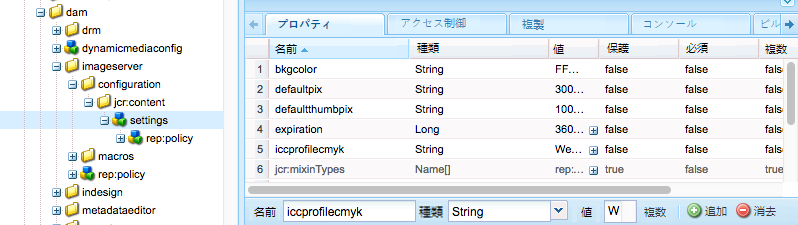

# Dynamic Media - ハイブリッドモードの設定{#configuring-dynamic-media-hybrid-mode}

Dynamic Media - ハイブリッドを使用するには、有効化して設定する必要があります。Dynamic Media では、使用例に応じて、[サポートされる設定](#supported-dynamic-media-configurations)がいくつか用意されています。

>[!NOTE]
>
>Scene7 実行モードの Dynamic Media を設定して実行する場合は、[Dynamic Media - Scene7 モードの設定](/help/assets/config-dms7.md)を参照してください。
>
>ハイブリッド実行モードの Dynamic Media を設定して実行する場合は、このページの手順に従ってください。

Dynamic Media での[ビデオ](/help/assets/video.md)の操作方法を参照してください。

>[!NOTE]
>
>開発用、ステージング用、実稼動用など、複数の異なる環境向けに Adobe Experience Manager をセットアップして使用する場合は、それぞれの環境向けに Dynamic Media Cloud Services を設定する必要があります。

>[!NOTE]
>
>Dynamic Media 設定に問題がある場合は、Dynamic Media 固有のログファイルを確認することが重要です。これらは Dynamic Media を有効化するときに自動的にインストールされます。
>
>* `s7access.log`
>* `ImageServing.log`

>
>
They are documented in [Monitoring and Maintaining your AEM instance](/help/sites-deploying/monitoring-and-maintaining.md).

ハイブリッド公開および配信は、Adobe Experience Manager に対して Dynamic Media によって追加される中心機能です。ハイブリッドパブリッシングでは、画像、セット、ビデオなどのDynamic Mediaアセットを、AEMパブリッシュノードからではなく、クラウドから配信できます。

 Dynamic Media ビューア、サイトページ、静的コンテンツなどのその他のコンテンツは、引き続き AEM パブリッシュノードから配信されます。

Dynamic Mediaをご利用の場合は、ハイブリッド配信をすべてのDynamic Mediaコンテンツの配信メカニズムとして使用する必要があります。

## ビデオのハイブリッド公開アーキテクチャ {#hybrid-publishing-architecture-for-videos}


## 画像のハイブリッド公開アーキテクチャ {#hybrid-publishing-architecture-for-images}


## サポートされる Dynamic Media 設定 {#supported-dynamic-media-configurations}

各設定タスクで参照される用語を次に示します。

| **用語** | **ダイナミックメディア有効** | **説明** |
|---|---|---|
| AEM オーサーノード | 緑色の円の中に白色のチェックマーク | オンプレミスにデプロイするか、Managed Servicesを通じてデプロイする作成者ノードです。 |
| AEM パブリッシュノード | 赤色の四角の中に白色の「X」 | オンプレミスまたはManaged Servicesを通じてデプロイする発行ノードです。 |
| 画像サービスのパブリッシュノード | 緑色の円の中に白色のチェックマーク | アドビが管理するデータセンターで実行する発行ノード。 画像サービスのURLを指します。 |

Dynamic Media を画像専用、ビデオ専用、またはその両方の用途で実装できます。具体的なシナリオに合わせた Dynamic Media を設定する手順を決定するには、次の表を参照してください。

<table>
 <tbody>
  <tr>
   <td><strong>シナリオ</strong></td>
   <td ><strong>仕組み</strong></td>
   <td><strong>設定手順</strong></td>
  </tr>
  <tr>
   <td>実稼動環境に画像のみを配信する</td>
   <td>画像は世界各地のアドビのデータセンターのサーバーを介して配信されます。CDN を使用してキャッシュすることで、スケーラブルなパフォーマンスで全世界に展開できます。</td>
   <td>
    <ol>
     <li>AEM <strong>オーサー</strong>ノードで、<a href="#enabling-dynamic-media">Dynamic Media を有効化</a>します。</li>
     <li>画像を<a href="#configuring-dynamic-media-cloud-services"> Dynamic Media クラウドサービス</a>で設定します。</li>
     <li><a href="#configuring-image-replication">画像のレプリケーションを設定</a>します。</li>
     <li><a href="#replicating-catalog-settings">カタログ設定をレプリケート</a>します。</li>
     <li><a href="#replicating-viewer-presets">ビューアプリセットをレプリケート</a>します。</li>
     <li><a href="#using-default-asset-filters-for-replication">レプリケーションにデフォルトのアセットフィルターを使用</a>します。</li>
     <li><a href="#configuring-dynamic-media-image-server-settings">Dynamic Media Image Server を設定</a>します。</li>
     <li><a href="#delivering-assets">アセットを配信</a>します。</li>
    </ol> </td>
  </tr>
  <tr>
   <td>実稼動前の環境（開発、品質評価、ステージングなど）に画像のみを配信する</td>
   <td>画像は AEM パブリッシュノードを通じて配信されます。このシナリオでは、トラフィックが最小限となるので、画像をアドビのデータセンターに配信する必要はありません。また、実稼動開始前にコンテンツの安全なプレビューを可能にするという利点もあります。</td>
   <td>
    <ol>
     <li>AEM <strong>オーサー</strong>ノードで、<a href="#enabling-dynamic-media">Dynamic Media を有効化</a>します。</li>
     <li>On AEM <strong>publish</strong> node, <a href="#enabling-dynamic-media">enable dynamic media</a>.</li>
     <li><a href="#replicating-viewer-presets">ビューアプリセットをレプリケート</a>します。</li>
     <li><a href="#setting-up-asset-filters-for-imaging-in-non-production-deployments">実稼動環境以外の画像用のアセットフィルター</a>をセットアップします。</li>
     <li><a href="#configuring-dynamic-media-image-server-settings">Dynamic Media Image Server を設定します。</a></li>
     <li><a href="#delivering-assets">アセットを配信します。</a></li>
    </ol> </td>
  </tr>
  <tr>
   <td>任意の環境（実稼動、開発、品質評価、ステージングなど）にビデオのみを配信する</td>
   <td>画像は CDN を使用してキャッシュすることで、スケーラブルなパフォーマンスで全世界に展開できます。ビデオのポスター画像（再生が開始される前に表示されるビデオのサムネール）が AEM パブリッシュインスタンスにより配信されます。</td>
   <td>
    <ol>
     <li>AEM <strong>オーサー</strong>ノードで、<a href="#enabling-dynamic-media">Dynamic Media を有効化</a>します。</li>
     <li>AEM <strong>パブリッシュ</strong>ノードで、<a href="#enabling-dynamic-media">Dynamic Media を有効化</a>します（パブリッシュインスタンスがビデオのポスター画像を処理し、ビデオ再生用のメタデータを提供します）。</li>
     <li><a href="#configuring-dynamic-media-cloud-services">Dynamic Media クラウドサービス</a>でビデオを設定します。</li>
     <li><a href="#replicating-viewer-presets">ビューアプリセットをレプリケート</a>します。</li>
     <li><a href="#setting-up-asset-filters-for-video-only-deployments">ビデオ専用のアセットフィルター</a>をセットアップします。</li>
     <li><a href="#delivering-assets">アセットを配信します。</a></li>
    </ol> </td>
  </tr>
  <tr>
   <td>実稼動環境に画像とビデオの両方を配信する</td>
   <td><p>画像は CDN を使用してキャッシュすることで、スケーラブルなパフォーマンスで全世界に展開できます。画像やビデオのポスター画像は世界各地のアドビのデータセンターのサーバーを介して配信されます。CDN を使用してキャッシュすることで、スケーラブルなパフォーマンスで全世界に展開できます。</p> <p>実稼動前の環境での画像やビデオのセットアップ方法については、前の節を参照してください。 </p> </td>
   <td>
    <ol>
     <li>AEM <strong>オーサー</strong>ノードで、<a href="#enabling-dynamic-media">Dynamic Media を有効化</a>します。</li>
     <li><a href="#configuring-dynamic-media-cloud-services">Dynamic Media クラウドサービス</a>でビデオを設定します。</li>
     <li>画像を<a href="#configuring-dynamic-media-cloud-services"> Dynamic Media クラウドサービス</a>で設定します。</li>
     <li><a href="#configuring-image-replication">画像のレプリケーションを設定</a>します。</li>
     <li><a href="#replicating-catalog-settings">カタログ設定をレプリケート</a>します。</li>
     <li><a href="#replicating-viewer-presets">ビューアプリセットをレプリケート</a>します。</li>
     <li><a href="#using-default-asset-filters-for-replication">レプリケーションにデフォルトのアセットフィルターを使用します。</a></li>
     <li><a href="#configuring-dynamic-media-image-server-settings">Dynamic Media Image Server を設定します。</a></li>
     <li><a href="#delivering-assets">アセットを配信します。</a></li>
    </ol> </td>
  </tr>
 </tbody>
</table>

## Dynamic Media の有効化 {#enabling-dynamic-media}

[Dynamic Media ](https://www.adobe.com/solutions/web-experience-management/dynamic-media.html)はデフォルトで無効になっています。Dynamic Media の機能を活用するには、`dynamicmedia` 実行モードなどの場合と同様に、`publish` 実行モードを使用して Dynamic Media を有効にする必要があります。有効にする前に、[技術要件](/help/sites-deploying/technical-requirements.md#dynamicmediaaddonprerequisites)を確認してください。

>[!NOTE]
>
>実行モードで Dynamic Media を有効にすると、`dynamicMediaEnabled` フラグを **[!UICONTROL true に設定することで Dynamic Media を有効にした AEM 6.1 および AEM 6.0 の機能が置き換えられます。]**&#x200B;このフラグは AEM 6.2 以降では機能しません。さらに、クイックスタートを再起動して Dynamic Media を有効にする必要はありません。

By enabling Dynamic Media, the dynamic media features will be available in the UI and every uploaded image asset receives a *cqdam.pyramid.tiff* rendition that is used for fast delivery of dynamic image renditions. これらのPTIFFには、(1)1つのプライマリソース画像のみを管理し、追加のストレージなしで無制限のレンディションをその場で生成する機能、(2)ズーム、パン、スピンなどのインタラクティブなビジュアライゼーションを使用する機能など、大きな利点があります。

If you want to use Dynamic Media Classic (Scene7) in AEM, you should not enable Dynamic Media unless you are using a [specific scenario](/help/sites-administering/scene7.md#aem-scene-integration-versus-dynamic-media). Dynamic Media は、実行モードを使用して有効にしない限り、無効化されたままです。

Dynamic Media を有効にするには、コマンドラインまたはクイックスタートのファイル名から Dynamic Media の実行モードを有効にする必要があります。

**ダイナミックメディアを有効にするには**

1. コマンドラインでクイックスタートを起動するときに、次のようにします。

   * Add `-r dynamicmedia` to the end of the command line when starting the jar file.

   ```shell
   java -Xmx4096m -Doak.queryLimitInMemory=500000 -Doak.queryLimitReads=500000 -jar cq-quickstart-6.5.0.jar -r dynamicmedia
   ```

   s7配信に公開する場合は、次のtrustStore引数も含める必要があります。

   ```
   -Djavax.net.ssl.trustStore=<absoluteFilePath>/customerTrustStoreFileName>
   
    -Djavax.net.ssl.trustStorePassword=<passwordForTrustStoreFile>
   ```

1. Request `https://localhost:4502/is/image` and make sure Image Server is now running.

   >[!NOTE]
   >
   >To troubleshoot issues with Dynamic Media, see the following logs in the `crx-quickstart/logs/` directory:
   >
   >* ImageServer-&lt;PortId>-&lt;yyyy>&lt;mm>&lt;dd>.log - ImageServerログは、内部ImageServerプロセスの動作を分析する際に使用する統計情報と分析情報を提供します。

   Example of an Image Server log file name: `ImageServer-57346-2020-07-25.log`
   * s7access-&lt;yyyy>&lt;mm>&lt;dd>.log - The s7access log records each request made to Dynamic Media through `/is/image` and `/is/content`.

   これらのログは、Dynamic Media が有効の場合のみ使用されます。They are not included in the **Download Full** package that is generated from the `system/console/status-Bundlelist` page; when calling Customer Support if you have a Dynamic Media issue, please append both these logs to the issue.

### If you installed AEM to a different port or context path ... {#if-you-installed-aem-to-a-different-port-or-context-path}

If you are deploying [AEM to an application server](/help/sites-deploying/application-server-install.md) and have Dynamic Media enabled, you need to configure the **self** domain in the externalizer. Otherwise, thumbnail generation for assets will not work properly for dynamic media assets.

さらに、異なるポートまたはコンテキストパスで quickstart を実行する場合、**self** ドメインを変更する必要もあります。

Dynamic Mediaを有効にすると、画像アセットの静的サムネールレンディションがDynamic Mediaを使用して生成されます。 サムネールの生成がダイナミックメディアで正しく機能するためには、AEMは自身に対してURLリクエストを実行し、ポート番号とコンテキストパスの両方を認識する必要があります。

AEM では、

* [Externalizer](/help/sites-developing/externalizer.md) の **self** ドメインがポート番号とコンテキストパスの両方を取得するために使用されます。
* If no **self** domain is configured, the port number and context path are retrieved from the Jetty HTTP service.

In an AEM QuickStart WAR deployment, the port number and context path cannot be derived, therefore you must configure a **self** domain. See [externalizer documentation](/help/sites-developing/externalizer.md) on how to configure the **self** domain.

>[!NOTE]
[AEM Quickstart スタンドアロンデプロイメント](/help/sites-deploying/deploy.md)では、**self** ドメインは通常設定する必要がありません。ポート番号とコンテキストパスは自動設定されます。ただし、ネットワークインターフェイスがオフの場合は、**self** ドメインを設定する必要があります。

## Dynamic Media の無効化  {#disabling-dynamic-media}

Dynamic Media はデフォルトでは有効になっていません。しかし、以前に Dynamic Media を有効にした場合は、後で無効にすることができます。

To disable dynamic media after you have enabled it, you remove the `-r dynamicmedia` run mode flag.

**Dynamic Mediaを有効にした後で無効にするには**

1. コマンドラインでクイックスタートを起動するときに、次のいずれかを実行します。

   * Do not add `-r dynamicmedia` to the command line when starting the jar file.

   ```shell
   java -Xmx4096m -Doak.queryLimitInMemory=500000 -Doak.queryLimitReads=500000 -jar cq-quickstart-6.5.0.jar
   ```

1. リクエスト `https://localhost:4502/is/image`. Dynamic Media が無効化されたことを示すメッセージが表示されます。

   >[!NOTE]
   After the Dynamic Media run mode is disabled, the workflow step that generates the `cqdam.pyramid.tiff` rendition is skipped automatically. また、動的レンディションのサポートやその他の Dynamic Media 機能も無効になります。
   また、AEM サーバーを設定した後で Dynamic Media 実行モードを無効にすると、その実行モードの下でアップロードされたアセットがすべて無効になることにも注意してください。

## （オプション）Dynamic Media のプリセットおよび設定を 6.3 から 6.5 にダウンタイムなしで移行{#optional-migrating-dynamic-media-presets-and-configurations-from-to-zero-downtime}

If you are upgrading AEM Dynamic Media from 6.3 to 6.5 (which now includes the ability for zero downtime deployments), you are required to run the following curl command to migrate all your presets and configurations from `/etc` to `/conf` in CRXDE Lite.

**注意**: 互換モードでAEMインスタンスを実行する場合（つまり、互換パッケージがインストールされている場合）、これらのコマンドを実行する必要はありません。

互換パッケージの有無を問わず、すべてのアップグレードについて、次の Linux curl コマンドを実行することにより、Dynamic Media に付属しているデフォルトの標準提供ビューアプリセットをコピーできます。

`curl -u admin:admin -X POST https://<server_address>:<server_port>/libs/settings/dam/dm/presets/viewer.pushviewerpresets.json`

To migrate any custom viewer presets and configurations that you have created from `/etc` to `/conf`, run the following Linux curl command:

`curl -u admin:admin -X POST https://<server_address>:<server_port>/libs/settings/dam/dm/presets.migratedmcontent.json`

## 画像レプリケーションの設定 {#configuring-image-replication}

Dynamic Mediaの画像配信は、ビデオサムネールなどの画像アセットをAEM Authorから公開し、アドビのオンデマンドレプリケーションサービス(Replication Service URL)に複製することで機能します。 その後、アセットはオンデマンド画像配信サービス(Image Service URL)を介して配信されます。

次の手順を実行する必要があります。

1. [認証を設定します](#setting-up-authentication)。
1. [レプリケーションエージェントを構成します](#configuring-the-replication-agent)。

Replication Agentは、画像、ビデオメタデータなどのDynamic Mediaアセットを公開し、アドビがホストするImage Serviceにセットを公開します。 レプリケーションエージェントはデフォルトでは有効でありません。

レプリケーションエージェントを設定後、[正しく設定されていることを検証およびテスト](#validating-the-replication-agent-for-dynamic-media)する必要があります。ここでは、これらの手順について説明します。

>[!NOTE]
PTIFF 作成のデフォルトのメモリ制限は、すべてのワークフローで 3 GB です。例えば、他のワークフローを一時停止して、3 GB のメモリを必要とする 1 個の画像を処理できます。または、それぞれ 300 MB のメモリを必要とする 10 個の画像を並行して処理できます。
このメモリ制限は変更できますが、使用可能なシステムリソースおよび処理する画像コンテンツのタイプに合わせる必要があります。非常に大きなアセットが多数あり、システムに十分なメモリがある場合、この制限を引き上げて、画像が並行して処理されるようにすることができます。
最大メモリ制限を超えるメモリを必要とする画像は、拒否されます。
PTIFF 作成のメモリ制限を変更するには、**[!UICONTROL ツール／運営／Web コンソール／Adobe CQ Scene7 PTiffManager]** に移動して、**[!UICONTROL maxMemory]** の値を変更します。

### 認証の設定 {#setting-up-authentication}

Dynamic Media 画像配信サービスに画像をレプリケートするには、作成者にレプリケーション認証を設定する必要があります。You do this by obtaining a KeyStore and then saving it under the **[!UICONTROL dynamic-media-replication]** user and configuring it. キーストアファイルとプロビジョニング処理中に必要な資格情報が記載されたようこそメールが会社の管理者に送信されます。このメッセージを受け取っていない場合は、カスタマーケアにお問い合わせください。

**認証を設定するには**

1. キーストアファイルとパスワードをまだ受け取っていない場合は、カスタマーケアに問い合わせます。これはプロビジョニングの一部であり、これによりキーがアカウントに関連付けられます。
1. In AEM, tap the AEM logo to access the global navigation console, then tap **[!UICONTROL Tools > Security > Users.]**
1. On the User Management page, navigate to the **[!UICONTROL dynamic-media-replication]** user, then tap to open.

   

1. In the Edit User Settings For dynamic-media-replication page, tap the **[!UICONTROL Keystore]** tab, then click **[!UICONTROL Create KeyStore.]**

   

1. **[!UICONTROL キーストアアクセスパスワードを設定]**&#x200B;ダイアログボックスでパスワードを入力し、パスワードを確認します。

   >[!NOTE]
   入力したパスワードは覚えておいてください。後でレプリケーションエージェントを設定するときにもう一度入力する必要があります。

   

1. **[!UICONTROL dynamic-media-replication のユーザー設定を編集]**&#x200B;ページで「**秘密鍵をキーストアファイルから追加**」領域を展開し、以下の情報を追加します（下の画像を参照）。

   * In the **[!UICONTROL New Alias]** field, enter the name of an alias that you will later use in the replication configuration; for example, `replication`.
   * 「**[!UICONTROL キーストアファイル」をタップします。]**&#x200B;アドビから提供されたキーストアファイルに移動して選択し、「**[!UICONTROL 開く」をタップします。]**
   * In the **[!UICONTROL KeyStore File Password]** field, enter the KeyStore File password. これは、手順 5 で作成したキーストアパスワード&#x200B;**ではなく**、プロビジョニング中に送信されたようこそメールでアドビから提供されたキーストアファイルパスワードです。キーストアファイルパスワードを受け取っていない場合は、アドビのカスタマーケアに問い合わせてください。
   * 「**[!UICONTROL 秘密鍵のパスワード]**」フィールドで、秘密鍵のパスワードを入力します（以前の手順で指定した秘密鍵のパスワードと同じでも可）。秘密鍵のパスワードは、プロビジョニング中にアドビから送信されたようこそメールに記載されています。秘密鍵のパスワードを受け取っていない場合は、アドビのカスタマーケアに問い合わせてください。
   * In the **[!UICONTROL Private Key Alias]** field, enter the private key alias. For example, `*companyname*-alias`. 秘密鍵のエイリアスは、プロビジョニング中にアドビから送信されたようこそメールに記載されています。秘密鍵のエイリアスを受け取っていない場合は、アドビのカスタマーケアに問い合わせてください。

   

1. 「**[!UICONTROL 保存して閉じる]**」をタップして、このユーザーに対する変更を保存します。

   次に、[レプリケーションエージェントを設定します。](#configuring-the-replication-agent)

### レプリケーションエージェントの設定 {#configuring-the-replication-agent}

1. In AEM, tap the AEM logo to access the global navigation console, then tap **[!UICONTROL Tools > Deployment > Replication > Agents on author.]**
1. On the Agents on author page, tap **[!UICONTROL Dynamic Media Hybrid Image Replication (s7delivery).]**
1. Tap **[!UICONTROL Edit.]**
1. Tap the **[!UICONTROL Settings]** tab, then enter the following:

   * **[!UICONTROL 有効]** - レプリケーションエージェントを有効にするには、このチェックボックスを選択します。
   * **[!UICONTROL 地域]** — 適切な地域に設定します。 北米、ヨーロッパ、アジア
   * **[!UICONTROL テナントID]** — この値は、レプリケーションサービスに発行する会社またはテナントの名前です。 この値は、プロビジョニング時にアドビから送信されるご案内の電子メールに含まれるテナントIDです。 この情報を受け取っていない場合は、アドビのカスタマーケアに問い合わせてください。
   * **[!UICONTROL Key Store Alias]** — この値は、「認証の [設定](#setting-up-authentication)」でキーを生成する際に設定された**新しいAlias**値と同じです。 例えば、 `replication`。 (See step 7 in [Setting Up Authentication](#setting-up-authentication).)
   * **[!UICONTROL キーストアパスワード]** — キーストアの **[!UICONTROL 作成をタップしたときに作成されたキーストアパスワードです。]**&#x200B;このパスワードはアドビが提供するものではありません。See step 5 of [Setting up Authentication](#setting-up-authentication).

   次の画像はサンプルデータが入力されたレプリケーションエージェントを示します。

   

1. Tap **[!UICONTROL OK.]**

### Dynamic Media 用のレプリケーションエージェントの検証 {#validating-the-replication-agent-for-dynamic-media}

ダイナミックメディア用のレプリケーションエージェントを検証するには、次の手順を実行します。

「 **[!UICONTROL 接続のテスト」をタップします。]**&#x200B;次のように出力されます。

```shell
11.03.2016 10:57:55 - Transferring content for ReplicationAction{type=TEST, path[0]='/content/dam', time=1457722675402, userId='admin', revision='null'}
11.03.2016 10:57:55 - * Auth User: replication-receiver
11.03.2016 10:57:55 - * HTTP Version: 1.1
11.03.2016 10:57:55 - * Using OAuth 2.0 Authorization Grants
11.03.2016 10:57:55 - * OAuth 2.0 User: dynamic-media-replication
11.03.2016 10:57:55 - * OAuth 2.0 Token: '*****' initialized
11.03.2016 10:57:55 - Publishing: POST[https://replicate-na.assetsadobe.com:8580/is-publish/publish-receiver?Cmd=Test&RootId=xfpuu-6613]
11.03.2016 10:57:55 - Publish response: OK[]
11.03.2016 10:57:55 - Transfer succeeded in 141 ms for ReplicationAction{type=TEST, path[0]='/content/dam', time=1457722675402, userId='admin', revision='null'}
-------------------------------------------------------------------------------------------------------------------------------
Replication test succeeded
```

>[!NOTE]
次のいずれかを実行してチェックすることもできます。
* レプリケーションログをチェックしてアセットがレプリケートされていることを確認する。
* 画像を公開する。Tap the image and select **[!UICONTROL Viewers]** in drop-down menu. 次に、ビューアプリセットを選択し、「URL」をクリックし、URLをコピー&amp;ペーストして、画像が表示されることを確認します。


### 認証のトラブルシューティング {#troubleshooting-authentication}

認証の設定時に発生する可能性がある問題と、その解決策を紹介します。その前に、レプリケーションが設定済みであることを確認してください。

#### 問題：HTTP ステータスコード 401 メッセージ - 認証が必要 {#problem-http-status-code-with-message-authorization-required}

この問題は、`dynamic-media-replication` ユーザーのキーストアの設定に失敗したことによって発生する可能性があります。

```shell
Replication test to s7delivery:https://s7bern.macromedia.com:8580/is-publish/
17.06.2016 18:54:43 - Transferring content for ReplicationAction{type=TEST, path[0]='/content/dam', time=1466214883309, userId='admin', revision='null'}
17.06.2016 18:54:43 - * Auth User: replication-receiver
17.06.2016 18:54:43 - * HTTP Version: 1.1
17.06.2016 18:54:43 - * Using OAuth 2.0 Authorization Grants
17.06.2016 18:54:43 - * OAuth 2.0 User: dynamic-media-replication
17.06.2016 18:54:43 - No OAuth token available. OAuth not initialized
17.06.2016 18:54:43 - * Using Client Auth SSL alias - replication-alias *
17.06.2016 18:54:43 - Publishing: POST[https://<localhost>:8580/is-publish//publish-receiver?Cmd=Test&RootId=brough]
17.06.2016 18:54:43 - Transfer failed for ReplicationAction{type=TEST, path[0]='/content/dam', time=1466214883309, userId='admin', revision='null'}. java.io.IOException: Failed to execute request
'https://<localhost>:8580/is-publish//publish-receiver?Cmd=Test&RootId=brough':
 Server returned status code 401 with message: Authorization required.
17.06.2016 18:54:43 - Error while replicating: com.day.cq.replication.ReplicationException: Transfer failed for ReplicationAction{type=TEST, path[0]='/content/dam', time=1466214883309,
 userId='admin', revision='null'}. java.io.IOException: Failed to execute request
'https://<localhost>:8580/is-publish//publish-receiver?Cmd=Test&RootId=brough':
 Server returned status code 401 with message: Authorization required.
```

**解決方法**: が `KeyStore` dynamic-media-replication **** userに保存され、正しいパスワードが指定されていることを確認します。

#### 問題：鍵を復号化できない - データを復号化できない {#problem-could-not-decrypt-key-could-not-decrypt-data}

```xml
Replication test to s7delivery:https://<localhost>:8580/is-publish/
17.06.2016 19:00:16 - Transferring content for ReplicationAction{type=TEST, path[0]='/content/dam', time=1466215216662, userId='admin', revision='null'}
17.06.2016 19:00:16 - * Auth User: replication-receiver
17.06.2016 19:00:16 - * HTTP Version: 1.1
17.06.2016 19:00:16 - * Using OAuth 2.0 Authorization Grants
17.06.2016 19:00:16 - * OAuth 2.0 User: dynamic-media-replication
17.06.2016 19:00:16 - No OAuth token available. OAuth not initialized
17.06.2016 19:00:16 - * Using Client Auth SSL alias - replication-alias *
17.06.2016 19:00:16 - Transfer failed for ReplicationAction{type=TEST, path[0]='/content/dam', time=1466215216662, userId='admin', revision='null'}. java.lang.SecurityException: java.security.UnrecoverableKeyException: Could not decrypt key: Could not decrypt data.
```

**解決策**：パスワードを確認します。レプリケーションエージェントに保存されたパスワードがキーストアの作成に使用されたパスワードと同じでありません。

#### 問題：InvalidAlgorithmParameterException {#problem-invalidalgorithmparameterexception}

この問題は AEM オーサーインスタンスの設定エラーが原因です。Author の java プロセスが正しい `javax.net.ssl.trustStore` を取得していません。このエラーは次のレプリケーションログで確認できます。

```shell
14.04.2016 09:37:43 - Transfer failed for ReplicationAction{type=TEST, path[0]='/content/dam', time=1460651862089, userId='admin', revision='null'}. java.io.IOException: Failed to execute request 'https://<localhost>:8580/is-publish/publish-receiver?Cmd=Test&RootId=rbrough-osx2': java.lang.RuntimeException: Unexpected error: java.security.InvalidAlgorithmParameterException: the trustAnchors parameter must be non-empty
14.04.2016 09:37:43 - Error while replicating: com.day.cq.replication.ReplicationException: Transfer failed for ReplicationAction{type=TEST, path[0]='/content/dam', time=1460651862089, userId='admin', revision='null'}. java.io.IOException: Failed to execute request 'https://<localhost>:8580/is-publish/publish-receiver?Cmd=Test&RootId=rbrough-osx2': java.lang.RuntimeException: Unexpected error: java.security.InvalidAlgorithmParameterException: the trustAnchors parameter must be non-empty
```

または、次のエラーログで確認できます。

```shell
07.25.2019 12:00:59.893 *ERROR* [sling-threadpool-db2763bb-bc50-4bb5-bb64-10a09f432712-(apache-sling-job-thread-pool)-90-com_day_cq_replication_job_s7delivery(com/day/cq/replication/job/s7delivery)] com.day.cq.replication.Agent.s7delivery.queue Error during processing of replication.

java.io.IOException: Failed to execute request 'https://replicate-na.assetsadobe.com:8580/is-publish/publish-receiver?Cmd=Test&RootId=rbrough-osx': java.lang.RuntimeException: Unexpected error: java.security.InvalidAlgorithmParameterException: the trustAnchors parameter must be non-empty
        at com.scene7.is.catalog.service.publish.atomic.PublishingServiceHttp.executePost(PublishingServiceHttp.scala:195)
```

**解決方法**: AEM Author上のJavaプロセスのsystemプロパティが有効なtruststoreに `-Djavax.net.ssl.trustStore=` 設定されていることを確認します。

#### 問題：キーストアが設定されていないか初期化されていない {#problem-keystore-is-either-not-set-up-or-it-is-not-initialized}

この問題は、ホットフィックスまたは機能パックにより dynamic-media-user またはキーストアノードが上書きされたことが原因で発生する可能性があります。

レプリケーションログの例は次のとおりです。

```shell
Replication test to s7delivery:https://replicate-na.assetsadobe.com/is-publish
02.08.2016 14:37:44 - Transferring content for ReplicationAction{type=TEST, path[0]='/content/dam', time=1470173864834, userId='admin', revision='null'}
02.08.2016 14:37:44 - * Auth User: replication-receiver
02.08.2016 14:37:44 - * HTTP Version: 1.1
02.08.2016 14:37:44 - * Using OAuth 2.0 Authorization Grants
02.08.2016 14:37:44 - * OAuth 2.0 User: dynamic-media-replication
02.08.2016 14:37:44 - Transfer failed for ReplicationAction{type=TEST, path[0]='/content/dam', time=1470173864834, userId='admin', revision='null'}. com.adobe.granite.keystore.KeyStoreNotInitialisedException: Uninitialised key store for user dynamic-media-replication
```

**解決策**:

1. ユーザー管理ページに移動します。
   `localhost:4502/libs/granite/security/content/useradmin.html`
1. On the User Management page, navigate to the `dynamic-media-replication` user, then tap to open.
1. 「**[!UICONTROL キーストア]**」タブをクリックします。「**[!UICONTROL キーストアを作成]**」ボタンが表示された場合は、前述の[認証の設定](#setting-up-authentication)の手順をやり直す必要があります。
1. キーストアの設定をやり直す必要があった場合は、[レプリケーションエージェントの設定](/help/assets/config-dynamic.md#configuring-the-replication-agent)も再度おこなう必要がある可能性があります。

   s7delivery レプリケーションエージェントを再設定します。
   `localhost:4502/etc/replication/agents.author/s7delivery.html`

1. 「**[!UICONTROL 接続をテスト]**」をタップして設定が有効であることを確認します。

#### 問題：公開エージェントが OAuth ではなく SSL を使用している {#problem-publish-agent-is-using-ssl-instead-of-oauth}

この問題は、ホットフィックスまたは機能パックが正しくインストールされなかったか設定を上書きしたことが原因で発生する可能性があります。

レプリケーションログの例は次のとおりです。

```shell
01.08.2016 18:42:59 - Transferring content for ReplicationAction{type=TEST, path[0]='/content/dam', time=1470073379634, userId='admin', revision='null'}
01.08.2016 18:42:59 - * Auth User: replication-receiver
01.08.2016 18:42:59 - * HTTP Version: 1.1
01.08.2016 18:42:59 - * Using Client Auth SSL alias - replication-receiver *
01.08.2016 18:42:59 - Publishing: POST[https://replicate-eu.assetsadobe2.com:443/is-publish/publish-receiver?Cmd=Test&RootId=altayerstaging]
01.08.2016 18:42:59 - Transfer failed for ReplicationAction{type=TEST, path[0]='/content/dam', time=1470073379634, userId='admin', revision='null'}. java.io.IOException: Failed to execute request 'https://replicate-eu.assetsadobe2.com:443/is-publish/publish-receiver?Cmd=Test&RootId=rbroughstaging': Server returned status code 401 with message: Authorization required.
01.08.2016 18:42:59 - Error while replicating: com.day.cq.replication.ReplicationException: Transfer failed for ReplicationAction{type=TEST, path[0]='/content/dam', time=1470073379634, userId='admin', revision='null'}. java.io.IOException: Failed to execute request 'https://replicate-eu.assetsadobe2.com:443/is-publish/publish-receiver?Cmd=Test&RootId=rbroughstaging': Server returned status code 401 with message: Authorization required.
```

**解決策:**

1. In AEM, click **[!UICONTROL Tools > General > CRXDE Lite.]**

   `localhost:4502/crx/de/index.jsp`

1. s7delivery レプリケーションエージェントノードに移動します。
   `localhost:4502/crx/de/index.jsp#/etc/replication/agents.author/s7delivery/jcr:content`

1. この設定をレプリケーションエージェントに追加します（値が **[!UICONTROL True]** に設定されたブール値）。

   `enableOauth=true`

1. Near the upper-left corner of the page, tap **[!UICONTROL Save All.]**

### 設定のテスト {#testing-your-configuration}

設定にはエンドツーエンドのテストを実行することをお勧めします。

このテストを開始する前に、既に以下をおこなったことを確認してください。

* 画像プリセットを追加した。
* クラウドサービスの下の **[!UICONTROL Dynamic Media 設定（6.3 以前）]**&#x200B;を設定する。このテストでは画像サービスの URL が必要です。

**設定をテストするには**

1. 画像アセットをアップロードします(In Assets, tap **[!UICONTROL Create > Files]** and select the file.)
1. ワークフローが完了するまで待ちます。
1. 画像アセットを公開します(Select the asset and tap **[!UICONTROL Quick Publish.]**)
1. Navigate to the renditions for that image by opening the image, and tapping **[!UICONTROL Renditions.]**

   

1. 任意の動的レンディションを選択します。
1. 「**[!UICONTROL URL]**」をクリックしてそのアセットの URL を取得します。
1. 選択した URL に移動して画像が期待どおりに動作するかどうかを確認します。

アセットが配信されたことをテストするもう 1 つの方法は、URL に req=exists を追加することです。

## Dynamic Media クラウドサービスの設定 {#configuring-dynamic-media-cloud-services}

Dynamic Media クラウドサービスは、画像とビデオのハイブリッド公開および配信、ビデオ分析、ビデオエンコーディングなどの様々なクラウドサービスをサポートします。

設定の一環として、登録 ID、ビデオサービス URL、画像サービス URL、レプリケーションサービス URL を入力し、認証を設定する必要があります。アカウントプロビジョニングプロセスの一環として、この情報をすべて受け取ったはずです。 この情報を受け取っていない場合は、Adobe Experience Manager管理者またはアドビテクニカルサポートに問い合わせて入手してください。

>[!NOTE]
Dynamic Media クラウドサービスを設定する前に、パブリッシュインスタンスを設定する必要があります。また、Dynamic Media クラウドサービスを設定する前にレプリケーションも設定する必要があります。

Dynamic Media Cloud Services を設定するには：

1. In AEM, tap the AEM logo to access the global navigation console and tap **[!UICONTROL Tools > Cloud Services > Dynamic Media Configuration (Pre-6.3).]**
1. On the Dynamic Media Configuration Browser page, in the left pane, select **[!UICONTROL global]**, then tap **[!UICONTROL Create.]**
1. **[!UICONTROL Dynamic Media 設定を作成]**&#x200B;ダイアログボックスで、「タイトル」フィールドにタイトルを入力します。
1. ビデオ用に Dynamic Media を設定する場合は、次の操作をおこないます。

   * 「**[!UICONTROL 登録 ID]**」フィールドに登録 ID を入力します。
   * In the **V[!UICONTROL ideo Service URL ]**field, enter the video service URL for the Dynamic Media Gateway.

1. 画像用に Dynamic Media を設定する場合は、「**[!UICONTROL 画像サービスの URL]**」フィールドに Dynamic Media ゲートウェイの画像サービスの URL を入力します。
1. 「**[!UICONTROL 保存]**」をタップして Dynamic Media 設定ブラウザーページに戻ります。
1. AEM のロゴをタップしてグローバルナビゲーションコンソールにアクセスします。

## ビデオレポートの設定 {#configuring-video-reporting}

Dynamic Media ハイブリッドを使用する複数の AEM インストールにわたってビデオレポートを設定できます。

**用途：** Dynamic Media 設定（6.3 以前）を設定すると、ビデオレポートを含む様々な機能が開始されます。設定時には、地域の Analytics 企業内にレポートスイートが作成されます。複数のオーサーノードを設定すると、ノードごとに異なるレポートスイートが作成されます。このため、インストール間でレポートデータの整合性が取れなくなります。さらに、すべてのオーサーノードが同じハイブリッドパブリッシュサーバーを参照している場合、最後のオーサーノードでのインストール時に、すべてのビデオレポートの報告先となるレポートスイートが変更されてしまいます。この問題が発生すると、過剰な数のレポートスイートによって Analytics システムが過負荷状態に陥ります。

**手順概要：**&#x200B;ビデオレポートを設定するには、以下の 3 つのタスクを実行します。

1. 最初のオーサーノードで Dynamic Media 設定（6.3 以前）を設定した後、ビデオ分析プリセットパッケージを作成します。この最初のタスクは重要です。これにより、新しい設定でも引き続き同じレポートスイートを使用できるからです。
1. 「新しい」オーサーノードで Dynamic Media 設定（6.3 以前）を設定する「前」に、それらのノードのすべてにビデオ分析プリセットパッケージをインストールします。************
1. パッケージインストールの確認やデバッグをおこないます。

### 最初のオーサーノードの設定後にビデオ分析プリセットパッケージを作成する {#creating-a-video-analytics-preset-package-after-configuring-the-first-author-node}

このタスクが完了すると、ビデオ分析プリセットを含むパッケージファイルが得られます。これらのプリセットには、レポートスイート、トラッキングサーバー、トラッキング名前空間および Marketing Cloud 組織 ID（利用可能な場合）が含まれます。

1. Dynamic Media 設定（6.3 以前）をまだ設定していない場合は、設定します。
1. （オプション）レポートスイート ID を表示してコピーします（JCR へのアクセス権が必要）。レポートスイート ID は必須ではありませんが、あると確認が容易になります。
1. パッケージマネージャーを使用してパッケージを作成します。
1. パッケージを編集してフィルターを含めます。

   AEM で: `/conf/global/settings/dam/dm/presets/analytics/jcr:content/userdata`

1. パッケージをビルドします。
1. ビデオ分析プリセットパッケージを後続の新しいオーサーノードで共有できるように、パッケージをダウンロードまたは共有します。

### 追加のオーサーノードを設定する前にビデオ分析プリセットパッケージをインストールする {#installing-the-video-analytics-preset-package-before-you-configure-additional-author-nodes}

このタスクは必ず、Dynamic Media 設定（6.3 以前）を設定する「前」に実行してください。******&#x200B;これに失敗すると、未使用のレポートスイートが別に作成されます。 また、ビデオレポートが引き続き正しく機能しますが、データ収集は最適化されません。

最初のオーサーノードからのビデオ分析プリセットパッケージに新しいオーサーノードからアクセスできることを確認してください。

1. 先ほど作成したビデオ分析プリセットパッケージをパッケージマネージャーにアップロードします。
1. ビデオ分析プリセットパッケージをインストールします。
1. Dynamic Media 設定（6.3 以前）を設定します。

### パッケージインストールの確認やデバッグ {#verifying-and-debugging-the-package-installation}

1. 以下のいずれかをおこなってパッケージのインストールを確認し、必要に応じてそのデバッグをおこないます。

   * **JCR 経由でビデオ分析プリセットをチェックする** JCR 経由でビデオ分析プリセットをチェックするには、CRXDE Lite にアクセスできる必要があります。

      AEM - In CRXDE Lite, navigate to `/conf/global/settings/
dam/dm/presets/analytics/jcr:content/userdata`

      That is `https://localhost:4502/crx/de/index.jsp#/conf/global/settings/dam/dm/presets/analytics/jcr%3Acontent/userdata`

      作成者ノードのCRXDE Liteにアクセスできない場合は、公開サーバーを使用してプリセットを確認できます。

   * **Image ServerでのビデオAnalyticsプリセットの確認**

      ビデオAnalyticsプリセットは、Image Server req=userdataリクエストを作成して、直接検証できます。
例えば、作成者ノードでAnalyticsプリセットを表示するには、次のように要求します。

      `https://localhost:4502/is/image/conf/global/settings/dam/dm/presets/analytics?req=userdata`

      公開サーバでプリセットを検証する場合は、公開サーバに対しても同様の直接要求を行うことができます。 応答はオーサーノードとパブリッシュノードで同じになります。応答は次のようになります。**

      ```
      marketingCloudOrgId=0FC4E86B573F99CC7F000101
       reportSuite=aemaem6397618-2018-05-23
       trackingNamespace=aemvideodal
       trackingServer=aemvideodal.d2.sc.omtrdc.net
      ```

   * **AEMのビデオレポートツール(「ツール」**> 「ア **[!UICONTROL セット」 > 「ビデオレポート」)で、ビデオAnalyticsプリセットをチェックします。]**

      `https://localhost:4502/mnt/overlay/dam/gui/content/s7dam/videoreports/videoreport.html`

      次のエラーメッセージが表示された場合は、レポートスイートは使用可能ですが、入力されていません。 新しいインストールでは、システムがデータの収集を開始するまでこのエラーは正しく、むしろ望ましいと言えます。
   

   レポートデータを生成するには、1 つのビデオをアップロードして公開します。「**[!UICONTROL URL をコピー]**」を使用し、ビデオを 1 回以上再生します。

   ビデオビューアの使用に基づいてレポートデータが格納されるまで、最大 12 時間かかる可能性があることに注意してください。

    エラーが発生し、レポートスイートの設定が正しくない場合は、次のアラートが表示されます。

   

   このエラーは、Dynamic Media 設定（6.3 以前）サービスの設定前にビデオレポートが実行された場合にも表示されます。

### ビデオレポートの設定のトラブルシューティング {#troubleshooting-the-video-reporting-configuration}

* インストール中に Analytics API サーバーへの接続がタイムアウトすることがあります。インストール中に接続が 20 回再試行されますが、それでも失敗します。この状況が発生すると、ログファイルに複数のエラーが記録されます。`SiteCatalystReportService` を検索。
* 最初に分析プリセットパッケージをインストールしないと、新しいレベルスイートが作成されてしまう可能性があります。
* AEM 6.3 から AEM 6.4 または AEM 6.4.1 にアップグレードした後で Dynamic Media 設定（6.3 以前）を設定しても、レポートスイートが作成されます。これは既知の問題であり、AEM 6.4.2 で修正される予定です。

### ビデオ分析プリセットについて {#about-the-video-analytics-preset}

ビデオ分析プリセット（単に分析プリセットと呼ばれることもある）は、Dynamic Media 内でビューアプリセットの隣に格納されます。これは基本的にはビューアプリセットと同じですが、AppMeasurement および Video Heartbeat レポートの設定に使用される情報が付加されています。

このプリセットのプロパティは次のとおりです。

* `reportSuite`
* `trackingServer`
* `trackingNamespace`
* `marketingCloudOrgId`（古い AEM バージョンには存在しない）

AEM 6.4以降のバージョンでは、このプリセットは `/conf/global/settings/dam/dm/presets/analytics/jcr:content/userdata`

## カタログ設定のレプリケート {#replicating-catalog-settings}

設定プロセスの一環として、独自のデフォルトのカタログ設定を JCR を通じて公開する必要があります。カタログ設定をレプリケートするには：

1. ターミナルウィンドウで以下を実行します。

   `curl -u admin:admin localhost:4502/libs/settings/dam/dm/presets/viewer.pushviewerpresets`

1. AEM で、CRXDE Lite の次の場所に移動します（管理者権限が必要です）。

   `https://<*server*>:<*port*>/crx/de/index.jsp#/conf/global/settings/dam/dm/imageserver/`

1. 「**[!UICONTROL レプリケーション]**」タブをタップします。
1. Tap **[!UICONTROL Replicate.]**

## ビューアプリセットのレプリケート {#replicating-viewer-presets}

To deliver *an asset with a viewer preset, you must replicate/publish* the viewer preset. (All viewer presets must be activated *and* replicated to obtain the URL or embed code for an asset.
詳しくは、[ビューアプリセットの公開](/help/assets/managing-viewer-presets.md#publishing-viewer-presets)を参照してください。

>[!NOTE]
By default, the system shows a variety of renditions when you select **[!UICONTROL Renditions]** and a variety of viewer presets when you select **[!UICONTROL Viewers]** in the asset&#39;s detail view. 表示される数を増減させることができます。See [Increasing the number of image presets that display](/help/assets/managing-image-presets.md#increasingthenumberofimagepresetsthatdisplay) or [Increasing the number of viewer presets that display](/help/assets/managing-viewer-presets.md#increasing-the-number-of-viewer-presets-that-display).

## レプリケーション用のアセットのフィルタリング {#filtering-assets-for-replication}

In non-Dynamic Media deployments, you replicate *all* assets (both images and video) from your AEM author environment to the AEM publish node. AEMパブリッシュサーバーもアセットを配信するので、このワークフローは必要です。

ただし、Dynamic Mediaのデプロイメントでは、アセットはクラウド経由で配信されるので、AEM発行ノードに同じアセットを複製する必要はありません。 このような「ハイブリッドパブリッシング」ワークフローは、アセットの複製に伴うストレージの余分なコストと処理時間を回避します。 Dynamic Media ビューア、サイトページ、静的コンテンツなどのその他のコンテンツは、引き続き AEM パブリッシュノードから配信されます。

アセットの複製の他に、次の非アセットも複製されます。

* Dynamic Media配信の設定： `/conf/global/settings/dam/dm/imageserver/jcr:content`
* 画像プリセット: `/conf/global/settings/dam/dm/presets/macros`
* ビューアプリセット: `/conf/global/settings/dam/dm/presets/viewer`

フィルターによって、アセットを AEM パブリッシュノードへのレプリケート対象から&#x200B;**&#x200B;除外することができます。

### レプリケーション用のデフォルトのアセットフィルターの使用 {#using-default-asset-filters-for-replication}

If you are using Dynamic Media for (1) imaging in production **or** (2) imaging and video, then you can use the default filters that we provide as-is. 次のフィルターがデフォルトでアクティブです。

<table>
 <tbody>
  <tr>
   <td> </td>
   <td><strong>フィルター</strong></td>
   <td><strong>MIME タイプ</strong></td>
   <td><strong>レンディション</strong></td>
  </tr>
  <tr>
   <td>ダイナミックメディア画像配信</td>
   <td><p>filter-images</p> <p>filter-sets</p> <p> </p> </td>
   <td><p><strong>image/</strong> で始まる</p> <p><strong>application/</strong> を含み、<strong>set</strong> で終わる</p> </td>
   <td>標準提供の「filter-images」（インタラクティブな画像などの単一の画像アセットに適用）および「filter-sets」（スピンセット、画像セット、混在メディアセットおよびカルーセルセット）では、次のようになります。
    <ul>
     <li>PTIFF 画像とメタデータ（<strong>cqdam</strong> で始まるすべてのレンディション）がレプリケーションに含まれます。</li>
     <li>オリジナル画像と静的画像レンディションがレプリケーションから除外されます。</li>
    </ul> </td>
  </tr>
  <tr>
   <td>ダイナミックメディアビデオ配信</td>
   <td>filter-video</td>
   <td><strong>video/</strong> で始まる</td>
   <td>標準提供の「filter-video」では、次のようになります。
    <ul>
     <li>Include proxy video renditions, video thumbnail/poster image, metadata (both at parent video and video renditions) for replication (Any rendition starting with <strong>cqdam</strong>).</li>
     <li>元のビデオと静的なサムネールレンディションを複製から除外します。<br /> <br /> <strong>注意：</strong> プロキシビデオレンディションにはバイナリは含まれず、単なるノードプロパティです。 このため、公開者のリポジトリサイズには影響しません。</li>
    </ul> </td>
  </tr>
  <tr>
   <td>Dynamic Mediaクラシック(Scene7)の統合</td>
   <td><p>filter-images</p> <p>filter-sets</p> <p>filter-video</p> </td>
   <td><p><strong>image/</strong> で始まる</p> <p><strong>application/</strong> を含み、<strong>set</strong> で終わる</p> <p><strong>video/</strong> で始まる</p> </td>
   <td><p>「トランスポート URI」を、アドビのダイナミックメディアクラウドレプリケーションサービス URL の代わりに AEM パブリッシュサーバーを参照するように設定します。このフィルターを設定すると、AEM パブリッシュインスタンスではなく、Dynamic Media Classic でアセットを配信できます。</p> <p>標準搭載の「filter-images」、「filter-sets」、「filter-video」は次のようになります。</p>
    <ul>
     <li>PTIFF 画像、プロキシビデオのレンディションおよびメタデータがレプリケーションに含まれます。ただし、AEM - Dynamic Media Classic 統合を実行するレプリケーション用の JCR にはこれらの画像やメタデータは存在しないので、実質的には何も起こりません。</li>
     <li>オリジナル画像、静的画像レンディション、オリジナルビデオおよび静的サムネールレンディションがレプリケーションから除外されます。代わりに、Dynamic Media Classic が画像およびビデオアセットを配信します。</li>
    </ul> </td>
  </tr>
 </tbody>
</table>

>[!NOTE]
フィルターは、MIME タイプに適用され、パス用にはできません。

### ビデオ専用デプロイメントでのアセットフィルターのセットアップ {#setting-up-asset-filters-for-video-only-deployments}

Dynamic Media をビデオのみに使用している場合は、次の手順に従ってレプリケーション用のアセットフィルターを設定します。

1. In AEM, tap the AEM logo to access the global navigation console and tap **[!UICONTROL Tools > Deployment > Replication > Agents on author.]**
1. On the Agents on author page, tap **[!UICONTROL Default Agent (publish).]**
1. Tap **[!UICONTROL Edit.]**
1. In the **[!UICONTROL Agent Settings]** dialog box, in the **[!UICONTROL Settings]** tab, check **[!UICONTROL Enabled]** to turn on the agent.
1. Tap **[!UICONTROL OK.]**
1. In AEM, tap **[!UICONTROL Tools > General > CRXDE Lite.]**
1. In the left folder tree, navigate to `/etc/replication/agents.author/dynamic_media_replication/jcr:content/damRenditionFilters`
1. **[!UICONTROL filter-videoを探し、右クリックして]**「 **[!UICONTROL コピー」を選択します。]**
1. In the left folder tree, navigate to `/etc/replication/agents.author/publish`
1. Locate **[!UICONTROL jcr:content]**, right-click it and select **[!UICONTROL Paste.]**

これにより AEM のパブリッシュインスタンスがビデオのポスター画像と再生に必要なビデオのメタデータを配信するように設定され、ビデオ自体は Dynamic Media メディアクラウドサービスによって配信されます。また、パブリッシュインスタンスに不要な元のビデオと静的なサムネールのレンディションがフィルターによってレプリケーションから除外されます。

### 実稼動環境以外のデプロイメントでの画像用のアセットフィルターのセットアップ {#setting-up-asset-filters-for-imaging-in-non-production-deployments}

実稼動環境以外のデプロイメントで画像に Dynamic Media を使用している場合は、次の手順に従ってレプリケーション用のアセットフィルターを設定します。

1. In AEM, tap the AEM logo to access the global navigation console and tap **[!UICONTROL Tools > Deployment > Replication > Agents on author.]**
1. On the Agents on author page, tap **[!UICONTROL Default Agent (publish).]**
1. Tap **[!UICONTROL Edit.]**
1. In the **[!UICONTROL Agent Settings]** dialog box, in the **[!UICONTROL Settings]** tab, check **[!UICONTROL Enabled]** to turn on the agent.
1. Tap **[!UICONTROL OK.]**
1. In AEM, tap **[!UICONTROL Tools > General > CRXDE Lite.]**
1. In the left folder tree, navigate to `/etc/replication/agents.author/dynamic_media_replication/jcr:content/damRenditionFilters`

   

1. **[!UICONTROL filter-imagesを探し]**、右クリックして「 **[!UICONTROL コピー」を選択します。]**
1. In the left folder tree, navigate to `/etc/replication/agents.author/publish`
1. Locate **[!UICONTROL jcr:content]**, right-click it and select **[!UICONTROL Create > Create Node.]** タイプ名 `damRenditionFilters` を入力し `nt:unstructured`ます。
1. Locate `damRenditionFilters`, right-click it and select **[!UICONTROL Paste.]**

これにより、AEM のパブリッシュインスタンスが画像を実稼動以外の環境に配信します。また、パブリッシュインスタンスに不要な元の画像と静的なレンディションがフィルターによってレプリケーションから除外されます。

>[!NOTE]
1 人の作成者に異なるフィルターが多数ある場合は、各エージェントに異なるユーザーを割り当てる必要があります。Granite コードでは、ユーザーごとに 1 つのフィルターというモデルが適用されます。フィルターを設定するたびに、必ず、異なるユーザーを使用してください。
If you are using more than one filter on a server - for example, one filter for replication to publish and a second filter for s7delivery - then you need to ensure that these two filters have a different **userId** assigned to them in the **jcr:content** node. 次の画像を参照してください。


### レプリケーション用のアセットフィルターのカスタマイズ {#customizing-asset-filters-for-replication}

（オプション）レプリケーション用のアセットフィルターをカスタマイズするには：

1. In AEM, tap the AEM logo to access the global navigation console and tap **[!UICONTROL Tools > General > CRXDE Lite.]**
1. In the left folder tree, navigate to `/etc/replication/agents.author/dynamic_media_replication/jcr:content/damRenditionFilters` to review the filters.

   

1. フィルターの MIME タイプを定義するために、次のように MIME タイプを特定することができます。

   In the left rail, expand `content > dam > <locate_your_asset> >  jcr:content > metadata` and then in the table, locate **[!UICONTROL dc:format.]**

   次の図は、あるアセットの dc:format へのパスの例を示しています。

   

   Notice that the `dc:format` for the asset `Fiji Red.jpg` is `image/jpeg`.

   To have this filter apply to all images, regardless of their format, set the value to `image/*` where `*` is a regular expression that is applied to all images of any format.

   To have the filter apply only to images of the type JPEG, enter a value of `image/jpeg`.

1. レプリケーションに含めるレンディションまたは除外するレンディションを定義します。

   レプリケーション用のフィルターに使用できる文字は次のとおりです。

<table>
 <tbody>
  <tr>
   <td><strong>使用する文字</strong></td>
   <td><strong>レプリケーション用のアセットのフィルター方法</strong></td>
  </tr>
  <tr>
   <td>*</td>
   <td>ワイルドカード文字<br /> </td>
  </tr>
  <tr>
   <td>+</td>
   <td>レプリケーション用にアセットを含める</td>
  </tr>
  <tr>
   <td>-</td>
   <td>レプリケーションからアセットを除外する</td>
  </tr>
 </tbody>
</table>

`content/dam/<locate your asset>/jcr:content/renditions` に移動します。

次の図は、あるアセットのレンディションの例を示しています。


Using the example above, if you only wanted to replicate the PTIFF (Pyramid TIFF), then you would enter `+cqdam,*` which includes all the renditions that start with `cqdam`. Inthe example, that rendition is `cqdam.pyramid.tiff`.

If you only wanted to replicate the original, then you would enter `+original`.

## Dynamic Media 画像サーバーの設定 {#configuring-dynamic-media-image-server-settings}

Dynamic Media 画像サーバーの設定では、Adobe CQ Scene7 ImageServer バンドルと Adobe CQ Scene7 PlatformServer バンドルの編集をおこないます。

>[!NOTE]
Dynamic Media works out-of-the-box [after it is enabled](#enabling-dynamic-media). ただし、オプションで、Dynamic Media 画像サーバーを特定の仕様や要件に合うように設定することで、インストールを細かく調整することもできます。

**前提条件**: *Dynamic Media* Image Serverを構成する前に、WindowsのVMにMicrosoft Visual C++ Librariesがインストールされていることを確認してください。 Dynamic Media 画像サーバーを実行するには、このライブラリが必要です。[ここから Microsoft Visual C++ 2010 再頒布可能パッケージ（x64）をダウンロード](https://www.microsoft.com/ja-jp/download/details.aspx?id=14632)できます。

Dynamic Media 画像サーバーを設定するには：

1. In the upper-left corner of AEM, tap **[!UICONTROL Adobe Experience Manager]** to access the global navigation console, then tap **[!UICONTROL Tools > Operations > Web Console.]**
1. Adobe Experience Manager Web Console Configuration ページで、**[!UICONTROL OSGi ／Configuration]** をタップして、AEM で現在実行中のすべてのバンドルを表示します。

   Dynamic Media配信サーバーは、リスト内の次の名前の下にあります。

   * `Adobe CQ Scene7 ImageServer`
   * `Adobe CQ Scene7 PlatformServer`

1. バンドルのリストで、Adobe CQ Scene7 ImageServer の右にある編集アイコンをタップします。
1. Adobe CQ Scene7 ImageServer ダイアログボックスで、次の設定値を指定します。

   >[!NOTE]
   ほとんどの場合、デフォルト値を変更する必要はありません。 ただし、デフォルト値を変更した場合は、変更を有効にするために、バンドルを再起動する必要があります。

<table>
 <tbody>
  <tr>
   <td><strong>プロパティ</strong></td>
   <td><strong>デフォルト値</strong></td>
   <td><strong>説明</strong></td>
  </tr>
  <tr>
   <td>TcpPort.name</td>
   <td><code><em>empty</em></code></td>
   <td>ImageServerプロセスとの通信に使用するポート番号。 デフォルトでは、自動的に空きポートが検出されます。</td>
  </tr>
  <tr>
   <td>AllowRemoteAccess.name</td>
   <td><code><em>empty</em></code></td>
   <td><p>ImageServerプロセスへのリモートアクセスを許可または禁止します。 falseの場合、Image Serverはlocalhostのみをリッスンします。</p> <p>localhostを指す既定の外部化設定では、特定のVMインスタンスの実際のドメインまたはIPアドレスを指定する必要があります。 この理由は、localhostがVMの親システムを指している可能性があるためです。</p> <p>VM のドメインまたは IP アドレスには、自身を解決できるようにホストファイルのエントリを含む必要がある場合があります。</p> </td>
  </tr>
  <tr>
   <td>MaxRenderRgnPixels</td>
   <td>16 MPixels</td>
   <td>レンダリングされる最大サイズ（メガピクセル単位）。</td>
  </tr>
  <tr>
   <td>MaxMessageSize</td>
   <td>16 MBytes</td>
   <td>配信されるメッセージの最大サイズ（メガピクセル単位）。</td>
  </tr>
  <tr>
   <td>RandomAccessUrlTimeout</td>
   <td>20</td>
   <td>JCR がタイル範囲リクエストに応答するまで ImageServer が待つ時間（秒）を表すタイムアウト値。</td>
  </tr>
  <tr>
   <td>WorkerThreads</td>
   <td>10</td>
   <td>ワーカースレッドの数。</td>
  </tr>
 </tbody>
</table>

1. Tap **[!UICONTROL Save.]**
1. In the list of bundles, to the right of Adobe CQ Scene7 PlatformServer, tap the **[!UICONTROL Edit]** icon.
1. Adobe CQ Scene7 PlatformServer ダイアログボックスで、次のデフォルト値のオプションを設定します。

   >[!NOTE]
   Dynamic Media Image Server は、独自のディスクキャッシュを使用して応答をキャッシュします。AEM HTTP キャッシュと Dispacher を使用して Dynamic Media 画像サーバーからの応答をキャッシュすることはできません。

   | **プロパティ** | **デフォルト値** | **説明** |
   |---|---|---|
   | Cache enabled | チェック | 応答キャッシュを有効にするかどうかを指定します。。 |
   | Cache roots | cache | 応答キャッシュフォルダーへの 1 つ以上のパス。相対パスは、内部の s7imaging バンドルフォルダーを基準として解決されます。 |
   | Cache Max Size | 200000000 | 応答キャッシュの最大サイズ（バイト単位）。 |
   | Cache Max Entries | 100000 | キャッシュで許可される最大エントリ数。 |

### デフォルトのマニフェスト設定 {#default-manifest-settings}

デフォルトのマニフェストでは、Dynamic Media配信の応答の生成に使用するデフォルトを設定できます。 画質（JPEGの画質、解像度、リサンプリングモード）、キャッシュ（有効期限）を微調整して、大きすぎる画像(defaultpix、defaultthumbpix、maxpix)のレンダリングを防ぐことができます。

デフォルトのマニフェスト設定の場所は、**[!UICONTROL Adobe CQ Scene7 PlatformServer]** バンドルの **[!UICONTROL Catalog root]** デフォルト値から取得されます。By default this value is located at the following path within **[!UICONTROL Tools > General > CRXDE Lite]**:

`/conf/global/settings/dam/dm/imageserver/`


下の表に記載されているプロパティの値を変更するには、新しい値を入力します。

When you are finished making changes to the default manifest, in the upper-left corner of the page, tap **[!UICONTROL Save All.]**

Be sure you tap the **[!UICONTROL Access Control]** tab (to the right of the Properties tab), then set the access control privileges to `jcr:read` for the everyone and dynamic-media-replication users.


マニフェスト設定とそのデフォルト値の表：

<table>
 <tbody>
  <tr>
   <td><strong>プロパティ</strong></td>
   <td><strong>デフォルト値</strong></td>
   <td><strong>説明</strong></td>
  </tr>
  <tr>
   <td>bkgcolor</td>
   <td>FFFFFF</td>
   <td><p>デフォルトの背景色。実際の画像データが含まれない返信画像のすべての領域を埋めるために使用される RGB 値。</p> <p>画像サービング API の <a href="https://microsite.omniture.com/t2/help/en_US/s7/is_ir_api/is_api/image_catalog/r_bkgcolor.html">BkgColor</a> も参照してください。</p> </td>
  </tr>
  <tr>
   <td>defaultpix</td>
   <td>300,300</td>
   <td><p>デフォルトの表示サイズ。サーバーによって、返信画像がこの幅と高さ以内になるように制限されます（要求で wid=、hei= または scl= を使用して表示サイズが明示的に指定されていない場合）。</p> <p>2 つの整数値（0 以上）をコンマ区切りで指定します。幅と高さをピクセル単位で指定します。一方または両方の値を 0 に設定すると、制限なしのまま維持されます。ネストされた要求または埋め込まれた要求に対しては適用されません。</p> <p>画像サービング API の <a href="https://microsite.omniture.com/t2/help/en_US/s7/is_ir_api/is_api/image_catalog/r_defaultpix.html">DefaultPix</a> も参照してください。</p> <p>ただし、通常はビューアプリセットまたは画像プリセットを使用してアセットを配信します。DefaultPix はビューアプリセットや画像プリセットを使用していないアセットに適用されます。</p> </td>
  </tr>
  <tr>
   <td>defaultthumbpix</td>
   <td>100,100</td>
   <td><p>デフォルトのサムネールのサイズ。サムネール要求（req=tmb）の attribute::DefaultPix の代わりに使用されます。</p> <p>サーバーによって、返信画像がこの幅と高さ以内になるように制限されます（サムネール要求（req=tmb）で wid=、hei= または scl= を使用して表示サイズが明示的に指定されていない場合）。</p> <p>2 つの整数値（0 以上）をコンマ区切りで指定します。幅と高さをピクセル単位で指定します。一方または両方の値を 0 に設定すると、制限なしのまま維持されます。 </p> <p>ネストされた要求または埋め込まれた要求に対しては適用されません。</p> <p>画像サービング API の <a href="https://microsite.omniture.com/t2/help/en_US/s7/is_ir_api/is_api/image_catalog/r_defaultthumbpix.html">DefaultThumbPix</a> も参照してください。 </p> </td>
  </tr>
  <tr>
   <td>expiration</td>
   <td>36000000</td>
   <td><p>デフォルトのクライアントキャッシュの存続時間。特定のカタログレコードに有効な catalog::Expiration 値が含まれていない場合のデフォルトの有効期限間隔を指定します。</p> <p>0 以上の実数。返信データが生成されてから有効期限が切れるまでの時間数（ミリ秒単位）。0 に設定すると、常に返信画像が即座に有効期限切れになります。実質的に、クライアントキャッシュが無効になります。デフォルトでは、この時間は 10 時間に設定されています。つまり、新しい画像が公開される場合に、古い画像がユーザーのキャッシュから削除されるまで 10 時間かかります。より早くキャッシュをクリアする必要がある場合は、カスタマーケアに問い合わせてください。</p> <p>画像サービング API の<a href="https://docs.adobe.com/content/help/en/dynamic-media-developer-resources/image-serving-api/image-serving-api/attributes/r-expiration.html">有効期限</a>も参照してください。</p> </td>
  </tr>
  <tr>
   <td>jpegquality</td>
   <td>80</td>
   <td><p>デフォルトの JPEG エンコード属性。JPEG 返信画像のデフォルト属性を指定します。</p> <p>整数とフラグをコンマ区切りで指定します。1 つ目の値には 1～100 の範囲で画質を定義します。2 つ目の値は、通常動作の場合は 0 を指定し、JPEG エンコーダーによって通常導入される RGB 色度ダウンサンプリングを無効にするには 1 を指定します。</p> <p>画像サービング API の <a href="https://microsite.omniture.com/t2/help/en_US/s7/is_ir_api/is_api/image_catalog/r_jpegquality.html">JpegQuality</a> も参照してください。</p> </td>
  </tr>
  <tr>
   <td>maxpix</td>
   <td>2000,2000</td>
   <td><p>返信画像のサイズ制限。クライアントに返される返信画像の最大の幅と高さ。</p> <p>リクエストが原因で、幅または高さがattribute::MaxPixより大きい応答イメージを返す場合、サーバはエラーを返します。</p> <p>画像サービング API の <a href="https://microsite.omniture.com/t2/help/en_US/s7/is_ir_api/is_api/image_catalog/r_maxpix.html">MaxPix</a> も参照してください。</p> </td>
  </tr>
  <tr>
   <td>resmode</td>
   <td>SHARP2</td>
   <td><p>デフォルトの再サンプリングモード。画像データの拡大縮小に使用するデフォルトの再サンプリングおよび補間属性を指定します。</p> <p>resMode= が要求内で指定されていない場合に使用されます。</p> <p>指定できる値は、BILIN、BICUB、またはSHARP2です。</p> <p>列挙。 bilinの場合は2、bicubの場合は3、sharp2補間モードの場合は4に設定します。 最良の結果を得るにはsharp2を使用します。</p> <p>画像サービング API の <a href="https://microsite.omniture.com/t2/help/en_US/s7/is_ir_api/is_api/image_catalog/r_is_cat_resmode.html">ResMode</a> も参照してください。</p> </td>
  </tr>
  <tr>
   <td>resolution</td>
   <td>72</td>
   <td><p>デフォルトのオブジェクト解像度。特定のカタログレコードに有効な catalog::Resolution 値が含まれていない場合のデフォルトのオブジェクト解像度を指定します。</p> <p>0 以上の実数。通常は ppi（インチあたりピクセル数）で表しますが、ppm（メートルあたりピクセル数）などの他の単位の場合もあります。</p> <p>画像サービング API の<a href="https://microsite.omniture.com/t2/help/en_US/s7/is_ir_api/is_api/image_catalog/r_resolution.html">解像度</a>も参照してください。</p> </td>
  </tr>
  <tr>
   <td>thumbnailtime</td>
   <td>1%,11%,21%,31%,41%,51%,61%,71%,81%,91%</td>
   <td>These values represent a snapshot of video playtime and are passed to <a href="https://encoding.com/">encoding.com</a>. 詳しくは、<a href="/help/assets/video.md#aboutvideothumbnails">ビデオサムネールについて</a>を参照してください。</td>
  </tr>
 </tbody>
</table>

## Dynamic Media カラーマネジメントの設定 {#configuring-dynamic-media-color-management}

Dynamic Media カラーマネジメントを使用すると、プレビュー用にアセットをカラー補正できます。

カラー補正により、取り込まれたアセットは、生成された Pyramid TIFF レンディションにカラースペース（RGB、CMYK、グレー）および埋め込みカラープロファイルを維持します。動的レンディションを要求した場合、画像の色は、ターゲットのカラースペースに補正されます。JCR の Dynamic Media 公開設定に出力カラープロファイルを設定します。

Adobe カラーマネジメントは ICC プロファイルを使用しています。このプロファイルの形式は、International Color Consortium（ICC）によって定義されています。

Dynamic Media カラーマネジメントを設定して、CMYK、RGB またはグレー出力を使用する画像プリセットを設定できます。[画像プリセットの設定](/help/assets/managing-image-presets.md)を参照してください。

Advanced use cases could use a manual configure `icc=` modifier to explicitly select an output color profile:

* `icc` - [https://docs.adobe.com/content/help/en/dynamic-media-developer-resources/image-serving-api/image-serving-api/http-protocol-reference/command-reference/r-icc.html](https://docs.adobe.com/content/help/en/dynamic-media-developer-resources/image-serving-api/image-serving-api/http-protocol-reference/command-reference/r-icc.html)

* `iccEmbed` - [https://docs.adobe.com/content/help/en/dynamic-media-developer-resources/image-serving-api/image-serving-api/http-protocol-reference/command-reference/r-iccembed.html](https://docs.adobe.com/content/help/en/dynamic-media-developer-resources/image-serving-api/image-serving-api/http-protocol-reference/command-reference/r-iccembed.html)

>[!NOTE]
標準セットのAdobeカラープロファイルは、Package Shareの [Feature Pack 12445またはSoftware Distribution](https://www.adobeaemcloud.com/content/marketplace/marketplaceProxy.html?packagePath=/content/companies/public/adobe/packages/cq630/featurepack/cq-6.3.0-featurepack-12445) （ソフトウェア配布版）の [](https://experience.adobe.com/#/downloads/content/software-distribution/en/aem.html?package=/content/software-distribution/en/details.html/content/dam/aem/public/adobe/packages/cq630/featurepack/cq-6.3.0-featurepack-12445) Feature Pack 12445がインストールされている場合にのみ使用できます。 All feature packs and service packs are available via [Package Share](https://www.adobeaemcloud.com/content/packageshare.html) and [Software Distribution](https://experience.adobe.com/#/downloads/content/software-distribution/en/aem.html). 機能パック 12445 は、Adobe カラープロファイルを提供します。

### 機能パック 12445 のインストール {#installing-feature-pack}

Dynamic Media のカラーマネジメント機能を使用するには、機能パック 12445 をインストールする必要があります。

**機能パック12445をインストールするには**

1. 「 [Package Share](https://www.adobeaemcloud.com/content/packageshare.html) 」または「 [Software Distribution](https://experience.adobe.com/#/downloads/content/software-distribution/en/aem.html) 」に移動し、いずれかをダウンロードし `cq-6.3.0-featurepack-12445`ます。

   See [How to Work with Packages](/help/sites-administering/package-manager.md) for more information on using Package Share and Packages in AEM.

1. 機能パックをインストールします。

### デフォルトカラープロファイルの設定 {#configuring-the-default-color-profiles}

機能パックをインストールしたら、適切なデフォルトカラープロファイルを設定して、RGB または CMYK 画像データを要求する際のカラー補正を有効にする必要があります。

**デフォルトのカラープロファイルを設定するには**

1. **[!UICONTROL ツール/一般/CRXDE Lite]**&#x200B;で、デフォルトのAdobeカラープロファイルが含ま `/conf/global/settings/dam/dm/imageserver/jcr:content` れている場所に移動します。

   

1. Add a color correction property by scrolling to the bottom of the **[!UICONTROL Properties]** tab and manually entering the property name, type, and value, which are described in the following tables. After you enter the values, tap **[!UICONTROL Add]** and then **[!UICONTROL Save All]** to save your values.

   カラー補正プロパティは、**カラー補正プロパティ**&#x200B;の表に記載しています。カラー補正プロパティに割り当てることができる値は、**カラープロファイル**&#x200B;の表に記載しています。

   For example, in **[!UICONTROL Name]**, add `iccprofilecmyk`, select **[!UICONTROL Type]** `String`, and add `WebCoated` as a **[!UICONTROL Value.]** 次に、 **[!UICONTROL 追加をタップし]** 、「すべて **[!UICONTROL 保存]** 」をタップして値を保存します。

   

   **カラー補正プロパティの表**

<table>
 <tbody>
  <tr>
   <td><strong>プロパティ</strong></td>
   <td><strong>タイプ</strong></td>
   <td><strong>デフォルト</strong></td>
   <td><strong>説明</strong></td>
  </tr>
  <tr>
   <td><a href="https://docs.adobe.com/content/help/en/dynamic-media-developer-resources/image-serving-api/image-serving-api/attributes/r-iccprofilergb.html">icprofilergb</a></td>
   <td>String</td>
   <td>&lt;空白&gt;</td>
   <td>初期設定のRGBカラープロファイルの名前。</td>
  </tr>
  <tr>
   <td><a href="https://docs.adobe.com/content/help/en/dynamic-media-developer-resources/image-serving-api/image-serving-api/attributes/r-iccprofilecmyk.html">icprofilecmyk</a></td>
   <td>String</td>
   <td>&lt;空白&gt;</td>
   <td>初期設定のCMYKカラープロファイルの名前。</td>
  </tr>
  <tr>
   <td><a href="https://docs.adobe.com/content/help/en/dynamic-media-developer-resources/image-serving-api/image-serving-api/attributes/r-iccprofilegray.html">icprofilegray</a></td>
   <td>String</td>
   <td>&lt;空白&gt;</td>
   <td>デフォルトのグレーカラープロファイルの名前。</td>
  </tr>
  <tr>
   <td><a href="https://docs.adobe.com/content/help/en/dynamic-media-developer-resources/image-serving-api/image-serving-api/attributes/r-iccprofilesrcrgb.html">icprofilesrcrgb</a></td>
   <td>String</td>
   <td>&lt;空白&gt;</td>
   <td>カラープロファイルが埋め込まれていないRGBプロファイルに使用される初期設定のRGBカラー画像の名前</td>
  </tr>
  <tr>
   <td><a href="https://docs.adobe.com/content/help/en/dynamic-media-developer-resources/image-serving-api/image-serving-api/attributes/r-iccprofilesrccmyk.html">iccprofilesrccmyk</a></td>
   <td>String</td>
   <td>&lt;空白&gt;</td>
   <td>カラープロファイルが埋め込まれていないCMYKプロファイルに使用される初期設定のCMYKカラー画像の名前です。</td>
  </tr>
  <tr>
   <td><a href="https://docs.adobe.com/content/help/en/dynamic-media-developer-resources/image-serving-api/image-serving-api/attributes/r-iccprofilesrcgray.html">iccprofilesrcgray</a></td>
   <td>String</td>
   <td>&lt;空白&gt;</td>
   <td>カラープロファイルが埋め込まれていないCMYKプロファイルに使用される初期設定のグレー画像の名前です。</td>
  </tr>
  <tr>
   <td><a href="https://docs.adobe.com/content/help/en/dynamic-media-developer-resources/image-serving-api/image-serving-api/attributes/r-iccblackpointcompensation.html">iccblackpointcompension</a></td>
   <td>Boolean</td>
   <td>True</td>
   <td>カラー補正中に黒点の補正を行うかどうかを指定します。 アドビでは、これをオンにすることをお勧めします。</td>
  </tr>
  <tr>
   <td><a href="https://docs.adobe.com/content/help/en/dynamic-media-developer-resources/image-serving-api/image-serving-api/attributes/r-iccdither.html">icdither</a></td>
   <td>Boolean</td>
   <td>False</td>
   <td>カラー補正中にディザリングを行うかどうかを指定します。</td>
  </tr>
  <tr>
   <td><a href="https://docs.adobe.com/content/help/en/dynamic-media-developer-resources/image-serving-api/image-serving-api/attributes/r-iccrenderintent.html">icrenderintent</a></td>
   <td>String</td>
   <td>relative</td>
   <td><p>レンダリングインテントを指定します。 Acceptable values are: <strong>perceptual, relative, saturation, absolute. </strong><i></i>デフォルトで <strong>は、 </strong><i></i>相対パスを使用することをお勧めします。</p> </td>
  </tr>
 </tbody>
</table>

>[!NOTE]
プロパティ名は、大文字と小文字が区別され、すべて小文字にする必要があります。

**カラープロファイルの表**

次のカラープロファイルがインストールされます。

<table>
 <tbody>
  <tr>
   <th><p>名前</p> </th>
   <th><p>カラースペース</p> </th>
   <th><p>説明</p> </th>
  </tr>
  <tr>
   <td>AdobeRGB</td>
   <td>RGB</td>
   <td>Adobe RGB (1998)</td>
  </tr>
  <tr>
   <td>AppleRGB</td>
   <td>RGB</td>
   <td>Apple RGB</td>
  </tr>
  <tr>
   <td>CIERGB</td>
   <td>RGB</td>
   <td>CIE RGB</td>
  </tr>
  <tr>
   <td>CoatedFogra27</td>
   <td>CMYK</td>
   <td>Coated FOGRA27 (ISO 12647-2:2004)</td>
  </tr>
  <tr>
   <td>CoatedFogra39</td>
   <td>CMYK</td>
   <td>Coated FOGRA39 (ISO 12647-2:2004)</td>
  </tr>
  <tr>
   <td>CoatedGraCol</td>
   <td>CMYK</td>
   <td>Coated GRACoL 2006 (ISO 12647-2:2004)</td>
  </tr>
  <tr>
   <td>ColorMatchRGB</td>
   <td>RGB</td>
   <td>ColorMatch RGB</td>
  </tr>
  <tr>
   <td>EuropeISOCoated</td>
   <td>CMYK</td>
   <td>Europe ISO Coated FOGRA27</td>
  </tr>
  <tr>
   <td>EuroscaleCoated</td>
   <td>CMYK</td>
   <td>Euroscale Coated v2</td>
  </tr>
  <tr>
   <td>EuroscaleUncoated</td>
   <td>CMYK</td>
   <td>Euroscale Uncoated v2</td>
  </tr>
  <tr>
   <td>JapanColorCoated</td>
   <td>CMYK</td>
   <td>Japan Color 2001 Coated</td>
  </tr>
  <tr>
   <td>JapanColorNewspaper</td>
   <td>CMYK</td>
   <td>Japan Color 2002新聞</td>
  </tr>
  <tr>
   <td>JapanColorUncoated</td>
   <td>CMYK</td>
   <td>Japan Color 2001 Uncoated</td>
  </tr>
  <tr>
   <td>JapanColorWebCoated</td>
   <td>CMYK</td>
   <td>Japan Color 2003 Web Coated</td>
  </tr>
  <tr>
   <td>JapanWebCoated</td>
   <td>CMYK</td>
   <td>Japan Web Coated (Ad)</td>
  </tr>
  <tr>
   <td>NewsprintSNAP2007</td>
   <td>CMYK</td>
   <td>US Newsprint(SNAP 2007)</td>
  </tr>
  <tr>
   <td>NTSC</td>
   <td>RGB</td>
   <td>NTSC (1953)</td>
  </tr>
  <tr>
   <td>PAL</td>
   <td>RGB</td>
   <td>PAL/SECAM</td>
  </tr>
  <tr>
   <td>ProPhoto</td>
   <td>RGB</td>
   <td>ProPhoto RGB</td>
  </tr>
  <tr>
   <td>PS4Default</td>
   <td>CMYK</td>
   <td>Photoshop 4初期設定のCMYK</td>
  </tr>
  <tr>
   <td>PS5Default</td>
   <td>CMYK</td>
   <td>Photoshop 5初期設定のCMYK</td>
  </tr>
  <tr>
   <td>SheetfedCoated</td>
   <td>CMYK</td>
   <td>U.S. Sheetfed Coated v2</td>
  </tr>
  <tr>
   <td>SheetfedUncoated</td>
   <td>CMYK</td>
   <td>U.S. Sheetfed Uncoated v2</td>
  </tr>
  <tr>
   <td>SMPTE</td>
   <td>RGB</td>
   <td>SMPTE-C</td>
  </tr>
  <tr>
   <td>sRGB</td>
   <td>RGB</td>
   <td>sRGB IEC61966-2.1</td>
  </tr>
  <tr>
   <td>UncoatedFogra29</td>
   <td>CMYK</td>
   <td>Uncoated FOGRA29 (ISO 12647-2:2004)</td>
  </tr>
  <tr>
   <td>WebCoated</td>
   <td>CMYK</td>
   <td>U.S. Web Coated (SWOP) v2</td>
  </tr>
  <tr>
   <td>WebCoatedFogra28</td>
   <td>CMYK</td>
   <td>Web Coated FOGRA28 (ISO 12647-2:2004)</td>
  </tr>
  <tr>
   <td>WebCoatedGrade3</td>
   <td>CMYK</td>
   <td>Web Coated SWOP 2006 Grade 3 Paper</td>
  </tr>
  <tr>
   <td>WebCoatedGrade5</td>
   <td>CMYK</td>
   <td>Web Coated SWOP 2006 Grade 5 Paper</td>
  </tr>
  <tr>
   <td>WebUncoated</td>
   <td>CMYK</td>
   <td>U.S. Web Uncoated v2</td>
  </tr>
  <tr>
   <td>WideGamotRGB</td>
   <td>RGB</td>
   <td>広域RGB</td>
  </tr>
 </tbody>
</table>

1. Tap **[!UICONTROL Save All.]**

For example, you could set the **[!UICONTROL iccprofilergb]** to `sRGB`, and **[!UICONTROL iccprofilecmyk]** to **[!UICONTROL WebCoated.]**

それには、次のようにします。

* RGB および CMYK 画像のカラー補正を有効にします。
* カラープロファイルを持たない RGB 画像は、*sRGB* カラースペースと見なされます。
* カラープロファイルを持たない CMYK 画像は、*WebCoated* カラースペースと見なされます。
* RGB 出力を返す動的レンディションは、RGB 出力を sRGB カラースペースで返します。
* CMYK 出力を返す動的レンディションは、CMYK 出力を *WebCoated* カラースペースで返します。

## Delivering Assets {#delivering-assets}

上記のすべてのタスクを完了すると、アクティブ化されたDynamic Mediaアセットは、画像またはビデオサービスから提供されます。 In AEM, this ability shows up in a **[!UICONTROL Copy Image URL]**, **[!UICONTROL Copy Viewer URL]**, **[!UICONTROL Embed Viewer Code]**, and in the WCM.

[Dynamic Media アセットの配信](/help/assets/delivering-dynamic-media-assets.md)を参照してください。

<table>
 <tbody>
  <tr>
   <td><strong>実行する操作...</strong></td>
   <td><strong>結果</strong></td>
  </tr>
  <tr>
   <td>画像 URL のコピー</td>
   <td><p>URLをコピーダイアログボックスには、次のようなURLが表示されます（URLはデモ目的のみです）。</p> <p><code>https://IMAGESERVICEPUBLISHNODE/is/image/content/dam/path/to/Image.jpg?$preset$</code></p> <p><code>IMAGESERVICEPUBLISHNODE</code> は画像サービスの URL を表します。</p> <p><a href="/help/assets/delivering-dynamic-media-assets.md">Dynamic Media アセットの配信</a>も参照してください。</p> </td>
  </tr>
  <tr>
   <td>ビューア URL のコピー</td>
   <td><p>URLをコピーダイアログボックスには、次のようなURLが表示されます（URLはデモ目的のみです）。</p> <p><code>https://PUBLISHNODE/etc/dam/viewers/s7viewers/html5/BasicZoomViewer.html?asset=/content/dam/path/to/Image.jpg&amp;config=/conf/global/settings/dam/dm/presets/viewer/Zoom_dark&amp;serverUrl=https://IMAGESERVICEPUBLISHNODE/is/image/&amp;contentRoot=%2F</code></p> <p><code>PUBLISHNODE</code> は通常の AEM パブリッシュノードを表し、<code>IMAGESERVICEPUBLISHNODE</code> は画像サービスの URL を表します。</p> <p><a href="/help/assets/delivering-dynamic-media-assets.md">Dynamic Media アセットの配信</a>も参照してください。</p> </td>
  </tr>
  <tr>
   <td>ビューアの埋め込みコードのコピー</td>
   <td><p>埋め込みコードをコピーダイアログボックスには、次のようなコードスニペットが表示されます（コードサンプルはデモ用です）。</p> <p><code class="code">&lt;style type="text/css"&gt;
       #s7basiczoom_div.s7basiczoomviewer{
       width:100%;
       height:auto;
       }
       &lt;/style&gt;
       &lt;script
       type="text/javascript" src="https://PUBLISHNODE/etc/dam/viewers/s7viewers/html5/js/BasicZoomViewer.js"&gt;&lt;/script&gt;
       &lt;div id="s7basiczoom_div"&gt;&lt;/div&gt;
       &lt;script type="text/javascript"&gt;
       var s7basiczoomviewer = new s7viewers.BasicZoomViewer({
       "containerId" : "s7basiczoom_div",
       "params" : {
       "serverurl" : "https://IMAGESERVICEPUBLISHNODE/is/image/",
       "contenturl" : "https://PUBLISHNODE/",
       "config" : "/conf/global/settings/dam/dm/presets/viewer/Zoom_dark",
       "asset" : "/content/dam/path/to/Image.jpg" }
       }).init();
       &lt;/script&gt;</code></p> <p><code>PUBLISHNODE</code> は通常の AEM パブリッシュノードを表し、<code>IMAGESERVICEPUBLISHNODE</code> は画像サービスの URL を表します。</p> <p><a href="/help/assets/delivering-dynamic-media-assets.md">Dynamic Media アセットの配信</a>も参照してください。</p> </td>
  </tr>
 </tbody>
</table>

### WCM の Dynamic Media コンポーネントとインタラクティブメディアコンポーネント {#wcm-dynamic-media-and-interactive-media-components}

Dynamic Media コンポーネントとインタラクティブメディアコンポーネントを参照する WCM ページは、配信サービスを参照します。
