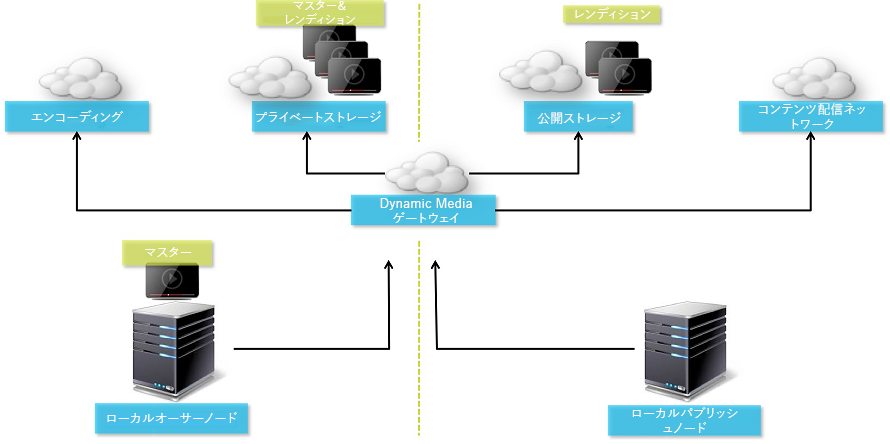

# Dynamic Media の設定 - ハイブリッドモード {#configuring-dynamic-media-hybrid-mode}

Dynamic Media - ハイブリッドを使用するには、有効化して設定する必要があります。Dynamic Media では、使用例に応じて、[サポートされる設定](#supported-dynamic-media-configurations)がいくつか用意されています。

>[!NOTE]
>
>Scene7 実行モードの Dynamic Media を設定して実行する場合は、[Dynamic Media - Scene7 モードの設定](/help/assets/config-dms7.md)を参照してください。
>
>ハイブリッド実行モードの Dynamic Media を設定して実行する場合は、このページの手順に従ってください。

Dynamic Media での[ビデオ](/help/assets/video.md)の操作方法を参照してください。

>[!NOTE]
>
>開発、ステージング、実稼動など、様々な環境に設定した Adobe Experience Manager を使用する場合は、環境ごとに Dynamic Media Cloud Services を設定します。

>[!NOTE]
>
>Dynamic Media の設定に問題がある場合は、Dynamic Media に固有のログファイルを確認します。これらのファイルは Dynamic Media を有効化するときに自動的にインストールされます。
>
>* `s7access.log`
>* `ImageServing.log`
>
>これらは、[Experience Manager インスタンスのモニターと保守](/help/sites-deploying/monitoring-and-maintaining.md)に記載されています。

ハイブリッド公開および配信は、Adobe Experience Manager に対して Dynamic Media によって追加される中心機能です。ハイブリッド公開によって、画像やビデオなどの Dynamic Media アセットを、Experience Manager パブリッシュノードの代わりにクラウドから配信することができます。

Dynamic Media ビューア、サイトページ、静的コンテンツなどのその他のコンテンツは、引き続き Experience Manager パブリッシュノードから配信されます。

Dynamic Media のユーザーは、すべての Dynamic Media コンテンツの配信メカニズムとしてハイブリッド配信を使用する必要があります。

## ビデオのハイブリッド公開アーキテクチャ {#hybrid-publishing-architecture-for-videos}



## 画像のハイブリッド公開アーキテクチャ {#hybrid-publishing-architecture-for-images}


## サポートされる Dynamic Media 設定 {#supported-dynamic-media-configurations}

各設定タスクで参照される用語を次に示します。

| **用語** | **ダイナミックメディア有効** | **説明** |
|---|---|---|
| Experience Manager 作成者ノード | 緑色の円の中に白色のチェックマーク | オンプレミスへ、または Managed Services を通じてデプロイするオーサーノード |
| Experience Manager 公開ノード | 赤色の四角の中に白色の「X」 | オンプレミスへ、または Managed Services を通じてデプロイするパブリッシュノード |
| 画像サービスのパブリッシュノード | 緑色の円の中に白色のチェックマーク | アドビによって管理されるデータセンター上で稼働するパブリッシュノード。画像サービスの URL を参照します。 |

Dynamic Media を画像専用、ビデオ専用、またはその両方の用途で実装できます。具体的なシナリオに合わせた Dynamic Media を設定する手順を決定するには、次の表を参照してください。

<table>
 <tbody>
  <tr>
   <td><strong>シナリオ</strong></td>
   <td ><strong>仕組み</strong></td>
   <td><strong>設定手順</strong></td>
  </tr>
  <tr>
   <td>実稼動環境に画像のみを配信する</td>
   <td>画像は世界各地のアドビのデータセンターのサーバーを介して配信されます。CDN を使用してキャッシュすることで、スケーラブルなパフォーマンスで全世界に展開できます。</td>
   <td>
    <ol>
     <li>Experience Manager <strong>オーサー</strong>ノードで、<a href="#enabling-dynamic-media">Dynamic Media を有効化</a>します。</li>
     <li>画像を<a href="#configuring-dynamic-media-cloud-services"> Dynamic Media クラウドサービス</a>で設定します。</li>
     <li><a href="#configuring-image-replication">画像のレプリケーションを設定</a>します。</li>
     <li><a href="#replicating-catalog-settings">カタログ設定をレプリケートする</a>.</li>
     <li><a href="#replicating-viewer-presets">ビューアプリセットをレプリケート</a>します。</li>
     <li><a href="#using-default-asset-filters-for-replication">レプリケーションへのデフォルトのアセットフィルターの使用</a>.</li>
     <li><a href="#configuring-dynamic-media-image-server-settings">Dynamic Media Image Server を設定</a>します。</li>
     <li><a href="#delivering-assets">アセットを配信</a>します。</li>
    </ol> </td>
  </tr>
  <tr>
   <td>実稼動前の環境（開発、品質評価、ステージングなど）に画像のみを配信する</td>
   <td>画像は Experience Manager パブリッシュノードを通じて配信されます。このシナリオでは、トラフィックが最小限となるので、画像をアドビのデータセンターに配信する必要はありません。また、実稼動環境の起動前に、コンテンツの安全にプレビューできます。</td>
   <td>
    <ol>
     <li>Experience Manager <strong>オーサー</strong>ノードで、<a href="#enabling-dynamic-media">Dynamic Media を有効化</a>します。</li>
     <li>Experience Manager <strong>パブリッシュ</strong>ノードで、<a href="#enabling-dynamic-media">Dynamic Media を有効化</a>します。</li>
     <li><a href="#replicating-viewer-presets">ビューアプリセットをレプリケート</a>します。</li>
     <li><a href="#setting-up-asset-filters-for-imaging-in-non-production-deployments">実稼動環境以外の画像用のアセットフィルター</a>をセットアップします。</li>
     <li><a href="#configuring-dynamic-media-image-server-settings">Dynamic Media Image Server を設定します。</a></li>
     <li><a href="#delivering-assets">アセットを配信します。</a></li>
    </ol> </td>
  </tr>
  <tr>
   <td>任意の環境（実稼動、開発、品質評価、ステージングなど）にビデオのみを配信する</td>
   <td>画像は CDN を使用してキャッシュすることで、スケーラブルなパフォーマンスで全世界に展開できます。ビデオのポスター画像（再生が開始される前に表示されるビデオのサムネール）が Experience Manager パブリッシュインスタンスにより配信されます。</td>
   <td>
    <ol>
     <li>Experience Manager <strong>オーサー</strong>ノードで、<a href="#enabling-dynamic-media">Dynamic Media を有効化</a>します。</li>
     <li>Experience Manager <strong>パブリッシュ</strong>ノードで、<a href="#enabling-dynamic-media">ダイナミックメディアを有効化</a>します（パブリッシュインスタンスがビデオのポスター画像を処理し、ビデオ再生用のメタデータを提供します）。</li>
     <li><a href="#configuring-dynamic-media-cloud-services">Dynamic Media クラウドサービス</a>でビデオを設定します。</li>
     <li><a href="#replicating-viewer-presets">ビューアプリセットをレプリケート</a>します。</li>
     <li><a href="#setting-up-asset-filters-for-video-only-deployments">ビデオ専用のアセットフィルター</a>をセットアップします。</li>
     <li><a href="#delivering-assets">アセットを配信します。</a></li>
    </ol> </td>
  </tr>
  <tr>
   <td>実稼動環境に画像とビデオの両方を配信する</td>
   <td><p>画像は CDN を使用してキャッシュすることで、スケーラブルなパフォーマンスで全世界に展開できます。画像やビデオのポスター画像は世界各地のアドビのデータセンターのサーバーを介して配信されます。CDN を使用してキャッシュすることで、スケーラブルなパフォーマンスで全世界に展開できます。</p> <p>実稼動前の環境での画像やビデオのセットアップ方法については、前の節を参照してください。 </p> </td>
   <td>
    <ol>
     <li>Experience Manager <strong>オーサー</strong>ノードで、<a href="#enabling-dynamic-media">Dynamic Media を有効化</a>します。</li>
     <li><a href="#configuring-dynamic-media-cloud-services">Dynamic Media クラウドサービス</a>でビデオを設定します。</li>
     <li>画像を<a href="#configuring-dynamic-media-cloud-services"> Dynamic Media クラウドサービス</a>で設定します。</li>
     <li><a href="#configuring-image-replication">画像のレプリケーションを設定</a>します。</li>
     <li><a href="#replicating-catalog-settings">カタログ設定をレプリケートする</a>.</li>
     <li><a href="#replicating-viewer-presets">ビューアプリセットをレプリケート</a>します。</li>
     <li><a href="#using-default-asset-filters-for-replication">レプリケーションにデフォルトのアセットフィルターを使用します。</a></li>
     <li><a href="#configuring-dynamic-media-image-server-settings">Dynamic Media Image Server を設定します。</a></li>
     <li><a href="#delivering-assets">アセットを配信します。</a></li>
    </ol> </td>
  </tr>
 </tbody>
</table>

## Dynamic Media の有効化 {#enabling-dynamic-media}

[Dynamic Media](https://business.adobe.com/jp/products/experience-manager/assets/dynamic-media.html) はデフォルトで無効になっています。Dynamic Media の機能を活用するには、`publish` 実行モードなどの場合と同様に、`dynamicmedia` 実行モードを使用して Dynamic Media を有効にする必要があります。有効にする前に、[技術要件](/help/sites-deploying/technical-requirements.md#requirements-for-aem-dynamic-media-add-on)を確認してください。

>[!NOTE]
>
>Experience Manager 6.1 および Experience Manager 6.0 では Dynamic Media を有効にする場合 `dynamicMediaEnabled` フラグを **[!UICONTROL true]** に設定していましたが、このバージョンでは Dynamic Media は実行モードで有効にしています。このフラグは Experience Manager 6.2 以降では機能しません。さらに、クイックスタートを再起動して Dynamic Media を有効にする必要はありません。

Dynamic Media を有効にすることで、Dynamic Media の機能が UI で使用可能になり、アップロードされたすべての画像アセットに *cqdam.pyramid.tiff* レンディションが作成され、このレンディションを使用してダイナミック画像レンディションの高速配信が行われます。これらの PTIFF には、次のような大きな利点があります。

* 1 つのプライマリソース画像のみを管理し、追加のストレージを使用せずに無限のレンディションをその場で生成する機能。
* ズーム、パン、スピンなどのインタラクティブなビジュアライゼーションを使用する機能。

Experience Manager で Dynamic Media Classic を使用する場合、[特定のシナリオ](/help/sites-administering/scene7.md#aem-scene-integration-versus-dynamic-media)を使用する場合以外は、Dynamic Media を有効にしないでください。Dynamic Media は、実行モードを使用して有効にしない限り、無効化されたままです。

Dynamic Media を有効にするには、コマンドラインまたはクイックスタートのファイル名から Dynamic Media の実行モードを有効にする必要があります。

**Dynamic Media を有効にするには：**

1. コマンドラインでクイックスタートを起動するときに、次のようにします。

   * jar ファイルを開始するときにコマンドラインの最後に `-r dynamicmedia` を追加します。

   ```shell
   java -Xmx4096m -Doak.queryLimitInMemory=500000 -Doak.queryLimitReads=500000 -jar cq-quickstart-6.5.0.jar -r dynamicmedia
   ```

   s7delivery に公開する場合は、次の trustStore 引数も含める必要があります。

   ```
   -Djavax.net.ssl.trustStore=<absoluteFilePath>/customerTrustStoreFileName>
   
    -Djavax.net.ssl.trustStorePassword=<passwordForTrustStoreFile>
   ```

1. `https://localhost:4502/is/image` をリクエストし、Image Server が実行中であることを確認します。

   >[!NOTE]
   >
   >Dynamic Media の問題のトラブルシューティングについては、`crx-quickstart/logs/` ディレクトリの以下のログを参照してください。
   >
   >* ImageServer-&lt;PortId>-&lt;yyyy>&lt;mm>&lt;dd>.log - ImageServer ログには、内部の ImageServer プロセスの動作を分析するために使用できる統計情報と分析情報があります。

   Image Server ログのファイル名の例：`ImageServer-57346-2020-07-25.log`
   * s7access-&lt;yyyy>&lt;mm>&lt;dd>.log - s7access ログには、`/is/image` および `/is/content` 経由で Dynamic Media に対して実行された各リクエストが記録されます。

   これらのログは、Dynamic Media が有効の場合のみ使用されます。これらのログは、`system/console/status-Bundlelist` ページから生成される「**すべてダウンロード**」パッケージには含まれません。Dynamic Media の問題がある場合は、カスタマーサポートに連絡する際にこれらのログも添付してください。

### Experience Manager を異なるポートやコンテキストパスにインストールした場合 {#if-you-installed-aem-to-a-different-port-or-context-path}

[Experience Manager をアプリケーションサーバーに導入し](/help/sites-deploying/application-server-install.md)、Dynamic Media を有効にしている場合は、Externalizer で&#x200B;**セルフドメイン**&#x200B;を設定する必要があります。そうしないと、アセットのサムネールの生成が Dynamic Media のアセットで正しく機能しません。

さらに、異なるポートまたはコンテキストパスでクイックスタートを実行する場合、**セルフドメイン**&#x200B;を変更する必要もあります。

Dynamic Media が有効の場合、画像アセットの静的サムネールレンディションが Dynamic Media を使用して生成されます。サムネール生成が Dynamic Media に対して正常に動作するためには、Experience Manager で自己に対して URL リクエストを実行する必要があり、ポート番号とコンテキストパスの両方を把握している必要があります。

Experience Manager：

* [Externalizer](/help/sites-developing/externalizer.md) の **セルフドメイン**&#x200B;がポート番号とコンテキストパスの両方を取得するために使用されます。
* **セルフドメイン**&#x200B;が設定されていない場合、ポート番号とコンテキストパスが Jetty HTTP サービスから取得されます。

Experience Manager クイックスタート WAR デプロイメントでは、ポート番号とコンテキストパスを抽出できないので、**セルフドメイン**&#x200B;を設定する必要があります。**セルフドメイン**&#x200B;の設定方法については、[Externalizer のドキュメント](/help/sites-developing/externalizer.md)を参照してください。

>[!NOTE]
[Experience Manager クイックスタートのスタンドアロンデプロイメント](/help/sites-deploying/deploy.md)では、ポート番号とコンテキストパスを自動設定できるので、通常&#x200B;**セルフドメイン**&#x200B;を設定する必要はありません。ただし、すべてのネットワークインターフェイスがオフになっている場合は、**セルフドメイン**&#x200B;を設定する必要があります。

## Dynamic Media を無効にする  {#disabling-dynamic-media}

Dynamic Media はデフォルトでは有効になっていません。ただし、以前に Dynamic Media を有効にした場合は、後で無効にすることができます。

いったん有効にした Dynamic Media を無効にするには、`-r dynamicmedia` 実行モードフラグを削除します。

**Dynamic Media を無効にするには：**

1. コマンドラインでクイックスタートを起動するときに、次のいずれかを実行します。

   * jar ファイルを開始するときにコマンドラインに `-r dynamicmedia` を追加しないでください。

   ```shell
   java -Xmx4096m -Doak.queryLimitInMemory=500000 -Doak.queryLimitReads=500000 -jar cq-quickstart-6.5.0.jar
   ```

1. `https://localhost:4502/is/image` をリクエストします。Dynamic Media が無効化されたことを示すメッセージが表示されます。

   >[!NOTE]
   Dynamic Media 実行モードを無効にすると、`cqdam.pyramid.tiff` レンディションを生成するワークフローステップは自動的にスキップされます。また、動的レンディションのサポートやその他の Dynamic Media 機能も無効になります。
   また、Experience Manager サーバーを設定した後で Dynamic Media 実行モードを無効にすると、その実行モードの下でアップロードされたアセットがすべて無効になることにも注意してください。

## （オプション）Dynamic Media のプリセットおよび設定を 6.3 から 6.5 にダウンタイムなしで移行 {#optional-migrating-dynamic-media-presets-and-configurations-from-to-zero-downtime}

Experience Manager - Dynamic Media を 6.3 から 6.5 にアップグレードする場合（ダウンタイムなしのデプロイメント機能を含むようになりました）、次の curl コマンドを実行する必要があります。このコマンドは、CRXDE Lite ですべてのプリセットと設定を `/etc` から `/conf` に移行します。

>[!NOTE]
Experience Manager インスタンスを互換性モードで実行する場合（互換性パッケージがインストールされている場合）、これらのコマンドを実行する必要はありません。

互換パッケージの有無を問わず、すべてのアップグレードについて、次の Linux curl コマンドを実行することにより、Dynamic Media に付属しているデフォルトの標準提供ビューアプリセットをコピーできます。

`curl -u admin:admin -X POST https://<server_address>:<server_port>/libs/settings/dam/dm/presets/viewer.pushviewerpresets.json`

作成されたカスタムのビューアプリセットと設定のすべてを `/etc` から `/conf` に移行するには、次の Linux® curl コマンドを実行します。

`curl -u admin:admin -X POST https://<server_address>:<server_port>/libs/settings/dam/dm/presets.migratedmcontent.json`

## 画像レプリケーションを設定します。 {#configuring-image-replication}

ダイナミックメディア画像配信は、ビデオのサムネールなどの画像アセットを Experience Manager Author から公開し、そのアセットをアドビのオンデマンドのレプリケーションサービス（レプリケーションサービスの URL）にレプリケートすることで機能します。その後、アセットはオンデマンド画像配信サービス（画像サービス URL）によって配信されます。

次の手順を実行します。

1. [認証を設定](#setting-up-authentication)します。
1. [レプリケーションエージェントを設定](#configuring-the-replication-agent)します。

レプリケーションエージェントは、画像、ビデオのメタデータ、セットなどのダイナミックメディアアセットを、アドビにホストされた画像サービスに公開します。レプリケーションエージェントはデフォルトでは有効でありません。

レプリケーションエージェントを設定後、[正しく設定されていることを検証およびテスト](#validating-the-replication-agent-for-dynamic-media)する必要があります。ここでは、これらの手順について説明します。

>[!NOTE]
PTIFF 作成のデフォルトのメモリ制限は、すべてのワークフローで 3 GB です。例えば、他のワークフローを一時停止して、3 GB のメモリを必要とする 1 個の画像を処理できます。または、それぞれ 300 MB のメモリを必要とする 10 個の画像を並行して処理できます。
このメモリ制限は変更でき、使用可能なシステムリソースおよび処理する画像コンテンツのタイプに合わせます。大きなアセットが多数あり、システムに十分なメモリがある場合、この制限を引き上げると、画像を並行して処理することができます。
最大メモリ制限を超えるメモリを必要とする画像は、拒否されます。
PTIFF 作成のメモリ制限を変更するには、**[!UICONTROL ツール]**／**[!UICONTROL 運営]**／**[!UICONTROL Web コンソール]**／**[!UICONTROL Adobe CQ Scene7 PTiffManager]** に移動して、**[!UICONTROL maxMemory]** の値を変更します。

### 認証の設定 {#setting-up-authentication}

Dynamic Media 画像配信サービスに画像をレプリケートするには、作成者にレプリケーション認証を設定します。最初にキーストアを取得し、次に **[!UICONTROL dynamic-media-replication]** ユーザーの下に保存して設定します。キーストアファイルとプロビジョニング処理中に必要な資格情報が記載されたようこそメールが会社の管理者に送信されます。この情報を受け取っていない場合は、アドビカスタマーサポートにお問い合わせください。

**認証を設定するには：**

1. キーストアファイルとパスワードをお持ちでない場合は、アドビカスタマーサポートにお問い合わせください。この情報は、プロビジョニングに必要な部分です。キーがアカウントに関連付けられます。

1. Experience Manager で、Experience Manager ロゴを選択してグローバルナビゲーションコンソールにアクセスし、**[!UICONTROL ツール]**／**[!UICONTROL セキュリティ]**／**[!UICONTROL ユーザー]**&#x200B;に移動してください。

1. ユーザー管理ページで **[!UICONTROL dynamic-media-replication]** ユーザーに移動し、選択して開きます。

   

1. dynamic-media-replication ページのユーザー設定の編集で、「**[!UICONTROL キーストア]**」タブを選択し、**[!UICONTROL キーストアを作成]**&#x200B;を選択します。

   

1. **[!UICONTROL キーストアアクセスパスワードを設定]**&#x200B;ダイアログボックスでパスワードを入力し、パスワードを確認します。

   >[!NOTE]
   このパスワードは覚えておいてください。後でレプリケーションエージェントを設定する際にもう一度入力する必要があります。

   

1. **[!UICONTROL dynamic-media-replication のユーザー設定を編集]**&#x200B;ページで「**秘密鍵をキーストアファイルから追加**」領域を展開し、以下の情報を追加します（下の画像を参照）。

   * 「**[!UICONTROL 新しいエイリアス]**」フィールドで、後でレプリケーション設定で使用するエイリアスの名前を入力します。例えば、 `replication` をエイリアスとして使用できます。
   * 「**[!UICONTROL キーストアファイル]**」を選択します。アドビから提供されたキーストアファイルに移動して選択し、「**[!UICONTROL 開く]**」をタップします。
   * 「**[!UICONTROL キーストアファイルパスワード]**」フィールドで、キーストアファイルパスワードを入力します。これは、手順 5 で作成したキーストアパスワード&#x200B;**ではなく**、プロビジョニング中に送信された「ようこそ」の電子メールでアドビから提供されたキーストアファイルパスワードです。キーストアファイルパスワードを受け取っていない場合は、アドビのカスタマーサポートにお問い合わせください。
   * 「**[!UICONTROL 秘密鍵のパスワード]**」フィールドで、秘密鍵のパスワードを入力します（以前の手順で指定した秘密鍵のパスワードと同じでも可）。秘密鍵のパスワードは、プロビジョニング中にアドビから送信されたようこそメールに記載されています。秘密鍵のパスワードを受け取っていない場合は、アドビのカスタマーサポートにお問い合わせください。
   * 「**[!UICONTROL 秘密鍵のエイリアス]**」フィールドに秘密鍵のエイリアスを入力します。例：`*companyname*-alias`。秘密鍵のエイリアスは、プロビジョニング中にアドビから送信されたようこそメールに記載されています。秘密鍵のエイリアスを受け取っていない場合は、アドビのカスタマーサポートにお問い合わせください。

   

1. **[!UICONTROL 保存して閉じる]**&#x200B;を選択して、このユーザーに対する変更を保存します。

   次に、[レプリケーションエージェントを設定](#configuring-the-replication-agent)する必要があります。

### レプリケーションエージェントを設定 {#configuring-the-replication-agent}

1. Experience Manager で、Experience Manager のロゴを選択してグローバルナビゲーションコンソールにアクセスし、**[!UICONTROL ツール]**／**[!UICONTROL デプロイメント]**／**[!UICONTROL レプリケーション]**／**[!UICONTROL 作成者のエージェント]**&#x200B;に移動してください。
1. 作成者のエージェントページで、**[!UICONTROL Dynamic Media ハイブリッド画像レプリケーション（s7delivery）]**&#x200B;を選択します。
1. 「**[!UICONTROL 編集]**」を選択します。
1. **[!UICONTROL 設定]**&#x200B;タブを選択してから、以下を入力してください。

   * **[!UICONTROL 有効]** - レプリケーションエージェントを有効にするには、このチェックボックスを選択します。
   * **[!UICONTROL 地域]** - 北米、ヨーロッパまたはアジアから適切な地域を設定します。
   * **[!UICONTROL テナント ID]** - この値は、レプリケーションサービスに公開している会社またはテナントの名前です。この値は、プロビジョニング中に送信された「ようこそメール」でアドビから提供されたテナント ID です。この情報を受け取っていない場合は、アドビカスタマーサポートにお問い合わせください。
   * **[!UICONTROL キーストアのエイリアス]** - この値は、[認証の設定](#setting-up-authentication)で鍵を生成するときに設定した、**新しいエイリアス**&#x200B;の値と同じです（例えば、`replication`）。（[認証の設定](#setting-up-authentication)のステップ 7 を参照。）
   * **[!UICONTROL キーストアのパスワード]** - **[!UICONTROL キーストアを作成]**&#x200B;をタップして作成したキーストアのパスワードです。このパスワードはアドビが提供するものではありません。[認証の設定](#setting-up-authentication)のステップ 5 を参照してください。

   次の画像はサンプルデータが入力されたレプリケーションエージェントを示します。

   

1. 「**[!UICONTROL OK]**」を選択します。

### Dynamic Media 用のレプリケーションエージェントの検証 {#validating-the-replication-agent-for-dynamic-media}

Dynamic Media 用のレプリケーションエージェントを検証するには、次の操作を実行します。

**[!UICONTROL 接続をテスト]**&#x200B;を選択します。次のように出力されます。

```shell
11.03.2016 10:57:55 - Transferring content for ReplicationAction{type=TEST, path[0]='/content/dam', time=1457722675402, userId='admin', revision='null'}
11.03.2016 10:57:55 - * Auth User: replication-receiver
11.03.2016 10:57:55 - * HTTP Version: 1.1
11.03.2016 10:57:55 - * Using OAuth 2.0 Authorization Grants
11.03.2016 10:57:55 - * OAuth 2.0 User: dynamic-media-replication
11.03.2016 10:57:55 - * OAuth 2.0 Token: '*****' initialized
11.03.2016 10:57:55 - Publishing: POST[https://replicate-na.assetsadobe.com:8580/is-publish/publish-receiver?Cmd=Test&RootId=xfpuu-6613]
11.03.2016 10:57:55 - Publish response: OK[]
11.03.2016 10:57:55 - Transfer succeeded in 141 ms for ReplicationAction{type=TEST, path[0]='/content/dam', time=1457722675402, userId='admin', revision='null'}
-------------------------------------------------------------------------------------------------------------------------------
Replication test succeeded
```

>[!NOTE]
次のいずれかを実行してチェックすることもできます。
* レプリケーションログをチェックして、アセットがレプリケートされていることを確認します。
* 画像をパブリッシュします。画像を選択してドロップダウンメニューから&#x200B;**[!UICONTROL ビューア]**&#x200B;を選択し、ビューアプリセットを選択します。**[!UICONTROL URL]**&#x200B;を選択します。画像が表示されることを確認するには、URL パスをコピーしてブラウザーに貼り付けます。
>


### 認証のトラブルシューティング {#troubleshooting-authentication}

認証を設定するときに発生する可能性がある問題と、その解決策を紹介します。問題を確認する前に、レプリケーションが設定済みであることを確認してください。

#### 問題：HTTP ステータスコード 401 が「Authorization Required（認可が必要）」というメッセージとともに返る {#problem-http-status-code-with-message-authorization-required}

この問題は、`dynamic-media-replication` ユーザーのキーストアの設定に失敗したことによって発生する可能性があります。

```shell
Replication test to s7delivery:https://s7bern.macromedia.com:8580/is-publish/
17.06.2016 18:54:43 - Transferring content for ReplicationAction{type=TEST, path[0]='/content/dam', time=1466214883309, userId='admin', revision='null'}
17.06.2016 18:54:43 - * Auth User: replication-receiver
17.06.2016 18:54:43 - * HTTP Version: 1.1
17.06.2016 18:54:43 - * Using OAuth 2.0 Authorization Grants
17.06.2016 18:54:43 - * OAuth 2.0 User: dynamic-media-replication
17.06.2016 18:54:43 - No OAuth token available. OAuth not initialized
17.06.2016 18:54:43 - * Using Client Auth SSL alias - replication-alias *
17.06.2016 18:54:43 - Publishing: POST[https://<localhost>:8580/is-publish//publish-receiver?Cmd=Test&RootId=brough]
17.06.2016 18:54:43 - Transfer failed for ReplicationAction{type=TEST, path[0]='/content/dam', time=1466214883309, userId='admin', revision='null'}. java.io.IOException: Failed to execute request
'https://<localhost>:8580/is-publish//publish-receiver?Cmd=Test&RootId=brough':
 Server returned status code 401 with message: Authorization required.
17.06.2016 18:54:43 - Error while replicating: com.day.cq.replication.ReplicationException: Transfer failed for ReplicationAction{type=TEST, path[0]='/content/dam', time=1466214883309,
 userId='admin', revision='null'}. java.io.IOException: Failed to execute request
'https://<localhost>:8580/is-publish//publish-receiver?Cmd=Test&RootId=brough':
 Server returned status code 401 with message: Authorization required.
```

**解決策**：
`KeyStore` が **dynamic-media-replication** ユーザーに対して保存され、正しいパスワードが設定されていることを確認します。

#### 問題：鍵を復号化できない - データを復号化できない {#problem-could-not-decrypt-key-could-not-decrypt-data}

```xml
Replication test to s7delivery:https://<localhost>:8580/is-publish/
17.06.2016 19:00:16 - Transferring content for ReplicationAction{type=TEST, path[0]='/content/dam', time=1466215216662, userId='admin', revision='null'}
17.06.2016 19:00:16 - * Auth User: replication-receiver
17.06.2016 19:00:16 - * HTTP Version: 1.1
17.06.2016 19:00:16 - * Using OAuth 2.0 Authorization Grants
17.06.2016 19:00:16 - * OAuth 2.0 User: dynamic-media-replication
17.06.2016 19:00:16 - No OAuth token available. OAuth not initialized
17.06.2016 19:00:16 - * Using Client Auth SSL alias - replication-alias *
17.06.2016 19:00:16 - Transfer failed for ReplicationAction{type=TEST, path[0]='/content/dam', time=1466215216662, userId='admin', revision='null'}. java.lang.SecurityException: java.security.UnrecoverableKeyException: Could not decrypt key: Could not decrypt data.
```

**解決策**：
パスワードを確認します。レプリケーションエージェントに保存されたパスワードがキーストアの作成に使用されたパスワードと同じでありません。

#### 問題：InvalidAlgorithmParameterException {#problem-invalidalgorithmparameterexception}

この問題は Experience Manager オーサーインスタンスの設定エラーが原因です。オーサー環境で Java™ プロセスが正しい `javax.net.ssl.trustStore` を取得していません。このエラーは次のレプリケーションログで確認できます。

```shell
14.04.2016 09:37:43 - Transfer failed for ReplicationAction{type=TEST, path[0]='/content/dam', time=1460651862089, userId='admin', revision='null'}. java.io.IOException: Failed to execute request 'https://<localhost>:8580/is-publish/publish-receiver?Cmd=Test&RootId=rbrough-osx2': java.lang.RuntimeException: Unexpected error: java.security.InvalidAlgorithmParameterException: the trustAnchors parameter must be non-empty
14.04.2016 09:37:43 - Error while replicating: com.day.cq.replication.ReplicationException: Transfer failed for ReplicationAction{type=TEST, path[0]='/content/dam', time=1460651862089, userId='admin', revision='null'}. java.io.IOException: Failed to execute request 'https://<localhost>:8580/is-publish/publish-receiver?Cmd=Test&RootId=rbrough-osx2': java.lang.RuntimeException: Unexpected error: java.security.InvalidAlgorithmParameterException: the trustAnchors parameter must be non-empty
```

または、次のエラーログで確認できます。

```shell
07.25.2019 12:00:59.893 *ERROR* [sling-threadpool-db2763bb-bc50-4bb5-bb64-10a09f432712-(apache-sling-job-thread-pool)-90-com_day_cq_replication_job_s7delivery(com/day/cq/replication/job/s7delivery)] com.day.cq.replication.Agent.s7delivery.queue Error during processing of replication.

java.io.IOException: Failed to execute request 'https://replicate-na.assetsadobe.com:8580/is-publish/publish-receiver?Cmd=Test&RootId=rbrough-osx': java.lang.RuntimeException: Unexpected error: java.security.InvalidAlgorithmParameterException: the trustAnchors parameter must be non-empty
        at com.scene7.is.catalog.service.publish.atomic.PublishingServiceHttp.executePost(PublishingServiceHttp.scala:195)
```

**解決策：**
Experience Manager Author の Java™ プロセスで、システムプロパティ `-Djavax.net.ssl.trustStore=` が有効なトラストストアに設定されていることを確認してください。

#### 問題：キーストアが設定されていないか初期化されていない {#problem-keystore-is-either-not-set-up-or-it-is-not-initialized}

この問題は、ホットフィックスまたは機能パックにより dynamic-media-user またはキーストアノードが上書きされたことが原因で発生する可能性があります。

レプリケーションログの例は次のとおりです。

```shell
Replication test to s7delivery:https://replicate-na.assetsadobe.com/is-publish
02.08.2016 14:37:44 - Transferring content for ReplicationAction{type=TEST, path[0]='/content/dam', time=1470173864834, userId='admin', revision='null'}
02.08.2016 14:37:44 - * Auth User: replication-receiver
02.08.2016 14:37:44 - * HTTP Version: 1.1
02.08.2016 14:37:44 - * Using OAuth 2.0 Authorization Grants
02.08.2016 14:37:44 - * OAuth 2.0 User: dynamic-media-replication
02.08.2016 14:37:44 - Transfer failed for ReplicationAction{type=TEST, path[0]='/content/dam', time=1470173864834, userId='admin', revision='null'}. com.adobe.granite.keystore.KeyStoreNotInitialisedException: Uninitialised key store for user dynamic-media-replication
```

**解決策：**

1. User Management ページに移動します。
   `localhost:4502/libs/granite/security/content/useradmin.html`
1. User Management ページで `dynamic-media-replication` ユーザーに移動し、選択して開きます。
1. **[!UICONTROL キーストア]**&#x200B;タブを選択します。**[!UICONTROL キーストアを作成]**&#x200B;ボタンが表示された場合は、前述の[認証の設定](#setting-up-authentication)の手順をやり直す必要があります。
1. キーストアの設定をやり直す必要があった場合は、[レプリケーションエージェントの設定](/help/assets/config-dynamic.md#configuring-the-replication-agent)も再度行う必要があります。

   s7delivery レプリケーションエージェントを再設定します。
   `localhost:4502/etc/replication/agents.author/s7delivery.html`

1. **[!UICONTROL 接続をテスト]**&#x200B;を選択すると、設定が有効であることを確認できます。

#### 問題：公開エージェントが OAuth ではなく SSL を使用している {#problem-publish-agent-is-using-ssl-instead-of-oauth}

この問題は、ホットフィックスまたは機能パックが正しくインストールされなかったか、設定を上書きしたために発生したと考えられます。

レプリケーションログの例は次のとおりです。

```shell
01.08.2016 18:42:59 - Transferring content for ReplicationAction{type=TEST, path[0]='/content/dam', time=1470073379634, userId='admin', revision='null'}
01.08.2016 18:42:59 - * Auth User: replication-receiver
01.08.2016 18:42:59 - * HTTP Version: 1.1
01.08.2016 18:42:59 - * Using Client Auth SSL alias - replication-receiver *
01.08.2016 18:42:59 - Publishing: POST[https://replicate-eu.assetsadobe2.com:443/is-publish/publish-receiver?Cmd=Test&RootId=altayerstaging]
01.08.2016 18:42:59 - Transfer failed for ReplicationAction{type=TEST, path[0]='/content/dam', time=1470073379634, userId='admin', revision='null'}. java.io.IOException: Failed to execute request 'https://replicate-eu.assetsadobe2.com:443/is-publish/publish-receiver?Cmd=Test&RootId=rbroughstaging': Server returned status code 401 with message: Authorization required.
01.08.2016 18:42:59 - Error while replicating: com.day.cq.replication.ReplicationException: Transfer failed for ReplicationAction{type=TEST, path[0]='/content/dam', time=1470073379634, userId='admin', revision='null'}. java.io.IOException: Failed to execute request 'https://replicate-eu.assetsadobe2.com:443/is-publish/publish-receiver?Cmd=Test&RootId=rbroughstaging': Server returned status code 401 with message: Authorization required.
```

**解決策：**

1. Experience Manager で、**[!UICONTROL ツール]**／**[!UICONTROL 一般]**／**[!UICONTROL CRXDE Lite]**&#x200B;と移動します。

   `localhost:4502/crx/de/index.jsp`

1. s7delivery レプリケーションエージェントノードに移動します。
   `localhost:4502/crx/de/index.jsp#/etc/replication/agents.author/s7delivery/jcr:content`

1. この設定をレプリケーションエージェントに追加します（値を **[!UICONTROL True]** に設定したブール値）。

   `enableOauth=true`

1. ページの左上隅付近にある「**[!UICONTROL すべて保存]**」を選択します。

### 設定のテスト {#testing-your-configuration}

アドビでは、エンドツーエンドで設定のテストを実施することをお勧めしています。

このテストを開始する前に、以下が実施済みであることを確認してください。

* 画像プリセットを追加した。
* クラウドサービスの下の **[!UICONTROL Dynamic Media 設定（6.3 以前）]**&#x200B;を設定する。このテストでは画像サービスの URL が必要です。

**設定をテストするには：**

1. 画像アセットをアップロードします。（Assets で、**[!UICONTROL 作成]**／**[!UICONTROL ファイル]**&#x200B;に移動してファイルを選択します。）
1. ワークフローが完了するまで待ちます。
1. 画像アセットを公開します（アセットを選択して&#x200B;**[!UICONTROL クイック公開]**&#x200B;を選択します。）
1. 画像を開いて画像のレンディションに移動し、「**[!UICONTROL レンディション]**」をタップします。

   

1. 任意の動的レンディションを選択します。
1. このアセットの URL を取得するには、「**[!UICONTROL URL]**」を選択します。
1. 選択した URL に移動して画像が期待どおりに動作するかどうかを確認します。

アセットが配信されたことをテストするもう 1 つの方法は、URL に req=exists を追加することです。

## Dynamic Media クラウドサービスの設定 {#configuring-dynamic-media-cloud-services}

Dynamic Media クラウドサービスは、画像とビデオのハイブリッド公開および配信、ビデオ分析、ビデオエンコーディングなどをサポートします。

設定の一環として、登録 ID、ビデオサービス URL、画像サービス URL、レプリケーションサービス URL を入力し、認証を設定する必要があります。この情報は、アカウントプロビジョニングプロセスの一環としてメールでお送りしています。この情報を受け取っていない場合は、Adobe Experience Manager の管理者または Adobe のカスタマーサポートに問い合わせて情報を入手してください。

>[!NOTE]
Dynamic Media クラウドサービスを設定する前に、パブリッシュインスタンスを設定しておく必要があります。Dynamic Media クラウドサービスを設定する前に、レプリケーションも設定しておく必要があります。

**Dynamic Media クラウドサービスを設定するには：**

1. Experience Manager で、Experience Manager のロゴを選択してグローバルナビゲーションコンソールにアクセスし、**[!UICONTROL ツール]**／**[!UICONTROL クラウドサービス]**／**[!UICONTROL Dynamic Media 設定（6.3 以前）]**&#x200B;に移動します。
1. Dynamic Media 設定ブラウザーページの左側のペインで「**[!UICONTROL グローバル]**」を選択し、「**[!UICONTROL 作成]**」を選択します。
1. **[!UICONTROL Dynamic Media 設定を作成]**&#x200B;ダイアログボックスで、「タイトル」フィールドにタイトルを入力します。
1. ビデオ用に Dynamic Media を設定する場合は、次の操作をおこないます。

   * 「**[!UICONTROL 登録 ID]**」フィールドに登録 ID を入力します。
   * 「**[!UICONTROL ビデオサービスの URL]**」フィールドに、Dynamic Media ゲートウェイのビデオサービス URL を入力します。

1. 画像用に Dynamic Media を設定する場合は、「**[!UICONTROL 画像サービスの URL]**」フィールドに Dynamic Media ゲートウェイの画像サービスの URL を入力します。
1. 「**[!UICONTROL 保存]**」を選択して Dynamic Media 設定ブラウザーページに戻ります。
1. グローバルナビゲーションコンソールにアクセスするには、Experience Manager のロゴを選択します。

## ビデオレポートの設定 {#configuring-video-reporting}

Dynamic Media ハイブリッドを使用する複数の Experience Manager インストールにまたがってビデオレポートを設定できます。

**用途：** Dynamic Media 設定（6.3 以前）を設定すると、ビデオレポートを含む様々な機能が開始されます。設定時には、地域の Analytics 企業内にレポートスイートが作成されます。複数のオーサーノードを設定すると、ノードごとに異なるレポートスイートが作成されます。このため、インストール間でレポートデータの整合性が取れなくなります。さらに、すべてのオーサーノードが同じハイブリッドパブリッシュサーバーを参照している場合、最後のオーサーノードでのインストール時に、すべてのビデオレポートの報告先となるレポートスイートが変更されてしまいます。この問題が発生すると、過剰な数のレポートスイートによって Analytics システムが過負荷状態に陥ります。

**手順概要：**&#x200B;ビデオレポートを設定するには、以下の 3 つのタスクを実行します。

1. 最初のオーサーノードで Dynamic Media 設定（6.3 以前）を設定した後、ビデオ分析プリセットパッケージを作成します。この最初のタスクは重要です。これにより、新しい設定でも引き続き同じレポートスイートを使用できるからです。
1. Dynamic Media 設定（6.3 以前）を設定する&#x200B;***前に***、***新しい***&#x200B;オーサーノードにビデオ分析プリセットパッケージをインストールします。
1. パッケージインストールの検証とデバッグを行います。

### 最初のオーサーノードの設定後にビデオ分析プリセットパッケージを作成 {#creating-a-video-analytics-preset-package-after-configuring-the-first-author-node}

このタスクが完了すると、ビデオ分析プリセットを含むパッケージファイルが得られます。これらのプリセットには、レポートスイート、トラッキングサーバー、トラッキング名前空間および Experience Cloud 組織 ID（利用可能な場合）が含まれます。

1. Dynamic Media 設定（6.3 以前）をまだ設定していない場合は、設定します。
1. （オプション）レポートスイート ID を表示してコピーします（JCR へのアクセス権が必要）。レポートスイート ID は必須ではありませんが、あると確認が容易になります。
1. パッケージマネージャーを使用してパッケージを作成します。
1. パッケージを編集してフィルターを含めます。

   Experience Manager：`/conf/global/settings/dam/dm/presets/analytics/jcr:content/userdata`

1. パッケージをビルドします。
1. ビデオ分析プリセットパッケージを後続の新しいオーサーノードで共有できるように、パッケージをダウンロードまたは共有します。

### 追加のオーサーノードを設定する前にビデオ分析プリセットパッケージをインストールする {#installing-the-video-analytics-preset-package-before-you-configure-additional-author-nodes}

このタスクは、Dynamic Media 設定（6.3 より前）を行う&#x200B;***前に***&#x200B;実施してください。そうしないと、別の未使用のレポートスイートが作成されてしまいます。さらに、ビデオレポートは正しく動作し続けるものの、データの収集が最適化されません。

最初のオーサーノードからの Video Analytics プリセットパッケージに、新しいオーサーノードからアクセスできることを確認してください。

1. 先ほど作成したビデオ分析プリセットパッケージをパッケージマネージャーにアップロードします。
1. ビデオ分析プリセットパッケージをインストールします。
1. Dynamic Media 設定（6.3 以前）を設定します。

### パッケージインストールの検証とデバッグ {#verifying-and-debugging-the-package-installation}

1. 次のいずれかを実施してパッケージのインストールを検証し、必要に応じてデバッグを行います。

   * **JCR 経由で Video Analytics プリセットをチェックする**
JCR 経由で Video Analytics プリセットをチェックするには、CRXDE Lite にアクセスできる必要があります。

      Experience Manager の CRXDE Lite で、次に移動します。`/conf/global/settings/dam/dm/presets/analytics/jcr:content/userdata`

      例：`https://localhost:4502/crx/de/index.jsp#/conf/global/settings/dam/dm/presets/analytics/jcr%3Acontent/userdata`

      オーサーノードの CRXDE Lite にアクセスできない場合は、パブリッシュサーバーを通じてプリセットを確認できます。

   * **Image Server でビデオ分析プリセットを確認する**

      Image Server の req=userdata リクエストを実行することで、ビデオ分析プリセットを直接検証できます。
例えば、オーサーノードで分析プリセットを表示するには、次のリクエストを実行します。

      `https://localhost:4502/is/image/conf/global/settings/dam/dm/presets/analytics?req=userdata`

      パブリッシュサーバーでプリセットを検証するには、パブリッシュサーバーに対して同様のリクエストを直接実行します。応答はオーサーノードとパブリッシュノードで同じになります。レスポンスは次のようになります。

      ```
      marketingCloudOrgId=0FC4E86B573F99CC7F000101
       reportSuite=aemaem6397618-2018-05-23
       trackingNamespace=aemvideodal
       trackingServer=aemvideodal.d2.sc.omtrdc.net
      ```

   * **Experience Manager のビデオレポートツールを使用して、ビデオ分析プリセットを確認します。**
**[!UICONTROL ツール]**／**[!UICONTROL アセット]**／**[!UICONTROL ビデオレポート]**&#x200B;に移動します。

      `https://localhost:4502/mnt/overlay/dam/gui/content/s7dam/videoreports/videoreport.html`

      次のエラーメッセージが表示された場合は、レポートスイートは使用可能ですが、未入力です。新しいインストールでは、システムがデータの収集を開始する前であれば、このエラーは正しく、むしろ望ましいと言えます。
   

   レポートデータを生成するには、1 つのビデオをアップロードして公開します。「**[!UICONTROL URL をコピー]**」を使用し、ビデオを 1 回以上再生します。

   ビデオビューアの使用に基づいてレポートデータが格納されるまで、最大 12 時間かかる可能性があります。

    エラーが発生し、レポートスイートが正しく設定されない場合は、次のアラートが表示されます。

   

   このエラーは、Dynamic Media 設定（6.3 より前）サービスの設定前にビデオレポートを実行した場合にも表示されます。

### ビデオレポートの設定のトラブルシューティング {#troubleshooting-the-video-reporting-configuration}

* インストール中に Analytics API サーバーへの接続がタイムアウトすることがあります。インストール中に接続が 20 回再試行されますが、それでも失敗します。この状況が発生すると、ログファイルに複数のエラーが記録されます。`SiteCatalystReportService` を検索します。
* 最初に分析プリセットパッケージをインストールしないと、レポートスイートが新規作成されてしまう可能性があります。
* Experience Manager 6.3 からExperience Manager 6.4 またはExperience Manager 6.4.1 にアップグレードした後で、Dynamic Media 設定（6.3 以前）を設定すると、引き続きレポートスイートが作成されます。これは既知の問題であり、AEM 6.4.2 で修正される予定です。

### ビデオ分析プリセットについて {#about-the-video-analytics-preset}

ビデオ分析プリセット（単に分析プリセットと呼ばれることもある）は、Dynamic Media 内でビューアプリセットの隣に格納されます。これは基本的にはビューアプリセットと同じですが、AppMeasurement および Video Heartbeat レポートの設定に使用される情報が付加されています。

このプリセットのプロパティは次のとおりです。

* `reportSuite`
* `trackingServer`
* `trackingNamespace`
* `marketingCloudOrgId` ( 古いバージョンの Experience Manager には存在しません )

Experience Manager 6.4 以降のバージョンでは、このプリセットを `/conf/global/settings/dam/dm/presets/analytics/jcr:content/userdata` に保存します。

## カタログ設定をレプリケートする {#replicating-catalog-settings}

設定プロセスの一環として、ご自身のデフォルトのカタログ設定を JCR を通じて公開する必要があります。カタログ設定をレプリケートするには、以下の手順に従います。

1. ターミナルウィンドウで以下を実行します。

   `curl -u admin:admin localhost:4502/libs/settings/dam/dm/presets/viewer.pushviewerpresets`

1. Experience Manager で、CRXDE Lite の次の場所に移動します（管理者権限が必要です）。

   `https://<*server*>:<*port*>/crx/de/index.jsp#/conf/global/settings/dam/dm/imageserver/`

1. 「**[!UICONTROL レプリケーション]**」タブを選択します。
1. 「**[!UICONTROL レプリケーション]**」を選択します。

## ビューアプリセットをレプリケートします。 {#replicating-viewer-presets}

ビューアプリセットを使用して *アセットを配信するには、* ビューアプリセットをレプリケートおよび公開する必要があります。（アセットの URL または埋め込みコードを取得するには、すべてのビューアプリセットをアクティブ化&#x200B;*および*&#x200B;レプリケートする必要があります。詳細情報に関しては、[ビューアプリセットを公開する](/help/assets/managing-viewer-presets.md#publishing-viewer-presets)を参照してください。

>[!NOTE]
デフォルトの場合、アセットの詳細表示で、「**[!UICONTROL レンディション]**」を選択すると、システムは様々なレンディションを表示し、「**[!UICONTROL ビューア]**」を選択すると、様々なビューアプリセットを表示します。表示される数を増減させることができます。[表示される画像プリセットの数を増やす](/help/assets/managing-image-presets.md#increasing-or-decreasing-the-number-of-image-presets-that-display)または[表示されるビューアプリセットの数を増やす](/help/assets/managing-viewer-presets.md#increasing-the-number-of-viewer-presets-that-display)を参照してください。

## レプリケーション用のアセットのフィルタリング {#filtering-assets-for-replication}

Dynamic Media 以外のデプロイメントでは、*すべて*&#x200B;のアセット（画像とビデオの両方）を Experience Manager オーサー環境から Experience Manager パブリッシュノードにレプリケートします。Experience Manager のパブリッシュサーバーもアセットを配信するので、このワークフローが必要になります。

ただし Dynamic Media のデプロイメントでは、アセットがクラウドによって配信されるので、上記のアセットを Experience Manager パブリッシュノードにレプリケートする必要がありません。そのような「ハイブリッドパブリッシング」ワークフローでは、ストレージコストの増大を防ぎ、アセットをレプリケートするための処理時間を短縮します。Dynamic Media ビューア、サイトページ、静的コンテンツなどのその他のコンテンツは、引き続き Experience Manager パブリッシュノードから配信されます。

アセットのレプリケートに加えて、次のアセット以外の要素もレプリケートされます。

* Dynamic Media 配信設定：`/conf/global/settings/dam/dm/imageserver/jcr:content`
* 画像プリセット：`/conf/global/settings/dam/dm/presets/macros`
* ビューアプリセット：`/conf/global/settings/dam/dm/presets/viewer`

フィルターによって、アセットを Experience Manager パブリッシュノードへのレプリケート対象から&#x200B;*除外*&#x200B;することができます。

### レプリケーションへのデフォルトのアセットフィルターの使用 {#using-default-asset-filters-for-replication}

Dynamic Media を（1）実稼動で画像に使用している場合、*または*（2）画像とビデオに使用している場合は、Adobe が提供するデフォルトのフィルターをそのまま使用できます。以下のフィルターがデフォルトでアクティブです。

<table>
 <tbody>
  <tr>
   <td> </td>
   <td><strong>フィルター</strong></td>
   <td><strong>MIME タイプ</strong></td>
   <td><strong>レンディション</strong></td>
  </tr>
  <tr>
   <td>Dynamic Media 画像配信</td>
   <td><p>filter-images</p> <p>filter-sets</p> <p> </p> </td>
   <td><p><strong>image/</strong> で始まる</p> <p><strong>application/</strong> を含み、<strong>set</strong> で終わる</p> </td>
   <td>標準提供の「filter-images」（インタラクティブな画像などの単一の画像アセットに適用）および「filter-sets」（スピンセット、画像セット、混在メディアセットおよびカルーセルセット）では、次のようになります。
    <ul>
     <li>PTIFF 画像とメタデータ（<strong>cqdam</strong> で始まるすべてのレンディション）がレプリケーションに含まれます。</li>
     <li>オリジナル画像と静的画像レンディションがレプリケーションから除外されます。</li>
    </ul> </td>
  </tr>
  <tr>
   <td>ダイナミックメディアビデオ配信</td>
   <td>filter-video</td>
   <td><strong>video/</strong> で始まる</td>
   <td>標準提供の「filter-video」では、次のようになります。
    <ul>
     <li>プロキシビデオのレンディション、ビデオサムネールやポスター画像、メタデータ（親ビデオとビデオレンディションの両方）がレプリケーションに含まれます（<strong>cqdam</strong> で始まるすべてのレンディション）。</li>
     <li>オリジナルのビデオと静的サムネールのレンディションはレプリケーションから除外されます。<br /> <br /> <strong>メモ：</strong>プロキシビデオのレンディションはバイナリを含まず、ノードプロパティのみになります。このため、公開者のリポジトリサイズへの影響はありません。</li>
    </ul> </td>
  </tr>
  <tr>
   <td>Dynamic Media Classic（Scene7）統合</td>
   <td><p>filter-images</p> <p>filter-sets</p> <p>filter-video</p> </td>
   <td><p><strong>image/</strong> で始まる</p> <p><strong>application/</strong> を含み、<strong>set</strong> で終わる</p> <p><strong>video/</strong> で始まる</p> </td>
   <td><p>Adobe Dynamic Media クラウドレプリケーションサービスの URL ではなく、Experience Manager パブリッシュサーバーを指すようにトランスポート URI を設定します。このフィルターを設定すると、Experience Manager パブリッシュインスタンスではなく、Dynamic Media Classic でアセットを配信できます。</p> <p>デフォルトの「filter-images」、「filter-sets」、「filter-video」では次のようになります。</p>
    <ul>
     <li>PTIFF 画像、プロキシビデオのレンディション、メタデータがレプリケーションに含まれます。ただし、Experience Manager - Dynamic Media Classic 統合を実行している場合は、これらは JCR に存在しないので、実質的には何も起こりません。</li>
     <li>オリジナル画像、静的画像レンディション、オリジナルビデオ、静的サムネールのレンディションがレプリケーションから除外されます。代わりに、Dynamic Media Classic が画像およびビデオのアセットを配信します。</li>
    </ul> </td>
  </tr>
 </tbody>
</table>

>[!NOTE]
フィルターは、MIME タイプに適用されます。パスを指定することはできません。

### ビデオ専用デプロイメントでのアセットフィルターのセットアップ {#setting-up-asset-filters-for-video-only-deployments}

Dynamic Media をビデオのみに使用している場合は、次の手順に従ってレプリケーション用のアセットフィルターを設定します。

1. Experience Manager で、Experience Manager のロゴを選択してグローバルナビゲーションコンソールにアクセスし、**[!UICONTROL ツール]**／**[!UICONTROL デプロイメント]**／**[!UICONTROL レプリケーション]**／**[!UICONTROL 作成者のエージェント]**&#x200B;に移動します。
1. 作成者のエージェントページで、「**[!UICONTROL デフォルトエージェント（公開）]**」を選択します。
1. 「**[!UICONTROL 編集]**」を選択します。
1. **[!UICONTROL エージェントの設定]**&#x200B;ダイアログボックスの「**[!UICONTROL 設定]**」タブで、「**[!UICONTROL 有効]**」のチェックをオンにしてエージェントを有効にします。
1. 「**[!UICONTROL OK]**」を選択します。
1. Experience Manager で、**[!UICONTROL ツール]**／**[!UICONTROL 一般]**／**[!UICONTROL CRXDE Lite]**&#x200B;に移動します。
1.  左側のフォルダーツリーで、`/etc/replication/agents.author/dynamic_media_replication/jcr:content/damRenditionFilters` に移動します。
1. **[!UICONTROL filter-video]** を探して右クリックし、「**[!UICONTROL コピー]**」を選択します。
1. 左側のフォルダーツリーで、`/etc/replication/agents.author/publish` に移動します。
1. `jcr:content` を探して右クリックし、「**[!UICONTROL 貼り付け]**」を選択します。

これにより、再生に必要なビデオのポスター画像とビデオのメタデータを配信するように、Experience Manager のパブリッシュインスタンスが設定されます。ビデオ自体は、Dynamic Media クラウドサービスによって配信されます。また、パブリッシュインスタンスに不要な元のビデオと静的なサムネールのレンディションがフィルターによってレプリケーションから除外されます。

### 実稼動以外のデプロイメントでの画像用アセットフィルターのセットアップ {#setting-up-asset-filters-for-imaging-in-non-production-deployments}

実稼動以外のデプロイメントで画像に Dynamic Media を使用している場合は、次の手順に従ってレプリケーション用のアセットフィルターを設定します。

1. Experience Manager で、Experience Manager のロゴを選択してグローバルナビゲーションコンソールにアクセスし、**[!UICONTROL ツール]**／**[!UICONTROL デプロイメント]**／**[!UICONTROL レプリケーション]**／**[!UICONTROL 作成者のエージェント]**&#x200B;に移動します。
1. 作成者のエージェントページで、「**[!UICONTROL デフォルトエージェント（公開）]**」を選択します。
1. 「**[!UICONTROL 編集]**」を選択します。
1. **[!UICONTROL エージェントの設定]**&#x200B;ダイアログボックスの「**[!UICONTROL 設定]**」タブで、「**[!UICONTROL 有効]**」のチェックをオンにしてエージェントを有効にします。
1. 「**[!UICONTROL OK]**」を選択します。
1. Experience Manager で、**[!UICONTROL ツール]**／**[!UICONTROL 一般]**／**[!UICONTROL CRXDE Lite]**&#x200B;に移動します。
1. 左側のフォルダーツリーで、`/etc/replication/agents.author/dynamic_media_replication/jcr:content/damRenditionFilters` に移動します。

   

1. **[!UICONTROL filter-images]** を探して右クリックし、「**[!UICONTROL コピー]**」を選択します。
1. 左側のフォルダーツリーで、`/etc/replication/agents.author/publish` に移動します。
1. `jcr:content` を探して右クリックし、**[!UICONTROL 作成]**／**[!UICONTROL ノードを作成]**&#x200B;に移動します。タイプ `nt:unstructured` の名前 `damRenditionFilters` を入力します。
1. `damRenditionFilters` を探して右クリックし、「**[!UICONTROL 貼り付け]**」を選択します。

これらの手順により、Experience Manager パブリッシュインスタンスを設定して、実稼動以外の環境に画像を配信します。また、パブリッシュインスタンスに不要な元の画像と静的なレンディションがフィルターによってレプリケーションから除外されます。

>[!NOTE]
1 人の作成者に異なるフィルターが多数ある場合は、各エージェントに異なるユーザーを割り当てる必要があります。Granite コードでは、ユーザーごとに 1 つのフィルターというモデルが適用されます。フィルターを設定するたびに、必ず異なるユーザーを使用してください。
1 つのサーバーで複数のフィルターを使用していますか？例えば、公開するレプリケーション用にフィルターを 1 つ使用し、s7delivery 用にもう 1 つフィルターを使用しているケースです。その場合は、`jcr:content` ノードで、これら 2 つのフィルターに異なる **userId** を割り当てる必要があります。次の画像を参照してください。


### レプリケーション用のアセットフィルターのカスタマイズ（オプション） {#customizing-asset-filters-for-replication}

1. Experience Manager で、Experience Manager ロゴを選択してグローバルナビゲーションコンソールにアクセスし、**[!UICONTROL ツール]**／**[!UICONTROL 一般]**／**[!UICONTROL CRXDE Lite]** に移動します。
1. 左側のフォルダーツリーで、`/etc/replication/agents.author/dynamic_media_replication/jcr:content/damRenditionFilters` に移動し、フィルターを確認します。

   

1. フィルターの MIME タイプを定義するために、次のように MIME タイプを特定することができます。

   左側のパネルで `content > dam > <locate_your_asset> >  jcr:content > metadata` と展開し、テーブルで `dc:format` を見つけます。

   次の図は、アセットの `dc:format` へのパスの例を示しています。

   

   アセット `Fiji Red.jpg` の `dc:format` が `image/jpeg` であることを確認してください。

   このフィルターを形式に関係なくすべての画像に適用するには、値を `image/*` に設定します。`*` は、あらゆる形式のすべての画像に適用される正規表現です。

   このフィルターを JPEG タイプの画像のみに適用するには、`image/jpeg` という値を入力します。

1. レプリケーションに含める、または除外するレンディションを定義します。

   レプリケーション用のフィルターに使用できる文字は次のとおりです。

   | 使用する文字 | レプリケーション用のアセットのフィルター方法 |
   | --- | --- |
   | `*` | ワイルドカード文字 |
   | `+` | レプリケーション用にアセットを含める |
   | `-` | レプリケーションからアセットを除外する |

   `content/dam/<locate your asset>/jcr:content/renditions` に移動します。

   次の図は、アセットのレンディションの例を示しています。

   

   上記の例を使用して PTIFF（Pyramid TIFF）のみをレプリケートする場合は、`+cqdam,*` と入力します。この値は、`cqdam` で始まるすべてのレンディションを含むことを示します。この例では、該当するレンディションは `cqdam.pyramid.tiff` です。

   オリジナルのみをレプリケートする場合は、`+original` と入力します。

## Dynamic Media 画像サーバーの設定 {#configuring-dynamic-media-image-server-settings}

Dynamic Media 画像サーバーの設定では、Adobe CQ Scene7 ImageServer バンドルと Adobe CQ Scene7 PlatformServer バンドルの編集をおこないます。

>[!NOTE]
Dynamic Media は、[有効にした後](#enabling-dynamic-media)、すぐに標準の機能を実行することができます。ただし、オプションで、Dynamic Media 画像サーバーを特定の仕様や要件に合うように設定することで、インストール環境を細かく調整することもできます。

**前提条件** - Dynamic Media 画像サーバーを設定する&#x200B;*前に*、Windows® の VM に Microsoft® Visual C++ ライブラリがインストールされていることを確認します。Dynamic Media 画像サーバーを実行するには、このライブラリが必要です。[ここから Microsoft® Visual C++ 2010 再頒布可能パッケージ（x64）をダウンロード](https://www.microsoft.com/ja-jp/download/details.aspx?id=26999)できます。

Dynamic Media 画像サーバーを設定するには：

1. Experience Manager の左上隅にある「**[!UICONTROL Adobe Experience Manager]**」を選択してグローバルナビゲーションコンソールにアクセスし、**[!UICONTROL ツール]**／**[!UICONTROL 操作]**／**[!UICONTROL Web コンソール]**&#x200B;の順に移動します。
1. Adobe Experience Manager Web コンソール設定ページで、**[!UICONTROL OSGi]**／**[!UICONTROL 設定]**&#x200B;の順に移動し、Experience Manager で現在実行中のすべてのバンドルをリストします。

   Dynamic Media 配信サーバーは、リスト内の次の名前の下にあります。

   * `Adobe CQ Scene7 ImageServer`
   * `Adobe CQ Scene7 PlatformServer`

1. バンドルのリストで、Adobe CQ Scene7 ImageServer の右側にある「**[!UICONTROL 編集]**」アイコンを選択します。
1. Adobe CQ Scene7 ImageServer ダイアログボックスで、次の設定値を指定します。

   >[!NOTE]
   通常は、デフォルト値を変更する必要はありません。ただし、デフォルト値を変更する場合は、変更内容を適用するためにバンドルを再起動する必要があります。

   | プロパティ | デフォルト値 | 説明 |
   | --- | --- | --- |
   | `TcpPort.name` | *`empty`* | ImageServer プロセスとの通信に使用するポート番号。デフォルトでは、空きのポートが自動的に検出されます。 |
   | `AllowRemoteAccess.name` | *`empty`* | Image Server プロセスへのリモートアクセスを許可または拒否します。false の場合、Image Server はローカルホストでのみリッスンします。<br> localhost を指すデフォルトの Externalizer 設定では、特定の VM インスタンスの実際のドメインまたは IP アドレスを指定する必要があります。これは、localhost が VM の親システムを指しているためです。<br>VM のドメインまたは IP アドレスには、自身を解決できるようにホストファイルのエントリを含む必要がある場合があります。 |
   | `MaxRenderRgnPixels` | 16 MP | レンダリングされる最大サイズ（メガピクセル単位）。 |
   | `MaxMessageSize` | 16 MB | 配信されるメッセージの最大サイズ（メガバイト単位）。 |
   | `RandomAccessUrlTimeout` | 20 | JCR がタイル範囲リクエストに応答するまで Image Server が待つ時間（秒）を表すタイムアウト値。 |
   | `WorkerThreads` | 10 | ワーカースレッドの数。 |

1. 「**[!UICONTROL 保存]**」を選択します。
1. バンドルのリストで、Adobe CQ Scene7 PlatformServer の右にある「**[!UICONTROL 編集]**」アイコンを選択します。
1. 「Adobe CQ Scene7 Platform Server」ダイアログボックスで、次のデフォルト値のオプションを設定します。

   >[!NOTE]
   Dynamic Media Image Server は、独自のディスクキャッシュを使用して応答をキャッシュします。Experience Manager の HTTP キャッシュと Dispatcher を使用して Dynamic Media 画像サーバーからの応答をキャッシュすることはできません。

   | プロパティ | デフォルト値 | 説明 |
   |---|---|---|
   | Cache enabled | チェック済み | 応答キャッシュを有効にするかどうか |
   | Cache roots | キャッシュ | 応答キャッシュフォルダーへの 1 つ以上のパス。相対パスは、内部の s7imaging バンドルフォルダーを基準として解決されます。 |
   | Cache Max Size | 200000000 | 応答キャッシュの最大サイズ（バイト単位）。 |
   | Cache Max Entries | 100000 | キャッシュ内で許可されるエントリの最大数。 |

### デフォルトのマニフェスト設定 {#default-manifest-settings}

デフォルトのマニフェストを使用して、Dynamic Media 配信の応答を生成するために使用する公開を設定できます。画質（JPEG 画質、解像度、再サンプリングモード）、キャッシュ（有効期限）を細かく調整したり、大きすぎる画像のレンダリングを防止することができます（defaultpix、defaultthumbpix、maxpix）。

デフォルトのマニフェスト設定の場所は、**[!UICONTROL Adobe CQ Scene7 PlatformServer]** バンドルの **[!UICONTROL Catalog root]** のデフォルト値から取得されます。デフォルトでは、この値は「**[!UICONTROL ツール]**／**[!UICONTROL 一般]**／**[!UICONTROL CRXDE Lite]**」の次のパスにあります。

`/conf/global/settings/dam/dm/imageserver/`


プロパティの値を変更するには、下の表に記載されているように、新しい値を入力します。

デフォルトのマニフェストに対する変更が完了したら、ページの左上隅にある「**[!UICONTROL すべて保存]**」を選択します。

「**[!UICONTROL アクセス制御]**」タブ（「プロパティ」タブの右）を選択し、everyone および dynamic-media-replication ユーザーのアクセス制御権限を `jcr:read` に設定してください。


マニフェスト設定とデフォルト値の表：

| プロパティ | デフォルト値 | 説明 |
| --- | --- | --- |
| `bkgcolor` | `FFFFFF` | デフォルトの背景色。返信画像の中で、実際の画像データが含まれない部分を塗りつぶすために使用する RGB 値。画像サービス API の [BkgColor](https://experienceleague.adobe.com/docs/dynamic-media-developer-resources/image-serving-api/image-serving-api/attributes/r-bkgcolor.html?lang=ja#image-serving-api) も参照してください。 |
| `defaultpix` | `300,300` | デフォルトの表示サイズ.サーバーによって、返信画像がこの幅と高さ以内になるように制限されます（要求で wid=、hei= または scl= を使用して表示サイズが明示的に指定されていない場合）。<br>幅と高さ（ピクセル単位）。 0 以上の 2 つの整数で指定し、コンマで区切ります。一方または両方の値を 0 に設定すると、制限なしにすることができます。ネストされたリクエストまたは埋め込まれたリクエストに対しては適用されません。<br>画像サービス API の [DefaultPix](https://experienceleague.adobe.com/docs/dynamic-media-developer-resources/image-serving-api/image-serving-api/attributes/r-defaultpix.html?lang=ja#image-serving-api) も参照してください。<br>ただし、通常はビューアプリセットまたは画像プリセットを使用してアセットを配信します。DefaultPix はビューアプリセットや画像プリセットを使用していないアセットに適用されます。 |
| `defaultthumbpix` | `100,100` | デフォルトのサムネールのサイズ。サムネール要求（`req=tmb`）で attribute::DefaultPix の代わりに使用されます。<br>サーバーは、返信画像がこの幅と高さを超えないように制限します。このアクションは、サムネイル要求（`req=tmb`）がサイズを明示的に指定せず、ビューのサイズも `wid=`、`hei=`、`scl=` を使用して明示的に指定しない場合に適用されます。<br>幅と高さ（ピクセル単位）。 0 以上の 2 つの整数で指定し、コンマで区切ります。一方または両方の値を 0 に設定すると、制限なしにすることができます。<br>ネストされたリクエストまたは埋め込まれたリクエストに対しては適用されません。<br>画像サービス API の [DefaultThumbPix](https://experienceleague.adobe.com/docs/dynamic-media-developer-resources/image-serving-api/image-serving-api/attributes/r-defaultthumbpix.html?lang=ja#image-serving-api) も参照してください。 |
| `expiration` | `36000000` | デフォルトのクライアントキャッシュの存続時間。特定のカタログレコードに有効な catalog::Expiration 値が含まれていない場合のデフォルトの有効期限間隔を指定します。<br>0 以上の実数。返信データが生成されてから有効期限が切れるまでの時間数（ミリ秒単位）。0 に設定すると、常に返信画像が即座に有効期限切れになります。実質的に、クライアントキャッシュが無効になります。デフォルトでは、この時間は 10 時間に設定されています。つまり、新しい画像が公開される場合に、古い画像がユーザーのキャッシュから削除されるまで 10 時間かかります。すぐにキャッシュをクリアする必要がある場合は、カスタマーサポートにお問い合わせください。<br>画像サービス API の[有効期限](https://experienceleague.adobe.com/docs/dynamic-media-developer-resources/image-serving-api/image-serving-api/attributes/r-expiration.html?lang=ja)も参照してください。 |
| `jpegquality` | `80` | デフォルトの JPEG エンコード属性。JPEG 返信画像のデフォルト属性を指定します。<br>整数とフラグ（コンマ区切り）。1 つ目の値は 1 ～ 100 の範囲で、画質を定義します。2 つ目の値は、通常動作の場合は 0 を指定し、JPEG エンコーダーで採用されている RGB 色度ダウンサンプリングを無効にするには 1 を指定します。<br>画像サービス API の [JpegQuality](https://experienceleague.adobe.com/docs/dynamic-media-developer-resources/image-serving-api/image-serving-api/attributes/r-jpegquality.html?lang=ja#image-serving-api) も参照してください。 |
| `maxpix` | `2000,2000` | 返信画像のサイズ制限.クライアントに返される返信画像の最大の幅と高さ。<br>返信画像の幅または高さが attribute::MaxPix よりも大きくなるリクエストに対しては、サーバーからエラーが返ります。<br>画像サービス API の [MaxPix](https://experienceleague.adobe.com/docs/dynamic-media-developer-resources/image-serving-api/image-serving-api/attributes/r-maxpix.html?lang=ja#image-serving-api) も参照してください。 |
| `resmode` | `SHARP2` | デフォルトの再サンプリングモード.画像データの拡大縮小に使用するデフォルトの再サンプリングおよび補間属性を指定します。<br>`resMode=` をリクエスト内で指定していない場合に使用されます。<br>指定できる値は、`BILIN`、`BICUB`、または `SHARP2` です。<br>列挙値。補間モードが`bilin`の場合は 2、`bicub`の場合は 3、`sharp2`の場合は 4 に設定します。`sharp2` を使用すると効果的です。<br>画像サービス API の [ResMode](https://experienceleague.adobe.com/docs/dynamic-media-developer-resources/image-serving-api/image-serving-api/attributes/r-is-cat-resmode.html?lang=ja#image-serving-api) も参照してください。 |
| `resolution` | `72` | デフォルトのオブジェクト解像度。特定のカタログレコードに有効な catalog::Resolution 値が含まれていない場合のデフォルトのオブジェクト解像度を指定します。<br>0 より大きい実数。通常は ppi（インチあたりピクセル数）で表しますが、ppm（メートルあたりピクセル数）などの他の単位の場合もあります。<br>画像サービス API の[解像度](https://experienceleague.adobe.com/docs/dynamic-media-developer-resources/image-serving-api/image-serving-api/attributes/r-resolution.html#?lang=ja#image-serving-api)も参照してください。 |
| `thumbnailtime` | `1%,11%,21%,31%,41%,51%,61%,71%,81%,91%` | これらの値は、ビデオ再生時間のスナップショットを表し、[encoding.com](https://www.encoding.com/) に渡されます。詳しくは、[ビデオサムネールについて](/help/assets/video.md#about-video-thumbnails-in-dynamic-media-hybrid-mode)を参照してください。 |

## Dynamic Media カラーマネジメントの設定 {#configuring-dynamic-media-color-management}

Dynamic Media カラーマネジメントを使用すると、プレビュー用にアセットをカラー補正できます。

カラー補正により、取り込まれたアセットは、生成された Pyramid TIFF レンディションにカラースペース（RGB、CMYK、グレー）および埋め込みカラープロファイルを維持します。動的レンディションを要求した場合、画像の色は、ターゲットのカラースペースに補正されます。JCR の Dynamic Media 公開設定で出力カラープロファイルを設定します。

Adobe のカラーマネジメントは ICC（International Color Consortium）プロファイルを使用しています。このプロファイルの形式は、ICC によって定義されています。

Dynamic Media カラーマネジメントを設定して、CMYK、RGB またはグレー出力を使用する画像プリセットを設定できます。[画像プリセットの設定](/help/assets/managing-image-presets.md)を参照してください。

高度な事例では、手動設定の `icc=` 修飾子を使用して、出力カラープロファイルを明示的に選択することもあります。

* `icc` – [https://experienceleague.adobe.com/docs/dynamic-media-developer-resources/image-serving-api/image-serving-api/http-protocol-reference/command-reference/r-icc.html?lang=ja](https://experienceleague.adobe.com/docs/dynamic-media-developer-resources/image-serving-api/image-serving-api/http-protocol-reference/command-reference/r-icc.html?lang=ja)

* `iccEmbed` – [https://experienceleague.adobe.com/docs/dynamic-media-developer-resources/image-serving-api/image-serving-api/http-protocol-reference/command-reference/r-iccembed.html?lang=ja](https://experienceleague.adobe.com/docs/dynamic-media-developer-resources/image-serving-api/image-serving-api/http-protocol-reference/command-reference/r-iccembed.html?lang=ja)

>[!NOTE]
Adobe カラープロファイルの標準セットは、 [ソフトウェア配布の機能パック12445](https://experience.adobe.com/#/downloads/content/software-distribution/en/aem.html?package=/content/software-distribution/en/details.html/content/dam/aem/public/adobe/packages/cq630/featurepack/cq-6.3.0-featurepack-12445) をインストールしている場合にのみ使用できます。すべての機能パックおよびサービスパックは、[ソフトウェア配布](https://experience.adobe.com/#/downloads/content/software-distribution/en/aem.html)から入手できます。機能パック 12445 は、Adobe のカラープロファイルを提供します。


### 機能パック 12445 のインストール {#installing-feature-pack}

Dynamic Media のカラーマネジメント機能を使用するには、機能パック 12445 をインストールします。

**機能パック 12445 をインストールするには：**

1. [ソフトウェア配布](https://experience.adobe.com/#/downloads/content/software-distribution/en/aem.html)に移動してから、`cq-6.3.0-featurepack-12445`のいずれかをダウンロードしてください。

   [!DNL Adobe Experience Manager] でのパッケージの使用について詳しくは、[パッケージの操作方法](/help/sites-administering/package-manager.md)を参照してください。

1. 機能パックをインストールします。

### デフォルトカラープロファイルの設定 {#configuring-the-default-color-profiles}

機能パックをインストールしたら、適切なデフォルトカラープロファイルを設定して、RGB または CMYK 画像データを要求する際のカラー補正を有効にします。

**デフォルトカラープロファイルを設定するには：**

1. **[!UICONTROL ツール]**／**[!UICONTROL 一般]**／**[!UICONTROL CRXDE Lite]**&#x200B;で、デフォルトの Adobe カラープロファイルを含む`/conf/global/settings/dam/dm/imageserver/jcr:content`に移動します。

   

1. **[!UICONTROL プロパティ]**&#x200B;タブの下までスクロールして、カラー補正プロパティを追加します。次の表に示されているプロパティ名、タイプ、値を手動で入力します。値を入力したら、**[!UICONTROL 追加]**&#x200B;をクリックしてから、「**[!UICONTROL すべて保存]**」をクリックして、値を保存してください。

   カラー補正プロパティは、**カラー補正プロパティ**&#x200B;の表に記載しています。カラー補正プロパティに割り当てることができる値は、**カラープロファイル**&#x200B;の表に記載しています。

   例えば、**[!UICONTROL 名前]**&#x200B;に`iccprofilecmyk`を追加し、**[!UICONTROL タイプ]** `String`を選択してから、**[!UICONTROL 値]**&#x200B;として`WebCoated`を追加してください。次に&#x200B;**[!UICONTROL 追加]**&#x200B;を選択し、「**[!UICONTROL すべて保存]**」をクリックして、値を保存してください。

   

   **カラー補正プロパティの表**

<table>
 <tbody>
  <tr>
   <td><strong>プロパティ</strong></td>
   <td><strong>タイプ</strong></td>
   <td><strong>デフォルト</strong></td>
   <td><strong>説明</strong></td>
  </tr>
  <tr>
   <td><a href="https://experienceleague.adobe.com/docs/dynamic-media-developer-resources/image-serving-api/image-serving-api/attributes/r-iccprofilergb.html?lang=ja">icprofilergb</a></td>
   <td>文字列</td>
   <td>&lt;空白&gt;</td>
   <td>デフォルトの RGB カラープロファイルの名前。</td>
  </tr>
  <tr>
   <td><a href="https://experienceleague.adobe.com/docs/dynamic-media-developer-resources/image-serving-api/image-serving-api/attributes/r-iccprofilecmyk.html?lang=ja">iccprofilemyk</a></td>
   <td>文字列</td>
   <td>&lt;空白&gt;</td>
   <td>デフォルトの CMYK カラープロファイルの名前。</td>
  </tr>
  <tr>
   <td><a href="https://experienceleague.adobe.com/docs/dynamic-media-developer-resources/image-serving-api/image-serving-api/attributes/r-iccprofilegray.html?lang=ja">icprofilegray</a></td>
   <td>文字列</td>
   <td>&lt;空白&gt;</td>
   <td>デフォルトのグレーカラープロファイルの名前。</td>
  </tr>
  <tr>
   <td><a href="https://experienceleague.adobe.com/docs/dynamic-media-developer-resources/image-serving-api/image-serving-api/attributes/r-iccprofilegray.html?lang=ja">iccprofilesrcgb</a></td>
   <td>文字列</td>
   <td>&lt;empty&gt;</td>
   <td>カラープロファイルが埋め込まれていない RGB 画像に使用される、デフォルトの RGB カラープロファイルの名前</td>
  </tr>
  <tr>
   <td><a href="https://experienceleague.adobe.com/docs/dynamic-media-developer-resources/image-serving-api/image-serving-api/attributes/r-iccprofilecmyk.html?lang=ja">iccprofilesrccmyk</a></td>
   <td>文字列</td>
   <td>&lt;empty&gt;</td>
   <td>カラープロファイルが埋め込まれていない CMYK 画像に使用される、デフォルトの CMYK カラープロファイルの名前。</td>
  </tr>
  <tr>
   <td><a href="https://experienceleague.adobe.com/docs/dynamic-media-developer-resources/image-serving-api/image-serving-api/attributes/r-iccprofilegray.html?lang=ja">iccprofilesrcgray</a></td>
   <td>文字列</td>
   <td>&lt;empty&gt;</td>
   <td>カラープロファイルが埋め込まれていない CMYK 画像に使用されるデフォルトのグレーカラープロファイルの名前。</td>
  </tr>
  <tr>
   <td><a href="https://experienceleague.adobe.com/docs/dynamic-media-developer-resources/image-serving-api/image-serving-api/attributes/r-iccblackpointcompensation.html?lang=ja">iccblackpointcompensation</a></td>
   <td>ブール演算式</td>
   <td>True</td>
   <td>カラー補正中に黒点補正を行うかどうかを指定します。Adobeでは、この設定をオンにすることを推奨します。</td>
  </tr>
  <tr>
   <td><a href="https://experienceleague.adobe.com/docs/dynamic-media-developer-resources/image-serving-api/image-serving-api/attributes/r-iccdither.html?lang=ja">iccdither</a></td>
   <td>ブール演算式</td>
   <td>False</td>
   <td>カラー補正中にディザリングを行うかどうかを指定します。</td>
  </tr>
  <tr>
   <td><a href="https://experienceleague.adobe.com/docs/dynamic-media-developer-resources/image-serving-api/image-serving-api/c-is-home.html?lang=ja">icrenderintent</a></td>
   <td>文字列</td>
   <td>相対的</td>
   <td><p>レンダリングインテントを指定します。指定できる値は、<strong>知覚的、相対的、彩度、絶対的です。</strong><i></i>アドビでは、デフォルトとして<strong>相対的</strong><i></i>を推奨します。</p> </td>
  </tr>
 </tbody>
</table>

>[!NOTE]
プロパティ名は大文字と小文字が区別され、すべて小文字にする必要があります。

**カラープロファイルの表**

次のカラープロファイルがインストールされます。

<table>
 <tbody>
  <tr>
   <th><p>名前</p> </th>
   <th><p>色のペース</p> </th>
   <th><p>説明</p> </th>
  </tr>
  <tr>
   <td>Adobe RGB</td>
   <td>RGB</td>
   <td>Adobe RGB (1998)</td>
  </tr>
  <tr>
   <td>AppleRGB</td>
   <td>RGB</td>
   <td>Apple RGB</td>
  </tr>
  <tr>
   <td>CIERGB</td>
   <td>RGB</td>
   <td>CIE RGB</td>
  </tr>
  <tr>
   <td>CoatedFogra27</td>
   <td>CMYK</td>
   <td>Coated FOGRA27（ISO 12647-2:2004）</td>
  </tr>
  <tr>
   <td>CoatedFogra39</td>
   <td>CMYK</td>
   <td>Coated FOGRA39（ISO 12647-2:2004）</td>
  </tr>
  <tr>
   <td>CoatedGraCol</td>
   <td>CMYK</td>
   <td>Coated GRACoL 2006（ISO 12647-2:2004）</td>
  </tr>
  <tr>
   <td>ColorMatchRGB</td>
   <td>RGB</td>
   <td>ColorMatch RGB</td>
  </tr>
  <tr>
   <td>EuropeISOCoated</td>
   <td>CMYK</td>
   <td>Europe ISO Coated FOGRA27</td>
  </tr>
  <tr>
   <td>EuroscaleCoated</td>
   <td>CMYK</td>
   <td>Euro scale Coated v2</td>
  </tr>
  <tr>
   <td>EuroscaleUncoated</td>
   <td>CMYK</td>
   <td>Euro scale Uncoated v2</td>
  </tr>
  <tr>
   <td>JapanColorCoated</td>
   <td>CMYK</td>
   <td>Japan Color 2001 Coated</td>
  </tr>
  <tr>
   <td>JapanColorNewspaper</td>
   <td>CMYK</td>
   <td>Japan Color 2002 Newspaper</td>
  </tr>
  <tr>
   <td>JapanColorUncoated</td>
   <td>CMYK</td>
   <td>Japan Color 2001 Uncoated</td>
  </tr>
  <tr>
   <td>JapanColorWebCoated</td>
   <td>CMYK</td>
   <td>Japan Color 2003 Web Coated</td>
  </tr>
  <tr>
   <td>JapanWebCoated</td>
   <td>CMYK</td>
   <td>Japan Web Coated（Ad）</td>
  </tr>
  <tr>
   <td>NewsprintSNAP2007</td>
   <td>CMYK</td>
   <td>US Newsprint（SNAP 2007）</td>
  </tr>
  <tr>
   <td>NTSC</td>
   <td>RGB</td>
   <td>NTSC（1953）</td>
  </tr>
  <tr>
   <td>PAL</td>
   <td>RGB</td>
   <td>PAL／SECAM</td>
  </tr>
  <tr>
   <td>ProPhoto</td>
   <td>RGB</td>
   <td>ProPhoto RGB</td>
  </tr>
  <tr>
   <td>PS4Default</td>
   <td>CMYK</td>
   <td>Photoshop 4 Default CMYK</td>
  </tr>
  <tr>
   <td>PS5Default</td>
   <td>CMYK</td>
   <td>Photoshop 5 Default CMYK</td>
  </tr>
  <tr>
   <td>SheetfedCoated</td>
   <td>CMYK</td>
   <td>U.S. Sheetfed Coated v2</td>
  </tr>
  <tr>
   <td>SheetfedUncoated</td>
   <td>CMYK</td>
   <td>U.S. Sheetfed Uncoated v2</td>
  </tr>
  <tr>
   <td>SMPTE</td>
   <td>RGB</td>
   <td>SMPTE-C</td>
  </tr>
  <tr>
   <td>sRGB</td>
   <td>RGB</td>
   <td>sRGB IEC61966-2.1</td>
  </tr>
  <tr>
   <td>UncoatedFogra29</td>
   <td>CMYK</td>
   <td>Uncoated FOGRA29 (ISO 12647-2:2004)</td>
  </tr>
  <tr>
   <td>WebCoated</td>
   <td>CMYK</td>
   <td>U.S. Web Coated (SWOP) v2</td>
  </tr>
  <tr>
   <td>WebCoatedFogra28</td>
   <td>CMYK</td>
   <td>Web Coated FOGRA28 (ISO 12647-2:2004)</td>
  </tr>
  <tr>
   <td>WebCoatedGrade3</td>
   <td>CMYK</td>
   <td>Web Coated SWOP 2006 Grade 3 Paper</td>
  </tr>
  <tr>
   <td>WebCoatedGrade5</td>
   <td>CMYK</td>
   <td>Web Coated SWOP 2006 Grade 5 Paper</td>
  </tr>
  <tr>
   <td>WebUncoated</td>
   <td>CMYK</td>
   <td>U.S. Web Uncoated v2</td>
  </tr>
  <tr>
   <td>WideGamutRGB</td>
   <td>RGB</td>
   <td>Wide Gamut RGB</td>
  </tr>
 </tbody>
</table>

1. **[!UICONTROL すべて保存]** を選択します。

例えば、**[!UICONTROL iccprofilergb]** を `sRGB` に、**[!UICONTROL iccprofilecmyk]** を **[!UICONTROL WebCoated]** に設定できます。

それには、次のようにします。

* RGB および CMYK 画像のカラー補正を有効にします。
* カラープロファイルを持たない RGB 画像は、*sRGB* カラースペースにあると見なされます。
* カラープロファイルを持たない CMYK 画像は、*WebCoated* カラースペースにあると見なされます。
* RGB 出力を返す動的レンディションは、RGB 出力を *sRGB *カラースペース内で返します。
* CMYK 出力を返す動的レンディションは、CMYK 出力を *WebCoated* カラースペース内で返します。

## アセットの配信 {#delivering-assets}

これまでのすべてのタスクが完了したら、アクティベートされた Dynamic Media アセットが、画像サービスやビデオサービスから配信されます。Experience Manager では、この機能は **[!UICONTROL 画像のコピーの URL]**、**[!UICONTROL ビューア URL のコピー]**、**[!UICONTROL ビューアコードの埋め込み]** および WCM で使用されます。

[Dynamic Media アセットの配信](/help/assets/delivering-dynamic-media-assets.md) を参照してください。

<table>
 <tbody>
  <tr>
   <td><strong>実行する場合...</strong></td>
   <td><strong>結果</strong></td>
  </tr>
  <tr>
   <td>画像 URL をコピー</td>
   <td><p>「URL をコピー」ダイアログボックスに、次のような URL が表示されます（URL はデモ専用です）。</p> <p><code>https://IMAGESERVICEPUBLISHNODE/is/image/content/dam/path/to/Image.jpg?$preset$</code></p> <p>ここで <code>IMAGESERVICEPUBLISHNODE</code> は画像サービスの URL を表します。</p> <p><a href="/help/assets/delivering-dynamic-media-assets.md">Dynamic Media アセットの配信</a>も参照してください。</p> </td>
  </tr>
  <tr>
   <td>ビューア URL のコピー</td>
   <td><p>「URL をコピー」ダイアログボックスに、次のような URL が表示されます（URL はデモ専用です）。</p> <p><code>https://PUBLISHNODE/etc/dam/viewers/s7viewers/html5/BasicZoomViewer.html?asset=/content/dam/path/to/Image.jpg&amp;config=/conf/global/settings/dam/dm/presets/viewer/Zoom_dark&amp;serverUrl=https://IMAGESERVICEPUBLISHNODE/is/image/&amp;contentRoot=%2F</code></p> <p>ここで<code>PUBLISHNODE</code>は標準の Experience Manager パブリッシュノードを表し、<code>IMAGESERVICEPUBLISHNODE</code>は画像サービスの URL を表します。</p> <p><a href="/help/assets/delivering-dynamic-media-assets.md">Dynamic Media アセットの配信</a>も参照してください。</p> </td>
  </tr>
  <tr>
   <td>ビューアの埋め込みコードのコピー</td>
   <td><p>「埋め込みコードをコピー」ダイアログボックスに、次のようなコードスニペットが表示されます（コード例はデモ専用です）。</p> <p><code class="code">&lt;style type="text/css"&gt;
       #s7basiczoom_div.s7basiczoomviewer{
       width:100%;
       height:auto;
       }
       &lt;/style&gt;
       &lt;script
       type="text/javascript" src="https://PUBLISHNODE/etc/dam/viewers/s7viewers/html5/js/BasicZoomViewer.js"&gt;&lt;/script&gt;
       &lt;div id="s7basiczoom_div"&gt;&lt;/div&gt;
       &lt;script type="text/javascript"&gt;
       var s7basiczoomviewer = new s7viewers.BasicZoomViewer({
       "containerId" : "s7basiczoom_div",
       "params" : {
       "serverurl" : "https://IMAGESERVICEPUBLISHNODE/is/image/",
       "contenturl" : "https://PUBLISHNODE/",
       "config" : "/conf/global/settings/dam/dm/presets/viewer/Zoom_dark",
       "asset" : "/content/dam/path/to/Image.jpg" }
       }).init();
       &lt;/script&gt;</code></p> <p>ここで<code>PUBLISHNODE</code>は標準の Experience Manager パブリッシュノードを表し、<code>IMAGESERVICEPUBLISHNODE</code>は画像サービスの URL を表します。</p> <p><a href="/help/assets/delivering-dynamic-media-assets.md">Dynamic Media アセットの配信</a>も参照してください。</p> </td>
  </tr>
 </tbody>
</table>

### WCM の Dynamic Media コンポーネントとインタラクティブメディアコンポーネント {#wcm-dynamic-media-and-interactive-media-components}

Dynamic Media コンポーネントとインタラクティブメディアコンポーネントを参照する WCM ページは、配信サービスを参照します。
