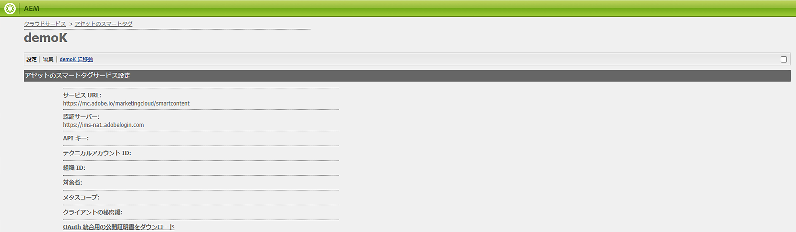

# OAuth 資格情報のスマートタグのトラブルシューティング {#oauth-config}

スマートコンテンツサービスと安全な方法でやり取りするよう、[!DNL Adobe Experience Manager] アプリケーションに対する同意を採用するには、オープン認証設定が必要です。

>[!NOTE]
>
> 2024年6月以降は、新しい JWT 資格情報を作成できません。今後は、OAuth サーバー間資格情報のみが作成されます。
> JWT 統合は、既存の AMS およびオンプレミスユーザーに対してのみ、2025年1月まで引き続き機能します。

## 新しい AMS ユーザーの OAuth 設定 {#oauth-config-existing-ams-users}

新しいユーザーの OAuth サービスの設定については、[スマートコンテンツサービスの設定](#integrate-adobe-io)を参照してください。完了したら、次の[手順](#prereqs-config-oauth-onprem)に従います。

>[!NOTE]
>
>必要に応じて、[サポートプロセス](https://experienceleague.adobe.com/?lang=ja&amp;support-tab=home#support)に従ってサポートチケットを送信できます。

## 既存の AMS ユーザーの OAuth 設定 {#oauth-config-new-ams-users}

この方法のいずれかの手順を実行する前に、以下を実装する必要があります。

### 前提条件 {#prereqs-config-oauth-onprem}

OAuth 設定には、次の前提条件が必要です。

* [Developer Console](https://developer.adobe.com/console/user/servicesandapis) で新しい OAuth 統合を作成します。次の手順では、`ClientID`、`ClientSecret`、`OrgID`、およびその他のプロパティを使用します。
* 次のファイルは、`/apps/system/config in crx/de` のパスにあります。
   * `com.**adobe**.granite.auth.oauth.accesstoken.provider.<randomnumbers>.config`
   * `com.adobe.granite.auth.ims.impl.IMSAccessTokenRequestCustomizerImpl.<randomnumber>.config`

### 既存の AMS およびオンプレミスユーザーの OAuth 設定 {#steps-config-oauth-onprem}

次の手順は、システム管理者が実行できます。AMS のお客様は、[サポートプロセス](https://experienceleague.adobe.com/?lang=ja&amp;support-tab=home#support)に従ってアドビ担当者に連絡するか、サポートチケットを送信できます。

1. `com.adobe.granite.auth.oauth.accesstoken.provider.<randomnumbers>.config`で以下のプロパティを追加または更新します。

   * `auth.token.provider.authorization.grants="client_credentials"`
   * `auth.token.provider.orgId="<OrgID>"`
   * `auth.token.provider.default.claims=("\"iss\"\ :\ \"<OrgID>\"")`
   * `auth.token.provider.scope="read_pc.dma_smart_content,\ openid,\ AdobeID,\ additional_info.projectedProductContext"`
     `auth.token.validator.type="adobe-ims-similaritysearch"`
   * 新しい OAuth 設定のクライアント ID を使用して `auth.token.provider.client.id` を更新します。
   * `auth.access.token.request` を `"https://ims-na1.adobelogin.com/ims/token/v3"` に更新します。
1. ファイルの名前を `com.adobe.granite.auth.oauth.accesstoken.provider-<randomnumber>.config` に変更します。
1. `com.adobe.granite.auth.ims.impl.IMSAccessTokenRequestCustomizerImpl.<randomnumber>.config` で以下の手順を実行します。
   * 新しい OAuth 統合からのクライアント秘密鍵を使用して、プロパティ auth.ims.client.secret を更新します。
   * ファイルの名前を `com.adobe.granite.auth.ims.impl.IMSAccessTokenRequestCustomizerImpl-<randomnumber>.config` に変更します。
1. すべての変更をコンテンツリポジトリ開発コンソール（例：CRXDE）に保存します。
<!--
1. Navigate to `/system/console/configMgr` and replace the OSGi configuration from `.<randomnumber>` to `-<randomnumber>`.
1. Delete the old OSGi configuration for `"Access Token provider name: adobe-ims-similaritysearch"` in `/system/console/configMgr`.
-->
1. `System/console/configMgr` で、`com.adobe.granite.auth.ims.impl.IMSAccessTokenRequestCustomizerImpl` およびアクセストークンプロバイダー名 `adobe-ims-similaritysearch` の古い設定を削除します。
1. コンソールを再起動します。

## 設定の検証 {#validate-the-configuration}

設定を完了したら、JMX MBean を使用して設定を検証できます。検証するには、次の手順に従います。

1. [!DNL Experience Manager] サーバー （`https://[aem_server]:[port]`）にアクセスします。

1. **[!UICONTROL ツール]**／**[!UICONTROL 操作]**／**[!UICONTROL Web コンソール]**&#x200B;に移動して、OSGi コンソールを開きます。**[!UICONTROL メイン]／[!UICONTROL JMX]** をクリックします。

1. 「`com.day.cq.dam.similaritysearch.internal.impl`」をクリックします。**[!UICONTROL SimilaritySearch Miscellaneous Tasks]** が開きます。

1. 「`validateConfigs()`」をクリックします。**[!UICONTROL 設定を検証]**&#x200B;ダイアログで、「**[!UICONTROL 起動]**」をクリックします。

同じダイアログに検証結果が表示されます。

## Adobe Developer Console との統合 {#integrate-adobe-io}

新しいユーザーとして Adobe Developer Console と統合する場合、[!DNL Experience Manager] サーバーはリクエストをスマートコンテンツサービスに転送する前に、Adobe Developer Console ゲートウェイを使用してサービス資格情報を認証します。統合するには、組織の管理者権限と、組織で購入して有効化されたスマートコンテンツサービスライセンスを持つ Adobe ID アカウントが必要です。

スマートコンテンツサービスを設定するには、次のトップレベルの手順に従います。

1. 公開鍵を生成するには、[!DNL Experience Manager] に[スマートコンテンツサービス](#obtain-public-certificate)の設定を作成します。OAuth 統合用の[公開証明書をダウンロードします](#obtain-public-certificate)。

1. *[既存ユーザーの場合は適用されません]* [Adobe Developer Console で統合を作成します](#create-adobe-i-o-integration)。

1. Adobe Developer Console の API キーおよびその他の資格情報を使用して、[デプロイメントを設定します](#configure-smart-content-service)。

1. [設定をテストします](#validate-the-configuration)。

## スマートコンテンツサービス設定を作成して公開証明書をダウンロード {#download-public-certificate}

公開証明書により、Adobe Developer Console でプロファイルを認証できます。

1. [!DNL Experience Manager] ユーザーインターフェイスで、**[!UICONTROL ツール]**／**[!UICONTROL Cloud Services]**／**[!UICONTROL 従来の Cloud Services]** にアクセスします。

1. クラウドサービスページで、「**[!UICONTROL アセットのスマートタグ]**」の「**[!UICONTROL 今すぐ設定]**」をクリックします。

1. **[!UICONTROL 設定を作成]**&#x200B;ダイアログで、スマートタグ設定のタイトルと名前を指定します。「**[!UICONTROL 作成]**」をクリックします。

1. **[!UICONTROL AEM スマートコンテンツサービス]**&#x200B;ダイアログで、以下の値を使用します。

   **[!UICONTROL サービス URL]**: `https://smartcontent.adobe.io/<region where your Experience Manager author instance is hosted>`

   （例：`https://smartcontent.adobe.io/apac`）。Experience Manager オーサーインスタンスがホストされている地域として、`na`、`emea` または `apac` を指定することができます。

   >[!NOTE]
   >
   >2022年9月1日（PT）より前に Experience Manager Managed Service がプロビジョニングされている場合は、次のサービス URL を使用します。
   >`https://mc.adobe.io/marketingcloud/smartcontent`

   **[!UICONTROL 認証サーバー]**: `https://ims-na1.adobelogin.com`

   その他のフィールドは現時点では空白のままにします（後で指定します）。「**[!UICONTROL OK]**」をクリックします。

   

   *図：コンテンツサービスの URL を指定するためのスマートコンテンツサービスダイアログ*

   >[!NOTE]
   >
   >[!UICONTROL サービス URL] として提供された URL は、ブラウザーからアクセスできず、404 エラーが発生します。設定は、[!UICONTROL サービス URL] パラメーターの同じ値で正常に動作します。サービスの全体的なステータスとメンテナンススケジュールについては、[https://status.adobe.com](https://status.adobe.com) を参照してください。

1. 「**[!UICONTROL OAuth 統合用の公開証明書をダウンロード]**」をクリックし、公開証明書ファイル `AEM-SmartTags.crt` をダウンロードします。この証明書は Adobe Developer Console にアップロードする必要がなくなりました。

   

   *図：スマートタグサービスの設定。*

## Adobe 開発者コンソール統合の作成 {#create-adobe-i-o-integration}

スマートコンテンツサービス API を使用するには、Adobe 開発者コンソールで統合を作成して、[!UICONTROL API キー]（Adobe 開発者コンソール統合の[!UICONTROL クライアント ID] フィールドで生成）、[!UICONTROL テクニカルアカウント ID]、[!UICONTROL 組織 ID]、および[!UICONTROL クライアント秘密鍵]を、[!DNL Experience Manager] のクラウド設定の [!UICONTROL Assets スマートタグサービス設定]用に取得します。

1. ブラウザーで [https://developer.adobe.com/console/](https://developer.adobe.com/console/) にアクセスします。適切なアカウントを選択し、関連付けられた組織の役割がシステム管理者であることを確認します。

1. 任意の名前でプロジェクトを作成します。「**[!UICONTROL API を追加]**」をクリックします。

1. **[!UICONTROL API を追加]**&#x200B;ページで、「**[!UICONTROL Experience Cloud]**」を選択し、「**[!UICONTROL スマートコンテンツ]**」を選択します。「**[!UICONTROL 次へ]**」をクリックします。

1. **[!UICONTROL OAuth サーバー間]**&#x200B;認証方式を選択します。

1. 必要に応じて&#x200B;**[!UICONTROL 資格情報名]**&#x200B;を追加／変更します。「**[!UICONTROL 次へ]**」をクリックします。

1. 製品プロファイル「**[!UICONTROL スマートコンテンツサービス]**」を選択します。「**[!UICONTROL 設定済み API を保存]**」をクリックします。OAuth API は、今後の使用のために接続された資格情報の下に追加されます。[!UICONTROL API キー（クライアント ID）]をコピーするか、そこから[!UICONTROL アクセストークンを生成]できます。
<!--
1. On the **[!UICONTROL Select product profiles]** page, select **[!UICONTROL Smart Content Services]**. Click **[!UICONTROL Save configured API]**.

   A page displays more information about the configuration. Keep this page open to copy and add these values in [!UICONTROL Assets Smart Tagging Service Settings] of cloud configuration in [!DNL Experience Manager] to configure smart tags.

   

   *Figure: Details of integration in Adobe Developer Console*
-->

*図：Adobe Developer Console での OAuth サーバー間の設定*

## スマートコンテンツサービスの設定 {#configure-smart-content-service}

統合を設定するには、Adobe 開発者コンソール統合から、[!UICONTROL テクニカルアカウント ID]、[!UICONTROL 組織 ID]、[!UICONTROL クライアント秘密鍵]、および[!UICONTROL クライアント ID] の各フィールドの値を使用します。スマートタグのクラウド設定を作成すると、[!DNL Experience Manager] デプロイメントからの API 要求を認証できるようになります。

1. [!DNL Experience Manager] で、**[!UICONTROL ツール]**／**[!UICONTROL クラウドサービス]**／**[!UICONTROL 従来のクラウドサービス]**&#x200B;に移動して、[!UICONTROL クラウドサービス]コンソールを開きます。

1. 「**[!UICONTROL アセットのスマートタグ]**」で、上記で作成した設定を開きます。サービス設定ページで、「**[!UICONTROL 編集]**」をクリックします。

1. **[!UICONTROL AEM スマートコンテンツサービス]**&#x200B;ダイアログで、「**[!UICONTROL サービス URL]**」および「**[!UICONTROL 認証サーバー]**」フィールドに事前入力された値を使用します。

1. [Adobe 開発者コンソールの統合](#create-adobe-i-o-integration)で生成した次の値を使用して、[!UICONTROL API キー]、[!UICONTROL テクニカルアカウント ID]、[!UICONTROL 組織 ID]、および[!UICONTROL クライアント秘密鍵]の各フィールドにコピーします。

   | [!UICONTROL アセットのスマートタグサービス設定] | [!DNL Adobe Developer Console] 統合フィールド |
   |--- |--- |
   | [!UICONTROL API キー] | [!UICONTROL クライアント ID] |
   | [!UICONTROL テクニカルアカウント ID] | [!UICONTROL テクニカルアカウント ID] |
   | [!UICONTROL 組織 ID] | [!UICONTROL 組織 ID] |
   | [!UICONTROL クライアントの秘密鍵] | [!UICONTROL クライアント秘密鍵] |

>[!MORELIKETHIS]
>
>* [スマートタグの概要とトレーニング方法](enhanced-smart-tags.md)
>* [スマートタグ付けの設定](config-smart-tagging.md)
>* [スマートタグに関するビデオチュートリアル](https://experienceleague.adobe.com/docs/experience-manager-learn/assets/metadata/image-smart-tags.html?lang=ja)
