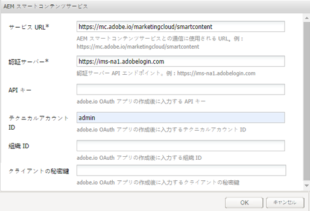
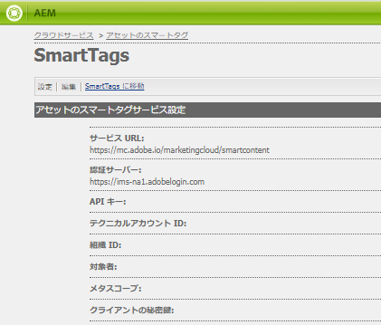
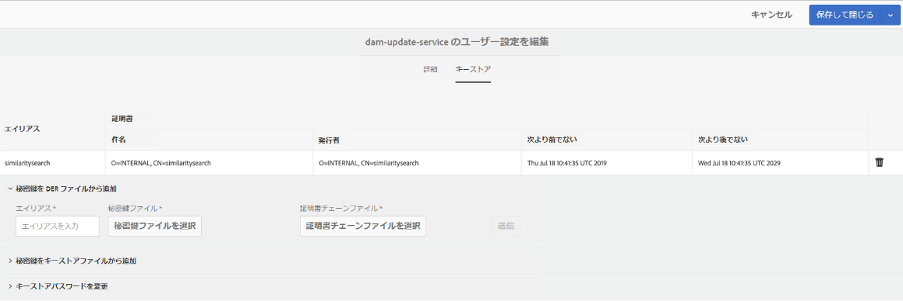
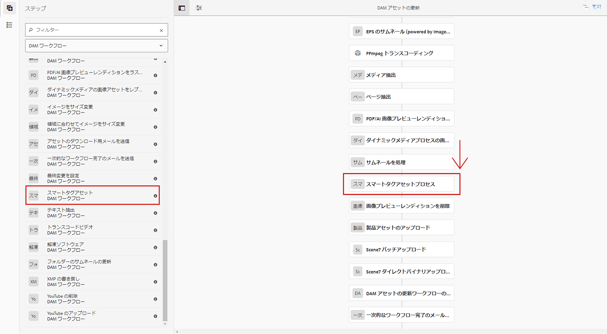
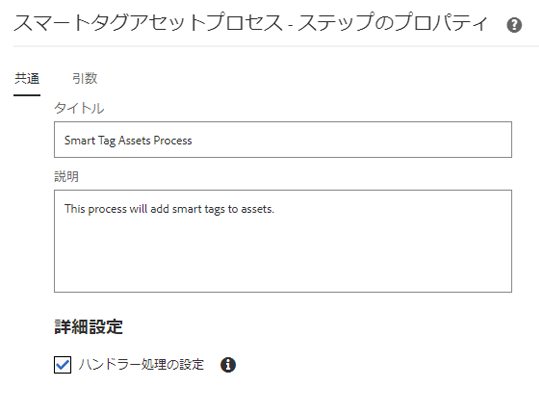
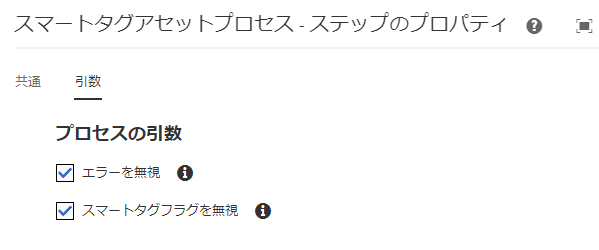
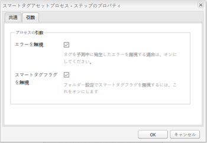
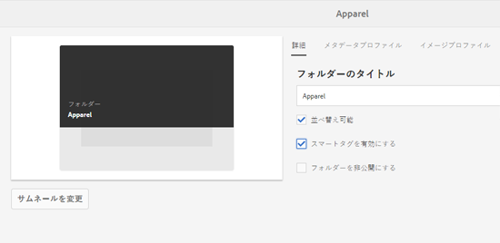
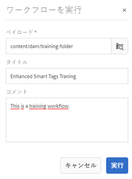

# スマートタグ [!DNL Assets] の準備 {#configure-asset-tagging-using-the-smart-content-service}

Smart Content Servicesを使用してアセットのタグ付けを開始できるようにする前に、Adobeデベロッパーコンソール [!DNL Experience ManageR Assets] と統合して、のスマートサービスを活用し [!DNL Adobe Sensei]ます。 設定が完了すると、いくつかの画像とタグを使用してサービスのトレーニングを行います。

Smart Content Serviceを使用する前に、次の事項を確認します。

* [Adobe 開発者コンソールとの統合](#integrate-adobe-io).
* [Smart Content Serviceのトレーニング](#training-the-smart-content-service)。

   <!-- TBD: This link will update soon after the new articles goes live on docs.adobe.com. Change it when new URL is available.
  -->

* 最新の [Experience Managerサービスパックをインストールします](https://docs.adobe.com/content/help/en/experience-manager-release-information/aem-release-updates/aem-releases-updates.html)。

## Adobe 開発者コンソールとの統合 {#integrate-adobe-io}

Adobe開発者コンソールと統合する場合、 [!DNL Experience Manager] サーバーは、要求をSmart Content Serviceに転送する前に、AdobeDeveloper Consoleゲートウェイを使用してサービス資格情報を認証します。 統合するには、組織の管理者権限を持つAdobe IDアカウントと、組織用に購入され有効にされたSmart Content Serviceライセンスが必要です。

Smart Content Serviceを設定するには、次のトップレベルの手順に従います。

1. [ でスマートコンテンツサービス設定を作成して、公開鍵を生成します。](#obtain-public-certificate)[!DNL Experience Manager]OAuth 統合用の[公開証明書を取得します](#obtain-public-certificate)。

1. [Adobe 開発者コンソールで統合を作成](#create-adobe-i-o-integration)し、生成した公開鍵をアップロードします。

1. [AdobeデベロッパーコンソールのAPIキーと他の資格情報を使用して](#configure-smart-content-service) 、デプロイメントを設定します。

1. [設定をテストします](#validate-the-configuration)。

1. Optionally, [enable auto-tagging on asset upload](#enable-smart-tagging-in-the-update-asset-workflow-optional).

### 公開証明書を取得するためのSmart Content Service設定の作成 {#obtain-public-certificate}

公開証明書により、Adobe 開発者コンソールでプロファイルを認証できます。

1. ユーザーインターフェイスで、 [!DNL Experience Manager] ツール **[!UICONTROL /]** Cloud Services **[!UICONTROL /]** レガシCloud Servicesにアクセスします ****。

1. In the Cloud Services page, click **[!UICONTROL Configure Now]** under **[!UICONTROL Assets Smart Tags]**.

1. **[!UICONTROL 設定を作成]**&#x200B;ダイアログで、スマートタグ設定のタイトルと名前を指定します。「**[!UICONTROL 作成]**」をクリックします。

1. **[!UICONTROL AEM スマートコンテンツサービス]**&#x200B;ダイアログで、以下の値を使用します。

   **[!UICONTROL サービス URL]**: `https://mc.adobe.io/marketingcloud/smartcontent`

   **[!UICONTROL 認証サーバー]**: `https://ims-na1.adobelogin.com`

   その他のフィールドは現時点では空白のままにします（後で指定します）。「**[!UICONTROL OK]**」をクリックします。

   

   *図：コンテンツサービスURLを提供する「Smart Content Service」ダイアログ*

   >[!NOTE]
   >
   >The URL provided as [!UICONTROL Service URL] is not accessible via browser and generates a 404 error. この設定は、 [!UICONTROL サービスURL] パラメーターと同じ値で正常に機能します。 For the overall service status and maintenance schedule, see [https://status.adobe.com](https://status.adobe.com).

1. Click **[!UICONTROL Download Public Certificate for OAuth Integration]**, and download the public certificate file `AEM-SmartTags.crt`.

   

   *図：スマートタグサービスの設定*

#### Reconfigure when a certificate expires {#certrenew}

証明書の有効期限が切れると、信頼されなくなります。 期限切れの証明書は更新できません。新しい証明書を追加するには、以下の手順に従います。

1. [!DNL Experience Manager] デプロイメントに管理者としてログインします。**[!UICONTROL ツール]**／**[!UICONTROL セキュリティ]**／**[!UICONTROL ユーザー]**&#x200B;をクリックします。

1. **[!UICONTROL dam-update-service]** ユーザーを見つけてクリックします。「**[!UICONTROL キーストア]**」タブをクリックします。

1. 証明書の有効期限が切れた既存の **[!UICONTROL similaritysearch]** キーストアを削除します。「**[!UICONTROL 保存して閉じる]**」をクリックします。

   

   *図：キーストアの既存の `similaritysearch` エントリを削除して新しいセキュリティ証明書を追加.*

1. **[!UICONTROL ツール]**／**[!UICONTROL クラウドサービス]**／**[!UICONTROL 従来のクラウドサービス]**&#x200B;に移動します。**[!UICONTROL アセットのスマートタグ]**／**[!UICONTROL 設定を表示]**／**[!UICONTROL 利用可能な設定]**&#x200B;をクリックします。必要な設定をクリックします。

1. 公開証明書をダウンロードするには、「**[!UICONTROL OAuth 統合用の公開証明書をダウンロード]**」をクリックします。

1. [https://console.adobe.io](https://console.adobe.io) にアクセスし、**[!UICONTROL 統合]**&#x200B;ページで既存のスマートコンテンツサービスに移動します。新しい証明書をアップロードします。For more information, see the instructions in [Create Adobe Developer Console integration](#create-adobe-i-o-integration).

### Adobe開発者コンソール統合の作成 {#create-adobe-i-o-integration}

Smart Content Service APIを使用するには、Adobe開発者コンソールで統合を作成し、 [!UICONTROL APIキー] (Adobe開発者コンソール統合の [!UICONTROL CLIENT ID] フィールドで生成)、技術アカウントID、 [!UICONTROL 組織ID、CLIENT SECRET][!DNL Experience Manager]ID、assets Smart Service Settingsクラウドのタグ付け設定のでのクラウドのタグ付け

1. ブラウザーで [https://console.adobe.io](https://console.adobe.io/) にアクセスします。適切なアカウントを選択し、関連付けられた組織の役割がシステム管理者であることを確認します。

1. 任意の名前でプロジェクトを作成します。「**[!UICONTROL API を追加]**」をクリックします。

1. **[!UICONTROL API を追加]**&#x200B;ページで、「**[!UICONTROL Experience Cloud]**」を選択し、「**[!UICONTROL スマートコンテンツ]**」を選択します。「**[!UICONTROL 次へ]**」をクリックします。

1. 「**[!UICONTROL 公開鍵をアップロード]**」を選択します。[!DNL Experience Manager]からダウンロードした証明書ファイルを指定します。[!UICONTROL 公開鍵が正常にアップロード]されたというメッセージが表示されます。「**[!UICONTROL 次へ]**」をクリックします。

   [!UICONTROL 新しいサービスアカウント（JWT）秘密鍵証明書を作成]ページには、設定したサービスアカウントの公開鍵が表示されます。

1. 「**[!UICONTROL 次へ]**」をクリックします。

1. **[!UICONTROL 製品プロファイルを選択]**&#x200B;ページで、「**[!UICONTROL スマートコンテンツサービス]**」を選択します。「**[!UICONTROL 設定済み API を保存]**」をクリックします。

   設定に関する詳細情報がページに表示されます。このページを開いたままにして、スマートタグを設定するには、のクラウド設定の [!UICONTROL Assets Smart Tagging Service Settings] ( [!DNL Experience Manager] Smart Taggingサービスの設定)にこれらの値をコピーして追加します。

   

   *図：Adobeデベロッパーコンソールの統合の詳細*

### スマートコンテンツサービスの設定 {#configure-smart-content-service}

統合を設定するには、 [!UICONTROL AdobeDeveloper Console統合の「]技術アカウントID [!UICONTROL 」、「]組織ID [!UICONTROL 」、「]CLIENT SECRET [!UICONTROL 」、「] CLIENT ID SECRET」の各フィールドの値を使用します。 Creating a Smart Tags cloud configuration allows authentication of API requests from the [!DNL Experience Manager] deployment.

1. In [!DNL Experience Manager], navigate to **[!UICONTROL Tools]** > **[!UICONTROL Cloud Service]** > **[!UICONTROL Legacy Cloud Services]** to open the [!UICONTROL Cloud Services] console.

1. 「**[!UICONTROL アセットのスマートタグ]**」で、上記で作成した設定を開きます。サービスの設定ページで、「**[!UICONTROL 編集]**」をクリックします。

1. **[!UICONTROL AEM スマートコンテンツサービス]**&#x200B;ダイアログで、「**[!UICONTROL サービス URL]**」および「**[!UICONTROL 認証サーバー]**」フィールドに事前入力された値を使用します。

1. フィールド [!UICONTROL Apiキー]、 [!UICONTROL 技術アカウントID]、 [!UICONTROL 組織ID]、クライアントクライアントクライアントのコピー、秘密Adobeの次の値を使用する秘密統合開発者コンソール統合の値を使用する。

   | [!UICONTROL アセットのスマートタグサービス設定] | [!DNL Adobe Developer Console] 統合フィールド |
   |--- |--- |
   | [!UICONTROL API キー] | [!UICONTROL クライアントID] |
   | [!UICONTROL テクニカルアカウント ID] | [!UICONTROL テクニカルアカウントID] |
   | [!UICONTROL 組織 ID] | [!UICONTROL 組織ID] |
   | [!UICONTROL クライアントの秘密鍵] | [!UICONTROL CLIENT SECRET] |

### 設定の検証 {#validate-the-configuration}

設定が完了したら、JMX MBeanを使用して設定を検証できます。 検証するには、次の手順に従います。

1. で [!DNL Experience Manager] サーバーにアクセスし `https://[aem_server]:[port]`ます。

1. **[!UICONTROL ツール]** / **[!UICONTROL 操作]** / **** Webコンソールに移動し、OSGiコンソールを開きます。 **[!UICONTROL メイン] / [!UICONTROL JMXをクリックします]**。

1. 「`com.day.cq.dam.similaritysearch.internal.impl`」をクリックします。It opens **[!UICONTROL SimilaritySearch Miscellaneous Tasks]**.

1. 「`validateConfigs()`」をクリックします。In the **[!UICONTROL Validate Configurations]** dialog, click **[!UICONTROL Invoke]**.

検証結果は、同じダイアログに表示されます。

### Enable smart tagging in the [!UICONTROL DAM Update Asset] workflow (Optional) {#enable-smart-tagging-in-the-update-asset-workflow-optional}

1. In [!DNL Experience Manager], go to **[!UICONTROL Tools]** > **[!UICONTROL Workflow]** > **[!UICONTROL Models]**.

1. **[!UICONTROL ワークフローモデル]**&#x200B;ページで、「**[!UICONTROL DAM アセットの更新]**」ワークフローモデルを選択します。

1. ツールバーの「**[!UICONTROL 編集]**」をクリックします。

1. サイドパネルを展開して、ステップを表示します。「DAM ワークフロー」セクションの「**[!UICONTROL スマートタグアセット]**」ステップをドラッグして、「**[!UICONTROL サムネールを処理]**」ステップの後に配置します。

   

   *図：「DAM アセットの更新」ワークフローで「サムネールを処理」ステップの後に「スマートタグアセット」ステップを追加。*

1. そのステップを編集モードで開きます。「**[!UICONTROL 詳細設定]**」で、「**[!UICONTROL ハンドラー処理の設定]**」オプションが選択されていることを確認します。

   

   *図：DAM更新アセットワークフローの設定とスマートタグ手順の追加*

1. 自動タグ付けのステップに失敗してもワークフローを完了させたい場合は、「**[!UICONTROL 引数]**」タブで「**[!UICONTROL エラーを無視]**」を選択します。

   

   *図：DAMアセットの更新ワークフローを設定し、スマートタグ手順を追加してハンドラーの設定を選択します*

   フォルダーでスマートタグが有効になっているかに関わらずアップロード時にアセットをタグ付けするには、「**[!UICONTROL スマートタグフラグを無視]**」を選択します。

   

   *図：DAM Update Assetワークフローを設定し、スマートタグ手順を追加して、「スマートタグフラグを無視」を選択します*

1. 「**[!UICONTROL OK]**」をクリックして、プロセスステップを閉じ、ワークフローを保存します。

## Smart Content Serviceのトレーニング {#training-the-smart-content-service}

スマートコンテンツサービスでビジネス上の分類を認識できるように、ビジネスに関連するタグが既に含まれているアセットのセットに対してサービスを実行します。ブランド画像に効果的にタグを付けるには、Smart Content Serviceで、トレーニング画像が特定のガイドラインに従っている必要があります。 トレーニングが完了すると、サービスは、類似するアセットのセットに同じ分類を適用できるようになります。

サービスのトレーニングを複数回実施すると、関連性の高いタグを適用する能力が向上します。トレーニングサイクルが終了するたびに、タグ付けワークフローを実行し、アセットが適切にタグ付けされるかどうかを確認します。

スマートコンテンツサービスのトレーニングは、定期的に実施することも、必要に応じて実施することもできます。

>[!NOTE]
>
>トレーニングワークフローは、フォルダーに対してのみ実行されます。

### トレーニングのガイドライン {#guidelines-for-training}

最適な結果を得るには、トレーニングセット内の画像は次のガイドラインに従う必要があります。

**数とサイズ**：タグ 1 つにつき 30 以上の画像が必要です。長辺が 500 ピクセル以上である必要があります。

**一貫性**：タグの各画像は、似たような外観にする必要があります。

例えば、以下の画像は似ていないので、これらの画像すべてを `my-party`（トレーニング用）としてタグ付けするのは適切ではありません。

**対象範囲**：トレーニングの画像には十分な多様性が必要です。Experience Managerが適切なものに焦点を合わせるように、いくつかの合理的に多様な例を提供することがアイデアです。 見た目が大きく異なる画像に同じタグを適用する場合は、それぞれの種類に 5 つ以上の例を含めてください。

例えば、*model-down-pose* というタグの場合、タグ付け時、類似する画像をより正確に識別できるよう、以下のハイライト表示された画像に似たトレーニング画像を増やします。

**妨害物と障害物**：サービスのトレーニングには、障害物（目立つ背景、メインとなる対象と一緒に含まれる物や人物などの関連性のない付随物）が少ない画像のほうが効果的です。

例えば、*casual-shoe* というタグの場合、2 つ目の画像はトレーニングの候補として適切ではありません。

**完全性**：画像が複数のタグの対象となる場合は、適用可能なすべてのタグを追加してから、画像をトレーニングに含めます。例えば、`raincoat` と `model-side-view` などのタグの場合、対象となるアセットに両方のタグを追加してから、そのアセットをトレーニングに含めます。

>[!NOTE]
>
>スマートコンテンツサービスでタグのトレーニングを実施し、それらのタグを他の画像に適用できるかどうかは、トレーニングで使用する画像の質によって決まります。最適な結果を得るには、視覚的に似ている画像を使用し、それぞれのタグについてサービスのトレーニングを実施することをお勧めします。

### 定期的なトレーニング {#periodic-training}

スマートコンテンツサービスを有効にして、フォルダー内のアセットおよび関連するタグに関する定期的なトレーニングを実施することができます。Open the [!UICONTROL Properties] page of your asset folder, select **[!UICONTROL Enable Smart Tags]** under the **[!UICONTROL Details]** tab, and save the changes.

Once this option is selected for a folder, [!DNL Experience Manager] runs a training workflow automatically to train the Smart Content Service on the folder assets and their tags. デフォルトでは、トレーニングワークフローは週に 1 回、土曜日の午前 0 時 30 分に実行されます。

### オンデマンドのトレーニング {#on-demand-training}

ワークフローコンソールから、必要に応じていつでもスマートコンテンツサービスのトレーニングをおこなうことができます。

1. In [!DNL Experience Manager] interface, go to **[!UICONTROL Tools]** > **[!UICONTROL Workflow]** > **[!UICONTROL Models]**.
1. From the **[!UICONTROL Workflow Models]** page, select the **[!UICONTROL Smart Tags Training]** workflow and then click **[!UICONTROL Start Workflow]** from the toolbar.
1. **[!UICONTROL ワークフローを実行]**&#x200B;ダイアログで、サービスのトレーニングに使用するタグ付けされたアセットが格納されているペイロードフォルダーを参照します。
1. ワークフローのタイトルを指定し、コメントを追加します。Then, click **[!UICONTROL Run]**. アセットとタグがトレーニングのために送信されます。

   

>[!NOTE]
>
>フォルダー内のアセットがトレーニング用に処理されると、変更されたアセットのみが後続のトレーニングサイクルで処理されます。

### 表示トレーニングレポート {#viewing-training-reports}

アセットのトレーニングセット内のタグに関するスマートコンテンツサービスのトレーニングが実施されたかどうかを確認するには、レポートコンソールでトレーニングワークフローレポートを調べます。

1. In [!DNL Experience Manager] interface, go to **[!UICONTROL Tools]** > **[!UICONTROL Assets]** > **[!UICONTROL Reports]**.
1. **[!UICONTROL アセットレポート]**&#x200B;ページで、「**[!UICONTROL 作成]**」をクリックします。
1. 「**[!UICONTROL スマートタグトレーニング]**」レポートを選択し、ツールバーで「**[!UICONTROL 次へ]**」をクリックします。
1. レポートのタイトルと説明を指定します。「**[!UICONTROL レポートをスケジュール]**」で、「**[!UICONTROL 今すぐ]**」オプションを選択したままにします。レポートを後で生成するようにスケジュールするには、「**[!UICONTROL 後で]**」を選択し、日時を指定します。次に、ツールバーの「**[!UICONTROL 作成]**」をクリックします。
1. **[!UICONTROL アセットレポート]**&#x200B;ページで、生成したレポートを選択します。レポートを表示するには、ツールバーの「**[!UICONTROL 表示]**」アイコンをクリックします。
1. レポートの詳細をレビューします。

   レポートには、トレーニングしたタグのトレーニングステータスが表示されます。「**[!UICONTROL トレーニングステータス]**」列の緑色は、そのタグについて、スマートコンテンツサービスのトレーニングが実施されたことを示します。黄色は、特定のタグに関するサービスのトレーニングが完全には実施されていないことを示します。この場合、特定のタグを含む画像をさらに追加し、トレーニングワークフローを実行して、そのタグに関するサービスのトレーニングを完全に実施します。

   このレポートにタグが表示されない場合は、それらのタグに関するトレーニングワークフローを再度実行してください。

1. レポートをダウンロードするには、リストから対象のレポートを選択し、ツールバーの「**[!UICONTROL ダウンロード]**」をクリックします。レポートが Microsoft Excel スプレッドシートとしてダウンロードされます。

## 制限事項 {#limitations}

* 強化されたスマートタグは、画像の学習モデルとそのタグに基づいています。 これらのモデルは、タグを識別するうえで常に完璧であるわけではありません。スマートコンテンツサービスの現行バージョンには次の制限事項があります。

   * 画像内の細かい違いを認識することはできません。例えば、シャツのサイズが細身か標準かなどの違いは認識できません。
   * 画像の細かい模様や部分に基づいてタグを識別することはできません。例えば、T シャツのロゴなどです。
   * Tagging is supported in the locales that [!DNL Experience Manager] is supported in. 言語の一覧については、](https://docs.adobe.com/content/help/ja-JP/experience-manager-64/release-notes/smart-content-service-release-notes.translate.html)スマートコンテンツサービスのリリースノート[を参照してください。

* To search for assets with smart tags (regular or enhanced), use the [!DNL Assets] Omnisearch (full-text search). スマートタグには個別の検索用述語はありません。

>[!MORELIKETHIS]
>
>* [スマートタグの概要とトレーニング方法](enhanced-smart-tags.md)
>* [スマートタグの設定方法に関するビデオチュートリアル](https://docs.adobe.com/content/help/en/experience-manager-learn/assets/metadata/smart-tags-technical-video-setup.html)

