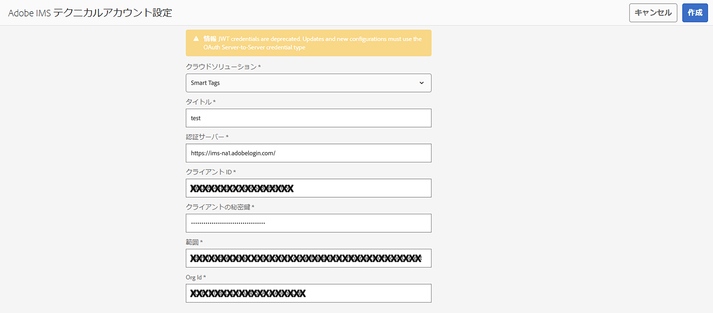

# スマートタグ付けのために [!DNL Assets] を準備 {#configure-asset-tagging-using-the-smart-content-service}

スマートコンテンツサービスを使用してアセットのタグ付けを開始する前に、[!DNL Experience Manager Assets] と Adobe Developer Console を統合して、[!DNL Adobe Sensei] スマートコンテンツサービスを使用します。設定が完了したら、いくつかの画像とタグを使用してサービスのトレーニングを行います。

<!--
>[!NOTE]
>
>* Smart Content Services is no longer available to new [!DNL Experience Manager Assets] On-Premise customers. Existing On-Premise customers, who already have this capability enabled, can continue using Smart Content Services.
>* Smart Content Services is available for existing [!DNL Experience Manager Assets] Managed Services customers, who already have this capability enabled.
>* New Experience Manager Assets Managed Services customers can follow the instructions mentioned in this article to set up Smart Content Services.
>* For Service Pack 20 and older, you need to perform the workaround steps for SCS to support Oauth integration. See [Troubleshooting smart tags for OAuth credentials](config-oauth.md).
>* To support the Oauth integration on Service Pack 21, you need to install the [Hotfix for SP 21](https://experience.adobe.com/#/downloads/content/software-distribution/en/aem.html?package=%2Fcontent%2Fsoftware-distribution%2Fen%2Fdetails.html%2Fcontent%2Fdam%2Faem%2Fpublic%2Fadobe%2Fpackages%2Fcq650%2Fproduct%2Fassets%2Fcq-6.5.0-hotfix-40772-1.2.zip). 
>* For Existing SCS configuration, the process is the same as setting up a new OAuth integration. Any legacy configuration will be automatically cleaned up.
-->

スマートコンテンツサービスを使用する前に、次を確認します。

* [Adobe 開発者コンソールとの統合](#integrate-adobe-io)。
* [スマートコンテンツサービスのトレーニング](#training-the-smart-content-service)

* 最新の[[!DNL Experience Manager] サービスパック](https://experienceleague.adobe.com/docs/experience-manager-release-information/aem-release-updates/aem-releases-updates.html?lang=ja)をインストールします。

## Adobe Managed Services の OAuth をサポートする SCS アップグレード {#scs-upgrade-oauth-managed-services}

**新規ユーザー**

サービスパック 22 をインストールします。サービスパック 22 で OAuth 統合をサポートするには、[SP 22 のホットフィックス](https://experience.adobe.com/#/downloads/content/software-distribution/en/aem.html?package=%2Fcontent%2Fsoftware-distribution%2Fen%2Fdetails.html%2Fcontent%2Fdam%2Faem%2Fpublic%2Fadobe%2Fpackages%2Fcq650%2Fproduct%2Fassets%2Fcq-6.5.0-hotfix-42384-1.2.zip)をインストールする必要があります。

この記事に記載されている手順に従って、スマートコンテンツサービスを設定します。

**既存のユーザー**

サービスパック 21 にアップグレードした場合は、OAuth 統合をサポートする[サービスパック 21 のホットフィックス](https://experience.adobe.com/#/downloads/content/software-distribution/en/aem.html?package=%2Fcontent%2Fsoftware-distribution%2Fen%2Fdetails.html%2Fcontent%2Fdam%2Faem%2Fpublic%2Fadobe%2Fpackages%2Fcq650%2Fproduct%2Fassets%2Fcq-6.5.0-hotfix-40772-1.2.zip)をインストールします。既存の設定はすべて自動的に削除されます。この記事に記載されている手順に従って、スマートコンテンツサービスを設定します。サービスパック 22 にアップグレードする場合は、この[サービスパック 22 のホットフィックス](https://experience.adobe.com/#/downloads/content/software-distribution/en/aem.html?package=%2Fcontent%2Fsoftware-distribution%2Fen%2Fdetails.html%2Fcontent%2Fdam%2Faem%2Fpublic%2Fadobe%2Fpackages%2Fcq650%2Fproduct%2Fassets%2Fcq-6.5.0-hotfix-42384-1.2.zip)をインストールする必要があります。

サービスパック 20 以前の場合、SCS が OAuth 統合に対応する回避策を実行する必要があります。詳しくは、[OAuth 資格情報のスマートタグのトラブルシューティング](config-oauth.md)を参照してください。

## オンプレミスユーザーの OAuth をサポートする SCS アップグレード {#scs-upgrade-oauth-on-premise}

**新規ユーザー**

新規 [!DNL Experience Manager Assets] オンプレミスユーザーは、スマートコンテンツサービスを利用できなくなりました。

**既存のユーザー**

既にこの機能を有効にしている既存のオンプレミスユーザーは、引き続きスマートコンテンツサービスを使用できます。

サービスパック 21 にアップグレードした場合は、OAuth 統合をサポートする[サービスパック 21 のホットフィックス](https://experience.adobe.com/#/downloads/content/software-distribution/en/aem.html?package=%2Fcontent%2Fsoftware-distribution%2Fen%2Fdetails.html%2Fcontent%2Fdam%2Faem%2Fpublic%2Fadobe%2Fpackages%2Fcq650%2Fproduct%2Fassets%2Fcq-6.5.0-hotfix-40772-1.2.zip)をインストールします。既存の設定はすべて自動的に削除されます。この記事に記載されている手順に従って、スマートコンテンツサービスを設定します。サービスパック 22 にアップグレードする場合は、この[サービスパック 22 のホットフィックス](https://experience.adobe.com/#/downloads/content/software-distribution/en/aem.html?package=%2Fcontent%2Fsoftware-distribution%2Fen%2Fdetails.html%2Fcontent%2Fdam%2Faem%2Fpublic%2Fadobe%2Fpackages%2Fcq650%2Fproduct%2Fassets%2Fcq-6.5.0-hotfix-42384-1.2.zip)をインストールする必要があります。

サービスパック 20 以前の場合、SCS が OAuth 統合に対応する回避策を実行する必要があります。詳しくは、[OAuth 資格情報のスマートタグのトラブルシューティング](config-oauth.md)を参照してください。

## と Adobe 開発者コンソールの統合 {#integrate-adobe-io}

Adobe Developer Console と統合する場合、[!DNL Experience Manager] サーバーはリクエストをスマートコンテンツサービスに転送する前に、Adobe Developer Console ゲートウェイを使用してサービス資格情報を認証します。統合するには、組織の管理者権限と、組織で購入して有効化されたスマートコンテンツサービスライセンスを持つ Adobe ID アカウントが必要です。

スマートコンテンツサービスを設定するには、次のトップレベルの手順に従います。

1. [Adobe Developer Console](#create-adobe-io-integration) での統合の作成

1. Adobe Developer Console の API キーおよびその他の資格情報を使用して、[IMS テクニカルアカウント設定](#create-ims-account-config)を作成します。

1. [スマートコンテンツサービスの設定](#configure-smart-content-service)

1. [設定をテストします](#validate-the-configuration)。

<!--
To configure the Smart Content Service, follow these top-level steps:

1. To generate a public key, [Create a Smart Content Service] (#obtain-public-certificate) configuration in [!DNL Experience Manager]. 

1. Optionally, [enable auto-tagging on asset upload](#enable-smart-tagging-in-the-update-asset-workflow-optional).

   <!--1. [Obtain public certificate](#obtain-public-certificate) for OAuth integration.
   1. [Create an integration in Adobe Developer Console](#create-adobe-i-o-integration) and upload the generated public key.

   1. [Configure your deployment](#configure-smart-content-service) using the API key and other credentials from Adobe Developer Console.

   1. [Test the configuration](#validate-the-configuration).-->

### Adobe Developer Console 統合の作成 {#create-adobe-io-integration}

スマートコンテンツサービス API を使用するには、Adobe Developer Console で統合を作成して、[!UICONTROL API キー]（Adobe Developer Console 統合の[!UICONTROL クライアント ID] フィールドで生成）、[!UICONTROL 組織 ID] および[!UICONTROL クライアント秘密鍵]を、[!DNL Experience Manager] のクラウド設定の [!UICONTROL Assets スマートタグサービス設定]用に取得します。

1. ブラウザーで [https://developer.adobe.com](https://developer.adobe.com/) にアクセスします。適切なアカウントを選択し、関連付けられた組織の役割が&#x200B;**システム管理者**&#x200B;であることを確認します。

1. 任意の名前でプロジェクトを作成します。「**[!UICONTROL API を追加]**」をクリックします。

1. **[!UICONTROL API を追加]**&#x200B;ページで、「**[!UICONTROL Experience Cloud]**」を選択し、「**[!UICONTROL スマートコンテンツ]**」を選択します。「**[!UICONTROL 次へ]**」をクリックします。

1. 「**[!UICONTROL OAuth サーバー間]**」を選択します。「**[!UICONTROL 次へ]**」をクリックします。
この設定を行う方法について詳しくは、要件に応じて、Developer Console のドキュメントを参照してください。

   * 概要：
      * [サーバー間認証](https://developer.adobe.com/developer-console/docs/guides/authentication/ServerToServerAuthentication/)

   * 新しい OAuth 資格情報の作成：
      * [OAuth サーバー間資格情報実装ガイド](https://developer.adobe.com/developer-console/docs/guides/authentication/ServerToServerAuthentication/implementation/)

   * 既存の JWT 資格情報の OAuth 資格情報への移行：
      * [サービスアカウント（JWT）資格情報から OAuth サーバー間資格情報への移行](https://developer.adobe.com/developer-console/docs/guides/authentication/ServerToServerAuthentication/migration/)

1. **[!UICONTROL 製品プロファイルを選択]**&#x200B;ページで、「**[!UICONTROL スマートコンテンツサービス]**」を選択します。「**[!UICONTROL 設定済み API を保存]**」をクリックします。

   設定に関する詳細情報がページに表示されます。このページを開いたままにしてこれらの値をコピーし、[!DNL Experience Manager] のクラウド設定の「[!UICONTROL Assets スマートタグサービス設定]」に追加して、スマートタグを設定します。

   

### IMS テクニカルアカウント設定の作成 {#create-ims-account-config}

次の手順を使用して、IMS テクニカルアカウント設定を作成する必要があります。

1. [!DNL Experience Manager] ユーザーインターフェイスで、**[!UICONTROL ツール]**／**[!UICONTROL セキュリティ]**／**[!UICONTROL Adobe IMS 設定]**&#x200B;にアクセスします。

1. 「**[!UICONTROL 作成]**」をクリックします。

1. IMS テクニカルアカウント設定ダイアログで、以下の値を使用します。

   

   | フィールド | 説明 |
   | -------- | ---------------------------- |
   | クラウドソリューション | ドロップダウンから「**[!UICONTROL スマートタグ]**」を選択します。 |
   | タイトル | 設定する IMS アカウントのタイトルを追加します。 |
   | 認証サーバー | `https://ims-na1.adobelogin.com` の追加 |
   | クライアント ID | [Adobe Developer Console](https://developer.adobe.com/console/) から提供されます。 |
   | クライアントの秘密鍵 | [Adobe Developer Console](https://developer.adobe.com/console/) から提供されます。 |
   | 範囲 | [Adobe Developer Console](https://developer.adobe.com/console/) から提供されます。 |
   | 組織 ID | [Adobe Developer Console](https://developer.adobe.com/console/) から提供されます。 |

1. 作成した設定を選択し、「**[!UICONTROL ヘルスをチェック]**」をクリックします。

1. ヘルスをチェックダイアログボックスを確認し、設定が正常な状態になったら「閉じる」をクリックします。

### 新しい設定の作成 {#configure-smart-content-service}

<!--
>[!CAUTION]
>
>Previously, configurations that were made with JWT Credentials are now subject to deprecation in the Adobe Developer Console. You cannot create new JWT credentials after June 3, 2024. Such configurations can no longer be created or updated, but can be migrated to OAuth configurations.
> See [Setting up IMS integrations for AEM](https://experienceleague.adobe.com/en/docs/experience-manager-cloud-service/content/security/setting-up-ims-integrations-for-aem-as-a-cloud-service)
>See [Steps to configure OAuth for on-premise users](#config-oauth-onprem)
> See [Troubleshooting smart tags for OAuth credentials](#config-smart-tagging.md)
-->

統合を設定するには、Adobe 開発者コンソール統合から、[!UICONTROL テクニカルアカウント ID]、[!UICONTROL 組織 ID]、[!UICONTROL クライアント秘密鍵]、および[!UICONTROL クライアント ID] の各フィールドの値を使用します。スマートタグのクラウド設定を作成すると、[!DNL Experience Manager] デプロイメントからの API 要求を認証できるようになります。

1. [!DNL Experience Manager] で、**[!UICONTROL ツール]**／**[!UICONTROL クラウドサービス]**／**[!UICONTROL スマートタグ]**&#x200B;の順に移動して、「[!UICONTROL スマートタグ設定]」を開きます。

1. 「**[!UICONTROL 作成]**」をクリックして、新しい設定を作成します。それ以外の場合は、「**[!UICONTROL プロパティ]**」をクリックして既存の設定を更新します。

1. 次のフィールドに入力します。

   

   | フィールド | 説明 |
   | -------- | ---------------------------- |
   | タイトル | 設定する IMS アカウントのタイトルを追加します。 |
   | 関連付けられている Adobe IMS 設定 | ドロップダウンから「設定」を選択します。 |
   | サービス URL | `https://smartcontent.adobe.io/<region where your Experience Manager author instance is hosted>` に移行することで使用を置き換えることができます。（例：`https://smartcontent.adobe.io/apac`）。Experience Manager オーサーインスタンスがホストされている地域として、`na`、`emea` または `apac` を指定することができます。 |

   >[!NOTE]
   >
   >2022年9月1日（PT）より前に Experience Manager Managed Service がプロビジョニングされている場合は、次のサービス URL を使用します。
   >`https://mc.adobe.io/marketingcloud/smartcontent`

1. 「**[!UICONTROL 保存して閉じる]**」をクリックします。

### 設定の検証 {#validate-the-configuration}

設定を完了したら、JMX MBean を使用して設定を検証できます。検証するには、次の手順に従います。

1. [!DNL Experience Manager] サーバー （`https://[aem_server]:[port]`）にアクセスします。

1. **[!UICONTROL ツール]**／**[!UICONTROL 操作]**／**[!UICONTROL Web コンソール]**&#x200B;に移動して、OSGi コンソールを開きます。**[!UICONTROL メイン]／[!UICONTROL JMX]** をクリックします。

<!--
1. Click `com.day.cq.dam.similaritysearch.internal.impl`. It opens **[!UICONTROL SimilaritySearch Miscellaneous Tasks]**.-->

1. 「`com.day.cq.dam.similaritysearch.internal.impl (SCS)`」をクリックします。

   

1. 「`validateConfigs()`」をクリックします。**[!UICONTROL 設定を検証]**&#x200B;ダイアログで、「**[!UICONTROL 起動]**」をクリックします。

同じダイアログに検証結果が表示されます。

<!--
### Obtain public certificate by creating Smart Content Service configuration {#obtain-public-certificate}

A public certificate lets you authenticate your profile on Adobe Developer Console.

1. In the [!DNL Experience Manager] user interface, access **[!UICONTROL Tools]** > **[!UICONTROL Cloud Services]** > **[!UICONTROL Legacy Cloud Services]**.

1. In the Cloud Services page, click **[!UICONTROL Configure Now]** under **[!UICONTROL Assets Smart Tags]**.

1. In the **[!UICONTROL Create Configuration]** dialog, specify a title and name for the Smart Tags configuration. Click **[!UICONTROL Create]**.

1. In the **[!UICONTROL AEM Smart Content Service]** dialog, use the following values:

   **[!UICONTROL Service URL]**: `https://smartcontent.adobe.io/<region where your Experience Manager author instance is hosted>`

   For example, `https://smartcontent.adobe.io/apac`. You can specify `na`, `emea`, or, `apac` as the regions where your Experience Manager author instance is hosted. 

   >[!NOTE]
   >
   >If the Experience Manager Managed Service is provisioned before September 01, 2022, use the following Service URL:
   >`https://mc.adobe.io/marketingcloud/smartcontent`

   **[!UICONTROL Authorization Server]**: `https://ims-na1.adobelogin.com`

   Leave the other fields blank for now (to be provided later). Click **[!UICONTROL OK]**.

   

   *Figure: Smart Content Service dialog to provide content service URL*

   >[!NOTE]
   >
   >The URL provided as [!UICONTROL Service URL] is not accessible via browser and generates a 404 error. The configuration works OK with the same value of the [!UICONTROL Service URL] parameter. For the overall service status and maintenance schedule, see [https://status.adobe.com](https://status.adobe.com).

1. Click **[!UICONTROL Download Public Certificate for OAuth Integration]**, and download the public certificate file `AEM-SmartTags.crt`.

   

   *Figure: Settings for smart tagging service.*

#### Reconfigure when a certificate expires {#certrenew}

After a certificate expires, it is no longer trusted. You cannot renew an expired certificate. To add a certificate, follow these steps.

1. Log in your [!DNL Experience Manager] deployment as an administrator. Click **[!UICONTROL Tools]** > **[!UICONTROL Security]** > **[!UICONTROL Users]**.

1. Locate and click **[!UICONTROL dam-update-service]** user. Click **[!UICONTROL Keystore]** tab.

1. Delete the existing **[!UICONTROL similaritysearch]** keystore with the expired certificate. Click **[!UICONTROL Save & Close]**.

   

   *Figure: Delete the existing `similaritysearch` entry in Keystore to add a security certificate.*

1. Navigate to **[!UICONTROL Tools]** > **[!UICONTROL Cloud Services]** > **[!UICONTROL Legacy Cloud Services]**. Click **[!UICONTROL Asset Smart Tags]** > **[!UICONTROL Show Configuration]** > **[!UICONTROL Available Configurations]**. Click the required configuration.  

1. To download a public certificate, click **[!UICONTROL Download Public Certificate for OAuth Integration]**.

1. Access [https://console.adobe.io](https://console.adobe.io) and navigate to the existing Smart Content Services on the **[!UICONTROL Integrations]** page. Upload the new certificate. For more information, see the instructions in [Create Adobe Developer Console integration](#create-adobe-i-o-integration).

### Create Adobe Developer Console integration {#create-adobe-i-o-integration}

To use Smart Content Service APIs, create an integration in Adobe Developer Console to obtain [!UICONTROL API Key] (generated in [!UICONTROL CLIENT ID] field of Adobe Developer Console integration), [!UICONTROL TECHNICAL ACCOUNT ID], [!UICONTROL ORGANIZATION ID], and [!UICONTROL CLIENT SECRET] for [!UICONTROL Assets Smart Tagging Service Settings] of cloud configuration in [!DNL Experience Manager].

1. Access [https://console.adobe.io](https://console.adobe.io/) in a browser. Select the appropriate account and verify that the associated organization role is system administrator.

1. Create a project with any desired name. Click **[!UICONTROL Add API]**.

1. On the **[!UICONTROL Add an API]** page, select **[!UICONTROL Experience Cloud]** and select **[!UICONTROL Smart Content]**. Click **[!UICONTROL Next]**.

1. Select **[!UICONTROL Upload your public key]**. Provide the certificate file downloaded from [!DNL Experience Manager]. A message [!UICONTROL Public key(s) uploaded successfully] is displayed. Click **[!UICONTROL Next]**.

   [!UICONTROL Create a new Service Account (JWT) credential] page displays the public key for the service account.

1. Click **[!UICONTROL Next]**.

1. On the **[!UICONTROL Select product profiles]** page, select **[!UICONTROL Smart Content Services]**. Click **[!UICONTROL Save configured API]**.

   A page displays more information about the configuration. Keep this page open to copy and add these values in [!UICONTROL Assets Smart Tagging Service Settings] of cloud configuration in [!DNL Experience Manager] to configure smart tags.

   

   *Figure: Details of integration in Adobe Developer Console*

### Configure Smart Content Service {#configure-smart-content-service}

>[!CAUTION]
>
>Previously, configurations that were made with JWT Credentials are now subject to deprecation in the Adobe Developer Console. You cannot create new JWT credentials after June 3, 2024. Such configurations can no longer be created or updated, but can be migrated to OAuth configurations.
> See [Setting up IMS integrations for AEM](https://experienceleague.adobe.com/en/docs/experience-manager-cloud-service/content/security/setting-up-ims-integrations-for-aem-as-a-cloud-service)
>See [Steps to configure OAuth for on-premise users](#config-oauth-onprem)
> See [Troubleshooting smart tags for OAuth credentials](#config-smart-tagging.md)

To configure the integration, use the values of [!UICONTROL TECHNICAL ACCOUNT ID], [!UICONTROL ORGANIZATION ID], [!UICONTROL CLIENT SECRET], and [!UICONTROL CLIENT ID] fields from the Adobe Developer Console integration. Creating a Smart Tags cloud configuration allows authentication of API requests from the [!DNL Experience Manager] deployment.

1. In [!DNL Experience Manager], navigate to **[!UICONTROL Tools]** > **[!UICONTROL Cloud Service]** > **[!UICONTROL Legacy Cloud Services]** to open the [!UICONTROL Cloud Services] console.

1. Under the **[!UICONTROL Assets Smart Tags]**, open the configuration created above. On the service settings page, click **[!UICONTROL Edit]**.

1. In the **[!UICONTROL AEM Smart Content Service]** dialog, use the pre-populated values for the **[!UICONTROL Service URL]** and **[!UICONTROL Authorization Server]** fields.

1. For the fields [!UICONTROL Api Key], [!UICONTROL Technical Account ID], [!UICONTROL Organization ID], and [!UICONTROL Client Secret], copy and use the following values generated in [Adobe Developer Console integration](#create-adobe-i-o-integration).

   | [!UICONTROL Assets Smart Tagging Service Settings] | [!DNL Adobe Developer Console] integration fields |
   |--- |--- |
   | [!UICONTROL Api Key] | [!UICONTROL CLIENT ID] |
   | [!UICONTROL Technical Account ID] | [!UICONTROL TECHNICAL ACCOUNT ID] |
   | [!UICONTROL Organization ID] | [!UICONTROL ORGANIZATION ID] |
   | [!UICONTROL Client Secret] | [!UICONTROL CLIENT SECRET] |

### Configure OAuth for on-premise users {#config-oauth-onprem}

#### Prerequisites {#prereqs-config-oauth-onprem}

An authorization scope is an OAuth string that contains the following prerequisites:

* Create a new OAuth integration in the [Developer Console](https://developer.adobe.com/console/user/servicesandapis) using `ClientID`, `ClientSecretID`, and `OrgID`.
* Add the following files at this path `/apps/system/config in crx/de`:
   * `com.adobe.granite.auth.oauth.accesstoken.provider.<randomnumbers>.config`
   * `com.adobe.granite.auth.ims.impl.IMSAccessTokenRequestCustomizerImpl.<randomnumber>.config`

#### Configure OAuth for on-premise users {#steps-config-oauth-onprem}

1. Add or update the below properties in `com.adobe.granite.auth.oauth.accesstoken.provider.<randomnumbers>.config`:

   * `auth.token.provider.authorization.grants="client_credentials"`
   * `auth.token.provider.orgId="<OrgID>"`
   * `auth.token.provider.default.claims=("\"iss\"\ :\ \"<OrgID>\"")`
   * `auth.token.provider.scope="read_pc.dma_smart_content,\ openid,\ AdobeID,\ additional_info.projectedProductContext"`
     `auth.token.validator.type="adobe-ims-similaritysearch"`
   * Update the `auth.token.provider.client.id` with the Client ID of the new OAuth configuration.
   * Update `auth.access.token.request` to `"https://ims-na1.adobelogin.com/ims/token/v3"`
2. Rename the file to `com.adobe.granite.auth.oauth.accesstoken.provider-<randomnumber>.config`.
3. Perform the steps below in `com.adobe.granite.auth.ims.impl.IMSAccessTokenRequestCustomizerImpl.<randomnumber>.config`:
   * Update the property auth.ims.client.secret with the Client Secret from the new OAuth integration.
   * Rename the file to `com.adobe.granite.auth.ims.impl.IMSAccessTokenRequestCustomizerImpl-<randomnumber>.config`
4. Save all the changes in content repository development console, for example, CRXDE.
5. Navigate to `/system/console/configMgr` and replace the OSGi configuration from `.<randomnumber>` to `-<randomnumber>`.
6. Delete the old configuration for `"Access Token provider name: adobe-ims-similaritysearch"` in `/system/console/configMgr`.
7. Restart the console.

### Validate the configuration {#validate-the-configuration}

After you have completed the configuration, you can use a JMX MBean to validate the configuration. To validate, follow these steps.

1. Access your [!DNL Experience Manager] server at `https://[aem_server]:[port]`.

1. Go to **[!UICONTROL Tools]** > **[!UICONTROL Operations]** > **[!UICONTROL Web Console]** to open the OSGi console. Click **[!UICONTROL Main] > [!UICONTROL JMX]**.

1. Click `com.day.cq.dam.similaritysearch.internal.impl`. It opens **[!UICONTROL SimilaritySearch Miscellaneous Tasks]**.

1. Click `validateConfigs()`. In the **[!UICONTROL Validate Configurations]** dialog, click **[!UICONTROL Invoke]**.

The validation results are displayed in the same dialog.
-->

### [!UICONTROL DAM アセットの更新]ワークフローでのスマートタグの有効化（オプション） {#enable-smart-tagging-in-the-update-asset-workflow-optional}

1. [!DNL Experience Manager] で、**[!UICONTROL ツール]**／**[!UICONTROL ワークフロー]**／**[!UICONTROL モデル]**&#x200B;に移動します。

1. **[!UICONTROL ワークフローモデル]**&#x200B;ページで、「**[!UICONTROL DAM アセットの更新]**」ワークフローモデルを選択します。

1. ツールバーの「**[!UICONTROL 編集]**」をクリックします。

1. サイドパネルを展開して、ステップを表示します。「DAM ワークフロー」セクションの「**[!UICONTROL スマートタグアセット]**」ステップをドラッグして、「**[!UICONTROL サムネールを処理]**」ステップの後に配置します。

   

1. ステップのプロパティを開いて詳細を変更します。「**[!UICONTROL 詳細設定]**」で、「**[!UICONTROL ハンドラー処理の設定]**」オプションが選択されていることを確認します。

   

1. 自動タグ付けのステップに失敗してもワークフローを完了させる場合は、「**[!UICONTROL 引数]**」タブで「**[!UICONTROL エラーを無視]**」を選択します。

   さらに、フォルダーでスマートタグが有効になっているかに関わらずアップロード時にアセットをタグ付けするには、「**[!UICONTROL スマートタグフラグを無視]**」を選択します。

   

1. をクリックして、プロセスステップを閉じます。

1. 「**[!UICONTROL 同期]**」をクリックしてワークフローを保存します。

## スマートコンテンツサービスのトレーニング {#training-the-smart-content-service}

スマートコンテンツサービスでビジネス上の分類を認識できるように、ビジネスに関連するタグが既に含まれているアセットのセットに対してサービスを実行します。スマートコンテンツサービスでブランド画像を効果的にタグ付けできるようにするには、トレーニング画像が一定のガイドラインに従っている必要があります。トレーニングが完了すると、サービスは、類似するアセットのセットに同じ分類を適用できるようになります。

サービスのトレーニングを複数回実施すると、関連性の高いタグを適用する能力が向上します。トレーニングサイクルが終了するたびに、タグ付けワークフローを実行し、アセットが適切にタグ付けされるかどうかを確認します。

スマートコンテンツサービスのトレーニングは、定期的に実施することも、必要に応じて実施することもできます。

>[!NOTE]
>
>トレーニングワークフローは、フォルダーに対してのみ実行されます。

### トレーニングのガイドライン {#guidelines-for-training}

最適な結果を得るには、トレーニングセット内の画像が以下のガイドラインに準拠している必要があります。

**数とサイズ**：タグ 1 つにつき 30 以上の画像が必要です。長辺が 500 ピクセル以上である必要があります。

**一貫性**：特定のタグに使用する画像は、視覚的に似ています。

例えば、以下の画像は似ていないので、これらの画像すべてを `my-party`（トレーニング用）としてタグ付けするのは適切ではありません。

**対象範囲**：多様性に富んだトレーニング画像を使用します。その目的は、数は少なくても多様性の高い例を提供することで、Experience Manager が適切なものに焦点を絞れるようにすることです。見た目が大きく異なる画像に同じタグを適用する場合は、それぞれの種類に 5 つ以上の例を含めてください。

例えば、*model-down-pose* というタグの場合、タグ付け時、類似する画像をより正確に識別できるよう、以下のハイライト表示された画像に似たトレーニング画像を増やします。

**妨害物と障害物**：サービスのトレーニングには、障害物（目立つ背景、メインとなる対象と一緒に含まれる物や人物などの関連性のない付随物）が少ない画像のほうが効果的です。

例えば、*casual-shoe* というタグの場合、2 つ目の画像はトレーニングの候補として適切ではありません。

**完全性**：画像が複数のタグの対象となる場合は、適用可能なすべてのタグを追加してから、画像をトレーニングに含めます。例えば、`raincoat` と `model-side-view` などのタグの場合、対象となるアセットに両方のタグを追加してから、そのアセットをトレーニングに含めます。

>[!NOTE]
>
>スマートコンテンツサービスでタグのトレーニングを実施し、それらのタグを他の画像に適用できるかどうかは、トレーニングで使用する画像の質によって決まります。最適な結果を得るには、視覚的に似ている画像を使用し、それぞれのタグについてサービスのトレーニングを実施することをお勧めします。

### 定期的なトレーニング {#periodic-training}

スマートコンテンツサービスを有効にして、フォルダー内のアセットおよび関連するタグに関する定期的なトレーニングを実施することができます。アセットフォルダーの[!UICONTROL プロパティ]ページを開き、「**[!UICONTROL 詳細]**」タブで「**[!UICONTROL スマートタグを有効にする]**」を選択し、変更内容を保存します。

フォルダーに対してこのオプションを選択すると、[!DNL Experience Manager] によりレーニングワークフローが自動的に実行され、フォルダーのアセットおよびそのタグに関するスマートコンテンツサービスのトレーニングが実施されます。デフォルトでは、トレーニングワークフローは週に 1 回、土曜日の午前 0 時 30 分に実行されます。

### オンデマンドトレーニング {#on-demand-training}

ワークフローコンソールから、必要に応じていつでもスマートコンテンツサービスのトレーニングを行うことができます。

1. [!DNL Experience Manager] インターフェイスで、**[!UICONTROL ツール]**／**[!UICONTROL ワークフロー]**／**[!UICONTROL モデル]**&#x200B;に移動します。
1. **[!UICONTROL ワークフローモデル]**&#x200B;ページで、「**[!UICONTROL スマートタグトレーニング]**」ワークフローを選択し、ツールバーの「**[!UICONTROL ワークフローを開始]**」をクリックします。
1. **[!UICONTROL ワークフローを実行]**&#x200B;ダイアログで、サービスのトレーニングに使用するタグ付けされたアセットが格納されているペイロードフォルダーを参照します。
1. ワークフローのタイトルを指定し、コメントを追加します。次に、「**[!UICONTROL 実行]**」をクリックします。アセットとタグがトレーニングのために送信されます。

   

>[!NOTE]
>
>フォルダー内のアセットがトレーニング用に処理されると、後続のトレーニングサイクルでは、変更されたアセットのみが処理されます。

### トレーニングレポートの表示 {#viewing-training-reports}

アセットのトレーニングセット内のタグに関するスマートコンテンツサービスのトレーニングが実施されたかどうかを確認するには、レポートコンソールでトレーニングワークフローレポートを調べます。

1. [!DNL Experience Manager] インターフェイスで、**[!UICONTROL ツール]**／**[!UICONTROL アセット]**／**[!UICONTROL レポート]**&#x200B;に移動します。
1. **[!UICONTROL アセットレポート]**&#x200B;ページで、「**[!UICONTROL 作成]**」をクリックします。
1. 「**[!UICONTROL スマートタグトレーニング]**」レポートを選択し、ツールバーで「**[!UICONTROL 次へ]**」をクリックします。
1. レポートのタイトルと説明を指定します。「**[!UICONTROL レポートをスケジュール]**」で、「**[!UICONTROL 今すぐ]**」オプションを選択したままにします。レポートを後で生成するようにスケジュールするには、「**[!UICONTROL 後で]**」を選択し、日時を指定します。次に、ツールバーの「**[!UICONTROL 作成]**」をクリックします。
1. **[!UICONTROL アセットレポート]**&#x200B;ページで、生成したレポートを選択します。レポートを表示するには、ツールバーの「**[!UICONTROL 表示]**」アイコンをクリックします。
1. レポートの詳細をレビューします。

   レポートには、トレーニングしたタグのトレーニングステータスが表示されます。「**[!UICONTROL トレーニングステータス]**」列の緑色は、そのタグについて、スマートコンテンツサービスのトレーニングが実施されたことを示します。黄色は、特定のタグに関するサービスのトレーニングが完全には実施されていないことを示します。この場合、特定のタグを含む画像をさらに追加し、トレーニングワークフローを実行して、そのタグに関するサービスのトレーニングを完全に実施します。

   このレポートにタグが表示されない場合は、それらのタグに関するトレーニングワークフローを再度実行してください。

1. レポートをダウンロードするには、リストから対象のレポートを選択し、ツールバーの「**[!UICONTROL ダウンロード]**」をクリックします。レポートが Microsoft Excel スプレッドシートとしてダウンロードされます。

## 制限事項 {#limitations}

* 拡張スマートタグは、画像とそのタグの学習モデルにもとづいています。これらのモデルは、タグを識別するうえで常に完璧であるわけではありません。スマートコンテンツサービスの現行バージョンには次の制限事項があります。

   * 画像内の細かい違いを認識することはできません。例えば、シャツのサイズが細身か標準かなどの違いは認識できません。
   * 画像の細かい模様や部分に基づいてタグを識別することはできません。例えば、T シャツのロゴなどです。
   * タグ付けは、[!DNL Experience Manager] がサポートされているロケールでサポートされています。

* スマートタグ（通常または拡張）付きのアセットを検索するには、[!DNL Assets] のオムニサーチ（全文検索）を使用します。スマートタグには個別の検索用述語はありません。

>[!MORELIKETHIS]
>
>* [スマートタグの概要とトレーニング方法](enhanced-smart-tags.md)
>* [OAuth 資格情報のスマートタグのトラブルシューティング](config-oauth.md)
>* [スマートタグに関するビデオチュートリアル](https://experienceleague.adobe.com/docs/experience-manager-learn/assets/metadata/image-smart-tags.html?lang=ja)
