# AEM Assets と Brand Portal の連携の設定 {#configure-integration-65}

Adobe Experience Manager（AEM）Assets と Brand Portal の連携が、Adobe I/O を通じて設定されます。Adobe I/O は Brand Portal テナントの認証用の IMS トークンを取得します。

>[!NOTE]
>
>Adobe I/O を使用した AEM Assets と Brand Portal の連携の設定は、AEM 6.5.4.0 以降でサポートされています。
>
>これまで、Brand Portal は、旧来の OAuth ゲートウェイを通じてクラシック UI で設定されていました。このゲートウェイは、JWT トークン交換を使用して認証用の IMS アクセストークンを取得します。
>
>旧来の OAuth を使用した設定は、2020 年 4 月 6 日以降はサポートされなくなり、Adobe I/O を使用した設定に変更されます。

>[!TIP]
>
>***既存のお客様のみ***
>
>既存のレガシー OAuth Gateway 設定を引き続き使用することをお勧めします。レガシー OAuth Gateway 設定に問題が発生した場合は、既存の設定を削除し、Adobe I/O から新しい設定を作成します。

このヘルプでは、次の2つの使用例について説明します。
* [新しい設定](#configure-new-integration-65): 新しいBrand Portalユーザーで、AEM Assets作成者インスタンスをBrand Portalで設定する場合は、Adobe I/Oで新しい設定を作成できます。
* [アップグレード設定](#upgrade-integration-65): 既存のBrand Portalユーザーで、レガシーOAuth GatewayのBrand Portalで設定したAEM Assets作成者インスタンスを持つ場合は、既存の設定を削除し、Adobe I/Oで新しい設定を作成することをお勧めします。

具体的には、以下の操作に関する十分な知識があるユーザーを対象としています。

* Adobe Experience ManagerとAEMパッケージのインストール、設定、管理

* LinuxおよびMicrosoft Windowsオペレーティングシステムの使用

## 前提条件 {#prerequisites}

AEM Assets と Brand Portal の連携を設定するには以下が必要です。

* 最新のサービスパックを適用した実行中の AEM Assets オーサーインスタンス
* Brand Portal テナント URL
* Brand Portal テナントの IMS 組織に対するシステム管理者権限を持つユーザー

[AEM 6.5のダウンロードとインストール](#aemquickstart)

[最新の AEM サービスパックをダウンロードしてインストールする](#servicepack)

### Download and install AEM 6.5 {#aemquickstart}

AEMオーサーインスタンスを設定するには、AEM 6.5を使用することをお勧めします。 AEM が稼働していない場合は、以下の場所から AEM をダウンロードしてください。

* If you are an existing AEM customer, download AEM 6.5 from [Adobe Licensing website](http://licensing.adobe.com).

* If you are an Adobe partner, use [Adobe Partner Training Program](https://adobe.allegiancetech.com/cgi-bin/qwebcorporate.dll?idx=82357Q) to request AEM 6.5.

AEM をダウンロードしたら、「[デプロイメントと保守](https://helpx.adobe.com/jp/experience-manager/6-5/sites/deploying/using/deploy.html#defaultlocalinstall)」の説明に従い、AEM オーサーインスタンスの設定を行ってください。

### 最新の AEM サービスパックをダウンロードしてインストールする{#servicepack}

詳細な手順については、

* [AEM 6.5 Service Pack リリースノート](https://helpx.adobe.com/jp/experience-manager/6-5/release-notes/sp-release-notes.html)

**最新のAEMパッケージまたはService Packが見つからない場合は、カスタマーケアにお問い合わせください** 。

## 設定の作成 {#configure-new-integration-65}

AEM AssetsをBrand Portalと初めて設定する場合は、一覧に示された順序で次の手順を実行します。
1. [公開証明書の取得](#public-certificate)
1. [Adobe I/O 統合環境の作成](#createnewintegration)
1. [IMS アカウント設定の作成](#create-ims-account-configuration)
1. [Cloud Service の設定](#configure-the-cloud-service)
1. [設定のテスト](#test-integration)

### IMS 設定の作成 {#create-ims-configuration}

IMS 設定は、AEM Assets オーサーインスタンスを使用して Brand Portal テナントを認証します。

IMS 設定には、次の 2 つの手順が含まれます。

* [公開証明書の取得](#public-certificate)
* [IMS アカウント設定の作成](#create-ims-account-configuration)

### 公開証明書の取得 {#public-certificate}

公開証明書により、Adobe I/O でプロファイルを認証できます。

1. AEM Assets作成者インスタンスにログインします。デフォルトのURL: http:// localhost:4502/aem/start.html
1. **ツール** パネルで、 **[!UICONTROL セキュリティ/]****** Adobe IMS設定のに移動します。

   

1. Adobe IMS 設定ページが開きます。

   「**[!UICONTROL 作成]**」をクリックします。

   This will take you to the **[!UICONTROL Adobe IMS Technical Account Configuration]** page.

1. デフォルトでは、「**証明書**」タブが開きます。

   **クラウドソリューション**&#x200B;で「**[!UICONTROL Adobe Brand Portal]**」を選択します。

1. Mark the checkbox **[!UICONTROL Create new certificate]** and specify an **alias** for the certificate. ここで入力したエイリアスが、ダイアログ名として表示されます。

1. 「**[!UICONTROL 証明書を作成]**」をクリックします。ダイアログが表示されます。「**[!UICONTROL OK]**」をクリックして公開証明書を生成します。

   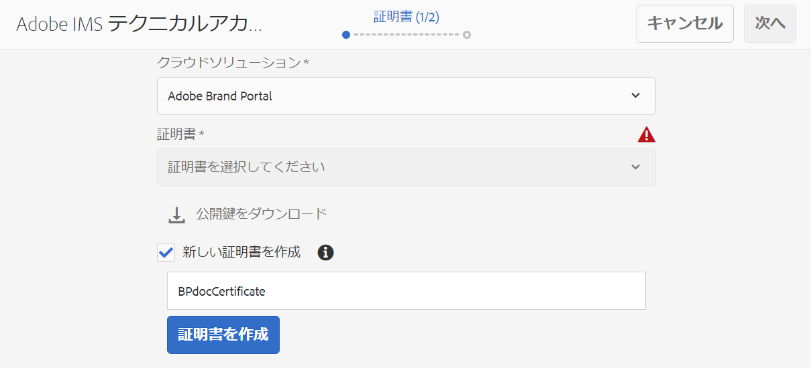

1. 「**[!UICONTROL 公開鍵をダウンロード]**」をクリックし、*AEM-Adobe-IMS.crt* 証明書ファイルをローカルマシンに保存します。この証明書ファイルは、[Adobe I/O 統合環境の作成](#createnewintegration)に使用されます。

   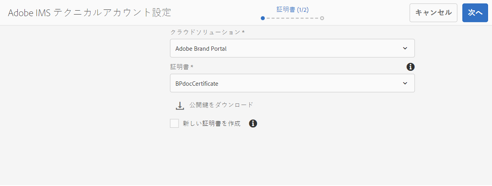

1. 「**[!UICONTROL 次へ]**」をクリックします。

   「**アカウント**」タブで、Adobe IMS アカウントを作成するには、統合環境の詳細が必要です。このページは開いたままにしておきます。

   新しいタブを開き、[Adobe I/O 統合環境を作成](#createnewintegration)して、IMS アカウント設定の統合環境の詳細を取得します。

### Adobe I/O 統合環境の作成{#createnewintegration}

Adobe I/O 統合環境により、API キー、クライアント秘密鍵、および IMS アカウント設定の設定で必要なペイロード（JWT）が生成されます。

1. Brand Portal テナントの IMS 組織のシステム管理者権限で Adobe I/O コンソールにログインします。

   デフォルト URL：[https://console.adobe.io/](https://console.adobe.io/)

1. 「**[!UICONTROL 統合を作成]**」をクリックします。

1. 「**[!UICONTROL API にアクセス]**」を選択し、「**[!UICONTROL 続行]**」をクリックします。

   

1. 新しい統合を作成ページを開きます。

   ドロップダウンリストからご自身の組織を選択します。

   **[!UICONTROL Experience Cloud]** で「**[!UICONTROL AEM Brand Portal]**」を選択し、「**[!UICONTROL 続行]**」をクリックします。

   「Brand Portal」オプションが無効になっている場合は、「**[!UICONTROL アドビのサービス]**」オプションの上にあるドロップダウンボックスで正しい組織が選択されているかどうかを確認してください。自分がどの組織に属しているかわからない場合は、管理者に問い合わせてください。

   

1. 新しい統合環境の名前と説明を入力します。「**[!UICONTROL お使いのコンピューターからファイルを選択]**」をクリックし、「[公開証明書を取得する](#public-certificate)」セクションでダウンロードした `AEM-Adobe-IMS.crt` ファイルをアップロードします。

1. 組織のプロファイルを選択します。

   または、デフォルトのプロファイル **[!UICONTROL Assets Brand Portal]** を選択し、「**[!UICONTROL 統合を作成]**」をクリックします。統合環境が作成されます。

1. 「**[!UICONTROL 統合の詳細情報に進む]**」をクリックして、統合環境の詳細情報を表示します。

   **[!UICONTROL API キーのコピー]**

   「**[!UICONTROL クライアント秘密鍵を取得]**」をクリックし、クライアント秘密鍵をコピーします。

   

1. 「**[!UICONTROL JWT]**」タブに移動し、**[!UICONTROL JWT ペイロード]**&#x200B;をコピーします。

   API キー、クライアント秘密鍵、JWT ペイロード情報は、IMS アカウント設定の作成に使用されます。

### IMS アカウント設定の作成 {#create-ims-account-configuration}

次の手順を実行したことを確認します。

* [公開証明書の取得](#public-certificate)
* [Adobe I/O 統合環境の作成](#createnewintegration)

**IMS アカウント設定の作成手順：**

1. IMS 設定ページの「**[!UICONTROL アカウント]**」タブを開きます。（このページは、「[公開証明書を取得する](#public-certificate)」セクションの最後で開いたままにしておいたページです）。

1. IMS アカウントの&#x200B;**[!UICONTROL タイトル]**&#x200B;を指定します。

   「**[!UICONTROL 認証サーバー]**」に次の URL を入力します。[https://ims-na1.adobelogin.com/](https://ims-na1.adobelogin.com/)

   [Adobe I/O 統合環境の作成](#createnewintegration)の最後にコピーした API キー、クライアント秘密鍵、JWT ペイロードを貼り付けます。

   「**[!UICONTROL 作成]**」をクリックします。

   統合環境が作成されます。

   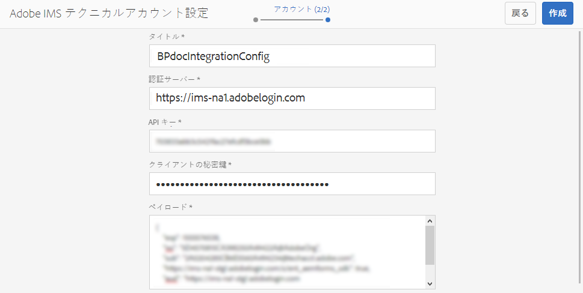

1. 作成した IMS 設定を選択して「**[!UICONTROL ヘルスチェック]**」をクリックします。ダイアログボックスが表示されます。

   「**[!UICONTROL チェック]**」をクリック。接続が成功すると、*トークンが正常に取得された*&#x200B;ことを示すメッセージが表示されます。

   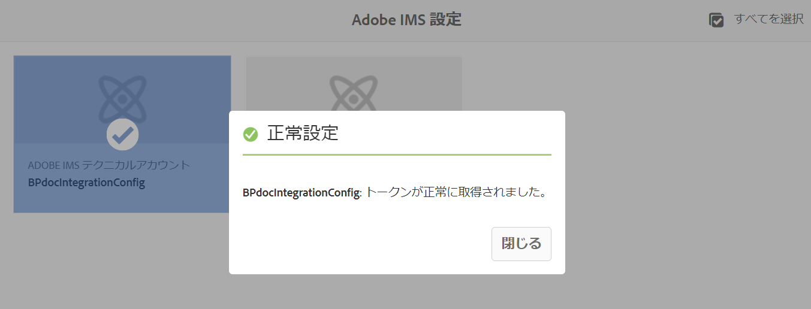

>[!CAUTION]
>
>IMS 設定は 1 つだけにする必要があります。複数の IMS 設定を作成しないでください。
>
>IMS 設定がヘルスチェックに合格していることを確認します。設定がヘルスチェックに合格しない場合は無効です。削除して、新しい有効な設定を作成する必要があります。

### Cloud Service の設定{#configure-the-cloud-service}

Brand Portal クラウドサービス設定を作成するには、以下の手順を実行します。

1. AEM Assets作成者インスタンスにログインします

   （デフォルト URL：http:// localhost:4502/aem/start.html）にログインします。
1. **ツール** ツールパネルで、クラウドサービス/AEM Brand Portalに移動します ****。

   Brand Portal 設定ページが開きます。

1. 「**[!UICONTROL 作成]**」をクリックします。

1. 設定の&#x200B;**[!UICONTROL タイトル]**&#x200B;を入力します。

   [IMS アカウント設定の作成](#create-ims-account-configuration)手順で作成した IMS 設定を選択します。

   「**[!UICONTROL サービス URL]**」に、Brand Portal テナント URL を入力します。

   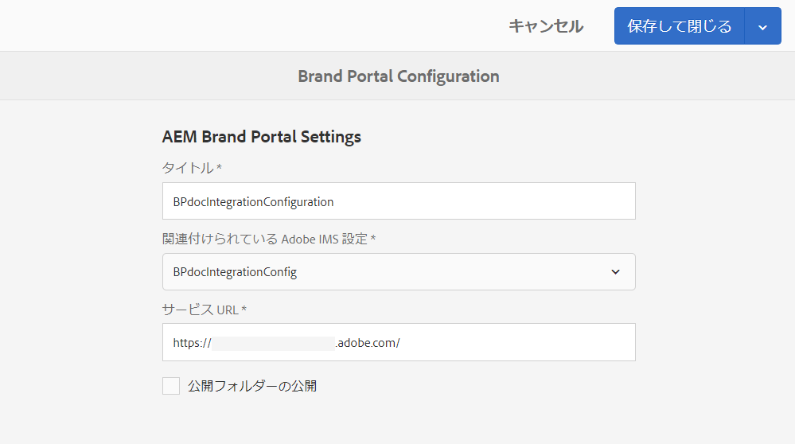

1. 「**[!UICONTROL 保存して閉じる]**」をクリックします。クラウド設定が作成されます。これで、AEM Assets作成者インスタンスがBrand Portalテナントと統合されました。

### 設定のテスト{#test-integration}

1. AEM Assets作成者インスタンスにログインします

   （デフォルト URL：http:// localhost:4502/aem/start.html）にログインします。

1. [ **ツール****[!UICONTROL ツール]**]パネルで、[Deployment] > [Replication]に移動します。

   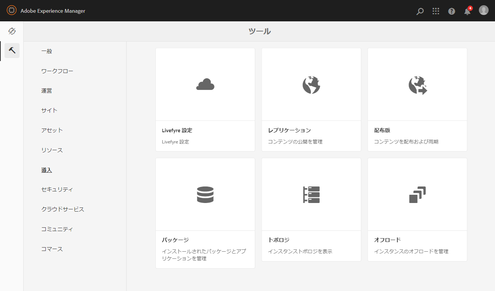

1. レプリケーションページが開きます。

   「作成者の **[!UICONTROL エージェント]**」をクリックします。

   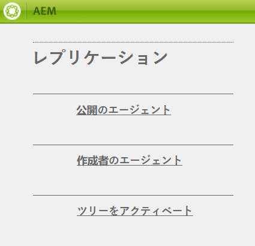

1. 各テナントに4つのレプリケーションエージェントが作成されます。

   Brand Portalテナントのレプリケーションエージェントを見つけます。

   複製エージェントのURLをクリックします。

   

   >[!NOTE]
   >
   >レプリケーションエージェントは並行して動作し、ジョブの分散を均等に共有するので、パブリッシング速度を元の速度の4倍に増やします。 クラウドサービスの設定後、複数のアセットの並列発行を有効にするために、デフォルトでアクティブ化される複製エージェントを有効にするために、追加の設定は必要ありません。

   >[!NOTE]
   >
   >どのレプリケーションエージェントも無効にしないでください。一部のアセットのレプリケーションが失敗する可能性があります。

1. To verify the connection between AEM Assets author and Brand Portal, click **[!UICONTROL Test Connection]**.

   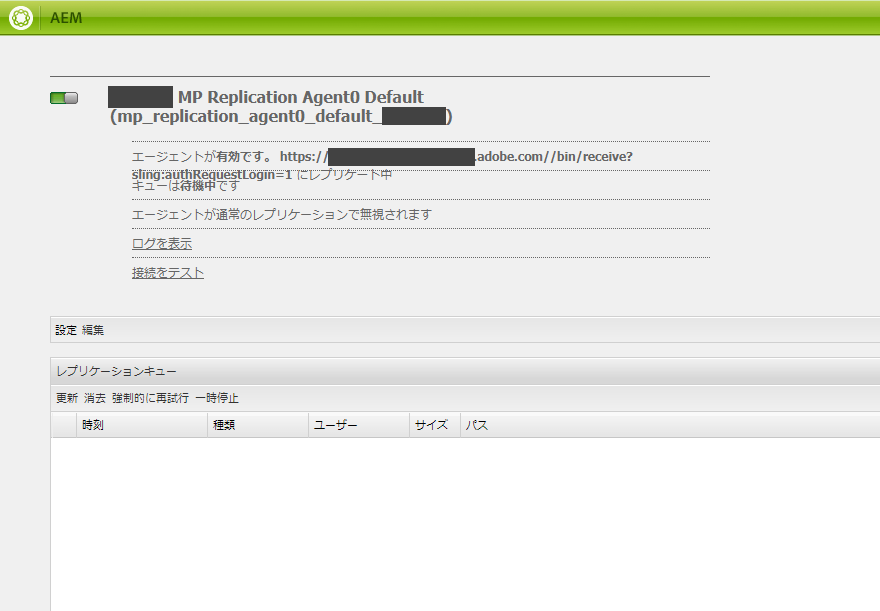

1. テスト結果の一番下を見て、レプリケーションが成功したことを確認します。

   

   >[!NOTE]
   >
   >レプリケーションエージェントは並行して動作し、ジョブの分散を均等に共有するので、パブリッシング速度を元の速度の4倍に増やします。 クラウドサービスの設定後、複数のアセットの並列発行を有効にするために、デフォルトでアクティブ化される複製エージェントを有効にするために、追加の設定は必要ありません。

1. 4つのレプリケーションエージェントすべてに対するテスト結果を1つずつ確認します。

   >[!NOTE]
   >
   >どのレプリケーションエージェントも無効にしないでください。一部のアセットのレプリケーションが失敗する可能性があります。

Brand PortalはAEM Assetsオーサーインスタンスで正しく設定されます。 次の操作が可能になりました。

* [AEM Assets から Brand Portal へのアセットの公開](../assets/brand-portal-publish-assets.md)
* [AEM Assets から Brand Portal へのフォルダーの公開](../assets/brand-portal-publish-folder.md)
* [AEM Assets から Brand Portal へのコレクションの公開](../assets/brand-portal-publish-collection.md)
* [Asset Sourcingを設定し](https://docs.adobe.com/content/help/ja-JP/experience-manager-brand-portal/using/asset-sourcing-in-brand-portal/brand-portal-asset-sourcing.html) 、Brand PortalユーザがAEM Assetsにアセットを寄稿して公開できるようにします。

## 設定のアップグレード {#upgrade-integration-65}

既存の設定をアップグレードするには、次の手順を一覧に示す順序で実行します。
1. [実行中のジョブの確認](#verify-jobs)
1. [既存の設定の削除](#delete-existing-configuration)
1. [設定の作成](#configure-new-integration-65)

### 実行中のジョブの確認 {#verify-jobs}

変更を行う前に、AEM Assetsオーサーインスタンスで公開ジョブが実行されていないことを確認してください。 その場合は、4つのレプリケーションエージェントをすべて検証し、キューが理想的/空であることを確認できます。

1. AEM Assets作成者インスタンスにログインします

   （デフォルト URL：http:// localhost:4502/aem/start.html）にログインします。

1. [ **ツール****[!UICONTROL ツール]**]パネルで、[Deployment] > [Replication]に移動します。

1. レプリケーションページが開きます。

   「作成者の **[!UICONTROL エージェント]**」をクリックします。

   

1. Brand Portalテナントのレプリケーションエージェントを見つけます。

   すべてのレプリケーションエージェントで **キューがアイドル状態であることを確認します** 。公開ジョブがアクティブでないことを確認します。

   

### 既存の設定の削除 {#delete-existing-configuration}

既存の設定の削除中に、次のチェックリストを実行する必要があります。
* 4つのレプリケーションエージェントをすべて削除する
* クラウドサービスの削除
* MACユーザーの削除

1. AEM Assetsオーサーインスタンスにログインし、管理者としてCRX Liteを開きます。

   デフォルトURL: http:// localhost:4502/crx/de/index.jsp

1. Brand Portalテナントの4つのレプリケーションエージェントすべてに移動 `/etc/replications/agents.author` して削除します。

   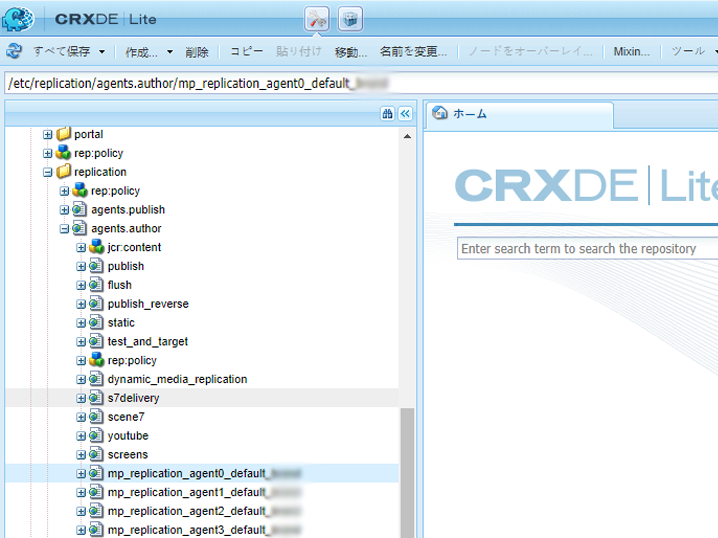

1. ク `/etc/cloudservices/mediaportal` ラウドサービスの設定に移動 **して削除します**。

   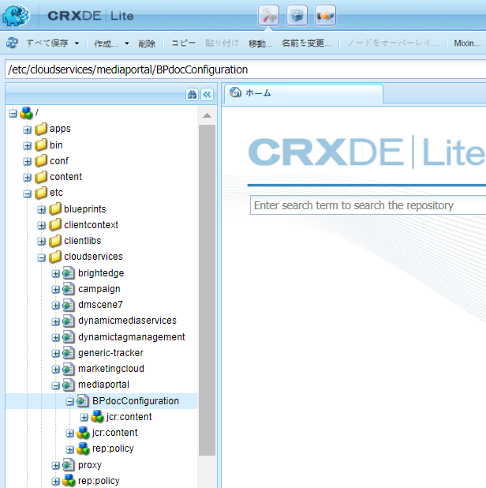

1. Brand Portalテナントの `/home/users/mac` MACユーザ **** に移動して削除します。

   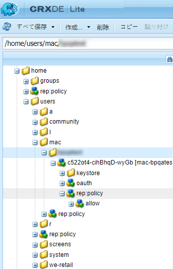

Adobe I/O上のAEM 6.5オーサーインスタンスに設定 [を](#configure-new-integration-65) 作成できるようになりました。

<!--
   Comment Type: draft

   <li> </li>
   -->

<!--
   Comment Type: draft

   <li>Step text</li>
   -->

レプリケーションが正常に終了したら、アセット、フォルダー、コレクションを Brand Portal に公開することができます。詳しくは、次を参照してください。

* [Brand Portal へのアセットの公開](/help/assets/brand-portal-publish-assets.md)
* [Brand Portal へのフォルダーの公開](/help/assets/brand-portal-publish-folder.md)
* [Brand Portal へのコレクションの公開](/help/assets/brand-portal-publish-collection.md)
