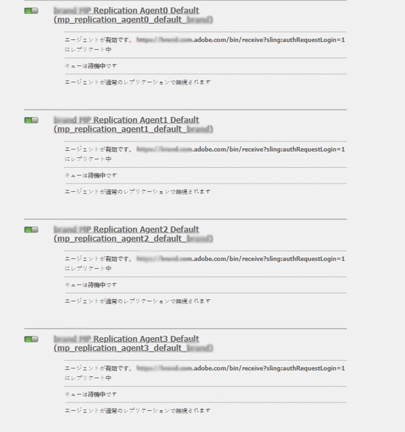

# AEM Assets と Brand Portal の連携の設定 {#configure-integration-65}

Adobe Experience Managerアセットブランドポータルを使用すると、承認されたブランドアセットをAdobe Experience ManagerアセットからBrand Portalに公開し、Brand Portalユーザに配信できます。

AEM Assets は、Adobe 開発者コンソールを介して Brand Portal と連携して設定されます。このコンソールは、Adobe Identity Management サービス（IMS）アカウントトークンを調達し、Brand Portal テナントの認証を受けます。

>[!NOTE]
>
>Adobe開発者コンソールを使用したBrand PortalでのAEM Assetsの設定は、AEM 6.5.4.0以降でサポートされています。
>
>以前は、Brand Portalは従来のOAuth Gatewayを介して設定されていました。従来のOAuth Gatewayは、JSON Web Token(JWT)交換を使用して、認証用のIMSアクセストークンを取得します。
>
>従来のOAuth Gatewayを使用した設定は、2020年4月6日からサポートされなくなり、Adobe開発者コンソールに変更されました。

>[!TIP]
>
>***既存のお客様のみ***
>
>既存のレガシーOAuth Gateway構成を引き続き使用することをお勧めします。 レガシーOAuth Gateway設定で問題が発生した場合は、既存の設定を削除し、Adobe開発者コンソールを使用して新しい設定を作成します。

このヘルプでは、次の2つの使用例について説明します。

* [新しい設定](#configure-new-integration-65):新しいBrand Portalユーザーで、Brand PortalでAEM Assetsの作成者インスタンスを設定する場合は、Adobe開発者コンソールで設定を作成できます。
* [アップグレード設定](#upgrade-integration-65):既存のBrand Portalユーザーが従来のOAuth Gatewayに対して設定を行っている場合は、既存の設定を削除し、Adobe開発者コンソールを使用して新しい設定を作成します。

具体的には、以下の操作に関する十分な知識があるユーザーを対象としています。

* Adobe Experience ManagerおよびAEMパッケージのインストール、設定、管理。

* LinuxおよびMicrosoft Windowsオペレーティングシステムの使用

## 前提条件 {#prerequisites}

AEM Assets と Brand Portal の連携を設定するには以下が必要です。

* 最新のService Packを含むAEM Assets作成者インスタンスを起動および実行する
* Brand Portal テナント URL
* Brand Portal テナントの IMS 組織に対するシステム管理者権限を持つユーザー

[AEM 6.5のダウンロードとインストール](#aemquickstart)

[最新の AEM サービスパックをダウンロードしてインストールする](#servicepack)

### AEM 6.5 {#aemquickstart}をダウンロードしてインストール

AEMオーサーインスタンスを設定するには、AEM 6.5を使用することをお勧めします。 AEM が稼働していない場合は、以下の場所から AEM をダウンロードしてください。

* 既存のAEMをお使いの場合は、[AdobeライセンスWebサイト](http://licensing.adobe.com)からAEM 6.5をダウンロードしてください。

* Adobeパートナーの場合は、[Adobeパートナートレーニングプログラム](https://adobe.allegiancetech.com/cgi-bin/qwebcorporate.dll?idx=82357Q)を使用してAEM 6.5をリクエストします。

AEM をダウンロードしたら、「[デプロイメントと保守](https://docs.adobe.com/content/help/en/experience-manager-65/deploying/deploying/deploy.html#default-local-install)」の説明に従い、AEM オーサーインスタンスの設定を行ってください。

### 最新の AEM サービスパックをダウンロードしてインストールする{#servicepack}

詳細な手順については、

* [AEM 6.5 Service Pack リリースノート](https://docs.adobe.com/content/help/en/experience-manager-65/release-notes/service-pack/sp-release-notes.html)

**最新のAEMパッケージまたはService Packが見つからない場合は、** サポートにお問い合わせください。

## 設定の作成 {#configure-new-integration-65}

Brand PortalでAEM Assetsを設定するには、AEM Assets作成者インスタンスとAdobe開発者コンソールの両方の設定が必要です。

1. AEM Assetsで、IMSアカウントを作成し、公開証明書（公開鍵）を生成します。
1. Adobe 開発者コンソールで、Brand Portal テナント（組織）用のプロジェクトを作成します。
1. そのプロジェクトで、公開鍵で API を設定して、サービスアカウント（JWT）接続を作成します。
1. サービスアカウント資格情報と JWT ペイロード情報を取得します。
1. AEM Assets で、サービスアカウント資格情報と JWT ペイロードを使用して IMS アカウントを設定します。
1. AEM Assets で、IMS アカウントと Brand Portal エンドポイント（組織 URL）を使用して Brand Portal Cloud Service を設定します。
1. AEM Assets から Brand Portal にアセットを公開して、設定をテストします。

>[!NOTE]
>
>AEM Assetsの作成者インスタンスは、1つのBrand Portalテナントでのみ構成できます。

ブランドポータルを使用してAEM Assetsを初めて設定する場合は、一覧に示した順序で次の手順を実行します。
1. [公開証明書の取得](#public-certificate)
1. [サービスアカウント（JWT）接続の作成](#createnewintegration)
1. [IMS アカウントの設定](#create-ims-account-configuration)
1. [Cloud Service の設定](#configure-the-cloud-service)
1. [設定のテスト](#test-integration)

### IMS 設定の作成 {#create-ims-configuration}

IMS設定は、Brand PortalテナントでAEM Assets作成者インスタンスを認証します。

IMS 設定には、次の 2 つの手順が含まれます。

* [公開証明書の取得](#public-certificate)
* [IMS アカウントの設定](#create-ims-account-configuration)

### 公開証明書の取得 {#public-certificate}

公開鍵（証明書）は、Adobe 開発者コンソールでプロファイルを認証します。

1. AEM Assets オーサーインスタンスにログインします。デフォルトの URL は `http://localhost:4502/aem/start.html` です。

1. **ツール**パネルで、**[!UICONTROL セキュリティ]**／**[!UICONTROL Adobe IMS 設定]**&#x200B;に移動します。

1. Adobe IMS 設定ページで、「**[!UICONTROL 作成]**」をクリックします。**[!UICONTROL Adobe IMS 技術アカウント設定]**&#x200B;ページにリダイレクトされます。デフォルトでは、「**証明書**」タブが開きます。

1. 「**[!UICONTROL クラウドソルーション]**」ドロップダウンリストで「**[!UICONTROL Adobe Brand Portal]**」を選択します。

1. 「**[!UICONTROL 新しい証明書を作成]**」チェックボックスをオンにして、公開鍵の&#x200B;**エイリアス**&#x200B;を指定します。ここで入力したエイリアスが、公開鍵になります。

1. 「**[!UICONTROL 証明書を作成]**」をクリックします。「**[!UICONTROL OK]**」をクリックして公開証明書を生成します。

   

1. **[!UICONTROL 公開鍵をダウンロード]**&#x200B;アイコンをクリックして、公開鍵（.crt）ファイルをローカルマシンに保存します。

   この公開鍵を後で使用して、Brand Portal テナントの API を設定し、Adobe 開発者コンソールでサービスアカウント資格情報を生成します。

   

1. 「**[!UICONTROL 次へ]**」をクリックします。

   「**アカウント**」タブで、Adobe IMS アカウントが作成されます。このアカウントには、Adobe 開発者コンソールで生成されるサービスアカウント資格情報が必要です。このページは開いたままにしておきます。

   新しいタブを開き、[Adobe 開発者コンソールでサービスアカウント（JWT）接続を作成](#createnewintegration)して、IMS アカウントを設定するための資格情報と JWT ペイロードを取得します。

### サービスアカウント（JWT）接続の作成 {#createnewintegration}

Adobe 開発者コンソールで、プロジェクトと API を Brand Portal テナント（組織）レベルで設定します。API を設定すると、サービスアカウント（JWT）接続が作成されます。API を設定するには、キーペア（秘密鍵と公開鍵）を生成する方法と、公開鍵をアップロードする方法の 2 とおりがあります。AEM Assets と Brand Portal の統合を設定するには、AEM Assets で公開鍵（証明書）を生成し、その公開鍵をアップロードして Adobe 開発者コンソールで資格情報を作成する必要があります。これらの資格情報は、AEM Assets で IMS アカウントを設定するために必要です。IMS アカウントを設定したら、AEM Assets に Brand Portal Cloud Service を設定できます。

サービスアカウント資格情報と JWT ペイロードを生成するには、次の手順を実行します。

1. IMS 組織（Brand Portal テナント）のシステム管理者権限で Adobe 開発者コンソールにログインします。デフォルトの URL は次のとおりです。[https://www.adobe.com/go/devs_console_ui](https://www.adobe.com/go/devs_console_ui).

   >[!NOTE]
   >
   >右上隅にあるドロップダウン（組織）リストから正しい IMS 組織（Brand Portal テナント）が選択されていることを確認します。

1. 「**[!UICONTROL 新規プロジェクトを作成]**」をクリックします。システムで生成された名前を持つ空のプロジェクトが組織に対して作成されます。

   「**[!UICONTROL プロジェクトを編集]**」をクリックして、「**[!UICONTROL プロジェクトタイトル]**」と「**[!UICONTROL 説明]**」をアップデートし、「**[!UICONTROL 保存]**」をクリックします。

1. 「**[!UICONTROL プロジェクトの概要]**」タブで、「**[!UICONTROL API を追加]**」をクリックします。

1. **[!UICONTROL API を追加]**&#x200B;ウィンドウで、「**[!UICONTROL AEM Brand Portal]**」を選択し、「**[!UICONTROL 次へ]**」をクリックします。

   AEM Brand Portal サービスにアクセスできることを確認します。

1. **[!UICONTROL API を設定]**&#x200B;ウィンドウで、「**[!UICONTROL 公開鍵をアップロード]**」をクリックします。次に、「**[!UICONTROL ファイルを選択]**」をクリックし、[公開証明書の取得](#public-certificate)節でダウンロードした公開鍵（.crt ファイル）をアップロードします。

   「**[!UICONTROL 次へ]**」をクリックします。

   

1. 公開鍵を確認し、「**[!UICONTROL 次へ]**」をクリックします。

1. デフォルトの製品プロファイルとして「**[!UICONTROL Assets Brand Portal]**」を選択し、「**[!UICONTROL 設定済み API を保存]**」をクリックします。

   <!-- 
   In Brand Portal, a default profile is created for each organization. The Product Profiles are created in admin console for assigning users to groups (based on the roles and permissions). For configuration with Brand Portal, the OAuth token is created at organization level. Therefore, you must configure the default Product Profile for your organization. 
   -->

   

1. API が設定されると、API の概要ページにリダイレクトされます。左側のナビゲーションツリーで「**[!UICONTROL 資格情報]**」の下の「**[!UICONTROL サービスアカウント（JWT）]**」オプションをクリックします。

   >[!NOTE]
   >
   >資格情報を確認し、必要に応じて、JWT トークンの生成、資格情報の詳細のコピー、クライアントの秘密鍵の取得などのアクションを実行できます。

1. 「**[!UICONTROL クライアント資格情報]**」タブから、**[!UICONTROL クライアント ID]** をコピーします。

   「**[!UICONTROL クライアント秘密鍵を取得]**」をクリックし、**[!UICONTROL クライアントの秘密鍵]**&#x200B;をコピーします。

   

1. 「**[!UICONTROL JWT を生成]**」タブに移動し、**[!UICONTROL JWT ペイロード]**&#x200B;情報をコピーします。

これで、クライアント ID（API キー）、クライアントの秘密鍵、JWT ペイロードを使用して、AEM Assets に [IMS アカウントを設定](#create-ims-account-configuration)できるようになりました。

<!--
### Create Adobe I/O integration {#createnewintegration}

Adobe I/O integration generates API Key, Client Secret, and Payload (JWT) which is required in setting up the IMS Account configurations.

1. Login to Adobe I/O Console with system administrator privileges on the IMS organization of the Brand Portal tenant.

   Default URL: [https://console.adobe.io/](https://console.adobe.io/) 

1. Click **[!UICONTROL Create Integration]**.

1. Select **[!UICONTROL Access an API]**, and click **[!UICONTROL Continue]**.

   

1. Create a new integration page opens. 
   
   Select your organization from the drop-down list.

   In **[!UICONTROL Experience Cloud]**, Select **[!UICONTROL AEM Brand Portal]** and click **[!UICONTROL Continue]**. 

   If the Brand Portal option is disabled for you, ensure that you have selected correct organization from the drop-down box above the **[!UICONTROL Adobe Services]** option. If you do not know your organization, contact your administrator.

   

1. Specify a name and description for the integration. Click **[!UICONTROL Select a File from your computer]** and upload the `AEM-Adobe-IMS.crt` file downloaded in the [obtain public certificates](#public-certificate) section.

1. Select the profile of your organization. 

   Or, select the default profile **[!UICONTROL Assets Brand Portal]** and click **[!UICONTROL Create Integration]**. The integration is created.

1. Click **[!UICONTROL Continue to integration details]** to view the integration information. 

   Copy the **[!UICONTROL API Key]** 
   
   Click **[!UICONTROL Retrieve Client Secret]** and copy the Client Secret key.

   

1. Navigate to **[!UICONTROL JWT]** tab, and copy the **[!UICONTROL JWT payload]**.

   The API Key, Client Secret key, and JWT payload information will be used to create IMS account configuration.
-->

### IMS アカウントの設定 {#create-ims-account-configuration}

次の手順を実行したことを確認します。

* [公開証明書の取得](#public-certificate)
* [サービスアカウント（JWT）接続の作成](#createnewintegration)

IMS アカウントを設定するには、次の手順を実行します。

1. IMS 設定を開き、「**[!UICONTROL アカウント]**」タブに移動します。[公開証明書の取得](#public-certificate)中も、ページは開いたままになっています。

1. IMS アカウントの&#x200B;**[!UICONTROL タイトル]**&#x200B;を指定します。

   「**[!UICONTROL 認証サーバー]**」フィールドで、URL「 [https://ims-na1.adobelogin.com/](https://ims-na1.adobelogin.com/)」を指定します。。

   **[!UICONTROL API キー]**&#x200B;にクライアント ID を指定し、[サービスアカウント（JWT）接続の作成](#createnewintegration)時にコピーした&#x200B;**[!UICONTROL クライアントの秘密鍵]**&#x200B;と&#x200B;**[!UICONTROL ペイロード]**（JWT ペイロード）を貼り付けます。

   「**[!UICONTROL 作成]**」をクリックします。

   IMS アカウントが設定されます。

   

1. その IMS アカウント設定を選択し、「**[!UICONTROL 正常性をチェック]**」をクリックします。

   ダイアログボックスの「**[!UICONTROL チェック]**」をクリックします。正常に設定されると、*トークンが正常に取得されました*&#x200B;というメッセージが表示されます。

   

>[!CAUTION]
>
>IMS 設定は 1 つだけにする必要があります。
>
>IMS 設定がヘルスチェックに合格していることを確認します。設定がヘルスチェックに合格しない場合は無効です。削除して、新しい有効な設定を作成する必要があります。

### Cloud Service の設定{#configure-the-cloud-service}

Brand Portal Cloud Service を設定するには、次の手順を実行します。

1. AEM Assets オーサーインスタンスにログインします。

1. **ツール**&#x200B;のパネルで、**[!UICONTROL Cloud Services]**／**[!UICONTROL AEM Brand Portal]** に移動します。

1. Brand Portal の設定ページで、「**[!UICONTROL 作成]**」をクリックします。

1. 設定の&#x200B;**[!UICONTROL タイトル]**&#x200B;を入力します。

   [IMS アカウントの設定](#create-ims-account-configuration)時に作成した IMS 設定を選択します。

   「**[!UICONTROL サービス URL]**」に、Brand Portal テナント（組織） URL を入力します。

   

1. 「**[!UICONTROL 保存して閉じる]**」をクリックします。クラウド設定が作成されます。

   これで、AEM Assets作成者インスタンスがBrand Portalテナントと共に設定されました。

### 設定のテスト{#test-integration}

設定を検証するには、次の手順を実行します。

1. AEM Assets クラウドインスタンスにログインします。

1. **ツール** パネルから、**[!UICONTROL 展開]**/**[!UICONTROL レプリケーション]**&#x200B;に移動します。

   

1. レプリケーションページで、「**[!UICONTROL 作成者のエージェント]**」をクリックします。

   

   Brand Portalテナント用に作成された4つのレプリケーションエージェントが表示されます。

   Brand Portalテナントのレプリケーションエージェントを探し、レプリケーションエージェントURLをクリックします。

   

   >[!NOTE]
   >
   >レプリケーションエージェントは並行して動作し、ジョブの分散を均等に共有するので、パブリッシング速度を元の速度の4倍に増やします。 クラウドサービスの設定後、複数のアセットの並列発行を有効にするために、デフォルトでアクティブ化される複製エージェントを有効にするために、追加の設定は必要ありません。

1. AEM AssetsとBrand Portalの接続を確認するには、**[!UICONTROL 接続をテスト]**&#x200B;アイコンをクリックします。

   

   *テストパッケージが正常に配信された*&#x200B;ことを示すメッセージが表示されます。

   

1. 4つのレプリケーションエージェントすべてでテスト結果を確認します。

   >[!NOTE]
   >
   >アセットの複製（実行中のキュー）が失敗する原因となる可能性があるので、複製エージェントを無効にしないでください。
   >
   >タイムアウトエラーを回避するために、4つのレプリケーションエージェントがすべて構成されていることを確認します。 [Brand Portalへの並行投稿での問題のトラブルシューティング](https://docs.adobe.com/content/help/en/experience-manager-brand-portal/using/publish/troubleshoot-parallel-publishing.html#connection-timeout)を参照してください。

次の操作が可能になっています。

* [AEM Assets から Brand Portal へのアセットの公開](../assets/brand-portal-publish-assets.md)
* [Brand PortalからAEM Assets](https://docs.adobe.com/content/help/ja-JP/experience-manager-brand-portal/using/asset-sourcing-in-brand-portal/brand-portal-asset-sourcing.html) - Brand Portalでアセットを発行
* [AEM Assets から Brand Portal へのフォルダーの公開](../assets/brand-portal-publish-folder.md)
* [AEM Assets から Brand Portal へのコレクションの公開](../assets/brand-portal-publish-collection.md)
* [Brand Portal へのプリセット、スキーマ、ファセットの公開](https://docs.adobe.com/content/help/en/experience-manager-brand-portal/using/publish/publish-schema-search-facets-presets.html)
* [Brand Portal へのタグの公開](https://docs.adobe.com/content/help/en/experience-manager-brand-portal/using/publish/brand-portal-publish-tags.html)

詳しくは、[Brand Portal ドキュメント](https://docs.adobe.com/content/help/ja-JP/experience-manager-brand-portal/using/home.html)を参照してください。

## 設定のアップグレード {#upgrade-integration-65}

既存の設定をAdobe開発者コンソールにアップグレードするには、一覧に示した手順に従って次の手順を実行します。
1. [実行中のジョブの確認](#verify-jobs)
1. [既存の設定の削除](#delete-existing-configuration)
1. [設定の作成](#configure-new-integration-65)

### 実行中のジョブの確認{#verify-jobs}

変更を行う前に、AEM Assetsの作成者インスタンスで発行ジョブが実行されていないことを確認してください。 その場合は、4つのレプリケーションエージェントすべてでアクティブなジョブの状態を確認し、キューがアイドル状態であることを確認できます。

1. AEM Assets オーサーインスタンスにログインします。

1. **ツール** パネルから、**[!UICONTROL 展開]**/**[!UICONTROL 展開レプリケーション]**&#x200B;に移動します。

1. レプリケーションページで、「**[!UICONTROL 作成者のエージェント]**」をクリックします。

   

1. Brand Portalテナントのレプリケーションエージェントを見つけます。

   すべてのレプリケーションエージェントで&#x200B;**キューがアイドル**&#x200B;であることを確認します。公開ジョブがアクティブでないことを確認してください。

   

### 既存の構成の削除{#delete-existing-configuration}

既存の設定の削除時に、次のチェックリストを実行する必要があります。
* 4つのレプリケーションエージェントをすべて削除する
* Brand Portalクラウドサービスの削除
* MACユーザーの削除

1. AEM Assets作成者インスタンスにログインし、管理者としてCRX Liteを開きます。 デフォルトの URL は `http://localhost:4502/crx/de/index.jsp` です。

1. `/etc/replications/agents.author`に移動し、Brand Portalテナントの4つのレプリケーションエージェントをすべて削除します。

   

1. `/etc/cloudservices/mediaportal`に移動し、Brand Portalクラウドサービスの設定を削除します。

   

1. `/home/users/mac`に移動し、Brand Portalテナントの&#x200B;**MACユーザー**&#x200B;を削除します。

   

AEM 6.5作成者インスタンス上のAdobe開発者コンソールを使用して、設定[を作成できるようになりました。](#configure-new-integration-65)

<!--
   Comment Type: draft

   <li> </li>
   -->

<!--
   Comment Type: draft

   <li>Step text</li>
   -->

