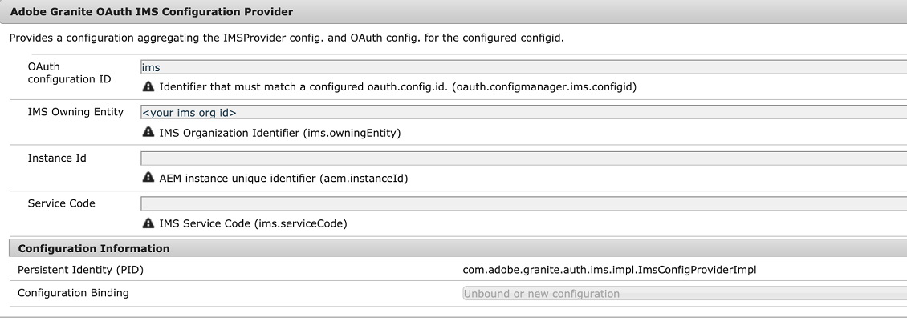
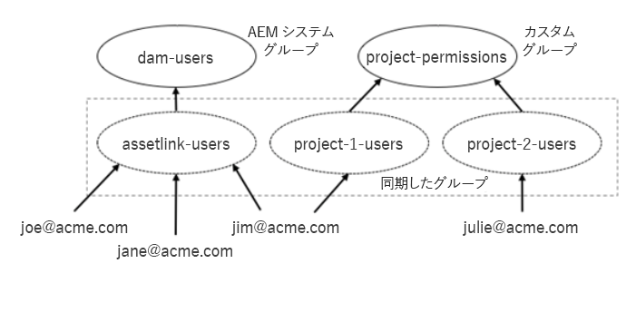

# Experience Manager Assets を Adobe Asset Link 用に設定 {#adobe-asset-link}

[Adobe Asset Link（AAL）](https://www.adobe.com/jp/creativecloud/business/enterprise/adobe-asset-link.html) を使用すると、コンテンツ作成プロセスでのクリエイターとマーケティング担当者の共同作業を効率化できます。Adobe Experience Manager Assets を Creative Cloud デスクトップアプリケーションの Adobe InDesign、Adobe Photoshop および Adobe Illustrator に接続します。Adobe Asset Link パネルを使用すると、クリエイターが最も慣れているクリエイティブアプリから離れることなく、AEM Assets に保存されたコンテンツをアクセスしたり、変更したりすることができます。

Experience Manager Assetsを Asset Link と共に使用するように設定するには、次のタスクを実行します。Experience Manager 管理者アカウントを使用して設定を行います。

1. 必要に応じて、パッケージをインストールします。詳しくは、[前提条件](#prerequisites)を参照してください。

1. Experience Manager を[手動で](#manual-configuration)設定するか、[パッケージ](#configure-using-package)を使用して設定します。

1. Creative Cloud のライセンス取得済みユーザーを Experience Manager ユーザーにマッピングするには、 [ユーザーのアクセス制御](#user-access)を管理します。

1. [カスタムクエリインデックス](#create-custom-index)作成し、InDesign の [FPO レンディション](/help/assets/configure-fpo-renditions.md)を設定し、 [Adobe Stock の統合](/help/assets/aem-assets-adobe-stock.md)を設定し、[ビジュアル検索または類似性検索](https://experienceleague.adobe.com/docs/experience-manager-65/assets/using/search-assets.html#configvisualsearch?lang=ja)を設定します。

## 様々な機能の前提条件とサポート {#prerequisites}

必要に応じて適切なサービスパックとパッケージをインストールしてください。各 Experience Manager バージョンとその機能については、次の要件を参照してください。

| Assets の機能 | Experience Manager のバージョンとサポート要件 |
|--- |--- |
| アセットリンクはデフォルトで機能します | Experience Manager 6.5 および 6.5.2 以降。  Experience Manager 6.4.4 および 6.4.6 以降。  アドビでは、AAL を使用する前に、最新の [Experience Manager サービスパック（SP）](https://experienceleague.adobe.com/docs/experience-manager-release-information/aem-release-updates/aem-releases-updates.html?lang=ja) をインストールすることをお勧めします。 |
| パッケージのインストール後にアセットリンクが機能します | Experience Manager 6.4.0 ～ 6.4.3 の場合は、[adobe-asset-link-support](https://experience.adobe.com/#/downloads/content/software-distribution/jp/aem.html?package=/content/software-distribution/en/details.html/content/dam/aem/public/adobe/packages/cq640/featurepack/adobe-asset-link-support) パッケージをインストールします。 |
| Adobe Stock の統合 | Experience Manager 6.4.2 以降 |
| ビジュアル検索または類似性検索 | Experience Manager 6.5.0 以降 |

## 設定パッケージを使用した Experience Manager の設定 {#configure-using-package}

アドビでは、[adobe-asset-link-config](https://experience.adobe.com/#/downloads/content/software-distribution/en/aem.html?package=/content/software-distribution/jp/details.html/content/dam/aem/public/adobe/packages/cq640/product/assets/adobe-asset-link-config) 設定パッケージをインストールしてほとんどの設定タスクを自動化し、その後で少しの手動タスクを実行することをお勧めします。または、[手動で設定](#manual-configuration)することもできます。

>[!CAUTION]
>
>Experience Manager インスタンスが Adobe IMS アカウントのユーザーログイン用に設定されている場合は、設定パッケージを使用しないでください。代わりに、Experience Manager インスタンスを[手動で設定](#manual-configuration)します。

1. パッケージマネージャーを開くには、Experience Manager web インターフェイスで、 **[!UICONTROL ツール]**／**[!UICONTROL デプロイメント]**／**[!UICONTROL パッケージ共有]**&#x200B;にアクセスします。`adobe-asset-link-config` パッケージをインストールします。

1. **[!UICONTROL ツール]**／**[!UICONTROL 操作]**／**[!UICONTROL Web コンソール]**&#x200B;にアクセスします。**[!UICONTROL Adobe Granite OAuth IMS プロバイダー]**&#x200B;設定の場所を見つけて、クリックして編集します。

   次のプロパティを設定して、変更を保存します。

   * [!UICONTROL グループマッピング]：必要なければ、空のままにします。詳しくは、[グループマッピング](#group-mapping)を参照してください。
   * [!UICONTROL 組織]：Adobe Admin Console で使用する組織 ID を入力します。組織 ID について詳しくは、[ユーザーグループの作成](https://helpx.adobe.com/jp/enterprise/using/create-aal-user-group.html)を参照してください。

1. **[!UICONTROL Adobe Granite Bearer 認証ハンドラー]**&#x200B;設定の場所を見つけて、クリックして編集します。

   **[!UICONTROL InDesignAem2]** クライアント ID を&#x200B;**[!UICONTROL 許可されている OAuth クライアント ID]** 設定のプロパティに追加します。

## Experience Manager を手動で設定 {#manual-configuration}

設定パッケージを使用しないことを選択した場合、または Experience Manager デプロイメントが Adobe IMS アカウントでのユーザーログインをサポートするように設定されている場合は、Experience Manager を手動で設定します。

Experience Manager を手動で設定するには：

1. **[!UICONTROL ツール]**／**[!UICONTROL 運用]**／**[!UICONTROL Web コンソール]**&#x200B;で、Configuration Manager にアクセスします。上部のメニューから **[!UICONTROL OSGi]**／**[!UICONTROL 設定]**&#x200B;を選択します。

1. **[!UICONTROL Adobe Granite OAuth IMS プロバイダー]**&#x200B;設定の場所を見つけて、クリックして編集します。

   次の設定を行い「**[!UICONTROL 保存]**」をクリックします。

   * [!UICONTROL 認証エンドポイント]：` https://ims-na1.adobelogin.com/ims/authorize/v1`
   * [!UICONTROL トークンエンドポイント]：` https://ims-na1.adobelogin.com/ims/token/v1`
   * [!UICONTROL プロファイルエンドポイント]：` https://ims-na1.adobelogin.com/ims/profile/v1`
   * [!UICONTROL 検証 URL]：` https://ims-na1.adobelogin.com/ims/validate_token/v1`
   * [!UICONTROL 組織]：[Adobe Admin Console](https://adminconsole.adobe.com/) の組織 ID を設定します。
   * [!UICONTROL グループマッピング]：特別な場合でなければ、空のままにします。詳しくは、[グループマッピング](#group-mapping)を参照してください。

1. 「**[!UICONTROL Adobe Granite Bearer 認証ハンドラー]**」設定の場所を見つけて、クリックして編集します。

   次のクライアント ID を「**[!UICONTROL 許可されている OAuth クライアント ID]**」設定のプロパティ： `InDesignAem2, cc-europa-desktop_0_1, cc-europa-desktop_1_0, cc-europa-desktop_2_0, cc-europa-desktop_3_0, cc-europa-desktop_4_0, cc-europa-desktop_5_0, cc-europa-desktop_6_0, cc-europa-desktop_7_0, cc-europa-desktop_8_0, cc-europa-desktop_9_0, and cc-europa-desktop_10_0` に追加します。

   各 `Client ID` を追加するには、`+` をクリックします。すべての ID を追加したら、「**[!UICONTROL 保存]**」をクリックします。

1. 「**[!UICONTROL Adobe Granite OAuth アプリケーションとプロバイダ]**」設定で、既存の「**[!UICONTROL Adobe Granite OAuth 認証ハンドラー]**」インスタンスを検査します。`Config ID` 値が `ims` のインスタンスを見つけた場合は、この手順の指示で使用します。それ以外の場合は、`+` をクリックして設定インスタンスを作成します。次のプロパティ値を設定し、「**[!UICONTROL 保存]**」をクリックします。

   * [!UICONTROL クライアント ID]：変更しません
   * [!UICONTROL クライアントシークレット]：変更しません
   * [!UICONTROL 設定 ID]：` ims`
   * [!UICONTROL 範囲]：`AdobeID, OpenID, read_organizations`（他の値も設定に含まれる場合があります）
   * [!UICONTROL プロバイダー ID]：` ims`
   * [!UICONTROL ユーザーを作成]：` Checked`
   * [!UICONTROL ユーザー ID プロパティ]：新しく作成した設定の `Email`。それ以外の場合は、変更しないでください。

1. **[!UICONTROL 同期ハンドラー名]**&#x200B;が `ims` の「**[!UICONTROL Apache Jackrabbit Oak デフォルト同期ハンドラー]**」設定の場所を見つけて、クリックして編集します。

   次の設定プロパティを指定し、「**[!UICONTROL 保存]**」をクリックします。

   * [!UICONTROL ユーザーの有効期限とユーザーメンバーシップの有効期限]：分単位の時間（スペースを入れずに後ろに &#39;m&#39; をつけます）。例：15 分間は `15m` となります。詳しくは、[グループマッピング](#group-mapping)を参照してください。
   * [!UICONTROL ユーザーの自動メンバーシップ]：変更しません
   * [!UICONTROL ユーザーの動的メンバーシップ]：` Deslect`

1. 「**[!UICONTROL Adobe Granite OAuth 認証ハンドラー]**」設定の場所を見つけて、クリックして編集します。何も変更せずに、「**[!UICONTROL 保存]**」をクリックします。

1. Bearer 認証ハンドラーの相対的な優先度を調整するには、CRXDE で `/apps/system/config` に移動します。`com.adobe.granite.auth.oauth.impl.BearerAuthenticationHandler.config` の場所を見つけて、設定を開きます。最後に、 `service.ranking=I"-10"` を追加します。変更内容を保存します。

   >[!NOTE]
   >
   >Bearer トークンで認証される各リクエストには、Adobe IMS への 3 回の呼び出し、ユーザーの同期、Experience Manager でのログイントークンの作成のオーバーヘッドが発生します。 このオーバーヘッドを解決するために、Adobe Asset Link は、Experience Manager からの応答で返されたログイントークンをキャプチャし、後続のリクエストと共に送信します。 このプロセスを機能させるには、Bearer 認証ハンドラーの相対的な優先度を調整する必要があります。

1. （オプション）Experience Manager ユーザーの電子メール ID に大文字のドメイン名または大文字と小文字を混在させたドメイン名がある場合は、Experience Manager web コンソールで、**[!UICONTROL Adobe Granite ACP プラットフォーム設定]**&#x200B;の&#x200B;**[!UICONTROL ユーザーのロックを小文字に変更]**&#x200B;を選択します。

## ビジネスプロファイルへの移行後の追加の設定 {#configure-migration-activity}

Adobe Asset Link のユーザーは、Experience Manager に接続して、組織のメイン Creative Cloud エンタープライズ版から IMS ログインを許可できます。 Experience Manager はクライアント ID を使用して、許可された IMS 組織を識別します。 ビジネスプロファイルに移行した後、Bearer 認証ハンドラーの Experience Manager で、IMS 組織のクライアント ID と秘密鍵を設定する必要があります。 ビジネスプロファイルについて詳しくは、[Adobe プロファイルの概要](https://helpx.adobe.com/jp/enterprise/kb/introducing-adobe-profiles.html)を参照してください。

Experience Manager と Creative Cloud エンタープライズ版で異なる Adobe IMS 組織を使用し、これら 2 つの組織間でドメインの信頼関係が確立されている場合のみ、追加の設定が必要になります。

>[!NOTE]
>
>* ビジネスプロファイルの修正は、Experience Manager 6.5.11.0で提供されています。
>* Experience Manager と Creative Cloud エンタープライズ版で同じ Adobe IMS 組織を使用している場合、既存の設定が引き続き機能します。

**前提条件**

1. AAL 用に設定された Bearer 認証を持つ Experience Manager インスタンスの起動および実行。
1. Experience Manager 6.5 インスタンスに、次のパッケージ（Service Pack 11）をインストールします。

   [Experience Manager 6.5.11.0 のダウンロード](https://experience.adobe.com/#/downloads/content/software-distribution/en/aem.html?package=/content/software-distribution/jp/details.html/content/dam/aem/public/adobe/packages/cq650/servicepack/aem-service-pkg-6.5.11.zip)

1. [!UICONTROL カスタマーサポート]に問い合わせ、IMS 組織の Bearer 認証用のクライアント ID と秘密鍵を取得します。

ビジネスプロファイルへの移行後に必要な追加の設定を次に示します。

1. **[!UICONTROL AdobeGranite OAuth IMS 設定プロバイダー]**（`com.adobe.granite.auth.ims.impl.ImsConfigProviderImpl`）で、次のように設定をします。

   * OAuth 設定 ID（`oauth.configmanager.ims.configid`）：`ims`（一度確認してください。既に設定されている可能性があります）

   * IMS のエンティティ所有（`ims.owningEntity`）：IMS 組織 ID

   

1. **[!UICONTROL Bearer 認証ハンドラー]** 設定を開き、[!UICONTROL カスタマーサポート]から取得したクライアント ID を&#x200B;**[!UICONTROL 許可されている OAuth クライアント ID]** リストに追加します。 

   

1. **[!UICONTROL Adobe Granite OAuth Application and Provider]** 設定を開き、 カスタマーサポートから取得した&#x200B;**[!UICONTROL クライアント ID]** および&#x200B;**[!UICONTROL クライアント秘密鍵]**&#x200B;を追加します。

   **[!UICONTROL 設定 ID]** フィールド（`oauth.config.id`）に、前述の **[!UICONTROL OAuth 設定 ID]** フィールド（`oauth.configmanager.ims.configid`）に示された同じ値が含まれていることを確認します。

   

1. **[!UICONTROL Adobe Granite IMS クラスター交換トークンプリプロセッサー]**&#x200B;を開き、`enable` に設定します。

## ユーザーアクセス制御を管理 {#user-access}

この節では、ユーザーを管理する方法と Experience Manager リポジトリへのアクセスを管理する方法を説明します。

### グループマッピング {#group-mapping}

グループマッピングは、Experience Manager 内のグループと Adobe IMS 内のグループとの対応を決定します。これは、AdobeAsset Link のユーザーに Experience Manager Assets へのアクセス権限を付与する方法に重要な役割を果たします。

Adobe Asset Link と共に使用すると、Experience Manager はユーザー管理機能を Adobe IMS に委任します。 Adobe IMS のユーザーとグループに対応するユーザーとグループが自動的に作成されます。 また、Experience Manager のユーザー、グループ、グループのメンバーシップは、Adobe IMS と一致するように同期されます。

例えば、Adobe Asset Link ユーザーが Adobe IMS グループ assetlink-users のメンバーである場合を考えてみましょう。 この場合、その Adobe IMS グループのユーザーが初めて Adobe Asset Link に接続すると、assetlink-users という名前の同期済みグループが Experience Manager に作成されます。 Adobe IMS グループの各新規ユーザーが、初めてAdobeの Asset Link を通じて Experience Manager に接続すると、Experience Manager 内の対応するグループに追加されます。

Experience Manager 内の Adobe IMS に対応し、グループと同期しているグループは、直接アクセスが許可されるか、別のグループのメンバーにすることでアクセスが許可されます。 権限の管理方法の例を次に示します。

次のルールは、Experience Manager のグループマッピングに適用されます。

* **[!UICONTROL Adobe Granite OAuth IMS プロバイダー]**&#x200B;設定で&#x200B;**[!UICONTROL グループマッピング]**&#x200B;プロパティが空になっていることを確認します。
* Adobe Asset Link ユーザーグループのメンバーシップは、ユーザーが認証を行い、**[!UICONTROL Apache Jackrabbit Oak デフォルト同期ハンドラー]**&#x200B;設定の&#x200B;**[!UICONTROL ユーザーの有効期限]**&#x200B;プロパティの期間が経過した際に評価されます。現在、ユーザーを Experience Manager 内のグループに追加したり、グループから削除したりして、Adobe IMS と同期させることができます。
* グループ名の競合を回避します。 Adobe IMS で作成したグループに使用する（ユーザー管理のための）名前が、すべての Experience Manager システムグループ名とは異なることを確認します。

   例えば、 `dam-users` グループや Experience Manager の管理者によって作成されたグループと異なることを確認します。

   Experience Manager システムグループの名前と競合する名前を持つ Adobe IMS グループ、または手動で作成したグループは、ユーザー権限の制御に使用されません。
* ある Adobe IMS ユーザーが、Experience Manager インスタンスに接続し、そのユーザーの名前が過去に作成された Experience Manager ユーザーと競合する場合、その Adobe IMS ユーザーには、一意となるよう名前に数字が追加された、別の名前が付けられます。

**初回のアクセス制御の設定**

Adobe Asset Link を通じて接続するユーザーは、必要な権限が付与された後にのみ、アセットを表示して操作することができます。 前述の[グループマッピング](#group-mapping)節では、Experience Manager で作成されたユーザーグループが、Adobe IMS 内の組織内のユーザーグループにどのように対応し、同期されるかについて説明します。 Experience Manager 管理者には、これらのグループを使用して、Adobe Asset Link ユーザーのアクセス制御を管理することをお勧めします。

（アクセス制御の管理に使用される）Adobe IMS グループと同期される各 Experience Manager グループ：

1. グループに、Adobe Asset Link からの初期接続に使用できるメンバーがいることを確認します。
1. そのユーザーを使用して Adobe Asset Link にログインし、Experience Manager に接続します。 この接続は失敗すると想定されています。
1. Experience Manager で、Adobe IMS 内のグループに対応するグループを探し、目的のアクセス制御を許可します。 例えば、新しいグループを dam-users グループのメンバーにします。
1. Adobe Asset Link を閉じ、Creative Cloud アプリケーションを再起動します。
1. ユーザーが期待どおりのアクセス権を持っていることを確認するには、Adobe Asset Link を再度開きます。

これらの手順を実行すると、同じグループ内の他のユーザーは、最初の試行で Adobe Asset Link を使って Experience Manager に接続できるようになります。 自動的に、グループの他のユーザーと同じ権限が付与されます。

## Adobe Asset Link の Experience Manager ユーザーを管理 {#manage-users}

Adobe Asset Link ユーザーは、Creative Cloud アプリケーションにサインインすると Experience Manager に接続できます。 この認証は、Adobe IMS テクノロジーを使用し、Experience Manager にユーザー情報が存在しない場合は、ユーザー情報を作成します。 Experience Manager をお利用の企業のお客様は、Experience Manager と統合された外部の ID プロバイダーを使用してユーザーを管理することが一般的です。 ID プロバイダーには、Adobe IMS や、SAML および LDAP プロトコルを使用する他の製品が含まれます。 または、Experience Manager ではローカルにユーザーを作成および管理できます。

次のような場合、Adobe Asset Link から Experience Manager に接続するユーザーは、以前に直接サインインした際に Experience Manager に保存されている既存のユーザー情報と競合しません。

* Experience Manager に直接サインインする際に使用されるユーザー名は、Creative Cloud のログイン用に Adobe IMS で使用されるユーザー名とは異なります。
* Adobe IMS は、Experience Manager へ直接ログインするための ID プロバイダーとして使用されます。
* ユーザーは、直接 Experience Manager に同じアカウントでサインインする前に、Adobe Asset Link から Experience Manager に接続します。

一方、Experience Manager への直接サインインによって作成されたユーザー情報は、次のような場合に Adobe Asset Link を使用できるように更新する必要があります。

* Adobe IMS を使用する Creative Cloud 内のアカウントと、Adobe IMS 以外の外部 ID プロバイダー内のアカウントの両方に、同じユーザー名（ユーザーのメールアドレスなど）が使用されます。
* 同じユーザー名が、Creative Cloud 内のアカウントとローカルの Experience Manager アカウントの両方で使用されます。
* Adobe IMS の Creative Cloud アカウントは Federated ID であり、直接サインイン用に Experience Manager と統合された、同じ外部 ID プロバイダーから提供されます。

このようなシナリオで作成されたユーザーは、必要なプロパティがなく、Adobe IMS で同期されます。

このようなユーザーを Experience Manager で更新して Adobe Asset Link を操作できるようにするには：

1. Experience Manager web コンソールで、 **[!UICONTROL Apache Jackrabbit Oak External PrincipalConfiguration]** 設定を探し、クリックして編集します。「**[!UICONTROL 外部 ID 保護]**」チェックボックスの選択を解除して 、「**[!UICONTROL 保存]**」をクリックします。
1. Experience Manager で User Management インターフェイスにアクセスするには、 **[!UICONTROL ツール]**／**[!UICONTROL セキュリティ]**／**[!UICONTROL ユーザー]**&#x200B;に移動します。更新するユーザーを選択し、`/home/users` で始まるそのユーザーのブラウザーの URL パスの末尾をメモに控えておきます。または、CRXDE でユーザー名を検索することもできます。ユーザーパスの例： `/home/users/x/xTac082TDh-guJzzG7WM`
1. CRXDE で、ユーザーパスに移動してユーザーノードを選択し、下部中央の領域にある「**[!UICONTROL プロパティ]**」タブを選択して、ノードのプロパティを表示します。このノードの `jcr:primaryType` プロパティ値は `rep:User` です。
1. 「**[!UICONTROL プロパティ]**」タブ領域の下部で、`Name` の値は `rep:externalId`、`Type` の値は `String`、 `Value` の値は `rep:authorizableId`;`ims` と入力します。ここで、`rep:authorizableId` はノードの `rep:authorizableId` プロパティの値です。（セミコロンは、スペースを入れずに使用し、`rep:authorizableId` の値を `ims` から分離させます）。
1. 新しいエントリの右側にある「**[!UICONTROL 追加]**」ボタンをクリックし、「**[!UICONTROL すべて保存]**」をクリックします。
1. Adobe Asset Link を操作するために更新したい他のユーザーに対して、手順 2 ～ 5 を繰り返します。
1. Experience Manager web コンソールで、**[!UICONTROL Apache Jackrabbit Oak External PrincipalConfiguration]** 設定を見つけ、クリックして編集します。「**[!UICONTROL 外部 ID 保護]**」チェックボックスの選択を解除して、「**[!UICONTROL 保存]**」をクリックします。

>[!NOTE]
>
>数分間でサービスが復元されない場合は、Experience Manager を再起動して正常に認証できるようにします。

この変更後、更新された Experience Manager ユーザーは Adobe Asset Link に接続し、更新前に使用していた Experience Manager への直接サインインの方法を引き続き使用できます。Adobe IMS で認証が成功すると、Experience Manager ユーザープロファイル情報は、Adobe IMS のユーザープロファイルと同期されます。

複数の Experience Manager ユーザーの一括移行を実行して、ユーザーが Adobe Asset Link と連携できるようにする方法があります。このオプションを有効にする方法やサポートについて詳しくは、アドビケアにお問い合わせください。

特定の状況では、これらの手順を行う代わりに、Adobe Asset Link ユーザーは Experience Manager にすばやくアクセスできる場合があります。そのような場合、Adobe Asset Link に接続していなくても、Experience Manager User Management または Experience Manager CRXDE にユーザー情報が事前に用意されており、使用後に削除されます。接続後に、新しいユーザー情報が Experience Manager に作成されます。この方法は、ユーザーノードの子として追加される重要なデータがないことが確実な場合にのみ使用します。このような追加されるデータは、ユーザーノードの子ノードのうち、`tokens`、`preferences`、`profile`、`profiles`、`profiles/public` および `rep:policy/*` 以外のノードです。

## 条件を満たすアセットを処理する自動開始ワークフロー {#auto-start-workflow}

Experience Manager 6.4 および Experience Manager 6.5 では、管理者は、事前に定義された条件に基づいてアセットを自動的に実行および処理するようワークフローを設定できます。

この設定は、同業種のユーザーやマーケターにとって有用で、例えば、いくつかの特定のフォルダーにカスタムワークフローを作成することができます。具体的には、代理店の撮影したすべてのアセットに透かしを入れたり、フリーランサーがアップロードしたすべてのアセットに特定のレンディションを作成するよう処理したりできます。

これらの方法や Experience Manager の設定について詳しくは、[アセットでのワークフローの自動実行](https://experienceleague.adobe.com/docs/experience-manager-65/assets/using/assets-workflow.html?lang=ja#auto-execute-workflow-on-some-assets)を参照してください。

## Experience Manager 6.4.x バージョンでのカスタムインデックスの作成 {#create-custom-index}

Experience Manager には、クエリに使用するためのインデックスが含まれています。特定のバージョンに対して次のカスタムインデックスを作成します。Experience Manager 6.5.0 には、デフォルトでこのインデックスが含まれています。 Adobe Asset Link では、ユーザーがチェックアウトしたアセットを判断するためにこのインデックスが必要です。

1. CRXDE で `/oak:index` ノードを見つけます。`cqDrivelock` という名前のノードを作成し、その `Type` を `oak:QueryIndexDefinition` に設定します。

1. 次のプロパティを新しいノードに追加し、変更内容を保存します。

   * `Name: type; Type: string; Value: property`

   * `Name: propertyNames; Type: Name[] (click the "Multi" button); Value: cq:drivelock`

## ビジュアル検索または類似性検索の設定 {#configure-visual-similarity-search}

ビジュアル検索機能を使用すると、Adobe Asset Link パネルを使用して、AEM Assets リポジトリ内で視覚的に類似したアセットを検索できます。この機能は 6.5.0 以降のバージョンで使用可能で、インデックス付きのアセットのみが検索されます。詳しくは、[ビジュアル検索の設定方法](https://experienceleague.adobe.com/docs/experience-manager-65/assets/using/search-assets.html#configvisualsearch)を参照してください。

## Adobe InDesign 用の配置専用レンディションの生成 {#fpo-renditions}

Experience Manager には、配置専用（FPO）のレンディションが用意されています。これらの FPO レンディションは、ファイルサイズは小さいですが、縦横比は同じです。FPO レンディションがアセットに使用できない場合、Adobe InDesign は元のアセットを代わりに使用します。このフォールバックメカニズムにより、クリエイティブワークフローは中断することなく確実に続行されます。詳しくは、[FPO レンディションの生成](/help/assets/configure-fpo-renditions.md)を参照してください。

## Adobe Stock との統合 {#adobe-stock-integration}

組織は、Adobe Stock アカウントを Experience Manager Assets と統合することができます。これにより、マーケターは、ライセンスを許諾された高品質でロイヤリティフリーの写真、ベクター、イラスト、ビデオ、テンプレートおよび 3D アセットを、クリエイティブプロジェクトやマーケティングプロジェクトで利用できるようになります。クリエイティブプロフェッショナルは、Asset Link パネルからこれらのアセットを使用できます。

Adobe Stock と統合するには、[Experience Manager Assets の Adobe Stock アセット](/help/assets/aem-assets-adobe-stock.md)を参照してください。Adobe Stock との統合には、Experience Manager 6.4.2 以降が必要です。

## Experience Manager に関する問題のトラブルシューティング {#troubleshoot}

Adobe Asset Link の設定時や使用時に問題が発生した場合は、次の手順を実行してください。

* デプロイメント環境が前提条件を満たしていることを確認します。特に、適切な機能パックまたはパッケージがインストールされていることを確認します。
* 組織のパートナーまたはシステムインテグレーターに問い合わせてください。
* Creative Cloud ユーザーが、チェックアウトされたアセットを確認できない場合は、電子メール ID でドメイン名の大文字と小文字を確認します。修正方法については、[手動設定](#manual-configuration)を参照してください。
* 詳しくは、[Asset Link のトラブルシューティング](https://helpx.adobe.com/jp/enterprise/kb/asset-link-troubleshooting.html)を参照してください。

>[!MORELIKETHIS]
>
>* [Adobe Asset Link について](https://helpx.adobe.com/jp/enterprise/using/adobe-asset-link.html)
>* [Creative Cloud デスクトップアプリケーションでの Asset Link の使用とアセットの管理](https://helpx.adobe.com/jp/enterprise/using/manage-assets-using-adobe-asset-link.html)
>* [Adobe Experience Manager Assets as a Cloud Service の設定](https://helpx.adobe.com/jp/enterprise/using/configure-aem-assets-for-asset-link.html)

