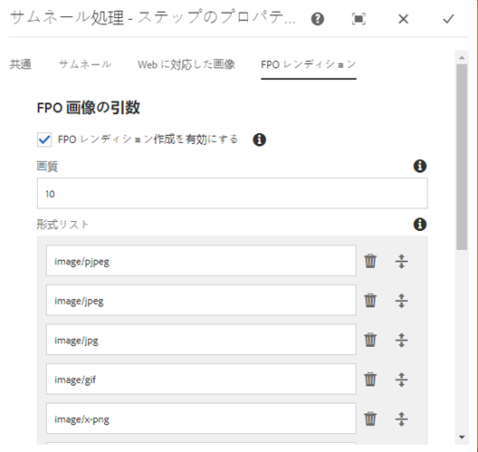
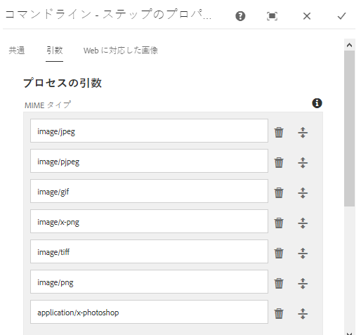
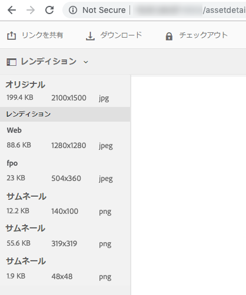

# Adobe InDesign用の配置専用レンディションを生成 {#fpo-renditions}

Experience Managerの大きなサイズのアセットをAdobe InDesignドキュメントに配置する場合、クリエイティブプロフェッショナルは、アセット[を配置してからかなりの時間待つ必要があります。](https://helpx.adobe.com/jp/indesign/using/placing-graphics.html) 一方、ユーザーは InDesign の使用をブロックされます。これにより、クリエイティブの流れが中断され、ユーザーエクスペリエンスに悪影響が出ます。Adobeでは、最初にInDesignドキュメントに小さいサイズのレンディションを一時的に配置できます。 印刷や公開ワークフローなど、最終的な出力が必要な場合は、元のフル解像度のアセットがバックグラウンドの一時レンディションを置き換えます。 このバックグラウンドでの非同期更新により、デザインプロセスが高速化され、生産性が向上し、クリエイティブプロセスが妨げられることはありません。

Adobe Experience Manager(AEM)には、配置専用(FPO)のレンディションが用意されています。 これらの FPO レンディションは、ファイルサイズは小さいですが、縦横比は同じです。FPOレンディションがアセットに使用できない場合、Adobe InDesignは元のアセットを代わりに使用します。 このフォールバックメカニズムにより、クリエイティブワークフローは中断することなく続行されます。

## FPOレンディションの生成のアプローチ {#approach-to-generate-fpo-renditions}

Experience Managerを使用すると、FPOレンディションの生成に使用できる画像を処理する多くの方法が可能です。 最も一般的な方法は、組み込みのExperience ManagerワークフローとImageMagickの使用です。 これら2つの方法を使用して、新たにアップロードされたアセットと、アセット内に存在するアセットのレンディションの生成をExperience Managerします。

ImageMagickを使用して、画像を処理し、FPOレンディションの生成に使用できます。 このようなレンディションはダウンサンプリングされます。つまり、元の画像のPPIが72を超える場合、レンディションのピクセルサイズは比例的に縮小されます。 [ImageMagickのインストールと設定でExperience Managerアセットを操作する](best-practices-for-imagemagick.md)を参照してください。

|  |Experience Managerの組み込みワークフローの使用 | ImageMagickワークフローの使用 |備考 |
|— |— |—|— |
|新しいアセットの場合 | FPOレンディションを有効にする([help](#generate-renditions-of-new-assets-using-aem-workflow)) |Experience Managerワークフロー（[ヘルプ](#generate-renditions-of-new-assets-using-imagemagick)）にImageMagickコマンドラインを追加 |Experience Managerは、アップロードのたびにDAMアセットの更新ワークフローを実行します。 |
|既存のアセットの場合 |新しい専用のExperience Managerワークフロー（[ヘルプ](#generate-renditions-of-existing-assets-using-aem-workflow)）でFPOレンディションを有効にする |新しい専用のExperience Managerワークフロー（[ヘルプ](#generate-renditions-of-existing-assets-using-imagemagick)）にImageMagickコマンドラインを追加 |既存のアセットのFPOレンディションは、オンデマンドまたは一括で作成できます。 |

>[!CAUTION]
>
>デフォルトのワークフローのコピーを変更して、レンディションを生成するワークフローを作成します。 新しいサービスパックをインストールするなどして、Experience Managerが更新された場合に変更が上書きされるのを防ぎます。

## アセットワークフローを使用した新しいアセットのレンディションのExperience Manager {#generate-renditions-of-new-assets-using-aem-workflow}

レンディションの生成を有効にするためのDAMアセットの更新ワークフローモデルの設定手順を次に示します。

1. **[!UICONTROL ツール]** / **[!UICONTROL ワークフロー]** / **[!UICONTROL モデル]**&#x200B;をクリックします。 「**[!UICONTROL DAMアセットの更新]**」モデルを選択し、「**[!UICONTROL 編集]**」をクリックします。

1. 「**[!UICONTROL サムネールを処理]**」ステップを選択し、「**[!UICONTROL 設定]**」をクリックします。

1. 「**[!UICONTROL FPOレンディション]**」タブをクリックします。 「**[!UICONTROL FPOレンディションの作成を有効にする]**」を選択します。

   

1. **[!UICONTROL 品質]**&#x200B;を調整し、必要に応じて&#x200B;**[!UICONTROL 書式リスト]**&#x200B;の値を追加または変更します。 デフォルトでは、FPOレンディションを生成するMIMEタイプのリストは、pjpeg、jpeg、jpg、gif、png、x-pngおよびtiffです。 「**[!UICONTROL 完了]**」をクリックします。

   >[!NOTE]
   >
   >レンディションの生成は、JPEG、GIF、PNG、TIFF、PSD、BMPの各ファイルタイプでサポートされています。

1. 変更を有効にするには、「**[!UICONTROL 同期]**」をクリックします。

>[!NOTE]
>
>片面が1280ピクセルを超える画像は、FPOレンディションのピクセルサイズを保持しません。

## ImageMagickを使用した新しいアセットのレンディションの生成 {#generate-renditions-of-new-assets-using-imagemagick}

Experience Managerでは、新しいアセットがアップロードされると、DAMアセットの更新ワークフローが実行されます。 ImageMagickを使用して新しくアップロードされたアセットのレンディションを処理するには、ワークフローモデルに新しいコマンドを追加します。

1. **[!UICONTROL ツール]** / **[!UICONTROL ワークフロー]** / **[!UICONTROL モデル]**&#x200B;をクリックします。 「**[!UICONTROL DAMアセットの更新]**」モデルを選択し、「**[!UICONTROL 編集]**」をクリックします。

1. 左上隅の&#x200B;**[!UICONTROL サイドパネルを切り替え]**&#x200B;をクリックします。 コマンドラインステップを検索します。

1. **[!UICONTROL コマンドライン]**&#x200B;ステップをドラッグし、**[!UICONTROL サムネールを処理]**&#x200B;ステップの前に追加します。

1. **[!UICONTROL コマンドライン]**&#x200B;のステップを選択し、**[!UICONTROL 設定]**&#x200B;をクリックします。

1. 必要な情報をカスタムの&#x200B;**[!UICONTROL タイトル]**&#x200B;と&#x200B;**[!UICONTROL 説明]**&#x200B;として追加します。 例えば、FPOレンディション（ImageMagickを利用）。

1. 「**[!UICONTROL 引数]**」タブで、関連する&#x200B;**[!UICONTROL MIMEタイプ]**&#x200B;を追加し、コマンドが適用されるファイル形式のリストを指定します。

   

1. 「**[!UICONTROL 引数]**」タブの「**[!UICONTROL コマンド]**」セクションに、関連するImageMagickコマンドを追加してFPOレンディションを生成します。

   次の例は、JPEG形式のFPOレンディションを生成し、72 PPI（10%画質設定）でダウンサンプルし、出力をフラット化して複数レイヤーのAdobe Photoshopファイルを処理するコマンドの例です。

   `convert -quality 10% -units PixelsPerInch ${filename} -resample 72 -flatten cq5dam.fpo.jpeg`

1. 変更を有効にするには、「**[!UICONTROL 同期]**」をクリックします。

ImageMagickのコマンドライン機能について詳しくは、[https://imagemagick.org](https://imagemagick.org)を参照してください。

## アセットワークフローを使用した既存のアセットのレンディションのExperience Manager {#generate-renditions-of-existing-assets-using-aem-workflow}

Experience Managerワークフローを使用して既存のアセットのFPOレンディションを生成するには、組み込みのFPOレンディションオプションを使用する専用のワークフローモデルを作成します。

1. **[!UICONTROL ツール]** / **[!UICONTROL ワークフロー]** / **[!UICONTROL モデル]**&#x200B;をクリックします。 モデルを作成するには、**[!UICONTROL 作成]** > **[!UICONTROL モデルを作成]**&#x200B;をクリックします。 意味のある&#x200B;**[!UICONTROL タイトル]**&#x200B;と&#x200B;**[!UICONTROL 名前]**&#x200B;を追加します。

1. モデルを選択し、**[!UICONTROL 編集]**&#x200B;をクリックします。 **[!UICONTROL ページ情報]** / **[!UICONTROL プロパティを開く]**&#x200B;をクリックします。 「**[!UICONTROL 一時的なワークフロー]**」を選択します。 これにより、拡張性とパフォーマンスが向上します。 「******[!UICONTROL 保存して閉じる]**」をクリックします。

1. 左上隅の&#x200B;**[!UICONTROL サイドパネルを切り替え]**&#x200B;をクリックします。 プロセスサムネールステップを検索します。 **[!UICONTROL サムネールを処理]**&#x200B;のステップをドラッグします。

1. 「**[!UICONTROL サムネールを処理]**」を選択し、「**[!UICONTROL 設定]**」をクリックします。 [設定に従い、Experience Managerワークフロー](#generate-renditions-of-new-assets-using-aem-workflow)を使用して新しいアセットのレンディションを生成します。 変更を有効にするには、「**[!UICONTROL 同期]**」をクリックします。

## ImageMagickを使用した既存のアセットのレンディションの生成 {#generate-renditions-of-existing-assets-using-imagemagick}

ImageMagickの処理機能を使用して既存のアセットのFPOレンディションを生成するには、ImageMagickのコマンドラインを使用する専用のワークフローモデルを作成します。

1. [設定の手順1～3に従って、Experience Managerワークフロー](#generate-renditions-of-existing-assets-using-aem-workflow)セクションを使用して既存のアセットのレンディションを生成します。

1. [設定の手順4～8に従って、ImageMagick](#generate-renditions-of-new-assets-using-imagemagick)セクションを使用して新しいアセットのレンディションを生成します。

## FPOレンディションの表示 {#view-fpo-renditions}

ワークフローの完了後に、生成されたFPOレンディションを確認できます。 Experience ManagerAssetsユーザーインターフェイスで、アセットをクリックして大きなプレビューを開きます。 左側のパネルを開き、「レンディション」を選択します。 または、プレビューを開いたときにキーボードショートカット`Alt + 3`を使用します。

**[!UICONTROL FPOレンディション]**&#x200B;をクリックして、プレビューを読み込みます。 オプションで、レンディションを右クリックして、ファイルシステムに保存できます。

## ヒントと制限事項 {#tips-limitations}

* ImageMagickベースの設定を使用するには、ImageMagickをExperience Managerと同じマシンにインストールします。
* 多数のアセットまたはリポジトリ全体のFPOレンディションを生成するには、低トラフィック時にワークフローを計画し、実行します。 大量のアセットに対してFPOレンディションを生成することは、リソースを集中的に消費する作業です。Experience Managerサーバーは、十分な処理能力とメモリを使用できる必要があります。
* パフォーマンスとスケーラビリティについては、[ImageMagick](performance-tuning-guidelines.md)を微調整するを参照してください。
* アセットの一般的なコマンドライン処理については、[アセットを処理するコマンドラインハンドラー](media-handlers.md)を参照してください。