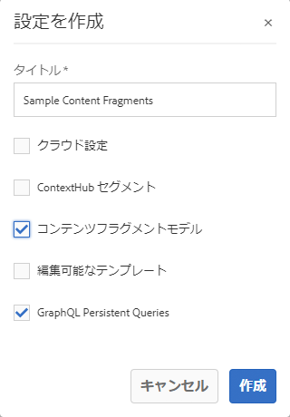
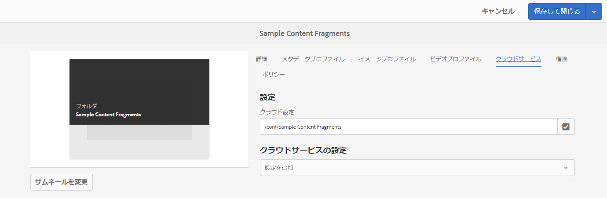

# コンテンツフラグメント - 設定ブラウザー{#content-fragments-configuration-browser}

Adobe Experience Manager（AEM）の強力なヘッドレス配信機能を使用するために、設定ブラウザーで特定のコンテンツフラグメント機能を有効にする方法を説明します。

## インスタンスに対するコンテンツフラグメント機能を有効にする {#enable-content-fragment-functionality-instance}

コンテンツフラグメントを使用する前に、**設定ブラウザー**&#x200B;を使用して以下を有効にする必要があります。

* **コンテンツフラグメントモデル** - 必須
* **GraphQL の永続的なクエリ** - オプション

>[!CAUTION]
>
>**コンテンツフラグメントモデル**&#x200B;を有効にしない場合：
>
>* 「**作成**」オプションは、モデルの作成には使用できません。
>* [Sites 設定を選択して関連するエンドポイントを作成](/help/sites-developing/headless/graphql-api/graphql-endpoint.md#enabling-graphql-endpoint)することはできません。

コンテンツフラグメント機能を有効にするには、次の操作を行う必要があります。

* 設定ブラウザーを使用して、コンテンツフラグメント機能の使用を有効にする
* 設定をアセットフォルダーに適用

### 設定ブラウザーでコンテンツフラグメント機能を有効にする {#enable-content-fragment-functionality-in-configuration-browser}

[特定のコンテンツフラグメント機能を使用](#creating-a-content-fragment-model)するには、まず&#x200B;**設定ブラウザー**&#x200B;を使用して有効にする&#x200B;**必要があります**。

>[!NOTE]
>
>詳しくは、[設定ブラウザー](/help/sites-administering/configurations.md#using-configuration-browser)を参照してください。

1. **ツール**／**一般**&#x200B;に移動し、**設定ブラウザー**&#x200B;を開きます。

1. 「**作成**」を使用してダイアログを開き、次の操作を行います。

   1. 「**タイトル**」を指定します。
   1. 使用できるようにするには、以下を選択します。
      * **コンテンツフラグメントモデル**
      * **GraphQL の永続的なクエリ**

      

1. 「**作成**」を選択して、定義を保存します。

<!-- 1. Select the location appropriate to your website. -->

### アセットフォルダーへの設定の適用 {#apply-the-configuration-to-your-assets-folder}

**グローバル**&#x200B;設定がコンテンツフラグメント機能に対して有効になっている場合、この設定はすべてのアセットフォルダーに適用されます。

他の設定（グローバル以外）を同等のアセットフォルダーで使用するには、接続を定義する必要があります。そのためには、適切なフォルダーの「**フォルダーのプロパティ**」の「**クラウドサービス**」タブで、適切な&#x200B;**設定**&#x200B;を選択します。

