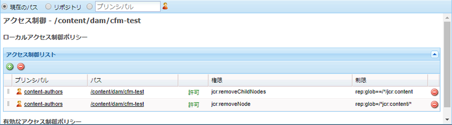

# コンテンツフラグメント - 削除に関する考慮事項{#content-fragments-delete-considerations}

## 権限 - 削除または削除禁止 {#permissions-delete-or-not-delete}

コンテンツを削除する機能は強力ですが、この特権の割り当て方法を制限および管理する必要がある多くの業界では、慎重な取り扱いが求められる可能性があります。

削除権限に関しては、コンテンツフラグメントを次の 2 つのレベルで考える必要があります。

1. **単一のエンティティとしてのコンテンツフラグメント**。

   * **使用例**：コンテンツフラグメントの編集または更新を必要とするユーザーが&#x200B;**フラグメント全体を削除できる**&#x200B;場合。
   * **権限**：[削除](/help/sites-administering/security.md#actions)権限は[ユーザー管理やグループ管理で割り当てる](/help/sites-administering/security.md#managing-permissions)ことができます。

1. **コンテンツフラグメントを構成する複数のサブエンティティ（例：バリエーション、サブノードなど）。**

   コンテンツフラグメントエディターの基本操作を使用するには、そうした一時的なサブ要素を削除できる必要があります。例えば、バリエーションの操作、メタデータの編集、関連コンテンツの管理などをおこなう場合です。

   * **使用例**：コンテンツフラグメントの編集または更新を必要とするユーザーが&#x200B;**フラグメント全体を削除できない**&#x200B;場合。
   * **権限**：[エディター機能のみに必要な権限](/help/assets/content-fragments/content-fragments-delete.md#permissions-required-for-editor-functionality-only)を参照してください。

>[!NOTE]
>
>ユーザーに[削除](/help/sites-administering/security.md#actions)権限がない場合、コンテンツフラグメントエディターは&#x200B;*読み取り専用*&#x200B;モードで動作します。

>[!NOTE]
>
>[AEM でのユーザー管理操作を監査する方法](/help/sites-administering/audit-user-management-operations.md)も参照してください。

## エディター機能のみに必要な権限 {#permissions-required-for-editor-functionality-only}

コンテンツフラグメントを編集または更新する必要があっても&#x200B;**フラグメント全体を削除できない**&#x200B;ユーザーの場合は、特定の権限を割り当てる必要があります。コンテンツフラグメントエディターの基本操作を使用するには、一時的なサブ要素を削除できる必要があるからです。

例えば、バリエーションの操作、メタデータの編集、関連コンテンツの管理などをおこなう場合です。

>[!NOTE]
>
>コンテンツフラグメントの編集または更新に必要な削除権限は、[ユーザー管理やグループ管理で割り当てられた](/help/sites-administering/security.md#managing-permissions)削除権限に含まれています。

フラグメントの編集または更新に必要な権限は、コンテンツフラグメントを含んでいるノードまたは適切な親ノード（`/content/dam` 下の任意のレベル）のどちらかに適用する必要があります。このような親ノードに割り当てられた権限は、そのブランチ内のすべてのノードに適用されます。

例えば、すべてのコンテンツフラグメントが格納される次のようなフォルダーです。

* `/content/dam/contentfragments`

>[!CAUTION]
>
>`/content/dam` に権限を設定することもできます。すべてのコンテンツフラグメントがそこに格納されているからです。
>
>ただし、その場合は、他の&#x200B;*すべての*&#x200B;アセットタイプにも同じ削除権限が適用されます。

特定のユーザーまたはグループにコンテンツフラグメントの編集または更新を許可するうえであらかじめ必要な権限は次のとおりです。

>[!NOTE]
>
>このリストには、削除特権だけでなく、必要なすべての特権が含まれています。

* コンテンツフラグメントノードまたはフォルダーの場合：

   * `jcr:addChildNodes`、`jcr:modifyProperties`

* すべてのコンテンツフラグメントの `jcr:content` ノードの場合：

   * `jcr:addChildNodes`、`jcr:modifyProperties`、`jcr:removeChildNodes`

* すべてのコンテンツフラグメントの `jcr:content` 下にあるすべてのノードの場合：

   * `jcr:addChildNodes`、`jcr:modifyProperties`、`jcr:removeChildNodes`、`jcr:removeNode`

これらの `remove` 権限は、[CRXDE Lite 内でアクセス制御リストを使用して管理](/help/sites-administering/user-group-ac-admin.md#access-right-management)する必要があります。

`add` および `modify` 権限も、CRXDE Lite で管理することができます。また、ユーザー管理コンソールを使用して管理することもできます。

例えば、`remove` グループの `content-authors-no-delete` 権限の定義は次のようになります。

