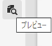
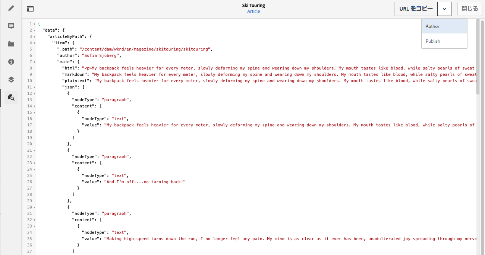

# プレビュー - JSON 表現 {#preview-json-representation}

AEM ヘッドレス実装の一環としてコンテンツフラグメントのモデルを開発する際に、コンテンツフラグメントのサンプル JSON 出力を、モデルに基づいて表示するとよい場合があります。例えば、最終的な出力がどのように見えるかを知るためにです。これは、モデルの JSON 構造を検証する場合に便利です。データタイプごとのデフォルトのサンプルコンテンツを使用する場合もあります。

**プレビュー**&#x200B;アイコンを使用すると

現在のフラグメントの JSON 表現を表示できます。次に例を示します。

**「URLをコ** ピー」を使用すると、オーサーまたはパブリッシュ用にURLをクリップボードにコピーできます。