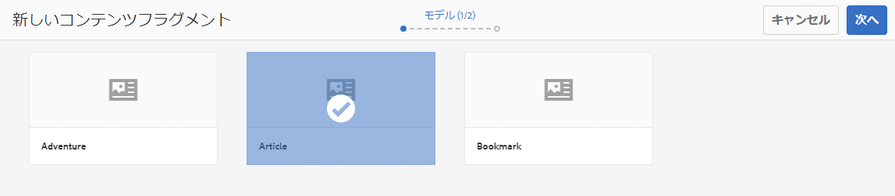
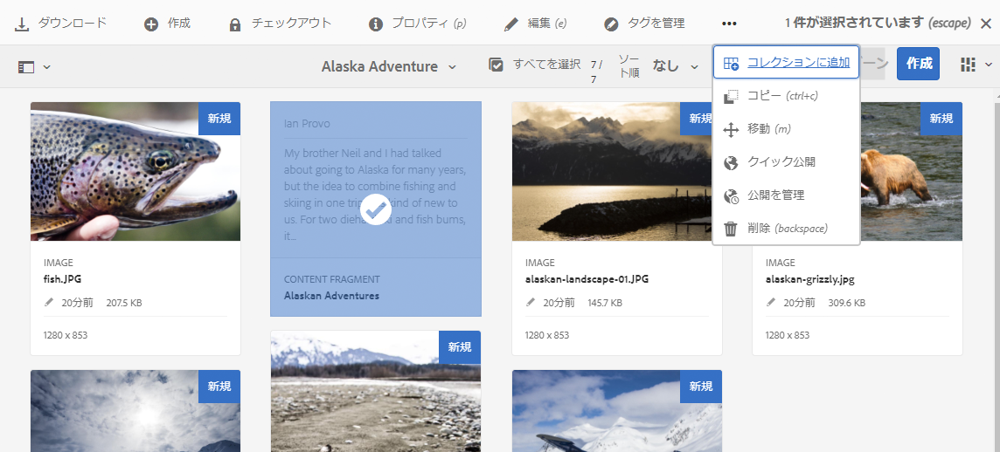
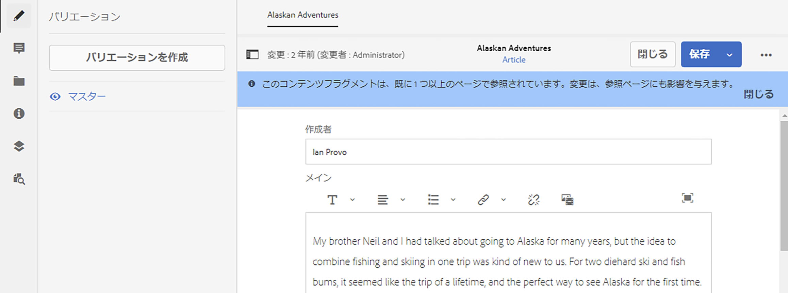
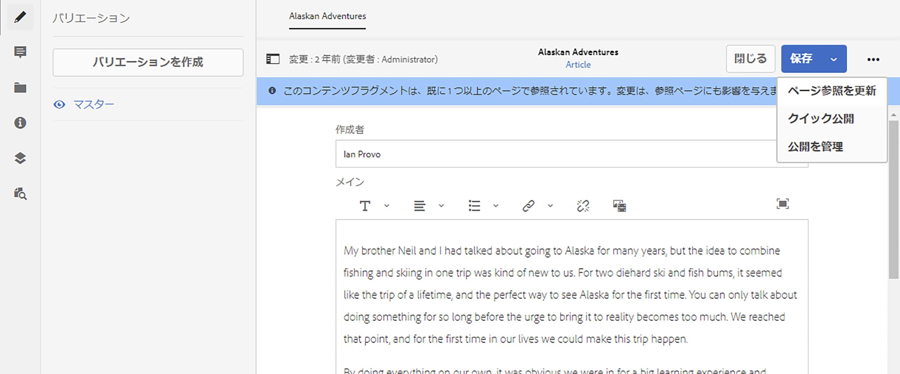
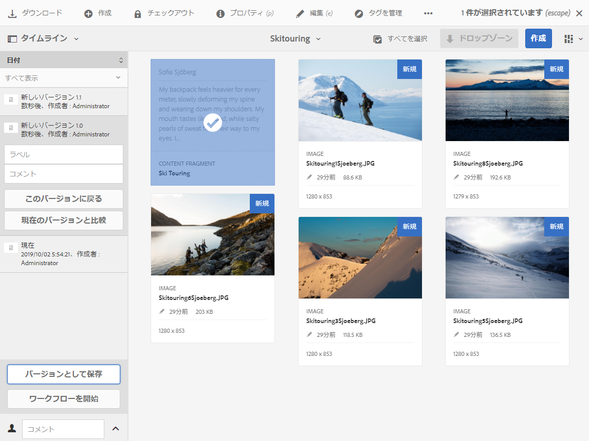
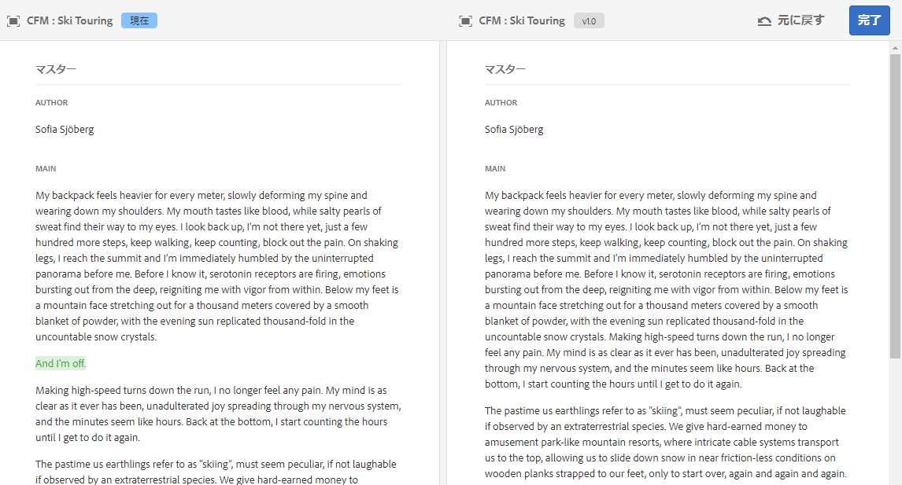

# コンテンツフラグメントの管理 {#managing-content-fragments}

ヘッドレスコンテンツの基礎となる AEM コンテンツフラグメントを Assets コンソールを使用して管理する方法について説明します。

[コンテンツフラグメントモデル](#creating-a-content-model)を定義した後、それらを使用して[コンテンツフラグメントを作成](#creating-a-content-fragment)できます。

[コンテンツフラグメントエディター](#opening-the-fragment-editor)には、次の操作を行うための様々な[モード](#modes-in-the-content-fragment-editor)が用意されています。

* [コンテンツの編集](#editing-the-content-of-your-fragment)と[バリエーションの管理](#creating-and-managing-variations-within-your-fragment)
* [フラグメントへの注釈の付加](/help/assets/content-fragments/content-fragments-variations.md#annotating-a-content-fragment)
* [コンテンツとフラグメントの関連付け](#associating-content-with-your-fragment)
* [メタデータの設定](#viewing-and-editing-the-metadata-properties-of-your-fragment)
* [構造ツリーの表示](/help/assets/content-fragments/content-fragments-structure-tree.md)
* [JSON 表現のプレビュー](/help/assets/content-fragments/content-fragments-json-preview.md)

>[!NOTE]
>
>コンテンツフラグメントは次に使用できます。
>
>* ページのオーサリング時 -「[コンテンツフラグメントを使用したページオーサリング](/help/sites-authoring/content-fragments.md)」を参照してください。
>* [GraphQL でコンテンツフラグメントを使用するヘッドレスコンテンツ配信用。](/help/assets/content-fragments/content-fragments-graphql.md)

>[!NOTE]
>
>コンテンツフラグメントは **Assets** として保存されるので、主に **Assets** コンソールから管理します。

## コンテンツフラグメントの作成 {#creating-content-fragments}

### コンテンツモデルの作成 {#creating-a-content-model}

構造化コンテンツを含むコンテンツフラグメントを作成する前に、[コンテンツフラグメントモデル](/help/assets/content-fragments/content-fragments-models.md)を有効にして作成できます。

### コンテンツフラグメントの作成 {#creating-a-content-fragment}

コンテンツフラグメントの作成方法は次のとおりです。

1. フラグメントを作成する **Assets** フォルダーに移動します。
1. 「**作成**」を選択し、「**コンテンツフラグメント**」を選択して、ウィザードを開きます。
1. ウィザードの最初の手順では、新しいフラグメントの基盤を指定することを求められます。

   * [モデル](/help/assets/content-fragments/content-fragments-models.md) - **アドベンチャー**&#x200B;モデルなど、構造化コンテンツを必要とするフラグメントの作成に使用されます

      * 使用可能なすべてのモデルが表示されます。

   選択した後、「**次へ**」を使用して続けます。

   

1. 「**プロパティ**」の手順で次を指定します。

   * **基本**

      * **タイトル**

         フラグメントタイトル。

         必須です。

      * **説明**

      * **タグ**
   * **詳細**

      * **名前**

         URL の作成に使用される名前です。

         必須。タイトルから自動的に派生しますが、変更が可能です。

1. 「**作成**」を選択して操作を完了してから、編集するためにフラグメントを&#x200B;**開く**&#x200B;か、「**完了**」でコンソールに戻ります。

   >[!NOTE]
   >コンソールの&#x200B;**リスト**&#x200B;モードでは、**表示設定**&#x200B;を更新して「**コンテンツフラグメントモデル**」列を有効にできます。

## Assets コンソールでコンテンツフラグメントに対して使用できるアクション {#actions-for-a-content-fragment-assets-console}

**Assets** コンソールでは、次のいずれかからコンテンツフラグメントに対して様々なアクションを使用できます。

* ツールバーから。フラグメントを選択すると、該当するすべてのアクションを使用できるようになります。
* [クイックアクション](/help/sites-authoring/basic-handling.md#quick-actions)として。個別のフラグメントカードに使用可能なアクションのサブセット。

フラグメントを選択して、次の適用可能なアクションを含むツールバーを表示します。

* **ダウンロード**

   * フラグメントを ZIP ファイルとして保存します。要素、バリエーション、メタデータを含めるかどうかを定義できます。

* **作成**
* **チェックアウト**
* **プロパティ**

   * フラグメントのメタデータを表示したり、編集したりできます。

* **編集**

   * フラグメントの要素、バリエーション、および関連付けられているコンテンツやメタデータと共に[コンテンツを編集するためにフラグメントを開く](/help/assets/content-fragments/content-fragments-variations.md)ことができます。

* **タグを管理**
* **コレクションに追加**
* **コピー**（&amp; **ぺースト**）
* **移動**
* **クイック公開**
* **公開を管理**
* **削除**

>[!NOTE]
>
>これらの多くは、[Assets](/help/assets/manage-assets.md) や [AEM デスクトップアプリケーション](https://helpx.adobe.com/jp/experience-manager/desktop-app/aem-desktop-app.html)に対する標準的なアクションです。

## フラグメントエディターを開く {#opening-the-fragment-editor}

編集するためにフラグメントを開くには：

>[!CAUTION]
>
>コンテンツフラグメントを編集するには、[適切な権限](/help/sites-developing/customizing-content-fragments.md#asset-permissions)が必要になります。問題が発生している場合は、システム管理者にお問い合わせください。

>[!CAUTION]
>
>コンテンツフラグメントを編集するには、適切な権限が必要になります。問題が発生している場合は、システム管理者にお問い合わせください。

1. **Assets** コンソールを使用して、コンテンツフラグメントの場所に移動します。
1. フラグメントを開いて編集するには、以下のいずれかを実行します。

   * フラグメントまたはフラグメントリンクをクリック／タップ（これはコンソールビューによって異なります）。
   * フラグメントを選択してから、ツールバーの「**編集**」を選択。

1. フラグメントエディターが開きます。必要に応じて変更を加えます。

   

1. 変更を加えた後、**「保存して閉じる」**&#x200B;を使用します。

<!-- 
1. After making changes, use **Save**, **Save & close** or **Close** as required.

   >[!NOTE]
   >
   >**Save & close** is available via the **Save** dropdown.

   >[!NOTE]
   >
   >Both **Save & Close** and **Close** will exit the editor - see [Save, Close and Versions](#save-close-and-versions) for full information on how the various options operate for content fragments.
-->

## コンテンツフラグメントエディターのモードとアクション {#modes-actions-content-fragment-editor}

コンテンツフラグメントエディターからは、様々なモードとアクションを使用できます。

### コンテンツフラグメントエディターのモード {#modes-in-the-content-fragment-editor}

サイドパネルのアイコンを使用して、様々なモード間を移動できます。

* バリエーション：[コンテンツの編集](#editing-the-content-of-your-fragment)と[バリエーションの管理](#creating-and-managing-variations-within-your-fragment)

* [注釈](/help/assets/content-fragments/content-fragments-variations.md#annotating-a-content-fragment)
* [関連コンテンツ](#associating-content-with-your-fragment)
* [メタデータ](#viewing-and-editing-the-metadata-properties-of-your-fragment)
* [構造ツリー](/help/assets/content-fragments/content-fragments-structure-tree.md)
* [プレビュー](/help/assets/content-fragments/content-fragments-json-preview.md)

### コンテンツフラグメントエディターのツールバーアクション {#toolbar-actions-in-the-content-fragment-editor}

上部のツールバーには、複数のモードから使用できる機能があります。

<!-- screenshot changed from original text see commented out below -->

* フラグメントがコンテンツページで既に参照されている場合は、メッセージが表示されます。このメッセージは&#x200B;**閉じる**&#x200B;ことができます。

* **サイドパネルを切り替え**&#x200B;アイコンを使用してサイドパネルを非表示／表示できます。

* フラグメント名の下に、現在のフラグメントの作成に使用された[コンテンツフラグメントモデル](/help/assets/content-fragments/content-fragments-models.md)の名前が表示されます。

   * また、この名前はモデルエディターを開くリンクでもあります。

* 例えば、フラグメントの作成、変更、公開の日時については、フラグメントのステータスを参照してください。

* **保存して閉じる**

<!--
Some features in the top toolbar are available from multiple modes:

* A message will be shown when the fragment is already referenced on a content page. You can **Close** the message.

* The side panel can be hidden/shown using the **Toggle Side Panel** icon.

* Underneath the fragment name you can see the name of the [Content Fragment Model](/help/assets/content-fragments/content-fragments-models.md) used for creating the current fragment:

  * The name is also a link that will open the model editor.

* See the status of the fragment; for example, information about when it was created, modified or published. The status is also color-coded:

  * **New**: grey
  * **Draft**: blue
  * **Published**: green
  * **Modified**: orange
  * **Deactivated**: red

* **Save** provides access to the **Save & close** option.
  
* The three dots (**...**) drop-down provides access to additional actions:
  * **Update page references**
    * This updates any page references. 
  * **[Quick publish](#publishing-and-referencing-a-fragment)**
  * **[Manage Publication](#publishing-and-referencing-a-fragment)**
-->

<!--
This updates any page references and ensures that the Dispatcher is flushed as required. -->

<!--
## Save, Close and Versions {#save-close-and-versions}

>[!NOTE]
>
>Versions can also be [created, compared and reverted from the Timeline](/help/assets/content-fragments/content-fragments-managing.md#timeline-for-content-fragments).

The editor has various options:

* **Save** and **Save & close**

  * **Save** will save the latest changes and remain in the editor.
  * **Save & close** will save the latest changes and exit the editor.

  >[!CAUTION]
  >
  >To edit a content fragment you need [the appropriate permissions](/help/sites-developing/customizing-content-fragments.md#asset-permissions). Please contact your system administrator if you are experiencing issues. 

  >[!NOTE]
  >
  >It is possible to remain in the editor, making a series of changes, before saving.

  >[!CAUTION]
  >
  >In addition to simply saving your changes, the actions also update any references and ensures that the Dispatcher is flushed as required. These changes can take time to process. Due to this, there can be a performance impact on a large/complex/heavily-loaded system.
  >
  >Please bear this in mind when using **Save & close** and then quickly re-entering the fragment editor to make and save further changes.

* **Close**

  Will exit the editor without saving the latest changes (i.e made since the last **Save**).

While editing your content fragment AEM automatically creates versions to ensure that prior content can be restored if you cancel your changes (using **Close** without saving):

1. When a content fragment is opened for editing AEM checks for the existence of the cookie-based token that indicates whether an *editing session* exists:

   1. If the token is found, the fragment is considered to be part of the existing editing session.
   2. If the token is *not* available and the user starts editing content, a version is created and a token for this new editing session is sent to the client, where it is saved in a cookie.

2. While there is an *active* editing session, the content being edited is automatically saved every 600 seconds (default).

   >[!NOTE]
   >
   >The auto save interval is configurable using the `/conf` mechanism.
   >
   >Default value, see:
   >&nbsp;&nbsp;`/libs/settings/dam/cfm/jcr:content/autoSaveInterval`

3. If the user cancels the edit, the version created at the start of the editing session is restored and the token is removed to end the editing session.
4. If the user selects to **Save** the edits, the updated elements/variations are persisted and the token is removed to end the editing session.
-->

## フラグメントのコンテンツの編集 {#editing-the-content-of-your-fragment}

フラグメントを開いたら、「[バリエーション](/help/assets/content-fragments/content-fragments-variations.md)」タブを使用してコンテンツをオーサリングできます。

## フラグメント内のバリエーションの作成と管理 {#creating-and-managing-variations-within-your-fragment}

プライマリコンテンツを作成したら、そのコンテンツの[バリエーション](/help/assets/content-fragments/content-fragments-variations.md)を作成して管理できます。

## コンテンツをフラグメントと関連付ける {#associating-content-with-your-fragment}

フラグメントに[コンテンツを関連付ける](/help/assets/content-fragments/content-fragments-assoc-content.md)こともできます。これにより関連性を付加して、フラグメントをコンテンツページに追加するときに、アセット（画像など）を（オプションで）フラグメントと一緒に使用できるようになります。

## フラグメントのメタデータ（プロパティ）の表示と編集 {#viewing-and-editing-the-metadata-properties-of-your-fragment}

「[メタデータ](/help/assets/content-fragments/content-fragments-metadata.md)」タブを使用し、フラグメントのプロパティを表示して編集できます。

## コンテンツフラグメントのタイムライン {#timeline-for-content-fragments}

[タイムライン](/help/assets/manage-assets.md#timeline)では標準のオプションに加え、コンテンツフラグメントに固有の情報とアクションの両方が提供されます。

* バージョン、コメントおよび注釈に関する情報の表示
* バージョンに関するアクション

   * **[このバージョンに戻る](#reverting-to-a-version)**（既存のフラグメントを選択してから特定のバージョンを選択）

   * **[現在のバージョンと比較](#comparing-fragment-versions)**（既存のフラグメントを選択してから特定のバージョンを選択）

   * **ラベル**&#x200B;や&#x200B;**コメント**&#x200B;の追加（既存のフラグメントを選択してから特定のバージョンを選択）

   * **バージョンとして保存**（既存のフラグメントを選択してからタイムライン下部の上矢印を選択）

* 注釈に関するアクション

   * **削除**

>[!NOTE]
>
>コメントは次のとおりです。
>
>* すべてのアセットの標準機能
>* タイムラインで追加
>* フラグメントアセットに関連付けられる

>
>注釈（コンテンツフラグメント用）は次のとおりです。
>
>* フラグメントエディターで入力
>* フラグメント内の選択されたテキストセグメントに固有

>

次に例を示します。

## フラグメントのバージョンの比較 {#comparing-fragment-versions}

特定のバージョンを選択したら、「[タイムライン](/help/assets/content-fragments/content-fragments-managing.md#timeline-for-content-fragments)」から「**現在のバージョンと比較**」アクションを利用できるようになります。

これにより、次の情報が表示されます。

* **現在**（最新）のバージョン（左）

* 選択されたバージョン **v&lt;*x.y*>**（右）

これらは左右に並んで表示されます。この画面について以下で説明します。

* すべての相違点がハイライト表示されます

   * 削除されたテキスト - 赤
   * 挿入されたテキスト - 緑
   * 置き換えられたテキスト - 青

* 全画面表示アイコンを使用すれば、どちらかのバージョンで開いた後で、並列表示に切り替えることができます
* 特定のバージョンに&#x200B;**戻す**&#x200B;ことができます
* 「**完了**」を選択すると、コンソールに戻ります

>[!NOTE]
>
>フラグメントの比較中にフラグメントコンテンツを編集することはできません。

## 特定のバージョンへの復帰   {#reverting-to-a-version}

次の方法で特定のバージョンのフラグメントに戻すことができます。

* 直接[タイムライン](/help/assets/content-fragments/content-fragments-managing.md#timeline-for-content-fragments)から。

   必要なバージョンを選択した後、「**このバージョンに戻す**」アクションを選択します。

* [あるバージョンと現在のバージョンを比較](/help/assets/content-fragments/content-fragments-managing.md#comparing-fragment-versions)し、選択したバージョンに&#x200B;**戻す**&#x200B;ことができます。

## フラグメントの公開と参照 {#publishing-and-referencing-a-fragment}

>[!CAUTION]
>
>フラグメントがモデルに基づいている場合、その[モデルが公開されている](/help/assets/content-fragments/content-fragments-models.md#publishing-a-content-fragment-model)ことを確認してください。
>
>まだ公開されていないモデルのコンテンツフラグメントを公開すると、選択リストにそのことが示され、モデルがフラグメントと共に公開されます。

コンテンツフラグメントをパブリッシュ環境で使用するには、公開する必要があります。次の方法で公開できます。

* 作成後、[Assets コンソールで使用可能なアクション](#actions-for-a-content-fragment-assets-console)を使用して。
* [コンテンツフラグメントエディター](#toolbar-actions-in-the-content-fragment-editor)から。
* [フラグメントを使用するページを公開](/help/sites-authoring/content-fragments.md#publishing)するとき。フラグメントはページ参照にリスト表示されます。

>[!CAUTION]
>
>フラグメントが公開または参照（あるいは両方）された後に、作成者がフラグメントを開いて編集しようとすると警告が表示され、フラグメントを変更すると、参照されているページにも影響が及ぶことが警告されます。

## フラグメントの削除 {#deleting-a-fragment}

フラグメントを削除するには：

1. **Assets** コンソールで、コンテンツフラグメントの場所に移動します。
2. フラグメントを選択します。

   >[!NOTE]
   >
   >**削除**&#x200B;アクションはクイックアクションとして実行できません。

3. ツールバーから「**削除**」を選択します。
4. 「**削除**」アクションを確認します。

   >[!CAUTION]
   >
   >フラグメントが既にページで参照されている場合は、警告メッセージが表示されます。「**削除を強制**」を選択して続行を確認する必要があります。フラグメントはコンテンツフラグメントコンポーネントと一緒に、すべてのコンテンツページから削除されます。
