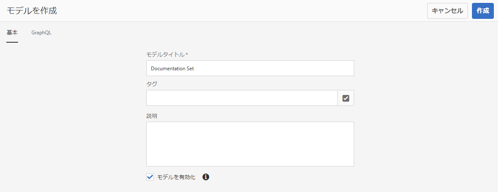
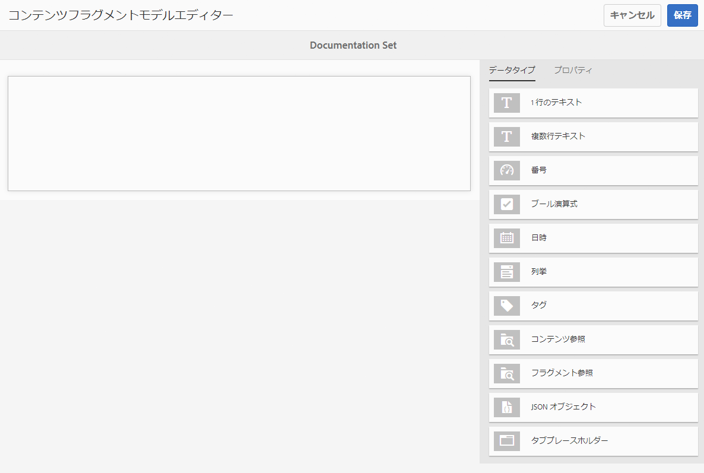
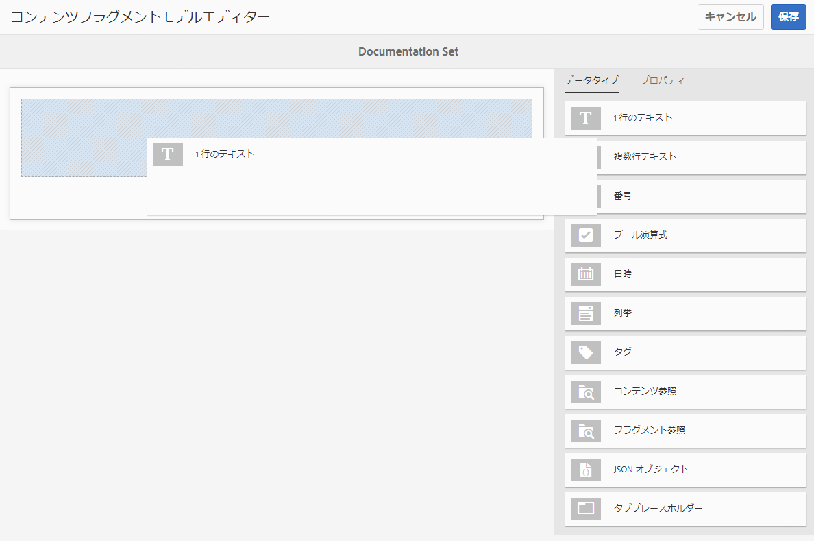
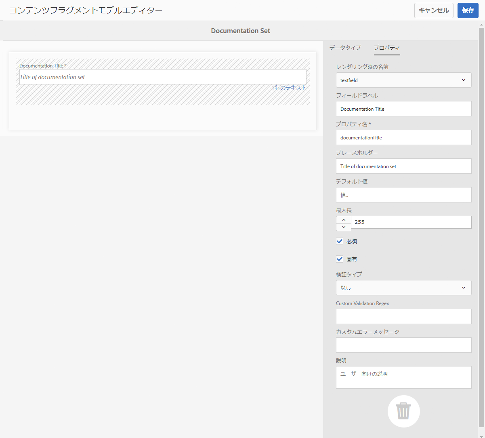
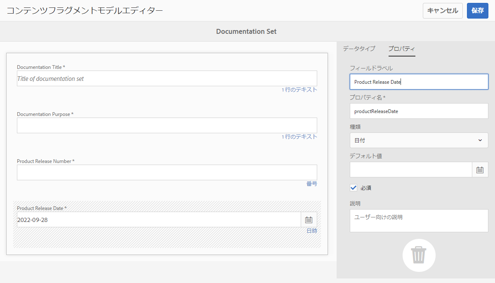
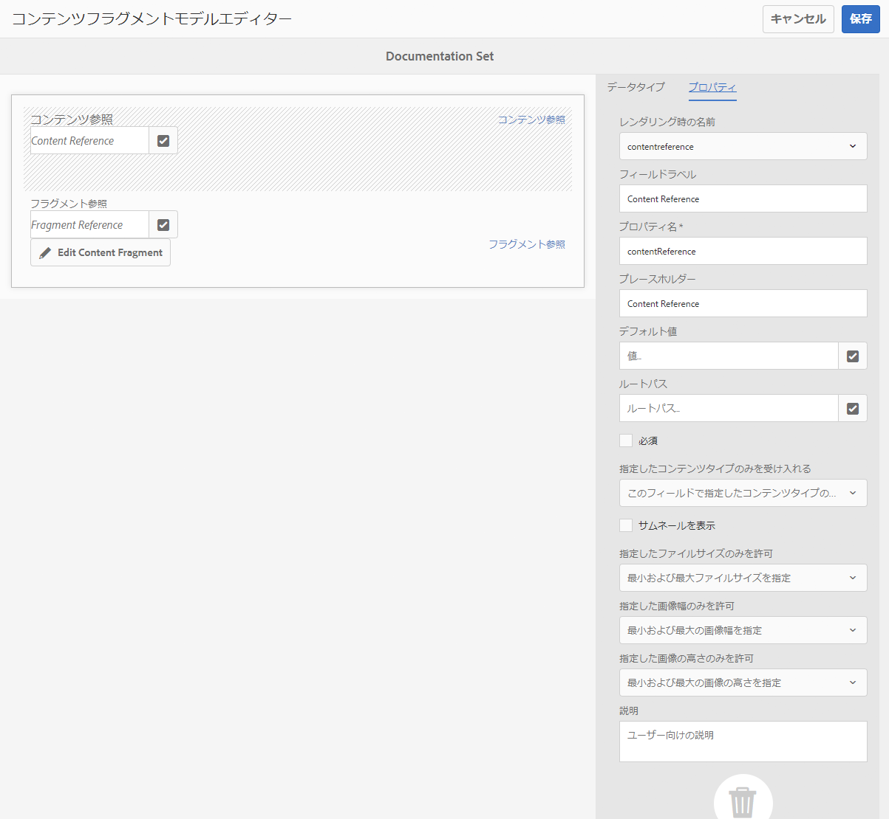
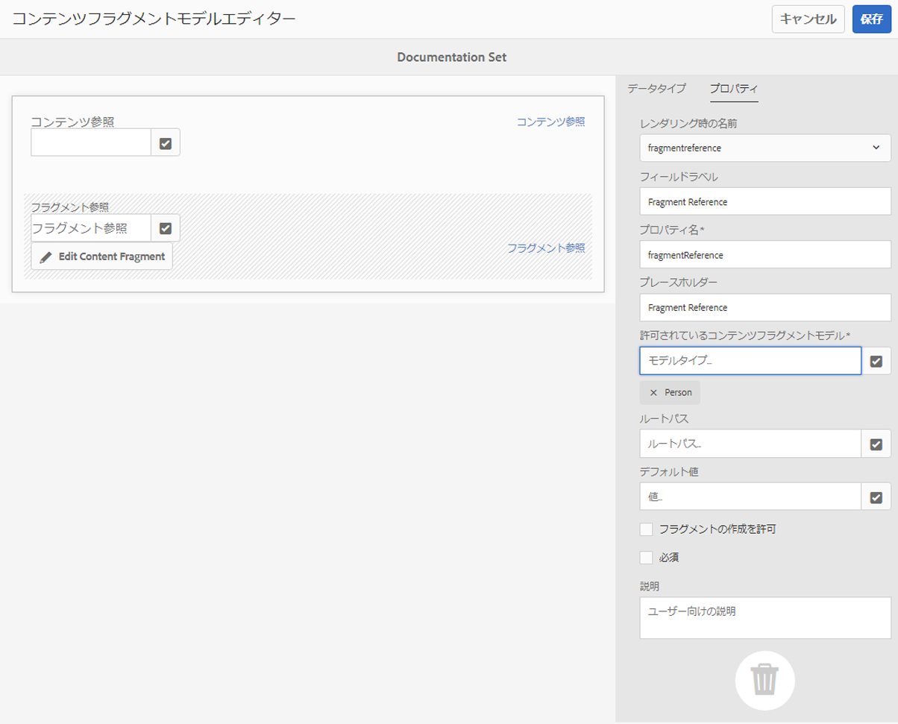
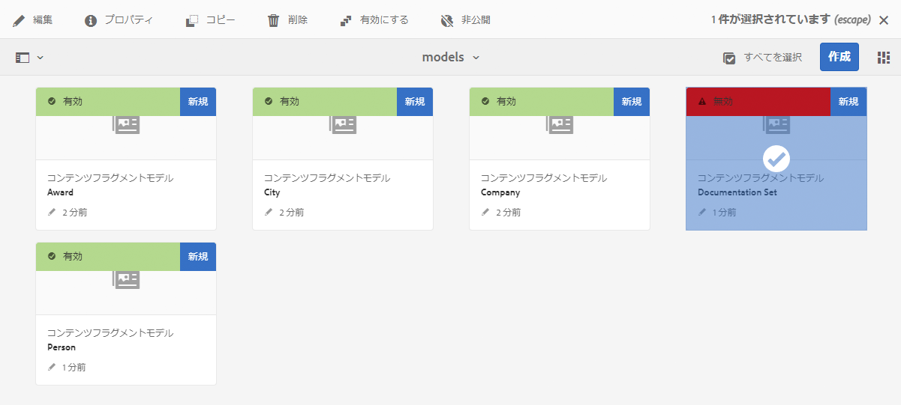
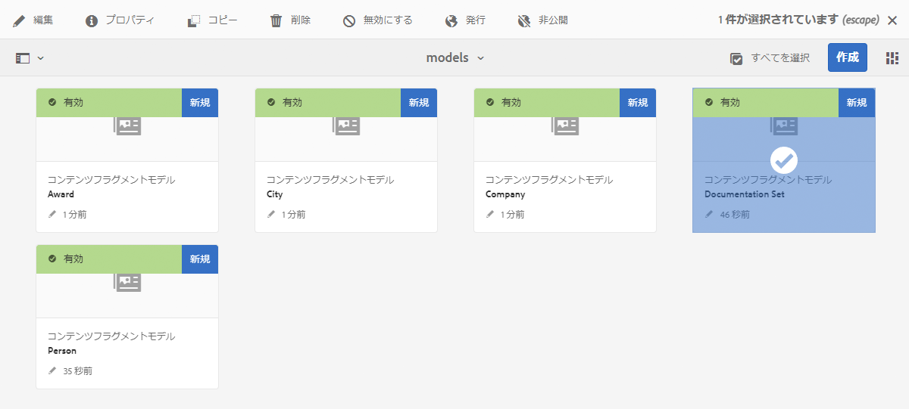
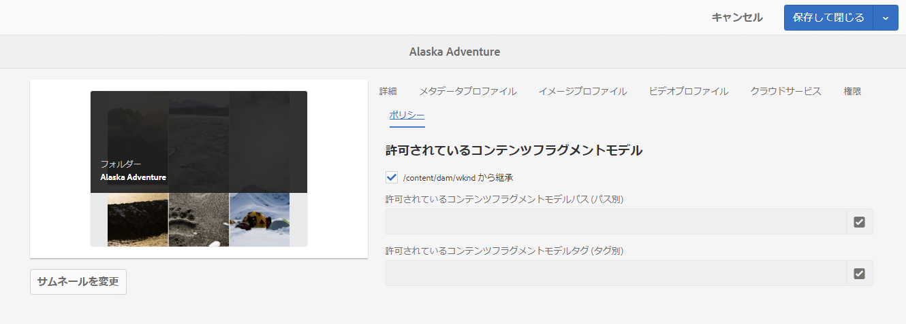

# コンテンツフラグメントモデル {#content-fragment-models}

AEM のコンテンツフラグメントモデルは、[コンテンツフラグメント](/help/assets/content-fragments/content-fragments.md)のコンテンツ構造を定義するもので、ヘッドレスコンテンツの基盤となります。

コンテンツフラグメントモデルを使用するには、次の操作を行います。

1. [インスタンスに対するコンテンツフラグメントモデル機能の有効化](/help/assets/content-fragments/content-fragments-configuration-browser.md).
1. コンテンツフラグメントモデルの[作成](#creating-a-content-fragment-model)と[設定.](#defining-your-content-fragment-model)
1. コンテンツフラグメントの作成時に使用するために、[コンテンツフラグメントモデルを有効にする.](#enabling-disabling-a-content-fragment-model)
1. **ポリシー**&#x200B;の設定による[必要なアセットフォルダーに対するコンテンツフラグメントモデルの許可](#allowing-content-fragment-models-assets-folder)

## コンテンツフラグメントモデルの作成 {#creating-a-content-fragment-model}

1. **ツール**／**アセット**&#x200B;に移動し、**コンテンツフラグメントモデル**&#x200B;を開きます。
1. 次に該当するフォルダーに移動します。 [設定](/help/assets/content-fragments/content-fragments-configuration-browser.md).
1. 用途 **作成** をクリックしてウィザードを開きます。

   >[!CAUTION]
   >
   >次の場合、 [コンテンツフラグメントモデルの使用が有効になっていません](/help/assets/content-fragments/content-fragments-configuration-browser.md)、 **作成** オプションは使用できません。

1. 「**モデルタイトル**」を指定します。また、 **タグ**, a **説明**&#x200B;をクリックし、次を選択します。 **モデルを有効にする** から [モデルを有効にする](#enabling-disabling-a-content-fragment-model) 必要に応じて。

   

1. 用途 **作成** 空のモデルを保存します。 アクションの成功を示すメッセージが表示されます。このメッセージで、「 **開く** をクリックして、モデルを直ちに編集するか、 **完了** コンソールに戻ります。

## コンテンツフラグメントモデルの定義 {#defining-your-content-fragment-model}

コンテンツフラグメントモデルは、**[データタイプ](#data-types)**&#x200B;の選択を使用して、結果として得られるコンテンツフラグメントの構造を効果的に定義します。モデルエディターを使用して、データ型のインスタンスを追加し、それらを設定して必須フィールドを作成できます。

>[!CAUTION]
>
>既存のコンテンツフラグメントモデルを編集すると、依存するフラグメントが影響を受ける可能性があります。

1. **ツール**／**アセット**&#x200B;に移動し、**コンテンツフラグメントモデル**&#x200B;を開きます。

1. コンテンツフラグメントモデルが含まれているフォルダーに移動します。

1. 必要なモデルを **編集** 用に開きます。クイック操作を使用するか、モデルを選択してツールバーから操作を選択します。

   モデルエディターを開くと、次の内容が表示されます。

   * 左：フィールドが既に定義されています
   * 右：フィールドの作成に使用できる&#x200B;**データタイプ**（およびフィールドの作成後に使用する&#x200B;**プロパティ**）

   >[!NOTE]
   >
   >フィールドが **必須**、 **ラベル** 左側のウィンドウにアスタリスク (**&#42;**) をクリックします。

   

1. **フィールドを追加するには**

   * 必要なデータタイプをフィールドの必要な場所にドラッグします。

     

   * フィールドがモデルに追加されると、右側のパネルに **プロパティ** 特定のデータ型に対して定義できる ここで、そのフィールドに必要な項目を定義することができます。

      * 多くのプロパティは自明です。詳しくは「[プロパティ](#properties)」を参照してください。
      * a の入力 **フィールドラベル** 自動完了 **プロパティ名**   — 空の場合は、後で手動で更新できます。

        >[!CAUTION]
        >
        >プロパティを手動で更新する場合 **プロパティ名** データ型の場合、名前には A ～ Z、a ～ z、0 ～ 9、アンダースコア「_」のみを特殊文字として含める必要があります。
        >
        >以前のバージョンのAEMで作成されたモデルに無効な文字が含まれている場合は、それらの文字を削除または更新します。

     次に例を示します。

     

1. **フィールドを削除するには**

   必須フィールドを選択し、ごみ箱アイコンをクリックまたはタップします。 アクションの確認を求められます。

   

1. 必要に応じて、すべての必須フィールドを追加し、関連するプロパティを定義します。 次に例を示します。

   

1. 「**保存**」を選択して、定義を保持します。

## データタイプ {#data-types}

モデルの定義には、次のデータタイプを選択できます。

* **1 行のテキスト**
   * 1 行のテキストのフィールドを 1 つ以上追加（最大長は定義可能）
* **複数行テキスト**
   * リッチテキスト、プレーンテキストまたは Markdown のテキスト領域
* **数値**
   * 1 つ以上の数値フィールドを追加
* **ブール型**
   * ブール型チェックボックスを追加
* **日時**
   * 日付や時刻を追加
* **列挙**
   * チェックボックス、ラジオボタンまたはドロップダウンフィールドのセットを追加する
* **タグ**
   * フラグメント作成者がタグの領域にアクセスして選択できるようにする
* **コンテンツ参照**
   * 任意の種類の他のコンテンツを参照し、[ネストされたコンテンツの作成](#using-references-to-form-nested-content)に使用可能
   * 画像が参照されている場合は、サムネールを表示するように選択可能
* **フラグメント参照**
   * 他のコンテンツフラグメントの参照を、[ネストされたコンテンツの作成](#using-references-to-form-nested-content)に使用可能
   * このデータタイプは、フラグメント作成者が次の操作を行えるように設定可能です。
      * 参照先フラグメントの直接編集
      * 適切なモデルに基づいてコンテンツフラグメントを作成します
* **JSON オブジェクト**
   * コンテンツフラグメントの作成者がフラグメントの対応する要素に JSON 構文を入力可能
      * 別のサービスからコピー&amp;貼り付けた直接 JSON をAEMに保存できるようにする。
      * JSON が渡され、GraphQLに JSON として出力されます。
      * JSON 構文のハイライト表示、オートコンプリート、エラーハイライト表示をコンテンツフラグメントエディターに組み込みます。
* **タブプレースホルダー**
   * コンテンツフラグメントコンテンツの編集時に使用するタブを導入可能これは、モデルエディターで区切りとして表示され、コンテンツデータタイプのリストのセクションが分割されます。 各インスタンスは、新しいタブの開始を表します。
フラグメントエディターでは、各インスタンスがタブとして表示されます。

     >[!NOTE]
     >
     >このデータタイプは書式設定にのみ使用され、AEM GraphQL スキーマでは無視されます。

## プロパティ {#properties}

多くのプロパティは自明です。プロパティによっては次に示す追加の詳細情報があります。


* **プロパティ名**

  データ型のこのプロパティを手動で更新する場合、名前は **必須** 次を含む *のみ* A-Z、a-z、0-9、アンダースコア「_」は特殊文字として使用します。

  >[!CAUTION]
  >
  >以前のバージョンのAEMで作成されたモデルに無効な文字が含まれている場合は、それらの文字を削除または更新します。

* **Render As**
フラグメント内のフィールドを実現／レンダリングするための様々なオプション。多くの場合、これにより、作成者がフィールドのインスタンスを 1 つ表示するか、複数のインスタンスを作成できるかを定義できます。

* **フィールドラベル**
の入力 **フィールドラベル** を自動生成します。 **プロパティ名**（必要に応じて手動で更新できます）

* **検証**基本検証は、
**必須**&#x200B;プロパティなどのメカニズムで使用できます。一部のデータタイプには、追加の検証フィールドがあります。 詳しくは、「[検証](#validation)」を参照してください。

* データタイプが&#x200B;**複数行テキスト**&#x200B;の場合、「**デフォルトの種類**」を次のいずれかとして定義できます。

   * **リッチテキスト**
   * **Markdown**
   * **プレーンテキスト**

  指定しなかった場合は、デフォルト値の&#x200B;**リッチテキスト**&#x200B;がこのフィールドで使用されます。

  の変更 **デフォルトのタイプ** コンテンツフラグメントモデルでは、そのフラグメントが既存の関連コンテンツフラグメントに対して有効になるのは、そのフラグメントがエディターで開かれて保存された後です。

* **一意**：
（特定のフィールドの）コンテンツは、現在のモデルから作成されたすべてのコンテンツフラグメントで一意である必要があります。

  これにより、同じモデルの別のフラグメントに既に追加されているコンテンツをコンテンツ作成者が繰り返し作成できないようになります。

  例えば、コンテンツフラグメントモデルの **1 行のテキスト**&#x200B;フィールド `Country` は、2 つの依存するコンテンツフラグメントで同じ `Japan` 値を持つことはできません。2 番目のインスタンスを試行すると、警告が表示されます。

  >[!NOTE]
  >
  >言語ルートごとに一意性が確保されます。

  >[!NOTE]
  >
  >バリエーションは、同じフラグメントのバリエーションと同じ&#x200B;*一意の*&#x200B;値を持つことができますが、他のフラグメントのバリエーションで使用されている値とは異なります。

* 特定のデータタイプとそのプロパティについて詳しくは、**[コンテンツ参照](#content-reference)**&#x200B;を参照してください。

* 特定のデータタイプとそのプロパティについて詳しくは、**[フラグメント参照（ネストされたフラグメント）](#fragment-reference-nested-fragments)**&#x200B;を参照してください。

<!--
* **Translatable**
  Checking the **Translatable** checkbox on a field in the Content Fragment Model editor does the following:

  * Ensures that the field's property name is added to the translation configuration, context `/content/dam/<sites-configuration>`, if not already present. 
  * For GraphQL: sets a `<translatable>` property on the Content Fragment field to `yes`, to allow GraphQL query filter for JSON output with only translatable content.
-->

## 検証 {#validation}

様々なデータ型に、結果のフラグメントにコンテンツが入力される際の検証要件を定義できるようになりました。

* **1 行のテキスト**
   * 事前定義された正規表現と比較します。
* **数値**
   * 特定の値を確認します。
* **コンテンツ参照**
   * 特定のタイプのコンテンツをテストします。
   * 指定したファイルサイズ以下のアセットのみを参照できます。
   * 定義済みの幅または高さ（ピクセル単位）の範囲に収まる画像のみを参照できます。
* **フラグメント参照**
   * 特定のコンテンツフラグメントモデルをテストします。

## 参照の使用によるネストされたコンテンツの作成 {#using-references-to-form-nested-content}

コンテンツフラグメントは、次のいずれかのデータタイプを使用して、ネストされたコンテンツを作成できます。

* **[コンテンツ参照](#content-reference)**
   * 他のコンテンツへの単純な参照（任意のタイプ）を提供します。
   * 1 つ以上の参照に対して設定できます（結果のフラグメント内）。

* **[フラグメント参照](#fragment-reference-nested-fragments)**（ネストされたフラグメント）
   * 指定した特定のモデルに応じて、他のフラグメントを参照します。
   * 構造化データを含めたり、取得したりできます。

     >[!NOTE]
     >
     >この方法は特に～に興味を持つ [GraphQLでコンテンツフラグメントを使用したヘッドレスコンテンツ配信](/help/assets/content-fragments/content-fragments-graphql.md).
   * 1 つ以上の参照に対して設定できます（結果のフラグメント内）。

>[!NOTE]
>
>AEM では次のものの繰り返しを防止できます。
>
>* コンテンツ参照
>  これにより、現在のフラグメントへの参照を追加できなくなります。その結果、空のフラグメント参照選択ダイアログが表示される場合があります。
>
>* GraphQL のフラグメント参照
>  相互に参照される複数のコンテンツフラグメントを返すディープクエリを作成した場合、最初の出現時に null が返されます。

### コンテンツ参照 {#content-reference}

コンテンツ参照を使用すると、画像やコンテンツフラグメントなど、別のソースからコンテンツをレンダリングできます。

標準プロパティに加えて、次のものを指定できます。

* 参照される任意のコンテンツの&#x200B;**ルートパス**
* 参照可能なコンテンツタイプ
* ファイルサイズの制限
* 画像が参照されている場合：
   * サムネールを表示
   * 画像の高さと幅の制限



### フラグメント参照（ネストされたフラグメント） {#fragment-reference-nested-fragments}

フラグメント参照は 1 つ以上のコンテンツフラグメントを参照します。この機能は、複数のレイヤーを持つ構造化データを取得できるので、アプリで使用するコンテンツを取得する場合に特に重要です。

次に例を示します。

* 従業員の詳細を定義するモデルです。以下が含まれます。
   * 事業主（会社）を定義するモデルへの参照

```xml
type EmployeeModel {
    name: String
    firstName: String
    company: CompanyModel
}

type CompanyModel {
    name: String
    street: String
    city: String
}
```

>[!NOTE]
>
>これは特に関心がある [GraphQLでコンテンツフラグメントを使用したヘッドレスコンテンツ配信](/help/assets/content-fragments/content-fragments-graphql.md).

標準プロパティに加えて、次のものを定義できます。

* **レンダリング時の名前**:

   * **multifield** - フラグメント作成者は個別の参照を複数作成できます。

   * **fragmentreference** - フラグメント作成者はフラグメントへの 1 つの参照を選択できます。

* **モデルタイプ**：
複数のモデルを選択できます。コンテンツフラグメントをオーサリングする際は、参照されるフラグメントがこれらのモデルを使用して作成されている必要があります。

* **ルートパス**：
任意の参照先フラグメントのルートパスを指定します。

* **フラグメントの作成を許可**

  これにより、フラグメント作成者は、適切なモデルに基づいてフラグメントを作成できます。

   * **fragmentreferencecomposite** - フラグメント作成者が複数のフラグメントを選択して複合フラグメントを作成できるようになります。

  

>[!NOTE]
>
>繰り返し防止メカニズムが設定されます。これにより、フラグメント参照で現在のコンテンツフラグメントを選択できなくなります。その結果、空のフラグメント参照選択ダイアログが表示される場合があります。
>
>GraphQL にも、フラグメント参照の繰り返し防止機能があります。相互に参照する 2 つのコンテンツフラグメントにまたがるディープクエリを作成すると、null が返されます。

## コンテンツフラグメントモデルの有効化または無効化 {#enabling-disabling-a-content-fragment-model}

コンテンツフラグメントモデルの使用を完全に制御するために、ステータスを設定できます。

### コンテンツフラグメントモデルの有効化 {#enabling-a-content-fragment-model}

モデルを作成したら、次の操作を行うために有効にする必要があります。

* コンテンツフラグメントの作成時に選択できます。
* コンテンツフラグメントモデル内から参照できます。
* GraphQLで使用できるので、スキーマが生成されます。

次のいずれかとしてフラグ付けされたモデルを有効にするには

* **ドラフト**：新規（無効）
* **無効** ：が無効になっています。

以下を使用すると、 **有効にする** 次のいずれかのオプション：

* 上部のツールバー（必要なモデルが選択されている場合）
* 対応するクイックアクション（必要なモデルにマウスを移動）



### コンテンツフラグメントモデルの無効化 {#disabling-a-content-fragment-model}

モデルを無効にすると、以下のようになります。

* このモデルは、*新しい*&#x200B;コンテンツフラグメントを作成する際の基盤としては使用できなくなります。
* ただし、
   * GraphQLスキーマは生成され続け、（JSON API への影響を回避するために）引き続きクエリ可能です。
   * モデルに基づくコンテンツフラグメントは、引き続き GraphQL エンドポイントからクエリして返すことができます。
* モデルは参照できなくなりますが、既存の参照は変更されず、引き続き GraphQL エンドポイントからクエリして返すことができます。

次のフラグが設定されたモデルを無効にするには **有効**&#x200B;を使用する場合、 **無効にする** 次のいずれかのオプション：

* 上部のツールバー（必要なモデルが選択されている場合）
* 対応するクイックアクション（必要なモデルにマウスを移動）



## アセットフォルダーでのコンテンツフラグメントモデルの許可 {#allowing-content-fragment-models-assets-folder}

コンテンツガバナンスを実装するには、 **ポリシー** を Assets フォルダーに置いて、そのフォルダー内でフラグメントの作成に使用できるコンテンツフラグメントモデルを制御します。

>[!NOTE]
>
>このメカニズムは、ページの高度なプロパティでページとその子に対して[ページテンプレートを許可する](/help/sites-authoring/templates.md#allowing-a-template-author)ことに似ています。

**許可されているコンテンツフラグメントモデル**&#x200B;に&#x200B;**ポリシー**&#x200B;を設定するには：

1. 必要なアセットフォルダーの&#x200B;**プロパティ**&#x200B;を開きます。

1. 「**ポリシー**」タブを開き、以下を設定します。

   * **継承元`<folder>`**

     子フォルダーの作成時に、ポリシーが自動的に継承されます。親フォルダーとは異なるモデルをサブフォルダーに許可する必要がある場合は、ポリシーを再設定（および継承を解除）できます。

   * **許可されているコンテンツフラグメントモデルパス (パス別)**

     複数のモデルを許可できます。

   * **許可されているコンテンツフラグメントモデルタグ (タグ別)**

     複数のモデルを許可できます。

   

1. 変更内容を&#x200B;**保存**&#x200B;します。

フォルダーに対して許可されるコンテンツフラグメントモデルは、次の順序で解決されます。

* **許可されているコンテンツフラグメントモデル**&#x200B;の&#x200B;**ポリシー**。
* 空の場合は、継承ルールを使用してポリシーの決定を試みます。
* 継承チェーンを使用しても結果が得られない場合は、そのフォルダーの **Cloud Services** 設定を調べます（最初は直接、次に継承を使用して調べます）。
* 上記のいずれでも結果が得られない場合、そのフォルダーに許可されるモデルはありません。

## コンテンツフラグメントモデルの削除 {#deleting-a-content-fragment-model}

>[!CAUTION]
>
>コンテンツフラグメントモデルを削除すると、依存するフラグメントに影響を与える場合があります。

コンテンツフラグメントモデルを削除するには：

1. **ツール**／**アセット**&#x200B;に移動し、**コンテンツフラグメントモデル**&#x200B;を開きます。

1. コンテンツフラグメントモデルが含まれているフォルダーに移動します。
1. モデルを選択し、その後に **削除** をクリックします。

   >[!NOTE]
   >
   >モデルが参照されている場合は、警告が表示されます。 適切な対策を実施します。

## コンテンツフラグメントモデルの公開 {#publishing-a-content-fragment-model}

依存するコンテンツフラグメントが公開される前に、コンテンツフラグメントモデルを公開する必要があります。

コンテンツフラグメントモデルを公開するには：

1. **ツール**／**アセット**&#x200B;に移動し、**コンテンツフラグメントモデル**&#x200B;を開きます。

1. コンテンツフラグメントモデルが含まれているフォルダーに移動します。
1. モデルを選択し、次にツールバーの「**公開**」を選択します。公開済みのステータスは、コンソールに示されます。

   >[!NOTE]
   >
   >モデルがまだ公開されていないコンテンツフラグメントを公開すると、選択リストにその旨が示され、モデルはフラグメントと共に公開されます。

## コンテンツフラグメントモデルを非公開にする {#unpublishing-a-content-fragment-model}

コンテンツフラグメントモデルがフラグメントによって参照されていない場合は、そのモデルを非公開にできます。

コンテンツフラグメントモデルを非公開するには、いずれかを行います。

1. **ツール**／**アセット**&#x200B;に移動し、**コンテンツフラグメントモデル**&#x200B;を開きます。

1. コンテンツフラグメントモデルが含まれているフォルダーに移動します。
1. モデルを選択し、次にツールバーの「**非公開**」を選択します。公開済みのステータスは、コンソールに示されます。

## コンテンツフラグメントモデル - プロパティ {#content-fragment-model-properties}

コンテンツフラグメントモデルの下記の&#x200B;**プロパティ**&#x200B;を編集できます。

* **基本**
   * **モデルタイトル**
   * **タグ**
   * **説明**
   * **画像をアップロード**
