# バリエーション - フラグメントコンテンツのオーサリング{#variations-authoring-fragment-content}

[バリエーション](/help/assets/content-fragments/content-fragments.md#constituent-parts-of-a-content-fragment) はAEMコンテンツフラグメントの重要な機能で、特定のチャネルやシナリオで使用するためにマスターコンテンツのコピーを作成および編集でき、ヘッドレスコンテンツ配信の柔軟性を高めます。

次から： **バリエーション** 「 」タブでは、次の操作を実行できます。

* フラグメントの[コンテンツの入力](#authoring-your-content)
* **プライマリ**&#x200B;コンテンツの[バリエーションの作成および管理](#managing-variations)

編集中のデータタイプに応じて他の様々なアクションを実行します。次に例を示します。

* [フラグメントへのビジュアルアセットの挿入](#inserting-assets-into-your-fragment)（画像）

* 次の中から選択： [リッチテキスト](#rich-text), [プレーンテキスト](#plain-text)、および [Markdown](#markdown) （編集用）

* [コンテンツのアップロード](#uploading-content)

* [重要な統計の表示](#viewing-key-statistics)（複数行テキストについて）

* [テキストの要約](#summarizing-text)

* [バリエーションとプライマリコンテンツの同期](#synchronizing-with-master)

>[!CAUTION]
>
>フラグメントが公開または参照（あるいは両方）された後で、作成者がフラグメントを開いて編集しようとすると、AEMに警告が表示されます。 フラグメントを変更すると、参照されているページにも影響が及ぶことを警告するためです。

## コンテンツのオーサリング {#authoring-your-content}

コンテンツフラグメントを編集用に開くと、デフォルトで「**バリエーション**」タブが開きます。このタブで、プライマリまたはバリエーション（ある場合）のコンテンツをオーサリングできます。構造化フラグメントには、コンテンツモデルで定義された様々なデータタイプの様々なフィールドが含まれています。

次に例を示します。

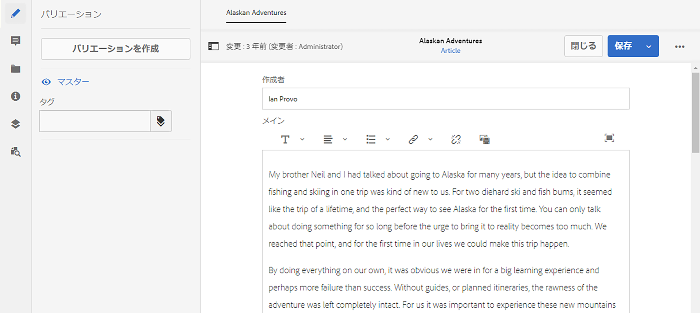

以下の操作を実行できます。

* 「**バリエーション**」タブでコンテンツを直接編集します。データタイプごとに異なる編集オプションが用意されています。次に例を示します。

   * 対象： **複数行テキスト** フィールドに値を入力する場合は、 [全画面表示エディター](#full-screen-editor) 移動先：

      * [形式](#formats)の選択
      * その他の編集オプションの表示（[リッチテキスト](#rich-text)形式の場合）
      * 様々な[アクション](#actions)へのアクセス

   * の場合 **フラグメント参照** フィールド、 [コンテンツフラグメントを編集](#fragment-references-edit-content-fragment) オプションは、モデル定義に応じて使用できます。

* 割り当て **タグ** 現在のバリエーションに追加（タグの追加、更新、削除が可能）

   * [タグ](/help/sites-authoring/tags.md) は、コンテンツの分類や分類に使用できるようにフラグメントを整理する際に強力です。 タグは、コンテンツを（タグ別に）検索したり、一括操作を適用したりするのに使用できます。

      * タグを検索すると、そのタグのバリエーションがハイライト表示された状態でフラグメントが返されます。
      * バリエーション名を使用する代わりに、バリエーションタグを使用して、特定のコンテンツ配信ネットワーク（CDN）プロファイル（CDN キャッシュ用）のバリエーションをグループ化することもできます。

     例えば、関係のあるフラグメントを「クリスマスローンチ」としてタグ付けして、これらのフラグメントだけをサブセットとして閲覧できるようにしたり、今後の別のローンチで使用するために新しいフォルダーにコピーしたりできます。

  >[!NOTE]
  >
  >**タグ**&#x200B;は、[メタデータ](/help/assets/content-fragments/content-fragments-metadata.md)の一部として（**マスター**&#x200B;バリエーションに）追加することもできます

* [マスター](#managing-variations)コンテンツの&#x200B;**バリエーションの作成および管理.**

### 全画面表示エディター {#full-screen-editor}

複数行テキストフィールドの編集時には、全画面表示エディターを開くことができます。実際のテキスト内でタップまたはクリックしてから、次のアクションアイコンを選択します。

フルスクリーンテキストエディターが開きます。

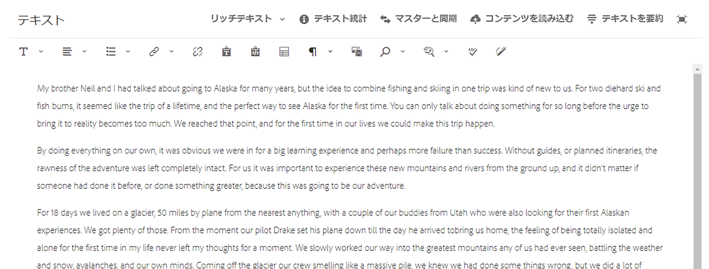

全画面表示テキストエディターでは、次の情報が表示されます。

* 様々な[アクション](#actions)へのアクセス
* [形式](#formats)に応じた、その他の書式設定オプション（[リッチテキスト](#rich-text)）

### アクション {#actions}

全画面表示エディター（複数行テキスト）を開いている場合は、次のアクションも（すべての[形式](#formats)で）使用できます。

* [形式](#formats)（[リッチテキスト](#rich-text)、[プレーンテキスト](#plain-text)、[マークダウン](#markdown)）の選択

* [コンテンツのアップロード](#uploading-content)

* [テキスト統計の表示](#viewing-key-statistics)

* [プライマリとの同期](#synchronizing-with-master)（バリエーションの編集時）

* [テキストの要約](#summarizing-text)

### 形式 {#formats}

複数行テキストを編集するためのオプションは、選択した形式によって異なります。

* [リッチテキスト](#rich-text)
* [プレーンテキスト](#plain-text)
* [Markdown](#markdown)

全画面表示エディターでの作業時に形式を選択できます。

### リッチテキスト {#rich-text}

リッチテキストの編集では、以下の書式を設定できます。

* 太字
* 斜体
* 下線
* 整列：左、中央、右
* 箇条書きリスト
* 番号付きリスト
* インデント：増、減
* ハイパーリンクを作成／解除
* テキストを貼り付け／Word から貼り付け
* 表を挿入
* 段落スタイル：段落、見出し 1/2/3
* [アセットを挿入](#inserting-assets-into-your-fragment)
* 全画面表示エディターを開く。次の書式設定オプションを使用できます。
   * 検索
   * 検索／置換
   * スペルチェッカー
   * [注釈](/help/assets/content-fragments/content-fragments-variations.md#annotating-a-content-fragment)
* [コンテンツフラグメントを挿入](#inserting-content-fragment-into-your-fragment)は、「**複数行テキスト**」フィールドが「**フラグメント参照を許可**」に設定されている場合に使用できます。

[アクション](#actions)は、全画面表示エディターからアクセスすることもできます。

### プレーンテキスト {#plain-text}

プレーンテキストを使用すると、書式設定または Markdown 情報なしでコンテンツをすばやく入力できます。全画面表示エディターを開いて追加の[アクション](#actions)を使用することもできます。

>[!CAUTION]
>
>次を選択した場合、 **プレーンテキスト**&#x200B;に含めると、書式、Markdown、アセットなど、 **リッチテキスト** または **Markdown**.

### マークダウン {#markdown}

>[!NOTE]
>
>詳しくは、 [Markdown](/help/assets/content-fragments/content-fragments-markdown.md) ドキュメント。

これにより、Markdown を使用してテキストを書式設定できます。 以下を定義できます。

* 見出し
* 段落と改行
* リンク
* 画像
* ブロック引用
* リスト
* 強調
* コードブロック
* バックスラッシュエスケープ

全画面表示エディターを開いて追加の[アクション](#actions)を使用することもできます。

>[!CAUTION]
>
>**リッチテキスト**&#x200B;と **Markdown** を切り替えると、ブロック引用やコードブロックに予期しない影響が出ることがあります。ブロック引用とコードブロックの 2 つの形式は処理方法が異なる場合があるからです。

### フラグメント参照 {#fragment-references}

コンテンツフラグメントモデルにフラグメント参照が含まれる場合、フラグメント作成者には次の追加オプションがあります。

* [コンテンツフラグメントを編集](#fragment-references-edit-content-fragment)
* [新しいコンテンツフラグメント](#fragment-references-new-content-fragment)

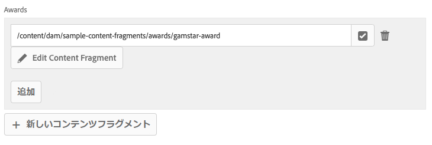

#### コンテンツフラグメントを編集 {#fragment-references-edit-content-fragment}

オプション **コンテンツフラグメントを編集** 新しいウィンドウタブでフラグメントを開きます。

<!--
The option **Edit Content Fragment** opens that fragment in a new editor tab (within the same browser tab).

Selecting the original tab again (for example, **Little Pony Inc.**), will close this secondary tab (in this case, **Adam Smith**).

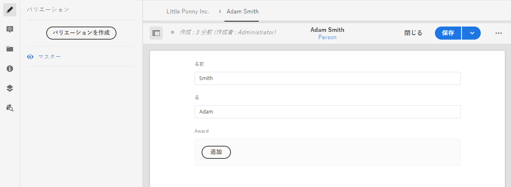
-->

#### 新しいコンテンツフラグメント {#fragment-references-new-content-fragment}

オプション **新しいコンテンツフラグメント** フラグメントを作成できます。 そのためには、エディターにコンテンツフラグメントを作成ウィザードが開きます。

次の方法でフラグメントを作成できます。

1. 目的のフォルダーに移動して選択します。
1. 「**次へ**」を選択します。
1. プロパティの指定（例： ） **タイトル**.
1. 「**作成**」を選択します。
1. 最後に、
   1. **完了** （元のフラグメントに）を返し、新しいフラグメントを参照します。
   1. **開く** は新しいフラグメントを参照し、新しいフラグメントを開いて編集します。新しいブラウザータブで開きます。

### 重要な統計の表示 {#viewing-key-statistics}

全画面表示エディターを開いた場合の「 」アクション **テキスト統計** テキストに関する様々な情報を表示します。

次に例を示します。

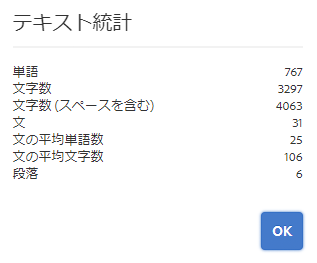

### コンテンツのアップロード {#uploading-content}

コンテンツフラグメントのオーサリングプロセスを容易にするには、外部エディターで用意したテキストをアップロードし、フラグメントに直接追加します。

### テキストの要約 {#summarizing-text}

テキストの要約を使用すると、重要ポイントと全体の意味を保ちながら、テキストの長さを規定の単語数に短縮できます。

>[!NOTE]
>
>より技術的に言えば、システムは、 *情報の密度と独自性の最適な比率* 特定のアルゴリズムに従って。

>[!CAUTION]
>
>コンテンツフラグメントには、親フォルダー（ISO コード）として有効な言語フォルダーが必要です。使用する言語モデルを決定するためにこれが使用されます。
>
>例えば、次のパスの `en/` です。
>
>  `/content/dam/my-brand/en/path-down/my-content-fragment`

>[!CAUTION]
>
英語版は標準で提供されています。
>
他の言語は、パッケージ共有から言語モデルパッケージとして使用できます。
>
* [フランス語（fr）](https://experience.adobe.com/#/downloads/content/software-distribution/en/aem.html?lang=ja?package=/content/software-distribution/en/details.html/content/dam/aem/public/adobe/packages/cq630/product/smartcontent-model-fr)
* [ドイツ語（de）](https://experience.adobe.com/#/downloads/content/software-distribution/en/aem.html?lang=ja?package=/content/software-distribution/en/details.html/content/dam/aem/public/adobe/packages/cq630/product/smartcontent-model-de)
* [イタリア語（it）](https://experience.adobe.com/#/downloads/content/software-distribution/en/aem.html?lang=ja?package=/content/software-distribution/en/details.html/content/dam/aem/public/adobe/packages/cq630/product/smartcontent-model-it)
* [スペイン語（es）](https://experience.adobe.com/#/downloads/content/software-distribution/en/aem.html?lang=ja?package=/content/software-distribution/en/details.html/content/dam/aem/public/adobe/packages/cq630/product/smartcontent-model-es)
>

1. 「**プライマリ**」または必要なバリエーションを選択します。
1. 全画面表示エディターを開きます。

1. ツールバーの「**テキストを要約**」を選択します。

   

1. ターゲットの単語数を指定し、「**開始**」を選択します。
1. 元のテキストは、提案された要約と横並びで表示されます。

   * 削除される文には取り消し線が付き、赤色で表示されます。
   * 要約されたコンテンツに保持する場合は、強調表示された文をクリックします。
   * 削除する場合は、ハイライト表示されていない文をクリックします。

1. 変更を確定するには、「**要約**」を選択します。

1. 元のテキストは、提案された要約と横並びで表示されます。

   * 削除される文には取り消し線が付き、赤色で表示されます。
   * 要約されたコンテンツに保持する場合は、強調表示された文をクリックします。
   * 削除する場合は、ハイライト表示されていない文をクリックします。
   * 要約統計（**実際**&#x200B;と&#x200B;**ターゲット**）が表示されます。
   * 変更を&#x200B;**プレビュー**&#x200B;できます。

   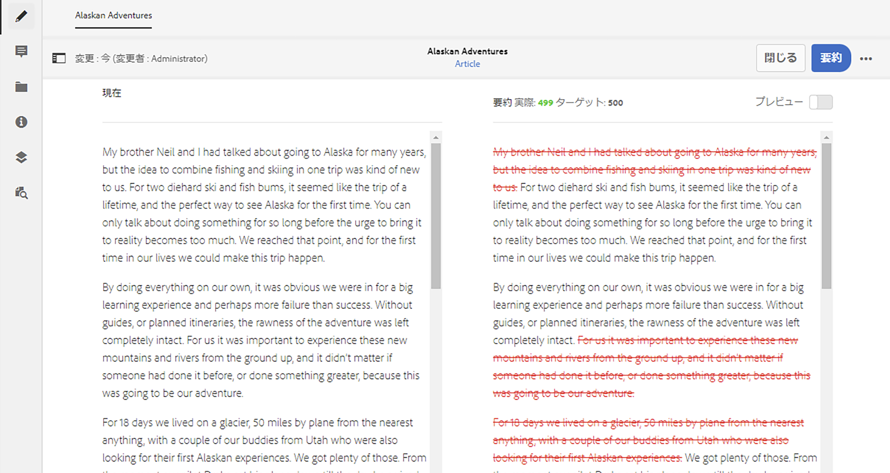

### コンテンツフラグメントへの注釈の追加 {#annotating-a-content-fragment}

フレグメントに注釈を付ける手順は次のとおりです。

1. 「**プライマリ**」または必要なバリエーションを選択します。

1. 全画面表示エディターを開きます。

1. 上部のツールバーに、**注釈**&#x200B;アイコンが表示されます。必要に応じて、一部のテキストを選択できます。

   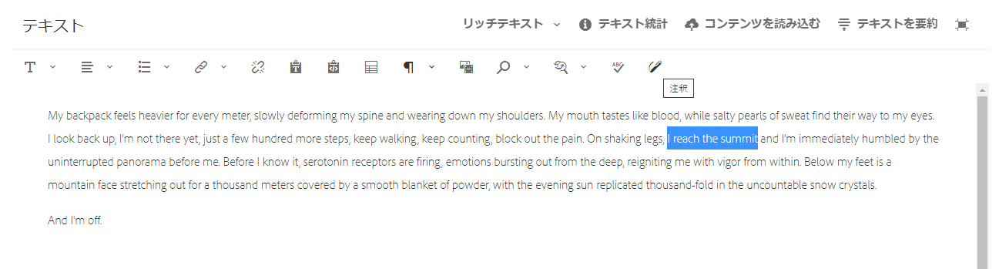

1. ダイアログボックスが表示されます。ここで注釈を入力できます。

   

1. 選択 **適用** をクリックします。

   

   選択したテキストに注釈が適用された場合、そのテキストはハイライト表示されたままになります。

   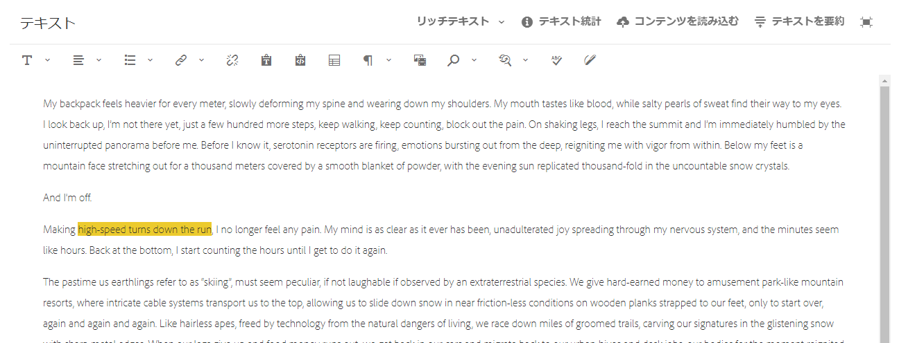

1. 全画面表示エディターを閉じても、注釈はハイライト表示されたままです。選択すると、注釈をさらに編集できるダイアログボックスが開きます。

1. 「**保存**」を選択します。

1. 全画面表示エディターを閉じても、注釈はハイライト表示されたままです。選択すると、注釈をさらに編集できるダイアログボックスが開きます。

   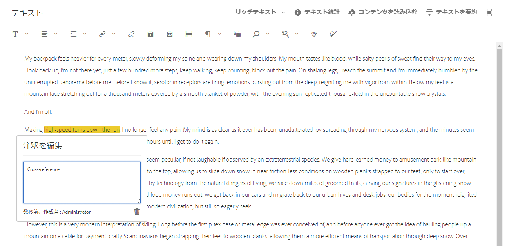

### 注釈の表示、編集、削除 {#viewing-editing-deleting-annotations}

注釈：

* エディターの全画面表示モードと通常モードのどちらの場合も、注釈はテキストのハイライトとして示されます。ハイライト表示されたテキストをクリックすると、注釈の詳細が表示、編集、削除されます。このダイアログボックスが再び開きます。

  >[!NOTE]
  >
  1 つのテキストに複数の注釈が適用されている場合は、ドロップダウンセレクターが表示されます。

* 注釈が適用されたテキスト全体を削除すると、注釈も削除されます。

* 注釈の一覧表示や削除を行うには、フラグメントエディターで「**注釈**」タブを選択します。

  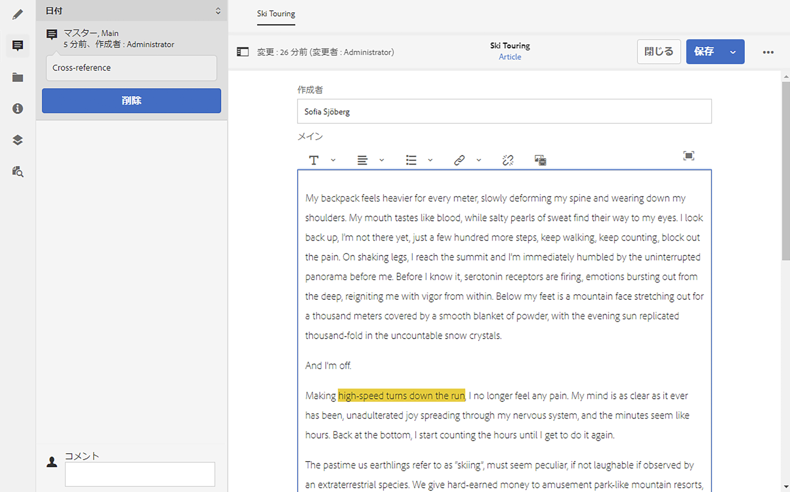

* 内で表示および削除できます。 [タイムライン](/help/assets/content-fragments/content-fragments-managing.md#timeline-for-content-fragments) 選択したフラグメントの。

### フラグメントへのアセットの挿入 {#inserting-assets-into-your-fragment}

コンテンツフラグメントのオーサリングプロセスを容易にするには、 [Assets](/help/assets/manage-assets.md) （画像）をフラグメントに直接追加します。

これらは、書式設定なしでフラグメントの段落シーケンスに追加されます。[フラグメントをページ上で使用または参照](/help/sites-authoring/content-fragments.md)する際に書式を設定できます。

>[!CAUTION]
>
参照ページではこれらのアセットの移動や削除はできません。移動や削除にはフラグメントエディターを使用する必要があります。
>
ただし、アセットの書式設定（サイズなど）は、[ページエディター](/help/sites-authoring/content-fragments.md)で行う必要があります。フラグメントエディターでのアセットの表示は、純粋にコンテンツフローのオーサリング用です。

>[!NOTE]
>
[画像](/help/assets/content-fragments/content-fragments.md#fragments-with-visual-assets)は様々な方法でフラグメントやページに追加できます。

1. 画像を追加する位置にカーソルを置きます。
1. **アセットを挿入** アイコンを使用して、検索ダイアログを開きます。

   

1. ダイアログボックスで、次のいずれかを実行できます。

   * DAM 内の必要なアセットに移動します。
   * DAM 内のアセットを検索します。

   見つかったら、サムネールをクリックして、必要なアセットを選択します。

1. 「**選択**」を使用して、コンテンツフラグメント段落システムの現在の位置にアセットを追加します。

   >[!CAUTION]
   >
   アセットとしてをに追加した後に形式を変更した場合：
   >
   * **プレーンテキスト**：アセットがフラグメントから失われます。
   * **Markdown**：アセットは表示されませんが、に戻ったときにまだ表示されます。 **リッチテキスト**.

### コンテンツフラグメントのフラグメントへの挿入 {#inserting-content-fragment-into-your-fragment}

コンテンツフラグメントのオーサリングプロセスを容易にするには、フラグメントに別のコンテンツフラグメントを追加することもできます。

これらは参照として、フラグメント内の現在の場所に追加されます。

>[!NOTE]
>
このオプションは、「**複数行テキスト**」が「**フラグメント参照を許可**」に設定されている場合に使用できます。

>[!CAUTION]
>
参照ページではこれらのアセットの移動や削除はできません。移動や削除にはフラグメントエディターを使用する必要があります。
>
ただし、アセットの書式設定（サイズなど）は、[ページエディター](/help/sites-authoring/content-fragments.md)で行う必要があります。フラグメントエディターでのアセットの表示は、純粋にコンテンツフローのオーサリング用です。

>[!NOTE]
>
[画像](/help/assets/content-fragments/content-fragments.md#fragments-with-visual-assets)は様々な方法でフラグメントやページに追加できます。

1. フラグメントを追加する位置にカーソルを置きます。
1. **コンテンツフラグメントを挿入** アイコンを使用して、検索ダイアログを開きます。

   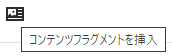

1. ダイアログでは、次のいずれかを実行できます。

   * Assets フォルダー内の必要なフラグメントに移動する
   * フラグメントを検索する

   見つかったら、サムネールをクリックして、必要なフラグメントを選択します。

1. 「**選択**」を使用して、選択したコンテンツフラグメントへの参照を現在のコンテンツフラグメント（現在の場所）に追加します。

   >[!CAUTION]
   >
   形式を変更した場合、別のフラグメントへの参照を追加した後、次の操作を行います。
   >
   * **プレーンテキスト**：参照がフラグメントから失われます。
   * **Markdown**：参照は残ります。

## バリエーションの管理 {#managing-variations}

### バリエーションの作成 {#creating-a-variation}

バリエーションを使用すると、 **マスター** コンテンツを作成し、目的に応じて変更します（必要に応じて）。

バリエーションを作成するには：

1. フラグメントを開き、サイドパネルが表示されていることを確認します。
1. サイドパネルのアイコンバーから「**バリエーション**」を選択します。
1. 「**バリエーションを作成**」を選択します。
1. ダイアログボックスが開き、 **タイトル** および **説明** 新しいバリエーション用。
1. 「**追加**」を選択します。フラグメントの&#x200B;**マスター**&#x200B;が新しいバリエーションにコピーされ、[編集](#editing-a-variation)用に開かれます。

   >[!NOTE]
   >
   バリエーションを作成する場合、常に **マスター** 開いているバリエーションではなく、コピーされます。

   >[!NOTE]
   >
   バリエーションを作成すると、 **タグ** 現在～に割り当てられている **マスター** バリエーションが新しいバリエーションにコピーされます。

### バリエーションの編集 {#editing-a-variation}

次のいずれかの操作を行った後にバリエーションのコンテンツを変更します。

* [バリエーションの作成](#creating-a-variation)。
* 既存のフラグメントを開いた後、サイドパネルから必要なバリエーションを選択します。

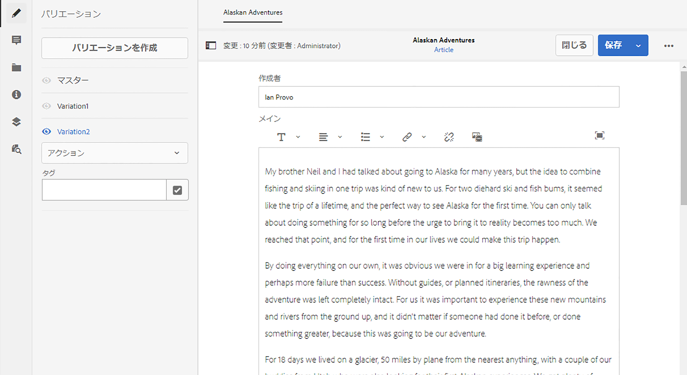

### バリエーションの名前変更 {#renaming-a-variation}

既存のバリエーションの名前を変更するには：

1. フラグメントを開き、サイドパネルから「**バリエーション**」を選択します。
1. 必要なバリエーションを選択します。
1. 「**アクション**」ドロップダウンから「**名前を変更**」を選択します。

1. 表示されたダイアログボックスで新しい「**タイトル**」や「**説明**」を入力します。

1. 「**名前を変更**」アクションを確認します。

>[!NOTE]
>
この手順はバリエーションの&#x200B;**タイトル**&#x200B;にのみ影響を与えます。

### バリエーションの削除 {#deleting-a-variation}

既存のバリエーションを削除するには：

1. フラグメントを開き、サイドパネルから「**バリエーション**」を選択します。
1. 必要なバリエーションを選択します。
1. 「**アクション**」ドロップダウンから「**削除**」を選択します。

1. ダイアログで「**削除**」アクションを確認します。

>[!NOTE]
>
**プライマリ**&#x200B;は削除できません。

### プライマリとの同期 {#synchronizing-with-master}

**マスター** はコンテンツフラグメントの一部であり、定義上、このフラグメントにはコンテンツのマスターコピーが格納されます。一方、バリエーションには、そのコンテンツの個々の更新済みのカスタマイズ済みバージョンが格納されます。 マスターを更新すると、これらの変更がバリエーションにも関連する可能性があるので、バリエーションに反映する必要があります。

バリエーションを編集する際は、バリエーションの現在の要素をマスターと同期するためのアクションにアクセスできます。 これにより、必要なバリエーションに対してマスターに加えた変更を自動的にコピーできます。

>[!CAUTION]
>
同期を使用できるのは、変更内容&#x200B;*を&#x200B;**プライマリ**からバリエーションに*&#x200B;コピーする場合のみです。
>
バリエーションの現在の要素のみが同期されます。
>
同期は、**複数行テキスト**&#x200B;データタイプでのみ機能します。
>
*バリエーションから&#x200B;**プライマリ***へ変更内容を転送することはできません。

<!-- needs new screenshot for synchronize effect -->

1. フラグメントエディターでコンテンツフラグメントを開きます。**プライマリ**&#x200B;が編集されていることを確認します。

1. 特定のバリエーションを選択し、次のいずれかから適切な同期アクションを選択します。

   * **アクション**&#x200B;ドロップダウンセレクター - **現在の要素をマスターと同期**

     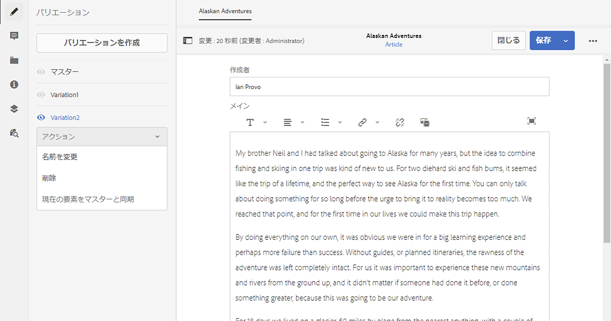

   * 全画面表示エディターのツールバー - **マスターと同期**

     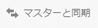

1. プライマリとバリエーションが横並びに表示されます。

   * 緑は、コンテンツが（バリエーションに）追加されたことを示します。
   * 赤は削除されたコンテンツを示します（バリエーションからの削除）
   * 青は置換されたテキストを示します

   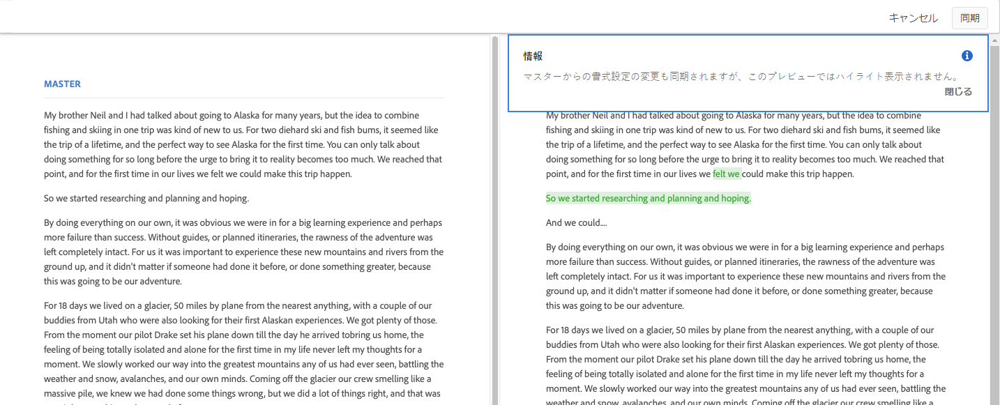

1. 「**同期**」を選択すると、バリエーションが更新され、表示されます。
