# コンテンツフラグメントの翻訳プロジェクトの作成 {#creating-translation-projects-for-content-fragments}

In addition to assets, Adobe Experience Manager (AEM) Assets supports language copy workflows for [content fragments](/help/assets/content-fragments/content-fragments.md) (including variations). コンテンツフラグメントで言語コピーワークフローを実行するために追加の最適化は必要ありません。各ワークフローで、コンテンツフラグメント全体が翻訳のために送信されます。

コンテンツフラグメントで実行できるワークフロータイプは、アセットで実行できるワークフロータイプと同じです。また、ワークフロータイプごとに使用できるオプションも、アセット用の対応するワークフロータイプで使用できるものと同じです。

コンテンツフラグメントで実行できる言語コピーワークフローのタイプは次のとおりです。

**作成と翻訳**

このワークフローでは、翻訳されるコンテンツフラグメントが、翻訳先言語の言語ルートにコピーされます。また、選択するオプションによって異なりますが、コンテンツフラグメントに対応する翻訳プロジェクトがプロジェクトコンソールで作成されます。設定によっては、翻訳プロジェクトを手動で開始することも、翻訳プロジェクトの作成後すぐに自動的に実行することもできます。

**言語コピーを更新**

ソースコンテンツフラグメントが更新または変更されたら、対応するロケール／言語固有のコンテンツフラグメントを再度翻訳する必要があります。更新言語コピーワークフローは、追加のコンテンツフラグメントグループを翻訳して、特定のロケールの言語コピーに含めます。この場合、翻訳されたコンテンツフラグメントが追加されるターゲットフォルダーには翻訳済みのコンテンツフラグメントが既に含まれています。

## 作成と翻訳ワークフロー {#create-and-translate-workflow}

「作成と翻訳」ワークフローには、次のオプションがあります。各オプションに関連する手順は、アセットの対応するオプションに関連する手順と似ています。

* Create structure only: For procedure steps, see [Create structure only for assets](translation-projects.md#create-structure-only).
* Create a new translation project: For procedure steps, see [Create a new translation project for assets](translation-projects.md#create-a-new-translation-project).
* Add to existing translation project: For procedure steps, see [Add to existing translation project for assets](translation-projects.md#add-to-existing-translation-project).

## 言語コピーを更新ワークフロー {#update-language-copies-workflow}

「言語コピーを更新」ワークフローには、次のオプションがあります。各オプションに関連する手順は、アセットの対応するオプションに関連する手順と似ています。

* Create a new translation project: For procedure steps, see [Create a new translation project for assets](translation-projects.md#create-a-new-translation-project) (update workflow).
* Add to existing translation project: For procedure steps, see [Add to existing translation project for assets](translation-projects.md#add-to-existing-translation-project) (update workflow).

フラグメントの一時的な言語コピーを作成することもできます。方法は、アセットの一時的なコピーを作成する場合と同様です。詳しくは、[一時的な言語コピーの作成（アセット）](translation-projects.md#creating-temporary-language-copies)を参照してください。

## 混在メディアフラグメントの翻訳 {#translating-mixed-media-fragments}

AEM では、様々な種類のメディアアセットとコレクションが含まれているコンテンツフラグメントを翻訳できます。インラインアセットが含まれているコンテンツフラグメントを翻訳した場合、翻訳後のアセットのコピーが、ターゲット言語ルートの下に保存されます。

このコンテンツフラグメントにコレクションが含まれている場合は、コレクション内のアセットもコンテンツフラグメントと一緒に翻訳されます。翻訳後のアセットのコピーは、適切なターゲット言語のルート内（ソース言語のルート下のソースアセットの物理的な場所と一致する場所）に、保存されます。

混在メディアが含まれているコンテンツフラグメントを翻訳できるようにするには、最初に、コンテンツフラグメントに関連付けられたインラインアセットとコレクションの翻訳が可能になるように、デフォルトの翻訳フレームワークを編集します。

1. AEM のロゴをクリックまたはタップし、**[!UICONTROL ツール／デプロイメント／Cloud Services]** に移動します。
1. **[!UICONTROL Adobe Marketing Cloud]** の下にある「 **[!UICONTROL 翻訳の統合]**」を見つけ、「設定を **[!UICONTROL 表示]**」をクリックまたはタップします。

   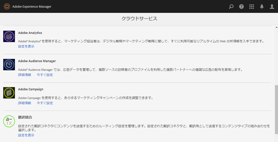

1. 利用可能な設定のリストで、「**[!UICONTROL デフォルト設定（翻訳統合の設定）]**」をクリックまたはタップして、**[!UICONTROL デフォルト設定]**&#x200B;ページを開きます。

   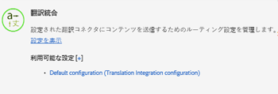

1. ツールバーの「**[!UICONTROL 編集]**」をクリックして、「**[!UICONTROL 翻訳設定]**」ダイアログを表示します。

   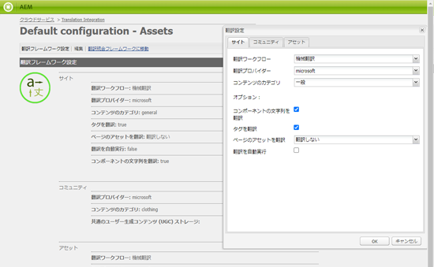

1. 「**[!UICONTROL アセット]**」タブに移動し、「**[!UICONTROL コンテンツフラグメントアセットを翻訳]**」リストから「**[!UICONTROL インラインメディアアセットと関連付けられているコレクション]**」を選択します。「**[!UICONTROL OK]**」をクリックまたはタップして、変更を保存します。

   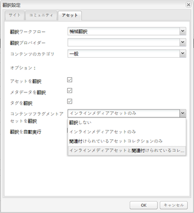

1. 英語ルートフォルダーから、コンテンツフラグメントを開きます。

   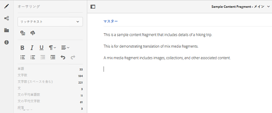

1. 「**[!UICONTROL アセットを挿入]**」アイコンをクリックまたはタップします。

   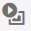

1. コンテンツフラグメントにアセットを挿入します。

   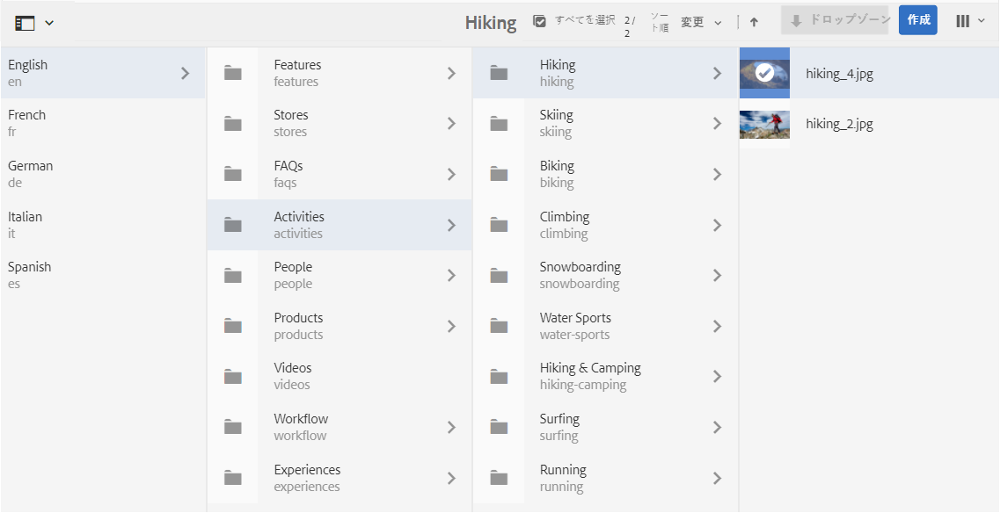

1. 「**[!UICONTROL コンテンツを関連付け]**」アイコンをクリックまたはタップします。

   

1. 「**[!UICONTROL コンテンツを関連付け]**」をクリックまたはタップします。

   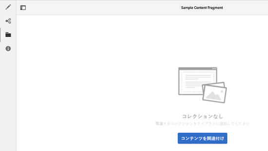

1. コレクションを選択し、これをコンテンツフラグメントに含めます。「**[!UICONTROL 保存]**」をクリックまたはタップします。

   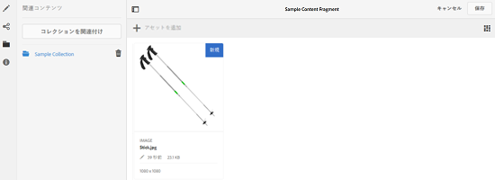

1. コンテンツフラグメントを選択し、**[!UICONTROL グローバルナビゲーション]**&#x200B;アイコンをクリックまたはタップします。
1. メニューから「**[!UICONTROL 参照]**」を選択して&#x200B;**[!UICONTROL 参照]**&#x200B;パネルを表示します。

   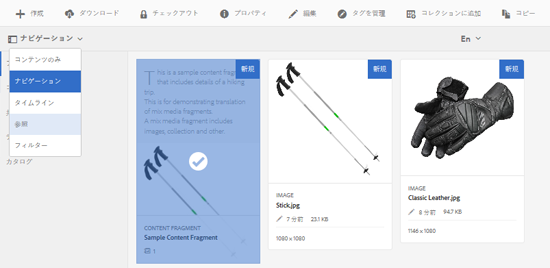

1. 「**[!UICONTROL コピー]**」の下の「**[!UICONTROL 言語コピー]**」をクリックまたはタップして言語コピーを表示します。

   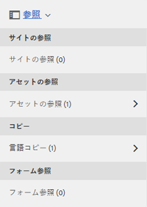

1. Click/tap **[!UICONTROL Create &amp; Translate]** from at the bottom of the panel to display the **[!UICONTROL Create &amp; Translate]** dialog.

   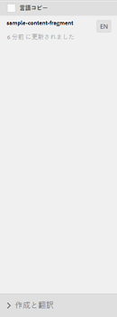

1. 「**[!UICONTROL ターゲット言語]**」リストからターゲット言語を選択します。

   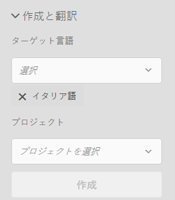

1. 「**[!UICONTROL プロジェクト]**」リストから翻訳プロジェクトのタイプを選択します。

   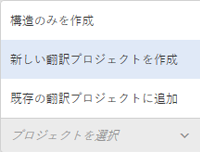

1. 「**[!UICONTROL プロジェクトタイトル]**」ボックスにプロジェクトのタイトルを指定し、「**作成**」をクリックまたはタップします。

   

1. **[!UICONTROL プロジェクト]**&#x200B;コンソールに移動し、作成した翻訳プロジェクトのプロジェクトフォルダーを開きます。

   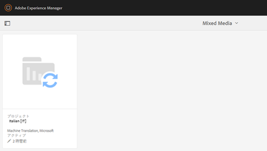

1. プロジェクトのタイトルをクリックまたはタップして、プロジェクトの詳細ページを開きます。

   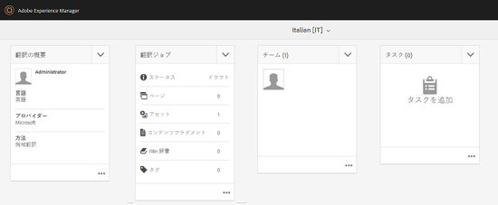

1. 「翻訳ジョブ」タイルで、翻訳するアセットの数を確認します。
1. 「**[!UICONTROL 翻訳ジョブ]**」タイルで、翻訳ジョブを開始します。

   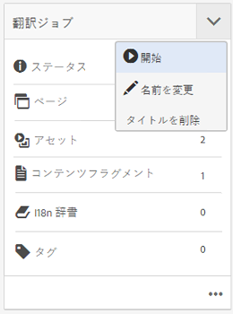

1. 「翻訳ジョブ」タイルの下部にある省略記号をクリックして、翻訳ジョブの状態を表示します。

   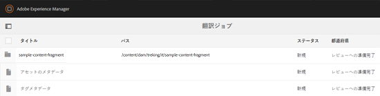

1. コンテンツフラグメントをクリックまたはタップして、翻訳後の関連アセットのパスを確認します。

   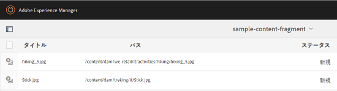

1. コレクションコンソールで、コレクションの言語コピーをレビューします。

   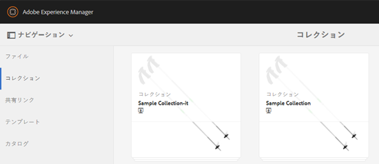

   コレクションのコンテンツのみが翻訳されていることがわかります。コレクション自体は翻訳されていません。

1. 翻訳後の関連アセットのパスに移動します。翻訳済みのアセットがターゲット言語ルートの下に保存されていることを確認します。

   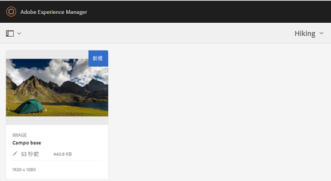

1. コンテンツフラグメントと一緒に翻訳された、コレクション内のアセットに移動します。翻訳後のアセットコピーが適切なターゲット言語ルートに保存されていることを確認します。

   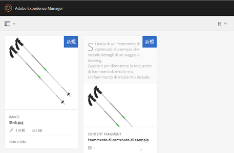

   >[!NOTE]
   >
   >コンテンツフラグメントを既存のプロジェクトに追加する手順や更新ワークフローの実行手順は、アセット向けの対応する手順と同様です。これらの手順については、アセット向けに説明されている手順を参照してください。

