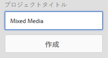

# コンテンツフラグメントの翻訳プロジェクトの作成 {#creating-translation-projects-for-content-fragments}

Adobe Experience Manager（AEM）Assets は、アセットだけでなく、[コンテンツフラグメント](/help/assets/content-fragments/content-fragments.md)（バリエーションも含む）の言語コピーワークフローをサポートします。コンテンツフラグメントで言語コピーワークフローを実行するには、追加の最適化は必要ありません。各ワークフローで、コンテンツフラグメント全体が翻訳のために送信されます。

コンテンツフラグメントで実行できるワークフロータイプは、アセットに実行するワークフロータイプと同じです。また、各ワークフロータイプで使用できるオプションも、アセット用の対応するワークフロータイプで使用できるものと同じです。

コンテンツフラグメントで実行できる言語コピーワークフローのタイプは次のとおりです。

**作成と翻訳**

このワークフローでは、翻訳されるコンテンツフラグメントが、翻訳するターゲット言語の言語ルートにコピーされます。また、選択するオプションによって異なりますが、コンテンツフラグメントに対応する翻訳プロジェクトがプロジェクトコンソールで作成されます。設定に応じて、翻訳プロジェクトを手動で開始することも、翻訳プロジェクトの作成後すぐに自動的に実行することもできます。

**言語コピーを更新**

ソースコンテンツフラグメントが更新または変更される場合、対応するロケール／言語固有のコンテンツフラグメントを再度翻訳する必要があります。言語コピーを更新ワークフローは、コンテンツフラグメントの追加のグループを翻訳して、特定のロケールの言語コピーに含めます。この場合、翻訳されたコンテンツフラグメント、既に翻訳済みのコンテンツフラグメントが含まれているターゲットフォルダーに追加されます。

## 作成と翻訳ワークフロー {#create-and-translate-workflow}

作成と翻訳ワークフローには、次のオプションがあります。各オプションに関連する手順は、アセットの対応するオプションに関連する手順と似ています。

* 構造のみを作成：手順は、[構造のみを作成（アセット）](translation-projects.md#create-structure-only)を参照してください。
* 翻訳プロジェクトを作成：手順について詳しくは、[翻訳プロジェクトを作成（アセット）](translation-projects.md#create-a-new-translation-project)を参照してください。
* 既存の翻訳プロジェクトに追加：手順は、[既存の翻訳プロジェクトに追加（アセット）](translation-projects.md#add-to-existing-translation-project)を参照してください。

## 言語コピーを更新ワークフロー {#update-language-copies-workflow}

言語コピーを更新ワークフローには、次のオプションがあります。各オプションに関連する手順は、アセットの対応するオプションに関連する手順と似ています。

* 翻訳プロジェクトを作成：手順について詳しくは、[翻訳プロジェクトを作成（アセット）](translation-projects.md#create-a-new-translation-project)（更新ワークフロー）を参照してください。
* 既存の翻訳プロジェクトに追加：手順は、[既存の翻訳プロジェクトに追加（アセット）](translation-projects.md#add-to-existing-translation-project)（更新ワークフロー）を参照してください。

また、フラグメントの一時的な言語コピーを作成できます。方法は、アセットの一時的なコピーを作成する場合と同様です。詳しくは、[一時的な言語コピーの作成（アセット）](translation-projects.md#creating-temporary-language-copies)を参照してください。

## 混在メディアフラグメントの翻訳 {#translating-mixed-media-fragments}

AEM では、様々なタイプのメディアアセットとコレクションが含まれるコンテンツフラグメントを翻訳できます。インラインアセットを含むコンテンツフラグメントを翻訳する場合、アセットの翻訳されたコピーは、ターゲット言語ルートの下に保存されます。

このコンテンツフラグメントにコレクションが含まれる場合は、コレクション内のアセットもコンテンツフラグメントと共に翻訳されます。アセットの翻訳されたコピーは、適切なターゲット言語のルート内（ソース言語のルート下のソースアセットの物理的な場所と一致する場所）に、保存されます。

混在メディアを含むコンテンツフラグメントを翻訳できるようにするには、最初に、デフォルトの翻訳フレームワークを編集して、コンテンツフラグメントに関連付けられたインラインアセットとコレクションの翻訳を有効にします。

1. AEM のロゴをクリックし、**[!UICONTROL ツール／デプロイメント／クラウドサービス]**&#x200B;に移動します。
1. **[!UICONTROL Adobe Marketing Cloud]** の下にある「**[!UICONTROL 翻訳統合]**」を見つけ、「**[!UICONTROL 設定を表示]**」をクリックします。

   

1. 利用可能な設定のリストで、「**[!UICONTROL デフォルト設定（翻訳統合の設定）]**」をクリックして、**[!UICONTROL デフォルト設定]**&#x200B;ページを開きます。

   

1. ツールバーの「**[!UICONTROL 編集]**」をクリックして、「**[!UICONTROL 翻訳設定]**」ダイアログを表示します。

   

1. 「**[!UICONTROL アセット]**」タブに移動し、「**[!UICONTROL コンテンツフラグメントアセットを翻訳]**」リストから「**[!UICONTROL インラインメディアアセットと関連付けられているコレクション]**」を選択します。「**[!UICONTROL OK]**」をクリックして、変更を保存します。

   

1. 英語ルートフォルダーから、コンテンツフラグメントを開きます。

   

1. **[!UICONTROL アセットを挿入]**&#x200B;アイコンをクリックします。

   

1. コンテンツフラグメントにアセットを挿入します。

   

1. **[!UICONTROL コンテンツを関連付け]**&#x200B;アイコンをクリックします。

   

1. 「**[!UICONTROL コンテンツを関連付け]**」をクリックします。

   

1. コレクションを選択し、これをコンテンツフラグメントに含めます。「**[!UICONTROL 保存]**」をクリックします。

   

1. コンテンツフラグメントを選択し、**[!UICONTROL グローバルナビゲーション]**&#x200B;アイコンをクリックします。
1. メニューから「**[!UICONTROL 参照]**」を選択して、**[!UICONTROL 参照]**&#x200B;パネルを表示します。

   

1. 「**[!UICONTROL コピー]**」の下の「**[!UICONTROL 言語コピー]**」をクリックして、言語コピーを表示します。

   

1. パネルの下部にある「**[!UICONTROL 作成と翻訳]**」をクリックして、**[!UICONTROL 作成と翻訳]**&#x200B;ダイアログを表示します。

   

1. 「**[!UICONTROL ターゲット言語]**」リストからターゲット言語を選択します。

   

1. 「**[!UICONTROL プロジェクト]**」リストから翻訳プロジェクトのタイプを選択します。

   

1. 「**[!UICONTROL プロジェクトタイトル]**」ボックスにプロジェクトのタイトルを指定し、「**作成**」をクリックします。

   

1. **[!UICONTROL プロジェクト]**&#x200B;コンソールに移動し、作成した翻訳プロジェクトのプロジェクトフォルダーを開きます。

   

1. プロジェクトのタイルをクリックして、プロジェクトの詳細ページを開きます。

   

1. 「翻訳ジョブ」タイルで、翻訳するアセットの数を確認します。
1. 「**[!UICONTROL 翻訳ジョブ]**」タイルで、翻訳ジョブを開始します。

   

1. 「翻訳ジョブ」タイルの下部にある省略記号をクリックして、翻訳ジョブの状態を表示します。

   

1. コンテンツフラグメントをクリックまたはタップして、翻訳後の関連アセットのパスを確認します。

   

1. コレクションコンソールで、コレクションの言語コピーをレビューします。

   

   コレクションのコンテンツのみが翻訳されていることがわかります。コレクション自体は翻訳されていません。

1. 翻訳後の関連アセットのパスに移動します。翻訳後のアセットがターゲット言語ルートの下に保存されていることを確認します。

   

1. コンテンツフラグメントと共に翻訳された、コレクション内のアセットに移動します。翻訳後のアセットコピーが適切なターゲット言語ルートに保存されていることを確認します。

   

   >[!NOTE]
   >
   >コンテンツフラグメントを既存のプロジェクトに追加する手順や更新ワークフローの実行手順は、アセット向けの対応する手順と同様です。これらの手順については、アセット向けに説明されている手順を参照してください。
