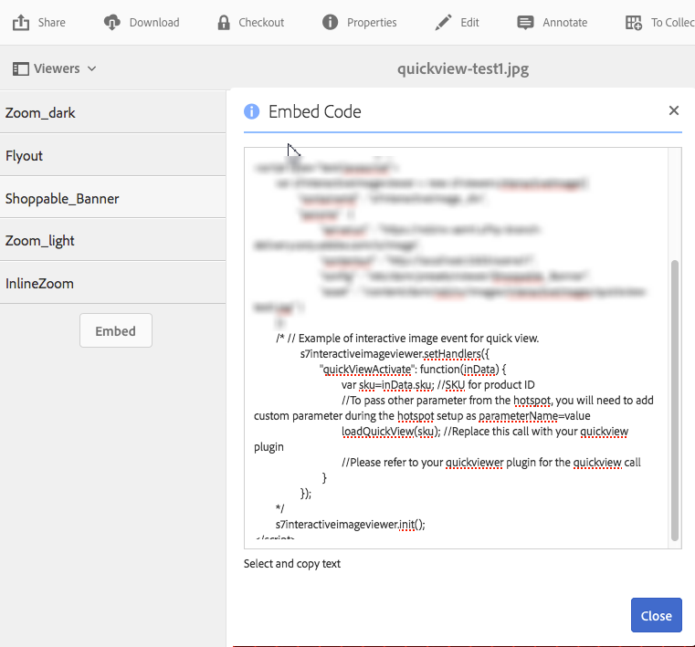

# クイックビューを使用してカスタムポップアップを作成する {#using-quickviews-to-create-custom-pop-ups}

e コマースエクスペリエンスではデフォルトのクイックビューが使用され、ポップアップに購入を促す商品情報が表示されます。ただし、このようなポップアップにカスタムコンテンツが表示されるように設定できます。ビューアによりますが、この機能を使用すると、ホットスポットやサムネール画像、画像マップをクリックして、情報や関連コンテンツを表示できるようになります。

クイックビューをサポートしている Dynamic Media のビューアは、次のとおりです。

* インタラクティブ画像（クリック可能なホットスポット）
* インタラクティブビデオ（ビデオの再生中にクリック可能なサムネール画像）
* カルーセルバナー（クリック可能なホットスポットまたは画像マップ）

ビューアによって機能は異なりますが、クイックビューの作成手順はサポートする 3 つのビューアで同じです。

**クイックビューを使用してカスタムポップアップを作成するには：**

1. アップロードしたアセット用にクイックビューを作成します。

   一般には、使用しているビューアでアセットを使用できるように編集すると同時にクイックビューを作成します。

   <table>
    <tbody>
    <tr>
    <td><strong>使用しているビューア</strong></td>
    <td><strong>クイックビューを作成するには、次の手順を実行します</strong></td>
    </tr>
    <tr>
    <td>インタラクティブ画像</td>
    <td><a href="/help/assets/interactive-images.md#adding-hotspots-to-an-image-banner" target="_blank">画像バナーへのホットスポットの追加</a></td>
    </tr>
    <tr>
    <td>インタラクティブビデオ</td>
    <td><a href="/help/assets/interactive-videos.md#adding-interactivity-to-your-video" target="_blank">ビデオへのインタラクティブ機能の追加</a>.</td>
    </tr>
    <tr>
    <td>カルーセルバナー</td>
    <td><a href="/help/assets/carousel-banners.md#adding-hotspots-or-image-maps-to-an-image-banner" target="_blank">バナーへのホットスポットまたは画像マップの追加</a><br /> </td>
    </tr>
    </tbody>
   </table>

1. ビューアの埋め込みコードを取得し、Web サイトにビューアを統合します。

   <table>
    <tbody>
    <tr>
    <td><strong>使用しているビューア</strong><br /> </td>
    <td><strong>ビューアを web サイトに統合するには、次の手順を実行します</strong></td>
    </tr>
    <tr>
    <td>インタラクティブ画像</td>
    <td><a href="/help/assets/interactive-images.md#integrating-an-interactive-image-with-your-website" target="_blank">インタラクティブ画像の Web サイトへの統合</a>.<br /> </td>
    </tr>
    <tr>
    <td>インタラクティブビデオ<br /> </td>
    <td><a href="/help/assets/interactive-videos.md#integrating-an-interactive-video-with-your-website" target="_blank">インタラクティブビデオの Web サイトへの統合</a>.<br /> </td>
    </tr>
    <tr>
    <td>カルーセルバナー</td>
    <td><a href="/help/assets/carousel-banners.md#adding-a-carousel-banner-to-your-website-page" target="_blank">Web サイトページへのカルーセルバナーの追加</a>.<br /> </td>
    </tr>
    </tbody>
   </table>

1. 使用しているビューアがクイックビューの使用方法を認識できる必要があります。

   ビューアは `QuickViewActive` というハンドラーを使用します。

   **例**
Web ページで、インタラクティブ画像用に次の埋め込みコードのサンプルを使用するとします。

   

   ハンドラーは `setHandlers` を使用してビューアに読み込まれます。

   `*viewerInstance*.setHandlers({ *handler 1*, *handler 2*}, ...`

   **上記の埋め込みコードの例を使用すると、次のようなコードになります。**

   ```xml
   s7interactiveimageviewer.setHandlers({
       quickViewActivate": function(inData) {
           var sku=inData.sku;
           var genericVariable1=inData.genericVariable1;
           var genericVariable2=inData.genericVariable2;
          loadQuickView(sku,genericVariable1,genericVariable2);
       }
   })
   ```

   `setHandlers()` メソッドについて詳しくは、以下を参照してください。

   * インタラクティブ画像ビューア：[https://experienceleague.adobe.com/docs/dynamic-media-developer-resources/library/viewers-for-aem-assets-only/interactive-images/jsapi-interactive-image/r-html5-aem-int-image-viewer-javascriptapiref-sethandlers.html?lang=ja](https://experienceleague.adobe.com/docs/dynamic-media-developer-resources/library/viewers-for-aem-assets-only/interactive-images/jsapi-interactive-image/r-html5-aem-int-image-viewer-javascriptapiref-sethandlers.html?lang=ja)
   * インタラクティブビデオビューア：[https://experienceleague.adobe.com/docs/dynamic-media-developer-resources/library/viewers-for-aem-assets-only/interactive-video/jsapi-interactive-video/r-html5-aem-int-video-javascriptapiref-sethandlers.html?lang=ja](https://experienceleague.adobe.com/docs/dynamic-media-developer-resources/library/viewers-for-aem-assets-only/interactive-video/jsapi-interactive-video/r-html5-aem-int-video-javascriptapiref-sethandlers.html?lang=ja)

1. ここで、 `quickViewActivate` ハンドラーを設定する必要があります。

   `quickViewActivate` ハンドラーはビューアのクイックビューを制御します。このハンドラーには、クイックビューで使用する変数のリストと関数呼び出しが含まれています。埋め込みコードは、クイックビューに設定された SKU 変数と `loadQuickView` 関数呼び出しのサンプルにマッピングを提供します。

   **変数マッピング** Web ページで使用する変数を SKU 値とクイックビューに含まれる一般変数にマッピングします。

   `var *variable1*= inData.*quickviewVariable*`

   提供された埋め込みコードには、SKU 変数用のサンプルマッピングが含まれています。

   `var sku=inData.sku`

   以下のように、クイックビューからの追加変数もマッピングします。

   ```
   var <i>variable2</i>= inData.<i>quickviewVariable2</i>
    var <i>variable3</i>= inData.<i>quickviewVariable3</i>
   ```

   **関数呼び出し**&#x200B;ハンドラーには、クイックビューを機能させるために関数呼び出しも必要です。この関数は、ホストページからアクセスできることが前提となります。埋め込みコードは、サンプル関数呼び出しを提供します。

   `loadQuickView(sku)`

   このサンプル関数呼び出しは、関数 `loadQuickView()` が存在しアクセス可能であることが前提となります。

   `quickViewActivate` メソッドについて詳しくは、以下を参照してください。

   * インタラクティブ画像ビューア：[https://experienceleague.adobe.com/docs/dynamic-media-developer-resources/library/viewers-for-aem-assets-only/interactive-images/c-html5-aem-interactive-image-event-callbacks.html?lang=ja](https://experienceleague.adobe.com/docs/dynamic-media-developer-resources/library/viewers-for-aem-assets-only/interactive-images/c-html5-aem-interactive-image-event-callbacks.html?lang=ja)
   * インタラクティブビデオビューア：[https://experienceleague.adobe.com/docs/dynamic-media-developer-resources/library/viewers-for-aem-assets-only/interactive-video/c-html5-aem-int-video-event-callbacks.html?lang=ja](https://experienceleague.adobe.com/docs/dynamic-media-developer-resources/library/viewers-for-aem-assets-only/interactive-video/c-html5-aem-int-video-event-callbacks.html?lang=ja)
   * インタラクティブビデオビューアでのインタラクティブデータのサポート：[https://experienceleague.adobe.com/docs/dynamic-media-developer-resources/library/viewers-for-aem-assets-only/interactive-video/c-html5-aem-int-video-int-data-support.html?lang=ja](https://experienceleague.adobe.com/docs/dynamic-media-developer-resources/library/viewers-for-aem-assets-only/interactive-video/c-html5-aem-int-video-int-data-support.html?lang=ja)

1. 以下の操作を実行してください。

   * 埋め込みコードの setHandlers セクションのコメントアウトを解除します。
   * クイックビューに含まれる追加変数をマッピングします。

      * 変数を追加する場合は、`loadQuickView(sku,*var1*,*var2*)` 呼び出しを更新します。
   * ビューア外でページにシンプルな `loadQuickView` () 関数を作成します。

      例えば、以下の場合は、ブラウザーのコンソールに SKU の値が書き込まれます。

   ```xml
   function loadQuickView(sku){
       console.log ("quickview sku value is " + sku);
   }
   ```

   * Web サーバーにテスト HTML ページをアップロードし、開きます。

       クイックビューからの変数がマッピングされ、関数呼び出しが追加された状態で、ブラウザーコンソールは提供されたサンプル関数を使用してブラウザーコンソールに変数値を書き込みます。


1. これで、関数を使用してクイックビューでシンプルなポップアップを起動できるようになりました。以下の例では、ポップアップに `DIV` を使用しています。
1. ポップアップの `DIV` を以下のようなスタイルにします。必要に応じて独自のスタイルを追加します。

   ```xml
   <style type="text/css">
       #quickview_div{
           position: absolute;
           z-index: 99999999;
           display: none;
       }
   </style>
   ```

1. HTML ページのボディにポップアップの `DIV` を配置します。

   要素の 1 つは、ユーザーがクイックビューを起動すると SKU 値で更新される ID に設定されます。この例には、ポップアップを表示後に再び隠すための簡単なボタンも含まれています。

   ```xml
   <div id="quickview_div" >
       <table>
           <tr><td><input id="btnClosePopup" type="button" value="Close"        onclick='document.getElementById("quickview_div").style.display="none"' /><br /></td></tr>
           <tr><td>SKU</td><td><input type="text" id="txtSku" name="txtSku"></td></tr>
       </table>
   </div>
   ```

1. ポップアップで SKU の値を更新できるように関数を追加します。手順 5 で作成した簡単な関数を次のように置き換えて、ポップアップを表示させます。

   ```xml
   <script type="text/javascript">
       function loadQuickView(sku){
           document.getElementById("txtSku").setAttribute("value",sku); // write sku value
           document.getElementById("quickview_div").style.display="block"; // show popup
       }
   </script>
   ```

1. Web サーバーにテスト用の HTML ページをアップロードして開きます。ユーザーがクイックビューを起動すると、ビューアにポップアップの `DIV` が表示されます。
1. **全画面表示モードでカスタムポップアップを表示する方法**

   インタラクティブビデオビューアなどの一部のビューアでは、全画面表示モードでの表示をサポートしています。ただし、前の手順で説明したポップアップを使用すると、全画面表示モード中はビューアの背後に表示されるようになります。

   標準モードと全画面表示モードの両方でポップアップを表示させるには、ビューアのコンテナにポップアップをアタッチします。2 つ目のハンドラーメソッドである `initComplete` を使用します。

   `initComplete` ハンドラーは、ビューアの初期化後に呼び出されます。

   ```xml
   "initComplete":function() { code block }
   ```

   `init()` メソッドについて詳しくは、以下を参照してください。

   * インタラクティブ画像ビューア：[https://experienceleague.adobe.com/docs/dynamic-media-developer-resources/library/viewers-for-aem-assets-only/interactive-images/jsapi-interactive-image/r-html5-aem-int-image-viewer-javascriptapiref-init.html?lang=ja](https://experienceleague.adobe.com/docs/dynamic-media-developer-resources/library/viewers-for-aem-assets-only/interactive-images/jsapi-interactive-image/r-html5-aem-int-image-viewer-javascriptapiref-init.html?lang=ja)
   * インタラクティブビデオビューア：[https://experienceleague.adobe.com/docs/dynamic-media-developer-resources/library/viewers-for-aem-assets-only/interactive-video/jsapi-interactive-video/r-html5-aem-int-video-javascriptapiref-init.html?lang=ja](https://experienceleague.adobe.com/docs/dynamic-media-developer-resources/library/viewers-for-aem-assets-only/interactive-video/jsapi-interactive-video/r-html5-aem-int-video-javascriptapiref-init.html?lang=ja)

1. 前の手順で説明したようにポップアップをビューアにアタッチするには、次のコードを使用します。

   ```xml
   "initComplete":function() {
       var popup = document.getElementById('quickview_div');
       popup.parentNode.removeChild(popup);
       var sdkContainerId = s7interactivevideoviewer.getComponent("container").getInnerContainerId();
       var inner_container = document.getElementById(sdkContainerId);
       inner_container.appendChild(popup);
   }
   ```

   上記のコードでは、次の処理を実行しました。

   * カスタムポップアップを特定しました。
   * DOM からの削除
   * ビューアコンテナの指定
   * ビューアコンテナへのポップアップのアタッチ

1. setHandlers コード全体は次に似たものになります（インタラクティブビデオビューアを使用しています）。

   ```xml
   s7interactivevideoviewer.setHandlers({
       "quickViewActivate": function(inData) {
           var sku=inData.sku;
           loadQuickView(sku);
   
       },
       "initComplete":function() {
           var popup = document.getElementById('quickview_div'); // get custom quick view container
           popup.parentNode.removeChild(popup); // remove it from current DOM
           var sdkContainerId = s7interactivevideoviewer.getComponent("container").getInnerContainerId();
           var inner_container = document.getElementById(sdkContainerId);
           inner_container.appendChild(popup);
       }
   });
   ```

1. ハンドラーを読み込んだ後で、ビューアを初期化します。

   `*viewerInstance.*init()`

   **例**
この例では、インタラクティブ画像ビューアを使用しています。

   `s7interactiveimageviewer.init()`

   ホストページにビューアを埋め込んだら、`init()` でビューアを呼び出す前に、ビューアインスタンスが作成され、ハンドラーが読み込まれていることを確認してください。
