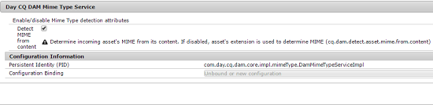

# [!DNL Apache Tika] {#detecting-mime-type-of-assets-using-apache-tika}を使用してアセットのMIMEタイプを検出する

通常、[!DNL Adobe Experience Manager Assets]は、ファイルの拡張子からアップロードするアセットのMIMEタイプを検出します。

[!DNL Apache Tika]を使用してアセットをアップロードする場合、[!DNL Assets]は、アップロード中に、ファイル拡張子ではなく、コンテンツストリームからMIMEタイプを検出します。

この機能はデフォルトでは無効になっています。この機能を有効にするには、[!UICONTROL Configuration Manager]から&#x200B;**[!UICONTROL Day CQ DAM MIME Type]**&#x200B;サービスを設定します。

>[!NOTE]
>
>[!DNL Apache Tika]ライブラリを使用したMIMEタイプの検出は、リソースを大量に消費する操作です。

1. Configuration Manager Webコンソールを開くには、`https://[aem_server]:[port]/system/console/configMgr`にアクセスします。

1. サービスのリストから、**[!UICONTROL Day CQ DAM MIME Type Service]**&#x200B;を探し、**[!UICONTROL Edit]**&#x200B;をクリックします。

1. 「**[!UICONTROL コンテンツ]**&#x200B;からMIMEを検出する」オプションを選択すると、アップロードされたアセットの解析を有効にして、ファイル拡張子を無視してMIMEタイプを決定できます。 デフォルトでは、このオプションはオフになっています。

   

1. 「**[!UICONTROL 保存]**」をクリックして、変更を保存します。
