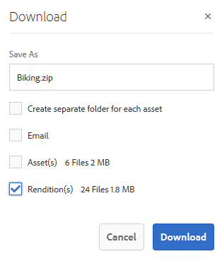

# Download assets from [!DNL Adobe Experience Manager] {#download-assets-from-aem}

静的レンディションおよび動的レンディションを含むアセットをダウンロードできます。Alternatively, you can send emails with links to assets directly from [!DNL Adobe Experience Manager Assets]. ダウンロードされたアセットは、ZIP ファイルにバンドルされています。書き出しジョブ用に圧縮する ZIP ファイルの最大サイズは 1 GB です。1 つの書き出しジョブに許可されるアセットの合計数は最大 500 個です。

>[!NOTE]
>
>電子メールの受信者は、電子メールメッセージに含まれる ZIP ダウンロードリンクにアクセスするためには、`dam-users` グループのメンバーである必要があります。アセットをダウンロードするためには、アセットのダウンロードを起動するワークフローを開始する権限が必要です。

To download assets, navigate to an asset, select the asset, and tap **[!UICONTROL Download]** from the toolbar. 表示されるダイアログで、ダウンロードオプションを指定します。

画像セット、スピンセット、混在メディアセット、カルーセルセットの各アセットタイプはダウンロードできません。



*図：からアセットをダウンロードする際に使用できるオプショ[!DNL Experience Manager Assets]ン。*

次に、書き出し／ダウンロードのオプションを示します。動的レンディションは Dynamic Media 特有の機能であり、選択したアセットに加えてレンディションもその場で生成できます。このオプションは、Dynamic Media を有効にしている場合のみ利用できます。

| 書き出しまたはダウンロードのオプション | 説明 |
|---|---|
| [!UICONTROL アセット] | レンディションを含めずに、元の形式でアセットをダウンロードする場合に選択します。 |
| [!UICONTROL レンディション] | レンディションは、アセットのバイナリ表現です。アセットは、（アップロードされたファイルの）一次表現を持ちます。アセットは任意の数の追加の表現を持つことができます。<br>このオプションを選択すると、ダウンロードするレンディションを選択できます。使用できるレンディションは、選択したアセットによって異なります。 |
| [!UICONTROL 動的レンディション] | 動的レンディションでは、他のレンディションをその場で生成します。When you select this option, you also select the renditions you want to create dynamically by selecting from the [Image Preset](image-presets.md) list. <br>さらに、サイズ、測定単位、形式、カラースペース、解像度および画像の修飾子（例：画像の反転用）を選択できます。 |
| [!UICONTROL 電子メール] | ユーザーに電子メール通知が送信されます。次の場所にある標準の電子メールテンプレートを利用できます。<ul><li>`/libs/settings/dam/workflow/notification/email/downloadasset`</li><li>`/libs/settings/dam/workflow/notification/email/transientworkflowcompleted`</li></ul> デプロイ時にカスタマイズするテンプレートは、次の場所に存在している必要があります。 <ul><li>`/apps/settings/dam/workflow/notification/email/downloadasset`</li><li>`/apps/settings/dam/workflow/notification/email/transientworkflowcompleted`</li></ul>テナント固有のカスタムテンプレートは、次の場所に保存できます。<ul><li>`/conf/<tenant_specific_config_root>/settings/dam/workflow/notification/email/downloadasset`</li><li>`/conf/<tenant_specific_config_root>/settings/dam/workflow/notification/email/transientworkflowcompleted`</li></ul> |
| [!UICONTROL アセットごとに別のフォルダーを作成] | フォルダー階層を保持したままアセットをダウンロードするには、このオプションを選択します。デフォルトでは、フォルダー階層は無視され、すべてのアセットがローカルシステムの 1 つのフォルダーにダウンロードされます。 |

アセットにレンディションがある場合は、レンディションオプションを使用できます。アセットにサブアセットが含まれている場合は、サブアセットオプションを使用できます。

ダウンロードするフォルダーを選択すると、そのフォルダーの下位のアセットの階層全体がダウンロードされます。ダウンロードする各アセット（親フォルダーの下にネストされている子フォルダーのアセットを含む）を個々のフォルダーに格納するには、「**[!UICONTROL アセットごとに別のフォルダーを作成]**」を選択します。

## アセットダウンロードサーブレットの有効化 {#enable-asset-download-servlet}

The default servlet in [!DNL Experience Manager] allows authenticated users to issue arbitrarily-large, concurrent download requests for creating ZIP files of assets visible to them that can overload the server and the network. この機能で生じる可能性がある DoS リスクを軽減するために、パブリッシュインスタンスに対しては、`AssetDownloadServlet` OSGi コンポーネントがデフォルトで無効になっています。

例えば Asset Share Commons やポータルのような実装などを使用する場合に DAM からアセットをダウンロードできるようにするには、OSGi 設定を通じてサーブレットを手動で有効にします。日常的なダウンロードの要件に影響を与えない範囲で、許容ダウンロードサイズをできるだけ小さく設定することをお勧めします。この値を大きくすれば、パフォーマンスに影響を与える可能性があります。

1. 次のように、パブリッシュ実行モードを対象とする命名規則（`config.publish`）でフォルダーを作成します。

   `/apps/<your-app-name>/config.publish`

   実行モードの設定プロパティを定義するには、「実行モ [ード](/help/sites-deploying/configure-runmodes.md#defining-configuration-properties-for-a-run-mode) 」を参照してください。

1. config フォルダーに、`nt:file` タイプのファイル `com.day.cq.dam.core.impl.servlet.AssetDownloadServlet.config` を新しく作成します。
1. `com.day.cq.dam.core.impl.servlet.AssetDownloadServlet.config` に以下を入力します。ダウンロードの最大サイズ（バイト単位）を `asset.download.prezip.maxcontentsize` の値として設定します。以下のサンプルでは、ZIP ダウンロードの最大サイズを 100 KB を超えないように設定しています。

   ```conf
   enabled=B"true"
   asset.download.prezip.maxcontentsize=I"102400"
   ```

## アセットダウンロードサーブレットの無効化 {#disable-asset-download-servlet}

 パブリッシュインスタンスの `Asset Download Servlet` を無効にするには、アセットダウンロード要求をすべてブロックするように Dispatcher 設定を更新します。[!DNL Experience Manager]サーブレットは、OSGi コンソールから手動で直接無効にすることもできます。

1. Dispatcher 設定を通じてアセットダウンロード要求をブロックするには、`dispatcher.any` 設定を編集し、[フィルターセクション](https://docs.adobe.com/content/help/en/experience-manager-dispatcher/using/configuring/dispatcher-configuration.html#defining-a-filter)に新しいルールを追加します。

   `/0100 { /type "deny" /url "*.assetdownload.zip/assets.zip*" }`

1. OSGi コンソール（`<aem-host>/system/console/components`）に移動して、パブリッシュインスタンスの OSGi コンポーネントを手動で無効にすることもできます。`com.day.cq.dam.core.impl.servlet.AssetDownloadServlet` を探して、「**[!UICONTROL 無効にする]**」をクリックします。

>[!MORELIKETHIS]
>
>* [DRM で保護されたアセットのダウンロード](drm.md)
>* [WinまたはMacデスクトップでExperience Managerデスクトップアプリケーションを使用してアセットをダウンロードする](https://helpx.adobe.com/jp/experience-manager/desktop-app/aem-desktop-app.html)
>* [サポートされている Adobe Creative Cloud アプリ内から Adobe Asset Link を使用したアセットのダウンロード](https://helpx.adobe.com/jp/enterprise/using/manage-assets-using-adobe-asset-link.html)

